Linux常见的面试题汇总


<!-- more -->

# 运维面试题总结

[参考地址](https://zhuanlan.zhihu.com/p/533165245?utm_id=0)

## 一、Linux

### linux系统启动流程

- 第一步：开机自检，加载BIOS
- 第二步：读取ＭＢＲ
- 第三步：Boot Loader grub引导菜单
- 第四步：加载kernel内核
- 第五步：init进程依据inittab文件夹来设定运行级别
- 第六步：init进程执行`rc.sysinit`
- 第七步：启动内核模块
- 第八步：执行不同运行级别的脚本程序
- 第九步：执行`/etc/rc.d/rc.lo`

### linux文件类型

| 文件属性 | 文件类型                                              |
|------|---------------------------------------------------|
| -    | 常规文件，即file                                        |
| d    | 目录文件                                              |
| b    | block device 即块设备文件，如硬盘;支持以block为单位进行随机访问         |
| c    | character device 即字符设备文件，如键盘支持以character为单位进行线性访问 |
| l    | symbolic link 即符号链接文件，又称软链接文件                     |
| p    | pipe 即命名管道文件                                      |
| s    | socket 即套接字文件，用于实现两个进程进行通信                        |

### centos6和7怎么将源码安装的程序添加到开机自启动？

通用方法：编辑`/etc/rc.d/rc.local`文件，在文件末尾添加启动服务命令

*centos6*

- ① 进入到/etc/rc.d/init.d目录下；
- ② 新建一个服务启动脚本，脚本中指定chkconfig参数；
- ③ 添加执行权限；
- ④ 执行`chkconfig --add` 添加服务自启动；

*centos7*

- ① 进入到`/usr/lib/systemd/system`目录下；
- ② 新建自定义服务文件，文件中包含`[Unit]`、`[Service]`、`[Install]`相关配置，然后添加下执行权限；
- ③ 执行 `systemctl enable` 服务名称；

### 简述lvm，如何给使用lvm的/分区扩容？

**功能：可以对磁盘进行动态管理。动态按需调整大小概念：**

- ① *PV-物理卷*：物理卷在逻辑卷管理中处于最底层，它可以是实际物理硬盘上的分区，也可以是整个物理硬盘，也可以是raid设备。

- ② *VG-卷组*：卷组建立在物理卷之上，一个卷组中至少要包括一个物理卷，在卷组建立之后可动态添加物理卷到卷组中。
  一个逻辑卷管理系统工程中可以只有一个卷组，也可以拥有多个卷组。

- ③ *LV-逻辑卷*：逻辑卷建立在卷组之上，卷组中的未分配空间可以用于建立新的逻辑卷，逻辑卷建立后可以动态地扩展和缩小空间。
  系统中的多个逻辑卷可以属于同一个卷组，也可以属于不同的多个卷组。

  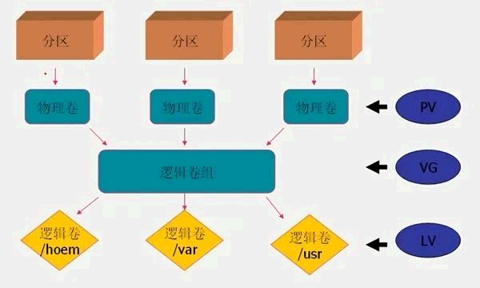

**给/分区扩容步骤：**

- ① 添加磁盘
- ② 使用`fdisk`命令对新增加的磁盘进行分区
- ③ 分区完成后修改分区类型为`lvm`
- ④ 使用`pvcreate`创建物理卷
- ⑤ 使用`vgextend`命令将新增加的分区加入到根目录分区中
- ⑥ 使用`lvextend`命令进行扩容
- ⑦ 使用`xfs_growfs`调整卷分区大小

### 为何du和df统计结果不一致？

- 用户删除了大量的文件被删除后，在文件系统目录中已经不可见了，所以du就不会再统计它。
- 然而如果此时还有运行的进程持有这个已经被删除的文件句柄，那么这个文件就不会真正在磁盘中被删除，分区超级块中的信息也就不会更改，
df仍会统计这个被删除的文件。
- 可通过 lsof命令查询处于deleted状态的文件，被删除的文件在系统中被标记为deleted。如果系统有大量deleted状态的文件，
会导致du和df统计结果不一致。

### 如何升级内核？

*方法一*

- 添加第三方yum源进行下载安装。

[Centos 6 YUM源](http://www.elrepo.org/elrepo-release-6-6.el6.elrepo.noarch.rpm)

[Centos 7 YUM源](http://www.elrepo.org/elrepo-release-7.0-2.el7.elrepo.noarch.rpm)

- 先导入elrepo的key，然后安装elrepo的yum源：

```shell
rpm -import https://www.elrepo.org/RPM-GPG-KEY-elrepo.org
rpm -Uvh http://www.elrepo.org/elrepo-release-7.0-2.el7.elrepo.noarch.rpm
```

- 查看可用的内核相关包

```shell
yum --disablerepo="*" --enablerepo="elrepo-kernel" list available
yum -y --enablerepo=elrepo-kernel install
```

*方法二*

- 通过下载kernel image的rpm包进行安装。

[官方 Centos 6](http://elrepo.org/linux/kernel/el6/x86_64/RPMS/)

[官方 Centos 7](http://elrepo.org/linux/kernel/el7/x86_64/RPMS/)

- 获取下载链接进行下载安装即可

```shell
wget https://elrepo.org/linux/kernel/el7/x86_64/RPMS/kernel-lt-4.4.185-1.el7.elrepo.x86_64.rpm

rpm -ivh kernel-lt-4.4.185-1.el7.elrepo.x86_64.rp
```

- 查看默认启动顺序

```shell
[root@localhost ~]# awk -F\' '$1=="menuentry " {print $2}' /etc/grub2.cfg
CentOS Linux (5.2.2-1.el7.elrepo.x86_64) 7 (Core)
CentOS Linux (4.4.182-1.el7.elrepo.x86_64) 7 (Core)
CentOS Linux (3.10.0-957.21.3.el7.x86_64) 7 (Core)
CentOS Linux (3.10.0-957.10.1.el7.x86_64) 7 (Core)
CentOS Linux (3.10.0-327.el7.x86_64) 7 (Core)
CentOS Linux (0-rescue-e34fb4f1527b4f2d9fc75b77c016b6e7) 7 (Core)
```

> 由上面可以看出新内核(4.12.4)目前位置在0，原来的内核(3.10.0)目前位置在1

- 设置默认启动

```shell
[root@localhost ~]# grub2-set-default 0 // 0代表当前第一行，也就是4.12.4版本
```

- 然后重启验证

### nginx日志访问量前十的ip怎么统计？

```shell
awk '{array[$1]++}END{for (ip in array)print ip,array[ip]}' access.log |sort -k2 -rn|head
```

### 如何删除/var/log/下.log结尾的30天前的日志？

```shell
find /var/log/ -type f -name .*.log -mtime 30|xargs rm -f
```

### ansible有哪些模块？功能是什么？

[Ansible 模块实例](../linux/ansible/ansible.md)

| 模块       | 功能                   |
|----------|----------------------|
| copy     | 拷贝文件到被控端             |
| cron     | 定时任务                 |
| fetch    | 拷贝被控端文件到本地           |
| file     | 文件模块                 |
| group    | 用户组模块                |
| user     | 用户模块                 |
| hostname | 主机名模块                |
| script   | 脚本模块                 |
| service  | 服务启动模块               |
| command  | 远程执行命令模块             |
| shell    | 远程执行命令模块，command高级用法 |
| yum      | 安装包组模块               |
| setup    | 查看主机系统信息             |

### nginx为什么比apache快？

- nginx采用epoll模型
- apache采用select模型

### 四层负载和七层负载区别是什么？

四层基于IP+端口进行转发

七层就是基于URL等应用层信息的负载均衡

### lvs有哪些工作模式？哪个性能高？

- dr：直接路由模式，请求由 LVS 接受，由真实提供服务的服务器直接返回给用户，返回的时候不经过 LVS。（性能最高）
- tun：隧道模式，客户端将访问vip报文发送给LVS服务器。LVS服务器将请求报文重新封装，发送给后端真实服务器。
后端真实服务器将请求报文解封，在确认自身有vip之后进行请求处理。后端真实服务器在处理完数据请求后，直接响应客户端。
- nat：网络报的进出都要经过 LVS 的处理。LVS 需要作为 RS 的网关。当包到达 LVS 时，LVS 做目标地址转换（DNAT），
将目标 IP 改为 RS 的 IP。RS 接收到包以后，仿佛是客户端直接发给它的一样。RS处理完，返回响应时，源 IP 是 RS IP，
目标 IP 是客户端的 IP。这时 RS 的包通过网关（LVS）中转，LVS 会做源地址转换（SNAT），将包的源地址改为 VIP，这样，
这个包对客户端看起来就仿佛是 LVS 直接返回给它的。客户端无法感知到后端 RS 的存在。
- fullnat模式：fullnat模式和nat模式相似，但是与nat不同的是nat模式只做了两次地址转换，fullnat模式却做了四次。

### tomcat各个目录含义，如何修改端口，如何修改内存数？

- bin 存放tomcat命令
- conf 存放tomcat配置文件
- lib 存放tomcat运行需要加载的jar包
- log 存放Tomcat运行产生的日志
- temp 运行过程中产生的临时文件
- webapps 站点目录
- work 存放tomcat运行时的编译后的文件
- conf/server.xml 修改端口号
- bin/catalina.sh 修改jvm内存

### nginx反向代理时，如何使后端获取真正的访问来源ip？

在location配置段添加以下内容：

```text
proxy_set_header Host $http_host;
proxy_set_header X-Real-IP $remote_addr;
proxy_set_header X-Forwarded-For $proxy_add_x_forwarded_for;
proxy_set_header X-Forwarded-Proto $scheme;
```

### nginx负载均衡算法有哪些？

- rr 轮训
- weight 加权轮训
- ip_hash 静态调度算法
- fair 动态调度算法
- url_hash url哈希
- leat_conn 最小连接数

### 如何进行压力测试？

例如：模拟10个用户，对百度首页发起总共100次请求。

测试命令：

```shell
ab -n 100 -c 10 https://www.baidu.com/index.htm
```

### curl命令如何发送https请求？如何查看response头信息？如何发送get和post表单信息？

发送https请求：

```shell
curl --tlsv1 'https://www.bitstamp.net/api/v2/transactions/btcusd/'
```

- response头信息 ：curl -I
- get：curl 请求地址`?key1=value1&key2=value2&key3=value3`
- post：`curl -d “key1=value1&key2=value2&key3=value3”`

## 二、mysql

### 索引的为什么使查询加快？有啥缺点？

默认的方式是根据搜索条件进行全表扫描，遇到匹配条件的就加入搜索结果集合。
如果我们对某一字段增加索引，查询时就会先去索引列表中一次
定位到特定值的行数，大大减少遍历匹配的行数，所以能明显增加查询的速度

**缺点：**

- 创建索引和维护索引要耗费时间，这种时间随着数据量的增加而增加
- 索引需要占物理空间，除了数据表占用数据空间之外，每一个索引还要占用一定的物理空间，如果需要建立聚簇索引，那么需要占用的空间会更大
- 以表中的数据进行增、删、改的时候，索引也要动态的维护，这就降低了整数的维护速度

### sql语句左外连接 右外连接 内连接 全连接区别

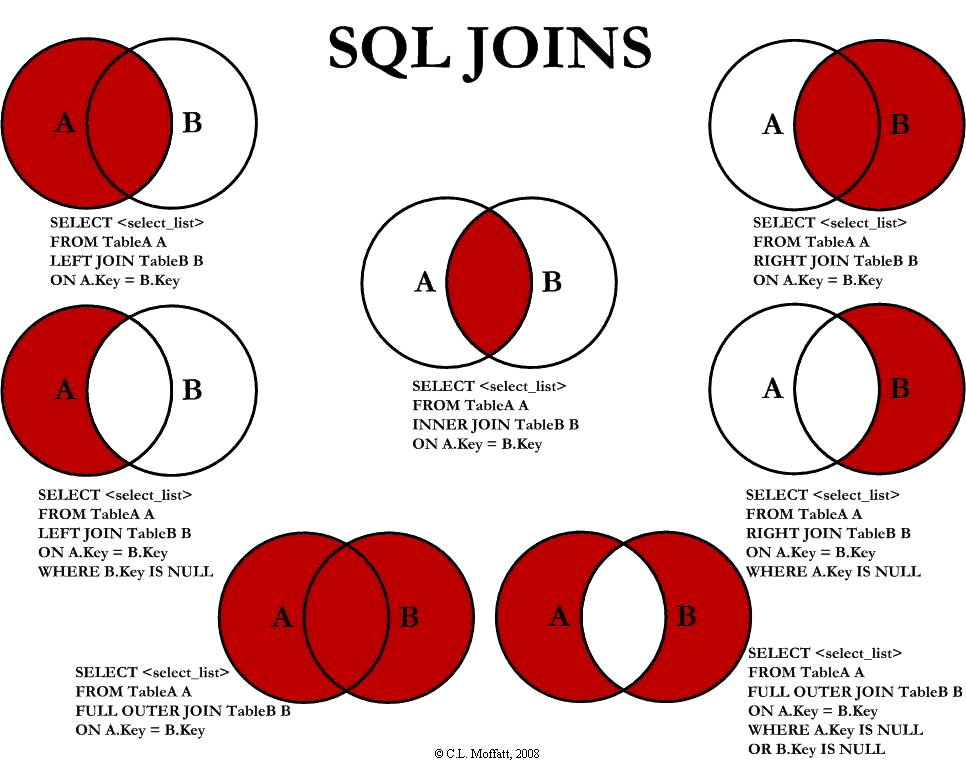

**简单的连接查询**

```sql
# 2条数据(交集)
SELECT a.id,b.id FROM a INNER JOIN b ON b.a_id=a.id
# 4条数据
SELECT a.id,b.id FROM a LEFT JOIN b ON b.a_id=a.id
# 2条数据
SELECT a.id,b.id FROM a RIGHT JOIN b ON b.a_id=a.id
```

**合并查询**

```sql
select * from emp where e_job='MANAGER'  
union
select * from emp where e_job='SALESMAN'
```

### mysql数据备份方式，如何恢复？你们的备份策略是什么？

**物理完全备份**

```text
备份所有数据库文件：/var/lib/mysql/*
备份所有binlog文件:  /var/lib/mysql/mysql-bin.*
备份选项文件: /etc/my.cnf
```

**mysqldump逻辑备份**

```shell
mysqldump -uroot -p --all-databases > /backup/mysqldump/all.db
```

**物理备份恢复**

先把原来的数据目录改名

```shell
mv /var/lib/mysql /var/lib/mysql.old  
cp -a /backups/mysql /var/lib
```

**逻辑备份数据恢复**

```shell
mysql > use db_name
mysql > source /backup/mysqldump/db_name.db
```

### 如何配置数据库主从同步，实际工作中是否遇到数据不一致问题？如何解决？

为每个服务器配置唯一值的server-id

**主库**

- 开启binlog日志
- 创建主从复制用户
- 查看master的状态

**从库**

- change master to设置主库信息
- start slave开始复制

### mysql约束有哪些？

- 非空约束
- 唯一约束
- 主键约束
- 外键约束

### 二进制日志（binlog）用途？

BINLOG记录数据库的变更过程。例如创建数据库、建表、修改表等DDL操作、以及数据表的相关DML操作，
这些操作会导致数据库产生变化，开启binlog以后导致数据库产生变化的操作会按照时间顺序以`事件`
的形式记录到binlog二进制文件中。

### mysql数据引擎有哪些？

**myisam、innodb 区别**

- InnoDB：支持事务、外键、行锁，是聚族索引，不存储表的行数，
如 `select count() from table` 时，InnoDB 需要扫描一遍整个表来计算有多少行，
但是 MyISAM 只要简单的读出保存好的行数即可；
注意的是，当 `count()` 语句包含 where 条件时 MyISAM 也需要扫描整个表；
适合频繁修改以及涉及到安全性较高的应用。
- MylSAM：不支持事务、外键；支持行锁，是非聚族索引，存储表的行数。适合查询以及插入为主的应用。
- 清空整个表时，InnoDB 是一行一行的删除，效率非常慢。MyISAM 则会重建表。
- InnoDB 支持行锁（某些情况下还是锁整表，如 `update table set a=1 where user like ‘%lee%’`。

### 引发索引失效问题

[https://blog.csdn.net/sy_white/article/details/122112440](https://blog.csdn.net/sy_white/article/details/122112440)

- 查询条件中带有or,除非所有的查询条件都建有索引，否则索引失效。
- like查询是以%开头。
- 如果列类型是字符串，那在查询条件中需要将数据用引号引用起来，否则不走索引。
- 索引列上参与计算会导致索引失效。
- 违背最左匹配原则。

### 如何查询mysql数据库存放路径？

myisam

- .frm：保护表的定义
- .myd：保存表的数据
- .myi：表的索引文件

### mysql数据库文件后缀名有哪些？用途什么？

**myisam**

- .frm：保护表的定义
- .myd：保存表的数据
- .myi：表的索引文件

**innodb**

- .frm：保存表的定义
- .ibd：表空间

### 如何修改数据库用户的密码？

**mysql8之前**

- `set password for 用户名@localhost = password('新密码');`
- `mysqladmin -u用户名 -p旧密码 password 新密码`
- `update user set password=password('123') where user='root' and host='localhost';`

**mysql8之后**

- mysql8初始对密码要求高，简单的字符串不让改。先改成:MyNewPass@123;
- `alter user 'root'@'localhost' identified by 'MyNewPass@123';`

*降低密码难度*

```shell
set global validate_password.policy=0;
set global validate_password.length=4;
```

*修改成简易密码*

```shell
alter user 'root'@'localhost'IDENTIFIED BY '1111';
```

### 如何修改用户权限？如何查看？

授权：

```shell
grant all on *.* to user@'%' identified by 'passwd'
```

查看权限

```shell
show grants for user@'%';
```

## 三、nosql

### redis数据持久化有哪些方式？

- rdb
- aof

### redis集群方案有哪些？

- 官方cluster方案
- twemproxy代理方案
- 哨兵模式
- codis
- 客户端分片

### redis如何进行数据备份与恢复？

备份

```shell
redis 127.0.0.1:6379> SAVE
```

> 创建 redis 备份文件也可以使用命令 BGSAVE，该命令在后台执行。

还原

> 只需将备份文件 (dump.rdb) 移动到 redis 安装目录并启动服务即可

```shell
redis 127.0.0.1:6379> CONFIG GET dir
```

### MongoDB如何进行数据备份？

`mongoexport / mongoimport`

`mongodump / mongorestore`

### kafka为何比redis rabbitmq快？

[参考](https://www.zhihu.com/question/22480085)

## 四、docker

### dockerfile有哪些关键字？用途是什么？

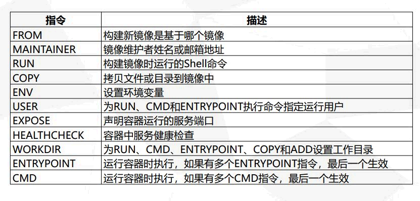

### 如何减小dockerfile生成镜像体积？

- 尽量选取满足需求但较小的基础系统镜像，例如大部分时候可以选择debian:wheezy或debian:jessie镜像，仅有不足百兆大小；
- 清理编译生成文件、安装包的缓存等临时文件；
- 安装各个软件时候要指定准确的版本号，并避免引入不需要的依赖；
- 从安全角度考虑，应用要尽量使用系统的库和依赖；
- 如果安装应用时候需要配置一些特殊的环境变量，在安装后要还原不需要保持的变量值；

### dockerfile中CMD与ENTRYPOINT区别是什么？

- CMD 和 ENTRYPOINT 指令都是用来指定容器启动时运行的命令。
- 指定 ENTRYPOINT 指令为 exec 模式时，CMD指定的参数会作为参数添加到 ENTRYPOINT 指定命令的参数列表中。

### dockerfile中COPY和ADD区别是什么？

- COPY指令和ADD指令都可以将主机上的资源复制或加入到容器镜像中
- 区别是ADD可以从 远程URL中的资源不会被解压缩。
- 如果是本地的压缩包ADD进去会被解压缩

### docker的cs架构组件有哪些？

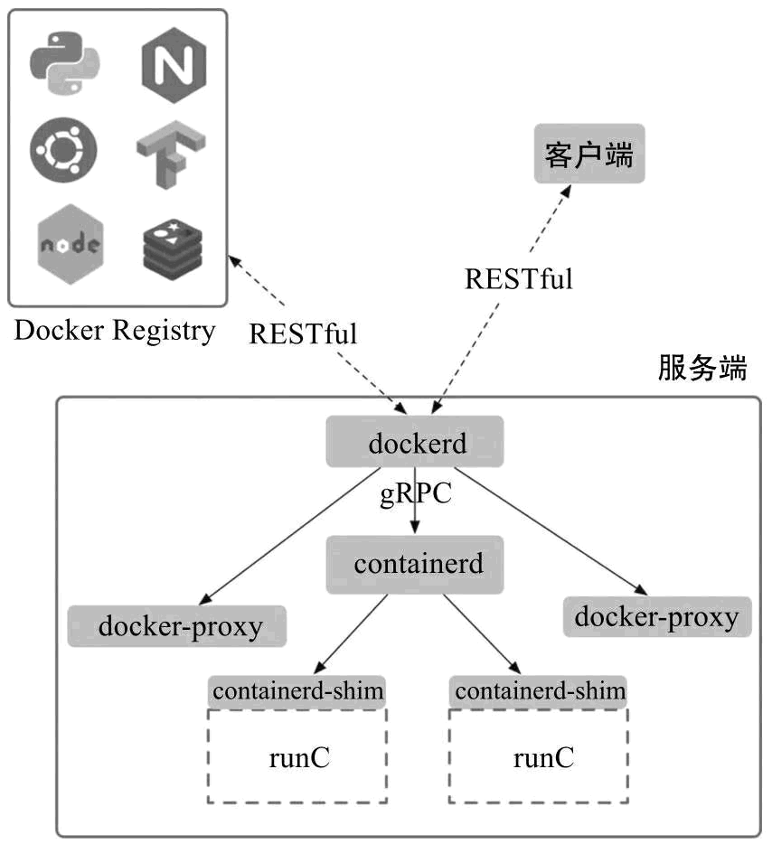

### docker网络类型有哪些？

- host模式
- container模式
- none模式
- bridge模式

### 如何配置docker远程访问？

```shell
vim /lib/systemd/system/docker.service
```

在ExecStart=后添加配置，注意，需要先空格后，再输入

```shell
-H tcp://0.0.0.0:2375 -H unix:///var/run/docker.sock
```

### docker核心namespace CGroups 联合文件系统功能是什么？

- namespace：资源隔离
- cgroup：资源控制
- 联合文件系统：支持对文件系统的修改作为一次提交来一层层的叠加，同时可以将不同目录挂载到同一个虚拟文件系统下

### 导入导出镜像，进入容器，设置重启容器策略，查看镜像环境变量，查看容器占用资源

- 导入镜像 `docker load -i xx.tar`
- 导出镜像 `docker save -o xx.tar image_name`
- 进入容器 `docker exec -it 容器ID /bin/bash`
- 设置容器重启策略启动时 `--restart` 选项
- 查看容器环境变量 `docker exec {containerID} env`
- 查看容器资源占用 `docker stats test2`

### 构建镜像有哪些方式？

- dockerfile：`docker build -f 文件`
- 容器提交为镜像： `docker commit -m "" -a "" 容器ID 镜像名称:版本`

### docker和vmware虚拟化区别？

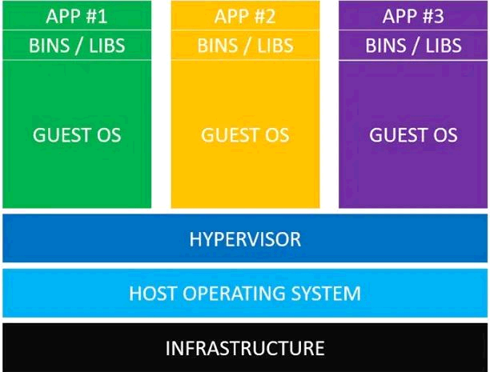

## 五、kubernetes

### k8s的集群组件有哪些？功能是什么？

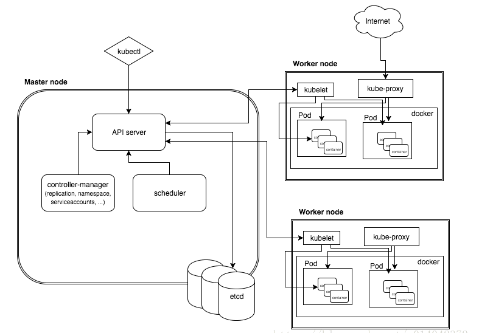

### kubectl命令相关：如何修改副本数，如何滚动更新和回滚，如何查看pod的详细信息，如何进入pod交互？

- *修改副本数*

```shell
kubectl scale deployment redis --replicas=3
```

- *活动更新*

```shell
kubectl set image deployments myapp-deploy myapp=myapp:v2
```

- *回滚*

```shell
kubectl rollout undo deployments myapp-deploy
```

- *查看pod详细信息*

```shell
kubectl describe pods/<pod-name>
```

- *进入pod交互*

```shell
kubectl exec -it <pod-name> -c <container-name> bash
```

### etcd数据如何备份？

```shell
etcdctl --endpoints=“https://192.168.32.129:2379,https://192.168.32.130:2379,192.168.32.128:2379”
--cacert=/etc/kubernetes/cert/ca.pem --key=/etc/etcd/cert/etcd-key.pem --cert=/etc/etcd/cert/etcd.pem snapshot save
```

```shell
snashot1.dbSnapshot saved at snashot1.db
```

### k8s控制器有哪些？

- 副本集（ReplicaSet）
- 部署（Deployment）
- 状态集（StatefulSet）
- Daemon集（DaemonSet）
- 一次任务（Job）
- 计划任务（CronJob）
- 有状态集（StatefulSet）

### 哪些是集群级别的资源？

- Namespace
- Node
- Role
- ClusterRole
- RoleBinding
- ClusterRoleBinding

### pod状态有哪些？

- Pending 等待中
- Running 运行中
- Succeeded 正常终止
- Failed 异常停止
- Unkonwn 未知状态

### pod创建过程是什么？

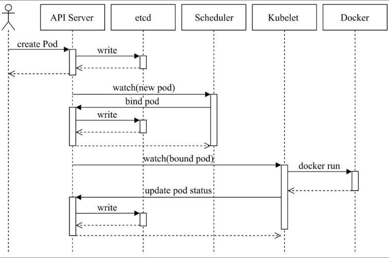

### pod重启策略有哪些？

Pod的重启策略有3种，默认值为Always。

- Always ：容器失效时，kubelet 自动重启该容器；
- OnFailure ：容器终止运行且退出码不为0时重启；
- Never ：不论状态为何， kubelet 都不重启该容器

### 资源探针有哪些？

- ExecAction：在容器中执行一个命令，并根据其返回的状态码进行诊断的操作称为Exec探测，状态码为0表示成功，否则即为不健康状态。
- TCPSocketAction：通过与容器的某TCP端口尝试建立连接进行诊断，端口能够成功打开即为正常，否则为不健康状态。
- HTTPGetAction：通过向容器IP地址的某指定端口的指定path发起HTTP GET请求进行诊断，响应码为2xx或3xx时即为成功，否则为失败。

### requests和limits用途是什么？

- `requests` 属性定义其请求的确保可用值，即容器运行可能用不到这些额度的资源，但用到时必须要确保有如此多的资源可用。
- `limits` 属性则用于限制资源可用的最大值，即硬限制。

### kubeconfig文件包含什么内容，用途是什么？

包含集群参数（CA证书、API Server地址），客户端参数（上面生成的证书和私钥），集群context 信息（集群名称、用户名）。

### RBAC中role和clusterrole区别，rolebinding和 clusterrolebinding区别？

- Role 可以定义在一个 namespace 中，如果想要跨 namespace 则可以创建 `ClusterRole`，`ClusterRole` 具有与 `Role` 相同的
权限角色控制能力，不同的是 `ClusterRole` 是集群级别的。

- RoleBinding 适用于某个命名空间内授权，而 `ClusterRoleBinding` 适用于集群范围内的授权。

### ipvs为啥比iptables效率高？

- IPVS模式与iptables同样基于Netfilter，但是ipvs采用的hash表，iptables采用一条条的规则列表。
- iptables又是为了防火墙设计的，集群数量越多iptables规则就越多，而iptables规则是从上到下匹配，所以效率就越是低下。
- 因此当service数量达到一定规模时，hash查表的速度优势就会显现出来，从而提高service的服务性能。

### sc pv pvc用途，容器挂载存储整个流程是什么？

- PVC：Pod 想要使用的持久化存储的属性，比如存储的大小、读写权限等。
- PV ：具体的 Volume 的属性， 比如 Volume 的类型、挂载目录、远程存储服务器地址等。
- StorageClass：充当 PV 的模板。并且，只有同属于一个 StorageClass 的 PV 和 PVC，才可以绑定在一起。当然，
StorageClass 的另一个重要作用，是指定 PV 的 Provisioner（存储插件）。
这时候，如果你的存储插件支持 `Dynamic Provisioning` 的话，Kubernetes 就可以自动为你创建 PV 了。

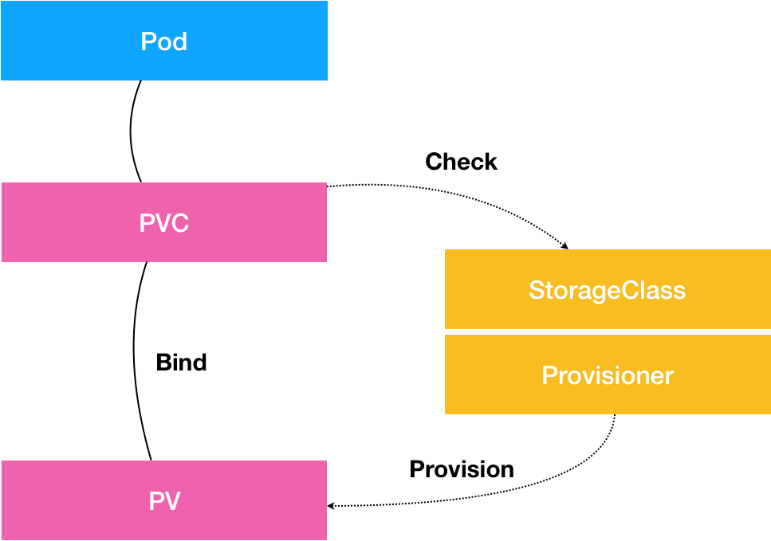

### nginx ingress的原理本质是什么？

- ngress controller通过和kubernetes api交互，动态的去感知集群中ingress规则变化，
- 然后读取它，按照自定义的规则，规则就是写明了哪个域名对应哪个service，
- 生成一段nginx配置，再写到`nginx-ingress-controller`的pod里，这个Ingress controller的pod里运行着一个Nginx服务，
控制器会把生成的nginx配置写入`/etc/nginx.conf`文件中，然后reload 一下使配置生效。以此达到域名分配置和动态更新的问题。

### 描述不同node上的Pod之间的通信流程

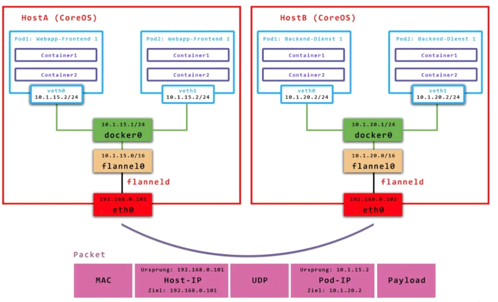

### k8s集群节点需要关机维护，需要怎么操作

- 进行pod驱逐：`kubelet drain <node_name>`
- 检查node上是否无pod运行，切被驱逐的pod已经在其他节点运行正常
- 关机维护
- 开机启动相关服务（注意启动顺序）
- 解除node节点不可调度：`kubectl uncordon node`
- 创建测试pod，并使用节点标签测试节点可以被正常调度

### canal和flannel区别

- Flannel（简单、使用居多）：基于Vxlan技术（叠加网络+二层隧道），不支持网络策略。
- Calico（较复杂，使用率少于Flannel）： 也可以支持隧道网络，但是是三层隧道（IPIP），支持网络策略。
- Calico项目既能够独立地为Kubernetes集群提供网络解决方案和网络策略，
也能与flannel结合在一起，由flannel提供网络解决方案，而Calico此时仅用于提供网络策略。

## 六、prometheus

### prometheus对比zabbix有哪些优势？

[参考](https://blog.csdn.net/wangyiyungw/article/details/85774969)

### prometheus组件有哪些，功能是什么？

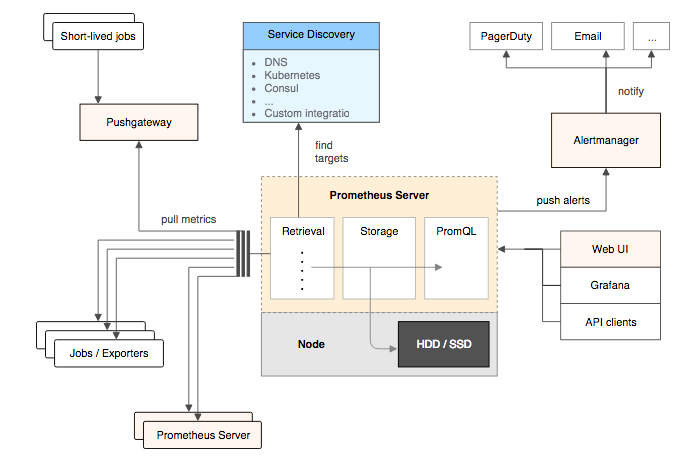

### 指标类型有哪些？

- Counter（计数器）
- Guage（仪表盘）
- Histogram（直方图）
- Summary（摘要）

### 在应对上千节点监控时，如何保障性能

- 降低采集频率
- 缩小历史数据保存天数
- 使用集群联邦和远程存储

### 简述从添加节点监控到grafana成图的整个流程

- 被监控节点安装exporter
- prometheus服务端添加监控项
- 查看prometheus web界面——status——targets
- grafana创建图表

### 在工作中用到了哪些exporter

- node-exporter监控linux主机
- cAdvisor监控容器
- MySQLD Exporter监控mysql
- Blackbox Exporter网络探测
- Pushgateway采集自定义指标监控
- process exporter进程监控

## 七、ELK

### Elasticsearch的数据如何备份与恢复？

[参考](https://www.cnblogs.com/tcy1/p/13492361.html)

[参考](https://blog.csdn.net/moxiaomomo/article/details/78401400?locationNum=8&fps=1)

### 你们项目中使用的logstash过滤器插件是什么？实现哪些功能？

- date 日期解析
- grok 正则匹配解析
- overwrite 写某个字段
- dissect 分隔符解析
- mutate 对字段做处理
- json 解析
- geoip 地理位置解析
- ruby 修改logstash event

### 是否用到了filebeat的内置module？用了哪些？

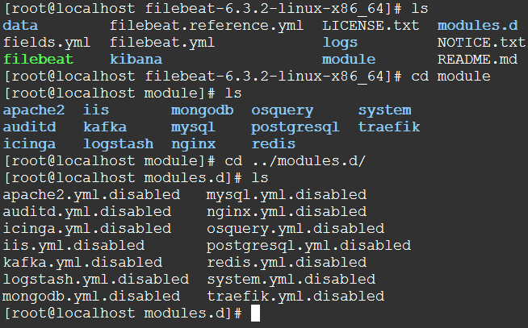

### elasticsearch分片副本是什么？你们配置的参数是多少？

[参考](https://juejin.cn/post/6844903862088777736)

## 八、运维开发

### 备份系统中所有容器镜像

备份镜像列表

### 编写脚本，定时备份某个库，然后压缩，发送异机

- 公共部分定义函数，如获取时间戳，配置报警接口
- 多使用if判断是否存在异常并处理，如数据库大，检测任务是否完成。
- 检测生成文件大小是否是空文件

### 批量获取所有主机的系统信息

- 使用python的paramiko库，ssh登陆主机执行查询操作
- 使用shell脚本批量ssh登陆主机并执行命令
- 使用ansible的setup模块获取主机信息
- prometheus的node_exporter收集主机资源信息

### django的mtv模式流程

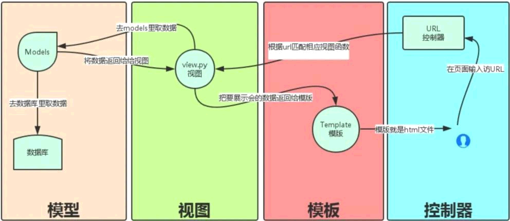

### python如何导出、导入环境依赖包

**导出环境**

```shell
pip freeze >> requirements.txt
```

**导入环境**

```shell
pip install -r requirement.txt
```

### python创建，进入，退出，查看虚拟环境

**安装软件包**

```shell
pip3 install virtualenv
```

**检测安装是否成功**

```shell
virtualenv --version
```

**创建虚拟环境cd到要创建虚拟环境的目录**

```shell
cd github/test/venv/
```

**创建虚拟环境**

```shell
virtualenv test
```

**激活虚拟环境**

```shell
source test/bin/activate(activate路径)
```

**退出虚拟环境**

```shell
deactivate
```

### flask和django区别，应用场景

- Django功能大而全，Flask只包含基本的配置
- Django的一站式解决的思路，能让开发者不用在开发之前就在选择应用的基础设施上花费大量时间。
- Django有模板，表单，路由，认证，基本的数据库管理等等内建功能。与之相反，Flask只是一个内核，默认依赖于两个外部库：
- Jinja2 模板引擎和 Werkzeug WSGI 工具集，其他很多功能都是以扩展的形式进行嵌入使用。
- Flask 比 Django 更灵活用Flask来构建应用之前，选择组件的时候会给开发者带来更多的灵活性，
可能有的应用场景不适合使用一个标准的ORM(Object-Relational Mapping 对象关联映射)，或者需要
与不同的工作流和模板系统交互

### 列举常用的git命令

- git init *初始化*
- git config *配置*
- git add *添加到本地仓库*
- git commit *提交本地仓库*
- git branch *创建分支*
- git checkout *校验、检查*
- git tag *标签*
- git push *推送*
- git status *查看状态*
- git log *查看日志*

### git gitlab jenkins的CI/CD流程如何配置

- 开发者git提交代码至gitlab仓库
- jenkins从gitlab拉取代码，触发镜像构建
- 镜像上传至harbor私有仓库
- 镜像下载至执行机器
- 镜像运行

## 九、日常工作

### 在日常工作中遇到了什么棘手的问题，如何排查

- redis弱口令导致中挖矿病毒，排查，优化
- k8s中开发的程序在用户上传文件时开启进程，未及时关闭，导致节点超出最大进程数

### 日常故障处理流程

- 查看报警内容，快速定位大致故障主机，服务，影响范围
- 告知运维经理故障，并开始排查
- 如果需要修改配置文件，重启服务器等操作，告知相关开发人员
- 完成故障处理

### 修改线上业务配置文件流程

- 先告知运维经理和业务相关开发人员
- 在测试环境测试，并备份之前的配置文件
- 测试无误后修改生产环境配置
- 观察生产环境是否正常，是否有报警
- 完成配置文件更改

### 业务pv多少？集群规模多少？怎么保障业务高可用？

## 十、开放性问题

### 你认为初级运维工程师和高级运维工程师的区别？

### 你认为未来运维发展方向?
