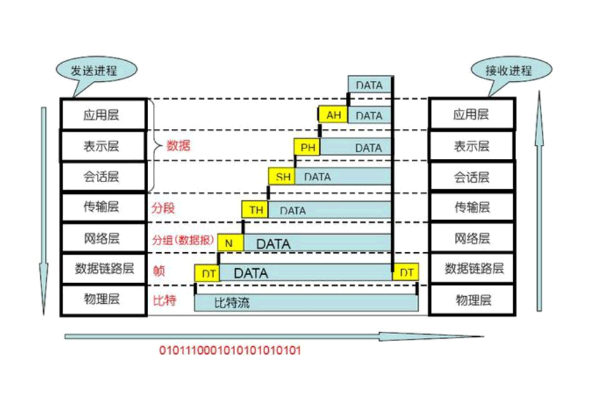
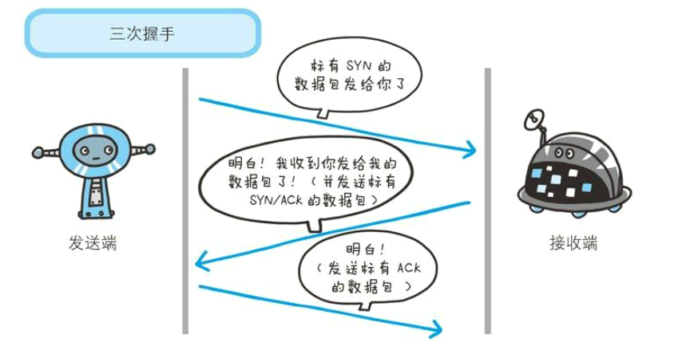

常见的网络相关面试题

<!-- more -->

## 基础

### 网络4-5-7模型




## TCP

TCP 在传输之前会进行三次沟通，一般称为“三次握手”，传完数据断开的时候要进行四次沟通，一般称为“四次挥手”。

### 三次握手



- 客户端–发送带有 SYN 标志的数据包–⼀次握⼿–服务端
- 服务端–发送带有 SYN/ACK 标志的数据包–⼆次握⼿–客户端
- 客户端–发送带有带有 ACK 标志的数据包–三次握⼿–服务端

### 为什么要三次握⼿？

三次握⼿的⽬的是建⽴可靠的通信信道，说到通讯，简单来说就是数据的发送与接收，⽽三次握
⼿最主要的⽬的就是双⽅确认⾃⼰与对⽅的发送与接收是正常的。

### 四次挥手


- 客户端-发送⼀个 FIN，⽤来关闭客户端到服务器的数据传送。
- 服务器-收到这个 FIN，它发回⼀个 ACK，确认序号为收到的序号加1，和 SYN ⼀样，⼀个 FIN 将占⽤⼀个序号
- 服务器-关闭与客户端的连接，发送⼀个FIN给客户端。
- 客户端-发回 ACK 报⽂确认，并将确认序号设置为收到序号加1。

## A、B、C、D、E类IP地址划分依据

### IP地址的格式

IP 地址的格式：`IP 地址 = 网络地址 + 主机地址`

如果 IP 进行了子网划分：`则IP地址 = 网络地址 + 子网地址 + 主机地址`

网络地址 是互联网上的节点在网络中具有的逻辑地址。
MAC 地址处于`数据链路层`，IP 地址处于`网络层`，端口号处于`传输层`。

例如 IP 地址 `192.168.54.4`

显然属于一个 C 类地址，网络地址为：`192.168.54.0`

主机地址为：`0.0.0.4`。

在设计互联网络时，为了便于寻址以及层次化构造网络，每个 IP 地址包括两个标示码（ID），即网络 ID 和主机 ID。
同一个物理网络上的所有主机都使用同一个网络 ID，网络上的一个主机（包括网络上的工作站，服务器和路由器等）
有一个主机 ID 与其对应。IP 地址根据网路 ID 的不同分为 5 种类型：**A 类地址，B 类地址，C 类地址，D 类地址 和 E 类地址**。

### A类IP地址

一个 A 类 IP 地址由 *1* 个字节的网路地址和 *3* 个字节主机地址组成，网络地址的最高位必须是 “0”，最高字节网络的地址范围从`00000000-01111111`。

地址范围为：`1.0.0.0`到`126.0.0.0`。默认的子网掩码为：`255.0.0.0`。

数量：可用的 A 类网络有126 个。每个网路可以容纳`2^24-2`个，约 **1亿多** 个主机。

应用：A 类地址分配给规模特别大的网络使用。A 类网络用第一个字节表示网络本身的地址，后面三个字节作为连接于网络上的主机地址。

例如 MS 和 IBM，阿里这样公司的网络。


### B类IP地址

一个 B 类 IP 地址由 *2* 个字节的网路地址和 *2* 个字节的主机地址组成，网络地址的最高位必须是 10，

网络的地址范围从：`10000000.00000000-10111111.11111111`；

地址范围为：`128.0.0.0到191.255.255.255`，

默认的子网掩码为：`255.255.0.0`.

数量：可用的 B 类网络有：`2^8*64` 个，约有 **1.6** 万个，每个网络能容纳的主机有：`2^16`个，约 **6** 万多个。

应用：B 类地址一般分配给中性网络。

### C 类地址

一个 C 类地址由 *3* 个字节的网络地址和 *1* 个字节的主机地址组成，网路地址的最高位必须是 “110”，

即网络地址的范围是：`11000000.00000000.00000000-11011111.11111111.11111111`，

转化为 10 进制为：`192.0.0.0`到`223.255.255.255`，

默认的子网掩码为：`255.255.255.0`.

数量：可用的 C 类网络有：`2^16*32` 个，约有 **209** 万个。每个网路能容纳的主机个数为：**254** 个。

应用：C 类地址一般分配给小型网路，如一般的局域网和校园网，它连接的主机数量比较少，把用户分为若干段进行管理。

### D 类地址

D 类地址多用于多点广播（Multicast）。

D 类 IP 地址是以 `1110` 开始的，它是一个保留的地址。
它并不指向特定的网络，目前这一类地址被用在多点广播中。多点广播用来一次寻址一组计算机，它标识共享同一协议的一组计算机。

### E 类地址

以 `11110` 开始，为将来使用保留。

注：全零 "0.0.0.0" 地址对应于当前的主机，全 1 地址（`255.255.255.255`）是当前子网的广播地址。

在 IP 地址 3 种主要类型里，各保留了 3 个区域作为私有地址，其地址范围如下：

IP 地址范围

`0.0.0.0～255.255.255.255`，包括了 mask 地址。

### IP 地址划分

- A 类地址：`1.0.0.1～126.255.255.254`
- B 类地址：`128.0.0.1～191.255.255.254`
- C 类地址：`192.168.0.1～223.168.255.254`
- D 类地址：`224.0.0.1～239.255.255.254`
- E 类地址：`240.0.0.1～255.255.255.254`

### 判断两个IP地址是否是同一个网段中

> 要判断两个 IP 地址是不是在同一个网段，就将它们的 IP 地址分别与子网掩码做与运算，得到的结果一网络号，
如果网络号相同，就在同一子网，否则，不在同一子网。

例：假定选择了子网掩码255.255.254.0，现在分别将上述两个 IP 地址分别与掩码做与运算：

```
211.95.165.24 11010011 01011111 10100101 00011000
255.255.254.0 11111111 11111111 11111111 00000000

与的结果是: 11010011 01011111 10100100 00000000
```

```
211.95.164.78 11010011 01011111 10100100 01001110
255.255.254.0 11111111 11111111 11111111 00000000

与的结果是: 11010011 01011111 10100100 00000000
```

可以看出, 得到的结果 (这个结果就是网络地址) 都是一样的，因此可以判断这两个 IP 地址在同一个子网。

### 如果没有进行子网划分

- A 类网络的子网掩码为 `255.0.0.0`
- B 类网络的子网掩码为 `255.255.0.0`
- C 类网络的子网掩码为 `255.255.255.0`
- 缺省情况子网掩码为 `255.255.255.0`
