<!-- more -->

# Centos7 Docker使用

## 前导

Docker 包括三个基本概念:

- **镜像（Image）**：Docker 镜像（Image），就相当于是一个 root 文件系统。比如官方镜像 ubuntu:16.04 就包含了完整的一套 Ubuntu16.04 最小系统的 root 文件系统。
- **容器（Container）**：镜像（Image）和容器（Container）的关系，就像是面向对象程序设计中的类和实例一样，镜像是静态的定义，容器是镜像运行时的实体。容器可以被创建、启动、停止、删除、暂停等。
- **仓库（Repository）**：仓库可看成一个代码控制中心，用来保存镜像。

| Docker | 面向对象 |
| :----- | :------- |
| 镜像   | 类       |
| 容器   | 对象     |

| 概念                   | 说明                                                         |
| :--------------------- | :----------------------------------------------------------- |
| Docker 镜像(Images)    | Docker 镜像是用于创建 Docker 容器的模板，比如 Ubuntu 系统。  |
| Docker 容器(Container) | 容器是独立运行的一个或一组应用，是镜像运行时的实体。         |
| Docker 客户端(Client)  | Docker 客户端通过命令行或者其他工具使用 Docker SDK (<https://docs.docker.com/develop/sdk/>) 与 Docker 的守护进程通信。 |
| Docker 主机(Host)      | 一个物理或者虚拟的机器用于执行 Docker 守护进程和容器。       |
| Docker Registry        | Docker 仓库用来保存镜像，可以理解为代码控制中的代码仓库。一个 Registry 中可以包含多个仓库（Repository）；每个仓库可以包含多个标签（Tag）；每个标签对应一个镜像。通常，一个仓库会包含同一个软件不同版本的镜像，而标签就常用于对应该软件的各个版本。我们可以通过 **<仓库名>:<标签>** 的格式来指定具体是这个软件哪个版本的镜像。如果不给出标签，将以 **latest** 作为默认标签。 |
| Docker Machine         | Docker Machine是一个简化Docker安装的命令行工具，通过一个简单的命令行即可在相应的平台上安装Docker，比如VirtualBox、 Digital Ocean、Microsoft Azure。 |

---

## 一、下载与安装

请确保您 [满足先决条件](https://docs.docker.com/engine/install/centos/#prerequisites)，然后 [安装Docker](https://docs.docker.com/engine/install/)。

安装 [window](https://docs.docker.com/desktop/windows/install/)、[linux](https://docs.docker.com/desktop/linux/install/debian/) 桌面版

```
sudo apt-get -y install ./docker-desktop-4.8.1-amd64.deb
```

### A、前提条件

#### 1、卸载旧版本

```bash
sudo yum remove docker docker-client docker-client-latest docker-common docker-latest docker-latest-logrotate docker-logrotate docker-engine 

sudo apt-get remove docker docker-engine docker.io containerd runc
sudo apt-get update

sudo apt-get -y install apt-transport-https ca-certificates curl gnupg2 software-properties-common lsb-release
```

### B、安装方法

#### 1、设置存储库《centos》

centos

```bash
---------华为--------------
1、若您安装过docker，需要先删掉，之后再安装依赖:
sudo yum remove docker docker-common docker-selinux docker-engine
sudo yum install -y yum-utils device-mapper-persistent-data lvm2
2、下载repo文件
sudo wget -O /etc/yum.repos.d/docker-ce.repo https://repo.huaweicloud.com/docker-ce/linux/centos/docker-ce.repo
软件仓库地址替换为：
sudo sed -i 's+download.docker.com+repo.huaweicloud.com/docker-ce+' /etc/yum.repos.d/docker-ce.repo
3、更新索引文件
sudo yum makecache fast
yum list docker-ce --showduplicates | sort -r
sudo yum -y install docker-ce-[VERSION]
```

debian

```ABAP
##########卸载旧版本
sudo apt-get remove docker docker-engine docker.io
sudo apt-get purge docker-ce docker-ce-cli containerd.io docker-compose-plugin

##########安装必要的一些系统工具
sudo apt-get -y install apt-transport-https ca-certificates curl gnupg2 software-properties-common lsb-release

##########信任Docker的GPG公钥:
sudo mkdir -p /etc/apt/keyrings
curl -fsSL https://repo.huaweicloud.com/docker-ce/linux/debian/gpg | sudo gpg --dearmor -o /etc/apt/keyrings/docker.gpg

##########添加软件仓库:设置 稳定 存储库
echo "deb [arch=$(dpkg --print-architecture) signed-by=/etc/apt/keyrings/docker.gpg] https://repo.huaweicloud.com/docker-ce/linux/debian $(lsb_release -cs) stable" | sudo tee /etc/apt/sources.list.d/docker.list > /dev/null

##########
sudo apt-get update
apt-cache madison docker-ce
sudo apt-get -y install docker-ce docker-ce-cli containerd.io docker-compose-plugin
```

#### 2、添加Docker官方的GPG密钥

```bash
-----------------debian
sudo mkdir -p /etc/apt/keyrings
curl -fsSL https://download.docker.com/linux/debian/gpg | sudo gpg --dearmor -o /etc/apt/keyrings/docker.gpg
-----------------centos
curl -fsSL https://download.docker.com/linux/ubuntu/gpg | sudo gpg --dearmor -o /usr/share/keyrings/docker-archive-keyring.gpg
```

设置 **稳定** 存储库

```bash
-----------------debian
echo \
  "deb [arch=$(dpkg --print-architecture) signed-by=/etc/apt/keyrings/docker.gpg] https://download.docker.com/linux/debian \
  $(lsb_release -cs) stable" | sudo tee /etc/apt/sources.list.d/docker.list > /dev/null
-----------------centos
echo \
  "deb [arch=$(dpkg --print-architecture) signed-by=/usr/share/keyrings/docker-archive-keyring.gpg] https://download.docker.com/linux/ubuntu \
  $(lsb_release -cs) stable" | sudo tee /etc/apt/sources.list.d/docker.list > /dev/null
```

> sudo apt-get update

#### 3、安装

***（1、2 选其一安装）****

1 **默认最新版本**

```bash
sudo yum -y install docker-ce docker-ce-cli containerd.io
sudo apt-get -y install docker-ce docker-ce-cli containerd.io
基础环境、docker、k8s环境准备ok，但未安装docker、k8s
```

2 **指定版本**

```bash
apt-cache madison docker-ce
 docker-ce | 5:20.10.14~3-0~ubuntu-impish
 docker-ce | 5:20.10.13~3-0~ubuntu-impish
 docker-ce | 5:20.10.12~3-0~ubuntu-impish
sudo yum install docker-ce 
yum list docker-ce --showduplicates | sort -r

## 格式
sudo yum -y install docker-ce-<VERSION_STRING> docker-ce-cli-<VERSION_STRING> containerd.io
sudo apt-get -y install docker-ce=<VERSION_STRING> docker-ce-cli=<VERSION_STRING> containerd.io docker-compose-plugin
## 栗：
sudo yum -y install docker-ce-20.10.8-3.el8 docker-ce-cli-20.10.8-3.el8 containerd.io --allowerasing
# deepin:
sudo apt-get -y install docker-ce=5:20.10.14~3-0~ubuntu-impish docker-ce-cli=5:20.10.14~3-0~ubuntu-impish containerd.io
apt-get -y install docker-ce= docker-ce-cli= containerd.io docker-compose-plugin
```

[设置镜像加速](#加速)

1 **启动Docker**

```bash
sudo systemctl start docker
sudo systemctl restart docker
sudo systemctl stop docker
sudo systemctl enable docker
sudo systemctl disable docker
sudo systemctl status docker
```

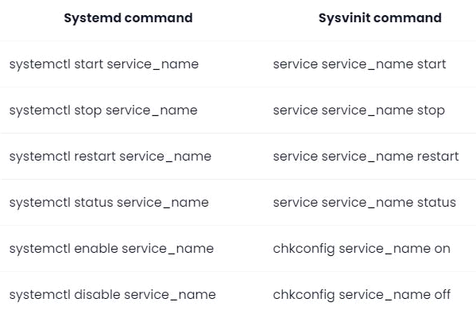

#### 非root用户

```bash
sudo usermod -aG docker jf123 #非root用户
```

请记住注销并重新登录才能生效！

### C、卸载Docker

卸载Docker Engine，CLI和Containerd软件包：

```bash
sudo yum remove docker-ce docker-ce-cli containerd.io
sudo apt-get purge docker-ce docker-ce-cli containerd.io
```

主机上的映像，容器，卷或自定义配置文件不会自动删除。要删除所有图像，容器和卷：

```bash
sudo rm -rf /var/lib/docker
sudo rm -rf /var/lib/containerd
```

您必须手动删除所有已编辑的配置文件。

## 二、Docker 镜像加速<a name="加速"></a>

[华为加速](https://console.huaweicloud.com/swr/?region=cn-north-4#/app/swr/huaweiOfficialList)

[阿里云镜像](https://cr.console.aliyun.com/cn-hangzhou/instances/mirrors)

### 2、在/etc/docker配置daemon.json

基本

```json
sudo mkdir -p /etc/docker

sudo tee /etc/docker/daemon.json <<-'EOF'
{
  "registry-mirrors": [
    "https://04eo9xup.mirror.aliyuncs.com",
    "https://098cc8006500f4db0f2fc01937bbce40.mirror.swr.myhuaweicloud.com"
  ]
}
EOF
```

k8s集群

```json
sudo mkdir -p /etc/docker

cat -s <<EOF > /etc/docker/daemon.json
{
  "exec-opts": ["native.cgroupdriver=systemd"],
  "log-driver": "json-file",
  "log-opts": {
    "max-size": "100m"
  },
  "storage-driver": "overlay2",
  "registry-mirrors": [
    "https://04eo9xup.mirror.aliyuncs.com",
    "https://098cc8006500f4db0f2fc01937bbce40.mirror.swr.myhuaweicloud.com"
  ]
}

EOF
```

```json
"https://04eo9xup.mirror.aliyuncs.com",
"https://hub-mirror.c.163.com",
"https://ustc-edu-cn.mirror.aliyuncs.com/",
"https://mirror.baidubce.com",
"https://docker.mirrors.ustc.edu.cn"
```

# 启动服务

sudo systemctl daemon-reload
sudo systemctl restart docker

## 三、常用操作指令

sudo vim ~/.bashrc

```BASH
###some more ls aliases
alias rmf='rm -rf'
alias ll='ls -l'
alias la='ls -all'
alias ggroup='cat /etc/group'
alias gpasswd='cat /etc/passwd'
alias stdk='systemctl start docker'
alias restdk='systemctl restart docker'
alias stopdk='systemctl stop docker'
alias enabledk='systemctl enable docker'
alias disabledk='systemctl disable docker'

#镜像检索
alias dkse='docker search'      #镜像名称
alias dklogin='docker login'    #登录远程镜像仓库
#推送
alias dkpull='docker pull'      #镜像名称
alias dkcommit='docker commit'  #提交容器为镜像         [-a='作者' -m='备注' 运行时容器ID 新镜像名称]
alias dkb='docker build'        #file文件构建镜像       [-f [DockerFile文件] -t [设置标签]:版本 . ]
alias dktag='docker tag'        #设置镜像为阿里|xx标签  [容器ID [设置标签]:version]
alias dkpush='docker push'      #镜像提交到仓库         [输入设置好的标签:verison]
#镜像列表
alias dki='docker images'       #镜像名称or镜像Id
#镜像删除
alias dkrmi='docker rmi'        #镜像名称or镜像Id
alias dkrmif='docker rmi -f'
#删除所有镜像
alias dkrmia='docker rmi $(docker images -q)'
#容器列表
alias dkps='docker ps'  #在运行的容器
alias dkpsa='docker ps -a'      #全部容器
#启动容器
alias dkstart='docker start'    #容器名称or容器Id
alias dkrestart='docker restart'  #容器名称or容器Id
#停止容器
alias dkstop='docker stop'      #stop 容器名称or容器Id
alias dkkill='docker kill'      #docker kill 容器ID or 容器名
#删除容器
alias dkrm='docker rm'  #docker rm 容器id
#强制删除容器
alias dkrmf='docker rm -f'      #容器ID1  容器ID2 中间空格隔开
alias dkrma='docker rm $(docker ps -a -q)'      #删除所有容器

# 宿主机和容器之间文件拷
#docker cp 容器ID:容器目录   宿主机目录
#docker cp 需要拷贝的文件或者目录  容器ID:容器目录
alias dkcp='docker cp'
#容器日志
alias dklogs='docker logs'      #容器名称/容器id
```

### --- 镜像 ---

#### 1、docker镜像检索

```bash
# docker search 镜像名
sudo docker search centos
```

#### 2、docker镜像下载

可以在这里查看镜像： <https://hub.docker.com/_/centos?tab=tags&page=1>

```bash
# docker pull 镜像名
sudo docker pull centos:centos7
```

#### 3、docker镜像列表

```bash
sudo docker images
```

| REPOSITORY | 镜像的仓库源                                                 |
| ---------- | ------------------------------------------------------------ |
| TAG        | 镜像的标签（版本）同一个仓库有多个TAG的镜像，多个版本；我们用REPOSITORY:TAG来定义不同的镜像； |
| IMAGE ID   | 镜像ID，镜像的唯一标识                                       |
| CREATE     | 镜像创建时间                                                 |
| SIZE       | 镜像大小                                                     |

**OPTIONS 可选参数：**

| -a         | 显示所有镜像（包括中间层） |
| ---------- | -------------------------- |
| **-**q     | 只显示镜像ID               |
| -qa        | 可以组合                   |
| --digests  | 显示镜像的摘要信息         |
| --no-trunc | 显示完整的镜像信息         |

#### 4、docker镜像删除

```bash
# docker rmi  image-id (镜像id)
sudo docker rmi 34336sdf12
sudo docker rmi 34336sdf12 5525636f12
```

#### 5、删除所有镜像

```bash
sudo docker rmi  $(docker images -q)
```

### --- 容器 ---

#### 指令

```bash
--name="容器新名字"：为容器指定一个名称；
-i：以交互模式运行容器，通常与-t或者-d同时使用；
-t：为容器重新分配一个伪输入终端，通常与-i同时使用；
-d: 后台运行容器，并返回容器ID；
-P: (大写)随机端口映射，容器内部端口随机映射到主机的端口
-p: 指定端口映射，格式为：主机(宿主)端口:容器端口
```

#### 1、创建并运行容器

```bash
 启动普通容器： docker run --name 别名 镜像ID  
 启动交互式容器：  docker run -it --name 别名 镜像ID 
# docker run 镜像命名
sudo docker run centos
# 指定容器名
sudo docker run --name webcentos  centos
# 以守护进程的方式运行容器
sudo docker run --name webcentos -d centos

sudo docker run -itd centos:centos7 /bin/bash
[root@0f6665eda526 /]# ls
anaconda-post.log  dev  home  lib64  mnt  proc  run   srv  tmp  var
bin                etc  lib   media  opt  root  sbin  sys  usr
```

#### 2、容器列表

```bash
sudo docker ps
sudo docker ps -a
```

#### 3、启动容器

```bash
# docker start 容器名称/容器Id
# docker restart 容器名称/容器Id
sudo docker start webcentos
```

#### 4、停止容器

```bash
# docker  stop 容器名称/容器Id
sudo docker stop webcentos
#暴力删除，直接杀掉进程 （不推荐）
sudo docker kill 容器ID or 容器名
```

#### 5、删除容器

```bash
# docker rm 容器id
sudo docker rm 235483s15c
# 强制删除docker rm -f 容器ID
sudo docker rm -f 235483s15c
#删除多个容器 
#docker rm -f 容器ID1  容器ID2 中间空格隔开
sudo docker rm -f 235483s15c 235483s169
```

#### 6、删除所有容器

```bash
sudo docker rm $(docker ps -a -q)
```

#### 7、容器日志

```bash
# docker logs 容器名称/容器id
sudo docker logs webcentos
```

#### 8、登陆、进入\退出容器

```bash
# docker attach 容器名称/容器id
# docker exec：推荐大家使用 docker exec 命令，因为此退出容器终端，不会导致容器的停止。
# docker exec -it 容器名称/容器id  /bin/bash
docker exec -itd  /bin/bash
sudo docker exec -it webcentos /bin/bash
# exit 退出
```

　　其中， -t 选项让Docker分配一个伪终端（ pseudo-tty）并绑定到容器的标准输入上， -i 则让容器的标准输入保持打开。

#### 9、宿主机和容器之间文件拷贝

```bash
#docker cp 容器名称：容器目录   宿主机目录
[root@hdas software]# sudo docker cp 45bb56e75d40:/software/a/ /software/
[root@hdas software]# ll
total 28
drwxr-xr-x. 2 root root     6 May 24 20:39 a

# docker cp 需要拷贝的文件或者目录  容器名称：容器目录
[root@hdas software]# sudo docker cp /d/soft-win/jdk/jdk-17.0.3_linux-x64_bin.tar.gz centos7:/soft
[root@hdas software]# sudo docker exec -it 45bb56e75d40 /bin/bash
[root@45bb56e75d40 /]# cd software/
[root@45bb56e75d40 software]# ll
total 0
drwxr-xr-x. 2 root root 6 May 24 12:39 a
drwxr-xr-x. 2 root root 6 May 24 12:42 b
```

#### 10、提交运行时容器成为镜像 commit

```bash
docker commit -a='作者' -m='备注' 运行时容器ID 新镜像名称:[版本]

# sudo docker ps
CONTAINER ID   IMAGE            COMMAND 
c8e6eb47f268   centos:centos7  "/bin/bash"  

# sudo docker images
REPOSITORY          TAG                 IMAGE ID            CREATED             SIZE
centos              centos7             b5b4d78bc90c        2 weeks ago         203MB
-----------------------------------------------------------------
docker commit -a='jf' -m='jf' ce4ad0d3dd40 centos:7.9-jdk17
$ docker commit -a='yu' -m='no log tomcat' c8e6eb47f268 yu/centos7:1.0

# sudo docker images
REPOSITORY          TAG                 IMAGE ID            CREATED             SIZE
yu/centos7          1.0                 3642a1c65bfe        5 seconds ago       203MB
centos              centos7             b5b4d78bc90c        2 weeks ago         203MB
```

#### 11、推送镜像到hub服务器

<https://hub.docker.com/> 注册得到docker id和密码,用docker login登陆hub服务器,docker push推送

查看: 登陆 <https://hub.docker.com/>  点击 Repositories 菜单

#### 12、推送镜像到阿里云<推荐><a name="推送到阿里镜像仓库"></a>

##### a, [阿里开通镜像服务](https://cr.console.aliyun.com/)

##### b, 创建命名空间-创建镜像仓库

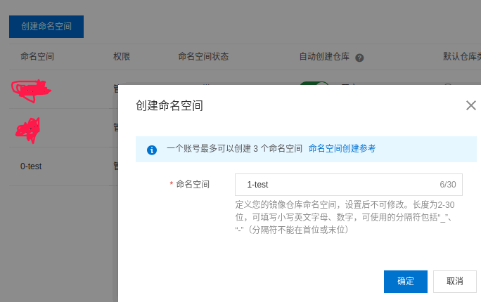

创建镜像仓库

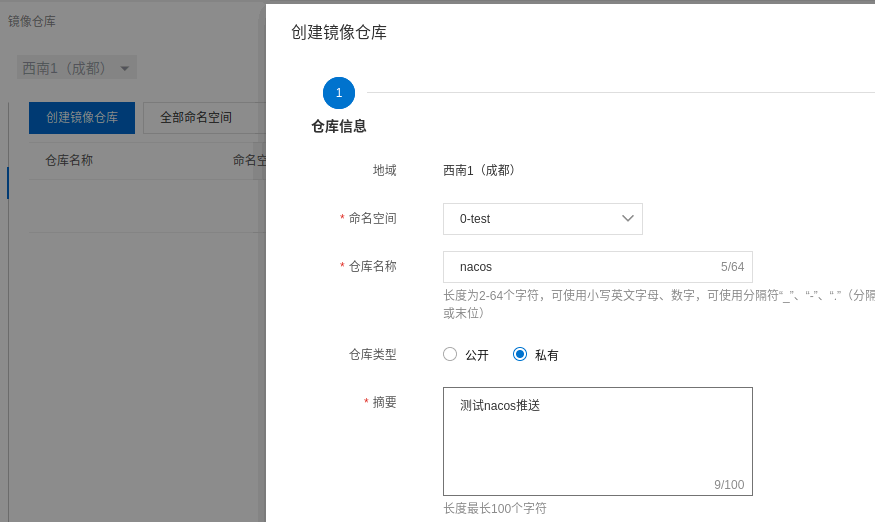

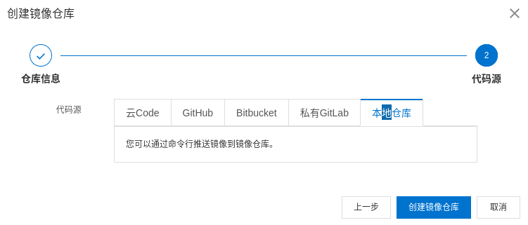

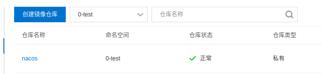

##### c. 登录阿里云Docker Registry

```bash
docker login --username=程序app registry.cn-chengdu.aliyuncs.com
```

用于登录的用户名为阿里云账号全名，密码为开通服务时设置的密码。

##### d. 从Registry中拉取镜像

```bash
docker pull registry.cn-chengdu.aliyuncs.com/0-test/nacos:[镜像版本号]
```

##### e. 将镜像推送到Registry

```bash
docker login --username=小牛程序app registry.cn-chengdu.aliyuncs.com
docker tag [镜像ID] registry.cn-chengdu.aliyuncs.com/0-test/nacos:[镜像版本号]
docker push registry.cn-chengdu.aliyuncs.com/0-test/nacos:[镜像版本号]
```

##### g. 示例

使用"docker tag"命令重命名镜像，并将它通过专有网络地址推送至Registry。

```bash
kong@k:~$ dkps
CONTAINER ID        IMAGE                      COMMAND                  CREATED             STATUS              PORTS                               NAMES
a4dcf4c99xxx        nacos/nacos-server:1.4.2   "bin/docker-startup.…"   6 weeks ago         Up 4 hours          0.0.0.0:8848->8848/tcp              nacos
-----------------------------------------------------------------------------
kong@k:~$ dki
REPOSITORY      TAG       IMAGE ID    CREATED    SIZE
-----------------------------------------------------------------------------
kong@k:~$ docker commit -a='yu' -m='no logs' a4dcf4c99xxx yu/nacos:1.0
kong@k:~$ dki
REPOSITORY           TAG       IMAGE ID        CREATED        SIZE
yu/nacos             1.0       89f1d606e613    2 seconds ago  965MB
-----------------------------------------------------------------------------
kong@k:~$ docker tag 89f1d606e613 registry.cn-chengdu.aliyuncs.com/0-test/nacos:1.0
kong@k:~$ dki
REPOSITORY              TAG     IMAGE ID    
yu/nacos                1.0     89f1d606e613
registry.cn-chengdu.aliyuncs.com/0-test/nacos   1.0     89f1d606e613
-----------------------------------------------------------------------------
kong@k:~$ docker push registry.cn-chengdu.aliyuncs.com/0-test/nacos:1.0
```

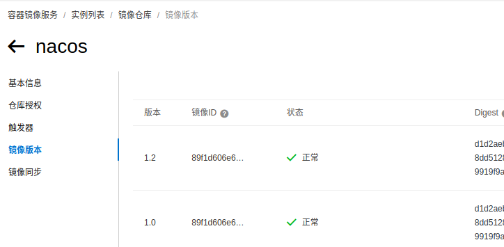

#### 13、查看容器元信息

docker inspect 容器ID

#### 14、docker update 修改容器配置

```
Usage:  docker update [OPTIONS] CONTAINER [CONTAINER...]

Update configuration of one or more containers

Options:
      --blkio-weight uint16        块IO（相对权重），介于10和1000之间，或0禁用（默认为0）
      --cpu-period int             限制CPU CFS（完全公平调度程序）周期
      --cpu-quota int              限制CPU CFS（完全公平调度程序）配额
      --cpu-rt-period int          以微秒为单位限制CPU实时周期
      --cpu-rt-runtime int         以微秒为单位限制CPU实时运行时间
  -c, --cpu-shares int             CPU份额（相对权重）
      --cpus decimal               CPU数量
      --cpuset-cpus string         允许执行的CPU（0-3，0,1）
      --cpuset-mems string         允许执行的MEMs（0-3，0,1）
      --kernel-memory bytes        内核内存限制
  -m, --memory bytes               内存限制
      --memory-reservation bytes   内存软限制
      --memory-swap bytes          交换限制等于内存加交换：“-1”以启用无限制交换
      --pids-limit int             调整容器pids限制（设置-1表示无限制）
      --restart string             当容器退出时要应用的重新启动策略
```

## 四、容器目录挂载

作用：

```bash
我们可以在创建容器的时候，将宿主机的目录与容器内的目录进行映射，这样我们就可以实现宿主机和容器目录的双向数据自动同步；
我们通过容器目录挂载，能够轻松实现代码上传，配置修改，日志同步等需求；
```

实现：

```bash
语法：
docker run -it -v /宿主机目录:/容器目录 镜像名

多目录挂载
docker run -it -v --privileged=true /宿主机目录:/容器目录 -v /宿主机目录2:/容器目录2  镜像名

注意：
如果你同步的是多级目录，可能会出现权限不足的提示；
这是因为Centos7中的安全模块selinux把权限禁掉了，我们需要添加  --privileged=true 来解决挂载的目录没有权限的问题；
```

挂载目录只读：

```bash
docker run -it -v  /宿主机目录:/容器目录:ro 镜像名
```

## 五、DockerFile 构建镜像

### 常用指令

- **FROM**  #定制的镜像都是基于 FROM 的镜像[`nginx，centos...`]
- **RUN** ["可执行文件", "参数1", "参数2"] #构建镜像时需要运行的[Linux、自定义]命令（可以写多条，建议使用 **&&** 连接符）；是在 docker build 时运行。

```shell
RUN ["./test.jar", "dev", "offline"] 等价于RUN ./test.jar dev offline
   
RUN yum -y install wget
   
RUN tar -zxvf redis.tar.gz
   
简化，使用&&连接：RUN yum -y install wget \ && RUN tar -zxvf redis.tar.gz
```

- **CMD** #指定容器启动时要运行的命令，假如有多个CMD，最后一个生效；用于运行程序，在 docker run 时运行。CMD \<shell 命令> ；

```shell
CMD ["\<可执行文件或命令\>","\<param1>","\<param2>",...] 

CMD ["\<param1>","\<param2>",...]  # 该写法是为 ENTRYPOINT 指令指定的程序提供默认参数

CMD ["\<可执行文件或命令>","\<param1>","\<param2>",...] 

CMD ["\<param1>","\<param2>",...]  # 该写法是为 ENTRYPOINT 指令指定的程序提供默认参数

```

- **MAINTAINER** xxx #声明镜像维护者信息
- **LABEL** name="xxx" \ build-date="20201212" #镜像描述元信息（可以写多条）
- **WORKDIR** /root/xx #设置终端默认登录进来的工作目录
- **EXPOSE** 8088 #当前容器对外暴露出的端口
- **ADD** 文件 容器内部目录  #将宿主机的文件复制到容器内，如果是一个压缩文件，将会在复制后**自动解压**
- **COPY** ["源文件" "容器内部路径"] #和ADD相似，但是如果有压缩文件是**不能解压**

```shell
COPY home.txt /mydir/ #路径不存在的话，会自动创建。
```

- **VOLUME** #创建一个可以从本地主机或其他容器挂载的挂载点，一般用来存放数据库和需要保持的数据等
- **ENV** \<key>=< value>：为容器设置 Linux 环境变量 ，定义了环境变量，那么在后续的指令中，就可以使用这个环境变量。

```shell
ENV JAVA_HOME /home/jdk1.8.0_151
ENV CLASSPATH \$JAVA_HOME/lib/dt.jar:$JAVA_HOME/lib/tools.jar
```

- **ARG** \<key>=< value>： 设置环境变量，环境变量只作用于Dockerfile内。
- **ENTRYPOINT** #指定容器启动时要运行的命令

```shell
ENTRYPOINT ["\<executeable>","\<param1>","\<param2>",...]
ENTRYPOINT nginx -g "daemon off;"
```

- **USER** 用于指定执行后续命令的用户和用户组 USER 用户名:用户组
  - USER kong:k
- **ONBUILD**  #当构建一个被继承的Dockerfile时运行的命令，父镜像在被子镜像继承后父镜像的onbuild被触发。可以把ONBUID理解为一个触发器。

### DockerFile 示例

#### 基于nginxDockerFile<a name="nginxDockerFile"></a>

```bash
FROM nginx
MAINTAINER kong9
ADD dist-vue.tar.gz /usr/share/nginx/html
ADD conf.tar.gz /etc/nginx
EXPOSE 80
ENTRYPOINT nginx -g "daemon off;"
```

#### 基于CentosDockerFile<a name="CentosDockerFile"></a>

```bash
FROM centos
MAINTAINER kong9
LABEL name="Java1234 CentOS Image" \
    build-date="20191112"
WORKDIR $WORKPATH
RUN yum -y install net-tools
RUN yum -y install vim

EXPOSE 80
CMD /bin/bash
```

#### 基于TomcatDockerFile<a name="基于TomcatDockerFile"></a>

**tomcat:9.0.62-jre8-temurin-focal、tomcat:8.5.78-jre8-temurin-focal**

**tomcat:9.0.62-jre11-temurin-focal、tomcat:8.5.78-jre11-temurin-focal**

**tomcat:9.0.62-jre17-temurin-focal、tomcat:8.5.78-jre17-temurin-focal**

```bash
#使用的基础镜像
FROM tomcat:8.5
#启动时运行tomcat
CMD ["catalina.sh", "run"]
#设置启动命令
#ENTRYPOINT ["/usr/local/tomcat/bin/catalina.sh","run"]
```

```bash
FROM tomcat:9.0.62-jre11-temurin-focal
MAINTAINER kong9
# jdk
ADD server-jre-8u151-linux-x64.tar.gz /home/
ADD apache-tomcat-8.5.37.tar.gz /home/
# java项目的jar包
ADD eureka.jar /eureka.jar
ENV WORKPATH /home/apache-tomcat-8.5.37/
WORKDIR $WORKPATH
# 配置java环境
ENV JAVA_HOME /home/jdk1.8.0_151
ENV CLASSPATH $JAVA_HOME/lib/dt.jar:$JAVA_HOME/lib/tools.jar
ENV CATALINA_HOME /home/apache-tomcat-8.5.37/
ENV CATALINA_BASE /home/apache-tomcat-8.5.37/
ENV PATH $PATH:$JAVA_HOME/bin:$CATALINA_HOME/lib:$CATALINA_HOME/bin
EXPOSE 8080
CMD ["/home/apache-tomcat-8.5.37/bin/catalina.sh","run"]
#ENTRYPOINT ["/usr/local/tomcat/bin/catalina.sh","run"]
# 指定容器启动时要运行的命令 
ENTRYPOINT ["java","-jar","/eureka.jar"]
```

#### 基于centos7的java项目镜像<a name="基于centos7的java镜像"></a>

```bash
FROM registry.cn-chengdu.aliyuncs.com/jinfang/centos:7.9

MAINTAINER jf
LABEL name="demo"

#添加JVM参数
ENV JAVA_OPTS="-server -Xmx1024M -Xms1024M -Xmn750M -XX:MetaspaceSize=256M -XX:MaxMetaspaceSize=512M -XX:GCTimeRatio=19 -XX:+ClassUnloading"

# 项目打包后的jar包名
ENV JAR_FILE=web-1.0.0.jar
ENV JDK_FILE=jdk-17.0.3_linux-x64_bin.tar.gz

# 项目根目录
ENV ROOT_DIR=/data/web
#动态加载配置文件
ENV ROOT_DIR_CONFIG=/data/web/config
#jdk目录
ENV JAVA_DIR=/usr/local/java

RUN mkdir -p $JAVA_DIR && mkdir -p $ROOT_DIR && mkdir -p $ROOT_DIR_CONFIG

#在容器运行时声明一个 volume, 在容器中创建目录
VOLUME $ROOT_DIR
VOLUME $JAVA_DIR

#设置终端默认登录进来的工作目录
WORKDIR $ROOT_DIR

# 配置中文字符 默认：LANG="en_US.UTF-8"
# RUN echo 'LANG="zh_CN.UTF-8"' > /etc/locale.conf && source /etc/locale.conf
# RUN echo "export LC_ALL=zh_CN.UTF-8" >> /etc/profile && source /etc/profile
RUN ln -sf /usr/share/zoneinfo/Asia/Shanghai /etc/localtime \
 && yum -y install kde-l10n-Chinese \
 && yum -y reinstall glibc-common \
 && localedef -c -f UTF-8 -i zh_CN zh_CN.UTF-8 \
 && echo 'LANG="zh_CN.UTF-8"' > /etc/locale.conf \
 && source /etc/locale.conf \
 && yum clean all
ENV LANG=zh_CN.UTF-8 \
    LC_ALL=zh_CN.UTF-8

# 配置jdk
COPY ./$JDK_FILE $JAVA_DIR
# RUN 构建镜像时需要运行的Linux命令、CMD #指定容器启动时要运行的命令
RUN tar -zxvf $JAVA_DIR/$JDK_FILE -C $JAVA_DIR && rm -rf $JAVA_DIR/$JDK_FILE
# 设置环境变量
ENV JAVA_HOME=$JAVA_DIR/jdk-17.0.3
ENV CLASSPATH=.:$JAVA_HOME/lib:$CLASSPATH
ENV PATH=$PATH:$JAVA_HOME/bin
# RUN source /etc/profile && java -version
CMD ["source","/etc/profile","java","-version"]

# java项目的jar包
COPY ./target/$JAR_FILE $ROOT_DIR
COPY ./src/main/resources $ROOT_DIR_CONFIG

RUN echo "java -Djava.security.egd=file:/dev/./urandom ${JAVA_OPTS} -jar $ROOT_DIR/$JAR_FILE" > /run_module.sh

# 当前容器对外暴露出的端口
EXPOSE 51155
EXPOSE 51156
EXPOSE 51157

# 指定容器启动时要运行的命令
#ENTRYPOINT ["java","-jar","/web-1.0.0.jar","--spring.profiles.active=prod"]
ENTRYPOINT ["/bin/bash", "/run_module.sh"]
#["java","-Djava.security.egd=file:/dev/./urandom","-jar","/home/javacode.jar"]
```

#### 基于jdk的java项目镜像<推荐><a name="基于jdk的java镜像"></a>

```bash

# 添加JAVA启动的必要镜像，推荐使用jre版本
# openjdk:8-jre(295.16 MB)、openjdk:11-jre(328.63 MB)、openjdk:17-jdk|oracle(492.57 MB)
FROM registry.cn-chengdu.aliyuncs.com/jinfang/openjdk:17-jdk
#声明镜像维护者信息
MAINTAINER jf
#镜像描述元信息
LABEL name="web"

#添加JVM参数
ENV JAVA_OPTS="-server -Xmx1024M -Xms1024M -Xmn750M -XX:MetaspaceSize=256M -XX:MaxMetaspaceSize=512M -XX:GCTimeRatio=19 -XX:+ClassUnloading"

# 项目打包后的jar包名
ENV JAR_FILE=web-1.0.0.jar

# 项目根目录
ENV ROOT_DIR=/data/web
#动态加载配置文件
ENV ROOT_DIR_CONFIG=/data/web/config

RUN mkdir -p $ROOT_DIR
RUN mkdir -p $ROOT_DIR_CONFIG

#在容器运行时声明一个 volume, 在容器中创建目录
VOLUME $ROOT_DIR

#设置终端默认登录进来的工作目录
WORKDIR $ROOT_DIR

# java项目的jar包
COPY ./target/$JAR_FILE $ROOT_DIR
# java项目的配置文件，使用这个文件为容器内部默认配置文件
COPY ./src/main/resources $ROOT_DIR_CONFIG

# Create a script 由于ENTRYPOINT无法使用dockerfile中定义的环境变量
# 所以需要按照指定的环境变量生成运行脚本，并输出到文件，之后ENTRYPOINT运行脚本文件就行了
#  --spring.config.location=${ROOT_DIR_CONFIG}/application-${PROFILES}.yml
#  --spring.profiles.active=$PROFILES
RUN echo "java -Djava.security.egd=file:/dev/./urandom ${JAVA_OPTS} -jar $ROOT_DIR/$JAR_FILE" > /run_module.sh

# 当前容器对外暴露出的端口
EXPOSE 51155
EXPOSE 51156
EXPOSE 51157

# 指定容器启动时要运行的命令
#ENTRYPOINT ["java","-jar","/web-1.0.0.jar","--spring.profiles.active=prod"]
ENTRYPOINT ["/bin/bash", "/run_module.sh"]
```

### DockerFile 构建java项目镜像

#### a, 编写DockerFile文件

 [# 基于jdk的java镜像](#基于jdk的java镜像)

#### b, 开始构建镜像

docker build -f [DockerFile文件] -t [设置标签]:版本 .

```bash
docker build -f myCentosDockerFile -t yu/mycentos:1.0 .
```

构建镜像OK后,推送到阿里镜像仓库 | docker hub镜像仓库

[#推送到阿里镜像仓库](#推送到阿里镜像仓库)

#### c, 运行镜像

```bash
docker run -itd 镜像ID || docker run -itd -p 80:8080 镜像ID
```

#### d, 查看镜像历史

```bash
docker history 镜像ID
```

## 六、Docker Compose

### 基础

Compose 使用的三个步骤：

- 使用 Dockerfile 定义应用程序的环境。
- 使用 docker-compose.yml 定义构成应用程序的服务，这样它们可以在隔离环境中一起运行。
- 最后，执行 docker-compose up 命令来启动并运行整个应用程序。

docker-compose.yml 的配置案例如下:

```yaml
# yaml 配置实例
version: '3'
services:
  web:
    build: ../../..
    ports:
      - "5000:5000"
      - "5001:5001"
    volumes:
      - .:/code
        - logvolume01:/var/log
    links:
      - redis
  redis:
    image: redis
volumes:
  logvolume01: { }
```

下载 Docker Compose 的当前稳定版本：（GitHub，可能不太稳定。）

```bash
$ sudo curl -L "https://github.com/docker/compose/releases/download/v2.2.2/docker-compose-$(uname -s)-$(uname -m)" -o /usr/local/bin/docker-compose
或
$ curl -L https://get.daocloud.io/docker/compose/releases/download/v2.4.1/docker-compose-`uname -s`-`uname -m` > /usr/local/bin/docker-compose
```

```bash
$ sudo chmod +x /usr/local/bin/docker-compose
$ sudo ln -s /usr/local/bin/docker-compose /usr/bin/docker-compose
$ docker-compose --version
cker-compose version 1.24.1, build 4667896b
```

### 使用

```
mkdir composetest
cd composetest
```

composetest/app.py

```ini
import redis
from flask import Flask

app = Flask(__name__)
cache = redis.Redis(host='redis', port=6379)
def get_hit_count():
  retries = 5
  while True:
    try:
      return cache.incr('hits')
    except redis.exceptions.ConnectionError as exc:
      if retries == 0:
        raise exc
      retries -= 1
      time.sleep(0.5)

@app.route('/')
def hello():
  count = get_hit_count()
  return 'Hello World! I have been seen {} times.\n'.format(count)
```

composetest/requirements.txt

```
flask
redis
```

Dockerfile

```ini
FROM python:3.7-alpine
WORKDIR /code
ENV FLASK_APP app.py
ENV FLASK_RUN_HOST 0.0.0.0
RUN apk add --no-cache gcc musl-dev linux-headers
COPY requirements.txt requirements.txt
RUN pip install -r requirements.txt
COPY . .
CMD ["flask", "run"]
```

docker-compose.yml

```yaml
# yaml 配置
version: '3'
services:
  web:
    build: .
    ports:
     - "5000:5000"
  redis:
    image: "redis:alpine"
```

使用 Compose 命令构建和运行您的应用

```bash
docker-compose up -d
```

## N、docker 私有仓库

Docker私有仓库主要是企业内部用来存放镜像的仓库，相对官方仓库以及阿里云仓库，具有更高的保密安全级别；

### A 搭建仓库

#### 第一步：拉取私有仓库镜像 （私有仓库程序本身就是一个镜像）

docker pull registry

#### 第二步：启动私有仓库容器

docker run -d -v /opt/registry:/var/lib/registry --name=myRegistry -p 5000:5000  registry

docker run -d -v /opt/registry:/var/lib/registry --name=myRegistry -p 5000:5000  --restart=always registry

#### 第三步：测试

<http://localhost:5000/v2/_catalog>

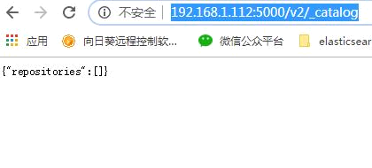

看到这个 说明启动OK。因为仓库里还没有镜像，所以就是空的；

#### 第四步：etc/docker 修改daemon.json，让docker信任私有仓库地址

```bash
{
  "registry-mirrors": ["https://0xp.mirror.aliyuncs.com"],
  "insecure-registries": ["localhost:5000"]
}
```

#### 第五步：修改配置后重启docker

 systemctl restart docker

### B 添加镜像到仓库

#### 第一步：标记此镜像为私有仓库的镜像

docker tag nginx:stable-perl localhost:5000/nginx:1.0

#### 第二步：上传镜像到私有仓库

docker push localhost:5000/nginx:1.0

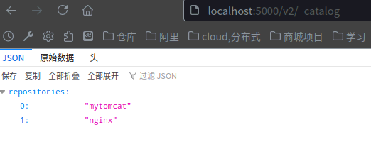

此时私有仓库里已经有了这个镜像；

#### 第三步：删除localhost:5000/nginx本地仓库镜像

dkrmi localhost:5000/nginx:1.0

#### 第四步：从私有仓库拉取localhost:5000/nginx镜像，并运行

docker pull localhost:5000/nginx:1.0

docker run -it -p 80:80 localhost:5000/nginx:1.0

#### 第五步：浏览器运行 <http://localhost:8080>测试

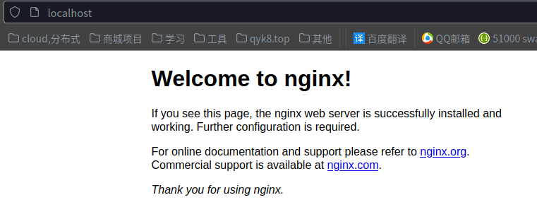

### C 搭建管理界面 harbor-2.2.x

[下载地址](https://github.com/goharbor/harbor/releases )

#### 设置本地域名/etc/hosts

192.168.101.6   dk.harbor.com
192.168.101.6   dkharbor.qyk8.top

#### 生成证书颁发机构证书

##### ---生成 CA 证书私钥

```sh
openssl genrsa -out ca.key 4096
```

##### ---生成 CA 证书

```sh
openssl req -x509 -new -nodes -sha512 -days 3650 \
 -subj "/C=CN/ST=Beijing/L=Beijing/O=example/OU=Personal/CN=dkharbor.qyk8.top" \
 -key ca.key \
 -out ca.crt
```

#### 生成服务器证书

##### ---生成私钥

```sh
openssl genrsa -out dkharbor.qyk8.top.key 4096
```

##### ---生成证书签名请求 (CSR)  

```sh
openssl req -sha512 -new \
    -subj "/C=CN/ST=Beijing/L=Beijing/O=example/OU=Personal/CN=dkharbor.qyk8.top" \
    -key dkharbor.qyk8.top.key \
    -out dkharbor.qyk8.top.csr
```

##### ---生成 x509 v3 扩展文件

```sh
cat > v3.ext <<-EOF
authorityKeyIdentifier=keyid,issuer
basicConstraints=CA:FALSE
keyUsage = digitalSignature, nonRepudiation, keyEncipherment, dataEncipherment
extendedKeyUsage = serverAuth
subjectAltName = @alt_names

[alt_names]
DNS.1=dkharbor.qyk8.top
DNS.2=dkharbor.qyk8
DNS.3=k
EOF
```

##### ---使用 `v3.ext`文件为您的 Harbor 主机生成证书

```sh
openssl x509 -req -sha512 -days 3650 \
    -extfile v3.ext \
    -CA ca.crt -CAkey ca.key -CAcreateserial \
    -in dkharbor.qyk8.top.csr \
    -out dkharbor.qyk8.top.crt
```

#### 向 Harbor 和 Docker 提供证书

```sh
cp dkharbor.qyk8.top.crt ./data/cert/
cp dkharbor.qyk8.top.key ./data/cert/
```

2,兑换 `yourdomain.com.crt`至 `yourdomain.com.cert`，供 Docker 使用。

Docker 守护进程解释 `.crt`文件作为 CA 证书和 `.cert`文件作为客户端证书。

```sh
openssl x509 -inform PEM -in dkharbor.qyk8.top.crt -out dkharbor.qyk8.top.cert
```

3,将服务器证书、密钥和 CA 文件复制到 Harbor 主机上的 Docker 证书文件夹中。  您必须先创建适当的文件夹。

```sh
sudo cp dkharbor.qyk8.top.cert /etc/docker/certs.d/dkharbor.qyk8.top/
sudo cp dkharbor.qyk8.top.key /etc/docker/certs.d/dkharbor.qyk8.top/
sudo cp ca.crt /etc/docker/certs.d/dkharbor.qyk8.top/
```

如果您映射默认 `nginx`端口 443 到不同的端口，创建文件夹 `/etc/docker/certs.d/yourdomain.com:port`， 或者 `/etc/docker/certs.d/harbor_IP:port`.

4,重启 Docker 引擎。

```sh
systemctl restart docker
```

#### 启动

```bash
#区别，前者会remove掉容器、image、网络，停的更干净，后者只是停服务
sudo docker-compose down -v 或 sudo docker-compose stop  
#重启Harbor
sudo docker-compose up -d                       
```

#### HTTPS访问

某些浏览器可能会显示一条警告，指出证书颁发机检查 `/etc/docker/daemon.json`文件以确保 `-insecure-registry`未为 设置选项 [https://yourdomain.com](https://yourdomain.com)。

从 Docker 客户端登录 Harbor。

```sh
docker login yourdomain.com
docker login yourdomain.com:port
```

帐号密码为 admin/Harbor12345 (<https://dkharbor.qyk8.top/>)

#### 上传实例

##### -- 新建项目

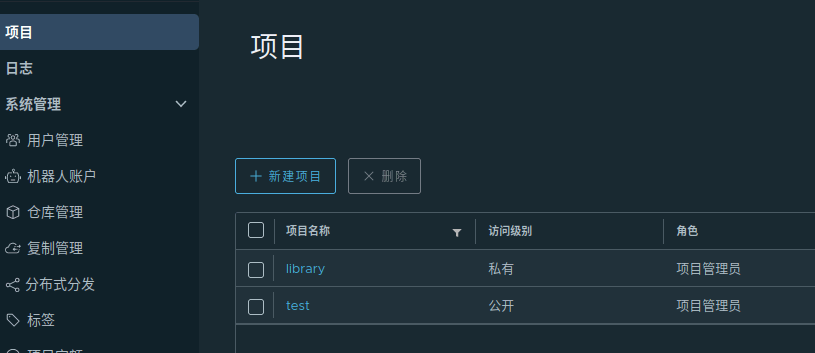

##### -- 推送

dktag b84b6fdf2183 dkharbor.qyk8.top/test/nginx:1.0.1

dkpush dkharbor.qyk8.top/test/nginx:1.0.1

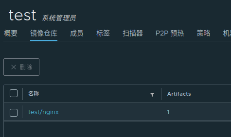

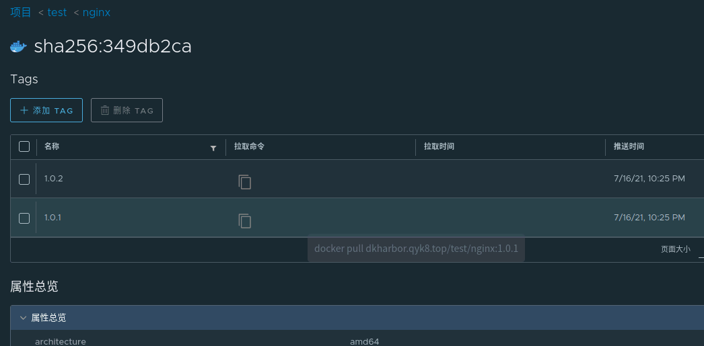
