DevEco Studio 3.1配套支持HarmonyOS 3.1版本及以上的应用及服务开发，提供了代码智能编辑、低代码开发、双向预览等功能，面向全场景多设备，提供一站式的分布式应用开发平台，支持分布式多端开发、分布式多端调测、多端模拟仿真，提供全方位的质量与安全保障。**HarmonyOS相关内容已统一迁移至**[华为开发者官网](https://developer.huawei.com/consumer/cn/)

<!-- more -->

## 搭建开发环境流程

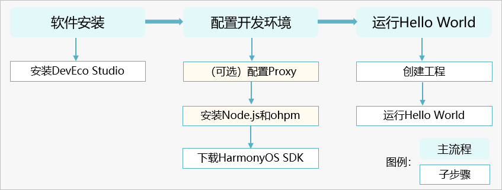


## 下载和安装DevEco Studio


1. 下载: [DevEco Studio 3.1.1 huawei.com](https://developer.huawei.com/consumer/cn/deveco-studio#download)

2. 下载完成后，双击下载的“deveco-studio-xxxx.exe”，进入DevEco Studio安装向导。

   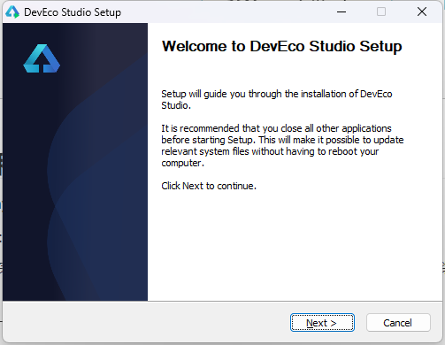

   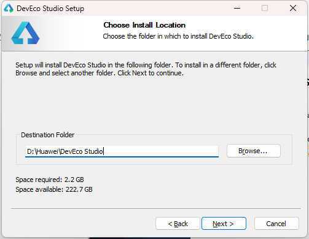

3. 在如下安装选项界面勾选**DevEco Studio**后，单击**Next**，直至安装完成。

   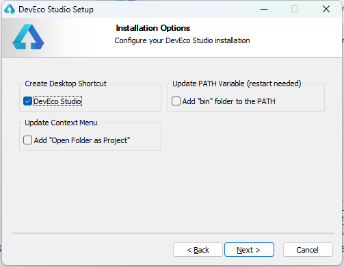

4. 安装完成后，单击**Finish**完成安装。

   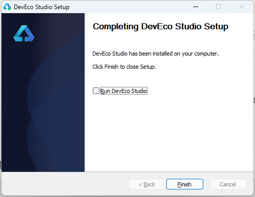


## 配置开发环境

### 下载SDK及工具链

DevEco Studio提供SDK Manager统一管理SDK及工具组件，包括如下组件包：

| 组件包名               |                             说明                             |                             参考                             |
| :--------------------- | :----------------------------------------------------------: | :----------------------------------------------------------: |
| Native                 |                       C/C++语言SDK包。                       | [Native API参考](https://developer.harmonyos.com/cn/docs/documentation/doc-references-V3/_o_h___native_x_component-0000001410285365-V3) |
| ArkTS                  |                       ArkTS语言SDK包。                       | [ArkTS API参考](https://developer.harmonyos.com/cn/docs/documentation/js-apis-overview-0000001056361791) |
| JS                     |                        JS语言SDK包。                         |                                                              |
| Java                   | Java语言SDK包。从API Version 8开始，不再提供Java语言SDK包。  | [Java API参考](https://developer.harmonyos.com/cn/docs/documentation/overview-0000001054518434) |
| **System-image-phone** |                本地模拟器Phone设备镜像文件。                 | [使用Local Emulator运行应用/服务](https://developer.huawei.com/consumer/cn/doc/harmonyos-guides-V2/run_simulator-0000001053303709-V2#section99703295412) |
| System-image-tv        |       本地模拟器TV设备镜像文件，仅支持API Version 6。        |                                                              |
| System-image-wearable  |    本地模拟器Wearable设备镜像文件，仅支持API Version 6。     |                                                              |
| **Emulator**           |                      本地模拟器工具包。                      |                                                              |
| Toolchains             | SDK工具链，应用/服务开发必备工具集，包括编译、打包、签名、数据库管理等工具的集合。 |                              -                               |
| Previewer              | 应用/服务预览器，在开发过程中可以动态预览Phone、TV、Wearable、LiteWearable等设备的应用/服务效果，支持JS、ArkTS和Java应用/服务预览。 | [使用预览器查看应用/服务效果](https://developer.huawei.com/consumer/cn/doc/harmonyos-guides-V2/previewer-0000001054328973-V2) |


### 首次启动DevEcoStudio的配置向导

1. 运行已安装的DevEco Studio，首次使用，请选择**Do not import settings**，单击**OK**。

2. 安装Node.js与ohpm。可以指定本地已安装的[Node.js](https://mirrors.aliyun.com/nodejs-release/v16.20.2/)或ohpm（*Node.js版本要求为v14.19.1及以上，且低于v17.0.0；对应的npm版本要求为6.14.16及以上*）路径位置；

   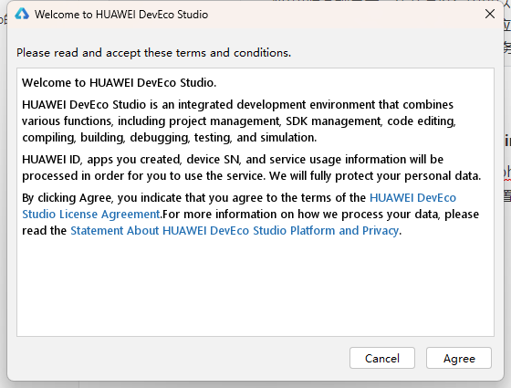

   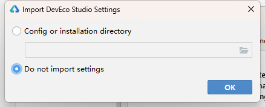

   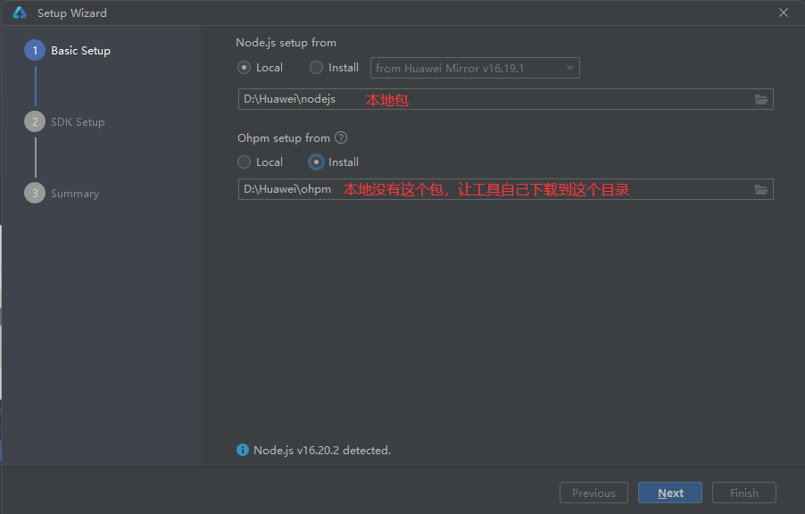

3. 在**SDK Setup**界面，单击【文件】按钮，设置HarmonyOS SDK存储路径，单击**Next**进入下一步。

   **HarmonyOS SDK路径中不能包含中文字符**

   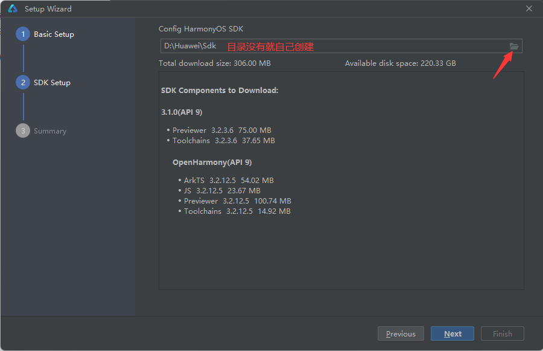

4. 在弹出的SDK下载信息页面，单击**Accept**同意License协议后，单击**Next**

   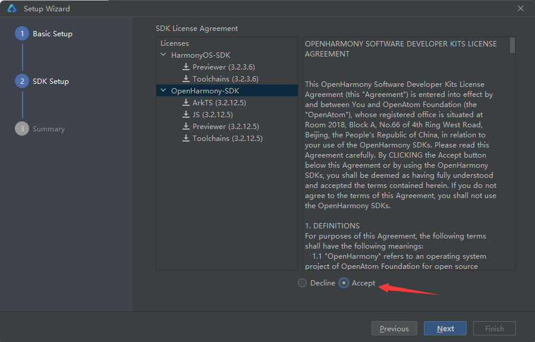

5. 确认设置项的信息，点击**Next**开始安装

   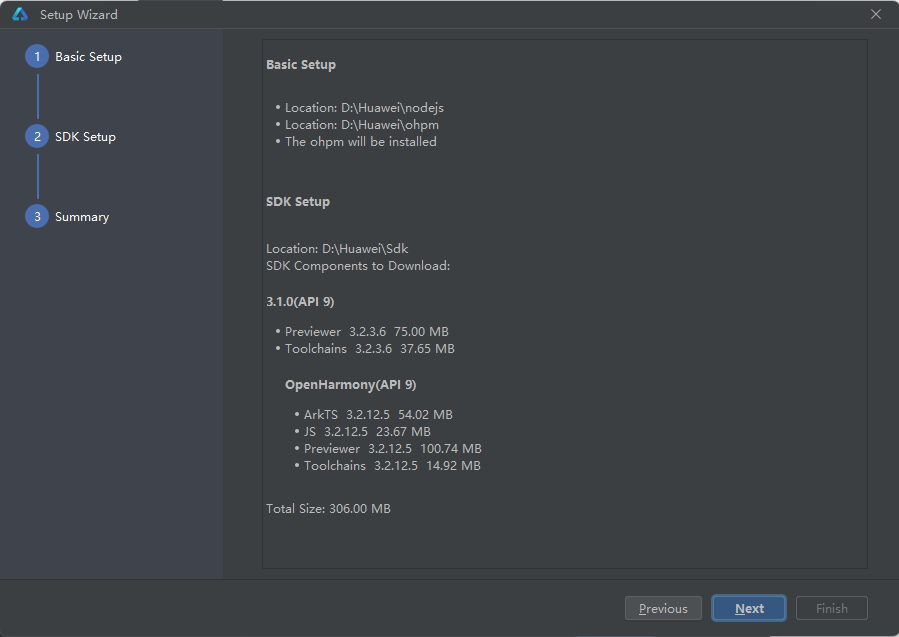

6. 等待Node.js、ohpm和SDK下载完成后，单击**Finish**，界面会进入到DevEco Studio欢迎页。

   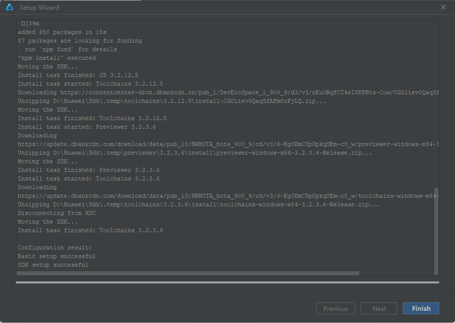


### 配置HDC工具环境变量

- Windows环境变量设置方法：

  在**此电脑 > 属性 > 高级系统设置 > 高级 > 环境变量**中，添加HDC端口变量名为：HDC_SERVER_PORT，变量值可设置为任意未被占用的端口，如7035。

  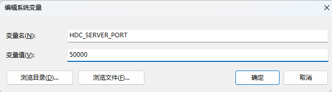

  环境变量配置完成后，关闭并重启DevEco Studio。

- macOS环境变量设置方法：

  1. 打开终端工具，执行以下命令，根据输出结果分别执行不同命令。

     ```shell
     echo $SHELL 
     ```

     - 如果输出结果为/bin/bash，则执行以下命令，打开.bash_profile文件。

       ```shell
       vi ~/.bash_profile
       ```

     - 如果输出结果为/bin/zsh，则执行以下命令，打开.zshrc文件。

       ```shell
       vi ~/.zshrc
       ```

  2. 单击字母“i”，进入**Insert**模式。

  3. 输入以下内容，添加HDC_SERVER_PORT端口信息。

     ```shell
     export HDC_SERVER_PORT=7035
     ```

  4. 编辑完成后，单击**Esc**键，退出编辑模式，然后输入“:wq”，单击**Enter**键保存。

  5. 执行以下命令，使配置的环境变量生效。

     - 如果步骤a时打开的是.bash_profile文件，请执行如下命令：

       ```shell
       source ~/.bash_profile
       ```

     - 如果步骤a时打开的是.zshrc文件，请执行如下命令：

       ```shell
       source ~/.zshrc
       ```

  6. 环境变量配置完成后，关闭并重启DevEco Studio。

### 诊断开发环境

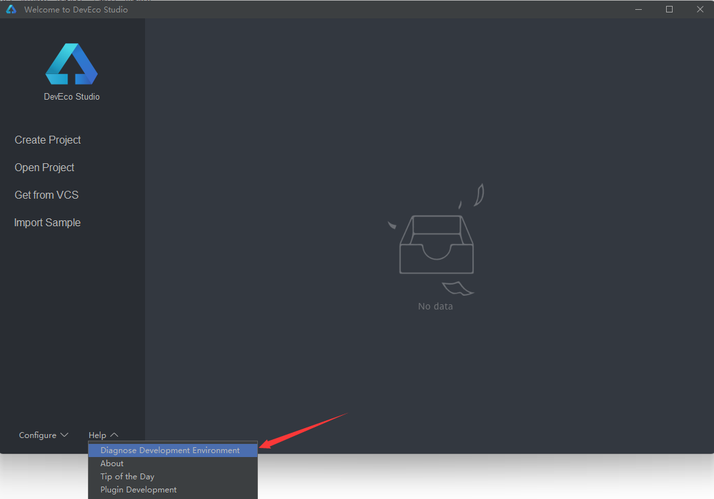

DevEco Studio开发环境诊断项包括电脑的配置、网络的连通情况、依赖的工具或SDK等。如果检测结果为未通过，请根据检查项的描述和修复建议进行处理。

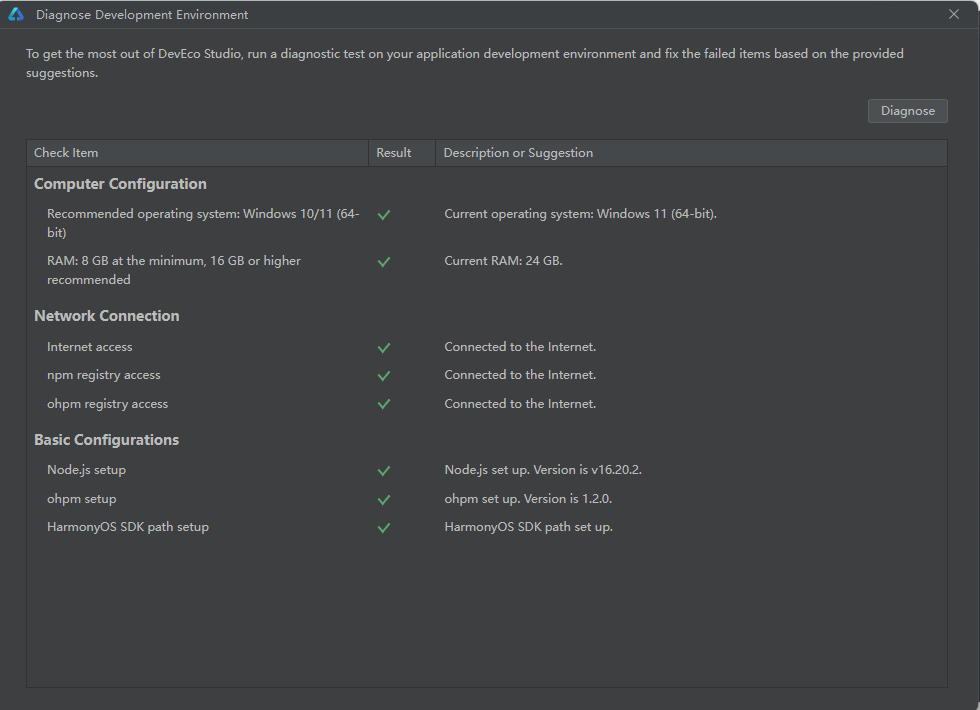

## 启用中文化插件

单击**Files > Settings > Plugins**，选择**Installed**页签，在搜索框输入“Chinese”，搜索结果里将出现**Chinese(Simplified)**，在右侧单击**Enable**，单击**OK**。*提示重启就OK啦！*

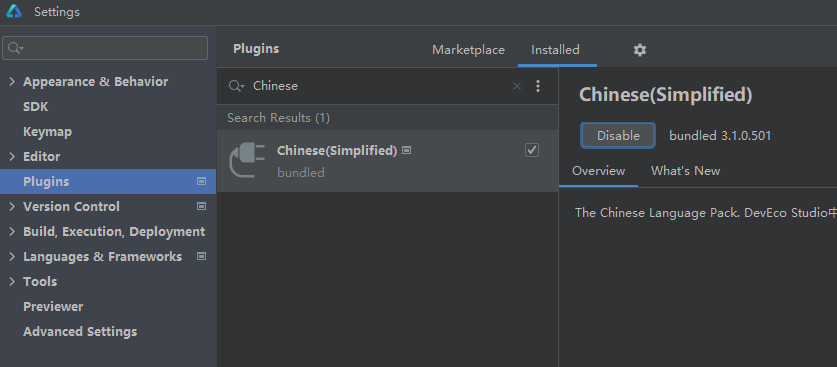

### 安装Github和Gitee

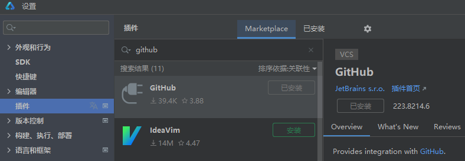

## 安装本地模拟器工具SDK

### System-image-phone本地模拟器Phone设备镜像文

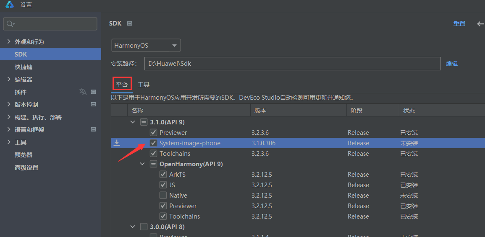

### Emulator本地模拟器工具包

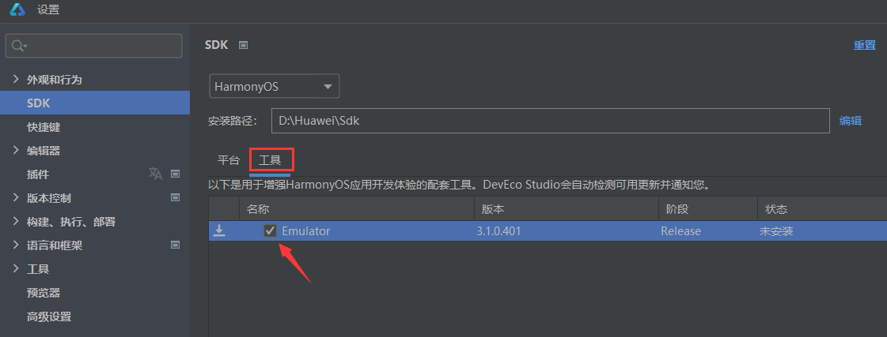


## 创建项目

1. 根据工程创建向导，选择创建Application应用或Atomic Service元服务。选择“Empty Ability”模板，然后单击**Next**。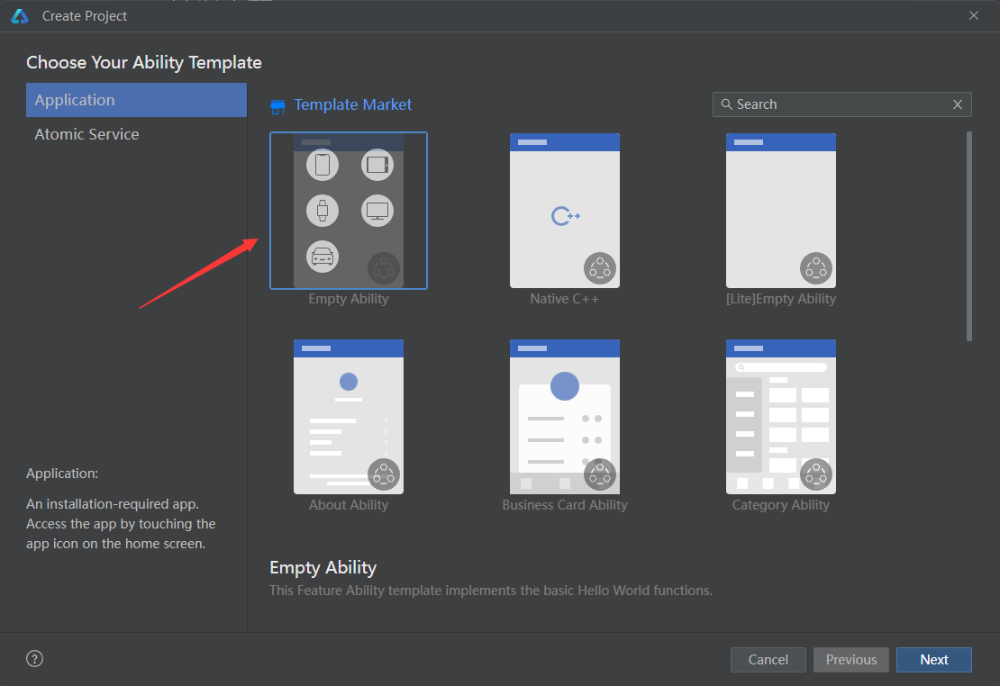

2. 填写工程相关信息，保持默认值即可，单击**Finish**。

   > 默认情况下，新建工程的Compile SDK为9，在设备中运行该工程时，请选择API 9及以上的设备才能运行该工程。

   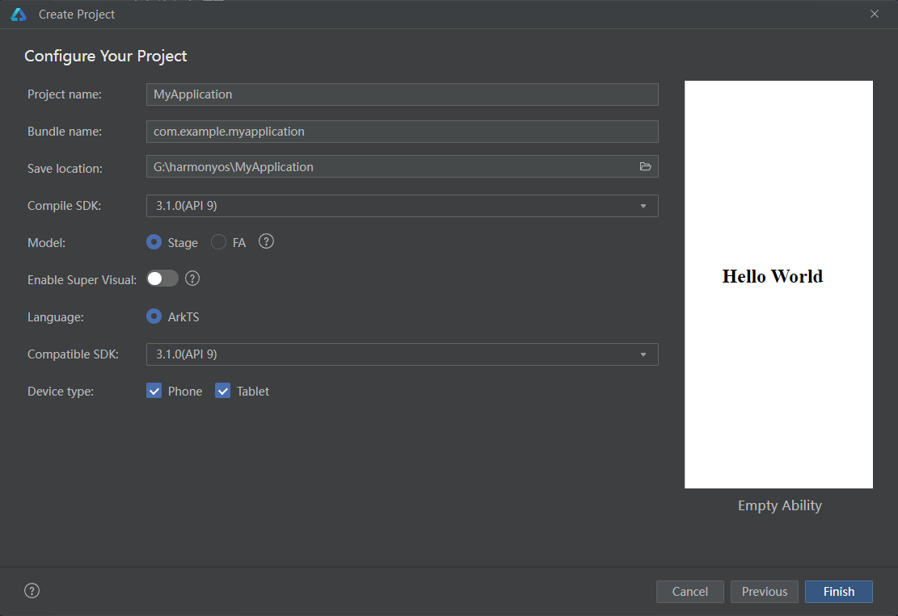

工程创建完成后，DevEco Studio会自动进行工程的同步。


## 应用-服务运行

[文档](https://developer.huawei.com/consumer/cn/doc/harmonyos-guides-V2/running-app-0000001495169810-V2)

### 使用模拟器运行应用/服务

#### 环境前提

- 打开任务管理器，在“性能”选项，检查CPU虚拟化是否已经启用。如果未启用，需要进入电脑的BIOS中，将CPU的**Intel Virtualization Technology**选项开启。
- 打开**控制面板 > 程序 > 程序与功能 > 启动或关闭Winodows功能**，找到并取消勾选“Hyper-V”，确定并重启电脑。

#### Remote Emulator

[文档](https://developer.huawei.com/consumer/cn/doc/harmonyos-guides-V2/run_simulator-0000001053303709-V2#section1379810553263)

1. 在DevEco Studio菜单栏，单击**Tools > Device Manager**。

2. 在**Remote Emulator**页签中单击**Sign In**，在浏览器中弹出华为开发者联盟帐号登录界面。

   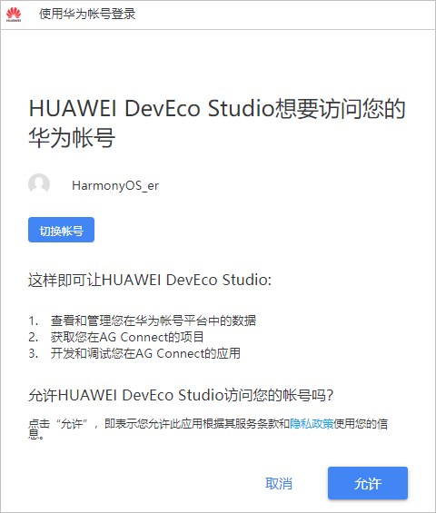

3. 在设备列表中，选择Phone设备P50，并单击按钮，运行模拟器。

   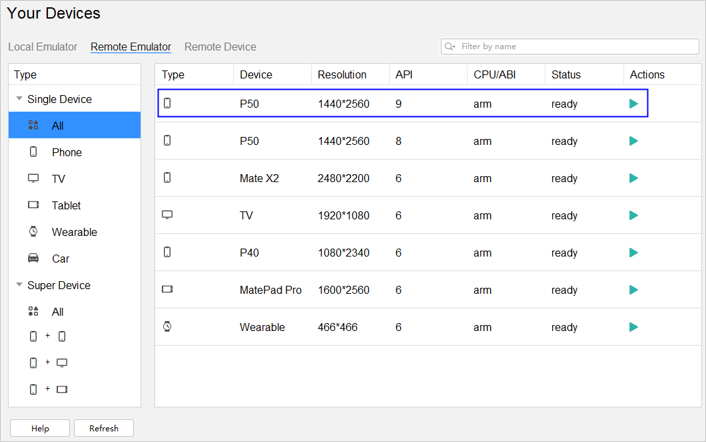

4. 单击DevEco Studio工具栏中的按钮运行工程，或使用默认快捷键**Shift+F10**（macOS为**Control+R**）运行工程。

   

5. DevEco Studio会启动应用/服务的编译构建，完成后应用/服务即可运行在模拟器上。

   


#### Local Emulator

[文档](https://developer.huawei.com/consumer/cn/doc/harmonyos-guides-V2/run_simulator-0000001053303709-V2#section99703295412)

前提：[安装本地模拟器工具SDK](./install-tools.md#安装本地模拟器工具sdk)

1. 单击菜单栏的**Tools > Device Manager**，在**Local Emulator**页签，单击**Edit**设置本地模拟器的存储路径**Local emulator location**

   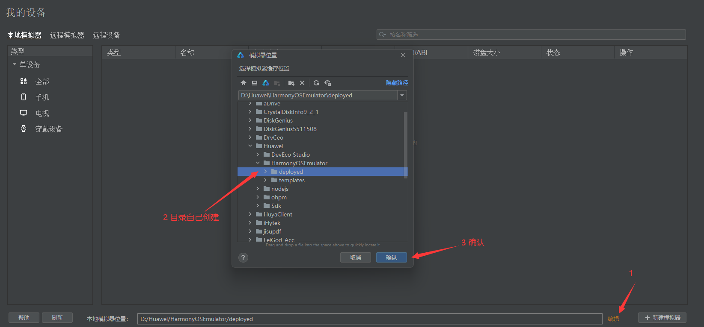

2. 在**Local Emulator**页签中，单击右下角的**New Emulator**按钮，创建一个本地模拟器；在创建模拟器界面，可以选择一个默认的设备；

   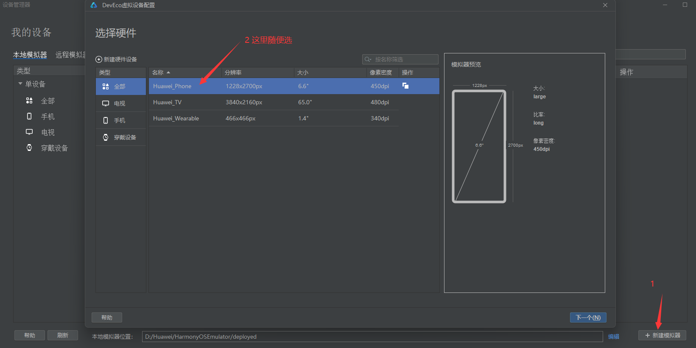

3. （**可选项**）同时也可以单击**New Hardware**或默认设备后的克隆图标，添加一个新设备，可以修改设备的名称、尺寸、分辨率、内存等参数。

   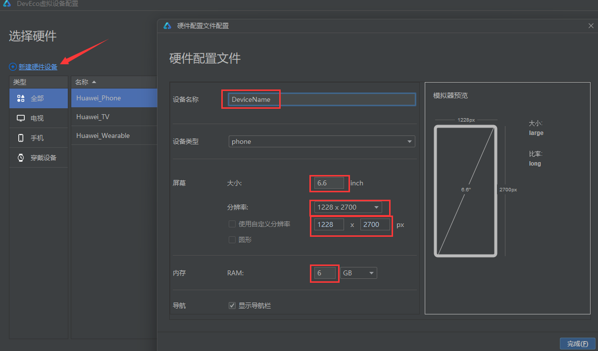

4. 选择需要创建的硬件，单击**Next**，可以看到模拟器的镜像信息，如API、Version、CPU/ABI等信息。

   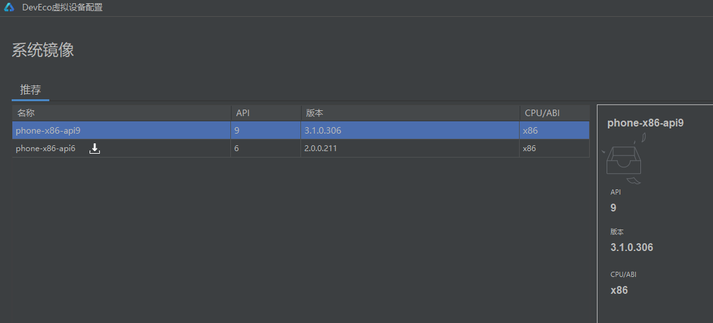

5. 单击**Next**，核实确定需要创建的模拟器信息，同时也可以在该界面修改模拟器信息，然后单击**Finish**创建本地模拟器。

   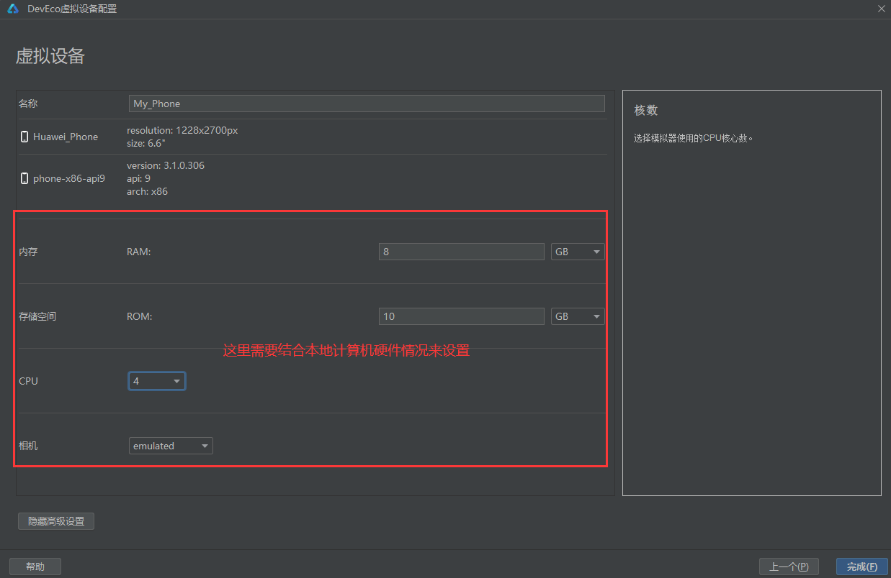

6. 在设备管理器页面，单击启动模拟器。

   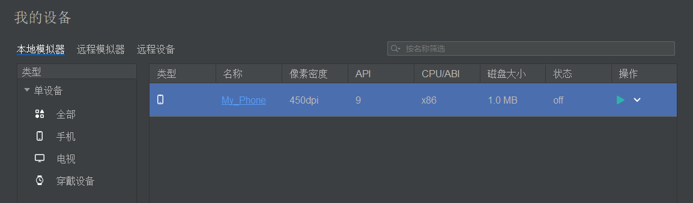

7. 单击DevEco Studio的**Run > Run'模块名称'**或，或使用默认快捷键**Shift+F10**（macOS为**Control+R**)。

   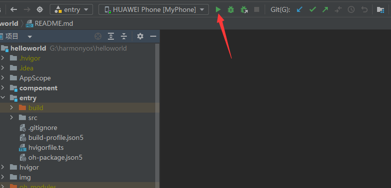

   如遇到这个情况，请销等一哈哈再来运行（15-30秒左右）

   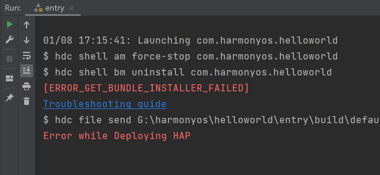

   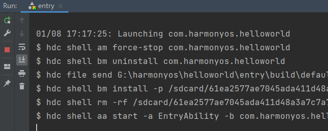

8. DevEco Studio会启动应用/服务的编译构建，完成后应用/服务即可运行在Local Emulator上。

   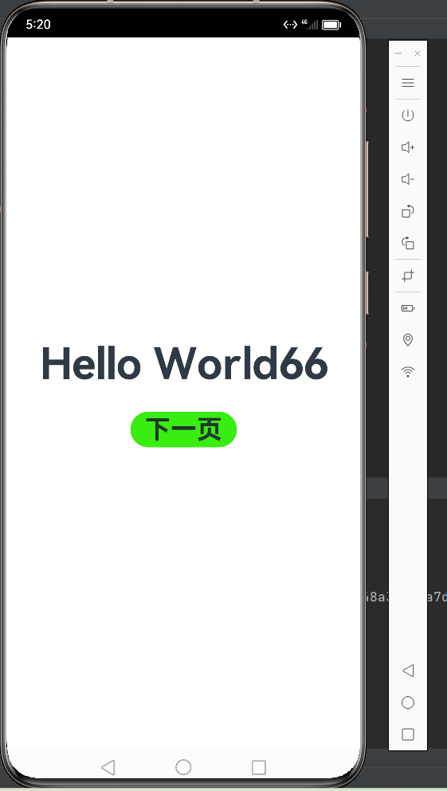

   

   

   


