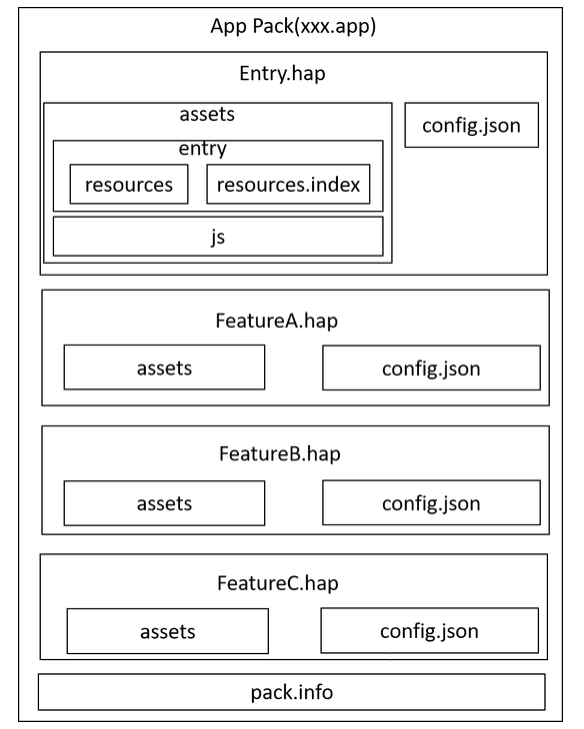
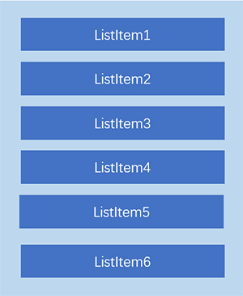
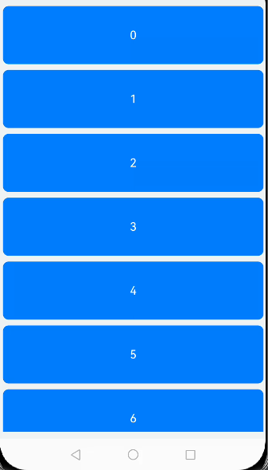
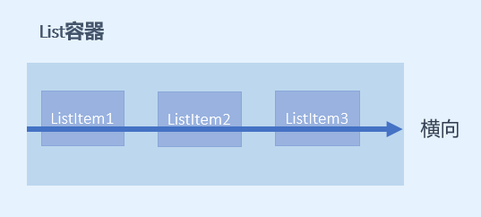
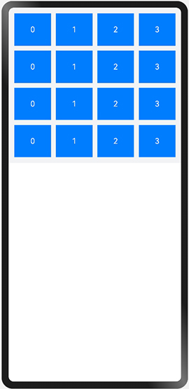

学习**HarmonyOS第一课**，包含了*Hello World*、ArkTS、应用程序框架、构建更加丰富的页面、给应用添加动画、从网络获取数据、保存应用数据、给应用添加通知和提醒、应用服务上架等知识。

<!-- more -->

# HarmonyOS 第一课

## Hello World

[Gitee -> HelloWorld源码](https://gitee.com/harmonyos_plus/HelloWorld)

### 技术架构


### 创建项目(主要部分)


### 了解基本工程目录

#### 工程级目录


其中详细如下：

- **AppScope**：中存放应用全局所需要的资源文件。
- **entry**：是应用的主模块，存放HarmonyOS应用的代码、资源等。
- **oh_modules**：是工程的依赖包，存放工程依赖的源文件。关于原npm工程适配OHPM包管理器操作，请参考[OHPM包管理器](https://developer.huawei.com/consumer/cn/doc/harmonyos-guides-V2/project_overview-0000001053822398-V2)。
- **build-profile.json5**：是工程级配置信息，包括签名、产品配置等。
- **hvigorfile.ts**：是工程级编译构建任务脚本，hvigor是基于任务管理机制实现的一款全新的自动化构建工具，主要提供任务注册编排，工程模型管理、配置管理等核心能力。
- **oh-package.json5**：是工程级依赖配置文件，用于记录引入包的配置信息。

在AppScope ，其中有*resources*文件夹和配置文件*app.json5*。`AppScope>resources>base` 中包含element和media两个文件夹，

- **element**：文件夹主要存放公共的字符串、布局文件等资源。
- **media**：存放全局公共的多媒体资源文件。


#### 模块级目录


- **entry**：应用/服务模块，编译构建生成一个HAP。
- **entry > src > main > module.json5**：Stage模型模块配置文件。具体介绍参考下面的 `module.json5` 目录级
- **entry > src > main > ets**：用于存放ArkTS源码。
- **entry > src > main > ets > entryability**：应用/服务的入口，存放ability文件，用于当前ability应用逻辑和生命周期管理。
- **entry > src > main > ets > pages**：存放UI界面相关代码文件，初始会生成一个Index页面。
- **entry > src > main > resources**：用于存放应用/服务所用到的资源文件，如图形、多媒体、字符串、布局文件等。关于资源文件的详细说明请参考[资源分类与访问](https://developer.huawei.com/consumer/cn/doc/harmonyos-guides-V2/resource-categories-and-access-0000001544463977-V2)。

| 资源目录     | 资源文件说明                                                 |
| ------------ | ------------------------------------------------------------ |
| base>element | 包括字符串、整型数、颜色、样式等资源的json文件。每个资源均由json格式进行定义，例如：</br> boolean.json：布尔型 </br> color.json：颜色 </br> float.json：浮点型 </br> intarray.json：整型数组 </br> integer.json：整型 </br> pattern.json：样式 </br> plural.json：复数形式 </br> strarray.json：字符串数组 </br> string.json：字符串值 |
| base>media   | 多媒体文件，如图形、视频、音频等文件，支持的文件格式包括：**.png**、**.gif**、**.mp3**、**.mp4**等。 |
| rawfile      | 用于存储任意格式的原始资源文件。rawfile不会根据设备的状态去匹配不同的资源，需要指定文件路径和文件名进行引用。 |


- **entry > src > ohosTest**：是单元测试目录。
- **entry > build-profile.json5**：是模块级配置信息，包括编译构建配置项。
- **entry > hvigorfile.ts**：文件是模块级编译构建任务脚本。
- **entry > oh-package.json5**：是模块级依赖配置信息文件，配置三方包声明文件的入口及包名。


#### app.json5

`AppScope>app.json5`


主要包含以下内容：

- 应用的全局配置信息，包含应用的包名、开发厂商、版本号等基本信息。
- 特定设备类型的配置信息。

其中配置信息如下：

- bundleName：包名。
- vendor：应用程序供应商。
- versionCode：用于区分应用版本。
- versionName：版本号。
- icon：对应于应用的显示图标。
- label：应用名。

#### module.json5(Stage 模型)

`entry>src>main>module.json5` 是 Stage 模型模块配置文件，主要包含HAP的配置信息、应用在具体设备上的配置信息以及应用的全局配置信息。


主要包含以下内容：

- Module的基本配置信息，例如Module名称、类型、描述、支持的设备类型等基本信息。
- 应用组件信息，包含 `UIAbility` 组件和 `ExtensionAbility` 组件的描述信息。
- 应用运行过程中所需的权限信息。

其中module对应的是模块的配置信息，一个模块对应一个打包后的hap包，hap包全称是`HarmonyOS Ability Package`，其中包含了ability、第三方库、资源和配置文件。其具体属性及其描述可以参照下表1。

**表1 module.json5默认配置属性及描述**

| 属性                  | 描述                                                                                  |
|:--------------------|:------------------------------------------------------------------------------------|
| name                | 该标签标识当前module的名字，module打包成hap后，表示hap的名称，标签值采用字符串表示（最大长度31个字节），该名称在整个应用要唯一。          |
| type                | 表示模块的类型，类型有三种，分别是entry、feature和har。                                                 |
| srcEntry            | 当前模块的入口文件路径。                                                                        |
| description         | 当前模块的描述信息。                                                                          |
| mainElement         | 该标签标识hap的入口ability名称或者extension名称。只有配置为mainElement的ability或者extension才允许在服务中心露出。    |
| deviceTypes         | 该标签标识hap可以运行在哪类设备上，标签值采用字符串数组的表示。                                                   |
| deliveryWithInstall | 标识当前Module是否在用户主动安装的时候安装，表示该Module对应的HAP是否跟随应用一起安装。- true：主动安装时安装。- false：主动安装时不安装。 |
| installationFree    | 标识当前Module是否支持免安装特性。- true：表示支持免安装特性，且符合免安装约束。- false：表示不支持免安装特性。                   |
| pages               | 对应的是main_pages.json文件，用于配置ability中用到的page信息。                                        |
| abilities           | 是一个数组，存放当前模块中所有的ability元能力的配置信息，其中可以有多个ability。                                     |

**表2 abilities中对象的默认配置属性及描述**

| 属性                    | 描述                                                                                   |
|:----------------------|:-------------------------------------------------------------------------------------|
| name                  | 该标签标识当前ability的逻辑名，该名称在整个应用要唯一，标签值采用字符串表示（最大长度127个字节）。                               |
| srcEntry              | ability的入口代码路径。                                                                      |
| description           | ability的描述信息。                                                                        |
| icon                  | ability的图标。该标签标识ability图标，标签值为资源文件的索引。该标签可缺省，缺省值为空。如果ability被配置为MainElement，该标签必须配置。 |
| label                 | ability的标签名。                                                                         |
| startWindowIcon       | 启动页面的图标。                                                                             |
| startWindowBackground | 启动页面的背景色。                                                                            |
| visible               | ability是否可以被其他应用程序调用，true表示可以被其它应用调用， false表示不可以被其它应用调用。                             |
| skills                | 标识能够接收的意图的action值的集合，取值通常为系统预定义的action值，也允许自定义。                                      |
| entities              | 标识能够接收的Want的Action值的集合，取值通常为系统预定义的action值，也允许自定义。                                    |
| actions               | 标识能够接收Want的Entity值的集合。                                                               |

#### config.json(FA 模型)

`entry>src>main>config.json` 是 FA 模型模块配置文件，主要包含HAP的配置信息、应用在具体设备上的配置信息以及应用的全局配置信息。

#### main_pages.json

`entry/src/main/resources/base/profile/main_pages.json`文件保存的是页面page的路径配置信息，所有需要进行路由跳转的page页面都要在这里进行配置。


#### oh-package.json5

工程级 `oh-package.json5` 和 模块级 `entry/oh-package.json5`

```json
///////////工程级
{
  "name": "helloWorld",
  "version": "1.0.0",
  "description": "学习鸿蒙系统之第一课到入门知识",
  "main": "",
  "author": "jf",
  "license": "",
  "dependencies": {
  },
  "devDependencies": {
    "@ohos/hypium": "1.0.6"
  }
}
///////////模块级
{
  "name": "entry",
  "version": "1.0.0",
  "description": "学习Helloworld，ArkTS语言，UIAbility的使用。",
  "main": "",
  "author": "jf",
  "license": "",
  "dependencies": {}
}
```

| oh-package.json5包含字段 | 字段说明     | 说明                                                         |
| ------------------------ | ------------ | ------------------------------------------------------------ |
| name                     | 软件包名称   | 必选字段，若package.json文件中未指明，需在oh-package.json5添加补齐 |
| version                  | 软件包版本   | 必选字段，若package.json文件中未指明，需在oh-package.json5添加补齐 |
| description              | 软件包简介   | 必选字段，若package.json文件中未指明，需在oh-package.json5添加补齐 |
| keywords                 | 软件包关键字 | -                                                            |
| homepage                 | 主页链接     | -                                                            |
| license                  | 开源协议     | -                                                            |
| author                   | 软件包作者   | -                                                            |
| main                     | 软件包入口   | -                                                            |
| repository               | 仓库地址     | -                                                            |
| dependencies             | 生产依赖     | 该字段处理方式请参阅下方说明内容                             |
| devDependencies          | 开发依赖     | -                                                            |
| types                    | 类型定义     | -                                                            |
| artifactType             | 共享包类型   | 可选项：</br> original：源码，即发布源码(.ts/.ets)。</br> obfuscation：混淆代码，即源码经过混淆之后发布上传。 |

::: info 说明

- 工程的*package.json*文件的*dependencies*字段处理方式如下：
- - *@ohos/hypium*：测试框架的依赖，迁移时需要放到oh-package.json5文件的devDependencies字段下；
- - 删除 *@ohos/hvigor* 和 *@ohos/hvigor-ohos-plugin*字段，无需迁移到oh-package.json5中；
- - 其他依赖可直接复制到oh-package.json5的dependencies字段中。
- 除表格中呈现的字段外，package.json中其余字段暂不支持迁移。如您在历史工程中使用到其余字段，请反馈您所使用的字段（选中文本，点击“意见反馈”）。

:::


## APP 包结构

Stage 模型和 FA 模型开发的应用，应用程序包结构并不相同

Entry.hap 相当于window的 `.exe` 文件

FeatureX.hap 相当于window的 `.dll` 文件

### Stage 模型

- Stage模型应用程序包结构如下图所示：


#### ArkTS 工程目录结构（API Version 8-9）


在基于Stage模型开发的应用项目代码下，都存在一个app.json5及一个或多个module.json5这两种配置文件。

### FA 模型

- FA模型应用程序包结构如下图所示：



#### ArkTS 工程目录结构（API Version 8-9）

API Version 8工程目录结构图：


API Version 9工程目录结构图：


- entry：应用/服务模块，编译构建生成一个HAP。
- - **src > main > ets**：用于存放ArkTS源码。
- - **src > main > ets > MainAbility**：应用/服务的入口。
- - **src > main > ets > MainAbility > pages**：MainAbility包含的页面。
- - **src > main > ets > MainAbility > app.ets**：承载Ability生命周期。
- - **src > main > resources**：用于存放应用/服务所用到的资源文件，如图形、多媒体、字符串、布局文件等。

  | 资源目录     | 资源文件说明                                                 |
  | ------------ | ------------------------------------------------------------ |
  | base>element | 包括字符串、整型数、颜色、样式等资源的json文件。每个资源均由json格式进行定义，例如：</br> boolean.json：布尔型 </br> color.json：颜色 </br> float.json：浮点型 </br> intarray.json：整型数组 </br> integer.json：整型 </br> pattern.json：样式 </br> plural.json：复数形式 </br> strarray.json：字符串数组 </br> string.json：字符串值 |
  | base>media   | 多媒体文件，如图形、视频、音频等文件，支持的文件格式包括：**.png**、**.gif**、**.mp3**、**.mp4**等。 |
  | rawfile      | 用于存储任意格式的原始资源文件。rawfile不会根据设备的状态去匹配不同的资源，需要指定文件路径和文件名进行引用。 |
- - **src > main > config.json**：模块配置文件，主要包含HAP的配置信息、应用在具体设备上的配置信息以及应用的全局配置信息。


### 其他工程目录结构请查看

[其他工程目录结构请查看](https://developer.huawei.com/consumer/cn/doc/harmonyos-guides-V2/project_overview-0000001053822398-V2#section1483695981112)


## 容器组件与布局

包含了基础组件（Text、Image、TextInput、Button、Button）与容器组件（List 组件、Grid 组件、Tabs 组件）
以及界面布局容器（Column、Row、Swiper）

### 相关概念

基础组件：

- **Text**：显示一段文本的组件。
- **Image**：图片组件，支持本地图片和网络图片的渲染展示。
- **TextInput**：可以输入单行文本并支持响应输入事件的组件。
- **Button**：按钮组件，可快速创建不同样式的按钮。
- **LoadingProgress**：用于显示加载动效的组件。

容器组件：

- **Flex**：应用弹性方式布局子组件的容器组件。
- **Column**：沿垂直方向布局的容器。
- **Row**：沿水平方向布局容器。
- **List**：列表包含一系列相同宽度的列表项。适合连续、多行呈现同类数据，例如图片和文本。
- **Swiper**：滑动容器，提供切换子组件显示的能力。
- **Grid**：网格容器，由“行”和“列”分割的单元格所组成，通过指定“项目”所在的单元格做出各种各样的布局。

### Column和Row

- Column 列，沿垂直方向布局的容器。
- Row 行，沿水平方向布局的容器。

---

主轴和交叉轴概念：

> 一个垂直，一个水平；以一个为主轴时，另一个就是交叉轴。

属性介绍：

- justifyContent：设置子组件在主轴方向上的对齐格式。

子组件在主轴方向上的对齐使用justifyContent属性来设置，其参数类型是FlexAlign。`FlexAlign` 定义了以下几种类型：

- - **Start**：元素在主轴方向首端对齐，第一个元素与行首对齐，同时后续的元素与前一个对齐（简单理解：首部对齐）。
- - **Center**：元素在主轴方向中心对齐（简单理解：居中对齐）。
- - **End**：元素在主轴方向尾部对齐（简单理解：尾部对齐）。
- - **SpaceBetween**：元素在主轴方向均匀分配弹性元素，相邻元素之间距离相同。 第一个元素与行首对齐，最后一个元素与行尾对齐。
- - **SpaceAround**：元素在主轴方向均匀分配弹性元素，相邻元素之间距离相同。 第一个元素到行首的距离和最后一个元素到行尾的距离是相邻元素之间距离的一半。
- - **SpaceEvenly**：元素在主轴方向等间距布局，无论是相邻元素还是边界元素到容器的间距都一样。

---

- alignItems：设置子组件在交叉轴方向上的对齐格式。

-Column容器的主轴是垂直方向，交叉轴是水平方向，其参数类型为HorizontalAlign（水平对齐），`HorizontalAlign` 定义了以下几种类型：

- - **Start**：设置子组件在水平方向上按照起始端对齐。
- - **Center**（默认值）：设置子组件在水平方向上居中对齐。
- - **End**：设置子组件在水平方向上按照末端对齐。

---

-Row容器的主轴是水平方向，交叉轴是垂直方向，其参数类型为VerticalAlign（垂直对齐），`VerticalAlign` 定义了以下几种类型：

- - **Top**：设置子组件在垂直方向上居顶部对齐。
- - **Center**（默认值）：设置子组件在竖直方向上居中对齐。
- - **Bottom**：设置子组件在竖直方向上居底部对齐。

---


接口介绍：

- Column(value?:{space?: string | number})
- Row(value?:{space?: string | number})

Column和Row容器的接口都有一个可选参数space，表示子组件在主轴方向上的间距。

### 构建列表页面布局

常见的列表有线性列表（List列表）和网格布局（Grid列表）：


### List组件的使用

#### List组件简介

List是很常用的滚动类容器组件，一般和子组件`ListItem`一起使用，`List`列表中的每一个列表项对应一个`ListItem`组件。



#### 使用ForEach渲染列表

```tsx
@Entry
@Component
struct ListDemo {
  private arr: number[] = [0, 1, 2, 3, 4, 5, 6, 7, 8, 9]

  build() {
    Column() {
      List({ space: 10 }) {
        ForEach(this.arr, (item: number) => {
          ListItem() {
            Text(`${item}`)
              .width('100%')
              .height(100)
              .fontSize(20)
              .fontColor(Color.White)
              .textAlign(TextAlign.Center)
              .borderRadius(10)
              .backgroundColor(0x007DFF)
          }
        }, item => item)
      }
    }
    .padding(12)
    .height('100%')
    .backgroundColor(0xF1F3F5)
  }
}
```



#### 设置列表项分割线

List组件子组件ListItem之间默认是没有分割线的，部分场景子组件ListItem间需要设置分割线，
这时候您可以使用List组件的`divider`属性。divider属性包含四个参数：

- **strokeWidth**: 分割线的线宽。
- **color**: 分割线的颜色。
- **startMargin**：分割线距离列表侧边起始端的距离。
- **endMargin**: 分割线距离列表侧边结束端的距离。

```tsx
List(){ ... }.divider({ strokeWidth: '4', color: Color.Red, startMargin: '8', endMargin: '8' })
```


#### List列表滚动事件监听

List组件提供了一系列事件方法用来监听列表的滚动，您可以根据需要，监听这些事件来做一些操作：

- onScroll：列表滑动时触发，返回值scrollOffset为滑动偏移量，scrollState为当前滑动状态。
- onScrollIndex：列表滑动时触发，返回值分别为滑动起始位置索引值与滑动结束位置索引值。
- onReachStart：列表到达起始位置时触发。
- onReachEnd：列表到底末尾位置时触发。
- onScrollStop：列表滑动停止时触发。

```tsx
List({ space: 10 }) {
  ForEach(this.arr, (item) => {
    ListItem() {
      Text(`${item}`)
        ...
    }.editable(true)
  }, item => item)
}
.editMode(this.editFlag)
// 列表滑动时触发，返回值分别为 滑动起始位置索引值 与 滑动结束位置索引值。
.onScrollIndex((firstIndex: number, lastIndex: number) => {
    console.info('first：' + firstIndex + '，last：' + lastIndex)
})
// 列表滑动时触发，返回值scrollOffset为滑动偏移量，scrollState为当前滑动状态。
.onScroll((scrollOffset: number, scrollState: ScrollState) => {
    console.info('scrollOffset：' + scrollOffset + '，scrollState：' + scrollState)
})
// 滑动到顶部时
.onReachStart(() => {
    console.info('onReachStart')
})
// 滑动到底部时
.onReachEnd(() => {
    console.info('onReachEnd')
})
// 停止滑动时
.onScrollStop(() => {
    console.info('onScrollStop')
})
```

#### 设置List排列方向listDirection

List组件里面的列表项默认是按垂直方向排列的.

`listDirection` 属性设置为`Axis.`。

```tsx
List(){ ... }.listDirection(Axis.Vertical)
```


`listDirection` 属性设置为`Axis.Horizontal`。

```tsx
List(){ ... }.listDirection(Axis.Horizontal)
```



### Grid组件的使用

#### Grid组件简介

Grid组件为网格容器，是一种网格列表，由“行”和“列”分割的单元格所组成，通过指定“项目”所在的单元格做出各种各样的布局。Grid组件一般和子组件GridItem一起使用，Grid列表中的每一个条目对应一个GridItem组件。


#### 使用ForEach渲染网格布局

和List组件一样，Grid组件也可以使用ForEach来渲染多个列表项GridItem，我们通过下面的这段示例代码来介绍Grid组件的使用。

```tsx
@Entry
@Component
struct GridExample {
  private arr: String[] = ['0', '1', '2', '3']

  build() {
    Column() {
      Grid() {
        ForEach(this.arr, (day: string) => {
          ForEach(this.arr, (day: string) => {
            GridItem() {
              Text(day)
                .fontSize(16)
                .fontColor(Color.White)
                .backgroundColor(0x007DFF)
                .width('100%')
                .height('100%')
                .textAlign(TextAlign.Center)
            }
          }, day => day)
        }, day => day)
      }
      .columnsTemplate('1fr 1fr 1fr 1fr')
      .rowsTemplate('1fr 1fr 1fr 1fr')
      .columnsGap(10)
      .rowsGap(10)
      .height(300)
    }
    .width('100%')
    .padding(12)
    .backgroundColor(0xF1F3F5)
  }
}
```

示例代码中使用了两层ForEach遍历长度为4的数组arr，创建了16个GridItem列表项。

- columnsTemplate：`1fr 1fr 1fr 1fr`，表示这个网格为4列，将Grid允许的宽分为4等分，每列占1份；
- rowsTemplate：`1fr 1fr 1fr 1fr`，表示这个网格为4行，将Grid允许的高分为4等分，每行占1份。
- columnsGap：列间距为10vp。
- rowsTemplate：行间距为10vp。

示例代码效果图如下：



上面构建的网格布局使用了固定的行数和列数，所以构建出的网格是不可滚动的。
然而有时候因为内容较多，我们通过滚动的方式来显示更多的内容，就需要一个可以滚动的网格布局。
我们只需要设置 rowsTemplate 和 columnsTemplate 中的一个即可。

将示例代码中 `GridItem` 的高度设置为固定值，例如100；仅设置 columnsTemplate 属性，不设置rowsTemplate属性，就可以实现Grid列表的滚动：

```tsx
Grid() {
  ForEach(this.arr, (day: string) => {
    ForEach(this.arr, (day: string) => {
      GridItem() {
        Text(day)
          .height(100)
          ...
      }
    }, day => day)
  }, day => day)
}
.columnsTemplate('1fr 1fr 1fr 1fr')
.columnsGap(10)
.rowsGap(10)
.height(300)
```

此外，Grid像List一样也可以使用onScrollIndex来监听列表的滚动。

#### 列表性能优化

开发者在使用长列表时，如果直接采用循环渲染方式，会一次性加载所有的列表元素，从而导致页面启动时间过长，影响用户体验，推荐通过以下方式来进行列表性能优化：

[使用数据懒加载](https://developer.huawei.com/consumer/cn/doc/harmonyos-guides-V2/ui-ts-performance-improvement-recommendation-0000001477981001-V2#ZH-CN_TOPIC_0000001523648418__推荐使用数据懒加载)

[设置list组件的宽高](https://developer.huawei.com/consumer/cn/doc/harmonyos-guides-V2/ui-ts-performance-improvement-recommendation-0000001477981001-V2#section637765124414)

#### 参考链接

1. List组件的相关API参考：[List组件](https://developer.huawei.com/consumer/cn/doc/harmonyos-references-V2/ts-container-list-0000001477981213-V2)。
2. Grid组件的相关API参考：[Grid组件](https://developer.huawei.com/consumer/cn/doc/harmonyos-references-V2/ts-container-grid-0000001478341161-V2)。

### Tabs 组件

ArkUI开发框架提供了一种页签容器组件Tabs，开发者通过Tabs组件可以很容易的实现内容视图的切换。


#### Tabs组件的简单使用

Tabs组件仅可包含子组件TabContent，每一个页签对应一个内容视图即TabContent组件。

```tsx
@Entry
@Component
struct TabsExample {
  private controller: TabsController = new TabsController()

  build() {
    Column() {
      Tabs({ barPosition: BarPosition.Start, controller: this.controller }) {
        TabContent() {
          Column().width('100%').height('100%').backgroundColor(Color.Green)
        }
        .tabBar('green')
        ...
      }
      .barWidth('100%') // 设置TabBar宽度
      .barHeight(60) // 设置TabBar高度
      .width('100%') // 设置Tabs组件宽度
      .height('100%') // 设置Tabs组件高度
      .backgroundColor(0xF5F5F5) // 设置Tabs组件背景颜色
    }
    ...
  }
}
```

效果如下：


Tabs组件中包含4个子组件TabContent，通过TabContent的 `tabBar` 属性设置 `TabBar` 的显示内容。

使用通用属性 `width`和`height` 设置了Tabs组件的宽高，

使用 `barWidth`和`barHeight` 设置了TabBar的宽度和高度。


说明

- TabContent 组件不支持设置通用 *宽度* 属性，其宽度默认撑满Tabs父组件。
- TabContent 组件不支持设置通用 *高度* 属性，其高度由Tabs *父组件高度* 与TabBar组件 *高度* 决定。


#### 设置TabBar布局模式

因为Tabs的布局模式默认是Fixed的，所以Tabs的页签是不可滑动的。当页签比较多的时候，可能会导致页签显示不全，
将布局模式设置为Scrollable的话，可以实现页签的滚动。

Tabs的布局模式有 `Fixed`（默认）和 `Scrollable` 两种：

- BarMode.Fixed：所有TabBar平均分配barWidth宽度（纵向时平均分配barHeight高度）,页签不可滚动，效果图如下：

  

- BarMode.Scrollable：每一个TabBar均使用实际布局宽度，超过总长度（横向Tabs的barWidth，纵向Tabs的barHeight）后可滑动。

  

```tsx
@Entry
@Component
struct TabsExample {
  private controller: TabsController = new TabsController()

  build() {
    Column() {
      Tabs({ barPosition: BarPosition.Start, controller: this.controller }) {
        TabContent() {
          Column().width('100%').height('100%').backgroundColor(Color.Green)
        }
        .tabBar('green')
        ...
      }
      // 设置Tabs的布局模式，Fixed：所有TabBar平均分配barWidth宽度（纵向时平均分配barHeight高度）,页签不可滚动；
      // Scrollable：每一个TabBar均使用实际布局宽度，超过总长度（横向Tabs的barWidth，纵向Tabs的barHeight）后可滑动。
      .barMode(BarMode.Scrollable) 
      ...
    }
    ...
  }
}
```

#### 设置TabBar位置和排列方向

使用Tabs组件接口中的参数barPosition设置页签位置.

此外页签显示位置还与vertical属性相关联，vertical属性用于设置页签的排列方向，当vertical的属性值为false（默认值）时页签横向排列，为true时页签纵向排列。

barPosition的值可以设置为 `BarPosition.Start`（默认值）和 `BarPosition.End` ：

- BarPosition.Start（简单理解：可以位于容器顶部【false】和左侧【true】）

- - `vertical` 属性方法设置为 false（默认值）时，页签位于容器顶部。

  ```tsx
  Tabs({ barPosition: BarPosition.Start }) {
    ...
  }
  .vertical(false)
  ```
  
  

- - vertical属性方法设置为true时，页签位于容器左侧。

  ```tsx
  Tabs({ barPosition: BarPosition.Start }) {
    ...
  }
  .vertical(true)
  ```
  
  

- BarPosition.End（简单理解：可以位于容器低部【false】和右侧【true】）

- - vertical属性方法设置为false时，页签位于容器底部。

  ```tsx
  Tabs({ barPosition: BarPosition.End }) {
    ...
  }
  .vertical(false)
  ```

  

- - vertical属性方法设置为true时，页签位于容器右侧。

  ```tsx
  Tabs({ barPosition: BarPosition.End }) {
    ...
  }
  .vertical(true)
  ```
  
  


#### 自定义TabBar样式

往往开发过程中，UX给我们的设计效果可能并不是这样的，比如下面的这种底部页签效果：


TabContent的tabBar属性除了支持 `string` 类型，还支持使用 `@Builder` 装饰器修饰的函数。
您可以使用@Builder装饰器，构造一个生成自定义TabBar样式的函数，实现上面的底部页签效果，

示例代码如下：

```tsx
@Entry
@Component
struct TabsExample {
  @State currentIndex: number = 0;
  private tabsController: TabsController = new TabsController();

  @Builder TabBuilder(title: string, targetIndex: number, selectedImg: Resource, normalImg: Resource) {
    Column() {
      Image(this.currentIndex === targetIndex ? selectedImg : normalImg)
        .size({ width: 25, height: 25 })
      Text(title)
        .fontColor(this.currentIndex === targetIndex ? '#1698CE' : '#6B6B6B')
    }
    .width('100%')
    .height(50)
    .justifyContent(FlexAlign.Center)
    .onClick(() => {
      this.currentIndex = targetIndex;
      this.tabsController.changeIndex(this.currentIndex);
    })
  }

  build() {
    Tabs({ barPosition: BarPosition.End, controller: this.tabsController }) {
      TabContent() {
        Column().width('100%').height('100%').backgroundColor('#00CB87')
      }
      .tabBar(this.TabBuilder('首页', 0, $r('app.media.home_selected'), $r('app.media.home_normal')))

      TabContent() {
        Column().width('100%').height('100%').backgroundColor('#007DFF')
      }
      .tabBar(this.TabBuilder('我的', 1, $r('app.media.mine_selected'), $r('app.media.mine_normal')))
    }
    .barWidth('100%')
    .barHeight(50)
    .onChange((index: number) => {
      this.currentIndex = index;
    })
  }
}
```

示例代码中将 `barPosition` 的值设置为 `BarPosition.End`，使页签显示在底部。

使用`@Builder`修饰TabBuilder函数，生成由`Image`和`Text`组成的页签。

同时也给Tabs组件设置了`TabsController`控制器，当点击某个页签时，调用`changeIndex`方法进行页签内容切换。

最后还需要给Tabs添加onChange事件，Tab页签切换后触发该事件，这样当我们左右滑动内容视图的时候，页签样式也会跟着改变。


---


## 管理组件状态、Video视频组件及应用弹窗

包含了 管理组件状态（@State、@Prop、@Link、@Provide、@Consume、@Watch）、Video视频组件及应用弹窗

### 管理组件状态

#### 概念

> 在应用中，界面通常都是动态的。如图1所示，在子目标列表中，当用户点击目标一，目标一会呈现展开状态，再次点击目标一，目标一呈现收起状态。界面会根据不同的状态展示不一样的效果。


ArkUI作为一种声明式UI，具有状态驱动UI更新的特点。当用户进行界面交互或有外部事件引起状态改变时，状态的变化会触发组件自动更新。所以在ArkUI中，我们只需要通过一个变量来记录状态。当改变状态的时候，ArkUI就会自动更新界面中受影响的部分。

ArkUI框架提供了多种管理状态的装饰器来修饰变量，使用这些装饰器修饰的变量即称为状态变量。


---


- 在组件内使用`@State`装饰器来修饰变量，可以使组件根据不同的状态来呈现不同的效果。
- 若当前组件的状态需要通过其父组件传递而来，此时需要使用`@Prop`装饰器；
- 若是父子组件状态需要相互绑定进行双向同步，则需要使用`@Link`装饰器。
- 使用`@Provide`和`@Consume`装饰器可以实现跨组件层级双向同步状态。

在实际应用开发中，应用会根据需要封装数据模型。如果需要观察嵌套类对象属性变化，需要使用`@Observed`和`@ObjectLink`装饰器，
因为上述表格中的装饰器只能观察到对象的第一层属性变化。可参考 [@Observed装饰器和@ObjectLink装饰器：嵌套类对象属性变化]()。

另外，当状态改变，需要对状态变化进行监听做一些相应的操作时，可以使用`@Watch`装饰器来修饰状态。

#### 组件内的状态管理：@State


设置一个 `@State`装饰器 修饰的状态变量为 `isExpanded` ，当其值为 false 表示目标项收起，值为 true 时表示目标项展开。
通过`@State`装饰后，框架内部会建立数据与视图间的绑定，当isExpanded状态变化时，目标项会随之展开或收起。


其具体实现只要用@State修饰isExpanded变量，定义是否展开状态。然后通过条件渲染，实现是否显示进度调整面板和列表项的高度变化。
最后，监听列表项的点击事件，在onClick回调中改变isExpanded状态。

```tsx
@Component
export default struct TargetListItem {
  @State isExpanded: boolean = false;
  ...

  build() {
    ...
      Column() {
        ...
        if (this.isExpanded) {
          Blank()
          ProgressEditPanel(...)
        }
      }
      .height(this.isExpanded ? $r('app.float.expanded_item_height')                  
      : $r('app.float.list_item_height'))
      .onClick(() => {
        ...
             this.isExpanded = !this.isExpanded;
        ...
       })
    ...
  }
}
```


#### 从父组件单向同步状态：@Prop

- 当子组件中的状态依赖从父组件传递而来时，需要使用@Prop装饰器，@Prop修饰的变量可以和其父组件中的状态建立单向同步关系。
- 当父组件中状态变化时，该状态值也会更新至@Prop修饰的变量；对@Prop修饰的变量的修改不会影响其父组件中的状态。


如图4所示，在目标管理应用中，当用户点击子目标列表的“编辑”文本，列表进入编辑模式，点击取消，列表退出编辑模式。

整个列表是自定义组件TargetList，顶部是文本显示区域，主要是Text组件，底部是一个Button组件。中间区域则是用来显示每个目标项，目标项是自定义组件TargetListItem。

从图中可以看出，TargetListItem是TargetList的子组件。TargetList是TargetListItem父组件。


对于父组件TargetList，其顶部显示的文本和底部按钮会随编辑模式的变化而变化，因此父组件拥有编辑模式状态。

对于子组件TargetListItem，其最右侧是否预留位置和显示勾选框也会随编辑模式变化，因此子组件也拥有编辑模式状态。

但是是否进入编辑模式，其触发点是在用户点击列表的“编辑”或取消按钮，状态变化的源头仅在于父组件TargetList。当父组件TargetList中的编辑模式变化时，子组件TargetListItem的编辑模式状态需要随之变化。

**图6** 从父组件单向同步isEditMode状态


在父组件TargetList中可以定义一个是否进入编辑模式的状态，即用@State修饰isEditMode。@State修饰的变量不仅是组件内部的状态，也可以作为子组件单向或双向同步的数据源。ArkUI提供了@Prop装饰器，@Prop修饰的变量可以和其父组件中的状态建立单向同步关系，所以用@Prop修饰子组件TargetListItem中的isEditMode变量。

在父组件TargetList中，用@State修饰isEditMode，定义编辑模式状态。然后利用条件渲染实现根据是否进入编辑模式，显示不同的文本和按钮。同时，在父组件中需要在用户点击时改变状态，触发界面更新。

当点击“编辑”事件发生时，进入编辑模式，显示取消、全选文本和勾选框，同时显示删除按钮；当点击“取消”事件发生时，退出编辑模式，显示“编辑”文本和“添加子目标”按钮。

```tsx
@Component
export default struct TargetList {
  @State isEditMode: boolean = false;
  ...
  build() {
    Column() {
      Row() {
        ...
          if (this.isEditMode) {
            Text($r('app.string.cancel_button'))
              .onClick(() => {
                this.isEditMode = false;
                ...
               })
               ...
            Text($r('app.string.select_all_button'))...
            Checkbox()...
          } else {
            Text($r('app.string.edit_button'))
              .onClick(() => {
                this.isEditMode = true;
              })
              ...
          }
        ...
      }
      ...
      List({ space: CommonConstants.LIST_SPACE }) {
        ForEach(this.targetData, (item: TaskItemBean, index: number) => {
          ListItem() {
            TargetListItem({
              isEditMode: this.isEditMode,
              ...
            })
          }
        }, (item, index) => JSON.stringify(item) + index)
      }
      ...
      if (this.isEditMode) {
        Button($r('app.string.delete_button'))
      } else {
        Button($r('app.string.add_task'))
      }
    }
    ...
  }
}
```

在子组件TargetListItem中，使用@Prop修饰子组件的isEditMode变量，定义子组件的编辑模式状态。然后同样根据是否进入编辑模式，控制目标项最右侧是否预留位置和显示勾选框。

```tsx
@Component
export default struct TargetListItem {
   @Prop isEditMode: boolean;
   ...
       Column() {
        ...
       }
       .padding({
        ...
        right: this.isEditMode ? $r('app.float.list_edit_padding') 
               : $r('app.float.list_padding')
       })
       ...

       if (this.isEditMode) {
        Row() {
           Checkbox()...
        }
       }
  ...
}
```

最后，最关键的一步就是要在父组件中使用子组件时，将父组件的编辑模式状态this.isEditMode传递给子组件的编辑模式状态isEditMode。

```tsx
@Component
export default struct TargetList {
  @State isEditMode: boolean = false;
  ...
  build() {
    Column() {
      ...
      List({ space: CommonConstants.LIST_SPACE }) {
        ForEach(this.targetData, (item: TaskItemBean, index: number) => {
          ListItem() {
            TargetListItem({
              isEditMode: this.isEditMode,
              ...
            })
          }
        }, (item, index) => JSON.stringify(item) + index)
      }
      ...
    }
    ...
  }
}
```

#### 与父组件双向同步状态：@Link

若是父子组件状态需要相互绑定进行双向同步时，可以使用@Link装饰器。父组件中用于初始化子组件@Link变量的必须是在父组件中定义的状态变量。

**图7** 切换目标项


在目标管理应用中，当用户点击同一个目标，目标项会展开或者收起。当用户点击不同的目标项时，除了被点击的目标项展开，同时前一次被点击的目标项会收起。

如图7所示，当目标一展开时，点击目标三，目标三会展开，同时目标一会收起。再点击目标一时，目标一展开，同时目标三会收起。

从目标一切换到目标三的流程中，关键在于最后目标一的收起，当点击目标三时，目标一需要知道点击了目标三，目标一才会收起。

**图8** 子目标列表目标项位置索引


在子目标列表中，每个列表项都有其位置索引值index属性，表示目标项在列表中的位置。index从0开始，即第一个目标项的索引值为0，第二个目标项的索引值为1，以此类推。此外，clickIndex用来记录被点击的目标项索引。当点击目标一时，clickIndex为0，点击目标三时，clickIndex为2。

在父组件子目标列表和每个子组件目标项中都拥有clickIndex状态。当目标一展开时，clickIndex为0。此时点击目标三，目标三的clickIndex变为2，只要其父组件子目标列表感知到clickIndex状态变化，同时将此变化传递给目标一。目标一的clickIndex即可同步改变为2，即目标一感知到此时点击了目标三。

**图9** 与父组件双向同步clickIndex状态


将列表和目标项对应到列表组件TargetList和列表项TargetListItem。首先，需要在父组件TargetList中定义clickIndex状态。

若此时子组件中的clickIndex用@Prop装饰器修饰，当子组件中clickIndex变化时，父组件无法感知，因为@Prop装饰器建立的是从父组件到子组件的单向同步关系。

ArkUI提供了@Link装饰器，用于与父组件双向同步状态。当子组件TargetListItem中的clickIndex用@Link修饰，可与父组件TargetList中的clickIndex建立双向同步关系。

```tsx
@Component
export default struct TargetList {
  @State clickIndex: number = CommonConstants.DEFAULT_CLICK_INDEX;
  ...
             TargetListItem({
               clickIndex: $clickIndex,
              ...
             })
  ...
}
```

首先，在父组件TargetList中用@State装饰器定义点击的目标项索引状态。然后，在子组件TargetListItem中用@Link装饰器定义clickIndex，当点击目标项时，clickIndex更新为当前目标索引值。

完成在父子组件中定义状态后，最关键的就是要建立父子组件的双向关联关系。在父组件中使用子组件时，将父组件的clickIndex传递给子组件的clickIndex。其中父组件的clickIndex加上$表示传递的是引用。

```tsx
@Component
export default struct TargetListItem {
  @Link @Watch('onClickIndexChanged') clickIndex: number;
  @State isExpanded: boolean = false
  ...

  onClickIndexChanged() {
    if (this.clickIndex != this.index) {
      this.isExpanded = false;
    }
  }

  build() {
    ...
       Column() {
        ...
       }
       .onClick(() => {
        ...
           this.clickIndex = this.index;
        ...
       })
    ...
  }
}
```

当目标一感知到点击了目标三时，还需要将目标一收起，切换列表项的功能才是完整的。此时，目标一感知到clickIndex变为2，需要判断与目标一本身的位置索引值0不相等，从而将目标一收起。此时，就需要用到ArkUI中监听状态变化@Watch的能力。用@Watch修饰的状态，当状态发生变化时，会触发声明时定义的回调。

我们给TargetListItem的中的clickIndex状态加上@Watch("onClickIndexChanged")。这表示需要监听clickIndex状态的变化。当clickIndex状态变化时，将触发onClickIndexChanged回调：如果点击的列表项索引不等于当前列表项索引，则将isExpanded状态置为false，从而收起该目标项。

#### 跨组件层级双向同步状态：@Provide和@Consume


跨组件层级双向同步状态是指@Provide修饰的状态变量自动对提供者组件的所有后代组件可用，后代组件通过使用@Consume装饰的变量来获得对提供的状态变量的访问。@Provide作为数据的提供方，可以更新其子孙节点的数据，并触发页面渲染。@Consume在感知到@Provide数据的更新后，会触发当前自定义组件的重新渲染。

使用@Provide的好处是开发者不需要多次将变量在组件间传递。@Provide和@Consume的具体使用方法请参见开发指南：[@Provide装饰器和@Consume装饰器：与后代组件双向同步](https://developer.harmonyos.com/cn/docs/documentation/doc-guides-V3/arkts-provide-and-consume-0000001473857338-V3?catalogVersion=V3)。


更多状态管理场景和相关知识请参考开发指南：[状态管理](https://developer.harmonyos.com/cn/docs/documentation/doc-guides-V3/arkts-state-management-overview-0000001524537145-V3?catalogVersion=V3)。

#### 源码目录说明


```text
├──entry/src/main/ets                   // 代码区
│  ├──common
│  │  ├──bean
│  │  │  └──TaskItemBean.ets            // 任务进展实体类
│  │  ├──constants
│  │  │  └──CommonConstants.ets         // 公共常量类
│  │  └──utils
│  │     ├──DateUtil.ets                // 获取格式化日期工具
│  │     └──Logger.ts                   // 日志打印工具类
│  ├──entryability
│  │  └──EntryAbility.ts                // 程序入口类
│  ├──pages
│  │  └──MainPage.ets                   // 主页面
│  ├──view
│  │  ├──TargetInformation.ets          // 整体目标详情自定义组件
│  │  ├──AddTargetDialog.ets            // 自定义弹窗
│  │  ├──ProgressEditPanel.ets          // 进展调节自定义组件
│  │  ├──TargetList.ets                 // 工作目标列表
│  │  └──TargetListItem.ets             // 工作目标列表子项
│  └──viewmodel
│     ├──DataModel.ets                  // 工作目标数据操作类
│     ├──MainPageModel.ets              // 主页面业务处理文件
│     ├──TaskListItemModel              // 工作目标列表子项业务处理文件
│     └──TaskListViewModel.ets          // 工作目标列表业务处理文件
└──entry/src/main/resources             // 资源文件目录
```

**MainPage**作为本应用的主界面，从上至下由三个自定义组件组成。

1. 标题titleBar。

2. 目标整体进展详情TargetInformation。

3. 子目标列表TargetList。

**MainPage 主要维护五个参数**

子目标数组`targetData`、子目标总数`totalTasksNumber`、已完成子目标数`completedTasksNumber`、最近更新时间`latestUpdateDate`、监听数据变化的参数`overAllProgressChanged`。具体作用有以下三个方面：

1. 子组件`TargetInformation`接收三个参数`totalTasksNumber`、`completedTasksNumber`、`latestUpdateDate`，渲染整体目标详情。
2. 子组件`TargetList`接收参数`targetData`渲染列表。
3. 使用`@Watch`监听`overAllProgressChanged`的变化。当`overAllProgressChanged`改变时，回调`onProgressChanged`方法，刷新整体进展`TargetInformation`。

### Video视频组件


### 应用弹窗


