DevEco Studio提供开箱即用的开发体验，将HarmonyOS SDK、Node.js、Hvigor、OHPM、模拟器平台等进行合一打包，简化DevEco Studio安装配置流程。提供了一站式的HarmonyOS生态应用开发能力。是面向全场景多设备提供的一站式开发平台，支持多端双向预览、分布式调优、分布式调试、超级终端模拟、低代码可视化开发等能力，帮助开发者降低成本、提升效率、提高质量。

<!-- more -->


# HarmonyOS基础之安装DevEco Studio与工程介绍

## 技术架构

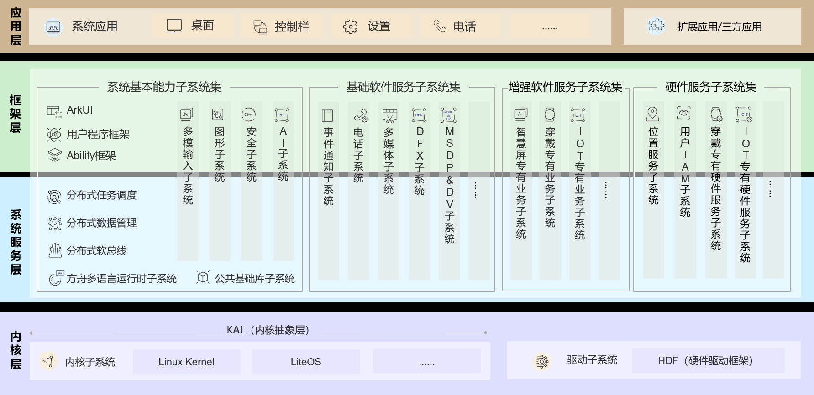


## 安装DevEco Studio

1. 下载: [DevEco Studio huawei.com](https://developer.huawei.com/consumer/cn/deveco-studio#download)

2. 下载完成后，双击下载的“deveco-studio-xxxx.exe”，进入DevEco Studio安装向导。

   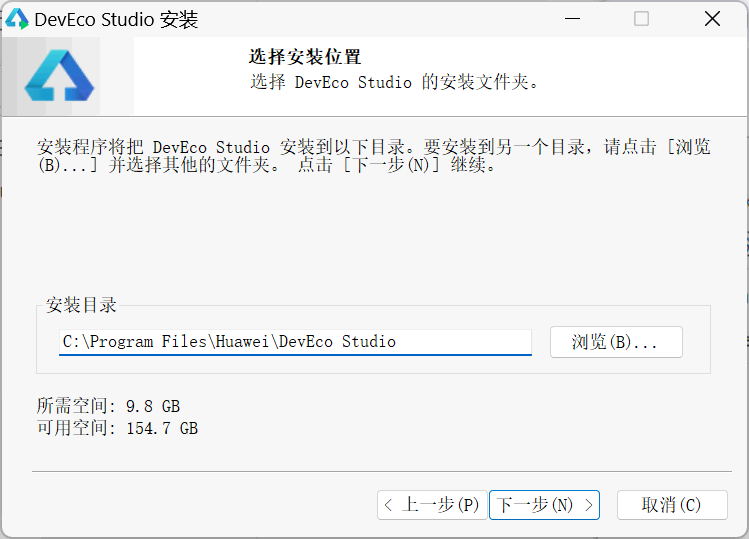


3. 在如下安装选项界面勾选**DevEco Studio**后，单击**Next**，直至安装完成。

   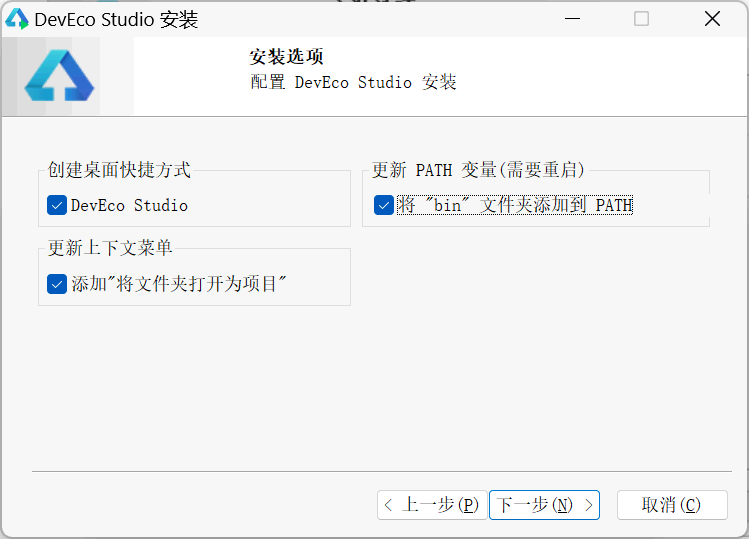

4. 安装完成后，单击**Finish**完成安装。

   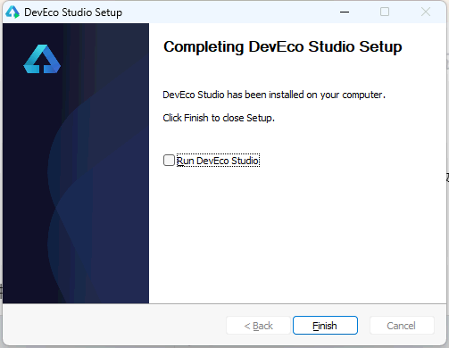

5. 诊断开发环境

   在欢迎页面单击**Diagnose**进行诊断；也可以在菜单栏单击**Help > Diagnostic Tools > Diagnose Development Environment**进行诊断。

   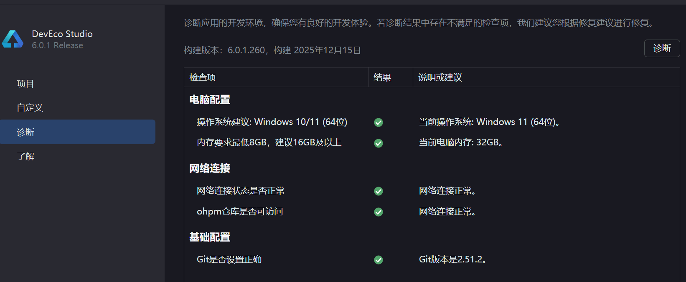


6. 启用中文化插件

   从DevEco Studio 6.0.0 Beta1版本开始，中文化插件**Chinese**默认启用。

   若DevEco Studio 6.0.0 Beta1之前版本，请在菜单栏进入**File > Settings** （macOS为**DevEco Studio > Preferences** ）**> Plugins**，选择**Installed**页签，在搜索框输入“Chinese”，搜索结果里将出现**Chinese(Simplified)**，在右侧单击**Enable**，点击**OK**，在弹窗中单击**Restart**，重启DevEco Studio后即可生效。


## 安装Github和Gitee

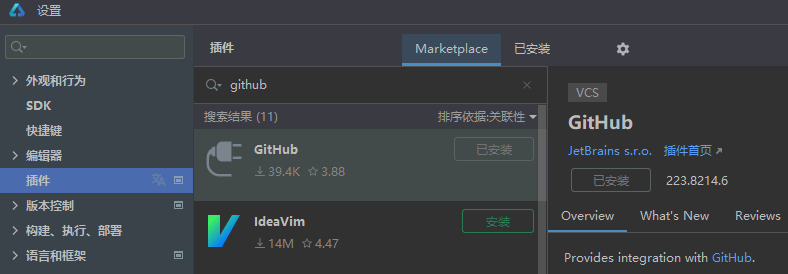


## 构建HarmonyOS应用(ArkTS)

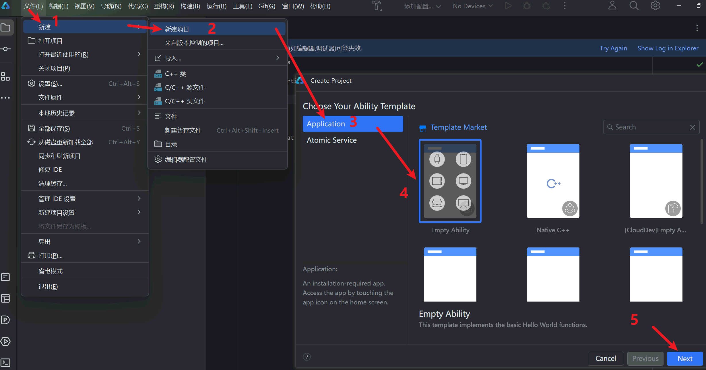

**Application**应用开发，**Atomic Service**对应为元服务开发。选择模板**Empty Ability**


## ArkTS工程目录结构（Stage模型）

### 工程级目录

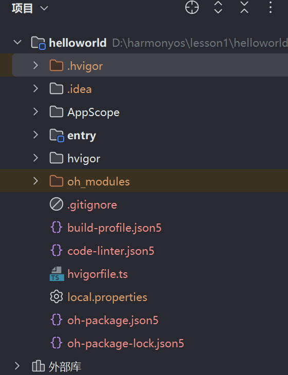

其中详细如下：

- **AppScope**：中存放应用全局所需要的资源文件。
- **entry**：HarmonyOS工程模块，编译构建生成一个[HAP](https://developer.huawei.com/consumer/cn/doc/harmonyos-guides/application-package-glossary#hap)包。是应用的主模块，存放HarmonyOS应用的代码、资源等。
- **oh_modules**：用于存放三方库依赖信息。
- **build-profile.json5**：工程级配置信息，包括签名signingConfigs、产品配置products等。其中products中可配置当前运行环境，默认为HarmonyOS。
- **hvigorfile.ts**：工程级编译构建任务脚本。
- **oh-package.json5**：主要用来描述全局配置，如：依赖覆盖（overrides）、依赖关系重写（overrideDependencyMap）和参数化配置（parameterFile）等。

在**AppScope**，其中有*resources*文件夹和配置文件*app.json5*。`AppScope>resources>base` 中包含element和media两个文件夹：

- **element**：文件夹主要存放公共的字符串、布局文件等资源。
- **media**：存放全局公共的多媒体资源文件。

```tex
AppScope
|---app.json5 // 应用的全局配置信息
|---resources
|	|---base
|	|   |---element // 存放公共的字符串、布局文件等资源。
|	|   |   |---string.json
|	|   |---media // 存放全局公共的多媒体资源文件。
|	|   |   |---background.png
|	|   |   |---foreground.png
|	|   |   |---layered_image.json
```

**layered_image.json** 内容如下

```json
{
  "layered-image":
  {
    "background" : "$media:background",
    "foreground" : "$media:foreground"
  }
}
```

### AppScope-app.json5

**AppScope>app.json5**

应用的全局配置信息，详见[app.json5配置文件](https://developer.huawei.com/consumer/cn/doc/harmonyos-guides/app-configuration-file)。

```tsx
{
  "app": {
    "bundleName": "com.aniuger.lesson1", //包名
    "vendor": "aniuger", //应用程序供应商|开发厂商
    "versionCode": 1000000, //用于区分应用版本
    "versionName": "1.0.0", //版本号
    "icon": "$media:layered_image", //对应于应用的显示图标
    "label": "$string:app_name" //应用名
  }
}
```

主要包含以下内容：

- 应用的全局配置信息，包含应用的包名、开发厂商、版本号等基本信息。
- 特定设备类型的配置信息。


### 模块级目录

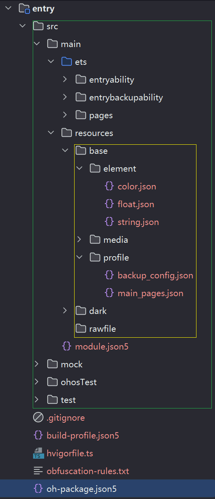

- **entry**：应用/服务模块，编译构建生成一个HAP。

  **entry > src > main > module.json5**：模块配置文件。具体介绍参考下面的 `module.json5`

  **entry > src > main > ets**：用于存放ArkTS源码。

  **entry > src > main > ets > entryability**：应用/服务的入口，存放Ability文件，用于当前Ability应用逻辑和生命周期管理。

  **entry > src > main > ets > entrybackupability**：应用提供扩展的备份恢复能力。

  **entry > src > main > ets > pages**：应用/服务包含的页面。

  **entry > src > main > resources**：用于存放应用/服务所用到的资源文件，如图形、多媒体、字符串、布局文件等。详细说明请参考[资源分类与访问](https://developer.huawei.com/consumer/cn/doc/harmonyos-guides/resource-categories-and-access)。

```tex
resources
|---base  // 默认存在的目录
|   |---element
|   |   |---color.json // 颜色配置
|   |   |---float.json // 浮点型配置
|   |   |---string.json // 字符串配置
|   |---media
|   |   |---icon.png // 图片、视频等媒体资源文件.png、.gif、.mp3、.mp4
|   |---profile
|   |   |---test_profile.json // 自定义profile文件，文件内容可自定义
|---en_GB-vertical-car-mdpi // 自定义限定词目录示例，由开发者创建
|   |---element
|   |   |---string.json
|   |---media
|   |   |---icon.png
|   |---profile
|   |   |---test_profile.json
|---rawfile // 其他类型文件，原始文件形式保存，不会被集成到resources.index文件中。文件名可自定义。
|---resfile // 其他类型文件，原始文件形式保存，不会被集成到resources.index文件中。文件名可自定义。
```


| 资源目录         | 资源文件说明                                                 |
| ---------------- | ------------------------------------------------------------ |
| base>element     | 包括字符串、整型数、颜色、样式等资源的json文件。（目录下仅支持文件类型）-**boolean，布尔型** -**color，颜色** -**float，浮点型，范围是-2^128到2^128** -**intarray，整型数组** -**integer，整型，范围是-2^31到2^31-1** -**plural，复数形式** -**strarray，字符串数组** -**string，字符串** |
| base>media       | 多媒体文件，如图形、视频、音频等文件，支持的文件格式包括：**.png**、**.gif**、**.mp3**、**.mp4**等。 |
| base>profile     | 表示自定义配置文件，其文件内容可[通过包管理接口](https://developer.huawei.com/consumer/cn/doc/harmonyos-references/js-apis-bundlemanager#bundlemanagergetprofilebyability)获取（目录下只支持json文件类型）。 |
| rawfile和resfile | 其他类型文件，用于存储任意格式的原始资源文件，不会被集成到resources.index文件中。文件名可自定义。不会根据设备的状态去匹配不同的资源，需要指定文件路径和文件名进行引用。 |

  **entry > src > ohosTest**：单元测试目录。
  **entry > build-profile.json5**：模块级配置信息 、编译信息配置项，包括buildOption、targets配置等。
  **entry > hvigorfile.ts**：模块级编译构建任务脚本。
  **entry > oh-package.json5**：用来描述包名、版本、入口文件（类型声明文件）和依赖项等信息。
  **entry > obfuscation-rules.txt**：混淆规则文件。混淆开启后，在使用Release模式进行编译时，会对代码进行编译、混淆及压缩处理，保护代码资产。详见[开启代码混淆](https://developer.huawei.com/consumer/cn/doc/harmonyos-guides/ide-build-obfuscation)。


### module.json5

*在FA 模型对应config.json*

`entry>src>main>module.json5` 模块配置文件。主要包含HAP包的配置信息、应用/服务在具体设备上的配置信息以及应用/服务的全局配置信息。详见[module.json5配置文件](https://developer.huawei.com/consumer/cn/doc/harmonyos-guides/module-configuration-file)。

```tex :collapsed-lines=15
{
  "module": {
    "name": "entry",
    "type": "entry",
    "description": "$string:module_desc",
    "mainElement": "EntryAbility",
    "deviceTypes": [
      "phone"
    ],
    "deliveryWithInstall": true,
    "installationFree": false,
    "pages": "$profile:main_pages",
    "abilities": [
      {
        "name": "EntryAbility",
        "srcEntry": "./ets/entryability/EntryAbility.ets",
        "description": "$string:EntryAbility_desc",
        "icon": "$media:layered_image",
        "label": "$string:EntryAbility_label",
        "startWindowIcon": "$media:startIcon",
        "startWindowBackground": "$color:start_window_background",
        "exported": true,
        "skills": [
          {
            "entities": [
              "entity.system.home"
            ],
            "actions": [
              "ohos.want.action.home"
            ]
          }
        ]
      }
    ],
    "extensionAbilities": [
      {
        "name": "EntryBackupAbility",
        "srcEntry": "./ets/entrybackupability/EntryBackupAbility.ets",
        "type": "backup",
        "exported": false,
        "metadata": [
          {
            "name": "ohos.extension.backup",
            "resource": "$profile:backup_config"
          }
        ],
      }
    ]
  }
}
```

主要包含以下内容：

- Module的基本配置信息，例如Module名称、类型、描述、支持的设备类型等基本信息。
- 应用组件信息，包含 `UIAbility` 组件和 `ExtensionAbility` 组件的描述信息。
- 应用运行过程中所需的权限信息。

其中module对应的是模块的配置信息，一个模块对应一个打包后的hap包，hap包全称是`HarmonyOS Ability Package`，其中包含了ability、第三方库、资源和配置文件。

### main_pages.json

`entry/src/main/resources/base/profile/main_pages.json`文件保存的是页面page的路径配置信息，所有需要进行路由跳转的page页面都要在这里进行配置。

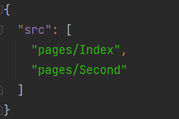

### oh-package.json5

工程级 `oh-package.json5` 和 模块级 `entry/oh-package.json5`

```json
///////////工程级
{
  "modelVersion": "6.0.1",
  "description": "Please describe the basic information.",
  "dependencies": {
  },
  "devDependencies": {
    "@ohos/hypium": "1.0.24",
    "@ohos/hamock": "1.0.0"
  }
}

///////////模块级
{
  "name": "entry",
  "version": "1.0.0",
  "description": "Please describe the basic information.",
  "main": "",
  "author": "",
  "license": "",
  "dependencies": {}
}
```

::: info 说明

- 工程的*package.json*文件的*dependencies*字段处理方式如下：
- - *@ohos/hypium*：测试框架的依赖，迁移时需要放到oh-package.json5文件的devDependencies字段下；
- - 删除 *@ohos/hvigor* 和 *@ohos/hvigor-ohos-plugin*字段，无需迁移到oh-package.json5中；
- - 其他依赖可直接复制到oh-package.json5的dependencies字段中。
- 除表格中呈现的字段外，package.json中其余字段暂不支持迁移。

:::


## APP 包结构

Stage 模型和 FA 模型开发的应用，应用程序包结构并不相同

Entry.hap 相当于window的 `.exe` 文件

FeatureX.hap 相当于window的 `.dll` 文件

### Stage 模型

- Stage模型应用程序包结构如下图所示：

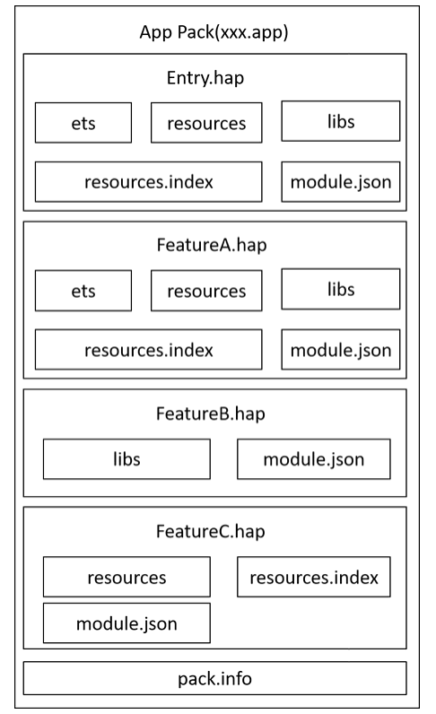

在基于Stage模型开发的应用项目代码下，都存在一个app.json5及一个或多个module.json5这两种配置文件。

### FA 模型

- FA模型应用程序包结构如下图所示：

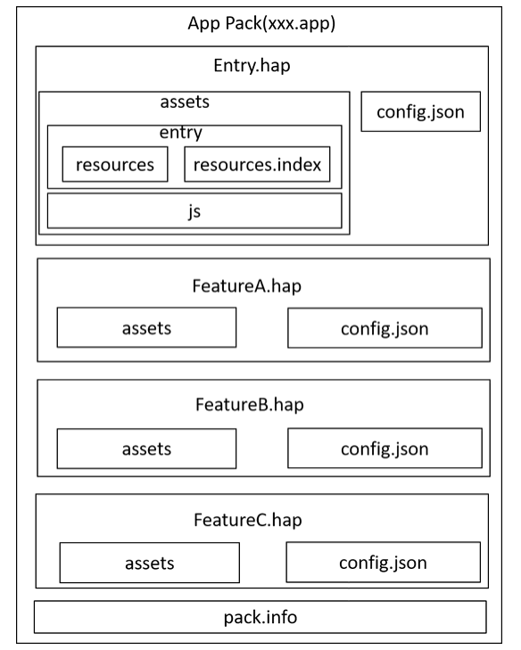

API Version 9工程目录结构图：

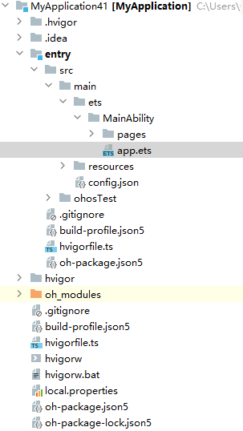

- entry：应用/服务模块，编译构建生成一个HAP。
- - **src > main > ets**：用于存放ArkTS源码。
- - **src > main > ets > MainAbility**：应用/服务的入口。
- - **src > main > ets > MainAbility > pages**：MainAbility包含的页面。
- - **src > main > ets > MainAbility > app.ets**：承载Ability生命周期。
- - **src > main > resources**：用于存放应用/服务所用到的资源文件，如图形、多媒体、字符串、布局文件等。

- - **src > main > config.json**：模块配置文件，主要包含HAP的配置信息、应用在具体设备上的配置信息以及应用的全局配置信息。

## 构建Login登录页

:::info 说明

右键单击**pages**文件夹时，选择**New > Page** **> Empty Page**，命名为**Login**，单击**Finish**完成。无需再`resources/base/profile/main_pages.json`路由的手动配置。

:::

修改默认启动加载页`src/main/ets/entryability/EntryAbility.ets`

```tex
windowStage.loadContent('pages/Login', (err) => {
```

页面均使用[Row](https://developer.huawei.com/consumer/cn/doc/harmonyos-references/ts-container-row)和[Column](https://developer.huawei.com/consumer/cn/doc/harmonyos-references/ts-container-column)组件来组建布局。对于更多复杂元素对齐的场景，可选择使用[RelativeContainer](https://developer.huawei.com/consumer/cn/doc/harmonyos-references/ts-container-relativecontainer)组件进行布局。更多关于UI布局的选择和使用，可见[如何选择布局](https://developer.huawei.com/consumer/cn/doc/harmonyos-guides/arkts-layout-development-overview#如何选择布局)。

使用`Text`文本组件：

```tsx
@Entry
@Component
struct Login {
  @State message: string = '登录界面';

  build() {
    Row(){
      Column(){
        Text(this.message)
          .fontSize(50)
          .fontWeight(FontWeight.Bold)
      }
      .width('100%')
    }
    .height('100%')
  }
}
```

添加按钮：

```tsx
      Column() {
        Text(this.message)
          .fontSize(50)
          .fontWeight(FontWeight.Bold)
        // 添加按钮，以响应用户onClick事件
        Button() {
          Text('登录')
            .fontSize(30)
            .fontWeight(FontWeight.Bold)
        }
        .type(ButtonType.Capsule)
        .margin({
          top: 20
        })
        .backgroundColor('#0D9FFB')
        .width('40%')
        .height('5%')
      }
```

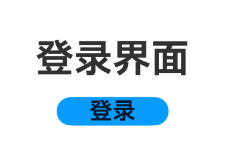

## 构建Index首页

### 实现页面间的跳转

页面间的导航可以通过[页面路由router](https://developer.huawei.com/consumer/cn/doc/harmonyos-references/arkts-apis-uicontext-router)来实现；如果需要实现更好的转场动效，推荐组件导航([Navigation](https://developer.huawei.com/consumer/cn/doc/harmonyos-guides/arkts-navigation-navigation)) 。

在第一个页面Login中，跳转按钮绑定onClick事件，单击按钮时跳转到第二页。

```tex
		.width('40%')
		.height('5%')
        // 跳转按钮绑定onClick事件，单击时跳转到第二页
        .onClick(() => {
          console.info(`成功点击了“登录”按钮.`)
          // 获取UIContext
          let uiContext: UIContext = this.getUIContext();
          let router = uiContext.getRouter();
          // 跳转到第二页
          router.pushUrl({ url: 'pages/Index' }).then(() => {
            console.info('成功跳转到第二页.')

          }).catch((err: BusinessError) => {
            console.error(`跳转到第二页失败. Code is ${err.code}, message is ${err.message}`)
          })
        })
```

在第二个页面Index中，返回按钮绑定onClick事件，单击按钮时返回到第一页

```tex :collapsed-lines=15
@Entry
@Component
struct Index {
  @State message: string = '欢迎加入系统';

  build() {
    Row() {
      Column() {
        Text(this.message)
          .fontSize(50)
          .fontWeight(FontWeight.Bold)
        Button() {
          Text('退出登录')
            .fontSize(30)
            .fontWeight(FontWeight.Bold)
        }
        .type(ButtonType.Capsule)
        .margin({
          top: 20
        })
        .backgroundColor('#0D9FFB')
        .width('40%')
        .height('5%')
        // 返回按钮绑定onClick事件，单击按钮时返回到第一页
        .onClick(() => {
          console.info(`成功点击了“退出登录”按钮.`)
          // 获取UIContext
          let uiContext: UIContext = this.getUIContext();
          let router = uiContext.getRouter();
          try {
            // 返回第一页
            router.back()
          } catch (err) {
            let code = (err as BusinessError).code;
            let message = (err as BusinessError).message;
            console.error(`跳转到登录页失败. Code is ${code}, message is ${message}`)
          }
        })
      }
      .width('100%')
    }
    .height('100%')
  }
}
```


## 工具使用技巧

**代码格式化**：

- 代码格式化：**Ctrl + Alt + L**（macOS为**Option+Command +L**）
- 不需要进行格式化：在**File > Settings >Editor > Code Style**，单击“Formatter”，勾选“Turn formatter on/off with markers in code comments”。代码块前增加`//@formatter:off` 最后增加`//@formatter:on”`

**代码格式化规则**：

若工程已配置code-linter.json5文件，选中code-linter.json5文件右键选择**Apply CodeLinter Style Rules**，代码格式化规则将与已配置的code-linter.json5文件中相关规则保持一致。code-linter.json5文件配置请参考[配置代码检查规则](https://developer.huawei.com/consumer/cn/doc/harmonyos-guides/ide-code-linter#section19310459444)。

**代码引用查找**：

在要查找的对象上，单击鼠标**右键 > Find Usages**或使用快捷键**Alt +F7**（macOS为**Option +** **F7**）。

**Optimize Imports功能**：

- 快速清除未使用的import，并根据设置的规则对import进行合并或排序。
- 选择文件或目录，使用快捷键**Ctrl+Alt+O**，或单击菜单栏**Code > Optimize Imports**。
- 如需修改优化配置，进入**File > Settings** **> Editor > Code Style**


