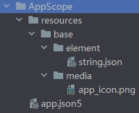

**HarmonyOS第一课**：包含了*Hello World*、ArkTS、应用程序框架、构建更加丰富的页面、给应用添加动画、从网络获取数据、保存应用数据、给应用添加通知和提醒、应用服务上架等知识。

<!-- more -->

# HarmonyOS第一课之工程介绍

## 技术架构


## 创建项目(主要部分)


## 了解基本工程目录

### 工程级目录


其中详细如下：

- **AppScope**：中存放应用全局所需要的资源文件。
- **entry**：是应用的主模块，存放HarmonyOS应用的代码、资源等。
- **oh_modules**：是工程的依赖包，存放工程依赖的源文件。关于原npm工程适配OHPM包管理器操作，请参考[OHPM包管理器](https://developer.huawei.com/consumer/cn/doc/harmonyos-guides-V2/project_overview-0000001053822398-V2)。
- **build-profile.json5**：是工程级配置信息，包括签名、产品配置等。
- **hvigorfile.ts**：是工程级编译构建任务脚本，hvigor是基于任务管理机制实现的一款全新的自动化构建工具，主要提供任务注册编排，工程模型管理、配置管理等核心能力。
- **oh-package.json5**：是工程级依赖配置文件，用于记录引入包的配置信息。

在AppScope ，其中有*resources*文件夹和配置文件*app.json5*。`AppScope>resources>base` 中包含element和media两个文件夹，

- **element**：文件夹主要存放公共的字符串、布局文件等资源。
- **media**：存放全局公共的多媒体资源文件。




### 模块级目录


- **entry**：应用/服务模块，编译构建生成一个HAP。
- **entry > src > main > module.json5**：Stage模型模块配置文件。具体介绍参考下面的 `module.json5` 目录级
- **entry > src > main > ets**：用于存放ArkTS源码。
- **entry > src > main > ets > entryability**：应用/服务的入口，存放ability文件，用于当前ability应用逻辑和生命周期管理。
- **entry > src > main > ets > pages**：存放UI界面相关代码文件，初始会生成一个Index页面。
- **entry > src > main > resources**：用于存放应用/服务所用到的资源文件，如图形、多媒体、字符串、布局文件等。关于资源文件的详细说明请参考[资源分类与访问](https://developer.huawei.com/consumer/cn/doc/harmonyos-guides-V2/resource-categories-and-access-0000001544463977-V2)。

| 资源目录     | 资源文件说明                                                 |
| ------------ | ------------------------------------------------------------ |
| base>element | 包括字符串、整型数、颜色、样式等资源的json文件。每个资源均由json格式进行定义，例如：</br> boolean.json：布尔型 </br> color.json：颜色 </br> float.json：浮点型 </br> intarray.json：整型数组 </br> integer.json：整型 </br> pattern.json：样式 </br> plural.json：复数形式 </br> strarray.json：字符串数组 </br> string.json：字符串值 |
| base>media   | 多媒体文件，如图形、视频、音频等文件，支持的文件格式包括：**.png**、**.gif**、**.mp3**、**.mp4**等。 |
| rawfile      | 用于存储任意格式的原始资源文件。rawfile不会根据设备的状态去匹配不同的资源，需要指定文件路径和文件名进行引用。 |


- **entry > src > ohosTest**：是单元测试目录。
- **entry > build-profile.json5**：是模块级配置信息，包括编译构建配置项。
- **entry > hvigorfile.ts**：文件是模块级编译构建任务脚本。
- **entry > oh-package.json5**：是模块级依赖配置信息文件，配置三方包声明文件的入口及包名。


### app.json5

`AppScope>app.json5`


主要包含以下内容：

- 应用的全局配置信息，包含应用的包名、开发厂商、版本号等基本信息。
- 特定设备类型的配置信息。

其中配置信息如下：

- bundleName：包名。
- vendor：应用程序供应商。
- versionCode：用于区分应用版本。
- versionName：版本号。
- icon：对应于应用的显示图标。
- label：应用名。

### module.json5(Stage 模型)

`entry>src>main>module.json5` 是 Stage 模型模块配置文件，主要包含HAP的配置信息、应用在具体设备上的配置信息以及应用的全局配置信息。


主要包含以下内容：

- Module的基本配置信息，例如Module名称、类型、描述、支持的设备类型等基本信息。
- 应用组件信息，包含 `UIAbility` 组件和 `ExtensionAbility` 组件的描述信息。
- 应用运行过程中所需的权限信息。

其中module对应的是模块的配置信息，一个模块对应一个打包后的hap包，hap包全称是`HarmonyOS Ability Package`，其中包含了ability、第三方库、资源和配置文件。其具体属性及其描述可以参照下表1。

**表1 module.json5默认配置属性及描述**

| 属性                  | 描述                                                                                  |
|:--------------------|:------------------------------------------------------------------------------------|
| name                | 该标签标识当前module的名字，module打包成hap后，表示hap的名称，标签值采用字符串表示（最大长度31个字节），该名称在整个应用要唯一。          |
| type                | 表示模块的类型，类型有三种，分别是entry、feature和har。                                                 |
| srcEntry            | 当前模块的入口文件路径。                                                                        |
| description         | 当前模块的描述信息。                                                                          |
| mainElement         | 该标签标识hap的入口ability名称或者extension名称。只有配置为mainElement的ability或者extension才允许在服务中心露出。    |
| deviceTypes         | 该标签标识hap可以运行在哪类设备上，标签值采用字符串数组的表示。                                                   |
| deliveryWithInstall | 标识当前Module是否在用户主动安装的时候安装，表示该Module对应的HAP是否跟随应用一起安装。- true：主动安装时安装。- false：主动安装时不安装。 |
| installationFree    | 标识当前Module是否支持免安装特性。- true：表示支持免安装特性，且符合免安装约束。- false：表示不支持免安装特性。                   |
| pages               | 对应的是main_pages.json文件，用于配置ability中用到的page信息。                                        |
| abilities           | 是一个数组，存放当前模块中所有的ability元能力的配置信息，其中可以有多个ability。                                     |

**表2 abilities中对象的默认配置属性及描述**

| 属性                    | 描述                                                                                   |
|:----------------------|:-------------------------------------------------------------------------------------|
| name                  | 该标签标识当前ability的逻辑名，该名称在整个应用要唯一，标签值采用字符串表示（最大长度127个字节）。                               |
| srcEntry              | ability的入口代码路径。                                                                      |
| description           | ability的描述信息。                                                                        |
| icon                  | ability的图标。该标签标识ability图标，标签值为资源文件的索引。该标签可缺省，缺省值为空。如果ability被配置为MainElement，该标签必须配置。 |
| label                 | ability的标签名。                                                                         |
| startWindowIcon       | 启动页面的图标。                                                                             |
| startWindowBackground | 启动页面的背景色。                                                                            |
| visible               | ability是否可以被其他应用程序调用，true表示可以被其它应用调用， false表示不可以被其它应用调用。                             |
| skills                | 标识能够接收的意图的action值的集合，取值通常为系统预定义的action值，也允许自定义。                                      |
| entities              | 标识能够接收的Want的Action值的集合，取值通常为系统预定义的action值，也允许自定义。                                    |
| actions               | 标识能够接收Want的Entity值的集合。                                                               |

### config.json(FA 模型)

`entry>src>main>config.json` 是 FA 模型模块配置文件，主要包含HAP的配置信息、应用在具体设备上的配置信息以及应用的全局配置信息。

### main_pages.json

`entry/src/main/resources/base/profile/main_pages.json`文件保存的是页面page的路径配置信息，所有需要进行路由跳转的page页面都要在这里进行配置。


### oh-package.json5

工程级 `oh-package.json5` 和 模块级 `entry/oh-package.json5`

```json
///////////工程级
{
  "name": "helloWorld",
  "version": "1.0.0",
  "description": "学习鸿蒙系统之第一课到入门知识",
  "main": "",
  "author": "jf",
  "license": "",
  "dependencies": {
  },
  "devDependencies": {
    "@ohos/hypium": "1.0.6"
  }
}
///////////模块级
{
  "name": "entry",
  "version": "1.0.0",
  "description": "学习Helloworld，ArkTS语言，UIAbility的使用。",
  "main": "",
  "author": "jf",
  "license": "",
  "dependencies": {}
}
```

| oh-package.json5包含字段 | 字段说明     | 说明                                                         |
| ------------------------ | ------------ | ------------------------------------------------------------ |
| name                     | 软件包名称   | 必选字段，若package.json文件中未指明，需在oh-package.json5添加补齐 |
| version                  | 软件包版本   | 必选字段，若package.json文件中未指明，需在oh-package.json5添加补齐 |
| description              | 软件包简介   | 必选字段，若package.json文件中未指明，需在oh-package.json5添加补齐 |
| keywords                 | 软件包关键字 | -                                                            |
| homepage                 | 主页链接     | -                                                            |
| license                  | 开源协议     | -                                                            |
| author                   | 软件包作者   | -                                                            |
| main                     | 软件包入口   | -                                                            |
| repository               | 仓库地址     | -                                                            |
| dependencies             | 生产依赖     | 该字段处理方式请参阅下方说明内容                             |
| devDependencies          | 开发依赖     | -                                                            |
| types                    | 类型定义     | -                                                            |
| artifactType             | 共享包类型   | 可选项：</br> original：源码，即发布源码(.ts/.ets)。</br> obfuscation：混淆代码，即源码经过混淆之后发布上传。 |

::: info 说明

- 工程的*package.json*文件的*dependencies*字段处理方式如下：
- - *@ohos/hypium*：测试框架的依赖，迁移时需要放到oh-package.json5文件的devDependencies字段下；
- - 删除 *@ohos/hvigor* 和 *@ohos/hvigor-ohos-plugin*字段，无需迁移到oh-package.json5中；
- - 其他依赖可直接复制到oh-package.json5的dependencies字段中。
- 除表格中呈现的字段外，package.json中其余字段暂不支持迁移。如您在历史工程中使用到其余字段，请反馈您所使用的字段（选中文本，点击“意见反馈”）。

:::


## APP 包结构

Stage 模型和 FA 模型开发的应用，应用程序包结构并不相同

Entry.hap 相当于window的 `.exe` 文件

FeatureX.hap 相当于window的 `.dll` 文件

### Stage 模型

- Stage模型应用程序包结构如下图所示：


#### ArkTS 工程目录结构（API Version 8-9）


在基于Stage模型开发的应用项目代码下，都存在一个app.json5及一个或多个module.json5这两种配置文件。

### FA 模型

- FA模型应用程序包结构如下图所示：


#### ArkTS 工程目录结构（API Version 8-9）

API Version 8工程目录结构图：


API Version 9工程目录结构图：


- entry：应用/服务模块，编译构建生成一个HAP。
- - **src > main > ets**：用于存放ArkTS源码。
- - **src > main > ets > MainAbility**：应用/服务的入口。
- - **src > main > ets > MainAbility > pages**：MainAbility包含的页面。
- - **src > main > ets > MainAbility > app.ets**：承载Ability生命周期。
- - **src > main > resources**：用于存放应用/服务所用到的资源文件，如图形、多媒体、字符串、布局文件等。

  | 资源目录     | 资源文件说明                                                 |
  | ------------ | ------------------------------------------------------------ |
  | base>element | 包括字符串、整型数、颜色、样式等资源的json文件。每个资源均由json格式进行定义，例如：</br> boolean.json：布尔型 </br> color.json：颜色 </br> float.json：浮点型 </br> intarray.json：整型数组 </br> integer.json：整型 </br> pattern.json：样式 </br> plural.json：复数形式 </br> strarray.json：字符串数组 </br> string.json：字符串值 |
  | base>media   | 多媒体文件，如图形、视频、音频等文件，支持的文件格式包括：**.png**、**.gif**、**.mp3**、**.mp4**等。 |
  | rawfile      | 用于存储任意格式的原始资源文件。rawfile不会根据设备的状态去匹配不同的资源，需要指定文件路径和文件名进行引用。 |
- - **src > main > config.json**：模块配置文件，主要包含HAP的配置信息、应用在具体设备上的配置信息以及应用的全局配置信息。


### 其他工程目录结构请查看

[其他工程目录结构请查看](https://developer.huawei.com/consumer/cn/doc/harmonyos-guides-V2/project_overview-0000001053822398-V2#section1483695981112)


