包含了 界面布局容器，基础组件，List组件、Grid组件和Tabs组件的使用。

<!-- more -->

# HarmonyOS第一课之容器组件与布局

## 容器组件与布局

包含了界面布局容器（Column、Row、Swiper），基础组件（Text、Image、TextInput、Button、Button）和容器组件（List 组件、Grid 组件、Tabs 组件）


### 相关概念

基础组件：

- **Text**：显示一段文本的组件。
- **Image**：图片组件，支持本地图片和网络图片的渲染展示。
- **TextInput**：可以输入单行文本并支持响应输入事件的组件。
- **Button**：按钮组件，可快速创建不同样式的按钮。
- **LoadingProgress**：用于显示加载动效的组件。

容器组件：

- **Flex**：应用弹性方式布局子组件的容器组件。
- **Column**：沿垂直方向布局的容器。
- **Row**：沿水平方向布局容器。
- **List**：列表包含一系列相同宽度的列表项。适合连续、多行呈现同类数据，例如图片和文本。
- **Swiper**：滑动容器，提供切换子组件显示的能力。
- **Grid**：网格容器，由“行”和“列”分割的单元格所组成，通过指定“项目”所在的单元格做出各种各样的布局。

### Column和Row

- Column 列，沿垂直方向布局的容器。
- Row 行，沿水平方向布局的容器。

---

主轴和交叉轴概念：

> 一个垂直，一个水平；以一个为主轴时，另一个就是交叉轴。

属性介绍：

- justifyContent：设置子组件在主轴方向上的对齐格式。

子组件在主轴方向上的对齐使用justifyContent属性来设置，其参数类型是FlexAlign。`FlexAlign` 定义了以下几种类型：

- - **Start**：元素在主轴方向首端对齐，第一个元素与行首对齐，同时后续的元素与前一个对齐（简单理解：首部对齐）。
- - **Center**：元素在主轴方向中心对齐（简单理解：居中对齐）。
- - **End**：元素在主轴方向尾部对齐（简单理解：尾部对齐）。
- - **SpaceBetween**：元素在主轴方向均匀分配弹性元素，相邻元素之间距离相同。 第一个元素与行首对齐，最后一个元素与行尾对齐。
- - **SpaceAround**：元素在主轴方向均匀分配弹性元素，相邻元素之间距离相同。 第一个元素到行首的距离和最后一个元素到行尾的距离是相邻元素之间距离的一半。
- - **SpaceEvenly**：元素在主轴方向等间距布局，无论是相邻元素还是边界元素到容器的间距都一样。

---

- alignItems：设置子组件在交叉轴方向上的对齐格式。

-Column容器的主轴是垂直方向，交叉轴是水平方向，其参数类型为HorizontalAlign（水平对齐），`HorizontalAlign` 定义了以下几种类型：

- - **Start**：设置子组件在水平方向上按照起始端对齐。
- - **Center**（默认值）：设置子组件在水平方向上居中对齐。
- - **End**：设置子组件在水平方向上按照末端对齐。

---

-Row容器的主轴是水平方向，交叉轴是垂直方向，其参数类型为VerticalAlign（垂直对齐），`VerticalAlign` 定义了以下几种类型：

- - **Top**：设置子组件在垂直方向上居顶部对齐。
- - **Center**（默认值）：设置子组件在竖直方向上居中对齐。
- - **Bottom**：设置子组件在竖直方向上居底部对齐。

---


接口介绍：

- Column(value?:{space?: string | number})
- Row(value?:{space?: string | number})

Column和Row容器的接口都有一个可选参数space，表示子组件在主轴方向上的间距。

### 构建列表页面布局

常见的列表有线性列表（List列表）和网格布局（Grid列表）：

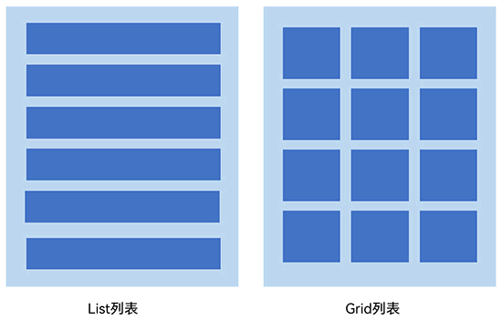

### List组件的使用

#### List组件简介

List是很常用的滚动类容器组件，一般和子组件`ListItem`一起使用，`List`列表中的每一个列表项对应一个`ListItem`组件。

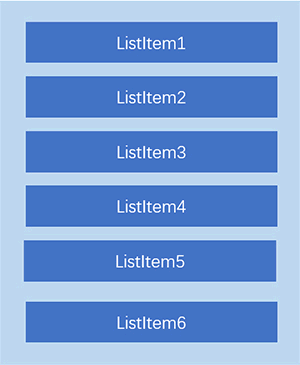

#### 使用ForEach渲染列表

```tsx
@Entry
@Component
struct ListDemo {
  private arr: number[] = [0, 1, 2, 3, 4, 5, 6, 7, 8, 9]

  build() {
    Column() {
      List({ space: 10 }) {
        ForEach(this.arr, (item: number) => {
          ListItem() {
            Text(`${item}`)
              .width('100%')
              .height(100)
              .fontSize(20)
              .fontColor(Color.White)
              .textAlign(TextAlign.Center)
              .borderRadius(10)
              .backgroundColor(0x007DFF)
          }
        }, item => item)
      }
    }
    .padding(12)
    .height('100%')
    .backgroundColor(0xF1F3F5)
  }
}
```

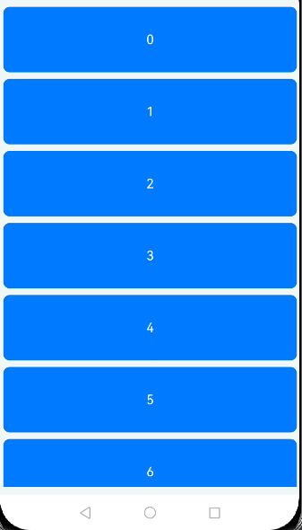

#### 设置列表项分割线

List组件子组件ListItem之间默认是没有分割线的，部分场景子组件ListItem间需要设置分割线，
这时候您可以使用List组件的`divider`属性。divider属性包含四个参数：

- **strokeWidth**: 分割线的线宽。
- **color**: 分割线的颜色。
- **startMargin**：分割线距离列表侧边起始端的距离。
- **endMargin**: 分割线距离列表侧边结束端的距离。

```tsx
List(){ ... }.divider({ strokeWidth: '4', color: Color.Red, startMargin: '8', endMargin: '8' })
```

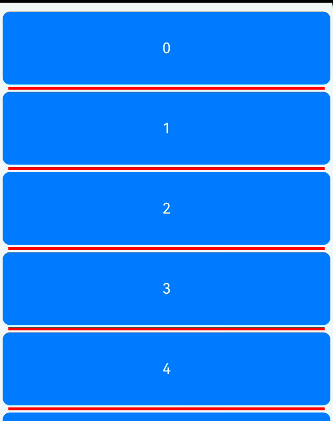

#### List列表滚动事件监听

List组件提供了一系列事件方法用来监听列表的滚动，您可以根据需要，监听这些事件来做一些操作：

- onScroll：列表滑动时触发，返回值scrollOffset为滑动偏移量，scrollState为当前滑动状态。
- onScrollIndex：列表滑动时触发，返回值分别为滑动起始位置索引值与滑动结束位置索引值。
- onReachStart：列表到达起始位置时触发。
- onReachEnd：列表到底末尾位置时触发。
- onScrollStop：列表滑动停止时触发。

```tsx
List({ space: 10 }) {
  ForEach(this.arr, (item) => {
    ListItem() {
      Text(`${item}`)
        ...
    }.editable(true)
  }, item => item)
}
.editMode(this.editFlag)
// 列表滑动时触发，返回值分别为 滑动起始位置索引值 与 滑动结束位置索引值。
.onScrollIndex((firstIndex: number, lastIndex: number) => {
    console.info('first：' + firstIndex + '，last：' + lastIndex)
})
// 列表滑动时触发，返回值scrollOffset为滑动偏移量，scrollState为当前滑动状态。
.onScroll((scrollOffset: number, scrollState: ScrollState) => {
    console.info('scrollOffset：' + scrollOffset + '，scrollState：' + scrollState)
})
// 滑动到顶部时
.onReachStart(() => {
    console.info('onReachStart')
})
// 滑动到底部时
.onReachEnd(() => {
    console.info('onReachEnd')
})
// 停止滑动时
.onScrollStop(() => {
    console.info('onScrollStop')
})
```

#### 设置List排列方向listDirection

List组件里面的列表项默认是按垂直方向排列的.

`listDirection` 属性设置为`Axis.`。

```tsx
List(){ ... }.listDirection(Axis.Vertical)
```

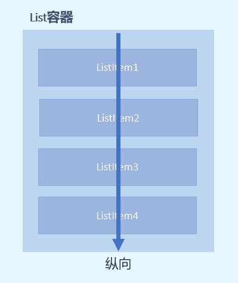

`listDirection` 属性设置为`Axis.Horizontal`。

```tsx
List(){ ... }.listDirection(Axis.Horizontal)
```

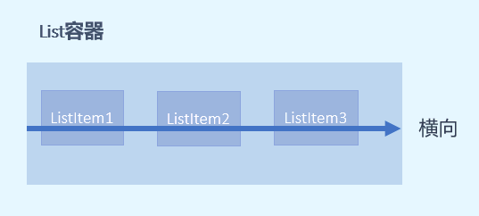

### Grid组件的使用

#### Grid组件简介

Grid组件为网格容器，是一种网格列表，由“行”和“列”分割的单元格所组成，通过指定“项目”所在的单元格做出各种各样的布局。Grid组件一般和子组件GridItem一起使用，Grid列表中的每一个条目对应一个GridItem组件。

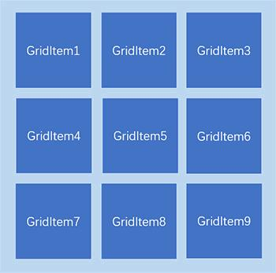

#### 使用ForEach渲染网格布局

和List组件一样，Grid组件也可以使用ForEach来渲染多个列表项GridItem，我们通过下面的这段示例代码来介绍Grid组件的使用。

```tsx
@Entry
@Component
struct GridExample {
  private arr: String[] = ['0', '1', '2', '3']

  build() {
    Column() {
      Grid() {
        ForEach(this.arr, (day: string) => {
          ForEach(this.arr, (day: string) => {
            GridItem() {
              Text(day)
                .fontSize(16)
                .fontColor(Color.White)
                .backgroundColor(0x007DFF)
                .width('100%')
                .height('100%')
                .textAlign(TextAlign.Center)
            }
          }, day => day)
        }, day => day)
      }
      .columnsTemplate('1fr 1fr 1fr 1fr')
      .rowsTemplate('1fr 1fr 1fr 1fr')
      .columnsGap(10)
      .rowsGap(10)
      .height(300)
    }
    .width('100%')
    .padding(12)
    .backgroundColor(0xF1F3F5)
  }
}
```

示例代码中使用了两层ForEach遍历长度为4的数组arr，创建了16个GridItem列表项。

- columnsTemplate：`1fr 1fr 1fr 1fr`，表示这个网格为4列，将Grid允许的宽分为4等分，每列占1份；
- rowsTemplate：`1fr 1fr 1fr 1fr`，表示这个网格为4行，将Grid允许的高分为4等分，每行占1份。
- columnsGap：列间距为10vp。
- rowsTemplate：行间距为10vp。

示例代码效果图如下：

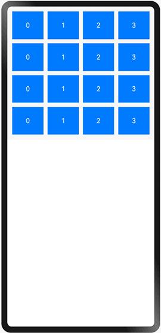

上面构建的网格布局使用了固定的行数和列数，所以构建出的网格是不可滚动的。
然而有时候因为内容较多，我们通过滚动的方式来显示更多的内容，就需要一个可以滚动的网格布局。
我们只需要设置 rowsTemplate 和 columnsTemplate 中的一个即可。

将示例代码中 `GridItem` 的高度设置为固定值，例如100；仅设置 columnsTemplate 属性，不设置rowsTemplate属性，就可以实现Grid列表的滚动：

```tsx
Grid() {
  ForEach(this.arr, (day: string) => {
    ForEach(this.arr, (day: string) => {
      GridItem() {
        Text(day)
          .height(100)
          ...
      }
    }, day => day)
  }, day => day)
}
.columnsTemplate('1fr 1fr 1fr 1fr')
.columnsGap(10)
.rowsGap(10)
.height(300)
```

此外，Grid像List一样也可以使用onScrollIndex来监听列表的滚动。

### 列表性能优化

开发者在使用长列表时，如果直接采用循环渲染方式，会一次性加载所有的列表元素，从而导致页面启动时间过长，影响用户体验，推荐通过以下方式来进行列表性能优化：

[使用数据懒加载](https://developer.huawei.com/consumer/cn/doc/harmonyos-guides-V2/ui-ts-performance-improvement-recommendation-0000001477981001-V2#ZH-CN_TOPIC_0000001523648418__推荐使用数据懒加载)

[设置list组件的宽高](https://developer.huawei.com/consumer/cn/doc/harmonyos-guides-V2/ui-ts-performance-improvement-recommendation-0000001477981001-V2#section637765124414)

### 参考链接

1. List组件的相关API参考：[List组件](https://developer.huawei.com/consumer/cn/doc/harmonyos-references-V2/ts-container-list-0000001477981213-V2)。
2. Grid组件的相关API参考：[Grid组件](https://developer.huawei.com/consumer/cn/doc/harmonyos-references-V2/ts-container-grid-0000001478341161-V2)。

### Tabs 组件

ArkUI开发框架提供了一种页签容器组件Tabs，开发者通过Tabs组件可以很容易的实现内容视图的切换。

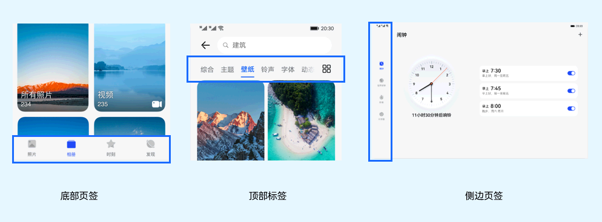

#### Tabs组件的简单使用

Tabs组件仅可包含子组件TabContent，每一个页签对应一个内容视图即TabContent组件。

```tsx
@Entry
@Component
struct TabsExample {
  private controller: TabsController = new TabsController()

  build() {
    Column() {
      Tabs({ barPosition: BarPosition.Start, controller: this.controller }) {
        TabContent() {
          Column().width('100%').height('100%').backgroundColor(Color.Green)
        }
        .tabBar('green')
        ...
      }
      .barWidth('100%') // 设置TabBar宽度
      .barHeight(60) // 设置TabBar高度
      .width('100%') // 设置Tabs组件宽度
      .height('100%') // 设置Tabs组件高度
      .backgroundColor(0xF5F5F5) // 设置Tabs组件背景颜色
    }
    ...
  }
}
```

效果如下：

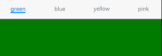

Tabs组件中包含4个子组件TabContent，通过TabContent的 `tabBar` 属性设置 `TabBar` 的显示内容。

使用通用属性 `width`和`height` 设置了Tabs组件的宽高，

使用 `barWidth`和`barHeight` 设置了TabBar的宽度和高度。

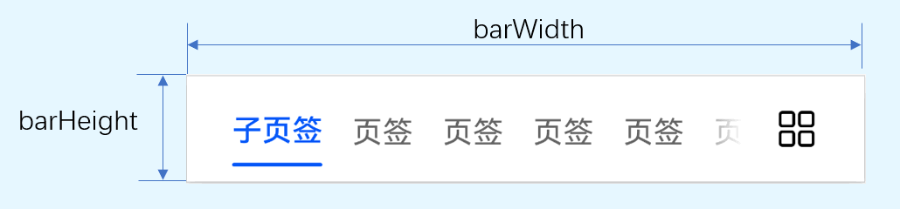

说明

- TabContent 组件不支持设置通用 *宽度* 属性，其宽度默认撑满Tabs父组件。
- TabContent 组件不支持设置通用 *高度* 属性，其高度由Tabs *父组件高度* 与TabBar组件 *高度* 决定。


#### 设置TabBar布局模式

因为Tabs的布局模式默认是Fixed的，所以Tabs的页签是不可滑动的。当页签比较多的时候，可能会导致页签显示不全，
将布局模式设置为Scrollable的话，可以实现页签的滚动。

Tabs的布局模式有 `Fixed`（默认）和 `Scrollable` 两种：

- BarMode.Fixed：所有TabBar平均分配barWidth宽度（纵向时平均分配barHeight高度）,页签不可滚动，效果图如下：

  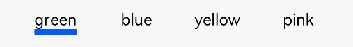

- BarMode.Scrollable：每一个TabBar均使用实际布局宽度，超过总长度（横向Tabs的barWidth，纵向Tabs的barHeight）后可滑动。

  

```tsx
@Entry
@Component
struct TabsExample {
  private controller: TabsController = new TabsController()

  build() {
    Column() {
      Tabs({ barPosition: BarPosition.Start, controller: this.controller }) {
        TabContent() {
          Column().width('100%').height('100%').backgroundColor(Color.Green)
        }
        .tabBar('green')
        ...
      }
      // 设置Tabs的布局模式，Fixed：所有TabBar平均分配barWidth宽度（纵向时平均分配barHeight高度）,页签不可滚动；
      // Scrollable：每一个TabBar均使用实际布局宽度，超过总长度（横向Tabs的barWidth，纵向Tabs的barHeight）后可滑动。
      .barMode(BarMode.Scrollable) 
      ...
    }
    ...
  }
}
```

#### 设置TabBar位置和排列方向

使用Tabs组件接口中的参数barPosition设置页签位置.

此外页签显示位置还与vertical属性相关联，vertical属性用于设置页签的排列方向，当vertical的属性值为false（默认值）时页签横向排列，为true时页签纵向排列。

barPosition的值可以设置为 `BarPosition.Start`（默认值）和 `BarPosition.End` ：

- BarPosition.Start（简单理解：可以位于容器顶部【false】和左侧【true】）

- - `vertical` 属性方法设置为 false（默认值）时，页签位于容器顶部。

  ```tsx
  Tabs({ barPosition: BarPosition.Start }) {
    ...
  }
  .vertical(false)
  ```
  
  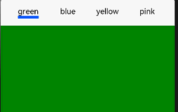

- - vertical属性方法设置为true时，页签位于容器左侧。

  ```tsx
  Tabs({ barPosition: BarPosition.Start }) {
    ...
  }
  .vertical(true)
  ```
  
  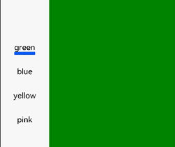

- BarPosition.End（简单理解：可以位于容器低部【false】和右侧【true】）

- - vertical属性方法设置为false时，页签位于容器底部。

  ```tsx
  Tabs({ barPosition: BarPosition.End }) {
    ...
  }
  .vertical(false)
  ```

  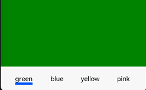

- - vertical属性方法设置为true时，页签位于容器右侧。

  ```tsx
  Tabs({ barPosition: BarPosition.End }) {
    ...
  }
  .vertical(true)
  ```
  
  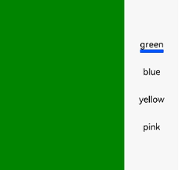


#### 自定义TabBar样式

往往开发过程中，UX给我们的设计效果可能并不是这样的，比如下面的这种底部页签效果：

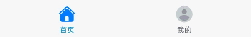

TabContent的tabBar属性除了支持 `string` 类型，还支持使用 `@Builder` 装饰器修饰的函数。
您可以使用@Builder装饰器，构造一个生成自定义TabBar样式的函数，实现上面的底部页签效果，

示例代码如下：

```tsx
@Entry
@Component
struct TabsExample {
  @State currentIndex: number = 0;
  private tabsController: TabsController = new TabsController();

  @Builder TabBuilder(title: string, targetIndex: number, selectedImg: Resource, normalImg: Resource) {
    Column() {
      Image(this.currentIndex === targetIndex ? selectedImg : normalImg)
        .size({ width: 25, height: 25 })
      Text(title)
        .fontColor(this.currentIndex === targetIndex ? '#1698CE' : '#6B6B6B')
    }
    .width('100%')
    .height(50)
    .justifyContent(FlexAlign.Center)
    .onClick(() => {
      this.currentIndex = targetIndex;
      this.tabsController.changeIndex(this.currentIndex);
    })
  }

  build() {
    Tabs({ barPosition: BarPosition.End, controller: this.tabsController }) {
      TabContent() {
        Column().width('100%').height('100%').backgroundColor('#00CB87')
      }
      .tabBar(this.TabBuilder('首页', 0, $r('app.media.home_selected'), $r('app.media.home_normal')))

      TabContent() {
        Column().width('100%').height('100%').backgroundColor('#007DFF')
      }
      .tabBar(this.TabBuilder('我的', 1, $r('app.media.mine_selected'), $r('app.media.mine_normal')))
    }
    .barWidth('100%')
    .barHeight(50)
    .onChange((index: number) => {
      this.currentIndex = index;
    })
  }
}
```

示例代码中将 `barPosition` 的值设置为 `BarPosition.End`，使页签显示在底部。

使用`@Builder`修饰TabBuilder函数，生成由`Image`和`Text`组成的页签。

同时也给Tabs组件设置了`TabsController`控制器，当点击某个页签时，调用`changeIndex`方法进行页签内容切换。

最后还需要给Tabs添加onChange事件，Tab页签切换后触发该事件，这样当我们左右滑动内容视图的时候，页签样式也会跟着改变。

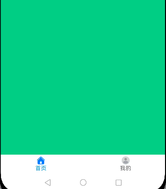

---


