包含了 管理组件状态、Video视频组件、应用弹窗等知识。

<!-- more -->

# HarmonyOS第一课之构建更加丰富的页面

## 管理组件状态

包含了 管理组件状态（@State、@Prop、@Link、@Provide、@Consume、@Watch）


### 概念

> 在应用中，界面通常都是动态的。如图1所示，在子目标列表中，当用户点击目标一，目标一会呈现展开状态，再次点击目标一，目标一呈现收起状态。界面会根据不同的状态展示不一样的效果。

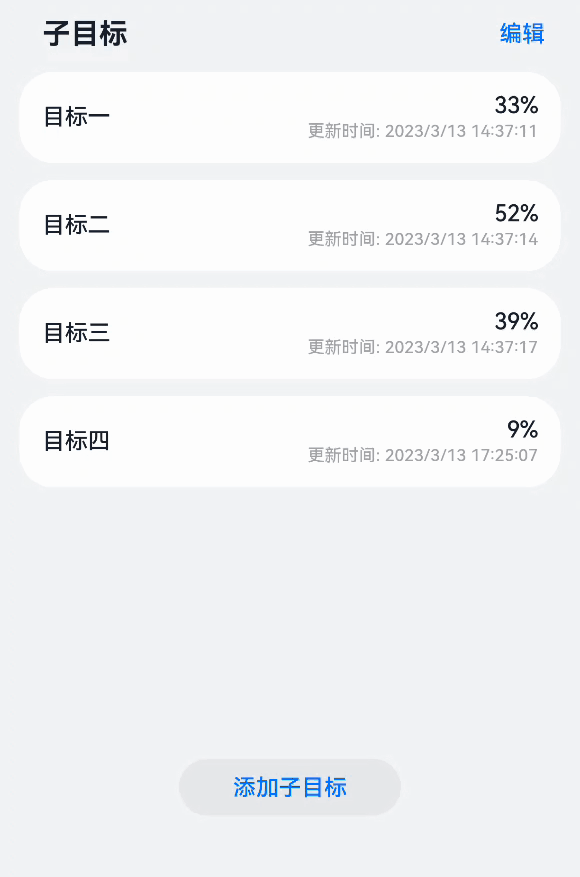


ArkUI作为一种声明式UI，具有状态驱动UI更新的特点。当用户进行界面交互或有外部事件引起状态改变时，状态的变化会触发组件自动更新。所以在ArkUI中，我们只需要通过一个变量来记录状态。当改变状态的时候，ArkUI就会自动更新界面中受影响的部分。

ArkUI框架提供了多种管理状态的装饰器来修饰变量，使用这些装饰器修饰的变量即称为状态变量。

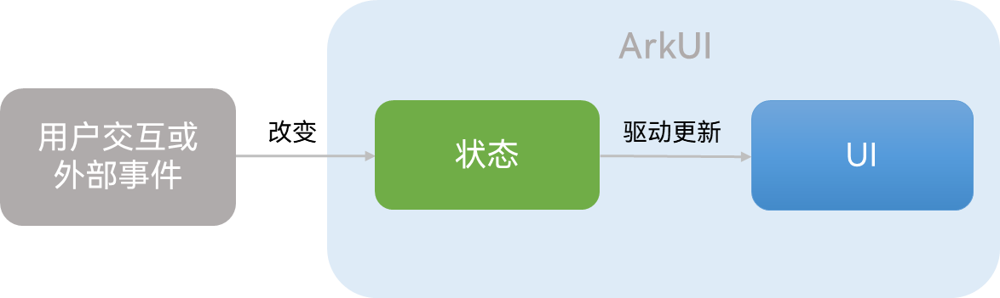

---

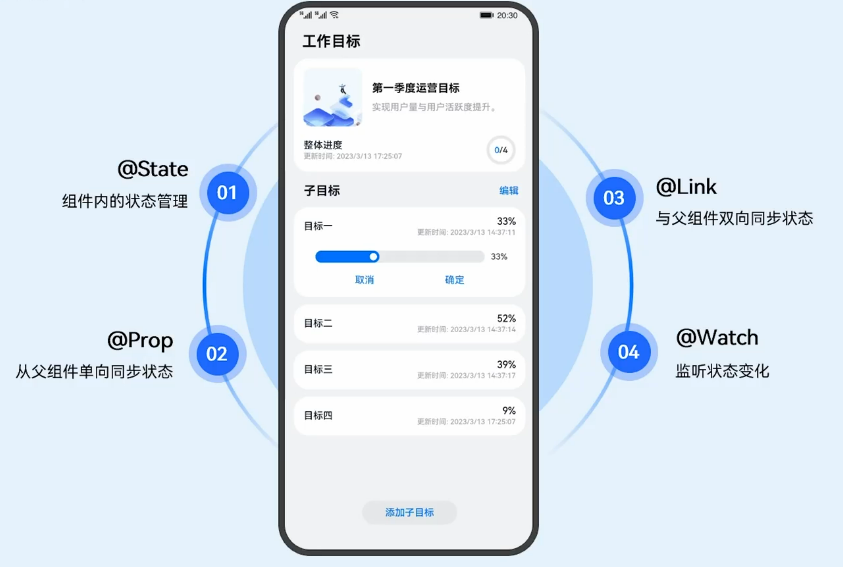

- 在组件内使用`@State`装饰器来修饰变量，可以使组件根据不同的状态来呈现不同的效果。
- 若当前组件的状态需要通过其父组件传递而来，此时需要使用`@Prop`装饰器；
- 若是父子组件状态需要相互绑定进行双向同步，则需要使用`@Link`装饰器。
- 使用`@Provide`和`@Consume`装饰器可以实现跨组件层级双向同步状态。

在实际应用开发中，应用会根据需要封装数据模型。如果需要观察嵌套类对象属性变化，需要使用`@Observed`和`@ObjectLink`装饰器，
因为上述表格中的装饰器只能观察到对象的第一层属性变化。可参考 [@Observed装饰器和@ObjectLink装饰器：嵌套类对象属性变化]()。

另外，当状态改变，需要对状态变化进行监听做一些相应的操作时，可以使用`@Watch`装饰器来修饰状态。

### 组件内的状态管理：@State


设置一个 `@State`装饰器 修饰的状态变量为 `isExpanded` ，当其值为 false 表示目标项收起，值为 true 时表示目标项展开。
通过`@State`装饰后，框架内部会建立数据与视图间的绑定，当isExpanded状态变化时，目标项会随之展开或收起。

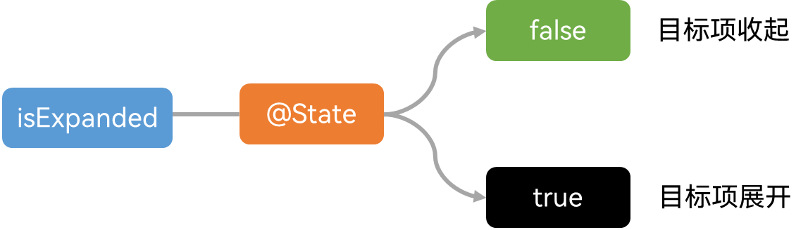

其具体实现只要用@State修饰isExpanded变量，定义是否展开状态。然后通过条件渲染，实现是否显示进度调整面板和列表项的高度变化。
最后，监听列表项的点击事件，在onClick回调中改变isExpanded状态。

```tsx
@Component
export default struct TargetListItem {
  @State isExpanded: boolean = false;
  ...

  build() {
    ...
      Column() {
        ...
        if (this.isExpanded) {
          Blank()
          ProgressEditPanel(...)
        }
      }
      .height(this.isExpanded ? $r('app.float.expanded_item_height')                  
      : $r('app.float.list_item_height'))
      .onClick(() => {
        ...
             this.isExpanded = !this.isExpanded;
        ...
       })
    ...
  }
}
```


### 从父组件单向同步状态：@Prop

- 当子组件中的状态依赖从父组件传递而来时，需要使用@Prop装饰器，@Prop修饰的变量可以和其父组件中的状态建立单向同步关系。
- 当父组件中状态变化时，该状态值也会更新至@Prop修饰的变量；对@Prop修饰的变量的修改不会影响其父组件中的状态。

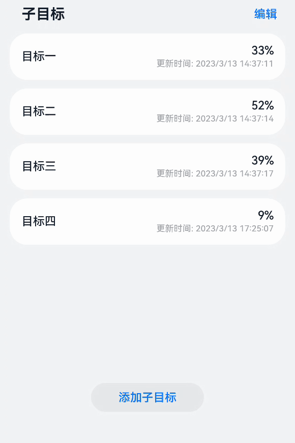

如图4所示，在目标管理应用中，当用户点击子目标列表的“编辑”文本，列表进入编辑模式，点击取消，列表退出编辑模式。

整个列表是自定义组件TargetList，顶部是文本显示区域，主要是Text组件，底部是一个Button组件。中间区域则是用来显示每个目标项，目标项是自定义组件TargetListItem。

从图中可以看出，TargetListItem是TargetList的子组件。TargetList是TargetListItem父组件。

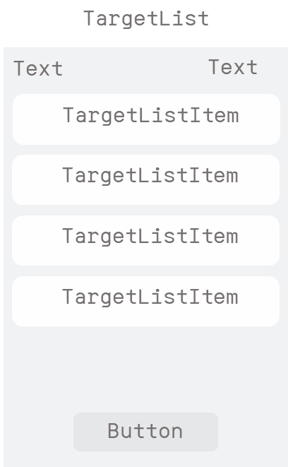

对于父组件TargetList，其顶部显示的文本和底部按钮会随编辑模式的变化而变化，因此父组件拥有编辑模式状态。

对于子组件TargetListItem，其最右侧是否预留位置和显示勾选框也会随编辑模式变化，因此子组件也拥有编辑模式状态。

但是是否进入编辑模式，其触发点是在用户点击列表的“编辑”或取消按钮，状态变化的源头仅在于父组件TargetList。当父组件TargetList中的编辑模式变化时，子组件TargetListItem的编辑模式状态需要随之变化。

**图6** 从父组件单向同步isEditMode状态

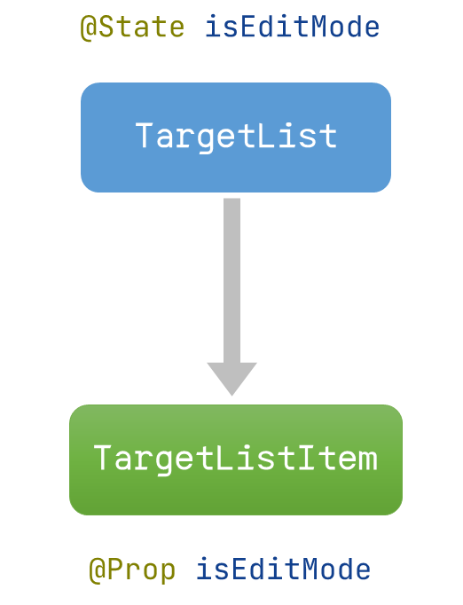

在父组件TargetList中可以定义一个是否进入编辑模式的状态，即用@State修饰isEditMode。@State修饰的变量不仅是组件内部的状态，也可以作为子组件单向或双向同步的数据源。ArkUI提供了@Prop装饰器，@Prop修饰的变量可以和其父组件中的状态建立单向同步关系，所以用@Prop修饰子组件TargetListItem中的isEditMode变量。

在父组件TargetList中，用@State修饰isEditMode，定义编辑模式状态。然后利用条件渲染实现根据是否进入编辑模式，显示不同的文本和按钮。同时，在父组件中需要在用户点击时改变状态，触发界面更新。

当点击“编辑”事件发生时，进入编辑模式，显示取消、全选文本和勾选框，同时显示删除按钮；当点击“取消”事件发生时，退出编辑模式，显示“编辑”文本和“添加子目标”按钮。

```tsx
@Component
export default struct TargetList {
  @State isEditMode: boolean = false;
  ...
  build() {
    Column() {
      Row() {
        ...
          if (this.isEditMode) {
            Text($r('app.string.cancel_button'))
              .onClick(() => {
                this.isEditMode = false;
                ...
               })
               ...
            Text($r('app.string.select_all_button'))...
            Checkbox()...
          } else {
            Text($r('app.string.edit_button'))
              .onClick(() => {
                this.isEditMode = true;
              })
              ...
          }
        ...
      }
      ...
      List({ space: CommonConstants.LIST_SPACE }) {
        ForEach(this.targetData, (item: TaskItemBean, index: number) => {
          ListItem() {
            TargetListItem({
              isEditMode: this.isEditMode,
              ...
            })
          }
        }, (item, index) => JSON.stringify(item) + index)
      }
      ...
      if (this.isEditMode) {
        Button($r('app.string.delete_button'))
      } else {
        Button($r('app.string.add_task'))
      }
    }
    ...
  }
}
```

在子组件TargetListItem中，使用@Prop修饰子组件的isEditMode变量，定义子组件的编辑模式状态。然后同样根据是否进入编辑模式，控制目标项最右侧是否预留位置和显示勾选框。

```tsx
@Component
export default struct TargetListItem {
   @Prop isEditMode: boolean;
   ...
       Column() {
        ...
       }
       .padding({
        ...
        right: this.isEditMode ? $r('app.float.list_edit_padding') 
               : $r('app.float.list_padding')
       })
       ...

       if (this.isEditMode) {
        Row() {
           Checkbox()...
        }
       }
  ...
}
```

最后，最关键的一步就是要在父组件中使用子组件时，将父组件的编辑模式状态this.isEditMode传递给子组件的编辑模式状态isEditMode。

```tsx
@Component
export default struct TargetList {
  @State isEditMode: boolean = false;
  ...
  build() {
    Column() {
      ...
      List({ space: CommonConstants.LIST_SPACE }) {
        ForEach(this.targetData, (item: TaskItemBean, index: number) => {
          ListItem() {
            TargetListItem({
              isEditMode: this.isEditMode,
              ...
            })
          }
        }, (item, index) => JSON.stringify(item) + index)
      }
      ...
    }
    ...
  }
}
```

### 与父组件双向同步状态：@Link

若是父子组件状态需要相互绑定进行双向同步时，可以使用@Link装饰器。父组件中用于初始化子组件@Link变量的必须是在父组件中定义的状态变量。

**图7** 切换目标项

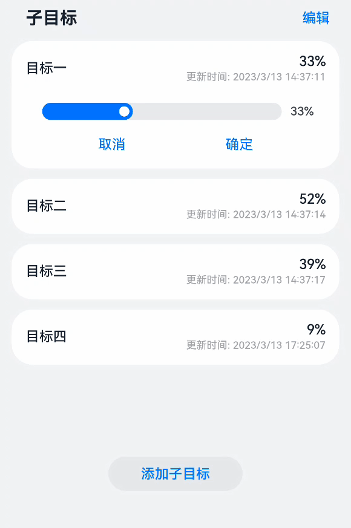

在目标管理应用中，当用户点击同一个目标，目标项会展开或者收起。当用户点击不同的目标项时，除了被点击的目标项展开，同时前一次被点击的目标项会收起。

如图7所示，当目标一展开时，点击目标三，目标三会展开，同时目标一会收起。再点击目标一时，目标一展开，同时目标三会收起。

从目标一切换到目标三的流程中，关键在于最后目标一的收起，当点击目标三时，目标一需要知道点击了目标三，目标一才会收起。

**图8** 子目标列表目标项位置索引

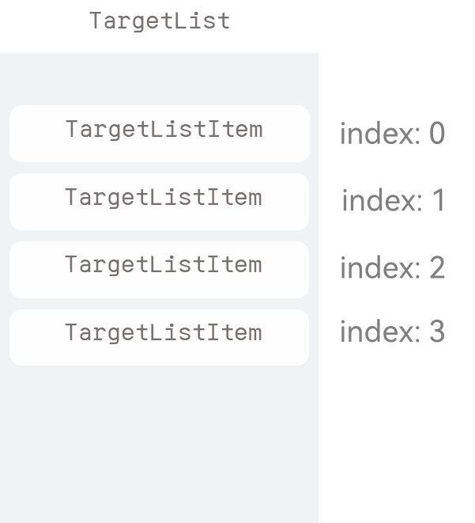

在子目标列表中，每个列表项都有其位置索引值index属性，表示目标项在列表中的位置。index从0开始，即第一个目标项的索引值为0，第二个目标项的索引值为1，以此类推。此外，clickIndex用来记录被点击的目标项索引。当点击目标一时，clickIndex为0，点击目标三时，clickIndex为2。

在父组件子目标列表和每个子组件目标项中都拥有clickIndex状态。当目标一展开时，clickIndex为0。此时点击目标三，目标三的clickIndex变为2，只要其父组件子目标列表感知到clickIndex状态变化，同时将此变化传递给目标一。目标一的clickIndex即可同步改变为2，即目标一感知到此时点击了目标三。

**图9** 与父组件双向同步clickIndex状态

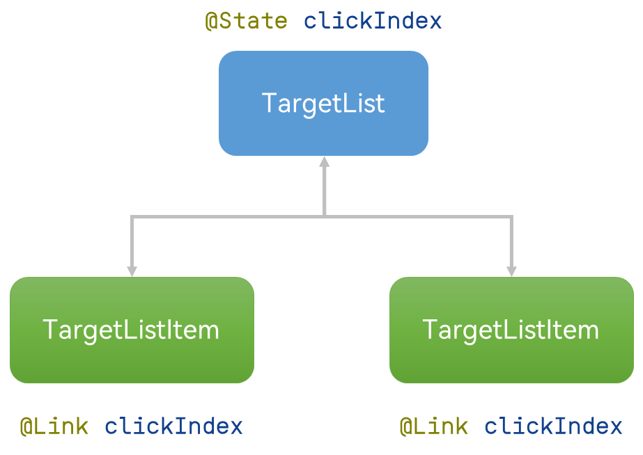

将列表和目标项对应到列表组件TargetList和列表项TargetListItem。首先，需要在父组件TargetList中定义clickIndex状态。

若此时子组件中的clickIndex用@Prop装饰器修饰，当子组件中clickIndex变化时，父组件无法感知，因为@Prop装饰器建立的是从父组件到子组件的单向同步关系。

ArkUI提供了@Link装饰器，用于与父组件双向同步状态。当子组件TargetListItem中的clickIndex用@Link修饰，可与父组件TargetList中的clickIndex建立双向同步关系。

```tsx
@Component
export default struct TargetList {
  @State clickIndex: number = CommonConstants.DEFAULT_CLICK_INDEX;
  ...
             TargetListItem({
               clickIndex: $clickIndex,
              ...
             })
  ...
}
```

首先，在父组件TargetList中用@State装饰器定义点击的目标项索引状态。然后，在子组件TargetListItem中用@Link装饰器定义clickIndex，当点击目标项时，clickIndex更新为当前目标索引值。

完成在父子组件中定义状态后，最关键的就是要建立父子组件的双向关联关系。在父组件中使用子组件时，将父组件的clickIndex传递给子组件的clickIndex。其中父组件的clickIndex加上$表示传递的是引用。

```tsx
@Component
export default struct TargetListItem {
  @Link @Watch('onClickIndexChanged') clickIndex: number;
  @State isExpanded: boolean = false
  ...

  onClickIndexChanged() {
    if (this.clickIndex != this.index) {
      this.isExpanded = false;
    }
  }

  build() {
    ...
       Column() {
        ...
       }
       .onClick(() => {
        ...
           this.clickIndex = this.index;
        ...
       })
    ...
  }
}
```

当目标一感知到点击了目标三时，还需要将目标一收起，切换列表项的功能才是完整的。此时，目标一感知到clickIndex变为2，需要判断与目标一本身的位置索引值0不相等，从而将目标一收起。此时，就需要用到ArkUI中监听状态变化@Watch的能力。用@Watch修饰的状态，当状态发生变化时，会触发声明时定义的回调。

我们给TargetListItem的中的clickIndex状态加上@Watch("onClickIndexChanged")。这表示需要监听clickIndex状态的变化。当clickIndex状态变化时，将触发onClickIndexChanged回调：如果点击的列表项索引不等于当前列表项索引，则将isExpanded状态置为false，从而收起该目标项。

### 跨组件层级双向同步状态：@Provide和@Consume

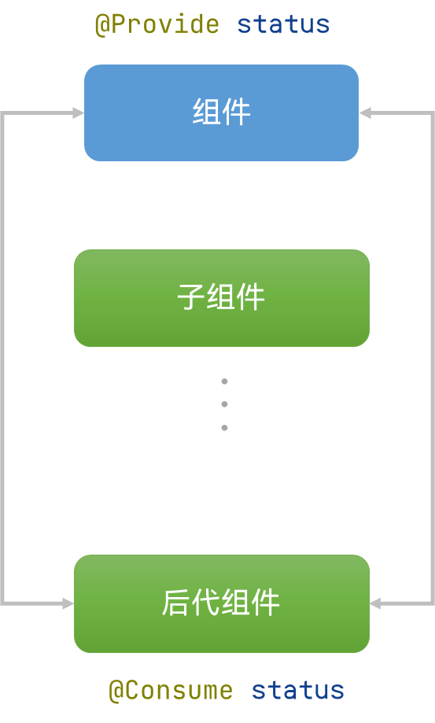

跨组件层级双向同步状态是指@Provide修饰的状态变量自动对提供者组件的所有后代组件可用，后代组件通过使用@Consume装饰的变量来获得对提供的状态变量的访问。@Provide作为数据的提供方，可以更新其子孙节点的数据，并触发页面渲染。@Consume在感知到@Provide数据的更新后，会触发当前自定义组件的重新渲染。

使用@Provide的好处是开发者不需要多次将变量在组件间传递。@Provide和@Consume的具体使用方法请参见开发指南：[@Provide装饰器和@Consume装饰器：与后代组件双向同步](https://developer.huawei.com/consumer/cn/doc/harmonyos-guides-V2/arkts-provide-and-consume-0000001473857338-V2)。


### 源码目录说明


```text
├──entry/src/main/ets                   // 代码区
│  ├──common
│  │  ├──bean
│  │  │  └──TaskItemBean.ets            // 任务进展实体类
│  │  ├──constants
│  │  │  └──CommonConstants.ets         // 公共常量类
│  │  └──utils
│  │     ├──DateUtil.ets                // 获取格式化日期工具
│  │     └──Logger.ts                   // 日志打印工具类
│  ├──entryability
│  │  └──EntryAbility.ts                // 程序入口类
│  ├──pages
│  │  └──MainPage.ets                   // 主页面
│  ├──view
│  │  ├──TargetInformation.ets          // 整体目标详情自定义组件
│  │  ├──AddTargetDialog.ets            // 自定义弹窗
│  │  ├──ProgressEditPanel.ets          // 进展调节自定义组件
│  │  ├──TargetList.ets                 // 工作目标列表
│  │  └──TargetListItem.ets             // 工作目标列表子项
│  └──viewmodel
│     ├──DataModel.ets                  // 工作目标数据操作类
│     ├──MainPageModel.ets              // 主页面业务处理文件
│     ├──TaskListItemModel              // 工作目标列表子项业务处理文件
│     └──TaskListViewModel.ets          // 工作目标列表业务处理文件
└──entry/src/main/resources             // 资源文件目录
```

**MainPage**作为本应用的主界面，从上至下由三个自定义组件组成。

1. 标题titleBar。

2. 目标整体进展详情TargetInformation。

3. 子目标列表TargetList。

**MainPage 主要维护五个参数**

子目标数组`targetData`、子目标总数`totalTasksNumber`、已完成子目标数`completedTasksNumber`、最近更新时间`latestUpdateDate`、监听数据变化的参数`overAllProgressChanged`。具体作用有以下三个方面：

1. 子组件`TargetInformation`接收三个参数`totalTasksNumber`、`completedTasksNumber`、`latestUpdateDate`，渲染整体目标详情。
2. 子组件`TargetList`接收参数`targetData`渲染列表。
3. 使用`@Watch`监听`overAllProgressChanged`的变化。当`overAllProgressChanged`改变时，回调`onProgressChanged`方法，刷新整体进展`TargetInformation`。

### 参考

更多状态管理场景和相关知识请参考开发指南：[状态管理](https://developer.huawei.com/consumer/cn/doc/harmonyos-guides-V2/arkts-state-management-overview-0000001524537145-V2)。


## Video视频组件

### 概述

### Video组件用法

#### 参数

#### 属性

#### 回调事件

### 自定义控制器的组成与实现

#### 组成

#### 实现

### 参考链接

Video组件的更多属性和参数的使用，可以参考：[Video API](https://developer.huawei.com/consumer/cn/doc/harmonyos-references-V2/ts-media-components-video-0000001427902484-V2)。


## 应用弹窗

### 概述

### 警告弹窗

### 选择类弹窗

#### 文本选择弹窗

#### 日期选择弹窗

### 自定义弹窗

### 参考

[更多弹窗，您可以参考API：](https://developer.huawei.com/consumer/cn/doc/harmonyos-references-V2/3_1_u5f39_u7a97-0000001478181449-V2)


