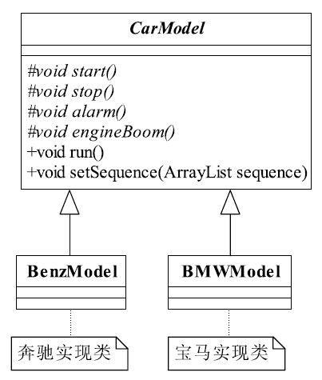
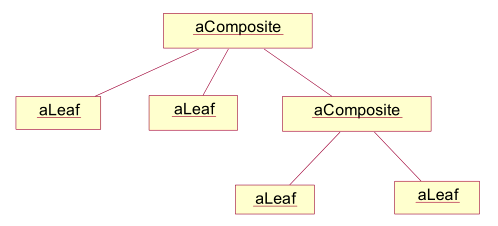
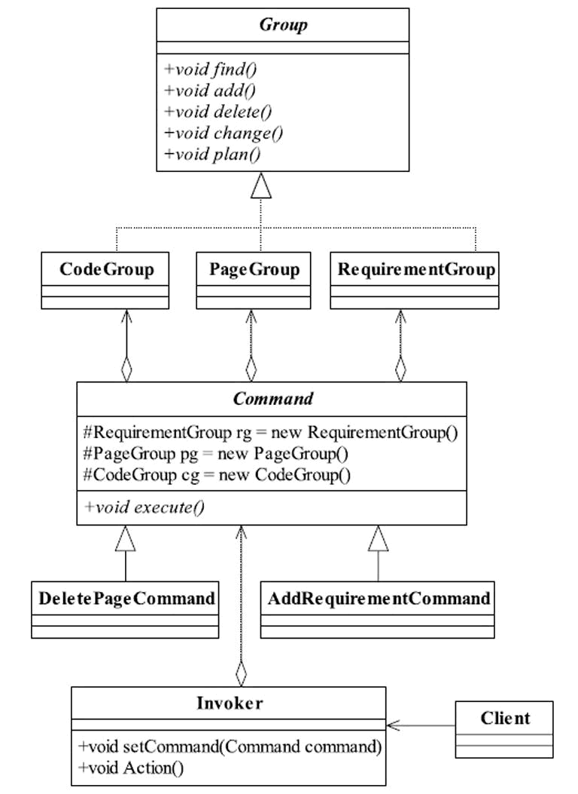

六大设计原则，23种设计模式

<!-- more -->

## 6大设计原则

## 1).单一职责原则

也就是说一个类应该只负责一件事情。

优点：

> 1. 可以降低类的复杂度，一个类只负责一项职责，这样逻辑也简单很多
> 2. 提高类的可读性，和系统的维护性，因为不会有其他奇怪的方法来干扰我们理解这个类的含义
> 3. 当发生变化的时候，能将变化的影响降到最小，因为只会在这个类中做出修改。

## 2).里氏替换原则（通俗的讲就是：子类可以去扩展父类的功能，但是不能改变父类原有的功能）

定义

> 如果对每一个类型为T1的对象o1,都有类型为T2的对象o2,使得以T1定义的所有程序P在所有对象o1都替换成o2的时候，程序P的行为都没有发生变化，那么类型T2是类型T1的子类型。

简单的定义

> 所有引用基类的地方必须能够透明地使用其子类的对象。

通俗的去讲就是：子类可以去扩展父类的功能，但是不能改变父类原有的功能。

> 1. 子类可以实现父类的抽象方法，但是不能覆盖父类的非抽象方法。
> 2. 子类可以增加自己独有的方法。
> 3. 当子类的方法重载父类的方法时候，方法的形参要比父类的方法的输入参数更加宽松。
> 4. 当子类的方法实现父类的抽象方法时，方法的返回值要比父类更严格。

里氏替换原则之所以这样要求是因为继承有很多缺点，他虽然是复用代码的一种方法，但同时继承在一定程度上违反了封装。父类的属性和方法对子类都是透明的，子类可以随意修改父类的成员。这也导致了，如果需求变更，子类对父类的方法进行一些复写的时候，其他的子类无法正常工作。所以里氏替换法则被提出来。

## 3).依赖倒置原则（面向接口编程）

简单来说就是

> 高层模块（指的是调用端）不应该依赖底层模块（具体的实现类），两者都应该依赖其抽象
>
> 抽象不应该依赖细节
>
> 细节应该依赖抽象

## 4).接口隔离原则

客户端不应该依赖他不需要的接口

> 我们知道在Java中一个具体类实现了一个接口，那必然就要实现接口中的所有方法。如果我们有一个类A和类B通过接口I来依赖，类B是对类A依赖的实现，这个接口I有5个方法。但是类A与类B只通过方法1,2,3依赖，然后类C与类D通过接口I来依赖，类D是对类C依赖的实现但是他们却是通过方法1,4,5依赖。那么是必在实现接口的时候，类B就要有实现他不需要的方法4和方法5 而类D就要实现他不需要的方法2，和方法3。这简直就是一个灾难的设计。
> 所以我们需要对接口进行拆分，就是把接口分成满足依赖关系的最小接口，类B与类D不需要去实现与他们无关接口方法。比如在这个例子中，我们可以把接口拆成3个，第一个是仅仅由方法1的接口，第二个接口是包含2,3方法的，第三个接口是包含4,5方法的。这样，我们的设计就满足了接口隔离原则。

## 5).迪米特法则（说白了，就是一种中介的方式）

定义：

> 一个对象应该对其他对象保持最小的了解。

更简单的定义：

> 只与直接的朋友通信。首先来解释一下什么是直接的朋友：每个对象都会与其他对象有耦合关系，只要两个对象之间有耦合关系，我们就说这两个对象之间是朋友关系。耦合的方式很多，依赖、关联、组合、聚合等。其中，我们称出现成员变量、方法参数、方法返回值中的类为直接的朋友，而出现在局部变量中的类则不是直接的朋友。也就是说，陌生的类最好不要作为局部变量的形式出现在类的内部。

例子：

>比如我们需要一张CD,我们可能去音像店去问老板有没有我们需要的那张CD，老板说现在没有，等有的时候你们来拿就行了。在这里我们不需要关心老板是从哪里，怎么获得的那张CD，我们只和老板（直接朋友）沟通，至于老板从他的朋友那里通过何种条件得到的CD，我们不关心，我们不和老板的朋友（陌生人）进行通信，这个就是迪米特的一个应用。说白了，就是一种中介的方式。我们通过老板这个中介来和真正提供CD的人发生联系。

## 6).开闭原则

> 一个软件实体如类、模块和函数应该对扩展开放，对修改关闭。

定义

- 用抽象构建框架，用实现扩展细节。
- 不以改动原有类的方式来实现新需求，而是应该以实现事先抽象出来的接口（或具体类继承抽象类）的方式来实现。

优点

实践开闭原则的优点在于可以在不改动原有代码的前提下给程序扩展功能。增加了程序的可扩展性，同时也降低了程序的维护成本。


# 一、创建型模

## 1.单例模式 （Singleton Pattern）


### 单态定义

> Singleton 模式主要作用是保证在 Java 应用程序中，一个类 Class 只有一个实例存在。
>
> 在很多操作中，比如建立目录 数据库连接都需要这样的单线程操作。
>
> 还有, singleton 能够被状态化; 这样，多个单态类在一起就可以作为一个状态仓库一样向外提供服务，比如，你要论坛中的帖子计数器，每次浏览一次需要计数，单态类能否保持住这个计数，并且能 synchronize 的安全自动加 1，如果你要把这个数字永久保存到数据库，你可以在不修改单态接口的情况下方便的做到。
>
> 另外方面，Singleton 也能够被无状态化。提供工具性质的功能。
>
> Singleton 模式就为我们提供了这样实现的可能。使用 Singleton 的好处还在于可以节省内存，因为它限制了实例的个数，有利于 Java 垃圾回收（garbage collection）。
>
> 我们常常看到工厂模式中类装入器(class loader)中也用 Singleton 模式实现的,因为被装入的类实际也属于资源。 如何使用?

### 使用场景

> ● 要求生成唯一序列号的环境；
>
> ● 在整个项目中需要一个共享访问点或共享数据，例如一个Web页面上的计数器，可以不用把每次刷新都记录到数据库中，使用单例模式保持计数器的值，并确保是线程安全的；
>
> ● 创建一个对象需要消耗的资源过多，如要访问IO和数据库等资源；
>
> ● 需要定义大量的静态常量和静态方法（如工具类）的环境，可以采用单例模式（当然，也可以直接声明为static的方式）。

### 优点

> ● 由于单例模式在内存中只有一个实例，减少了内存开支，特别是一个对象需要频繁地创建、销毁时，而且创建或销毁时性能又无法优化，单例模式的优势就非常明显。
>
> ● 由于单例模式只生成一个实例，所以减少了系统的性能开销，当一个对象的产生需要比较多的资源时，如读取配置、产生其他依赖对象时，则可以通过在应用启动时直接产生一个单例对象，然后用永久驻留内存的方式来解决（在Java EE中采用单例模式时需要注意JVM垃圾回收机制）。
>
> ● 单例模式可以避免对资源的多重占用，例如一个写文件动作，由于只有一个实例存在内存中，避免对同一个资源文件的同时写操作。
>
> ● 单例模式可以在系统设置全局的访问点，优化和共享资源访问，例如可以设计一个单例类，负责所有数据表的映射处理。

### 缺点

> ● 单例模式一般没有接口，扩展很困难，若要扩展，除了修改代码基本上没有第二种途径可以实现。单例模式为什么不能增加接口呢？因为接口对单例模式是没有任何意义的，它要求“自行实例化”，并且提供单一实例、接口或抽象类是不可能被实例化的。当然，在特殊情况下，单例模式可以实现接口、被继承等，需要在系统开发中根据环境判断。
>
> ● 单例模式对测试是不利的。在并行开发环境中，如果单例模式没有完成，是不能进行测试的，没有接口也不能使用mock的方式虚拟一个对象。
>
> ● 单例模式与单一职责原则有冲突。一个类应该只实现一个逻辑，而不关心它是否是单例的，是不是要单例取决于环境，单例模式把“要单例”和业务逻辑融合在一个类中。

### Singleton 模式几种形式

```java
饿汉式
    public class Singleton {
        private Singleton(){}
        private static final Singleton instance = new Singleton();
        public static Singleton getInstance() {
            return instance;
            }
        }
    }
懒汉式：
第二种形式:
    public class Singleton {
        private Singleton(){}
        private static volatile Singleton instance = null;
        public static synchronized Singleton getInstance() {
            if (instance == null) {
                instance = new Singleton();
            }
            return instance;
        }
    }
懒汉式：
第三种形式:
public class Singleton {
 private Singleton(){}
    private static volatile Singleton instance = null;
 /**
     * 双重检验锁：效率⾼高；( 解决问题：假如两个线程A、B，A执⾏行行了了if (instance == null)语句句，它会认为单例例对象没有创建，此时线程切到B也
     * 执⾏行行了了同样的语句句，B也认为单例例对象没有创建，然后两个线程依次执⾏行行同步代码块，并分别创建了了⼀一个单例例对象。
     *
     * @return
     */
    public static synchronized Singleton getInstance() {
        if (instance == null) {
            synchronized (Singleton.class) {
                if (instance == null) {
                    instance = new Singleton();
                }
            }
        }
        return instance;
    }
}
```

> 使用 Singleton.getInstance()可以访问单态类。
>
> 上面第二中形式是 lazy initialization，也就是说第一次调用时初始 Singleton，以后就不用再生成了。
>
> 注意到 lazy initialization 形式中的 synchronized，这个 synchronized 很重要，如果没有synchronized，那么使用 getInstance()是有可能得到多个 Singleton 实例。关于 lazy initialization 的 Singleton 有很多涉及 double-checked locking (DCL)的讨论，有兴趣者进一步研究。
>
> 一般认为第一种形式要更加安全些。
>
> 使用 Singleton 注意事项：
>
> 有时在某些情况下，使用 Singleton 并不能达到 Singleton 的目的，如有多个 Singleton 对象同时被不同的类装入器装载；在EJB 这样的分布式系统中使用也要注意这种情况，因为 EJB 是跨服务器，跨 JVM 的。
>
> 我们以 SUN 公司的宠物店源码(Pet Store 1.3.1)的 ServiceLocator 为例稍微分析一下：
>
> 在 Pet Store 中 ServiceLocator 有两种，一个是 EJB 目录下；一个是 WEB 目录下，我们检查这两个 ServiceLocator 会发现内容差不多，都是提供 EJB 的查询定位服务，可是为什么要分开呢？仔细研究对这两种 ServiceLocator 才发现区别：在 WEB 中的ServiceLocator 的采取 Singleton 模式，ServiceLocator 属于资源定位，理所当然应该使用 Singleton 模式。但是在 EJB 中，Singleton 模式已经失去作用，所以 ServiceLocator 才分成两种，一种面向 WEB 服务的，一种是面向 EJB 服务的。
>
> Singleton 模式看起来简单，使用方法也很方便，但是真正用好，是非常不容易，需要对 Java 的类线程内存等概念有相当的了解。
>
> 总之：如果你的应用基于容器，那么 Singleton 模式少用或者不用，可以使用相关替代技术。

## 2.工厂方法模式（Factory Method Pattern）

### 简单工厂模式


```java
public abstract class AbstractProduct {
    /**
     * 产品类的公共方法
     */
    public void method1() {
    }

    public abstract void method2();

}

public class Product1 extends AbstractProduct {

    @Override
    public void method2() {
        System.out.println("Product1.method2:" + this.getClass().getName());
    }
}
public class Product2 extends AbstractProduct {
    @Override
    public void method2() {
        System.out.println("Product2.method2:" + this.getClass().getName());
        //业务逻辑处理
    }
}
```

```java
public class ConcreteCreatorFactory   {

    public static <T extends AbstractProduct> T createProduct(Class<T> c) {
        AbstractProduct product = null;
        try {
            product = (AbstractProduct) Class.forName(c.getName()).getDeclaredConstructor().newInstance();
        } catch (Exception e) {
            e.printStackTrace();
        }
        return (T) product;
    }
}
```

```java
public class ProductClient {
    public static void main(String[] args) {
        Product1 product1 = ConcreteCreatorFactory.createProduct(Product1.class);
        product1.method2();

        Product2 product2 = ConcreteCreatorFactory.createProduct(Product2.class);
        product2.method2();
    }
}

Product1.method2:class com.xxx.Product1
Product2.method2:class com.xxx.Product2
```

### 工厂方法模式


抽象产品

```java
public abstract class AbstractProduct {
    /**
     * 产品类的公共方法
     */
    public void method1() {
    }

    public abstract void method2();

}
```

具体产品类

```java
public class Product1 extends AbstractProduct {

    @Override
    public void method2() {
        System.out.println("Product1.method2:" + this.getClass());
    }
}
public class Product2 extends AbstractProduct {

    @Override
    public void method2() {
        System.out.println("Product2.method2:" + this.getClass());
    }
}
```

抽象工厂

```java
public abstract class AbstractFactory {

    /**
     * 使用模板模式-模板方法
     *
     * @param c
     * @param <T>
     * @return
     */
    final public <T extends AbstractProduct> T createProduct(Class<T> c) {
        AbstractProduct product = null;
        try {
            product = (AbstractProduct) Class.forName(c.getName()).getDeclaredConstructor().newInstance();
        } catch (Exception e) {
            e.printStackTrace();
        }
        return (T) product;
    }
}
```

具体产品的抽象工厂

```java
public class Product1Factory extends AbstractFactory {
}

public class Product2Factory extends AbstractFactory {
}
```

```java
public class ProductClient {
    public static void main(String[] args) {
        Product1 product1 = new Product1Factory().createProduct(Product1.class);
        product1.method2();
        Product2 product2 = new Product2Factory().createProduct(Product2.class);
        product2.method2();
    }
}

Product1.method2:class com.xxx.produc2.Product1
Product2.method2:class com.xxx.produc2.Product2
```

#### 升级：通过单例模式来创建对象 <a name="升级：通过单例模式来创建对象"></a>

```java
public class ProductFactory {
    private static final Map<String, AbstractProduct> productMap = new HashMap();

    public static synchronized AbstractProduct createProductClass(String type) {
        AbstractProduct product = null;
        //如果Map中已经有这个对象
        if (productMap.containsKey(type)) {
            product = productMap.get(type);
        } else {
            if (type.equals("Product1")) {
                product = new Product1();
            } else {
                product = new Product2();
            }
            //同时把对象放到缓存容器中
            productMap.put(type, product);
        }
        return product;
    }
}

```

```java
    public static void main(String[] args) {
        AbstractProduct product = ProductFactory.createProductClass("Product2");
        product.method2();

        Product1 product1 = new Product1Factory().createProduct(Product1.class);
        product1.method2();
        Product2 product2 = new Product2Factory().createProduct(Product2.class);
        product2.method2();
    }

Product2.method2:class com.xxx.produc2.Product2
Product1.method2:class com.xxx.produc2.Product1
Product2.method2:class com.xxx.produc2.Product2
```

### 升级为多个工厂类（推荐）


每个人种（具体的产品类）都对应了一个创建者，每个创建者都独立负责创建对应的产
品对象，非常符合单一职责原则。

Human接口

```java
public interface Human {
    void getColor();

    void talk();
}
```

BlackHuman\WhiteHuman\YellowHuman

```java
public class BlackHuman implements Human {
    @Override
    public void getColor() {
        System.out.println("黑人类");
    }

    @Override
    public void talk() {
        System.out.println("黑人类说----66666");
    }
}
public class WhiteHuman implements Human {
    @Override
    public void getColor() {
        System.out.println("白人类");
    }

    @Override
    public void talk() {
        System.out.println("白人类说----11111");
    }
}
public class YellowHuman implements Human {
    @Override
    public void getColor() {
        System.out.println("黄人类");
    }

    @Override
    public void talk() {
        System.out.println("黄人类说----8888");
    }
}
```

AbstractHumanFactory

```java
public abstract class AbstractHumanFactory {
    public abstract Human createHuman();
}
```

BlackHumanFactory\WhiteHumanFactory\YellowHumanFactory

```java
public class BlackHumanFactory extends AbstractHumanFactory {
    @Override
    public Human createHuman() {
        return new BlackHuman();
    }
}
public class WhiteHumanFactory extends AbstractHumanFactory {
    @Override
    public Human createHuman() {
        return new WhiteHuman();
    }
}
public class YellowHumanFactory extends AbstractHumanFactory {
    @Override
    public Human createHuman() {
        return new YellowHuman();
    }
}
```

```java
public class Clent {
    public static void main(String[] args) {
        Human blackHuman = new BlackHumanFactory().createHuman();
        blackHuman.getColor();
        blackHuman.talk();
        Human whiteHuman = new WhiteHumanFactory().createHuman();
        whiteHuman.getColor();
        whiteHuman.talk();
        Human yellowHuman = new YellowHumanFactory().createHuman();
        yellowHuman.getColor();
        yellowHuman.talk();
    }
}
黑人类
黑人类说----66666
白人类
白人类说----11111
黄人类
黄人类说----8888
```

### 多工厂类问题？

> 但是给可扩展性和可维护性带来了一定的影响。为什么这么说呢？如果要扩展一个产品类，就需要建立一个相应的工厂类，这样就增加了扩展的难度。因为工厂类和产品类的数量相同，维护时需要考虑两个对象之间的关系。

解决：[升级：通过单例模式来创建对象](#升级：通过单例模式来创建对象)

### 定义

通过工厂类来new实例

### **为何使用 ?**

为什么工厂模式是如此常用？因为工厂模式就相当于创建实例对象的 new，我们经常要根据类 Class 生成实例对象，如 A a=new A() 工厂模式也是用来创建实例对象的，所以以后 new 时就要多个心眼，是否可以考虑实用工厂模式，虽然这样做，可能多做一些工作，但会给你系统带来更大的可扩展性和尽量少的修改量。

使用工厂方法 要注意几个角色，首先你要定义产品接口

## 3.抽象工厂模式（Abstract Factory Pattern）

### 什么是抽象？

**抽象**：就是对所有子类的共性封装

### 创造人示例


顶级公共属性接口

```java
public interface Human {
    void getColor();
    void talk();
    void getSex();
    /**
     * abstract:相同方法，不同实现
     */
    void doBB();
}
```

公共抽象类

```java
/**
 * 公共抽象类方法
 *
 * @author kong19
 * @version 1.0
 * @date 2022/4/17 21:15
 */
public abstract class AbstractBlackHuman implements Human {
    @Override
    public void getColor() {
        System.out.println("黑色人种");
    }

    @Override
    public void talk() {
        System.out.println("黑色人种说----66666");
    }
    /**
     * 相同方法的不同实现（子类必须实现）
     */
    @Override
    public abstract void doBB();
}
public abstract class AbstractWhiteHuman implements Human {
    @Override
    public void getColor() {
        System.out.println("白色人种");
    }

    @Override
    public void talk() {
        System.out.println("白色人种说----11111");
    }
    /**
     * 相同方法的不同实现（子类必须实现）
     */
    @Override
    public abstract void doBB();
}
public abstract class AbstractYellowHuman implements Human {
    @Override
    public void getColor() {
        System.out.println("黄色人种");
    }

    @Override
    public void talk() {
        System.out.println("黄色人种说----8888");
    }
    /**
     * 相同方法的不同实现（子类必须实现）
     */
    @Override
    public abstract void doBB();
}
```

实现具体的抽象类（实现生产不同肤色的性别【女性、男性】的生产车间原料）

```java
/**
 * 黑色男♂性（生产车间的原料）
 *
 * @author kong19
 * @version 1.0
 * @date 2022/4/17 22:16
 */
public class MaleBlackHuman extends AbstractBlackHuman {
    @Override
    public void getSex() {
        System.out.println("黑色男♂性");
    }
    @Override
    public void doBB() {
        System.out.println("黑色男♂性 doBB bbbb");
    }
}
public class MaleWhiteHuman extends AbstractWhiteHuman {
    @Override
    public void getSex() {
        System.out.println("白色男♂性");
    }
    @Override
    public void doBB() {
        System.out.println("白色男♂性 doBB ccccc");
    }
}
public class MaleYellowHuman extends AbstractYellowHuman {
    @Override
    public void getSex() {
        System.out.println("黄色男♂性");
    }
    @Override
    public void doBB() {
        System.out.println("黄色男♂性 doBB aaaa");
    }
}

public class FemaleBlackHuman extends AbstractBlackHuman {
    @Override
    public void getSex() {
        System.out.println("黑色女♀性");
    }
    @Override
    public void doBB() {
        System.out.println("黑色女♀性 doBB 嘿嘿黑");
    }
}
public class FemaleWhiteHuman extends AbstractWhiteHuman {
    @Override
    public void getSex() {
        System.out.println("白色女♀性");
    }
    @Override
    public void doBB() {
        System.out.println("白色女♀性 doBB 啊八啊八啊八");
    }
}
public class FemaleYellowHuman extends AbstractYellowHuman {
    @Override
    public void getSex() {
        System.out.println("黄色女♀性");
    }
    @Override
    public void doBB() {
        System.out.println("黄色女♀性 doBB 啊啊啊");
    }
}
```

公共生产车间接口

```java
/**
 * 人类肤色定义车间
 *
 * @author kong19
 * @version 1.0
 * @date 2022/4/17 21:41
 */
public interface HumanColorFactory {
    /**
     * 制造一个黄色人种
     *
     * @return
     */
    Human createYellowHuman();

    /**
     * 制造一个白色人种
     *
     * @return
     */
    Human createWhiteHuman();

    /**
     * 制造一个黑色人种
     *
     * @return
     */
    Human createBlackHuman();
}
```

具体的生产车间（负责拿到这个生产车间对象，可以生产什么产品，由生产线来使用）

```java
/**
 * 创造男♂性肤色的工厂(工厂的生产车间)
 *
 * @author kong19
 * @version 1.0
 * @date 2022/4/17 22:23
 */
public class MaleColorFactory implements HumanColorFactory {

    /**
     * 制造一个黄色男性
     *
     * @return
     */
    @Override
    public Human createYellowHuman() {
        return new MaleYellowHuman();
    }

    /**
     * 制造一个白色男性
     *
     * @return
     */
    @Override
    public Human createWhiteHuman() {
        return new MaleWhiteHuman();
    }

    /**
     * 制造一个黑色男性
     *
     * @return
     */
    @Override
    public Human createBlackHuman() {
        return new MaleBlackHuman();
    }
}
```

生产线（开始生产具体产品）

```java
/**
 * 生产线
 *
 * @author kong19
 * @version 1.0
 * @date 2022/4/17 21:20
 */
public class Clent {
    public static void main(String[] args) {
        //第一条生产线，男性生产线
        productionMale();
        //第二条生产线，女性生产线
        productionFeMale();
    }

    /**
     * 女性生产线
     */
    private static void productionFeMale() {
        HumanColorFactory femaleHumanFactory = new FemaleColorFactory();
        //生产线建立完毕，开始生产人了:
        Human blackHuman = femaleHumanFactory.createBlackHuman();
        Human whiteHuman = femaleHumanFactory.createWhiteHuman();
        Human yellowHuman = femaleHumanFactory.createYellowHuman();
        System.out.println("\n---生产一个黑色女性---");
        getZZ(blackHuman);
        System.out.println("\n---生产一个白色女性---");
        getZZ(whiteHuman);
        System.out.println("\n---生产一个黄色女性---");
        getZZ(yellowHuman);
    }

    /**
     * 男性生产线
     */
    private static void productionMale() {
        HumanColorFactory maleHumanFactory = new MaleColorFactory();
        Human blackHuman = maleHumanFactory.createBlackHuman();
        Human whiteHuman = maleHumanFactory.createWhiteHuman();
        Human yellowHuman = maleHumanFactory.createYellowHuman();
        System.out.println("\n---生产一个黑色男性---");
        getZZ(blackHuman);
        System.out.println("\n---生产一个白色男性---");
        getZZ(whiteHuman);
        System.out.println("\n---生产一个黄色男性---");
        getZZ(yellowHuman);

    }

    /**
     * 获取属性
     *
     * @param human
     */
    private static void getZZ(Human human) {
        human.getColor();
        human.talk();
        human.getSex();
        human.doBB();
    }
}


---生产一个黑色男性---
黑色人种
黑色人种说----66666
黑色男♂性
黑色男♂性 doBB bbbb

---生产一个白色男性---
白色人种
白色人种说----11111
白色男♂性
白色男♂性 doBB ccccc

---生产一个黄色男性---
黄色人种
黄色人种说----8888
黄色男♂性
黄色男♂性 doBB aaaa

---生产一个黑色女性---
黑色人种
黑色人种说----66666
黑色女♀性
黑色女♀性 doBB 嘿嘿黑

---生产一个白色女性---
白色人种
白色人种说----11111
白色女♀性
白色女♀性 doBB 啊八啊八啊八

---生产一个黄色女性---
黄色人种
黄色人种说----8888
黄色女♀性
黄色女♀性 doBB 啊啊啊
```

```java
public abstract class Factory{
 public abstract Sample creator();
 public abstract Sample2 creator(String name);
}
public class SimpleFactory extends Factory{
    public Sample creator(){
     return new SampleA
    }
    public Sample2 creator(String name){
     return new Sample2A
    }
}
public class BombFactory extends Factory{
    public Sample creator(){
     return new SampleB
    }
    public Sample2 creator(String name){
     return new Sample2B
    }
}
```

### 优点

- **封装性**：每个产品的实现类不是高层模块要关心的，它要关心的是什么？是接口，是抽象，它不关心对象是如何创建出来，这由谁负责呢？工厂类，只要知道工厂类是谁，我就能创建出一个需要的对象，省时省力。
- **产品族内的约束为非公开状态**：就应该有这样的一个约束：每生产1个女性，就同时生产出1.2个男性，这样的生产过程对调用工厂类的高层模块来说是透明的，它不需要知道这个约束，我就是要一个黄色女性产品就可以了，具体的产品族内的约束是在工厂内实现的。

### 缺点

最大缺点就是产品族**扩展**非常困难，为什么这么说呢？我们以通用代码为例，如果要增加一个产品C，产品家族由原来的2个增加到3个，**抽象类 Abstract类**要增加一个*方法* createProductC()，然后*两个实现类*都要修改，想想看，这严重违反了开闭原则，而且我们一直说明抽象类和接口是一个契约。

> 每增加一个产品，就需要在抽象类、接口里添加一个方法，然后去修改实现类

### 定义

> 为创建一组相关或相互依赖的对象提供一个接口，而且无须指定它们的具体类

### 使用场景

> 一个对象族（或是一组没有任何关系的对象）都有相同的约束，则可以使用抽象工厂模式。
>
> 大家在软件产品开发过程中，涉及不同操作系统的时候，都可以考虑使用抽象工厂模式，例如一个应用，需要在三个不同平台（Windows、Linux、Android（Google发布的智能终端操作系统））上运行，你会怎么设计？分别设计三套不同的应用？非也，通过抽象工厂模式屏蔽掉操作系统对应用的影响。三个不同操作系统上的软件功能、应用逻辑、UI都应该是非常类似的，唯一不同的是调用不同的工厂方法，由不同的产品类去处理与操作系统交互的信息。


>例如制造汽车的左侧门和右侧门，这两个应该是数量相等的——两个对象之间的约束，每个型号的车门都是不一样的，这是产品等级结构约束的。

从上面看到两个工厂各自生产出一套 Sample 和 Sample2,也许你会疑问，为什么我不可以使用两个工厂方法来分别生产Sample 和 Sample2?

抽象工厂还有另外一个关键要点，是因为 SimpleFactory 内，生产 Sample 和生产 Sample2 的方法之间有一定联系， 所以才要将这两个方法捆绑在一个类中，这个工厂类有其本身特征，也许制造过程是统一的，比如：制造工艺比较简单，所以名称叫 SimpleFactory。

在实际应用中，工厂方法用得比较多一些，而且是和动态类装入器组合在一起应用，

### **举例：**

我们以 Jive 的 ForumFactory 为例，这个例子在前面的 Singleton 模式中我们讨论过，现在再讨论其工厂模式:

```java
public abstract class ForumFactory {
    private static Object initLock = new Object();
    private static String className = "com.jivesoftware.forum.database.DbForumFactory";
    private static ForumFactory factory = null;

    public static ForumFactory getInstance(Authorization authorization) {
        //If no valid authorization passed in, return null.
        if (authorization == null) {
            return null;
        }
        //以下使用了 Singleton 单态模式
        if (factory == null) {
            synchronized (initLock) {
                if (factory == null) {
                    try {
                        //动态转载类
                        Class c = Class.forName(className);
                        factory = (ForumFactory) c.newInstance();
                    } catch (Exception e) {
                        return null;
                    }
                }
            }
        }
        //Now, 返回 proxy.用来限制授权对 forum 的访问
        return new ForumFactoryProxy(authorization, factory, factory.getPermissions(authorization));
    }

    //真正创建 forum 的方法由继承 forumfactory 的子类去完成.
    public abstract Forum createForum(String name, String description) throws UnauthorizedException, ForumAlreadyExistsException;
}
```

因为现在的 Jive 是通过数据库系统存放论坛帖子等内容数据,如果希望更改为通过文件系统实现,这个工厂方法

`ForumFactory` 就提供了提供动态接口:

```java
private static String className = "com.jivesoftware.forum.database.DbForumFactory";
```

你可以使用自己开发的创建 forum 的方法代替 `com.jivesoftware.forum.database.DbForumFactory` 就可以. 在上面的一段代码中一共用了三种模式,除了工厂模式外,还有 Singleton 单态模式,以及 proxy 模式,proxy 模式主要用来授权用户对 forum 的访问,因为访问 forum 有两种人:一个是注册用户 一个是游客 guest,那么那么相应的权限就不一样,而且这个权限是贯穿整个系统的,因此建立一个 proxy,类似网关的概念,可以很好的达到这个效果。

看看 Java 宠物店中的 `CatalogDAOFactory`:

```java
public class CatalogDAOFactory {
/**
\* 本方法制定一个特别的子类来实现 DAO 模式。
\* 具体子类定义是在 J2EE 的部署描述器中。
*/
public static CatalogDAO getDAO() throws CatalogDAOSysException {
    CatalogDAO catDao = null;
    try {
        InitialContext ic = new InitialContext();
        //动态装入 CATALOG_DAO_CLASS
        //可以定义自己的 CATALOG_DAO_CLASS，从而在无需变更太多代码
        //的前提下，完成系统的巨大变更。
        String className =(String) ic.lookup(JNDINames.CATALOG_DAO_CLASS);
        catDao = (CatalogDAO) Class.forName(className).newInstance();
    } catch (NamingException ne) {
        throw new CatalogDAOSysException("CatalogDAOFactory.getDAO: NamingException while getting DAO type : \n" + ne.getMessage());
    } catch (Exception se) {
        throw new CatalogDAOSysException("CatalogDAOFactory.getDAO: Exception while getting DAO type : \n" + se.getMessage());
     }
        return catDao;
    } 
}
```

CatalogDAOFactory 是典型的 *工厂方法*，catDao 是通过动态类装入器 className 获得 CatalogDAOFactory 具体实现子类，这个实现子类在 Java 宠物店是用来操作 catalog 数据库，用户可以根据数据库的类型不同，定制自己的具体实现子类，将自己的子类名给与 CATALOG_DAO_CLASS 变量就可以。

由此可见，工厂方法确实为系统结构提供了非常灵活强大的动态扩展机制，只要我们更换一下具体的工厂方法，系统其他

地方无需一点变换，就有可能将系统功能进行改头换面的变化。

## 4.建造者模式（Builder Pattern）


### 示例

演变1



演变2

演变3


#### 导演安排

导演类起到封装的作用，避免高层模块深入到建造者内部的实现类。当然，在建造者模式比较庞大时，导演类可以有多个。

```java
public class Director {
    private ArrayList<String> sequence = new ArrayList();
    private BZBuilder bzBuilder = new BZBuilder();
    private BMBuilder bmBuilder = new BMBuilder();

    /**
     * 生产宝马1
     * <p>
     * 组建出A型号的-宝马车，其过程为:先喇叭叫一下（alarm），然后启动，再然后是停车，引擎不轰鸣。
     *
     * @return
     */
    protected CarModel getBM1() {
        this.sequence.clear();
        this.sequence.add("alarm");
        this.sequence.add("start");
        this.sequence.add("stop");
        this.bmBuilder.setSequence(this.sequence);
        return this.bmBuilder.getCarModel();
    }

    /**
     * 生产宝马2
     * <p>
     * 组建出B型号的-宝马车，其过程:就一个启动，然后一路跑到黑，永动机，没有停止方法，没有喇叭，没有引擎轰鸣。
     *
     * @return
     */
    protected CarModel getBM2() {
        this.sequence.clear();
        this.sequence.add("start");
        this.bmBuilder.setSequence(this.sequence);
        return this.bmBuilder.getCarModel();
    }

    /**
     * 生产奔驰1
     * <p>
     * 组建出A型号的-奔驰车，其过程为:只有启动（start）、停止（stop）方法，其他的引擎声音、喇叭都没有。
     *
     * @return
     */
    protected CarModel getBZ1() {
        //清理场景，这里是一些初级程序员不注意的地方
        this.sequence.clear();
        this.sequence.add("start");
        this.sequence.add("stop");
        this.bzBuilder.setSequence(this.sequence);
        return this.bzBuilder.getCarModel();
    }

    /**
     * 生产奔驰2
     * <p>
     * 组建出B型号的-奔驰车，其过程为:先发动引擎（engine boom），然后启动，再然后停车，没有喇叭。
     *
     * @return
     */
    protected CarModel getBZ2() {
        this.sequence.clear();
        this.sequence.add("engine boom");
        this.sequence.add("start");
        this.sequence.add("stop");
        this.bzBuilder.setSequence(this.sequence);
        return this.bzBuilder.getCarModel();
    }
}
```

#### 抽象的组装汽车

```java
public abstract class CarBuilder {
    /**
     * 建造一个模型，你要给我一个顺序要求，就是组装顺序
     *
     * @param sequence
     */
    protected abstract void setSequence(ArrayList<String> sequence);

    /**
     * 设置完毕顺序后，就可以直接拿到这个车辆模型
     *
     * @return
     */
    protected abstract CarModel getCarModel();
}
```

#### 具体组装汽车

```java
public class BZBuilder extends CarBuilder {
    private BZModel bzModel = new BZModel();

    /**
     * 建造一个模型，你要给我一个顺序要求，就是组装顺序
     *
     * @param sequence
     */
    @Override
    protected void setSequence(ArrayList<String> sequence) {
        this.bzModel.setSequence(sequence);
    }

    /**
     * 设置完毕顺序后，就可以直接拿到这个车辆模型
     *
     * @return
     */
    @Override
    protected CarModel getCarModel() {
        return this.bzModel;
    }
}
public class BMBuilder extends CarBuilder {
    private BMWModel bmwModel = new BMWModel();

    /**
     * 建造一个模型，你要给我一个顺序要求，就是组装顺序
     *
     * @param sequence
     */
    @Override
    protected void setSequence(ArrayList<String> sequence) {
        this.bmwModel.setSequence(sequence);
    }

    /**
     * 设置完毕顺序后，就可以直接拿到这个车辆模型
     *
     * @return
     */
    @Override
    protected CarModel getCarModel() {
        return this.bmwModel;
    }
}
```

#### 车辆模型的抽象类

```java
public abstract class CarModel {
    /**
     * 这个参数是各个基本方法执行的顺序
     */
    private ArrayList<String> sequence = new ArrayList<String>();

    /**
     * 模型是启动开始跑了
     */
    protected abstract void start();

    /**
     * 能发动，还要能停下来，那才是真本事
     */
    protected abstract void stop();

    /**
     * 喇叭会出声音，是滴滴叫，还是哔哔叫
     */
    protected abstract void alarm();

    /**
     * 引擎会轰隆隆地响，不响那是假的
     */
    protected abstract void engineBoom();

    /**
     * 那模型应该会跑吧，别管是人推的，还是电力驱动，总之要会跑
     */
    final public void run() {
        /*
            循环一边，谁在前，就先执行谁
         */
        for (int i = 0; i < this.sequence.size(); i++) {
            String actionName = this.sequence.get(i);
            if (actionName.equalsIgnoreCase("start")) {
                this.start(); //启动汽车
            } else if (actionName.equalsIgnoreCase("stop")) {
                this.stop(); //停止汽车
            } else if (actionName.equalsIgnoreCase("alarm")) {
                this.alarm(); //喇叭开始叫了
            } else if (actionName.equalsIgnoreCase("engineboom")) {
                //如果是engine boom关键字
                this.engineBoom(); //引擎开始轰鸣
            }
        }
    }

    /**
     * 把传递过来的值传递到类内
     */
    final public void setSequence(ArrayList<String> sequence) {
        this.sequence = sequence;
    }
}
```

#### 具体车辆模型

```java
public class BZModel extends CarModel {
    /**
     * 模型是启动开始跑了
     */
    @Override
    protected void start() {
        System.out.println("奔驰车跑起来是这个样子的...");
    }

    /**
     * 能发动，还要能停下来，那才是真本事
     */
    @Override
    protected void stop() {
        System.out.println("奔驰车应该这样停车...");
    }

    /**
     * 喇叭会出声音，是滴滴叫，还是哔哔叫
     */
    @Override
    protected void alarm() {
        System.out.println("奔驰车的喇叭声音是这个样子的...");

    }

    /**
     * 引擎会轰隆隆地响，不响那是假的
     */
    @Override
    protected void engineBoom() {
        System.out.println("奔驰车的引擎是这个声音的...");
    }
}
public class BMWModel extends CarModel {
    /**
     * 模型是启动开始跑了
     */
    @Override
    protected void start() {
        System.out.println("宝马车-跑起来是这个样子的...");
    }

    /**
     * 能发动，还要能停下来，那才是真本事
     */
    @Override
    protected void stop() {
        System.out.println("宝马车-应该这样停车...");
    }

    /**
     * 喇叭会出声音，是滴滴叫，还是哔哔叫
     */
    @Override
    protected void alarm() {
        System.out.println("宝马车-的喇叭声音是这个样子的...");

    }

    /**
     * 引擎会轰隆隆地响，不响那是假的
     */
    @Override
    protected void engineBoom() {
        System.out.println("宝马车-的引擎是这个声音的...");
    }
}
```

#### 开始生产

```java
private static void testBX() {
    Director director = new Director();
    //1万辆A类型的奔驰车
    for (int i = 0; i < 10000; i++) {
        director.getBZ1().run();
    }
    //100万辆B类型的奔驰车
    for (int i = 0; i < 1000000; i++) {
        director.getBZ2().run();
    }
    //1000万辆C类型的宝马车
    for (int i = 0; i < 10000000; i++) {
        director.getBM1().run();
    }
}

 private static void testBM2() {
        ArrayList<String> sequence = new ArrayList<String>();
        sequence.add("start");
        sequence.add("engineboom");
        sequence.add("alarm");
        sequence.add("stop");
        System.out.println("-------------------");
        BMBuilder bmwCarBuilder = new BMBuilder();
        bmwCarBuilder.setSequence(sequence);
        bmwCarBuilder.getCarModel().run();
        BZBuilder bzCarBuilder = new BZBuilder();
        bzCarBuilder.setSequence(sequence);
        bzCarBuilder.getCarModel().run();
    }
 private static void testBM() {
        /*
         * 客户告诉XX公司，我要这样一个模型，然后XX公司就告诉我老大
         * 说要这样一个模型，这样一个顺序，然后我就来制造
         */
        BMWModel benz = new BMWModel();
        //存放run的顺序
        ArrayList<String> sequence = new ArrayList<String>();
        sequence.add("start");
        sequence.add("engineboom");
        sequence.add("alarm");
        sequence.add("stop");
        benz.setSequence(sequence);
        benz.run();
    }
```

### 优点

>- 封装性
>
> 使用建造者模式可以使客户端不必知道产品内部组成的细节，如例子中我们就不需要关心每一个具体的模型内部是如何实现的，产生的对象类型就是CarModel。
>
>- 建造者独立，容易扩展
>
> BenzBuilder和BMWBuilder是相互独立的，对系统的扩展非常有利。
>
>- 便于控制细节风险
>
> 由于具体的建造者是独立的，因此可以对建造过程逐步细化，而不对其他的模块产生任何影响。

### 使用场景

> - 相同的方法，不同的执行顺序，产生不同的事件结果时，可以采用建造者模式。
>
> - 多个部件或零件，都可以装配到一个对象中，但是产生的运行结果又不相同时，则可以使用该模式。
>
> - 产品类非常复杂，或者产品类中的调用顺序不同产生了不同的效能，这个时候使用建造者模式非常合适。
>
> - 在对象创建过程中会使用到系统中的一些其他对象，这些对象在产品对象的创建过程中不易得到时，也可以采用建造者模式封装该对象的创建过程。该种场景只能是一个补偿方法，因为一个对象不容易获得，而在设计阶段竟然没有发觉，而要通过创建者模式柔化创建过程，本身已经违反设计的最初目标。

### 定义

将一个复杂对象的构建与它的表示分离,使得同样的构建过程可以创建不同的表示.

Builder 模式是一步一步创建一个复杂的对象,它允许用户可以只通过指定复杂对象的类型和内容就可以构建它们。用户不知道内部的具体构建细节。Builder 模式是非常类似抽象工厂模式，细微的区别大概只有在反复使用中才能体会到。

### **为何使用?**

是为了将构建复杂对象的过程和它的部件解耦.注意: 是解耦过程和部件.

因为一个复杂的对象,不但有很多大量组成部分,如汽车,有很多部件:车轮 方向盘 发动机还有各种小零件等等,部件很多,但远不止这些,如何将这些部件装配成一辆汽车,这个装配过程也很复杂(需要很好的组装技术),Builder 模式就是为了将部件和组装过程分开.

### **如何使用?**

首先，假设一个复杂对象是由多个部件组成的,Builder 模式是把复杂对象的创建和部件的创建分别开来,分别用Builder 类和Director 类来表示。

首先，需要一个接口,它定义如何创建复杂对象的各个部件:

```java
public interface Builder {
    //创建部件 A 比如创建汽车车轮
    void buildPartA();
    //创建部件 B 比如创建汽车方向盘
    void buildPartB();
    //创建部件 C 比如创建汽车发动机
    void buildPartC();
    //返回最后组装成品结果 (返回最后装配好的汽车)
    //成品的组装过程不在这里进行,而是转移到下面的 Director 类中进行.
    //从而实现了解耦过程和部件
    Product getResult();
}
```

用 Director 构建最后的复杂对象,而在上面 Builder 接口中封装的是如何创建一个个部件(复杂对象是由这些部件组成的),也就是说 Director 的内容是如何将部件最后组装成成品:

```java
public class Director {

private Builder builder;

public Director( Builder builder ) {

this.builder = builder;

}

// 将部件 partA partB partC 最后组成复杂对象

//这里是将车轮 方向盘和发动机组装成汽车的过程

public void construct() {

builder.buildPartA();

builder.buildPartB();

builder.buildPartC();

}

}
```

Builder 的具体实现 ConcreteBuilder:

通过具体完成接口 Builder 来构建或装配产品的部件;

定义并明确它所要创建的是什么具体东西;

提供一个可以重新获取产品的接口:

```java
public class ConcreteBuilder implements Builder {

Part partA, partB, partC;

public void buildPartA() {

//这里是具体如何构建 partA 的代码

};

public void buildPartB() {

//这里是具体如何构建 partB 的代码

};

public void buildPartC() {

//这里是具体如何构建 partB 的代码

};

public Product getResult() {

//返回最后组装成品结果

};
}
```

复杂对象:产品 Product:

```java
public interface Product { }

复杂对象的部件:

public interface Part { }

我们看看如何调用 Builder 模式:

ConcreteBuilder builder = new ConcreteBuilder();

Director director = new Director( builder );

director.construct();

Product product = builder.getResult();
```

## 5.原型模式（Prototype Pattern）核心：clone()方法


### 示例

广告短信模板

```java
/**
 * 广告短信模板
 *
 * @author kong19
 * @version 1.0
 * @date 2022/4/19 19:38
 */
@Data
public class AdvTemplate {
    //广告信名称
    private String advSubject ="XX银行国庆信用卡抽奖活动";
    //广告信内容
    private String advContext = "国庆抽奖活动通知：只要刷卡就送你一百万！...";
}
```

Mail 原型类

```java
@Data
public class MailPrototype implements Cloneable {
    /**
     * 收件人
     */
    private String recciver;
    /**
     * 邮件名称
     */
    private String subject;
    /**
     * 称谓
     */
    private String appellation;
    /**
     * 邮件内容
     */
    private String contxt;
    /**
     * 邮件的尾部，一般都是加上"XXX版权所有"等信息
     */
    private String tail;

    public MailPrototype(AdvTemplate advTemplate) {
        this.contxt = advTemplate.getAdvContext();
        this.subject = advTemplate.getAdvSubject();
    }

    @Override
    public MailPrototype clone() {
        MailPrototype mail = null;
        try {
            mail = (MailPrototype) super.clone();
        } catch (CloneNotSupportedException e) {
            e.printStackTrace();
        }
        return mail;
    }
}
```

```java
public class Client {
    /**
     * 发送账单的数量，这个值是从数据库中获得
     */
    private static int MAX_COUNT = 6;
    public static void main(String[] args) {
        //模拟发送邮件
        int i = 0;
        //把模板定义出来，这个是从数据库中获得
        MailPrototype mail = new MailPrototype(new AdvTemplate());
        mail.setTail("XX银行版权所有");
        while (i < MAX_COUNT) {
            //以下是每封邮件不同的地方
            MailPrototype cloneMail = mail.clone();
            cloneMail.setAppellation(getRandString(5) + " 先生（女士）");
            cloneMail.setRecciver(getRandString(5) + "@" + getRandString(8) + ".com");
            //然后发送邮件
            sendMail(cloneMail);
            i++;
        }
    }
    /**
     * 发送邮件
     */
    public static void sendMail(MailPrototype mail) {
        System.out.println("标题：" + mail.getSubject() + "\t收件人：" + mail.getRecciver() + "\t...发送成功！\t内容" + mail.getContxt());
    }
    /**
     * 获得指定长度的随机字符串
     */
    public static String getRandString(int maxLength) {
        String source = "abcdefghijklmnopqrskuvwxyzABCDEFGHIJKLMNOPQRSTUVWXYZ";
        StringBuffer sb = new StringBuffer();
        Random rand = new Random();
        for (int i = 0; i < maxLength; i++) {
            sb.append(source.charAt(rand.nextInt(source.length())));
        }
        return sb.toString();
    }
}
```

>标题：XX银行国庆信用卡抽奖活动 收件人：`avAfJ@JLhKyMve.com` ...发送成功！ 内容国庆抽奖活动通知：只要刷卡就送你一百万！...
>标题：XX银行国庆信用卡抽奖活动 收件人：`qQSlI@wOAPKTIF.com` ...发送成功！ 内容国庆抽奖活动通知：只要刷卡就送你一百万！...

### 定义

> 原型模式（Prototype Pattern）的简单程度仅次于单例模式和迭代器模式。
>
> 用原型实例指定创建对象的种类，并且通过拷贝这些原型创建新的对象。
>
> 原型模式的核心是一个clone方法

### 优点

> - 性能优良
    >
    >   原型模式是在内存以二进制流的拷贝*（具体地说就是堆内存以二进制流的方式进行拷贝，重新分配
    >   一个内存块）*，要比直接new一个对象性能好很多，特别是要在一个循环体内产生大量的对象时，原型模式可以更好地体现其优点。
>
> - 逃避构造函数的约束
    >
    >   这既是它的优点也是缺点，直接在内存中拷贝，**构造函数是不会执行**的。优点就是减少了约束，缺点也是减少了约束，需要大家在实际应用时考虑。

### 使用场景

> - 资源优化场景
    >
    >   类初始化需要消化非常多的资源，这个资源包括数据、硬件资源等。
>
> - 性能和安全要求的场景
    >
    >   通过new产生一个对象需要非常繁琐的数据准备或访问权限，则可以使用原型模式。
>
> - 一个对象多个修改者的场景
    >
    >   一个对象需要提供给其他对象访问，而且各个调用者可能都需要修改其值时，可以考虑使用原型模式拷贝多个对象供调用者使用。

### 注意

> 一般是和工厂方法模式一起出现，通过clone的方法创建一个对象，然后由工厂方法提供给调用者。

### 浅拷贝和深拷贝

#### 浅拷贝

```java
public class MailPrototype implements Cloneable {
    private ArrayList<String> arrayList = new ArrayList<String>();
 public MailPrototype() {
        System.out.println("MailPrototype() 执行了");
    }
    @Override
    public MailPrototype clone() {
        MailPrototype mail = null;
        try {
            mail = (MailPrototype) super.clone();
        } catch (CloneNotSupportedException e) {
            e.printStackTrace();
        }
        return mail;
    }
    public void setValue(String value){ this.arrayList.add(value); }
    public ArrayList<String> getValue(){ return this.arrayList; }
}
```

```java
private static void test() {
    MailPrototype mail = new MailPrototype();
    mail.setValue("张三");
    MailPrototype mailClone = mail.clone();
    mailClone.setValue("李四");
    System.out.println(mail.getValue());
}

//MailPrototype() 执行了
//[张三, 李四]
```

是仅一个“张三”吗？

> 怎么会这样呢？怎么会有李四呢？是因为Java做了一个偷懒的拷贝动作，Object类提供的方法**clone只是拷贝本对象，其对象内部的数组、引用对象等都不拷贝**，还是指向原生对象的内部元素地址，这种拷贝就叫做**浅拷贝**。确实是非常浅，两个对象共享了一个私有变量，你改我改大家都能改，是一种非常不安全的方式，在实际项目中使用还是比较少的（当然，这也是一种“危机”环境的一种救命方式）。你可能会比较奇怪，为什么在Mail那个类中就可以使用String类型，而不会产生由浅拷贝带来的问题呢？内部的数组和引用对象才不拷贝，其他的原始类型比如int、long、char等都会被拷贝，但是对于String类型，Java就希望你把它认为是基本类型，它是没有clone方法的，处理机制也比较特殊，通过字符串池（stringpool）在需要的时候才在内存中创建新的字符串，读者在使用的时候就把String当做基本类使用即可。

##### 注意

> 使用原型模式时，引用的成员变量必须满足两个条件才不会被拷贝：一是类的成员变量，而不是方法内变量；二是必须是一个可变的引用对象，而不是一个原始类型或不可变对象。

#### 深拷贝

```java
@Override
public MailPrototype clone() {
    MailPrototype mail = null;
    try {
        mail = (MailPrototype) super.clone();//浅拷贝
        mail.arrayList = (ArrayList<String>) this.arrayList.clone();//深拷贝
    } catch (CloneNotSupportedException e) {
        e.printStackTrace();
    }
    return mail;
}

//MailPrototype() 执行了
//[张三]
```

##### 注意

>深拷贝和浅拷贝建议不要混合使用，特别是在涉及类的继承时，父类有多个引用的情况就非常复杂，建议的方案是深拷贝和浅拷贝分开实现。

### clone与final两个冤家

要使用clone方法，类的成员变量上不要增加final关键字。

# 二、结构型模式

#

## 6.适配器模式（Adapter Pattern）


### 定义

将两个不兼容的类纠合在一起使用，属于结构型模式,需要有 Adaptee(被适配者)和 Adaptor(适配器)两个身份.

### 为何使用?

我们经常碰到要将两个没有关系的类组合在一起使用,第一解决方案是：修改各自类的接口，但是如果我们没有源代码，或者，我们不愿意为了一个应用而修改各自的接口。怎么办?

使用 Adapter，在这两种接口之间创建一个混合接口(混血儿).

### 如何使用?


实现 Adapter 方式,其实"think in Java"的"类再生"一节中已经提到,有两种方式：组合(composition)和继承(inheritance).

假设我们要打桩，有两种类：方形桩、圆形桩。

```java
public class SquarePeg{
    public void insert(String str){
     System.out.println("SquarePeg insert():"+str);
    }
}
public class RoundPeg{
    public void insertIntohole(String msg){
     System.out.println("RoundPeg insertIntoHole():"+msg);
    }
}
```

现在有一个应用,需要既打方形桩,又打圆形桩.那么我们需要将这两个没有关系的类综合应用.假设 RoundPeg 我们没有源代码,或源代码我们不想修改,那么我们使用 Adapter 来实现这个应用:

```java
public class PegAdapter extends SquarePeg{
private RoundPeg roundPeg;
public PegAdapter(RoundPeg peg)(this.roundPeg=peg;)
public void insert(String str){ roundPeg.insertIntoHole(str);}
}
```

在上面代码中,RoundPeg 属于 Adaptee,是被适配者.PegAdapter 是 Adapter,将 Adaptee(被适配者 RoundPeg)和Target(目标 SquarePeg)进行适配.实际上这是将组合方法(composition)和继承(inheritance)方法综合运用。

PegAdapter 首先继承 SquarePeg，然后使用 new 的组合生成对象方式，生成 RoundPeg 的对象 roundPeg，再重载父类 insert()方法。从这里,你也了解使用 new 生成对象和使用 extends 继承生成对象的不同,前者无需对原来的类修改,甚至无需要知道其内部结构和源代码.

如果你有些 Java 使用的经验，已经发现，这种模式经常使用。

进一步使用上面的 PegAdapter 是继承了 SquarePeg,如果我们需要两边继承，即继承 SquarePeg 又继承 RoundPeg,因为 Java 中不允许多继承，但是我们可以实现(implements)两个接口(interface)。

```java
public interface IRoundPeg{
public void insertIntoHole(String msg);
}
public interface ISquarePeg{
public void insert(String str);
}
//下面是新的 RoundPeg 和 SquarePeg, 除了实现接口这一区别，和上面的没什么区别。
public class SquarePeg implements ISquarePeg{
public void insert(String str){
System.out.println("SquarePeg insert():"+str);
}
}
public class RoundPeg implements IRoundPeg{
public void insertIntohole(String msg){
System.out.println("RoundPeg insertIntoHole():"+msg);
}
}
//下面是新的 PegAdapter,叫做 two-way adapter:
public class PegAdapter implements IRoundPeg,ISquarePeg{
private RoundPeg roundPeg;
private SquarePeg squarePeg;
// 构造方法
public PegAdapter(RoundPeg peg){this.roundPeg=peg;}
// 构造方法
public PegAdapter(SquarePeg peg)(this.squarePeg=peg;)
public void insert(String str){ roundPeg.insertIntoHole(str);}
}
```

还有一种叫 Pluggable Adapters,可以动态的获取几个 adapters 中一个。使用 Reflection 技术，可以动态的发现类中的Public 方法。

## 7.代理模式（Proxy Pattern）


### 示例


#### 抽象主题类可以是抽象类也可以是接口（法院打官司的流程）

```java
/**
 * 抽象主题类可以是抽象类也可以是接口
 */
public interface IGamePlayer {
    public void login(String user, String password);

    //杀怪
    public void killBoss();

    //升级
    public void upgrade();
}
```

#### 受委托的对象（具体是谁要打官司？谁就要遵循法院的流程）

```java
/**
 * 也叫做被委托角色、被代理角色。它才是冤大头，是业务逻辑的具体执行者。
 */
@Data
public class GamePlayer implements IGamePlayer {
    private String name;

    public GamePlayer(String name) {
        this.name = name;
    }

    @Override
    public void login(String user, String password) {
        System.out.printf("玩家：%s,密码：%s\n", user, password);
    }

    @Override
    public void killBoss() {
        System.out.println(this.name + " 在打怪！");
    }

    @Override
    public void upgrade() {
        System.out.println(this.name + " 升级！");
    }
}
```

#### 代理方（你打官司了，律师来为你全程处理：调查、取证、辩护等等）

```java
/**
 * 代理打游戏
 * <p>
 * 也叫做委托类、代理类。它负责对真实角色的应用，
 * 把所有抽象主题类定义的方法限制委托给真实主题角色实现，
 * 并且在真实主题角色处理完毕前后做预处理和善后处理工作。
 */
@Data
public class GamePlayerProxy implements IGamePlayer {
    private IGamePlayer iGamePlayer;

    /**
     * 通过构造函数传递要对谁进行代练
     */
    public GamePlayerProxy(IGamePlayer gamePlayer) {
        this.iGamePlayer = gamePlayer;
    }

    @Override
    public void login(String user, String password) {
        this.iGamePlayer.login("代练：" + user, password);
    }

    @Override
    public void killBoss() {
        this.iGamePlayer.killBoss();
    }

    @Override
    public void upgrade() {
        this.iGamePlayer.upgrade();
    }
}
```

#### 法院开庭了，律师已准备好了，我要开始去法院了

```java
public static void main(String[] args) {
    IGamePlayer gamePlayerProxy = new GamePlayerProxy(new GamePlayer("张三"));
    gamePlayerProxy.login("张三", "888888888");
    kkk.killBoss();
    kkk.upgrade();
    System.out.println("代练下机！");
}
```

### 普通代理

>就是客户端只能访问代理角色，而不能访问真实角色（我们以上面的例子作为扩展，我自己作为一个游戏玩家，我肯定自己不练级了，也就是场景类不能再直接new一个GamePlayer对象了，它必须由 GamePlayerProxy 来进行模拟场景）。


真实角色

```java
public class GamePlayer implements IGamePlayer {
    private String name;

    public GamePlayer(IGamePlayer iGamePlayer, String name) throws Exception {
        if(iGamePlayer == null ){
            throw new Exception("不能创建真实角色！");
        }else{
            this.name = name;
        }
    }
    ...
}
```

代理公司去代理角色

```java
public class GamePlayerProxy implements IGamePlayer {
    private IGamePlayer iGamePlayer;

    /**
     * 通过构造函数传递要对谁进行代练
     */
    public GamePlayerProxy(String gamePlayerName) {
        try {
            iGamePlayer = new GamePlayer(this, gamePlayerName);
        } catch (Exception e) {
            e.printStackTrace();
        }
    }
    ...
}
```

代理员上机

```java
public static void main(String[] args) {
    GamePlayerProxy gamePlayerProxy = new GamePlayerProxy("张三");
    gamePlayerProxy.login("张三", "888888888");
    gamePlayerProxy.killBoss();
    gamePlayerProxy.upgrade();
    System.out.println("代练 下机！");
}

👨玩家登录：🎅代练登录：张三,密码：888888888
张三 💢在打怪！
张三 👉升级！
代练 下机！
```

### 强制代理


> 类似：*必须是我指定的律师才能辩护*
>
> 强制代理的概念就是要从真实角色查找到代理角色，不允许直接访问真实角色。

```java
public interface IGamePlayer {
  ...
    //每个人都可以找一下自己的代理
    public IGamePlayer getProxy();
}
```

```java
public class GamePlayer implements IGamePlayer {
    private String name;
    private IGamePlayer proxy;

    /**
     * 强制代理
     *
     * @param _name
     */
    public GamePlayer(String _name) {
        this.name = _name;
    }

    /**
     * 强制代理：必须是我指定的律师才能辩护
     *
     * @return
     */
    @Override
    public IGamePlayer getProxy() {
        this.proxy = new GamePlayerProxy(this);
        return this.proxy;
    }

    @Override
    public void login(String user, String password) {
        if (this.isProxy()) {
            System.out.printf("👨玩家登录：%s,密码：%s\n", user, password);
        } else {
            System.out.println("请使用指定的代理访问");
            ;
        }
    }

    @Override
    public void killBoss() {
        if (this.isProxy()) {
            System.out.println(this.name + " 💢在打怪！");
        } else {
            System.out.println("请使用指定的代理访问");
        }
    }

    @Override
    public void upgrade() {
        if (this.isProxy()) {
            System.out.println(this.name + " 👉升级！");
        } else {
            System.out.println("请使用指定的代理访问");
        }
    }

    /**
     * 校验是否是代理访问
     *
     * @return
     */
    private boolean isProxy() {
        if (this.proxy == null) {
            return false;
        } else {
            return true;
        }
    }
}
```

```java
public interface IProxy {
    /**
     * 升一级需要5元钱
     */
    void count();
}
```

```java
public class GamePlayerProxy implements IGamePlayer,IProxy {
    private IGamePlayer iGamePlayer;

    /**
     * 强制代理
     *
     * @param _iGamePlayer
     */
    public GamePlayerProxy(IGamePlayer _iGamePlayer) {
        this.iGamePlayer = _iGamePlayer;
    }

    @Override
    public void login(String user, String password) {
        this.iGamePlayer.login("🎅代练登录：" + user, password);
    }

    @Override
    public void killBoss() {
        this.iGamePlayer.killBoss();
    }

    @Override
    public void upgrade() {
        this.iGamePlayer.upgrade();
        this.count();
    }

    @Override
    public IGamePlayer getProxy() {
        return this;
    }
     @Override
    public void count() {
        float rmb = (float) (Math.random() * (999 - 10));
        int jb = (int) (Math.random() * (999 - 10));
        System.out.printf("升级花费了💰[%s]元！获得了💰%d金币\n", rmb, jb);
    }
}
```

```java
private static void test2() {
    IGamePlayer gamePlayer = new GamePlayer("张三");
    GamePlayerProxy proxy = new GamePlayerProxy(gamePlayer);
    proxy.login("zhangSan", "888888");
    proxy.killBoss();
    proxy.upgrade();

    IGamePlayer proxy1 = gamePlayer.getProxy();
    proxy1.login("zhangSan", "888888");
    proxy1.killBoss();
    proxy1.upgrade();
}
```

>请使用指定的代理访问
>请使用指定的代理访问
>请使用指定的代理访问
>升级花费了💰[352.06354]元！获得了💰190金币
>👨玩家登录：🎅代练登录：zhangSan,密码：888888
>张三 💢在打怪！
>张三 👉升级！
>升级花费了💰[978.7789]元！获得了💰416金币

### 动态代理 AOP

#### 使用场景

> 对于日志、事务、权限等都可以在系统设计阶段不用考虑，而在设计后通过AOP的方式切过去。

#### 示例1


> 相对来说，自己写代理类的方式就是静态代理。
>
> 现在有一个非常流行的名称叫做面向横切面编程，也就是 AOP（Aspect Oriented Programming），其核心就是采用了动态代理机制。

```java
public interface IGamePlayer {
    public void login(String user, String password);
    public void killBoss();
    public void upgrade();
}
```

```java
public class GamePlayer implements IGamePlayer {
    private String name;
    public GamePlayer(String _name) {
        this.name = _name;
    }
    @Override
    public void login(String user, String password) {
        System.out.printf("👨玩家登录：%s,密码：%s\n", user, password);
    }
    @Override
    public void killBoss() {
        System.out.println(this.name + " 💢在打怪！");
    }
    @Override
    public void upgrade() {
        System.out.println(this.name + " 👉升级！");
        float rmb = (float) (Math.random() * (999 - 10));
        int jb = (int) (Math.random() * (999 - 10));
        System.out.printf("升级花费了💰[%s]元！获得了💰%d金币\n", rmb, jb);
    }
}
```

```java
public class GamePlayIH implements InvocationHandler {
    /**
     * 被代理者
     */
    Class cls = null;
    /**
     * 被代理的实例
     */
    Object obj = null;
    /**
     * 我要代理谁
     *
     * @param _obj
     */
    public GamePlayIH(Object _obj) {
        this.obj = _obj;
    }
    /**
     * 调用被代理的方法
     *
     * @param proxy
     * @param method
     * @param args
     * @return
     * @throws Throwable
     */
    @Override
 public Object invoke(Object proxy, Method method, Object[] args) throws Throwable {
       Object result = method.invoke(this.obj, args);
        //如果是登录方法，则发送信息
        if (method.getName().equalsIgnoreCase("login")) {
            System.err.println("有人在用我的账号登录！");
        }
        return result;
    }
}
```

```java
private static void test2() {
    IGamePlayer gamePlayer = new GamePlayer("张三");

    ClassLoader classLoader = gamePlayer.getClass().getClassLoader();
    Class<?>[] interfaces = gamePlayer.getClass().getInterfaces();
    InvocationHandler handler = new GamePlayIH(gamePlayer);

    IGamePlayer proxy = (IGamePlayer) Proxy.newProxyInstance(classLoader, interfaces, handler);
    proxy.login("zhangSan", "888888");
    proxy.killBoss();
    proxy.upgrade();
}
```

> 👨玩家登录：zhangSan,密码：888888
> 张三 💢在打怪！
> 张三 👉升级！
> 升级花费了💰[877.64105]元！获得了💰566金币
> 有人在用我的账号登录！

#### 示例2


---

##### Subject 接口

```java
public interface IGamePlayer {
    void doSomething(String str);
}
```

##### 实现 Subject 接口

```java
/**
 * 也叫做被委托角色、被代理角色。它才是冤大头，是业务逻辑的具体执行者。
 *
 * @author kong19
 * @version 1.0
 * @date 2022/4/19 15:30
 */
public class GamePlayer implements IGamePlayer {
    @Override
    public void doSomething(String str) {
        System.out.printf("doSomething --> %s", str);
    }
}
```

##### 实现 InvocationHandler

```java
public class MyInvocationHandler implements InvocationHandler {
    /**
     * 被代理的实例
     */
    Object target = null;
    /**
     * 我要代理谁
     * @param target
     */
    public MyInvocationHandler(Object target) {
        this.target = target;
    }
    /**
     * 调用被代理的方法
     * <p>
     * 所有通过动态代理实现的方法全部通过invoke方法调用。
     */
    @Override
    public Object invoke(Object proxy, Method method, Object[] args) throws Throwable {
        return method.invoke(this.target, args);
    }
}
```

##### DynamicProxy 前置通知（调用方法执行之前）

```java
/**
 * 前置通知（调用方法执行之前）
 * 是一个通用类，不具有业务意义
 * @author kong19
 * @version 1.0
 * @date 2022/4/19 18:42
 */
public class DynamicProxy<T> {
    public static <T> T newProxyInstance(ClassLoader loader, Class<?>[] interfaces, InvocationHandler handler) {
        //寻找JoinPoint连接点，AOP框架使用元数据定义
        if (true) {
        //执行一个前置通知
            (new BeforeAdvice()).exec();
        }
        //执行目标，并返回结果
        return (T) Proxy.newProxyInstance(loader, interfaces, handler);
    }
}
```

##### 通知接口及实现 IAdvice、BeforeAdvice

```java
public interface IAdvice {
    /**
     * 通知只有一个方法，执行即可
     */
    public void exec();
}

public class BeforeAdvice implements IAdvice{
    @Override
    public void exec() {
        System.out.println("咨询前::");
    }
}
```

##### 测试1

```java
private static void test1() {
        //定义一个主题
        IGamePlayer gamePlayer = new GamePlayer();
  //定义一个Handler
        ClassLoader classLoader = gamePlayer.getClass().getClassLoader();
        //查找到该类的所有接口，然后实现接口的所有方法。
        Class<?>[] interfaces = gamePlayer.getClass().getInterfaces();
        MyInvocationHandler handler = new MyInvocationHandler(gamePlayer);
  //定义主题的代理
        IGamePlayer proxy = DynamicProxy.newProxyInstance(classLoader, interfaces, handler);
  //代理的行为
        proxy.doSomething("Finish");
    }

咨询前::
doSomething --> Finish
```

##### 执行顺序


##### 扩展 GamePlayerDynamicProxy 继承 DynamicProxy，更加方便

```java
public class GamePlayerDynamicProxy extends DynamicProxy {
    public static <T> T newProxyInstance(GamePlayer gamePlayer) {
        //获得ClassLoader
        ClassLoader classLoader = gamePlayer.getClass().getClassLoader();
        //获得接口数组
        Class<?>[] interfaces = gamePlayer.getClass().getInterfaces();
        //获得handler
        InvocationHandler handler = new MyInvocationHandler(gamePlayer);
        return newProxyInstance(classLoader, interfaces, handler);
    }
}
```

##### 测试2

```java
private static void test0() {
    IGamePlayer proxy = GamePlayerDynamicProxy.newProxyInstance(new GamePlayer());
    proxy.doSomething("8888888888");
}
咨询前::
doSomething --> 8888888888
```

#### 注意

> 要实现动态代理的首要条件是：被代理类必须实现一个接口，回想一下前面的分
> 析吧。当然了，现在也有很多技术如CGLIB可以实现不需要接口也可以实现动态代理的方
> 式。
>
> 切面（Aspect）、切入点（JoinPoint）、通知（Advice）、织入（Weave）

---

### 定义

> 为其他对象提供一种代理以控制对这个对象的访问.

### 优点

- 职责清晰

  真实的角色就是实现实际的业务逻辑，不用关心其他非本职责的事务，通过后期的代理完成一件事务，附带的结果就是编程简洁清晰。

- 高扩展性
  具体主题角色是随时都会发生变化的，只要它实现了接口，甭管它如何变化，都逃不脱如来佛的手掌（接口），那我们的代理类完全就可以在不做任何修改的情况下使用。

- 智能化
  这在我们以上的讲解中还没有体现出来，不过在我们以下的动态代理章节中你就会看到代理的智能化有兴趣的读者也可以看看Struts是如何把表单元素映射到对象上的。

### 使用场景

打官司为什么要找个律师，喝酒了回家找代驾；Spring AOP，这是一个非常典型的动态代理

### 为什么要使用 Proxy?

1.**授权机制** 不同级别的用户对同一对象拥有不同的访问权利,如 Jive 论坛系统中,就使用 Proxy 进行授权机制控制,访问论坛有两种人:注册用户和游客(未注册用户),Jive 中就通过类似 ForumProxy 这样的代理来控制这两种用户对论坛的访问权限.

2.某个客户端不能直接操作到某个对象,但又必须和那个对象有所互动.

举例两个具体情况:

> (1)如果那个对象是一个是很大的图片,需要花费很长时间才能显示出来,那么当这个图片包含在文档中时,使用编辑器或浏览器打开这个文档,打开文档必须很迅速,不能等待大图片处理完成,这时需要做个图片 Proxy 来代替真正的图片.
>
> (2)如果那个对象在 Internet 的某个远端服务器上,直接操作这个对象因为网络速度原因可能比较慢,那我们可以先用Proxy 来代替那个对象.

总之原则是,对于开销很大的对象,只有在使用它时才创建,这个原则可以为我们节省很多宝贵的 Java 内存. 所以,有些人认为 Java 耗费资源内存,我以为这和程序编制思路也有一定的关系.

### 如何使用 Proxy?

以 *Jive 论坛系统*为例,访问论坛系统的用户有多种类型:注册普通用户 论坛管理者 系统管理者 游客,注册普通用户才能发言;论坛管理者可以管理他被授权的论坛;系统管理者可以管理所有事务等,这些权限划分和管理是使用 Proxy 完成的.

Forum 是 Jive 的核心接口,在 Forum 中陈列了有关论坛操作的主要行为,如论坛名称 论坛描述的获取和修改,帖子发表删除编辑等.

在 ForumPermissions 中定义了各种级别权限的用户:

```java
public class ForumPermissions implements Cacheable {
public static final int READ = 0;
public static final int SYSTEM_ADMIN = 1;
public static final int FORUM_ADMIN = 2;
public static final int USER_ADMIN = 3;
public static final int GROUP_ADMIN = 4;
public static final int MODERATE_THREADS = 5;
public static final int CREATE_THREAD = 6;
public static final int CREATE_MESSAGE = 7;
public static final int MODERATE_MESSAGES = 8;
....
    public boolean isSystemOrForumAdmin() {
        return (values[FORUM_ADMIN] || values[SYSTEM_ADMIN]);
    }
....
}
```

因此,Forum 中各种操作权限是和 ForumPermissions 定义的用户级别有关系的,作为接口 Forum 的实现:ForumProxy正是将这种对应关系联系起来.比如,修改 Forum 的名称,只有论坛管理者或系统管理者可以修改,代码如下:

```java
public class ForumProxy implements Forum {

private ForumPermissions permissions;
private Forum forum;
this.authorization = authorization;

public ForumProxy(Forum forum, Authorization authorization,ForumPermissions permissions){
    this.forum = forum;
    this.authorization = authorization;
    this.permissions = permissions;
}
....
public void setName(String name) throws UnauthorizedException,ForumAlreadyExistsException{
    //只有是系统或论坛管理者才可以修改名称
    if (permissions.isSystemOrForumAdmin()) {
        forum.setName(name);
    } else {
        throw new UnauthorizedException();
    }

}
...
}
```

而 DbForum 才是接口 Forum 的真正实现,以修改论坛名称为例:

```java
public class DbForum implements Forum, Cacheable {
    public void setName(String name) throws ForumAlreadyExistsException {
        this.name = name;
        //这里真正将新名称保存到数据库中
        saveToDb();
    }
}
```

凡是涉及到对论坛名称修改这一事件,其他程序都首先得和ForumProxy打交道,由ForumProxy决定是否有权限做某一样事情,ForumProxy 是个名副其实的"网关","安全代理系统".

在平时应用中,无可避免总要涉及到系统的授权或安全体系,不管你有无意识的使用 Proxy,实际你已经在使用 Proxy 了.

我们继续结合 Jive 谈入深一点,下面要涉及到工厂模式了,如果你不了解工厂模式。

我们已经知道,使用 Forum 需要通过 ForumProxy,Jive 中创建一个 Forum 是使用 Factory 模式,有一个总的抽象类ForumFactory,在这个抽象类中,调用 ForumFactory 是通过 getInstance()方法实现,这里使用了 Singleton(也是设计模式之一,由于介绍文章很多,我就不写了),getInstance()返回的是 ForumFactoryProxy.

为什么不返回 ForumFactory,而返回 ForumFactory 的实现 ForumFactoryProxy?

原因是明显的,需要通过代理确定是否有权限创建 forum.

在 ForumFactoryProxy 中我们看到代码如下:

```java
public class ForumFactoryProxy extends ForumFactory {

protected ForumFactory factory;
protected Authorization authorization;
protected ForumPermissions permissions;

public ForumFactoryProxy(Authorization authorization, ForumFactory factory,ForumPermissions permissions){
    this.factory = factory;
    this.authorization = authorization;
    this.permissions = permissions;
}

public Forum createForum(String name, String description) throws UnauthorizedException, ForumAlreadyExistsException{
    //只有系统管理者才可以创建 forum
    if (permissions.get(ForumPermissions.SYSTEM_ADMIN)) {
        Forum newForum = factory.createForum(name, description);
        return new ForumProxy(newForum, authorization, permissions);
    }else {
        throw new UnauthorizedException();
    }
}
```

方法 createForum 返回的也是 ForumProxy, Proxy 就象一道墙,其他程序只能和 Proxy 交互操作.

注意到这里有两个 Proxy:ForumProxy 和 ForumFactoryProxy. 代表两个不同的职责:使用 Forum 和创建 Forum;

至于为什么将使用对象和创建对象分开,这也是为什么使用 Factory 模式的原因所在:是为了"封装" "分派";换句话说,尽可能功能单一化,方便维护修改.

Jive 论坛系统中其他如帖子的创建和使用,都是按照 Forum 这个思路而来的.

以上我们讨论了如何使用Proxy 进行授权机制的访问,Proxy 还可以对用户隐藏另外一种称为 copy-on-write的优化方式.拷贝一个庞大而复杂的对象是一个开销很大的操作,如果拷贝过程中,没有对原来的对象有所修改,那么这样的拷贝开销就没有必要.用代理延迟这一拷贝过程.

比如:我们有一个很大的 Collection,具体如 hashtable,有很多客户端会并发同时访问它.其中一个特别的客户端要进行连续的数据获取,此时要求其他客户端不能再向 hashtable 中增加或删除 东东.

最直接的解决方案是:使用 collection 的 lock,让这特别的客户端获得这个 lock,进行连续的数据获取,然后再释放 lock.

> public void foFetches(Hashtable ht){
>
> synchronized(ht){
>
> //具体的连续数据获取动作..
>
> }
>
> }

但是这一办法可能锁住 Collection 会很长时间,这段时间,其他客户端就不能访问该 Collection 了.

第二个解决方案是clone这个Collection,然后让连续的数据获取针对 clone出来的那个Collection 操作.这个方案前提是,这个 Collection 是可 clone 的,而且必须有提供深度 clone 的方法.Hashtable 就提供了对自己的 clone 方法,但不是 Key 和value 对象的 clone,关于 Clone 含义可以参考专门文章.

> public void foFetches(Hashtable ht){
>
> Hashttable newht=(Hashtable)ht.clone();
>
> }

问题又来了,由于是针对clone出来的对象操作,如果原来的母体被其他客户端操作修改了, 那么对clone出来的对象操作就没有意义了.

最后解决方案:我们可以等其他客户端修改完成后再进行 clone,也就是说,这个特别的客户端先通过调用一个叫 clone 的方法来进行一系列数据获取操作.但实际上没有真正的进行对象拷贝,直至有其他客户端修改了这个对象 Collection.

## 8.外观模式（Facade Pattern）

### 定义

为子系统中的一组接口提供一个一致的界面.

Facade 一个典型应用就是数据库 JDBC 的应用,如下例对数据库的操作:

```java

public class DBCompare {

Connection conn = null;

PreparedStatement prep = null;

ResultSet rset = null;

try {

Class.forName( "<driver>" ).newInstance();

conn = DriverManager.getConnection( "<database>" );

String sql = "SELECT * FROM <table> WHERE <column name> = ?";

prep = conn.prepareStatement( sql );

prep.setString( 1, "<column value>" );

rset = prep.executeQuery();

if( rset.next() ) {

System.out.println( rset.getString( "<column name" ) );

}

} catch( SException e ) {

e.printStackTrace();

} finally {

rset.close();

prep.close();

conn.close();

}

}
```

上例是 Jsp 中最通常的对数据库操作办法.
在应用中,经常需要对数据库操作,每次都写上述一段代码肯定比较麻烦,需要将其中不变的部分提炼出来,做成一个接口,这就引入了 facade 外观对象.如果以后我们更换 Class.forName 中的\<driver>也非常方便,比如从 Mysql 数据库换到 Oracle数据库,只要更换 facade 接口中的 driver 就可以.
我们做成了一个 Facade 接口,使用该接口,上例中的程序就可以更改如下:

```java
public class DBCompare {
String sql = "SELECT * FROM <table> WHERE <column name> = ?";
try {
Mysql msql=new mysql(sql);
prep.setString( 1, "<column value>" );
rset = prep.executeQuery();
if( rset.next() ) {
System.out.println( rset.getString( "<column name" ) );
}
} catch( SException e ) {

e.printStackTrace();

} finally {

mysql.close();

mysql=null;

}

}
```

可见非常简单,所有程序对数据库访问都是使用改接口,降低系统的复杂性,增加了灵活性.

如果我们要使用连接池,也只要针对 facade 接口修改就可以.


由上图可以看出, facade 实际上是个理顺系统间关系,降低系统间耦合度的一个常用的办法,也许你已经不知不觉在使用,尽管不知道它就是 facade.

## 9.组合模式（Composite Pattern）




### 定义

将对象以树形结构组织起来,以达成“部分－整体” 的层次结构，使得客户端对单个对象和组合对象的使用具有一致性.

Composite 比较容易理解，想到 Composite 就应该想到树形结构图。组合体内这些对象都有共同接口,当组合体一个对象的方法被调用执行时，Composite 将遍历(Iterator)整个树形结构,寻找同样包含这个方法的对象并实现调用执行。可以用牵一动百来形容。

所以 Composite 模式使用到 Iterator 模式，和 Chain of Responsibility 模式类似。

### 好处

1.使客户端调用简单，客户端可以一致的使用组合结构或其中单个对象，用户就不必关系自己处理的是单个对象还是整个组合结构，这就简化了客户端代码。

2.更容易在组合体内加入对象部件. 客户端不必因为加入了新的对象部件而更改代码。

### 如何使用 Composite?

首先定义一个接口或抽象类，这是设计模式通用方式了，其他设计模式对接口内部定义限制不多，Composite 却有个规定，那就是要在接口内部定义一个用于访问和管理 Composite 组合体的对象们（或称部件 Component）.

下面的代码是以抽象类定义，一般尽量用接口 interface:

```java
public abstract class Equipment

{

private String name;

//实价

public abstract double netPrice();

//折扣价格

public abstract double discountPrice();

//增加部件方法

public boolean add(Equipment equipment) { return false; }

//删除部件方法

public boolean remove(Equipment equipment) { return false; }

//注意这里，这里就提供一种用于访问组合体类的部件方法。

public Iterator iter() { return null; }

public Equipment(final String name) { this.name=name; }

}
```

抽象类 Equipment 就是 Component 定义，代表着组合体类的对象们,Equipment 中定义几个共同的方法。

```java
public class Disk extends Equipment

{

public Disk(String name) { super(name); }

//定义 Disk 实价为 1

public double netPrice() { return 1.; }

//定义了 disk 折扣价格是 0.5 对折。

public double discountPrice() { return .5; }

}
```

Disk 是组合体内的一个对象，或称一个部件，这个部件是个单独元素( Primitive)。

还有一种可能是，一个部件也是一个组合体，就是说这个部件下面还有'儿子'，这是树形结构中通常的情况，应该比较容易理解。

现在我们先要定义这个组合体：

```java

abstract class CompositeEquipment extends Equipment

{

private int i=0;

//定义一个 Vector 用来存放'儿子'

private Lsit equipment=new ArrayList();

public CompositeEquipment(String name) { super(name); }

public boolean add(Equipment equipment) {

this.equipment.add(equipment);

return true;

}

public double netPrice()

{

double netPrice=0.;

Iterator iter=equipment.iterator();

for(iter.hasNext())

netPrice+=((Equipment)iter.next()).netPrice();

return netPrice;

}

public double discountPrice()

{

double discountPrice=0.;

Iterator iter=equipment.iterator();

for(iter.hasNext())

discountPrice+=((Equipment)iter.next()).discountPrice();

return discountPrice;

}

//注意这里，这里就提供用于访问自己组合体内的部件方法。

//上面 dIsk 之所以没有，是因为 Disk 是个单独(Primitive)的元素.

public Iterator iter()

{

return equipment.iterator() ;

{

//重载 Iterator 方法

public boolean hasNext() { return i<equipment.size(); }

//重载 Iterator 方法

public Object next()

{

if(hasNext())

return equipment.elementAt(i++);

else

throw new NoSuchElementException();

}

}
```

上面 CompositeEquipment 继承了 Equipment,同时为自己里面的对象们提供了外部访问的方法,重载了

Iterator,Iterator 是 Java 的 Collection 的一个接口，是 Iterator 模式的实现.

我们再看看 CompositeEquipment 的两个具体类:盘盒 Chassis 和箱子 Cabinet，箱子里面可以放很多东西，如底板，电源盒，硬盘盒等；盘盒里面可以放一些小设备，如硬盘 软驱等。无疑这两个都是属于组合体性质的。

```java
public class Chassis extends CompositeEquipment

{

public Chassis(String name) { super(name); }

public double netPrice() { return 1.+super.netPrice(); }

public double discountPrice() { return .5+super.discountPrice(); }

}

public class Cabinet extends CompositeEquipment

{

public Cabinet(String name) { super(name); }

public double netPrice() { return 1.+super.netPrice(); }

public double discountPrice() { return .5+super.discountPrice(); }

}
```

至此我们完成了整个 Composite 模式的架构。

我们可以看看客户端调用 Composote 代码:

```java
Cabinet cabinet=new Cabinet("Tower");

Chassis chassis=new Chassis("PC Chassis");

//将 PC Chassis 装到 Tower 中 (将盘盒装到箱子里)

cabinet.add(chassis);

//将一个 10GB 的硬盘装到 PC Chassis (将硬盘装到盘盒里)

chassis.add(new Disk("10 GB"));

//调用 netPrice()方法;

System.out.println("netPrice="+cabinet.netPrice());
System.out.println("discountPrice="+cabinet.discountPrice());
```

上面调用的方法 netPrice()或 discountPrice()，实际上 Composite 使用 Iterator 遍历了整个树形结构,寻找同样包含这个方法的对象并实现调用执行.

Composite 是个很巧妙体现智慧的模式，在实际应用中，如果碰到树形结构，我们就可以尝试是否可以使用这个模式。

以论坛为例，一个版(forum)中有很多帖子(message),这些帖子有原始贴，有对原始贴的回应贴，是个典型的树形结构，那么当然可以使用 Composite 模式，那么我们进入 Jive中看看，是如何实现的.

**Jive 解剖**

在 Jive 中 ForumThread 是 ForumMessages 的容器 container(组合体).也就是说，ForumThread 类似我们上例中的CompositeEquipment.它和 messages 的关系如图：

```text
 [thread]
 |- [message]
 |- [message]
   |- [message]
   |- [message]
    |- [message]
```

我们在 ForumThread 看到如下代码：

```java
public interface ForumThread {

....

public void addMessage(ForumMessage parentMessage, ForumMessage

newMessage)

throws UnauthorizedException;

public void deleteMessage(ForumMessage message)

throws UnauthorizedException;

public Iterator messages();

....

}
```

类似 CompositeEquipment, 提供用于访问自己组合体内的部件方法: 增加 删除 遍历。结合我的其他模式中对 Jive 的分析，我们已经基本大体理解了 Jive 论坛体系的框架，如果你之前不理解设计模式，而直接去看Jive 源代码，你肯定无法看懂。

## 10.装饰器模式（Decorator Pattern）


装饰模式:Decorator 常被翻译成"装饰",我觉得翻译成"油漆工"更形象点,油漆工(decorator)是用来刷油漆的,那么被刷油漆的对象我们称 decoratee.这两种实体在 Decorator 模式中是必须的.

### 示例

### 定义

动态给一个对象添加一些额外的职责,就象在墙上刷油漆.使用 Decorator 模式相比用生成子类方式达到功能的扩充显得更为灵活.

### 为什么使用 Decorator?

我们通常可以使用继承来实现功能的拓展,如果这些需要拓展的功能的种类很繁多,那么势必生成很多子类,增加系统的复杂性，同时,使用继承实现功能拓展,我们必须可预见这些拓展功能,这些功能是编译时就确定了,是静态的.
使用Decorator的理由是:这些功能需要由用户动态决定加入的方式和时机.Decorator提供了"即插即用"的方法,在运行期间决定何时增加何种功能.

### 如何使用?

建立一个接口:

```java
public interface Work{ public void insert();}
```

接口 Work 有一个具体实现:插入方形桩或圆形桩,这两个区别对 Decorator 是无所谓.我们以插入方形桩为例:

```java
public class SquarePeg implements Work{
    public void insert(){
     System.out.println("方形桩插入");
    }
}
```

现在有一个应用:需要在桩打入前,挖坑,在打入后,在桩上钉木板,这些额外的功能是动态,可能随意增加调整修改,比如,可能又需要在打桩之后钉架子(只是比喻).

那么我们使用 Decorator 模式,这里方形桩 SquarePeg 是 decoratee(被刷油漆者),我们需要在 decoratee 上刷些"油漆",这些油漆就是那些额外的功能.

```java
public class Decorator implements Work{
    private Work work;
    //额外增加的功能被打包在这个 List 中
    private ArrayList others = new ArrayList();
    //在构造器中使用组合 new 方式,引入 Work 对象;
    public Decorator(Work work){
        this.work=work;
        others.add("挖坑");
        others.add("钉木板");
    }
    public void insert(){
        newMethod();
    }
    //在新方法中,我们在 insert 之前增加其他方法,这里次序先后是用户灵活指定的
    public void newMethod(){
        otherMethod();
        work.insert();
    }
    public void otherMethod(){
        ListIterator listIterator = others.listIterator();
        while (listIterator.hasNext()){
            System.out.println(((String)(listIterator.next())) + " 正在进行");
        }
    }
}
```

在上例中,我们把挖坑和钉木板都排在了打桩 insert 前面,这里只是举例说明额外功能次序可以任意安排。

Decorator 模式出来了,我们看如何调用:

```java
Work squarePeg = new SquarePeg();
Work decorator = new Decorator(squarePeg);
decorator.insert();
```

Decorator 模式至此完成.

如果你细心,会发现,上面调用类似我们读取文件时的调用:

> FileReader fr = new FileReader(filename);
>
> BufferedReader br = new BufferedReader(fr);

实际上 Java 的 I/O API 就是使用 Decorator 实现的,I/O 变种很多,如果都采取继承方法,将会产生很多子类,显然相当繁琐。

**Jive 中的 Decorator 实现**

在论坛系统中,有些特别的字是不能出现在论坛中如"打倒 XXX",我们需要过滤这些"反动"的字体.不让他们出现或者高亮度显示.

在 IBM Java 专栏中专门谈 Jive 的文章中,有谈及 Jive 中 ForumMessageFilter.java 使用了 Decorator 模式,其实,该程序并没有真正使用 Decorator,而是提示说:针对特别论坛可以设计额外增加的过滤功能,那么就可以重组 ForumMessageFilter 作为 Decorator 模式了.

所以,我们在分辨是否真正是Decorator模式,以及会真正使用Decorator模式,一定要把握好Decorator模式的定义,以及其中参与的角色(Decoratee 和 Decorator).

## 11.桥接模式（Bridge Pattern）


### 定义

**将抽象和行为划分开来,各自独立,但能动态的结合。**

任何事物对象都有抽象和行为之分，例如人，人是一种抽象，人分男人和女人等；人有行为，行为也有各种具体表现，所以，“人”与“人的行为”两个概念也反映了抽象和行为之分。

在面向对象设计的基本概念中，对象这个概念实际是由属性和行为两个部分组成的，属性我们可以认为是一种静止的，是一种抽象，一般情况下，行为是包含在一个对象中，但是，在有的情况下，我们需要将这些行为也进行归类，形成一个总的行为接口，这就是桥模式的用处。

### 为什么使用?

不希望抽象部分和行为有一种固定的绑定关系，而是应该可以动态联系的。

如果一个抽象类或接口有多个具体实现(子类、concrete subclass),这些子类之间关系可能有以下两种情况:

1.这多个子类之间概念是并列的,如前面举例,打桩,有两个 concrete class:方形桩和圆形桩;这两个形状上的桩是并列的,没有概念上的重复。

2.这多个子类之中有内容概念上重叠.那么需要我们把抽象共同部分和行为共同部分各自独立开来,原来是准备放在一个接口里,现在需要设计两个接口：抽象接口和行为接口，分别放置抽象和行为.

例如,一杯咖啡为例,子类实现类为四个：中杯加奶、大杯加奶、 中杯不加奶、大杯不加奶。

但是，我们注意到：上面四个子类中有概念重叠，可从另外一个角度进行考虑，这四个类实际是两个角色的组合：抽象 和行为，其中抽象为：中杯和大杯；行为为：加奶 不加奶（如加橙汁 加苹果汁）.

实现四个子类在抽象和行为之间发生了固定的绑定关系，如果以后动态增加加葡萄汁的行为，就必须再增加两个类：中杯加葡萄汁和大杯加葡萄汁。显然混乱,扩展性极差。

那我们从分离抽象和行为的角度，使用 Bridge 模式来实现。

### 如何实现?

以上面提到的咖啡 为例. 我们原来打算只设计一个接口(抽象类),使用 Bridge 模式后,我们需要将抽象和行为分开,加奶和不加奶属于行为,我们将它们抽象成一个专门的行为接口.

先看看抽象部分的接口代码:

```java
public abstract class Coffee {
    CoffeeImp coffeeImp;
    public void setCoffeeImp() {
        this.CoffeeImp = CoffeeImpSingleton.getTheCoffeImp();
    }
    public CoffeeImp getCoffeeImp() {return this.CoffeeImp;}
        public abstract void pourCoffee();
    }
}
///////////////////////////////

其中 CoffeeImp 是加不加奶的行为接口,看其代码如下:

public abstract class CoffeeImp {

    public abstract void pourCoffeeImp();

    }
}
////////////////////////////////////
现在我们有了两个抽象类,下面我们分别对其进行继承,实现 concrete class:

//中杯

public class MediumCoffee extends Coffee {
 public MediumCoffee() { setCoffeeImp(); }
    public void pourCoffee() {
        CoffeeImp coffeeImp = this.getCoffeeImp();
        //我们以重复次数来说明是冲中杯还是大杯 ,重复 2 次是中杯
        for (int i = 0; i < 2; i++){
            coffeeImp.pourCoffeeImp();
        }
    }
}

//大杯
public class SuperSizeCoffee extends Coffee {
 public SuperSizeCoffee() {setCoffeeImp();}
    public void pourCoffee() {
        CoffeeImp coffeeImp = this.getCoffeeImp();
        //我们以重复次数来说明是冲中杯还是大杯 ,重复 5 次是大杯
        for (int i = 0; i < 5; i++) {
            coffeeImp.pourCoffeeImp();
        }
    }
}
/////////////////////////////////////////

上面分别是中杯和大杯的具体实现.下面再对行为 CoffeeImp 进行继承:
//加奶

public class MilkCoffeeImp extends CoffeeImp {
 MilkCoffeeImp() {}
    public void pourCoffeeImp() {
        System.out.println("加了美味的牛奶");
    }
}

//不加奶

public class FragrantCoffeeImp extends CoffeeImp {
 FragrantCoffeeImp() {}
 public void pourCoffeeImp() {
     System.out.println("什么也没加,清香");
    }
}
```

Bridge 模式的基本框架我们已经搭好了,别忘记定义中还有一句:动态结合,我们现在可以喝到至少四种咖啡:

> 1.中杯加奶
>
> 2.中杯不加奶
>
> 3.大杯加奶
>
> 4.大杯不加奶

看看是如何动态结合的,在使用之前,我们做个准备工作,设计一个单态类(Singleton)用来 hold 当前的 CoffeeImp:

```java
public class CoffeeImpSingleton{
 private static CoffeeImp coffeeImp;
 public CoffeeImpSingleton(CoffeeImp coffeeImpIn) {this.coffeeImp = coffeeImpIn;}
    public static CoffeeImp getTheCoffeeImp(){
        return coffeeImp;
    }
}
```

看看中杯加奶 和大杯加奶 是怎么出来的:

```java
//拿出牛奶
CoffeeImpSingleton coffeeImpSingleton = new CoffeeImpSingleton(new MilkCoffeeImp());
//中杯加奶
MediumCoffee mediumCoffee = new MediumCoffee();
mediumCoffee.pourCoffee();
//大杯加奶
SuperSizeCoffee superSizeCoffee = new SuperSizeCoffee();
superSizeCoffee.pourCoffee();
```

注意: Bridge 模式的执行类如 CoffeeImp 和 Coffee 是一对一的关系, 正确创建 CoffeeImp 是该模式的关键。

**Bridge 模式在 EJB 中的应用：**

EJB 中有一个 Data Access Object (DAO)模式,这是将商业逻辑和具体数据资源分开的,因为不同的数据库有不同的数据库操作.将操作不同数据库的行为独立抽象成一个行为接口 DAO.如下:

```bash
1.Business Object (类似 Coffee)
 实现一些抽象的商业操作:如寻找一个用户下所有的订单
 涉及数据库操作都使用 DAOImplementor.

2.Data Access Object (类似 CoffeeImp)
 一些抽象的对数据库资源操作

3.DAOImplementor 如 OrderDAOCS, OrderDAOOracle, OrderDAOSybase(类似 MilkCoffeeImp FragrantCoffeeImp)
 具体的数据库操作,如"INSERT INTO "等语句,OrderDAOOracle 是 Oracle OrderDAOSybase 是 Sybase 数据库.

4.数据库 (Cloudscape, Oracle, or Sybase database via JDBC API)
```

## 12.享元模式（Flyweight Pattern）

### 定义

避免大量拥有相同内容的小类的开销(如耗费内存),使大家共享一个类(元类).

### 为什么使用?

面向对象语言的原则就是一切都是对象,但是如果真正使用起来,有时对象数可能显得很庞大,比如,字处理软件,如果以每个文字都作为一个对象,几千个字,对象数就是几千,无疑耗费内存,那么我们还是要"求同存异",找出这些对象群的共同点,设计一个元类,封装可以被共享的类,另外,还有一些特性是取决于应用(context),是不可共享的,这也 Flyweight 中两个重要概念内部状态intrinsic 和外部状态 extrinsic 之分.

说白点,就是先捏一个的原始模型,然后随着不同场合和环境,再产生各具特征的具体模型,很显然,在这里需要产生不同的新对象,所以Flyweight模式中常出现Factory模式.Flyweight的内部状态是用来共享的,Flyweight factory负责维护一个Flyweight pool(模式池)来存放内部状态的对象.

Flyweight 模式是一个提高程序效率和性能的模式,会大大加快程序的运行速度.应用场合很多:比如你要从一个数据库中读取一系列字符串,这些字符串中有许多是重复的,那么我们可以将这些字符串储存在 Flyweight 池(pool)中.

### 如何使用?

我们先从 Flyweight 抽象接口开始:

```java
public interface Flyweight{
 public void operation( ExtrinsicState state );
}
//用于本模式的抽象数据类型(自行设计)
public interface ExtrinsicState { }
```

下面是接口的具体实现(ConcreteFlyweight) ,并为内部状态增加内存空间, ConcreteFlyweight 必须是可共享的,它保存的任何状态都必须是内部(intrinsic),也就是说,ConcreteFlyweight 必须和它的应用环境场合无关.

```java
public class ConcreteFlyweight implements Flyweight {
    private IntrinsicState state;
    public void operation( ExtrinsicState state ){
     //具体操作
    }
}
```

当然,并不是所有的 Flyweight 具体实现子类都需要被共享的,所以还有另外一种不共享的 ConcreteFlyweight:

```java
public class UnsharedConcreteFlyweight implements Flyweight {
 public void operation( ExtrinsicState state ) { }
}
```

Flyweight factory 负责维护一个 Flyweight 池(存放内部状态),当客户端请求一个共享 Flyweight 时,这个 factory 首先搜索池中是否已经有可适用的,如果有,factory 只是简单返回送出这个对象,否则,创建一个新的对象,加入到池中,再返回送出这个对象.池

```java
public class FlyweightFactory {
    //Flyweight pool
    private Hashtable flyweights = new Hashtable();
    public Flyweight getFlyweight( Object key ) {
        Flyweight flyweight = (Flyweight) flyweights.get(key);
            if( flyweight == null ) {
                //产生新的 ConcreteFlyweight
                flyweight = new ConcreteFlyweight();
                flyweights.put( key, flyweight );
            }
        return flyweight;
    }
}
```

至此,Flyweight 模式的基本框架已经就绪,我们看看如何调用: FlyweightFactory factory = new FlyweightFactory();

Flyweight fly1 = factory.getFlyweight( "Fred" ); Flyweight fly2 = factory.getFlyweight( "Wilma" );

---

从调用上看,好象是个纯粹的 Factory 使用,但奥妙就在于 Factory 的内部设计上.

### Flyweight 模式在 XML 等数据源中应用

我们上面已经提到,当大量从数据源中读取字符串,其中肯定有重复的,那么我们使用Flyweight模式可以提高效率,以唱片CD为

例,在一个 XML 文件中,存放了多个 CD 的资料.

每个 CD 有三个字段:

> 1.出片日期(year)
>
> 2.歌唱者姓名等信息(artist)
>
> 3.唱片曲目 (title)

其中,歌唱者姓名有可能重复,也就是说,可能有同一个演唱者的多个不同时期 不同曲目的 CD.我们将"歌唱者姓名"作为可共享的 ConcreteFlyweight.其他两个字段作为 UnsharedConcreteFlyweight.

*数据源 XML 文件的内容:*

```xml
<?xml version="1.0"?>
<collection>
<cd>
<title>Another Green World</title>
<year>1978</year>
 <artist>Eno, Brian</artist>
</cd>
<cd>
<title>Greatest Hits</title>
<year>1950</year>
 <artist>Holiday, Billie</artist>
</cd>
<cd>
<title>Taking Tiger Mountain (by strategy)</title>
<year>1977</year>
 <artist>Eno, Brian</artist>
</cd>
.......
</collection>
```

虽然上面举例 CD 只有 3 张,CD 可看成是大量重复的小类,因为其中成分只有三个字段,而且有重复的(歌唱者姓名)。

CD 就是类似上面接口 Flyweight:

```java
public class CD {
    private String title;
    private int year;
    private Artist artist;
    public String getTitle() { return title; }
    public int getYear() { return year; }
    public Artist getArtist() { return artist; }
    public void setTitle(String t){ title = t;}
    public void setYear(int y){year = y;}
    public void setArtist(Artist a){artist = a;}
}
```

将"歌唱者姓名"作为可共享的 ConcreteFlyweight:

```java
public class Artist {
    //内部状态
    private String name;
    // note that Artist is immutable.
    String getName(){return name;}
    Artist(String n){
       name = n;
    }
}
```

再看看 Flyweight factory,专门用来制造上面的可共享的 ConcreteFlyweight:Artist

```java
public class ArtistFactory {
 Hashtable pool = new Hashtable();
    Artist getArtist(String key){
        Artist result;
        result = (Artist)pool.get(key);
        ////产生新的 Artist
        if(result == null) {
            result = new Artist(key);
            pool.put(key,result);
        }
        return result;
    }
}
```

当你有几千张甚至更多 CD 时,Flyweight 模式将节省更多空间,共享的 flyweight 越多,空间节省也就越大.

# 三、行为型模式

## 13.命令模式（Command Pattern）


>- Receive 接收者角色
   >
   > 该角色就是干活的角色，命令传递到这里是应该被执行的，具体到我们上面的例子中就是Group的三个实现类。
>
>- Command 命令角色
   >
   > 需要执行的所有命令都在这里声明。
>
>- Invoker 调用者角色
   >
   > 接收到命令，并执行命令。在例子中，我（项目经理）就是这个角色。

### 示例


> 例如，客户说“界面上删除一条记录”，Invoker类接收到该String类型命令后，通知美工组PageGroup开始delete，然后再找到代码组CodeGroup后台不要存到数据库中，最后反馈给客户一个执行计划。这是一个挺好的方案，但是客户的命令是一个String类型的，这有非常多的变化，仅仅通过一个字符串来传递命令并不是一个非常好的方案，因为在系统设计中，字符串没有约束力，根据字符串判断相关的业务逻辑不是一个优秀的解决方案。那怎么才是一个优秀的方案呢？解决方案是：对客户发出的命令进行封装，每个命令是一个对象，避免客户、负责人、组员之间的交流误差，封装后的结果就是客户只要说一个命令，我的项目组就立刻开始启动，不用思考、解析命令字符串。
>
> 如下图 👇



---

#### 命令接收器（项目接头负责人）Invoker

```java
/**
 * 项目接头负责人
 *
 * @author kong19
 * @version 1.0
 * @date 2022/4/20 18:12
 */
public class Invoker {
    private Command command;
    /**
     * 接收客户发给我们的命令
     * @param _command
     */
    void setCommand(Command _command) {
        this.command = _command;
    }

    /**
     * 是执行客户的命令（方法名写成是action，与command的execute区分开，避免混淆）。
     */
    void action() {
        this.command.execute();
    }
}
```

#### 抽象命令执行器 Command

```java
/**
 * 整个扩展的核心
 *
 * @author kong19
 * @version 1.0
 * @date 2022/4/20 18:18
 */
public abstract class Command {
    protected CodeGroup cg = new CodeGroup();
    protected PageGroup pg = new PageGroup();
    protected RequirementGroup rg = new RequirementGroup();

    /**
     * 分配执行命令器
     */
    public abstract void execute();
}
```

#### 具体的命令执行器 xxCommand extends Command

```java
/**
 * 删除页面命令执行器
 *
 * @author kong19
 * @version 1.0
 * @date 2022/4/20 18:23
 */
public class DeletePageCommand extends Command {
    /**
     * 分配执行命令器
     */
    @Override
    public void execute() {
        super.pg.find();
        super.pg.delete();
        super.rg.delete();
        super.rg.plan();
    }
}
```

```java
/**
 * 添加需求执行器
 *
 * @author kong19
 * @version 1.0
 * @date 2022/4/20 18:23
 */
public class AddRequirementCommand extends Command {
    /**
     * 分配执行命令器
     */
    @Override
    public void execute() {
        super.rg.find();
        super.rg.add();
        super.rg.plan();
    }
}
```

#### 抽象工作组 abstractGroup

```java
/**
 * 抽象工作组
 *
 * @author kong19
 * @version 1.0
 * @date 2022/4/20 17:55
 */
public abstract class Group {
    /**
     * 甲乙双方分开办公，如果你要和某个组讨论，你首先要找到这个组
     */
    public abstract void find();

    /**
     * 被要求增加功能
     */
    public abstract void add();

    /**
     * 被要求删除功能
     */
    public abstract void delete();

    /**
     * 被要求修改功能
     */
    public abstract void change();

    /**
     * 被要求给出所有的变更计划
     */
    public abstract void plan();
}
```

#### 具体的工作组 Group

需求组

```java
/**
 * 需求组
 *
 * @author kong19
 * @version 1.0
 * @date 2022/4/20 17:56
 */
public class RequirementGroup extends Group {
    /**
     * 甲乙双方分开办公，如果你要和某个组讨论，你首先要找到这个组
     */
    @Override
    public void find() {
        System.out.println("RequirementGroup.find --> 找到[需求]组...");
    }

    /**
     * 被要求增加功能
     */
    @Override
    public void add() {
        System.out.println("RequirementGroup.add --> 客户要求增加一项功能");
    }

    /**
     * 被要求删除功能
     */
    @Override
    public void delete() {
        System.out.println("RequirementGroup.delete --> 客户要求删除一项功能");
    }

    /**
     * 被要求修改功能
     */
    @Override
    public void change() {
        System.out.println("RequirementGroup.change --> 客户要求修改一项功能");
    }

    /**
     * 被要求给出所有的变更计划
     */
    @Override
    public void plan() {
        System.out.println("RequirementGroup.plan --> 客户要求[功能]变更计划...");
    }
}
```

美工组

```java
/**
 * 美工组
 * @author kong19
 * @version 1.0
 * @date 2022/4/20 17:59
 */
public class PageGroup extends Group {
    /**
     * 甲乙双方分开办公，如果你要和某个组讨论，你首先要找到这个组
     */
    @Override
    public void find() {
        System.out.println("PageGroup.find --> 找到[美工]组...");
    }

    /**
     * 被要求增加页面
     */
    @Override
    public void add() {
        System.out.println("PageGroup.add --> 客户要求增加一个页面");
    }

    /**
     * 被要求删除页面
     */
    @Override
    public void delete() {
        System.out.println("PageGroup.delete --> 客户要求删除一个页面");
    }

    /**
     * 被要求修改页面
     */
    @Override
    public void change() {
        System.out.println("PageGroup.change --> 客户要求修改一个页面");
    }

    /**
     * 被要求给出所有的变更计划
     */
    @Override
    public void plan() {
        System.out.println("PageGroup.plan --> 客户要求[页面]变更计划...");
    }
}
```

代码组

```java
/**
 * 代码组
 * @author kong19
 * @version 1.0
 * @date 2022/4/20 18:02
 */
public class CodeGroup extends Group {
    /**
     * 甲乙双方分开办公，如果你要和某个组讨论，你首先要找到这个组
     */
    @Override
    public void find() {
        System.out.println("PageGroup.find --> 找到[代码]组...");
    }

    /**
     * 被要求增加功能
     */
    @Override
    public void add() {
        System.out.println("PageGroup.add --> 客户要求增加一项功能");
    }

    /**
     * 被要求删除功能
     */
    @Override
    public void delete() {
        System.out.println("PageGroup.delete --> 客户要求删除一项功能");
    }

    /**
     * 被要求修改功能
     */
    @Override
    public void change() {
        System.out.println("PageGroup.change --> 客户要求修改一项功能");
    }

    /**
     * 被要求给出所有的变更计划
     */
    @Override
    public void plan() {
        System.out.println("PageGroup.plan --> 客户要求[代码]变更计划...");
    }
}
```

#### 客户下发指令

```java
public static void main(String[] args) {
    //接头人就是小三
    Invoker xiaoSan = new Invoker();
    System.out.println("------------客户要求增加一项需求---------------");
    //客户给我们下命令来
    Command addRequirementCommand = new AddRequirementCommand();
    Command deletePageCommand = new DeletePageCommand();
    //接头人接收到命令
    xiaoSan.setCommand(addRequirementCommand);
    //接头人执行命令
    xiaoSan.action();
    System.out.println("------------客户要求删除一个页面---------------");
    xiaoSan.setCommand(deletePageCommand);
    //接头人执行命令
    xiaoSan.action();
}

------------客户要求增加一项需求---------------
RequirementGroup.find --> 找到[需求]组...
RequirementGroup.add --> 客户要求增加一项功能
RequirementGroup.plan --> 客户要求[功能]变更计划...
------------客户要求删除一个页面---------------
PageGroup.find --> 找到[美工]组...
PageGroup.delete --> 客户要求删除一个页面
RequirementGroup.delete --> 客户要求删除一项功能
RequirementGroup.plan --> 客户要求[功能]变更计划...
```

### 定义

> 将一个请求封装成一个对象，从而让你使用不同的请求把客户端参数化，对请求排队或者记录请求日志，可以提供命令的撤销和恢复功能。

### 优点

> - 类间解耦
    >
    >   调用者角色与接收者角色之间没有任何依赖关系，调用者实现功能时只需调用Command抽象类的execute方法就可以，不需要了解到底是哪个接收者执行。
>
> - 可扩展性
    >
    >   Command的子类可以非常容易地扩展，而调用者Invoker和高层次的模块Client不产生严重的代码耦合。
>
> - 命令模式结合其他模式会更优秀
    >
    >   命令模式可以结合责任链模式，实现命令族解析任务；结合模板方法模式，则可以减少Command子类的膨胀问题。

### 缺点

>请看 Command 的子类：如果有N个命令，问题就出来了，Command 的子类就可不是几个，而是N个，这个类膨胀得非常大，这个就需要读者在项目中慎重考虑使用。

### 使用场景

>只要你认为是命令的地方就可以采用命令模式，例如，在GUI开发中，一个按钮的点击是一个命令，可以采用命令模式；模拟DOS命令的时候，当然也要采用命令模式；触发－反馈机制的处理等。

### 扩展

> 上面的例子我们还没有说完。想想看，客户要求增加一项需求，那是不是页面也增加，同时功能也要增加呢？如果不使用命令模式，客户就需要先找需求组，然后找美工组，再找代码组……你想让客户跳楼啊！使用命令模式后，客户只管发命令模式，例如，需要增加一项需求，没问题，我内部调动三个组通力合作，然后把结果反馈给你，这也正是客户需要的。那这个要怎么修改呢？想想看，很简单的！在 AddRequirementCommand 类的execute方法中增加对PageGroup和CodePage的调用就可以了，修改后的代码如下所示。

```java
public void execute() {
    //找到需求组
    super.rg.find();
    //增加一份需求
    super.rg.add();
    //页面也要增加
    super.pg.find();
    super.pg.add();
    //功能也要增加
    super.cg.find();
    super.cg.add();
    //给出计划
    super.rg.plan();
}

------------客户要求增加一项需求---------------
RequirementGroup.find --> 找到[需求]组...
RequirementGroup.add --> 增加一项功能
PageGroup.find --> 找到[美工]组...
PageGroup.add --> 增加一个页面
CodeGroup.find --> 找到[代码]组...
CodeGroup.add --> 增加一项功能
RequirementGroup.plan --> [功能]变更计划...
```

反悔问题

---

## 14.观察者模式（Observer Pattern）


Java 深入到一定程度,就不可避免的碰到设计模式(design pattern)这一概念,了解设计模式,将使自己对 java 中的接口或抽象类应用有更深的理解.设计模式在 java 的中型系统中应用广泛,遵循一定的编程模式,才能使自己的代码便于理解,易于交流,Observer(观察者)模式是比较常用的一个模式,尤其在界面设计中应用广泛,而本站所关注的是 Java 在电子商务系统中应用,因此想从电子商务实例中分析 Observer 的应用.

虽然网上商店形式多样,每个站点有自己的特色,但也有其一般的共性,单就"商品的变化,以便及时通知订户"这一点,是很多网上商店共有的模式,这一模式类似 Observer patern 观察者模式.

具体的说,如果网上商店中商品在名称 价格等方面有变化,如果系统能自动通知会员,将是网上商店区别传统商店的一大特色.这就需要在商品 product 中加入 Observer 这样角色,以便 product 细节发生变化时,Observer 能自动观察到这种变化,并能进行及时的 update 或 notify 动作.


Java 的 API 还为为我们提供现成的 Observer 接口 Java.util.Observer.我们只要直接使用它就可以.

我们必须 extends Java.util.Observer 才能真正使用它:

1.提供 Add/Delete observer 的方法;

2.提供通知(notisfy) 所有 observer 的方法;

```java
//产品类 可供 Jsp 直接使用 UseBean 调用 该类主要执行产品数据库插入 更新
public class product extends Observable{
    private String name;
    private float price;
    public String getName(){ return name;}
    public void setName(String name){
        this.name=name;
        //设置变化点
        setChanged();
        notifyObservers(name);
    }

    public float getPrice(){ return price;}
    public void setPrice(float price){
        this.price=price;
        //设置变化点
        setChanged();
        notifyObservers(new Float(price));
    }
    //以下可以是数据库更新 插入命令.
    public void saveToDb(){
    ....... 
}
```

我们注意到,在 product 类中 的 setXXX 方法中,我们设置了 notify(通知)方法, 当 Jsp 表单调用 setXXX(如何调用见我的另外一篇文章),实际上就触发了 notisfyObservers 方法,这将通知相应观察者应该采取行动了.

下面看看这些观察者的代码,他们究竟采取了什么行动:

```java
//观察者 NameObserver 主要用来对产品名称(name)进行观察的
public class NameObserver implements Observer{
 private String name=null;
    public void update(Observable obj,Object arg){
        if (arg instanceof String){
            name=(String)arg;
            //产品名称改变值在 name 中
            System.out.println("NameObserver :name changet to "+name);
        }
    }
}
//观察者 PriceObserver 主要用来对产品价格(price)进行观察的
public class PriceObserver implements Observer{
    private float price=0;
    public void update(Observable obj,Object arg){
        if (arg instanceof Float){
            price=((Float)arg).floatValue();
            System.out.println("PriceObserver :price changet to "+price);
        }
    }
}

Jsp 中我们可以来正式执行这段观察者程序:
<jsp:useBean id="product" scope="session" class="Product" />
<jsp:setProperty name="product" property="*" />
<jsp:useBean id="nameobs" scope="session" class="NameObserver" />
<jsp:setProperty name="product" property="*" />
<jsp:useBean id="priceobs" scope="session" class="PriceObserver" />
<jsp:setProperty name="product" property="*" />
<%if (request.getParameter("save")!=null){
product.saveToDb();
out.println("产品数据变动 保存! 并已经自动通知客户");
}else{
//加入观察者
product.addObserver(nameobs);
product.addObserver(priceobs);
%>
//request.getRequestURI()是产生本 jsp 的程序名,就是自己调用自己
<form action="<%=request.getRequestURI()%>" method=post>
<input type=hidden name="save" value="1">
产品名称:<input type=text name="name" >
产品价格:<input type=text name="price">
<input type=submit>
</form>
<%}%>
```

执行改 Jsp 程序,会出现一个表单录入界面, 需要输入产品名称 产品价格, 点按 Submit 后,还是执行该 jsp 的

if (request.getParameter("save")!=null)之间的代码.

由于这里使用了数据 javabeans 的自动赋值概念,实际程序自动执行了 setName setPrice 语句.你会在服务器控制台中发现下面信息::

> NameObserver :name changet to ?????(Jsp 表单中输入的产品名称)
>
> PriceObserver :price changet to ???(Jsp 表单中输入的产品价格);

这说明观察者已经在行动了.!!

同时你会在执行 jsp 的浏览器端得到信息:

**产品数据变动 保存! 并已经自动通知客户**

上文由于使用 jsp 概念,隐含很多自动动作,现将调用观察者的 Java 代码写如下:

```java
public class Test {
    public static void main(String args[]){
        Product product=new Product();
        NameObserver nameobs=new NameObserver();
        PriceObserver priceobs=new PriceObserver();
        //加入观察者
        product.addObserver(nameobs);
        product.addObserver(priceobs);
        product.setName("橘子红了");
        product.setPrice(9.22f);
    }
}
```

你会在发现下面信息::

> NameObserver :name changet to 橘子红了
>
> PriceObserver :price changet to 9.22

这说明观察者在行动了.!!

## 15.模板模式（Template Pattern）


### 示例

```java
/**
 * 抽象模板中的基本方法尽量设计为protected类型，符合迪米特法则.
 * <p>
 * 一般模板方法都加上final关键字.
 */
public abstract class HongQiModel {
    /**
     * 基本方法
     * <p>
     * 启动
     */
    protected abstract void start();

    /**
     * 基本方法
     * <p>
     * 关火
     */
    protected abstract void stop();

    /**
     * 跑起来
     * <p>
     * 模板方法：
     */
    final public void run() {
        //先发动汽车
        this.start();
        //引擎开始轰鸣
        this.engineBoom();
        //然后就开始跑了，跑的过程中遇到一条狗挡路，就按喇叭
        //要让它叫的就是就叫，喇嘛不想让它响就不响
        if (this.isAlarm()) {
            this.alarm();
        }
        //到达目的地就停车
        this.stop();
    }

    /**
     * 需要时再响喇叭(该方法就叫做钩子方法 Hook Method)
     *
     * @return boolean
     */
    protected boolean isAlarm() {
        return true;
    }

    /**
     * 基本方法
     * <p>
     * 鸣笛
     */
    protected abstract void alarm();

    /**
     * 基本方法
     * <p>
     * 引擎声
     */
    protected abstract void engineBoom();
}
```

```java
/**
 * 红旗H1
 *
 * @author kong19
 * @version 1.0
 * @date 2022/4/18 15:00
 */
public class HongQiH1 extends HongQiModel {
    //要响喇叭
    private boolean alarmFlag = true;

    /**
     * 启动
     */
    @Override
    protected void start() {
        System.out.println("红旗H1发动...");
    }

    /**
     * 关火
     */
    @Override
    protected void stop() {
        System.out.println("红旗H1停车...");
    }

    /**
     * 鸣笛
     */
    @Override
    protected void alarm() {
        System.out.println("红旗H1鸣笛...");
    }


    /**
     * 需要时再响喇叭
     *
     * @return boolean
     */
    @Override
    protected boolean isAlarm() {
        return this.alarmFlag;
    }

    protected void setAlarm(boolean alarm) {
        this.alarmFlag = alarm;
    }

    /**
     * 引擎声
     */
    @Override
    protected void engineBoom() {
        System.out.println("红旗H1引擎声音是这样的...");

    }
}
```

```java
/**
 * 红旗H2
 *
 * @author kong19
 * @version 1.0
 * @date 2022/4/18 15:00
 */
public class HongQiH2 extends HongQiModel {
    /**
     * 启动
     */
    @Override
    protected void start() {
        System.out.println("红旗H2发动...");
    }

    /**
     * 关火
     */
    @Override
    protected void stop() {
        System.out.println("红旗H2停车...");
    }

    /**
     * 鸣笛
     */
    @Override
    protected void alarm() {
        System.out.println("红旗H2鸣笛...");
    }

    /**
     * 默认没有喇叭
     *
     * @return boolean
     */
    @Override
    protected boolean isAlarm() {
        return false;
    }

    /**
     * 引擎声
     */
    @Override
    protected void engineBoom() {
        System.out.println("红旗H2引擎声音是这样的...");

    }
}
```

```java
/**
 * 模板模式
 *
 * @author kong19
 * @version 1.0
 * @date 2022/4/18 15:08
 */
public class Clent {
    public static void main(String[] args) {
        testHQH1();
        testHQH2();
    }

    private static void testHQH1() {
        System.out.println("-------红旗H1型号--------");
        System.out.println("H1型号的红旗是否需要喇叭声响？0-不需要 1-需要");
        System.out.print("输入：");
        String type = new Scanner(System.in).next();
        HongQiH1 hongQiH1 = new HongQiH1();
        if (type.equals("0")) {
            hongQiH1.setAlarm(false);
        }
        hongQiH1.run();
    }

    private static void testHQH2() {
        HongQiH2 hongQiH2 = new HongQiH2();
        hongQiH2.run();
    }
}
```

### 定义

> 定义一个操作中的算法的框架，而将一些步骤延迟到子类中。使得子类可以不改变一个算法的结构即可重定义该算法的某些特定步骤。
>
> 抽象模板中的基本方法尽量设计为protected类型，符合迪米特法则，不需要暴露的属性或方法尽量不要设置为protected类型。实现类若非必要，尽量不要扩大父类中的访问权限。
>
> - 基本方法
>
> 基本方法也叫做基本操作，是由子类实现的方法，并且在模板方法被调用。
>
> - 模板方法
>
> 可以有一个或几个，一般是一个具体方法，也就是一个框架，实现对基本方法的调度，完成固定的逻辑。为了防止恶意的操作，一般模板方法都加上final关键字，不允许被覆写

### 优点

> - 封装不变部分，扩展可变部分
    >
    >   把认为是不变部分的算法封装到父类实现 **run()**，而可变部分的则可以通过继承来继续扩展。在红旗模型例子中，是不是就非常容易扩展？例如增加一个H3型号的红旗模型，很容易呀，增加一个子类，实现父类的基本方法就可以了。
>
> - 提取公共部分代码，便于维护
    >
    >   我们例子中刚刚走过的弯路就是最好的证明，如果我们不抽取 **run()** 到父类中，任由这种散乱的代码发生，想想后果是什么样子？维护人员为了修正一个缺陷，需要到处查找类似的代码！
>
> - 行为由父类控制，子类实现
    >
    >   基本方法是由子类实现的，因此子类可以通过扩展的方式增加相应的功能，符合开闭原则。

### 缺点

> 抽象类负责声明最抽象、最一般的事物属性和方法，实现类完成具体的事物属性和方法。但是模板方法模式却颠倒了，抽象类定义了部分抽象方法，由子类实现，子类执行的结果影响了父类的结果，也就是子类对父类产生了影响，这在复杂的项目中，会带来代码阅读的难度，而且也会让新手产生不适感。

### 使用场景

> - 多个子类有公有的方法，并且逻辑基本相同时。
> - 重要、复杂的算法，可以把核心算法设计为模板方法，周边的相关细节功能则由各个子类实现。
> - 重构时，模板方法模式是一个经常使用的模式，把相同的代码抽取到父类中，然后通过钩子函数（见“模板方法模式的扩展”）约束其行为。

### 扩展

场景：看你怎么设计的，车子一启动，喇叭就狂响，吵死人了！客户提出H1型号的悍马喇叭想让它响就响，H2型号的喇叭不要有声音，赶快修改一下。


抽象模板

```java
    final public void run() {
        //先发动汽车
        this.start();
        //引擎开始轰鸣
        this.engineBoom();
        //然后就开始跑了，跑的过程中遇到一条狗挡路，就按喇叭
        //要让它叫的就是就叫，喇嘛不想让它响就不响
        if (this.isAlarm()) {
            this.alarm();
        }
        //到达目的地就停车
        this.stop();
    }
 /**
     * 需要时再响喇叭(该方法就叫做钩子方法 Hook Method)
     *
     * @return boolean
     */
    protected boolean isAlarm() {
        return true;
    }
```

子类

```java
///////////模型1///////////////
/**
 * 需要时再响喇叭
 *
 * @return boolean
 */
@Override
protected boolean isAlarm() {
    return this.alarmFlag;
}

protected void setAlarm(boolean alarm) {
    this.alarmFlag = alarm;
}

/////////////模型2/////////////////
 /**
     * 默认没有喇叭
     *
     * @return boolean
     */
    @Override
    protected boolean isAlarm() {
        return false;
    }
```

使用

```java
/**
 * 模板模式
 *
 * @author kong19
 * @version 1.0
 * @date 2022/4/18 15:08
 */
public class Clent {
    public static void main(String[] args) {
        testHQH1();
        testHQH2();
    }

    private static void testHQH1() {
        System.out.println("-------红旗H1型号--------");
        System.out.println("H1型号的红旗是否需要喇叭声响？0-不需要 1-需要");
        System.out.print("输入：");
        String type = new Scanner(System.in).next();
        HongQiH1 hongQiH1 = new HongQiH1();
        if (type.equals("0")) {
            hongQiH1.setAlarm(false);
        }
        hongQiH1.run();
    }

    private static void testHQH2() {
        HongQiH2 hongQiH2 = new HongQiH2();
        hongQiH2.run();
    }
}

-------红旗H1型号--------
H1型号的红旗是否需要喇叭声响？0-不需要 1-需要
输入：1
红旗H1发动...
红旗H1引擎声音是这样的...
红旗H1鸣笛...
红旗H1停车...
红旗H2发动...
红旗H2引擎声音是这样的...
红旗H2停车...

-------红旗H1型号--------
H1型号的红旗是否需要喇叭声响？0-不需要 1-需要
输入：0
红旗H1发动...
红旗H1引擎声音是这样的...
红旗H1停车...
红旗H2发动...
红旗H2引擎声音是这样的...
红旗H2停车...
```

有了钩子方法 **isAlarm()** -模板方法模式才算完美，大家可以想想，由子类的一个方法返回值决定公共部分的执行结果，是不是很有吸引力呀！

模板方法模式就是在模板方法中按照一定的规则和顺序调用基本方法，具体到前面那个例子，就是run()方法按照规定的顺序（先调用start()，然后再调用engineBoom()，再调用alarm()，最后调用stop()）调用本类的其他方法，并且由isAlarm()方法的返回值确定run()中的执行顺序变更。

## 16.策略模式（Strategy Pattern）


Strategy 策略模式是属于设计模式中 `对象行为型模式`,主要是定义一系列的算法,把这些算法一个个封装成单独的类.

Stratrgy 应用比较广泛,比如, 公司经营业务变化图, 可能有两种实现方式,一个是线条曲线,一个是框图(bar),这是两种算法,可以使用 Strategy 实现.

这里以字符串替代为例, 有一个文件,我们需要读取后,希望替代其中相应的变量,然后输出.关于替代其中变量的方法可能有多种方法,这取决于用户的要求,所以我们要准备几套变量字符替代方案.


首先,我们建立一个抽象类 RepTempRule 定义一些公用变量和方法:

```java
public abstract class RepTempRule{

protected String oldString="";

public void setOldString(String oldString){

 this.oldString=oldString;

}

protected String newString="";

public String getNewString(){
 return newString;
}

public abstract void replace() throws Exception;

}
```

在 RepTempRule 中 有一个抽象方法 abstract 需要继承明确,这个 replace 里其实是替代的具体方法.

我们现在有两个字符替代方案：

> 1.将文本中 aaa 替代成 bbb;
>
> 2.将文本中 aaa 替代成 ccc;

对应的类分别是 RepTempRuleOne RepTempRuleTwo

```java
public class RepTempRuleOne extends RepTempRule{
    public void replace() throws Exception{
        //replaceFirst 是 jdk1.4 新特性
        newString=oldString.replaceFirst("aaa", "bbbb")
        System.out.println("this is replace one");
    }
}

public class RepTempRuleTwo extends RepTempRule{
    public void replace() throws Exception{
        newString=oldString.replaceFirst("aaa", "ccc")
        System.out.println("this is replace Two");
    }
}
```

第二步：我们要建立一个算法解决类，用来提供客户端可以自由选择算法。

```java
public class RepTempRuleSolve {
    private RepTempRule strategy;

    public RepTempRuleSolve(RepTempRule rule){
        this.strategy=rule;
    }

    public String getNewContext(Site site,String oldString) {
        return strategy.replace(site,oldString);
    }

    public void changeAlgorithm(RepTempRule newAlgorithm) {
        strategy = newAlgorithm;
    }
}
```

调用如下:

```java
public class test{
    public void testReplace(){
        //使用第一套替代方案
        RepTempRuleSolve solver=new RepTempRuleSolve(new RepTempRuleSimple());
        solver.getNewContext(site,context);
        //使用第二套
        solver=new RepTempRuleSolve(new RepTempRuleTwo());
        solver.getNewContext(site,context);
    }
}
```

我们达到了在运行期间，可以自由切换算法的目的。

实际整个 Strategy 的核心部分就是抽象类的使用,使用 Strategy 模式可以在用户需要变化时,修改量很少,而且快速.

Strategy 和 Factory 有一定的类似,Strategy 相对简单容易理解,并且可以在运行时刻自由切换。Factory 重点是用来创建对象。

### Strategy 适合下列场合

> 1.以不同的格式保存文件;
>
> 2.以不同的算法压缩文件;
>
> 3.以不同的算法截获图象;
>
> 4.以不同的格式输出同样数据的图形,比如曲线 或框图 bar 等

## 17.责任链模式（Chain of Responsibility Pattern）

### 示例


---

```java
public abstract class Handler {
    private int level2 =0;
    /**
     * 责任传递，下一个人责任人是谁
     */
    private Handler nextHandler;

    public Handler(int _level){
        this.level2 = _level;
    }

    /**
     * 一个女性（女儿、妻子或者是母亲）要求逛街，你要处理这个请求
     */
    public final void handleMessage(IWomen women) {
        if (women.getType() == this.level2) {
            this.echo(women);
        } else {
            if (this.nextHandler != null) {
                //有后续环节，才把请求往后递送
                this.nextHandler.handleMessage(women);
            } else {
                //已经没有后续处理人了，不用处理了
                System.out.println("---没地方请示了，按不同意处理---\n");
            }
        }
    }

    /**
     * 如果不属于你处理的请求，你应该让她找下一个环节的人，如女儿出嫁了，
     * 还向父亲请示是否可以逛街，那父亲就应该告诉女儿，应该找丈夫请示
     *
     * @param _handler
     */
    public void setNext(Handler _handler) {
        this.nextHandler = _handler;
    }

    /**
     * 每个处理者都必须实现处理任务
     */
    protected abstract void echo(IWomen women);
}
```

```java
/**
 * 负责定义请求和处理级别
 *
 * @author kong19
 * @version 1.0
 * @date 2022/4/21 11:33
 */
@Data
public class Level {
    public final static int LEVEL_REQUEST = 0;
    public final static int FATHER_LEVEL_REQUEST = 1;
    public final static int HUSBAND_LEVEL_REQUEST = 2;
    public final static int SON_LEVEL_REQUEST = 3;
}
```

```java
public class Husband extends Handler {
    public Husband(){
        super(Level.HUSBAND_LEVEL_REQUEST);
    }

    /**
     * 每个处理者都必须实现处理任务
     *
     * @param request
     */
    @Override
    protected void echo(IWomen request) {
        System.out.println("--------妻子向丈夫请示-------");
        System.out.println(request.getRequest());
        System.out.println("丈夫的答复是：同意\n");
    }
}
```

```java
public class Father extends Handler {
    public Father() {
        super(Level.FATHER_LEVEL_REQUEST);
    }

    /**
     * 每个处理者都必须实现处理任务
     *
     * @param request
     */
    @Override
    protected void echo(IWomen request) {
        System.out.println("--------女儿向父亲请示-------");
        System.out.println(request.getRequest());
        System.out.println("父亲的答复是:同意\n");
    }
}
```

```java
public class Son extends Handler {
    public Son() {
        super(Level.SON_LEVEL_REQUEST);
    }
    /**
     * 每个处理者都必须实现处理任务
     *
     * @param request
     */
    @Override
    protected void echo(IWomen request) {
        System.out.println("--------母亲向儿子请示-------");
        System.out.println(request.getRequest());
        System.out.println("儿子的答复是：同意\n");
    }
}
```

```java
public interface IWomen {
    /**
     * 获得个人状况
     * <p>
     * 通过一个int类型的参数来描述妇女的个人状况
     * 1--未出嫁
     * 2--出嫁
     * 3--夫死
     *
     * @return
     */
    int getType();

    /**
     * 获得个人请示，你要干什么？出去逛街？约会?还是看电影？
     *
     * @return
     */
    String getRequest();
}
```

```java
public class Women implements IWomen {
    private int type;
    private String request;

    public Women(int _type, String _request) {
        this.type = _type;
//为了便于显示，在这里做了点处理
        switch (this.type) {
            case 1:
                this.request = "女儿的请求是：" + _request;
                break;
            case 2:
                this.request = "妻子的请求是：" + _request;
                break;
            case 3:
                this.request = "母亲的请求是：" + _request;
            default:
                break;
        }
    }

    /**
     * 获得个人状况
     * <p>
     * 通过一个int类型的参数来描述妇女的个人状况
     * 1--未出嫁
     * 2--出嫁
     * 3--夫死
     *
     * @return
     */
    @Override
    public int getType() {
        return this.type;
    }

    /**
     * 获得个人请示，你要干什么？出去逛街？约会?还是看电影？
     *
     * @return
     */
    @Override
    public String getRequest() {
        return this.request;
    }
}
```

```java
private static void test02() {
    //随机挑选几个女性
    Random rand = new Random();
    ArrayList<IWomen> arrayList = new ArrayList();
    for (int i = 0; i < 5; i++) {
        arrayList.add(new Women(rand.nextInt(4), "我要出去逛街"));
    }
    //定义三个请示对象
    Handler father = new Father();
    Handler husband = new Husband();
    Handler son = new Son();
    //设置请示顺序
    father.setNext(husband);
    husband.setNext(son);
    for (IWomen women : arrayList) {
        father.handleMessage(women);
    }

}

--------女儿向父亲请示-------
女儿的请求是：我要出去逛街
父亲的答复是:同意

--------女儿向父亲请示-------
女儿的请求是：我要出去逛街
父亲的答复是:同意

--------女儿向父亲请示-------
女儿的请求是：我要出去逛街
父亲的答复是:同意

--------女儿向父亲请示-------
女儿的请求是：我要出去逛街
父亲的答复是:同意

--------妻子向丈夫请示-------
妻子的请求是：我要出去逛街
丈夫的答复是：同意
```

### 定义

> 使多个对象都有机会处理请求，从而避免了请求的发送者和接受者之间的耦合关系。将这些对象连成一条链，并沿着这条链传递该请求，直到有对象处理它为止。

### 优点

> 责任链模式非常显著的优点是将请求和处理分开。请求者可以不用知道是谁处理的，处理者可以不用知道请求的全貌（例如在J2EE项目开发中，可以剥离出无状态Bean由责任链处理），两者解耦，提高系统的灵活性。

### 缺点

> 一是性能问题，每个请求都是从链头遍历到链尾，特别是在链比较长的时候，性能是一个非常大的问题。
>
> 二是调试不很方便，特别是链条比较长，环节比较多的时候，由于采用了类似递归的方式，调试的时候逻辑可能比较复杂。

### 注意事项

> 链中节点数量需要控制，避免出现超长链的情况，一般的做法是在Handler中设置一个最大节点数量，在setNext方法中判断是否已经是超过其阈值，超过则不允许该链建立，避免无意识地破坏系统性能。

### 如何使用?

虽然这一段是如何使用 CoR,但是也是演示什么是 CoR.

有一个 Handler 接口:

```java
public interface Handler{
 public void handleRequest();
}
```

这是一个处理 request 的事例， 如果有多种 request,比如 请求帮助 请求打印 或请求格式化：

最先想到的解决方案是：在接口中增加多个请求：

```java
public interface Handler{
    public void handleHelp();
    public void handlePrint();
    public void handleFormat();
}
```

具体是一段实现接口 Handler 代码：

```java
public class ConcreteHandler implements Handler{
    private Handler successor;
    public ConcreteHandler(Handler successor){
        this.successor=successor;
    }
    public void handleHelp(){
        //具体处理请求 Help 的代码
        ...
    }

    public void handlePrint(){
        //如果是 print 转去处理 Print
        successor.handlePrint();
    }

    public void handleFormat(){
        //如果是 Format 转去处理 format
        successor.handleFormat();
    }
}
```

一共有三个这样的具体实现类，上面是处理 help,还有处理 Print 处理 Format 这大概是我们最常用的编程思路。

虽然思路简单明了，但是有一个扩展问题，如果我们需要再增加一个请求 request 种类,需要修改接口及其每一个实现。

第二方案:将每种 request 都变成一个接口

```java
public interface HelpHandler{
    public void handleHelp();
    }

    public interface PrintHandler{
     public void handlePrint();
    }

    public interface FormatHandler{
        public void handleFormat(); 
    }

public class ConcreteHandler implements HelpHandler,PrintHandler,FormatHandlet{
    private HelpHandler helpSuccessor;
    private PrintHandler printSuccessor;
    private FormatHandler formatSuccessor;
    public ConcreteHandler(HelpHandler helpSuccessor,PrintHandler printSuccessor,FormatHandler formatSuccessor){
        this.helpSuccessor=helpSuccessor;
        this.printSuccessor=printSuccessor;
        this.formatSuccessor=formatSuccessor;
    }
    public void handleHelp(){
     ......
    }

    public void handlePrint(){this.printSuccessor=printSuccessor;}
    public void handleFormat(){this.formatSuccessor=formatSuccessor;}
}
```

这个办法在增加新的请求 request 情况下，只是节省了接口的修改量，接口实现 ConcreteHandler 还需要修改。而且代码显然不简单美丽。

解决方案 3: 在 Handler 接口中只使用一个参数化方法：

```java
public interface Handler{
public void handleRequest(String request);
}

那么 Handler 实现代码如下：
public class ConcreteHandler implements Handler{
    private Handler successor;
    public ConcreteHandler(Handler successor){
        this.successor=successor;
    }
    public void handleRequest(String request){
        if (request.equals("Help")){
            //这里是处理 Help 的具体代码
        }else
            //传递到下一个
            successor.handle(request);
        }
    }
}
```

这里先假设 request 是 String 类型，如果不是怎么办？当然我们可以创建一个专门类 Request

最后解决方案:接口 Handler 的代码如下：

```java
public interface Handler{
    public void handleRequest(Request request);
}
```

Request 类的定义:

```java
public class Request{
    private String type;
    public Request(String type){this.type=type;}
    public String getType(){return type;}
    public void execute(){
     //request 真正具体行为代码
    }
}
```

那么 Handler 实现代码如下：

```java
public class ConcreteHandler implements Handler{
    private Handler successor;
    public ConcreteHandler(Handler successor){
        this.successor=successor;
    }
    public void handleRequest(Request request){
        if (request instanceof HelpRequest){
            //这里是处理 Help 的具体代码
        }else if (request instanceof PrintRequst){
            request.execute();
        }else{
            //传递到下一个
            successor.handle(request);
        }
    }
}
```

这个解决方案就是 CoR, 在一个链上,都有相应职责的类,因此叫 Chain of Responsibility.

### CoR 优点

因为无法预知来自外界（客户端）的请求是属于哪种类型，每个类如果碰到它不能处理的请求只要放弃就可以。

### CoR 缺点

效率低，因为一个请求的完成可能要遍历到最后才可能完成，当然也可以用树的概念优化。 在 Java AWT1.0 中，对于鼠标按键事情的处理就是使用 CoR,到 Java.1.1 以后，就使用 Observer 代替 CoR扩展性差，因为在 CoR 中，一定要有一个统一的接口 Handler。

### 与 Command 模式区别

Command 模式需要事先协商客户端和服务器端的调用关系，比如 1 代表 start 2 代表 move 等，这些 都是封装在request 中，到达服务器端再分解。

CoR 模式就无需这种事先约定，服务器端可以使用 CoR 模式进行客户端请求的猜测，一个个猜测 试验。

## 18.中介者模式（Mediator Pattern）


### 基于结构图 示例1

抽象中介者

```java
/**
 * 抽象中介者-用于各同事角色之间的通信
 *
 * @author kong19
 * @version 1.0
 * @date 2022/4/19 22:05
 */
@Data
public abstract class AbstractMediator {
    protected ConcreteColleague1 colleague1;
    protected ConcreteColleague2 colleague2;

    public AbstractMediator() {
        System.out.println("init AbstractMediator（）");
        colleague1 = colleague1 != null ? colleague1 : new ConcreteColleague1();
        colleague2 = colleague2 != null ? colleague2 : new ConcreteColleague2();
    }
    /**
     * A需要调用B的业务
     */
    public abstract void doSomething1();

    /**
     * B需要调用A的业务
     */
    public abstract void doSomething2();
}
```

具体中介者角色

```java
/**
 * 具体中介者角色
 * <p>
 * 具体中介者角色通过协调各同事角色实现协作行为，因此它必须依赖于各个同事角色。
 *
 * @author kong19
 * @version 1.0
 * @date 2022/4/19 22:09
 */
public class ConcreteMediator extends AbstractMediator {

    @Override
    public void doSomething1() {
        super.colleague2.selfMethod2();
    }

    @Override
    public void doSomething2() {
        super.colleague1.selfMethod1();
    }
}
```

抽象同事类

```java
/**
 * 抽象同事类
 *
 * @author kong19
 * @version 1.0
 * @date 2022/4/19 22:06
 */
public abstract class AbstractColleague {
    protected AbstractMediator mediator;

    public AbstractColleague() {
    }

    public AbstractColleague(AbstractMediator _mediator) {
        this.mediator = _mediator;
    }


}
```

具体同事类

```java
public class ConcreteColleague1 extends AbstractColleague {
    public ConcreteColleague1() {
        super();
    }

    public ConcreteColleague1(AbstractMediator _mediator) {
        super(_mediator);
    }

    /**
     * 处理自己的业务
     */
    public void selfMethod1() {
        System.out.println("ConcreteColleague1.selfMethod1 --> 处理自己的业务逻辑");
    }

    /**
     * 依赖其他类业务
     */
    public void depMethod1() {
        System.out.println("---- ConcreteColleague1 自己不能处理的业务逻辑，委托给中介者处理 ----");
        super.mediator.doSomething1();
        System.out.println("---- 中介处理结束！！----");
    }
}

public class ConcreteColleague2 extends AbstractColleague {
    public ConcreteColleague2() {
        super();
    }
    public ConcreteColleague2(AbstractMediator _mediator) {
        super(_mediator);
    }

    /**
     * 处理自己的业务
     */
    public void selfMethod2() {
        System.out.println("ConcreteColleague2.selfMethod2 --> 处理自己的业务逻辑");
    }

    /**
     * 依赖其他类业务
     */
    public void depMethod2() {
        System.out.println("---- ConcreteColleague2 自己不能处理的业务逻辑，委托给中介者处理 ----");
        super.mediator.doSomething2();
        System.out.println("---- 中介处理结束！！----");
    }
}
```

```java
public static void main(String[] args) {
    ConcreteMediator mediator = new ConcreteMediator();
    //报错
  /*
        init AbstractMediator（）
        ---- ConcreteColleague1 自己不能处理的业务逻辑，委托给中介者处理 ----
        Exception in thread "main" java.lang.NullPointerException
         */
    ConcreteColleague1 concreteColleague11 = new ConcreteColleague1();
    concreteColleague11.depMethod1();
    //正常
    ConcreteColleague1 concreteColleague1 = new ConcreteColleague1(mediator);
    concreteColleague1.selfMethod1();
    concreteColleague1.depMethod1();
    ConcreteColleague2 concreteColleague2 = new ConcreteColleague2(mediator);
    concreteColleague2.selfMethod2();
    concreteColleague2.depMethod2();
}

init AbstractMediator（）
  ConcreteColleague1.selfMethod1 --> 处理自己的业务逻辑
---- ConcreteColleague1 自己不能处理的业务逻辑，委托给中介者处理 ----
  ConcreteColleague2.selfMethod2 --> 处理自己的业务逻辑
---- 中介处理结束！！----
  ConcreteColleague2.selfMethod2 --> 处理自己的业务逻辑
---- ConcreteColleague2 自己不能处理的业务逻辑，委托给中介者处理 ----
  ConcreteColleague1.selfMethod1 --> 处理自己的业务逻辑
---- 中介处理结束！！----
```

### 进销存 示例


<a name="星型网络拓扑"></a>


---

#### 抽象中介者 AbstractMediator

```java
/**
 * 抽象中介者
 * <p>
 * 作用是实现中介者的抽象定义，定义了一个抽象方法execute
 *
 * @author kong19
 * @version 1.0
 * @date 2022/4/19 22:05
 */
public abstract class AbstractMediator {
    protected Purchase purchase;
    protected Sale sale;
    protected Stock stock;

    public AbstractMediator() {
        purchase = new Purchase(this);
        sale = new Sale(this);
        stock = new Stock(this);
    }

    /**
     * 中介者最重要的方法叫做事件方法，处理多个对象之间的关系
     *
     * @param routingKey 路由键
     * @param objects    对象
     */
    public abstract void execute(String routingKey, Object... objects);
}
```

#### 具体中介者 Mediator

中介者最重要的方法叫做事件方法，处理多个对象之间的关系

```java
/**
 * 具体中介者
 * <p>
 * 用一个中介对象封装一系列的对象交互，中介者使各对象不需要显示地相互作用，
 * 从而使其耦合松散，而且可以独立地改变它们之间的交互。
 *
 * @author kong19
 * @version 1.0
 * @date 2022/4/19 22:09
 */
public class Mediator extends AbstractMediator {
    /**
     * 中介者最重要的方法叫做事件方法，处理多个对象之间的关系
     *
     * @param routingKey 路由键
     * @param objects    对象
     */
    @Override
    public void execute(String routingKey, Object... objects) {
        if (routingKey.equals("purchase.buy")) {
            //采购电脑
            this.buyComputer((Integer) objects[0]);
        } else if (routingKey.equals("sale.sell")) {
            //销售电脑
            this.sellComputer((Integer) objects[0]);
        } else if (routingKey.equals("sale.offsell")) {
            //折价销售
            this.offSell();
        } else if (routingKey.equals("stock.clear")) {
            //清仓处理
            this.clearStock();
        }
    }

    /**
     * 采购电脑
     * 销量不好时折半采购，反之
     */
    private void buyComputer(int number) {
        int saleStatus = super.sale.getSaleStatus();
        //销售情况良好
        if (saleStatus > 80) {
            super.stock.increase(number);
            System.out.printf("采购IBM电脑\t%d台\t\n", number);
        } else { //销售情况不好
            //折半采购
            int buyNumber = number / 2;
            super.stock.increase(buyNumber);
            System.out.printf("采购IBM电脑\t%d台\t\n", buyNumber);
        }
    }

    /**
     * 销售电脑
     */
    private void sellComputer(int number) {
        //库存数量不够销售
        if (super.stock.getStockNumber() < number) {
            super.purchase.buyIBMcomputer(number);
        }
        //开始销售出去了number台，扣除库存
        super.stock.decrease(number);
    }

    /**
     * 折价销售电脑
     */
    private void offSell() {
        System.out.printf("[清仓销售]折价销售IBM电脑\t%d台\t\n", stock.getStockNumber());
    }

    /**
     * 清仓处理
     */
    private void clearStock() {
        //要求清仓销售
        super.sale.offSale();
        //要求采购人员不要采购
        super.purchase.refuseBuyIBM();
    }
}
```

#### 抽象同事类 AbstractColleague

```java
public abstract class AbstractColleague {
    protected AbstractMediator mediator;

    public AbstractColleague(AbstractMediator _mediator) {
        this.mediator = _mediator;
    }
}
```

#### 具体同事类 Purchase（采购）

```java
package com.javacode.example.designpatterns.mediator.demo01;

/**
 * 采购
 *
 * @author kong19
 * @version 1.0
 * @date 2022/4/19 21:48
 */
public class Purchase extends AbstractColleague {
    public Purchase(AbstractMediator _mediator) {
        super(_mediator);
    }

    /**
     * 采购IBM电脑
     */
    public void buyIBMcomputer(int number){
        super.mediator.execute("purchase.buy", number);
    }
    /**
     * 不再采购IBM电脑
     */
    public void refuseBuyIBM() {
        System.out.println("不再采购IBM电脑");
    }
}
```

#### 具体同事类 Sale（销售）

```java
package com.javacode.example.designpatterns.mediator.demo01;

import java.util.Random;

/**
 * 销售
 *
 * @author kong19
 * @version 1.0
 * @date 2022/4/19 21:49
 */
public class Sale extends AbstractColleague {
    public Sale(AbstractMediator _mediator) {
        super(_mediator);
    }

    /**
     * 销售IBM电脑
     */
    public void sellIBMComputer(int number) {
        super.mediator.execute("sale.sell", number);
        System.out.printf("销售IBM电脑\t%d\t\n 台", number);
    }

    /**
     * 反馈销售情况，0～100之间变化，0代表根本就没人卖，100代表非常畅销，出一个卖一个
     */
    public int getSaleStatus() {
        Random rand = new Random(System.currentTimeMillis());
        int saleStatus = rand.nextInt(100);
        System.out.println("IBM电脑的销售情况为 --> [" + (saleStatus > 80 ? saleStatus + "]优秀" : saleStatus + "]良"));
        return saleStatus;
    }

    /**
     * 折价处理
     */
    public void offSale() {
        super.mediator.execute("sale.offsell");
    }
}
```

#### 具体同事类 Stock（库存）

```java
package com.javacode.example.designpatterns.mediator.demo01;

/**
 * 库存
 *
 * @author kong19
 * @version 1.0
 * @date 2022/4/19 21:49
 */
public class Stock extends AbstractColleague {
    public Stock(AbstractMediator _mediator) {
        super(_mediator);
    }

    /**
     * 刚开始有100台电脑
     */
    private static int COMPUTER_NUMBER = 100;

    /**
     * 库存增加
     */
    public void increase(int number) {
        COMPUTER_NUMBER = COMPUTER_NUMBER + number;
        System.out.println("库存增加后：" + COMPUTER_NUMBER);
    }

    /**
     * 销售出去了number台，扣除库存
     */
    public void decrease(int number) {
        COMPUTER_NUMBER = COMPUTER_NUMBER - number;
        System.out.println("库存扣除后：" + COMPUTER_NUMBER);
    }

    /**
     * 获得库存数量
     */
    public int getStockNumber() {
        return COMPUTER_NUMBER;
    }

    /**
     * 存货压力大了，就要通知采购人员不要采购，销售人员要尽快销售
     */
    public void clearStock() {
        super.mediator.execute("stock.clear");
        System.out.println("清仓处理后：" + COMPUTER_NUMBER);
    }
}
```

```java
public static void main(String[] args) {
    Mediator mediator = new Mediator();

    System.out.println("------采购人员采购电脑--------");
    Purchase purchase = new Purchase(mediator);
    purchase.buyIBMcomputer(150);
    //销售人员销售电脑
    System.out.println("\n------销售人员销售电脑--------");
    Sale sale = new Sale(mediator);
    sale.sellIBMComputer(10);
    //库房管理人员管理库存
    System.out.println("\n------库房管理人员清库处理--------");
    Stock stock = new Stock(mediator);
    stock.clearStock();
}

------采购人员采购电脑--------
IBM电脑的销售情况为 --> [70]良
库存增加后：175
采购IBM电脑 75台 

------销售人员销售电脑--------
库存扣除后：165
销售IBM电脑 10 
 台
------库房管理人员清库处理--------
[清仓销售]折价销售IBM电脑 165台 
不再采购IBM电脑
清仓处理后：165
```

---

### 定义

> 用一个中介对象封装一系列的对象交互，中介者使各对象不需要显示地相互作用，从而使其耦合松散，而且可以独立地改变它们之间的交互。

### 优点

> 中介者模式的优点就是减少类间的依赖，把原有的一对多的依赖变成了一对一的依赖，同事类只依赖中介者，减少了依赖，当然同时也降低了类间的耦合。

### 缺点

>中介者会膨胀得很大，而且逻辑复杂，原本N个对象直接的相互依赖关系转换为中介者和同事类的依赖关系，同事类越多，中介者的逻辑就越复杂。

### 使用场景

>中介者模式适用于多个对象之间紧密耦合的情况，紧密耦合的标准是：在类图中出现了蜘蛛网状结构，考虑使用中介者模式，这有利于把蜘蛛网梳理为星型结构[#星型网络拓扑](#星型网络拓扑)。

### 在如下的情况下尝试使用中介者模式

> - N个对象之间产生了相互的依赖关系（N＞2）。
> - 多个对象有依赖关系，但是依赖的行为尚不确定或者有发生改变的可能，在这种情况下一般建议采用中介者模式，降低变更引起的风险扩散。
> - 产品开发。一个明显的例子就是MVC框架，把中介者模式应用到产品中，可以提升产品的性能和扩展性，但是对于项目开发就未必，因为项目是以交付投产为目标，而产品则是以稳定、高效、扩展为宗旨。

### 实际应用

> - 机场调度中心
    >
    >   比如，某架飞机（同事类）飞到机场上空了，就询问调度中心（中介者）“我是否可以降落”以及“降落到哪个跑道”，调度中心（中介者）查看其他飞机（同事类）情况，然后通知飞机降落。如果没有机场调度中心，飞机飞到机场了，飞行员要先看看有没有飞机和自己一起降落的，有没有空跑道，停机位是否具备等情况，这种局面是难以想象的！
>
> - MVC框架
     >
     > 大家都应该使用过Struts，MVC框架，其中的C（Controller）就是一个中介者，叫做前端控制器(Front Controller)，它的作用就是把M(Model，业务逻辑)和V（View，视图）隔离开，协调M和V协同工作，把M运行的结果和V代表的视图融合成一个前端可以展示的页面，减少M和V的依赖关系。MVC框架已经成为一个非常流行、成熟的开发框架，这也是中介者模式的优点的一个体现。
>
> - 媒体网关
    >
    >   媒体网关也是一个典型的中介者模式，比如使用MSN时，张三发消息给李四，其过程应该是这样的：张三发送消息，MSN服务器(中介者)接收到消息，查找李四，把消息发送到李四，同时通知张三，消息已经发送。
>
> - 中介服务
    >
    >   比如租房中介、出国中介，这些也都是中介模式的具体体现，比如你去租房子，如果没有房屋中介，你就必须一个一个小区去找，看看有没有空房子，有没有适合自己的房子，找到房子后还要和房东签合约，自己检查房屋的家具、水电煤等；有了中介后，你就省心多了，找中介，然后安排看房子，看中了，签合约，中介帮你检查房屋家具、水电煤等等。

### 为何使用 Mediator

各个对象之间的交互操作非常多;每个对象的行为操作都依赖彼此对方,修改一个对象的行为,同时会涉及到修改很多其他对象的行为,如果使用 Mediator 模式,可以使各个对象间的耦合松散,只需关心和 Mediator 的关系,使多对多的关系变成了一对多的关系,可以降低系统的复杂性,提高可修改扩展性.

## 19.状态模式（State Pattern）


### 定义

不同的状态,不同的行为;或者说,每个状态有着相应的行为.

### 何时使用 ?

State 模式在实际使用中比较多,适合"状态的切换".因为我们经常会使用 If elseif else 进行状态切换, 如果针对状态的这样判断切换反复出现,我们就要联想到是否可以采取 State 模式了.

不只是根据状态,也有根据属性.如果某个对象的属性不同,对象的行为就不一样,这点在数据库系统中出现频率比较高,我们经常会在一个数据表的尾部,加上 property 属性含义的字段,用以标识记录中一些特殊性质的记录,这种属性的改变(切换)又是随时可能发生的,就有可能要使用 State.

### 是否使用 ?

在实际使用,类似开关一样的状态切换是很多的,但有时并不是那么明显,取决于你的经验和对系统的理解深度.

这里要阐述的是"开关切换状态" 和" 一般的状态判断"是有一些区别的, " 一般的状态判断"也是有 if..elseif 结构,例如:

```java
if (which==1) state="hello";

else if (which==2) state="hi";

else if (which==3) state="bye";
```

这是一个 " 一般的状态判断",state 值的不同是根据 which 变量来决定的,which 和 state 没有关系.如果改成:

```java
if (state.euqals("bye")) state="hello";

else if (state.euqals("hello")) state="hi";

else if (state.euqals("hi")) state="bye";
```

这就是 "开关切换状态",是将 state 的状态从"hello"切换到"hi",再切换到""bye";在切换到"hello",好象一个旋转开关,这种状态改变就可以使用 State 模式了.

如果单纯有上面一种将"hello"-->"hi"-->"bye"-->"hello"这一个方向切换,也不一定需要使用 State 模式,因为 State 模式会建立很多子类,复杂化,但是如果又发生另外一个行为:将上面的切换方向反过来切换,或者需要任意切换,就需要 State 了.

请看下例:

```java
public class Context{
    private Color state=null;
    public void push(){
        //如果当前 red 状态 就切换到 blue
        if (state==Color.red) state=Color.blue;
            //如果当前 blue 状态 就切换到 green
            else if (state==Color.blue) state=Color.green;
            //如果当前 black 状态 就切换到 red
            else if (state==Color.black) state=Color.red;
            //如果当前 green 状态 就切换到 black
            else if (state==Color.green) state=Color.black;
            Sample sample=new Sample(state);
            sample.operate();
     }
    }   
    public void pull(){
        //与 push 状态切换正好相反
        if (state==Color.green) state=Color.blue;
            else if (state==Color.black) state=Color.green;
            else if (state==Color.blue) state=Color.red;
            else if (state==Color.red) state=Color.black;
            Sample2 sample2=new Sample2(state);
            sample2.operate();
        }
    }
}
```

在上例中,我们有两个动作 push 推和 pull 拉,这两个开关动作,改变了 Context 颜色,至此,我们就需要使用 State 模式优化它.

另外注意:但就上例,state 的变化,只是简单的颜色赋值,这个具体行为是很简单的,State 适合巨大的具体行为,因此在,就本例,

实际使用中也不一定非要使用 State 模式,这会增加子类的数目,简单的变复杂.

**例如**：银行帐户, 经常会在 Open 状态和 Close 状态间转换.

**例如**： 经典的 TcpConnection, Tcp 的状态有创建 侦听 关闭三个,并且反复转换,其创建 侦听 关闭的具体行为不是简单一两句就能完成的,适合使用 State

**例如**：信箱 POP 帐号, 会有四种状态, start HaveUsername Authorized quit,每个状态对应的行为应该是比较大的.适合使用State

**例如**：在工具箱挑选不同工具,可以看成在不同工具中切换,适合使用 State.如 具体绘图程序,用户可以选择不同工具绘制方框直线 曲线,这种状态切换可以使用 State.

### 如何使用?

State 需要两种类型实体参与:

**1.state manager**状态管理器 ,就是开关 ,如上面例子的 Context 实际就是一个 state manager, 在 state manager 中有对状态的切换动作.

2.用抽象类或接口实现的父类,,不同状态就是继承这个父类的不同子类.

以上面的 Context 为例.我们要修改它,建立两个类型的实体.

第一步: 首先建立一个父类:

```java
public abstract class State{

public abstract void handlepush(Context c);

public abstract void handlepull(Context c);

public abstract void getcolor();

}
```

父类中的方法要对应 state manager 中的开关行为,在 state manager 中 本例就是 Context 中,有两个开关动作 push 推和pull 拉.那么在状态父类中就要有具体处理这两个动作:handlepush() handlepull(); 同时还需要一个获取 push 或 pull 结果的方法 getcolor()

下面是具体子类的实现:

```java
public class BlueState extends State{

    public void handlepush(Context c){
        //根据 push 方法"如果是 blue 状态的切换到 green" ;
        c.setState(new GreenState());
    }
    public void handlepull(Context c){
        //根据 pull 方法"如果是 blue 状态的切换到 red" ;
        c.setState(new RedState());
    }
    public abstract void getcolor(){ return (Color.blue)}
    }
}
```

同样 其他状态的子类实现如 blue 一样.

第二步: 要重新改写 State manager 也就是本例的 Context:

```java
public class Context{
    private Sate state=null; //我们将原来的 Color state 改成了新建的 State state;
    //setState 是用来改变 state 的状态 使用 setState 实现状态的切换
    pulic void setState(State state){
        this.state=state;
    }

    public void push(){
        //状态的切换的细节部分,在本例中是颜色的变化,已经封装在子类的 handlepush 中实现,这里无需关心
        state.handlepush(this);
        //因为 sample 要使用 state 中的一个切换结果,使用 getColor()
        Sample sample=new Sample(state.getColor());
        sample.operate();
    }

    public void pull(){
        state.handlepull(this);
        Sample2 sample2=new Sample2(state.getColor());
        sample2.operate();
    }
}
```

至此,我们也就实现了 State 的 refactorying 过程.

以上只是相当简单的一个实例,在实际应用中,handlepush 或 handelpull 的处理是复杂的.

### 优点

（1） 封装转换过程，也就是转换规则

（2） 枚举可能的状态，因此，需要事先确定状态种类。

状态模式可以允许客户端改变状态的转换行为，而状态机则是能够自动改变状态，状态机是一个比较独立的而且复杂的机制，具体可参考一个状态机开源项目：<http://sourceforge.net/projects/smframework/>

状态模式在工作流或游戏等各种系统中有大量使用，甚至是这些系统的核心功能设计，例如政府 OA 中，一个批文的状态有多种：未办；正在办理；正在批示；正在审核；已经完成等各种状态，使用状态机可以封装这个状态的变化规则，从而达到扩充状态时，不必涉及到状态的使用者。

在网络游戏中，一个游戏活动存在开始；开玩；正在玩；输赢等各种状态，使用状态模式就可以实现游戏状态的总控，而游戏状态决定了游戏的各个方面，使用状态模式可以对整个游戏架构功能实现起到决定的主导作用。

### 实质

使用状态模式前，客户端外界需要介入改变状态，而状态改变的实现是琐碎或复杂的。

使用状态模式后，客户端外界可以直接使用事件 Event 实现，根本不必关心该事件导致如何状态变化，这些是由状态机等内部实现。

这是一种 Event-condition-State，状态模式封装了 condition-State 部分。

每个状态形成一个子类，每个状态只关心它的下一个可能状态，从而无形中形成了状态转换的规则。如果新的状态加入，只涉及它的前一个状态修改和定义。

状态转换有几个方法实现：一个在每个状态实现 next()，指定下一个状态；还有一种方法，设定一个 StateOwner，在StateOwner 设定 stateEnter 状态进入和 stateExit 状态退出行为。

状态从一个方面说明了流程，流程是随时间而改变，状态是截取流程某个时间片。

## 20.备忘录模式 (Memento Pattern）


### 定义

memento 是一个保存另外一个对象内部状态拷贝的对象.这样以后就可以将该对象恢复到原先保存的状态.

Memento 模式相对也比较好理解,我们看下列代码:

```java
public class Originator {
    private int number;
    private File file = null;
    public Originator(){}
    // 创建一个 Memento
    public Memento getMemento(){
        return new Memento(this);
    }

    // 恢复到原始值
    public void setMemento(Memento m){
        number = m.number;
        file = m.file;
    }
}
```

我们再看看 Memento 类:

```java
private class Memento implements java.io.Serializable{
 private int number;
    private File file = null;
    public Memento( Originator o){
        number = o.number;
        file = o.file;
    }
}
```

可见 Memento 中保存了 Originator 中的 number 和 file 的值. 通过调用 Originator 中 number 和 file 值改变的话,通过调用 setMemento()方法可以恢复.

Memento 模式的缺点是耗费大,如果内部状态很多,再保存一份,无意要浪费大量内存.

### Memento 模式在 Jsp+Javabean 中的应用

在 Jsp 应用中,我们通常有很多表单要求用户输入,比如用户注册,需要输入姓名和 Email 等, 如果一些表项用户没有填写或者填写错误,我们希望在用户按"提交Submit"后,通过Jsp程序检查,发现确实有未填写项目,则在该项目下红字显示警告或错误,同时,还要显示用户刚才已经输入的表项.

如下图中 First Name 是用户已经输入,Last Name 没有输入,我们则提示红字警告.:


这种技术的实现,就是利用了 Javabean 的 scope="request"或 scope="session"特性,也就是 Memento 模式.

具体示例和代码见 JavaWorld 的英文原文 , Javabean 表单输入特性参见我的 另外一篇文章.

## 21.解释器模式（Interpreter Pattern）


### 定义

定义语言的文法 ,并且建立一个解释器来解释该语言中的句子.

Interpreter 似乎使用面不是很广,它描述了一个语言解释器是如何构成的,在实际应用中,我们可能很少去构造一个语言的文法.

首先要建立一个接口,用来描述共同的操作.

```java
public interface AbstractExpression {
void interpret( Context context );
}
```

再看看包含解释器之外的一些全局信息

> public interface Context { }

AbstractExpression 的具体实现分两种:终结符表达式和非终结符表达式:

```java
public class TerminalExpression implements AbstractExpression {

public void interpret( Context context ) { }

}
```

对于文法中没一条规则,非终结符表达式都必须的:

```java
public class NonterminalExpression implements AbstractExpression {
    private AbstractExpression successor;
    public void setSuccessor( AbstractExpression successor ) {
        this.successor = successor;
    }

    public AbstractExpression getSuccessor() {
        return successor;
    }

    public void interpret( Context context ) { }

}
```

## 22.迭代器模式（Iterator Pattern）

### 定义：？？？


## 23.访问者模式（Visitor Pattern）


### 定义

作用于某个对象群中各个对象的操作. 它可以使你在不改变这些对象本身的情况下,定义作用于这些对象的新操作.

在 Java 中,Visitor 模式实际上是分离了 collection 结构中的元素和对这些元素进行操作的行为.

### 为何使用 Visitor?

Java 的 Collection(包括 Vector 和 Hashtable)是我们最经常使用的技术,可是 Collection 好象是个黑色大染缸,本来有各种鲜明类型特征的对象一旦放入后,再取出时,这些类型就消失了.那么我们势必要用 If 来判断,如:

```java
Iterator iterator = collection.iterator()
    while (iterator.hasNext()) {
        Object o = iterator.next();
        if (o instanceof Collection)
         messyPrintCollection((Collection)o);
        else if (o instanceof String)
         System.out.println("'"+o.toString()+"'");
        else if (o instanceof Float)
         System.out.println(o.toString()+"f");
        else
         System.out.println(o.toString());
}
```

在上例中,我们使用了 instanceof 来判断 o 的类型.

很显然,这样做的缺点代码 If else if 很繁琐.我们就可以使用 Visitor 模式解决它.

### 如何使用 Visitor?

针对上例,定义接口叫 Visitable,用来定义一个 Accept 操作,也就是说让 Collection 每个元素具备可访问性.

被访问者是我们 Collection 的每个元素 Element,我们要为这些 Element 定义一个可以接受访问的接口(访问和被访问是互动的,只有访问者,被访问者如果表示不欢迎,访问者就不能访问),取名为 Visitable，也可取名为 Element。

```java
public interface Visitable{
public void accept(Visitor visitor);
}

被访问的具体元素继承这个新的接口 Visitable：
public class StringElement implements Visitable{
    private String value;
    public StringElement(String string) {
        value = string;
    }

    public String getValue(){
        return value;
    }

    //定义 accept 的具体内容 这里是很简单的一句调用
    public void accept(Visitor visitor) {
        visitor.visitString(this);
    }
}
```

上面是被访问者是字符串类型，下面再建立一个 Float 类型的：

```java
public class FloatElement implements Visitable{
    private Float value;
    public FloatElement(Float value) {
        this.value = value;
    }

    public Float getValue(){
        return value;
    }

    //定义 accept 的具体内容 这里是很简单的一句调用
    public void accept(Visitor visitor) {
        visitor.visitFloat(this);
    }
}
```

我们设计一个接口 visitor 访问者，在这个接口中,有一些访问操作，这些访问操作是专门访问对象集合 Collection 中有可能的所有类，目前我们假定有三个行为：访问对象集合中的字符串类型；访问对象集合中的 Float 类型；访问对象集合中的对象集合类型。注意最后一个类型是集合嵌套，通过这个嵌套实现可以看出使用访问模式的一个优点。

接口 visitor 访问者如下：

```java
public interface Visitor{
    public void visitString(StringElement stringE);
    public void visitFloat(FloatElement floatE);
    public void visitCollection(Collection collection);
}
```

访问者的实现:

```java
public class ConcreteVisitor implements Visitor{
    //在本方法中,我们实现了对 Collection 的元素的成功访问
    public void visitCollection(Collection collection) {
        Iterator iterator = collection.iterator()
        while (iterator.hasNext()) {
            Object o = iterator.next();
            if (o instanceof Visitable)
            ((Visitable)o).accept(this);
            }
        }
    }
    public void visitString(StringElement stringE) {
        System.out.println("'"+stringE.getValue()+"'");
    }

    public void visitFloat(FloatElement floatE){
        System.out.println(floatE.getValue().toString()+"f");
    }

}
```

在上面的 visitCollection 我们实现了对 Collection 每个元素访问,只使用了一个判断语句,只要判断其是否可以访问.

StringElement 只是一个实现，可以拓展为更多的实现，整个核心奥妙在 accept 方法中，在遍历 Collection 时，通过相应的accept 方法调用具体类型的被访问者。这一步确定了被访问者类型，

如果是 StringElement，而 StringElement 则回调访问者的 visiteString 方法，这一步实现了行为操作方法。

客户端代码：

```java
Visitor visitor = new ConcreteVisitor();

StringElement stringE = new StringElement("I am a String");

visitor.visitString(stringE);

Collection list = new ArrayList();

list.add(new StringElement("I am a String1"));

list.add(new StringElement("I am a String2"));

list.add(new FloatElement(new Float(12)));

list.add(new StringElement("I am a String3"));

visitor.visitCollection(list);
```

客户端代码中的 list 对象集合中放置了多种数据类型，对对象集合中的访问不必象一开始那样，使用 instance of 逐个判断，而是通过访问者模式巧妙实现了。

至此,我们完成了 Visitor 模式基本结构.

### 使用 Visitor 模式的前提

使用访问者模式是对象群结构中(Collection) 中的对象类型很少改变。

在两个接口 Visitor 和 Visitable 中,确保 Visitable 很少变化,也就是说，确保不能老有新的 Element 元素类型加进来，可以变化的是访问者行为或操作，也就是 Visitor 的不同子类可以有多种,这样使用访问者模式最方便.

如果对象集合中的对象集合经常有变化, 那么不但 Visitor 实现要变化，Visistable 也要增加相应行为，GOF 建议是,不如在这些对象类中直接逐个定义操作，无需使用访问者设计模式。

但是在 Java 中，Java 的 Reflect 技术解决了这个问题，因此结合 reflect 反射机制，可以使得访问者模式适用范围更广了。

Reflect 技术是在运行期间动态获取对象类型和方法的一种技术,具体实现参考 Javaworld 的英文原文。
