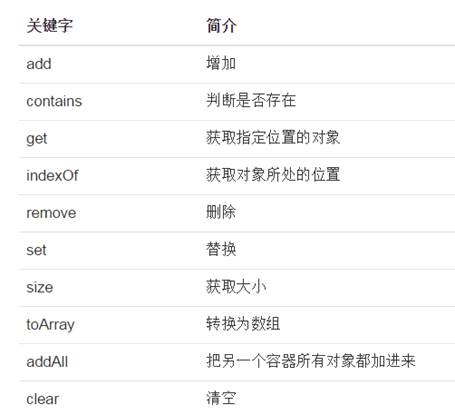
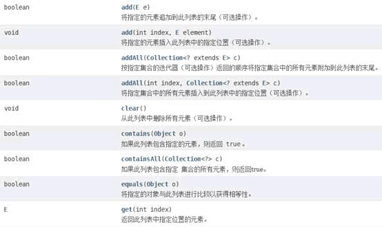

ArrayList源码示例

<!-- more -->

## ArrayList集合

示例 1 : 使用数组的局限性  

示例 2 : ArrayList存放对象  

### 示例1:使用数组的局限性

如果要存放多个对象，可以使用数组，但是数组有局限性
 比如 声明长度是10的数组
 不用的数组就浪费了
 超过10的个数，又放不下

```java

//单纯的数组的增删改并不好操作，一旦操作起来，容器影响到其他元素的位置
//存10个英雄
public class Demo01 {
 
 public static void main(String[] args) {
  
  Hero[] heros=new Hero[10];
  for(int i=0;i<10;i++) {
   heros[i]=new Hero("name:"+(i+1),100);
  }
  //打印
  for(Hero hero:heros) {
   System.out.println(hero);
  }
  //改血量，第八个名字改成name80,血量500
  heros[7].setName("name80");
  heros[7].setHp(500);
  System.out.println(heros[7]);
  //删除第八个
  //..心态炸了，不写了
 }
} 
//定义好了一个英雄类
class Hero{
 private String name;
 private int hp;
 public Hero(String name, int hp) {
  this.name = name;
  this.hp = hp;
 }
 public Hero() {
 }
 public String getName() {
  return name;
 }
 public void setName(String name) {
  this.name = name;
 }
 public int getHp() {
  return hp;
 }
 public void setHp(int hp) {
  this.hp = hp;
 }
 @Override
 public String toString() {
  return "Hero [name=" + name + ", hp=" + hp + "]";
 }
}

```

### 示例2: ArrayList存放对象

为了解决数组的局限性，引入容器类的概念。 最常见的容器类就是ArrayList

容器容量"capacity"会随着对象的增加，自动增长
 只需要不断往容器里增加英雄即可，不用担心会出现数组的边界问题

#### arraylist的源码结构如下

```java
package com.haoyu;

public class MyArrayList<E> {
 private E[] data;
 private int size;

 // 构造函数，传入数组的容量capacity构造Array
 public MyArrayList(int capacity) {
  data = (E[]) new Object[capacity];
  size = 0;
 }

 // 无参数的构造函数，默认数组的容量capacity=10
 public MyArrayList() {
  this(10);
 }

 // 获取数组的容量
 public int getCapacity() {
  return data.length;
 }

 // 获取数组中的元素个数
 public int getSize() {
  return size;
 }

 // 返回数组是否为空
 public boolean isEmpty() {
  return size == 0;
 }

 // 在index索引的位置插入一个新元素e
 public void add(int index, E e) {

  if (index < 0 || index > size)
   throw new IllegalArgumentException("Add failed. Require index >= 0 and index <= size.");

  if (size == data.length)
   resize(2 * data.length);

  for (int i = size - 1; i >= index; i--)
   data[i + 1] = data[i];

  data[index] = e;

  size++;
 }

 // 向所有元素后添加一个新元素
 public void addLast(E e) {
  add(size, e);
 }

 // 在所有元素前添加一个新元素
 public void addFirst(E e) {
  add(0, e);
 }

 // 获取index索引位置的元素
 public E get(int index) {
  if (index < 0 || index >= size)
   throw new IllegalArgumentException("Get failed. Index is illegal.");
  return data[index];
 }

 // 修改index索引位置的元素为e
 public void set(int index, E e) {
  if (index < 0 || index >= size)
   throw new IllegalArgumentException("Set failed. Index is illegal.");
  data[index] = e;
 }

 // 查找数组中是否有元素e
 public boolean contains(E e) {
  for (int i = 0; i < size; i++) {
   if (data[i].equals(e))
    return true;
  }
  return false;
 }

 // 查找数组中元素e所在的索引，如果不存在元素e，则返回-1
 public int find(E e) {
  for (int i = 0; i < size; i++) {
   if (data[i].equals(e))
    return i;
  }
  return -1;
 }

 // 从数组中删除index位置的元素, 返回删除的元素
 public E remove(int index) {
  if (index < 0 || index >= size)
   throw new IllegalArgumentException("Remove failed. Index is illegal.");

  E ret = data[index];
  for (int i = index + 1; i < size; i++)
   data[i - 1] = data[i];
  size--;
  data[size] = null; // loitering objects != memory leak

  if (size == data.length / 2)
   resize(data.length / 2);
  return ret;
 }

 // 从数组中删除第一个元素, 返回删除的元素
 public E removeFirst() {
  return remove(0);
 }

 // 从数组中删除最后一个元素, 返回删除的元素
 public E removeLast() {
  return remove(size - 1);
 }

 // 从数组中删除元素e
 public void removeElement(E e) {
  int index = find(e);
  if (index != -1)
   remove(index);
 }

 @Override
 public String toString() {

  StringBuilder res = new StringBuilder();
  res.append(String.format("Array: size = %d , capacity = %d\n", size, data.length));
  res.append('[');
  for (int i = 0; i < size; i++) {
   res.append(data[i]);
   if (i != size - 1)
    res.append(", ");
  }
  res.append(']');
  return res.toString();
 }

 // 将数组空间的容量变成newCapacity大小
 private void resize(int newCapacity) {

  E[] newData = (E[]) new Object[newCapacity];
  for (int i = 0; i < size; i++)
   newData[i] = data[i];
  data = newData;
 }
}

```

#### 引入arraylist的泛型使用方式，解决代码不好看问题

```java
  //import java.util.ArrayList;
  //Hero[] heros=new Hero[10];----不用去定义初始长度，arraylist自动增加长度capacity
  //泛型的第一次接触  <> 泛型符号
  ArrayList<Hero> heros2=new ArrayList<Hero>();
  for(int i=0;i<10;i++) {
   heros2.add(new Hero("name:"+(i+1),100));
//   heros2.add(1);
  }
//  for(int i=0;i<heros2.size();i++) {
//   System.out.println(heros2.get(i));//i--0开始  i<size
//  }
  for(Hero hero:heros2) {
   System.out.println(hero);
  }

```

### 示例3：arraylist常用方法



类似操作自行实现

```java
// ArrayList-使用泛型操作
  ArrayList<Hero> hero = new ArrayList<Hero>();
  ArrayList<Hero> heroTo = new ArrayList<Hero>();
  Hero hero1 = new Hero("hero1", 111);
  Hero hero2 = new Hero("hero2", 222);
  Hero hero3 = new Hero("hero3", 333);
  Hero hero0 = new Hero("heroTo", 0);
  Hero herot = new Hero("heroT2", 2);
  // 在，末尾添加元素
  heroTo.add(hero0);
  heroTo.add(herot);
  hero.add(hero1);
  hero.add(hero2);
  hero.add(hero3);
  hero.add(new Hero("hero4", 444));
  // 指定下标添加元素
  hero.add(4, new Hero("indexhero1", 555));
  for (Hero h : hero) {
   System.out.println(h);// h.getHp();h.getName();
  }

  // 添加到另外一个集合中addAll(Object);addAll(index,Object);
  heroTo.addAll(1, hero);
  for (Hero h : heroTo) {
   System.out.println(h);// h.getHp();h.getName();
  }

  // 清空列表所有元素
//  hero.clear();
  // 查看数组元素个数
  System.out.println("size-->" + hero.size());

  // 判断是否存在元素contains
  System.out.println("contains-->" + hero.contains(hero.get(2)));//
  boolean filg = hero.contains(hero2);
  System.out.println("contains-->" + filg);

  // containsAll() 如果此列表包含指定集合的所有元素，则返回true。
  boolean filg2 = heroTo.containsAll(hero);// true
  System.out.println("containsAll-->" + filg2);

  // equals() 指定的对象与此列表进行相等性比较。
  boolean filg3 = hero3.equals(hero3);
  System.out.println("equals-->" + filg3);

  // 获取指定位置的元素 数组.get()
  System.out.println("get-->" + hero.get(1));

  // 根据对象获取元素下标 数组.indexOf()
  int index = hero.indexOf(hero3);
  System.out.println("getindexOf-->" + index);

  // 设置元素set
  hero.set(1, new Hero("setname", 999));

  // 删除元素remove(int index);remove(Object o)
  hero.remove(2);// 通过索引
  hero.remove(hero1);// 通过元素
  // removeAll() 从该列表中删除指定集合中包含的所有元素(可选操作)。
//  hero.removeAll(hero);

  for (Hero h : hero) {
   System.out.println(h);// h.getHp();h.getName();
  }
  System.out.println("size-->" + hero.size());
  
  heroTo.toArray();
  for (Hero h : heroTo) {
   System.out.println(h);// h.getHp();h.getName();}

```

### 示例4：list接口

  List\<Hero>  heros3=**new** ArrayList\<Hero>();  

### 
