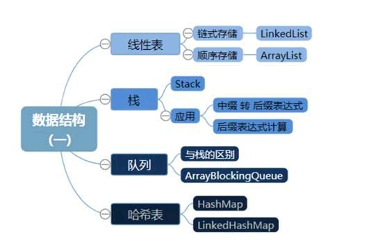
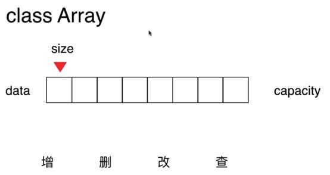
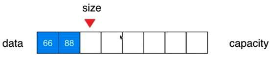
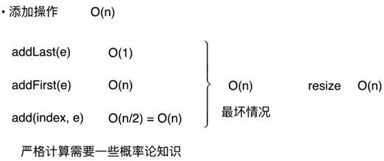
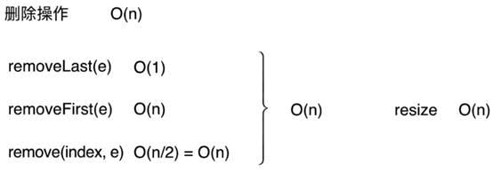
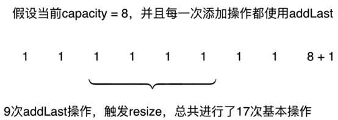
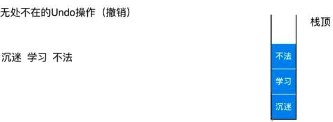
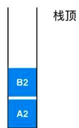
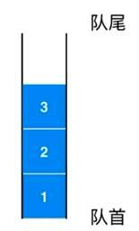

<!-- more -->



## 数组基础


给数组取一个名字Array ——arr

真实环境中更需要给数组取一个有实际意义的名字

### 数据的索引

索引概念很重要，可以有语义也可以没有语义


### 对于索引的理解

1，   数组的最大优点：快速查询——scores【2】

2，   数组最好应用于“索引有语意”的情况

3，   但并非所有有语意的索引都适用于数组

身份证号：50010520189898

4，   数组也可以处理索引没有语意的情况

5，   本章处理主要就是处理“索引没有语意”的情况数组的使用

需求：遍历数组，打印一个班的成绩


## 封装数组


提出需求：需要基于java数组，二次封装属于我们自己的数组类，区别于java本身的静态数组，性能媲美静态数组

### 动态数组设计过程



Capacity：容量

#### V1.0版本：基础数组结构

```java
class MyArray{
 //私有化数据
 private int[] data;
 //定义长度
 private int size;
 //构造函数，传入数组的容量capacity构造array
 public MyArray(int capacity){
  data=new int[capacity];
  size=0;
 }
 //无参构造函数，默认数组的容量capacity=10
 public MyArray(){
  this(10);
 }
 //获取数组中的元素个数
 public int getSize(){
  return size;
 }
 //获取数组容量
 public int getCapacity(){
  return data.length;
 }
 //返回数组是为空  不是 为空   非空    为空  true
 public boolean isEmpty(){
  return size==0;
 }
}

```

#### V1.1版本：向数组中添加元素




```java
 //向所有元素后添加一个新元素
 public void addLast(int e){
  if(size==data.length)
   throw new IllegalArgumentException("addlast faild,array is full");
//  data[size++]=e;不便于阅读
  data[size]=e;
  size++;
 }

```

#### V1.2版本：向指定的位置插入指定的元素，提供一个addFirst


代码写完后需要修改刚才的增加函数

```java
 //向所有元素后添加一个新元素
 public void addLast(int e){
//  if(size==data.length)
//   throw new IllegalArgumentException("addlast faild,array is full");
////  data[size++]=e;不便于阅读
//  data[size]=e;
//  size++;
        add(size, e);

 }
   

    // 在所有元素前添加一个新元素
    public void addFirst(int e){
        add(0, e);
    }

    // 在index索引的位置插入一个新元素e
    public void add(int index, int e){

        if(size == data.length)
            throw new IllegalArgumentException("Add failed. Array is full.");

        if(index < 0 || index > size)
            throw new IllegalArgumentException("Add failed. Require index >= 0 and index <= size.");

        for(int i = size - 1; i >= index ; i --)
            data[i + 1] = data[i];
        data[index] = e;
        size ++;
    }

```

#### V1.3版本：在数组中查询元素和修改元素

```java
    // 获取index索引位置的元素
    public int get(int index){
        if(index < 0 || index >= size)
            throw new IllegalArgumentException("Get failed. Index is illegal.");
        return data[index];
    }

    // 修改index索引位置的元素为e
    public void set(int index, int e){
        if(index < 0 || index >= size)
            throw new IllegalArgumentException("Set failed. Index is illegal.");
        data[index] = e;
    }

    @Override
    public String toString(){

        StringBuilder res = new StringBuilder();
        res.append(String.format("Array: size = %d , capacity = %d\n", size, data.length));
        res.append('[');
        for(int i = 0 ; i < size ; i ++){
            res.append(data[i]);
            if(i != size - 1)
                res.append(", ");
        }
        res.append(']');
        return res.toString();
    }

```

#### V1.4版本：包含搜索和删除

```java
    // 查找数组中是否有元素e
    public boolean contains(int e){
        for(int i = 0 ; i < size ; i ++){
            if(data[i] == e)
                return true;
        }
        return false;
    }

    // 查找数组中元素e所在的索引，如果不存在元素e，则返回-1
    public int find(int e){
        for(int i = 0 ; i < size ; i ++){
            if(data[i] == e)
                return i;
        }
        return -1;
    }

    // 从数组中删除index位置的元素, 返回删除的元素
    public int remove(int index){
        if(index < 0 || index >= size)
            throw new IllegalArgumentException("Remove failed. Index is illegal.");
        int ret = data[index];
        for(int i = index + 1 ; i <= size ; i ++)
            data[i - 1] = data[i];
        size --;
        return ret;
    }

    // 从数组中删除第一个元素, 返回删除的元素
    public int removeFirst(){
        return remove(0);
    }

    // 从数组中删除最后一个元素, 返回删除的元素
    public int removeLast(){
        return remove(size - 1);
    }

    // 从数组中删除元素e
    public void removeElement(int e){
        int index = find(e);
        if(index != -1)
            remove(index);
    }    

```

#### V1.5版本：使用泛型

理由：


代码改造：Array

```java
package com.haoyu;

public class Array<E> {

    private E[] data;
    private int size;

    // 构造函数，传入数组的容量capacity构造Array
    public Array(int capacity){
        data = (E[])new Object[capacity];
        size = 0;
    }

    // 无参数的构造函数，默认数组的容量capacity=10
    public Array(){
        this(10);
    }

    // 获取数组的容量
    public int getCapacity(){
        return data.length;
    }

    // 获取数组中的元素个数
    public int getSize(){
        return size;
    }

    // 返回数组是否为空
    public boolean isEmpty(){
        return size == 0;
    }

    // 在index索引的位置插入一个新元素e
    public void add(int index, E e){

        if(size == data.length)
            throw new IllegalArgumentException("Add failed. Array is full.");

        if(index < 0 || index > size)
            throw new IllegalArgumentException("Add failed. Require index >= 0 and index <= size.");

        for(int i = size - 1; i >= index ; i --)
            data[i + 1] = data[i];

        data[index] = e;

        size ++;
    }

    // 向所有元素后添加一个新元素
    public void addLast(E e){
        add(size, e);
    }

    // 在所有元素前添加一个新元素
    public void addFirst(E e){
        add(0, e);
    }

    // 获取index索引位置的元素
    public E get(int index){
        if(index < 0 || index >= size)
            throw new IllegalArgumentException("Get failed. Index is illegal.");
        return data[index];
    }

    // 修改index索引位置的元素为e
    public void set(int index, E e){
        if(index < 0 || index >= size)
            throw new IllegalArgumentException("Set failed. Index is illegal.");
        data[index] = e;
    }

    // 查找数组中是否有元素e
    public boolean contains(E e){
        for(int i = 0 ; i < size ; i ++){
            if(data[i].equals(e))
                return true;
        }
        return false;
    }

    // 查找数组中元素e所在的索引，如果不存在元素e，则返回-1
    public int find(E e){
        for(int i = 0 ; i < size ; i ++){
            if(data[i].equals(e))
                return i;
        }
        return -1;
    }

    // 从数组中删除index位置的元素, 返回删除的元素
    public E remove(int index){
        if(index < 0 || index >= size)
            throw new IllegalArgumentException("Remove failed. Index is illegal.");

        E ret = data[index];
        for(int i = index + 1 ; i < size ; i ++)
            data[i - 1] = data[i];
        size --;
        data[size] = null; // loitering objects != memory leak
        return ret;
    }

    // 从数组中删除第一个元素, 返回删除的元素
    public E removeFirst(){
        return remove(0);
    }

    // 从数组中删除最后一个元素, 返回删除的元素
    public E removeLast(){
        return remove(size - 1);
    }

    // 从数组中删除元素e
    public void removeElement(E e){
        int index = find(e);
        if(index != -1)
            remove(index);
    }

    @Override
    public String toString(){

        StringBuilder res = new StringBuilder();
        res.append(String.format("Array: size = %d , capacity = %d\n", size, data.length));
        res.append('[');
        for(int i = 0 ; i < size ; i ++){
            res.append(data[i]);
            if(i != size - 1)
                res.append(", ");
        }
        res.append(']');
        return res.toString();
    }
}

```

测试类：student

```java
package com.haoyu;

public class Student {

    private String name;
    private int score;

    public Student(String studentName, int studentScore){
        name = studentName;
        score = studentScore;
    }

    @Override
    public String toString(){
        return String.format("Student(name: %s, score: %d)", name, score);
    }

    public static void main(String[] args) {

        Array<Student> arr = new Array<Student>();
        arr.addLast(new Student("Alice", 100));
        arr.addLast(new Student("Bob", 66));
        arr.addLast(new Student("Charlie", 88));
        System.out.println(arr);
    }
}


```

打印类：

```java
public class Main {

    public static void main(String[] args) {

        Array<Integer> arr = new Array<Integer>(20);
        for(int i = 0 ; i < 10 ; i ++)
            arr.addLast(i);
        System.out.println(arr);

        arr.add(1, 100);
        System.out.println(arr);

        arr.addFirst(-1);
        System.out.println(arr);
        // [-1, 0, 100, 1, 2, 3, 4, 5, 6, 7, 8, 9]

        arr.remove(2);
        System.out.println(arr);

        arr.removeElement(4);
        System.out.println(arr);

        arr.removeFirst();
        System.out.println(arr);
    }
}

```

#### V1.5版本：动态数组


```java
// 在index索引的位置插入一个新元素e
  public void add(int index, E e){

      if(index < 0 || index > size)
          throw new IllegalArgumentException("Add failed. Require index >= 0 and index <= size.");

      if(size == data.length)
          resize(2 * data.length);

      for(int i = size - 1; i >= index ; i --)
          data[i + 1] = data[i];

      data[index] = e;

      size ++;
  }

    // 将数组空间的容量变成newCapacity大小
    private void resize(int newCapacity){

        E[] newData = (E[])new Object[newCapacity];
        for(int i = 0 ; i < size ; i ++)
            newData[i] = data[i];
        data = newData;
    }

```

测试：

```java
public class Main {
    public static void main(String[] args) {
        Array<Integer> arr = new Array<Integer>();
        for(int i = 0 ; i < 10 ; i ++)
            arr.addLast(i);
        System.out.println(arr);

        arr.add(1, 100);
        System.out.println(arr);

        arr.addFirst(-1);
        System.out.println(arr);

        arr.remove(2);
        System.out.println(arr);

        arr.removeElement(4);
        System.out.println(arr);

        arr.removeFirst();
        System.out.println(arr);
    }
}

```

#### V1.51经典版程序

```java
import java.util.Arrays;
/**
* <p>Title: Demo19.java</p>  
* <p>Description:
* 125经典版 </p>  
* <p>Copyright: Copyright (c) 2017</p>  
* <p>Company: com.haoyu</p>  
* @author 大师  
* @date 2019年8月14日  
* @version 1.0
 */
//定义集合--多功能的简便操作的数组
//my 我的   array  数组  list 列表
//我的数组增强功能后的列表类--线性数组集合类
class MyArrayList{
 //声明要准备好空间，等待后面存入元素
 private int[] data;
 //定义元素个数
 private int size;
 //定义一个初始化数组容量大小
 private int capacity=16;
 //new的时候保证初始化空间与个数
 public MyArrayList(int capacity) {
  //更改初始化的长度
  //健壮性判断
  if(capacity<=0) {
   data=new int[this.capacity];
  }else {
   data=new int[capacity];
  }
  //由于现在没有存储元素，因此元素个数=0
  this.size=0;
 }
 //无参构造函数，默认数组的容量capacity=10
 public MyArrayList(){
  //调用其他的带参数的对应构造函数
  this(10);
 }
 public int getSize() {
  return size;
 }
 //获取数组容量--数组定义后开辟的空间个数
 public int getCapacity(){
  //数组在初始化后就开辟的空间个数，只不过里面目前有没有元素。不清楚
  return data.length;
 }
 //返回数组"是为空"  false isEmpty-不为空   true isEmpty-为空
 public boolean isEmpty(){
  return size==0;
 }
 //在数组末尾增加元素
 //last 最后  e-element:元素
 //MyArrayList [data=[1, 2, 3, 0, 0, 0, 0, 0, 0, 0]]
// public void addLast(int e) {
//  //判断一下当前的空间是否已经容量满员。如果已经满员了，就不应该执行增加操作了
//  if(size==data.length) {
//   //一旦出现问题，throw 抛出去一个问题 xxxException  exception：异常，问题
//   //后面的java代码不会再继续执行
//   throw new RuntimeException("容量已满");
//  }
//  //size当前位置增加一个元素（赋值一个元素）
//  data[size]=e;
//  //size往后走一位
//  size++;
// }
 
 public void addLast(int e) {
  insert(size,e);
 }
 public void addFirst(int e) {
  insert(0,e);
 }
 //插入元素  index=插入的位置--数组元素角标
 //index-0  +++   e-element：元素
 public void insert(int index,int e) {
  //判断一下当前的空间是否已经容量满员。如果已经满员了，就不应该执行增加操作了
  if(size==data.length) {
   //一旦出现问题，throw 抛出去一个问题 xxxException  exception：异常，问题
   //后面的java代码不会再继续执行
//   throw new RuntimeException("容量已满");
   resize(2*data.length);
  }
  //插歪了，让代码停止执行
  if(index < 0 || index > size) {
   throw new IllegalArgumentException("Add failed. Require index >= 0 and index <= size.");
  }
  //MyArrayList [data=[1, 2, 3, 0, 0, 0, 0, 0, 0, 0]]
  //size=3
  //i=size-1=2  data[2]=3  
  //i-- i>=index  index=0  
  //2 1 0:存在元素要依次往后走一位  e=data[index=0]
  for(int i=size-1;i>=index;i--) {
   data[i+1]=data[i];
  }
  //剩下的[index]=e
  data[index]=e;
  //由于是增加了一个元素
  size++;
  
  if(size==data.length) {
   resize(2*data.length);
  }
 }
 
 //获取元素  index-0~size-1
 public int get(int index) {
  //查歪了
  if(index < 0 || index > size-1) {
   throw new IllegalArgumentException("Add failed. Require index >= 0 and index <= size.");
  }
  return data[index];
 }
 
 //修改制定位置的元素
 public void set(int index,int e) {
  //查歪了
  if(index < 0 || index > size-1) {
   throw new IllegalArgumentException("Add failed. Require index >= 0 and index <= size.");
  }
  data[index]=e;
 }
 
 //查看数组是否包含元素
 public boolean contains(int e) {
  //从0角标开始往后遍历，直到size-1结束
  for(int i=0;i<size;i++) {
   if(data[i]==e) {
    return true;
   }
  }
  return false;
 }
 //获取索引角标
 //如果不在范围内，返回-1
 public int getIndex(int e) {
  for(int i=0;i<size;i++) {
   if(data[i]==e) {
    return i;
   }
  }
  return -1;
 }
    // 从数组中删除index位置的元素, 返回删除的元素
    public int remove(int index){
        if(index < 0 || index >= size)
            throw new IllegalArgumentException("Remove failed. Index is illegal.");

        int ret = data[index];
        for(int i = index + 1 ; i <= size ; i ++)
            data[i - 1] = data[i];
        size --;
//        1 2 3 4 5 0 0 0 size:5 length:8
//        1 2 3 4 0 0 0 0 size:4 length:8
//        1 2 3 0         size:3 length:4
        if(size==data.length/2-1) {
         delResize();
        }
        
        return ret;
    }
 
 //扩容操作 re再一次 size大小 resize再一次确定大小
 //2*data.length
 public  void resize(int newCapacity) {
  int[] newData=new int[newCapacity];
  //把原来少元素的数组赋值给长的数组
  for(int i=0;i<data.length;i++) {
   newData[i]=data[i];
  }
  data=newData;//数组名字指向的是整个数组的内存起始地址
 }
 //缩容操作
 public void delResize() {
  int[] newData=new int[data.length/2];
  for(int i=0;i<newData.length;i++) {
   newData[i]=data[i];
  }
  data=newData;
 }
 
 @Override
 public String toString() {
  return "MyArrayList [data=" + Arrays.toString(data) + "]";
 }

}

```

#### V1.6版本：使用泛型

```java
public class Array<E> {

    private E[] data;
    private int size;

    // 构造函数，传入数组的容量capacity构造Array
    public Array(int capacity){
        data = (E[])new Object[capacity];
        size = 0;
    }

    // 无参数的构造函数，默认数组的容量capacity=10
    public Array(){
        this(10);
    }

    // 获取数组的容量
    public int getCapacity(){
        return data.length;
    }

    // 获取数组中的元素个数
    public int getSize(){
        return size;
    }

    // 返回数组是否为空
    public boolean isEmpty(){
        return size == 0;
    }

    // 在index索引的位置插入一个新元素e
    public void add(int index, E e){

        if(index < 0 || index > size)
            throw new IllegalArgumentException("Add failed. Require index >= 0 and index <= size.");

        if(size == data.length)
            resize(2 * data.length);

        for(int i = size - 1; i >= index ; i --)
            data[i + 1] = data[i];

        data[index] = e;

        size ++;
    }

    // 向所有元素后添加一个新元素
    public void addLast(E e){
        add(size, e);
    }

    // 在所有元素前添加一个新元素
    public void addFirst(E e){
        add(0, e);
    }

    // 获取index索引位置的元素
    public E get(int index){
        if(index < 0 || index >= size)
            throw new IllegalArgumentException("Get failed. Index is illegal.");
        return data[index];
    }

    // 修改index索引位置的元素为e
    public void set(int index, E e){
        if(index < 0 || index >= size)
            throw new IllegalArgumentException("Set failed. Index is illegal.");
        data[index] = e;
    }

    // 查找数组中是否有元素e
    public boolean contains(E e){
        for(int i = 0 ; i < size ; i ++){
            if(data[i].equals(e))
                return true;
        }
        return false;
    }

    // 查找数组中元素e所在的索引，如果不存在元素e，则返回-1
    public int find(E e){
        for(int i = 0 ; i < size ; i ++){
            if(data[i].equals(e))
                return i;
        }
        return -1;
    }

    // 从数组中删除index位置的元素, 返回删除的元素
    public E remove(int index){
        if(index < 0 || index >= size)
            throw new IllegalArgumentException("Remove failed. Index is illegal.");

        E ret = data[index];
        for(int i = index + 1 ; i < size ; i ++)
            data[i - 1] = data[i];
        size --;
        data[size] = null; // loitering objects != memory leak

        if(size == data.length / 2)
            resize(data.length / 2);
        return ret;
    }

    // 从数组中删除第一个元素, 返回删除的元素
    public E removeFirst(){
        return remove(0);
    }

    // 从数组中删除最后一个元素, 返回删除的元素
    public E removeLast(){
        return remove(size - 1);
    }

    // 从数组中删除元素e
    public void removeElement(E e){
        int index = find(e);
        if(index != -1)
            remove(index);
    }

    @Override
    public String toString(){

        StringBuilder res = new StringBuilder();
        res.append(String.format("Array: size = %d , capacity = %d\n", size, data.length));
        res.append('[');
        for(int i = 0 ; i < size ; i ++){
            res.append(data[i]);
            if(i != size - 1)
                res.append(", ");
        }
        res.append(']');
        return res.toString();
    }

    // 将数组空间的容量变成newCapacity大小
    private void resize(int newCapacity){

        E[] newData = (E[])new Object[newCapacity];
        for(int i = 0 ; i < size ; i ++)
            newData[i] = data[i];
        data = newData;
    }
}

```

### 数组时间复杂度算法简单分析

#### 1， 简单复杂度分析

通过时间复杂度分析出算法的性能如何

时间复杂度通常是如下表示的


读作大O1 大On大O nlogn 大On平方

这里的这个大O就是描述的算法的运行时间和输入数据之间的关系

什么是运行时间和输入数据之间的关系呢？通过下面例子来演示


也就是说这里产生了n个数，那么n的数量是多少，对应的时间也就线性增加，但其实，每个n并非是时间系数为1的.

比如：操作每一个数（temp），需要从这个这个数组中通过for循环取出来，然后需要取出sum并与temp加在一起重新再赋值给sum，对于每个数其实都是需需要这么多操作的，那么这样的操作所花费的时间系数，我们称之为C1，那么在开始计算之前可能还需要赋值sum=0，完成计算后还要返回这个sum，这些每次都有的操作所花费的等同的时间叫做c2


为什么要忽略这个c1，c2呢，因为拿这里的c1来说，就算是直接使用，基于不同的语言，执行时间段也是不同的，就算是执行时间相同，底层的操作系统的汇编层面或者机器语言所花费的解析时间也不同，而且不同的cpu也是不同的，因此c2也是同理。接下来看一组结论和案例对比：


这里的时间复杂度描述的不是临界值，而是n趋近于无穷时候，这个算法谁块谁慢，同理，在这种情况下，低阶项实际上也很小，可以看做也是一个常数，忽略不计


分析自定义数组的各项操作



针对删除操作，删除1个跟删除n个平均来看，就是n/2，1/2也是一个常数系数，舍去系数O（n）




结论：


问题：删除和增加的分析完全使用最坏时间复杂度来分析是不合理的，因为并不是所有的操作都会触发这个容积的扩容

#### 2， 均摊复杂度和防止复杂度的震荡

分析增加操作中触发resize操作的条件


分析：假如一个数组的capacity是10个元素，那么添加10个元素才可能会触发一次resize，此时触发resize之后数组的容量就会变成20，此时再添加10个才会再次触发这个resize，这个时候会变成capacity为40，也就是再添加20个数，才会触发resize，也就是说不会是每次添加一个元素都会触发resize，而我们却一直用最坏时间复杂度分析，这样是不合理的

再次深入分析，案例如下：

在resize之前，所有的操作都是O（1）级别，而在addlast为第9个时候需要扩容，那么第九次等于for循环所有数组里的值进入新数组的时间和，再加1次add操作



所以，对于addLast来说，9次操作，平均来讲，每次的操作接近2次基本操作

结论


这样均摊计算，时间复杂度是O（1）级别，在这样的例子里，这样均摊计算比计算最坏情况有意义


按照这样理解removeLast的均摊时间复杂度也是O（1）级别

但是这样会引发下一个问题

#### 3，复杂度震荡

初始条件


这个时候增加一个元素，触发的是扩容操作，加一个元素


马上又进行removeLast的操作，此时又会触发缩容的操作，再次调用resize，时间复杂度依然是O（n）


一直这样循环呢？


解决办法


扩容没有办法减少时间复杂度的增加，但是缩小的时候，并不着急把扩到二倍的数组容量减少为原来的1倍，同理这个时候要扩容也不用再次O（n）的addLast操作而是O（1）


当全部元素只剩下原来的4分1，也就是说


```java
public class Array<E> {
    private E[] data;
    private int size;
    // 构造函数，传入数组的容量capacity构造Array
    public Array(int capacity){
        data = (E[])new Object[capacity];
        size = 0;
    }

    // 无参数的构造函数，默认数组的容量capacity=10
    public Array(){
        this(10);
    }

    // 获取数组的容量
    public int getCapacity(){
        return data.length;
    }

    // 获取数组中的元素个数
    public int getSize(){
        return size;
    }

    // 返回数组是否为空
    public boolean isEmpty(){
        return size == 0;
    }

    // 在index索引的位置插入一个新元素e
    public void add(int index, E e){

        if(index < 0 || index > size)
            throw new IllegalArgumentException("Add failed. Require index >= 0 and index <= size.");

        if(size == data.length)
            resize(2 * data.length);

        for(int i = size - 1; i >= index ; i --)
            data[i + 1] = data[i];

        data[index] = e;

        size ++;
    }

    // 向所有元素后添加一个新元素
    public void addLast(E e){
        add(size, e);
    }

    // 在所有元素前添加一个新元素
    public void addFirst(E e){
        add(0, e);
    }

    // 获取index索引位置的元素
    public E get(int index){
        if(index < 0 || index >= size)
            throw new IllegalArgumentException("Get failed. Index is illegal.");
        return data[index];
    }

    // 修改index索引位置的元素为e
    public void set(int index, E e){
        if(index < 0 || index >= size)
            throw new IllegalArgumentException("Set failed. Index is illegal.");
        data[index] = e;
    }

    // 查找数组中是否有元素e
    public boolean contains(E e){
        for(int i = 0 ; i < size ; i ++){
            if(data[i].equals(e))
                return true;
        }
        return false;
    }

    // 查找数组中元素e所在的索引，如果不存在元素e，则返回-1
    public int find(E e){
        for(int i = 0 ; i < size ; i ++){
            if(data[i].equals(e))
                return i;
        }
        return -1;
    }

    // 从数组中删除index位置的元素, 返回删除的元素
    public E remove(int index){
        if(index < 0 || index >= size)
            throw new IllegalArgumentException("Remove failed. Index is illegal.");

        E ret = data[index];
        for(int i = index + 1 ; i < size ; i ++)
            data[i - 1] = data[i];
        size --;
        data[size] = null; // loitering objects != memory leak
//对于动态数组来说，不能够在缩容的时候让他的值等于0
        if(size == data.length / 4 && data.length / 2 != 0)
            resize(data.length / 2);
        return ret;
    }

    // 从数组中删除第一个元素, 返回删除的元素
    public E removeFirst(){
        return remove(0);
    }

    // 从数组中删除最后一个元素, 返回删除的元素
    public E removeLast(){
        return remove(size - 1);
    }

    // 从数组中删除元素e
    public void removeElement(E e){
        int index = find(e);
        if(index != -1)
            remove(index);
    }

    @Override
    public String toString(){

        StringBuilder res = new StringBuilder();
        res.append(String.format("Array: size = %d , capacity = %d\n", size, data.length));
        res.append('[');
        for(int i = 0 ; i < size ; i ++){
            res.append(data[i]);
            if(i != size - 1)
                res.append(", ");
        }
        res.append(']');
        return res.toString();
    }

    // 将数组空间的容量变成newCapacity大小
    private void resize(int newCapacity){

        E[] newData = (E[])new Object[newCapacity];
        for(int i = 0 ; i < size ; i ++)
            newData[i] = data[i];
        data = newData;
    }
}

```

## 栈（stack）

Stack是一种线性结构

相比数组，栈对应的操作是数组的子集，而且他的操作更少

只能从唯一的一端添加元素，也只能从这个唯一的一端取出元素

这个唯一的一端称为栈顶

### 展示元素入栈的过程

3这个元素只能在这个位置，不可以插入2和1元素之间

### 展示元素出栈的过程


### 小结

1，   栈是一种后进先出的数据结构

2，   Last In First Out(LIFO)

3，   Stack在计算机的运用里拥有不可思议的作用

#### 案例1

沉迷学习无法自拔



最直接的一个案例，比如word中的文字撤销操作，比如以下的撤销不法，当这个不法两个字被撤销后，不需要再保留他们，直接出栈


输入正确的内容和顺序


#### 案例2

程序调用的系统栈


首先执行A这个函数


顺序执行1,2,3，行，当在执行到第二行的时候


会跳去执行B这个函数，a函数会暂时中断


此时可以在系统栈中认为，A函数执行到了第二行，记为A2


然后继续执行


同理



最后C函数在执行完成之后，就会回到B2继续执行，然后执行完成，B2出栈，剩下一个A2，继续执行A函数的内容最后A2出栈函数全部执行完毕

### 栈的基本实现


栈的实现有很多种数据结构的方式，数组实现只是其中一种


栈的实现结构


对应的array的数组，增加部分加粗标红

#### Array

```java

public class Array<E> {

    private E[] data;
    private int size;

    // 构造函数，传入数组的容量capacity构造Array
    public Array(int capacity){
        data = (E[])new Object[capacity];
        size = 0;
    }

    // 无参数的构造函数，默认数组的容量capacity=10
    public Array(){
        this(10);
    }

    // 获取数组的容量
    public int getCapacity(){
        return data.length;
    }

    // 获取数组中的元素个数
    public int getSize(){
        return size;
    }

    // 返回数组是否为空
    public boolean isEmpty(){
        return size == 0;
    }

    // 在index索引的位置插入一个新元素e
    public void add(int index, E e){

        if(index < 0 || index > size)
            throw new IllegalArgumentException("Add failed. Require index >= 0 and index <= size.");

        if(size == data.length)
            resize(2 * data.length);

        for(int i = size - 1; i >= index ; i --)
            data[i + 1] = data[i];

        data[index] = e;

        size ++;
    }

    // 向所有元素后添加一个新元素
    public void addLast(E e){
        add(size, e);
    }

    // 在所有元素前添加一个新元素
    public void addFirst(E e){
        add(0, e);
    }

    // 获取index索引位置的元素
    public E get(int index){
        if(index < 0 || index >= size)
            throw new IllegalArgumentException("Get failed. Index is illegal.");
        return data[index];
    }

    public E getLast(){
        return get(size - 1);
    }

    public E getFirst(){
        return get(0);
    }

    // 修改index索引位置的元素为e
    public void set(int index, E e){
        if(index < 0 || index >= size)
            throw new IllegalArgumentException("Set failed. Index is illegal.");
        data[index] = e;
    }

    // 查找数组中是否有元素e
    public boolean contains(E e){
        for(int i = 0 ; i < size ; i ++){
            if(data[i].equals(e))
                return true;
        }
        return false;
    }

    // 查找数组中元素e所在的索引，如果不存在元素e，则返回-1
    public int find(E e){
        for(int i = 0 ; i < size ; i ++){
            if(data[i].equals(e))
                return i;
        }
        return -1;
    }

    // 从数组中删除index位置的元素, 返回删除的元素
    public E remove(int index){
        if(index < 0 || index >= size)
            throw new IllegalArgumentException("Remove failed. Index is illegal.");

        E ret = data[index];
        for(int i = index + 1 ; i < size ; i ++)
            data[i - 1] = data[i];
        size --;
        data[size] = null; // loitering objects != memory leak

        if(size == data.length / 4 && data.length / 2 != 0)
            resize(data.length / 2);
        return ret;
    }

    // 从数组中删除第一个元素, 返回删除的元素
    public E removeFirst(){
        return remove(0);
    }

    // 从数组中删除最后一个元素, 返回删除的元素
    public E removeLast(){
        return remove(size - 1);
    }

    // 从数组中删除元素e
    public void removeElement(E e){
        int index = find(e);
        if(index != -1)
            remove(index);
    }

    @Override
    public String toString(){

        StringBuilder res = new StringBuilder();
        res.append(String.format("Array: size = %d , capacity = %d\n", size, data.length));
        res.append('[');
        for(int i = 0 ; i < size ; i ++){
            res.append(data[i]);
            if(i != size - 1)
                res.append(", ");
        }
        res.append(']');
        return res.toString();
    }

    // 将数组空间的容量变成newCapacity大小
    private void resize(int newCapacity){

        E[] newData = (E[])new Object[newCapacity];
        for(int i = 0 ; i < size ; i ++)
            newData[i] = data[i];
        data = newData;
    }
}

```

#### Stack

```java
public interface Stack<E> {
    int getSize();
    boolean isEmpty();
    void push(E e);
    E pop();
    E peek();
}

```

#### ArrayStack

```java
public class ArrayStack<E> implements Stack<E> {

    private Array<E> array;

    public ArrayStack(int capacity){
        array = new Array<>(capacity);
    }

    public ArrayStack(){
        array = new Array<>();
    }

    @Override
    public int getSize(){
        return array.getSize();
    }

    @Override
    public boolean isEmpty(){
        return array.isEmpty();
    }

    public int getCapacity(){
        return array.getCapacity();
    }

    @Override
    public void push(E e){
        array.addLast(e);
    }

    @Override
    public E pop(){
        return array.removeLast();
    }

    @Override
    public E peek(){
        return array.getLast();
    }

    @Override
    public String toString(){
        StringBuilder res = new StringBuilder();
        res.append("Stack: ");
        res.append('[');
        for(int i = 0 ; i < array.getSize() ; i ++){
            res.append(array.get(i));
            if(i != array.getSize() - 1)
                res.append(", ");
        }
        res.append("] top");
        return res.toString();
    }
}

```

#### Main

```java
public class Main {

    public static void main(String[] args) {

        ArrayStack<Integer> stack = new ArrayStack<>();

        for(int i = 0 ; i < 5 ; i ++){
            stack.push(i);
            System.out.println(stack);
        }

        stack.pop();
        System.out.println(stack);
    }
}

```

### 栈的时间复杂度分析

### Stack案例实操（编译器对括号的匹配报错机制）


分析思路


逐一加入栈结构


当开始匹配右括号的时候，需要看当前栈顶是否是和他匹配的，如果匹配那么当前栈顶的括号就可以出栈了


当全部出栈，那么当前的匹配就是一个合法的字符串

代码实现

```java
import java.util.Stack;

class Solution {

    public boolean isValid(String s) {

        Stack<Character> stack = new Stack<>();
        for(int i = 0 ; i < s.length() ; i ++){
            char c = s.charAt(i);
            if(c == '(' || c == '[' || c == '{')
                stack.push(c);
            else{
                if(stack.isEmpty())
                    return false;

                char topChar = stack.pop();
                if(c == ')' && topChar != '(')
                    return false;
                if(c == ']' && topChar != '[')
                    return false;
                if(c == '}' && topChar != '{')
                    return false;
            }
        }
        return stack.isEmpty();
    }

    public static void main(String[] args) {

        System.out.println((new Solution()).isValid("()[]{}"));
        System.out.println((new Solution()).isValid("([)]"));
    }
}

```

## 队列

### 定义

队列是一种线性结构

只能从一端（队尾）添加元素，只能从另一端（队首）取出元素



结论：队列是一种先进先出的数据结构（First in First out）


队列的实现


队列时间复杂度分析


### Array

```java

public class Array<E> {

    private E[] data;
    private int size;

    // 构造函数，传入数组的容量capacity构造Array
    public Array(int capacity){
        data = (E[])new Object[capacity];
        size = 0;
    }

    // 无参数的构造函数，默认数组的容量capacity=10
    public Array(){
        this(10);
    }

    // 获取数组的容量
    public int getCapacity(){
        return data.length;
    }

    // 获取数组中的元素个数
    public int getSize(){
        return size;
    }

    // 返回数组是否为空
    public boolean isEmpty(){
        return size == 0;
    }

    // 在index索引的位置插入一个新元素e
    public void add(int index, E e){

        if(index < 0 || index > size)
            throw new IllegalArgumentException("Add failed. Require index >= 0 and index <= size.");

        if(size == data.length)
            resize(2 * data.length);

        for(int i = size - 1; i >= index ; i --)
            data[i + 1] = data[i];

        data[index] = e;

        size ++;
    }

    // 向所有元素后添加一个新元素
    public void addLast(E e){
        add(size, e);
    }

    // 在所有元素前添加一个新元素
    public void addFirst(E e){
        add(0, e);
    }

    // 获取index索引位置的元素
    public E get(int index){
        if(index < 0 || index >= size)
            throw new IllegalArgumentException("Get failed. Index is illegal.");
        return data[index];
    }

    public E getLast(){
        return get(size - 1);
    }

    public E getFirst(){
        return get(0);
    }

    // 修改index索引位置的元素为e
    public void set(int index, E e){
        if(index < 0 || index >= size)
            throw new IllegalArgumentException("Set failed. Index is illegal.");
        data[index] = e;
    }

    // 查找数组中是否有元素e
    public boolean contains(E e){
        for(int i = 0 ; i < size ; i ++){
            if(data[i].equals(e))
                return true;
        }
        return false;
    }

    // 查找数组中元素e所在的索引，如果不存在元素e，则返回-1
    public int find(E e){
        for(int i = 0 ; i < size ; i ++){
            if(data[i].equals(e))
                return i;
        }
        return -1;
    }

    // 从数组中删除index位置的元素, 返回删除的元素
    public E remove(int index){
        if(index < 0 || index >= size)
            throw new IllegalArgumentException("Remove failed. Index is illegal.");

        E ret = data[index];
        for(int i = index + 1 ; i < size ; i ++)
            data[i - 1] = data[i];
        size --;
        data[size] = null; // loitering objects != memory leak

        if(size == data.length / 4 && data.length / 2 != 0)
            resize(data.length / 2);
        return ret;
    }

    // 从数组中删除第一个元素, 返回删除的元素
    public E removeFirst(){
        return remove(0);
    }

    // 从数组中删除最后一个元素, 返回删除的元素
    public E removeLast(){
        return remove(size - 1);
    }

    // 从数组中删除元素e
    public void removeElement(E e){
        int index = find(e);
        if(index != -1)
            remove(index);
    }

    @Override
    public String toString(){

        StringBuilder res = new StringBuilder();
        res.append(String.format("Array: size = %d , capacity = %d\n", size, data.length));
        res.append('[');
        for(int i = 0 ; i < size ; i ++){
            res.append(data[i]);
            if(i != size - 1)
                res.append(", ");
        }
        res.append(']');
        return res.toString();
    }

    // 将数组空间的容量变成newCapacity大小
    private void resize(int newCapacity){

        E[] newData = (E[])new Object[newCapacity];
        for(int i = 0 ; i < size ; i ++)
            newData[i] = data[i];
        data = newData;
    }
}

```

### ArrayQueue

```java
public class ArrayQueue<E> implements Queue<E> {

    private Array<E> array;

    public ArrayQueue(int capacity){
        array = new Array<>(capacity);
    }

    public ArrayQueue(){
        array = new Array<>();
    }

    @Override
    public int getSize(){
        return array.getSize();
    }

    @Override
    public boolean isEmpty(){
        return array.isEmpty();
    }

    public int getCapacity(){
        return array.getCapacity();
    }

    @Override
    public void enqueue(E e){
        array.addLast(e);
    }

    @Override
    public E dequeue(){
        return array.removeFirst();
    }

    @Override
    public E getFront(){
        return array.getFirst();
    }

    @Override
    public String toString(){
        StringBuilder res = new StringBuilder();
        res.append("Queue: ");
        res.append("front [");
        for(int i = 0 ; i < array.getSize() ; i ++){
            res.append(array.get(i));
            if(i != array.getSize() - 1)
                res.append(", ");
        }
        res.append("] tail");
        return res.toString();
    }

    public static void main(String[] args) {

        ArrayQueue<Integer> queue = new ArrayQueue<>();
        for(int i = 0 ; i < 10 ; i ++){
            queue.enqueue(i);
            System.out.println(queue);
            if(i % 3 == 2){
                queue.dequeue();
                System.out.println(queue);
            }
        }
    }
}

```

### Queue

```java
public interface Queue<E> {

    int getSize();
    boolean isEmpty();
    void enqueue(E e);
    E dequeue();
    E getFront();
}

```

引出一个问题

删除队首元素会引发O（n）的操作

因此提出指向一个队首和队尾的指针


循环队列

Front和tail相等的时候队列为空


当往队首添加元素的时候


如果出现出队的同时又出现入队


当队尾出入队到容量的极限的时候，会先去看一下front之前有没有位置，


如果有空位


Tail会到回到容量的起始，再依次往后，（tail+1）%capacity(data.length)=front——》队列满，整个循环队列的结构是有意识地浪费了一个空间


解释一下循环队列的代码：

Newdata0-front

Newdata1-front+1

真正的队列偏移是front+i的，由于又是循环队列，因此防止数组越界，(front+i)%data.length

代码实现

```java
public class LoopQueue<E> implements Queue<E> {

    private E[] data;
    private int front, tail;
    private int size;  // 有兴趣的同学，在完成这一章后，可以思考一下：
                       // LoopQueue中不声明size，如何完成所有的逻辑？
                       // 这个问题可能会比大家想象的要难一点点：）

    public LoopQueue(int capacity){
        data = (E[])new Object[capacity + 1];
        front = 0;
        tail = 0;
        size = 0;
    }

    public LoopQueue(){
        this(10);
    }

    public int getCapacity(){
        return data.length - 1;
    }

    @Override
    public boolean isEmpty(){
        return front == tail;
    }

    @Override
    public int getSize(){
        return size;
    }

    @Override
    public void enqueue(E e){

        if((tail + 1) % data.length == front)
            resize(getCapacity() * 2);

        data[tail] = e;
        tail = (tail + 1) % data.length;
        size ++;
    }

    @Override
    public E dequeue(){

        if(isEmpty())
            throw new IllegalArgumentException("Cannot dequeue from an empty queue.");

        E ret = data[front];
        data[front] = null;
        front = (front + 1) % data.length;
        size --;
        if(size == getCapacity() / 4 && getCapacity() / 2 != 0)
            resize(getCapacity() / 2);
        return ret;
    }

    @Override
    public E getFront(){
        if(isEmpty())
            throw new IllegalArgumentException("Queue is empty.");
        return data[front];
    }

    private void resize(int newCapacity){

        E[] newData = (E[])new Object[newCapacity + 1];
        for(int i = 0 ; i < size ; i ++)
            newData[i] = data[(i + front) % data.length];

        data = newData;
        front = 0;
        tail = size;
    }

    @Override
    public String toString(){

        StringBuilder res = new StringBuilder();
        res.append(String.format("Queue: size = %d , capacity = %d\n", size, getCapacity()));
        res.append("front [");
        for(int i = front ; i != tail ; i = (i + 1) % data.length){
            res.append(data[i]);
            if((i + 1) % data.length != tail)
                res.append(", ");
        }
        res.append("] tail");
        return res.toString();
    }

    public static void main(String[] args){

        LoopQueue<Integer> queue = new LoopQueue<>();
        for(int i = 0 ; i < 10 ; i ++){
            queue.enqueue(i);
            System.out.println(queue);

            if(i % 3 == 2){
                queue.dequeue();
                System.out.println(queue);
            }
        }
    }
}

```

### 循环队列与数组队列的时间复杂度分析


```java
import java.util.Random;

public class Main {

    // 测试使用q运行opCount个enqueueu和dequeue操作所需要的时间，单位：秒
    private static double testQueue(Queue<Integer> q, int opCount){

        long startTime = System.nanoTime();

        Random random = new Random();
        for(int i = 0 ; i < opCount ; i ++)
            q.enqueue(random.nextInt(Integer.MAX_VALUE));
        for(int i = 0 ; i < opCount ; i ++)
            q.dequeue();

        long endTime = System.nanoTime();

        return (endTime - startTime) / 1000000000.0;
    }

    public static void main(String[] args) {

        int opCount = 100000;

        ArrayQueue<Integer> arrayQueue = new ArrayQueue<>();
        double time1 = testQueue(arrayQueue, opCount);
        System.out.println("ArrayQueue, time: " + time1 + " s");

        LoopQueue<Integer> loopQueue = new LoopQueue<>();
        double time2 = testQueue(loopQueue, opCount);
        System.out.println("LoopQueue, time: " + time2 + " s");
    }
}

```

## 链表

前瞻课程：

内部类

链表是一种真正的动态数据结构


### 数据存储在“节点”（node）中


优点：真正的动态，不需要处理固定容量的问题,不需要跟动态数组一样，一下子new出来这么多的空间

缺点：丧失了随机访问的能力（无法如数组那样，根据索引查询元素，只能根据指向线索进行索引）

### 数组结构和链表结构的对比


动态链表基础结构

```java
public class LinkedList<E> {
    private class Node{
        public E e;
        public Node next;
        public Node(E e, Node next){
            this.e = e;
            this.next = next;
        }
        public Node(E e){
            this(e, null);
        }
        public Node(){
            this(null, null);
        }
        @Override
        public String toString(){
            return e.toString();
        }
    }
}

```

### 给链表中添加元素


#### 在表头添加数据


将head指向node


于是node就成为了该链表的head，进入链表中后，成为了链表的一部分

#### 在链表指定索引处添加节点


Head节点处有一个prev节点指标


把这个prev插入的需要插入的节点:前一个节点


插入过程中关系的转换体现


插入成功后的链表样式


思考一下，执行插入的时候顺序能否发生变化


代码实现：

```java
public class LinkedList<E> {

    private class Node{
        public E e;
        public Node next;

        public Node(E e, Node next){
            this.e = e;
            this.next = next;
        }

        public Node(E e){
            this(e, null);
        }

        public Node(){
            this(null, null);
        }

        @Override
        public String toString(){
            return e.toString();
        }
    }

    private Node head;
    private int size;

    public LinkedList(){
        head = null;
        size = 0;
    }

    // 获取链表中的元素个数
    public int getSize(){
        return size;
    }

    // 返回链表是否为空
    public boolean isEmpty(){
        return size == 0;
    }

    // 在链表头添加新的元素e
    public void addFirst(E e){
//        Node node = new Node(e);
//        node.next = head;
//        head = node;

        head = new Node(e, head);
        size ++;
    }

    // 在链表的index(0-based)位置添加新的元素e
    // 在链表中不是一个常用的操作，练习用：）
    public void add(int index, E e){

        if(index < 0 || index > size)
            throw new IllegalArgumentException("Add failed. Illegal index.");

        if(index == 0)
            addFirst(e);
        else{
            Node prev = head;
            for(int i = 0 ; i < index - 1 ; i ++)
                prev = prev.next;

//            Node node = new Node(e);
//            node.next = prev.next;
//            prev.next = node;

            prev.next = new Node(e, prev.next);
            size ++;
        }
    }
    // 在链表末尾添加新的元素e
    public void addLast(E e){
        add(size, e);
    }
}

```

#### 给链表使用虚拟头结点


为链表添加一个虚拟的空的节点，注意，这个头结点是根本不存在的，是虚拟的，只是为了逻辑方便实现，添加的一个虚拟空的元素，否则就会对处理头结点有不同的逻辑，可以类别循环队列

```java
public class LinkedList<E> {

    private class Node{
        public E e;
        public Node next;

        public Node(E e, Node next){
            this.e = e;
            this.next = next;
        }

        public Node(E e){
            this(e, null);
        }

        public Node(){
            this(null, null);
        }

        @Override
        public String toString(){
            return e.toString();
        }
    }

    private Node dummyHead;
    private int size;

    public LinkedList(){
        dummyHead = new Node();
        size = 0;
    }

    // 获取链表中的元素个数
    public int getSize(){
        return size;
    }

    // 返回链表是否为空
    public boolean isEmpty(){
        return size == 0;
    }

    // 在链表的index(0-based)位置添加新的元素e
    // 在链表中不是一个常用的操作，练习用：）
    public void add(int index, E e){

        if(index < 0 || index > size){
            throw new IllegalArgumentException("Add failed. Illegal index.");
}
        Node prev = dummyHead;
        for(int i = 0 ; i < index ; i ++){
            prev = prev.next;
}
        prev.next = new Node(e, prev.next);
        size ++;
    }

    // 在链表头添加新的元素e
    public void addFirst(E e){
        add(0, e);
    }

    // 在链表末尾添加新的元素e
    public void addLast(E e){
        add(size, e);
    }
}

```

### 链表的遍历，查询和修改

对于链表来说，查询并非是一个常用操作，目前用于练习使用

Linkedlist

```java
public class LinkedList<E> {

    private class Node{
        public E e;
        public Node next;

        public Node(E e, Node next){
            this.e = e;
            this.next = next;
        }

        public Node(E e){
            this(e, null);
        }

        public Node(){
            this(null, null);
        }

        @Override
        public String toString(){
            return e.toString();
        }
    }

    private Node dummyHead;
    private int size;

    public LinkedList(){
        dummyHead = new Node();
        size = 0;
    }

    // 获取链表中的元素个数
    public int getSize(){
        return size;
    }

    // 返回链表是否为空
    public boolean isEmpty(){
        return size == 0;
    }

    // 在链表的index(0-based)位置添加新的元素e
    // 在链表中不是一个常用的操作，练习用：）
    public void add(int index, E e){

        if(index < 0 || index > size){
            throw new IllegalArgumentException("Add failed. Illegal index.");
}
        Node prev = dummyHead;
        for(int i = 0 ; i < index ; i ++){
            prev = prev.next;
}
        prev.next = new Node(e, prev.next);
        size ++;
    }

    // 在链表头添加新的元素e
    public void addFirst(E e){
        add(0, e);
    }

    // 在链表末尾添加新的元素e
    public void addLast(E e){
        add(size, e);
    }

    // 获得链表的第index(0-based)个位置的元素
    // 在链表中不是一个常用的操作，练习用：）
    public E get(int index){

        if(index < 0 || index >= size){
            throw new IllegalArgumentException("Get failed. Illegal index.");
}
        Node cur = dummyHead.next;
        for(int i = 0 ; i < index ; i ++)
            cur = cur.next;
        return cur.e;
    }

    // 获得链表的第一个元素
    public E getFirst(){
        return get(0);
    }

    // 获得链表的最后一个元素
    public E getLast(){
        return get(size - 1);
    }

    // 修改链表的第index(0-based)个位置的元素为e
    // 在链表中不是一个常用的操作，练习用：）
    public void set(int index, E e){
        if(index < 0 || index >= size)
            throw new IllegalArgumentException("Set failed. Illegal index.");

        Node cur = dummyHead.next;
        for(int i = 0 ; i < index ; i ++)
            cur = cur.next;
        cur.e = e;
    }

    // 查找链表中是否有元素e
    public boolean contains(E e){
        Node cur = dummyHead.next;
        while(cur != null){
            if(cur.e.equals(e))
                return true;
            cur = cur.next;
        }
        return false;
    }

    @Override
    public String toString(){
        StringBuilder res = new StringBuilder();

//        Node cur = dummyHead.next;
//        while(cur != null){
//            res.append(cur + "->");
//            cur = cur.next;
//        }
        for(Node cur = dummyHead.next ; cur != null ; cur = cur.next)
            res.append(cur + "->");
        res.append("NULL");

        return res.toString();
    }
}

```

Main

```java
public class Main {

    public static void main(String[] args) {

        LinkedList<Integer> linkedList = new LinkedList<>();
        for(int i = 0 ; i < 5 ; i ++){
            linkedList.addFirst(i);
            System.out.println(linkedList);
        }

        linkedList.add(2, 666);
        System.out.println(linkedList);
    }
}

```

### 从链表中删除元素


```java
// 从链表中删除index(0-based)位置的元素, 返回删除的元素
    // 在链表中不是一个常用的操作，练习用：）
    public E remove(int index){
        if(index < 0 || index >= size)
            throw new IllegalArgumentException("Remove failed. Index is illegal.");

        Node prev = dummyHead;
        for(int i = 0 ; i < index ; i ++)
            prev = prev.next;

        Node retNode = prev.next;
        prev.next = retNode.next;
        retNode.next = null;
        size --;

        return retNode.e;
    }

    // 从链表中删除第一个元素, 返回删除的元素
    public E removeFirst(){
        return remove(0);
    }

    // 从链表中删除最后一个元素, 返回删除的元素
    public E removeLast(){
        return remove(size - 1);
    }

    // 从链表中删除元素e
    public void removeElement(E e){

        Node prev = dummyHead;
        while(prev.next != null){
            if(prev.next.e.equals(e))
                break;
            prev = prev.next;
        }

        if(prev.next != null){
            Node delNode = prev.next;
            prev.next = delNode.next;
            delNode.next = null;
            size --;
        }
    }

```

时间复杂度计算


总结


### 使用链表实现栈


Stack

```java
```

Main

```java
```

### 使用链表实现队列结构


```java
public class LinkedListQueue<E> implements Queue<E> {

    private class Node{
        public E e;
        public Node next;

        public Node(E e, Node next){
            this.e = e;
            this.next = next;
        }

        public Node(E e){
            this(e, null);
        }

        public Node(){
            this(null, null);
        }

        @Override
        public String toString(){
            return e.toString();
        }
    }

    private Node head, tail;
    private int size;

    public LinkedListQueue(){
        head = null;
        tail = null;
        size = 0;
    }

    @Override
    public int getSize(){
        return size;
    }

    @Override
    public boolean isEmpty(){
        return size == 0;
    }

    @Override
    public void enqueue(E e){
        if(tail == null){
            tail = new Node(e);
            head = tail;
        }
        else{
            tail.next = new Node(e);
            tail = tail.next;
        }
        size ++;
    }

    @Override
    public E dequeue(){
        if(isEmpty())
            throw new IllegalArgumentException("Cannot dequeue from an empty queue.");

        Node retNode = head;
        head = head.next;
        retNode.next = null;
    //判断一下整个队列为空的情况
        if(head == null)
            tail = null;
        size --;
        return retNode.e;
    }

    @Override
    public E getFront(){
        if(isEmpty())
            throw new IllegalArgumentException("Queue is empty.");
        return head.e;
    }

    @Override
    public String toString(){
        StringBuilder res = new StringBuilder();
        res.append("Queue: front ");

        Node cur = head;
        while(cur != null) {
            res.append(cur + "->");
            cur = cur.next;
        }
        res.append("NULL tail");
        return res.toString();
    }

    public static void main(String[] args){

        LinkedListQueue<Integer> queue = new LinkedListQueue<>();
        for(int i = 0 ; i < 10 ; i ++){
            queue.enqueue(i);
            System.out.println(queue);

            if(i % 3 == 2){
                queue.dequeue();
                System.out.println(queue);
            }
        }
    }
}

```

```java
package com.mylinkedlist;

public class LinkedList2<E> {

    private class Node{
        public E e;
        public Node next;

        public Node(E e, Node next){
            this.e = e;
            this.next = next;
        }

        public Node(E e){
            this(e, null);
        }

        public Node(){
            this(null, null);
        }


  @Override
  public String toString() {
//   return e.toString();
   return "Node [e=" + e + ", next=" + next + "]";
  }

      
    }

    private Node dummyHead;
    private int size;

    public LinkedList2(){
        dummyHead = new Node();
        size = 0;
    }

    // 获取链表中的元素个数
    public int getSize(){
        return size;
    }

    // 返回链表是否为空
    public boolean isEmpty(){
        return size == 0;
    }

    // 在链表的index(0-based)位置添加新的元素e
    // 在链表中不是一个常用的操作，练习用：）
    public void insert(int index, E e){

        if(index < 0 || index > size) {
            throw new IllegalArgumentException("Add failed. Illegal index.");
        }
        Node prev = dummyHead;
        for(int i = 0 ; i < index ; i ++) {
            prev = prev.next;
        }
        prev.next = new Node(e, prev.next);
        size ++;
    }

    // 在链表头添加新的元素e
    public void addHead(E e){
     insert(0, e);
    }

    // 在链表末尾添加新的元素e
    public void addLast(E e){
     insert(size, e);
    }

 @Override
 public String toString() {
  return "LinkedList2 [dummyHead=" + dummyHead + ", size=" + size + "]";
 }

}
```
