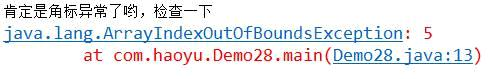
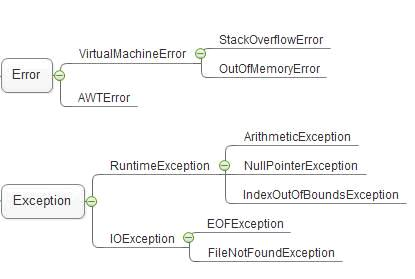
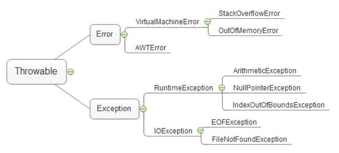

异常基础及处理

<!-- more -->

## 异常定义

异常处理常见手段： try catch finally throws throw

### 步骤 1 : try catch

1、将可能抛出ArrayIndexOutOfBoundsException**数组角标越界异常**的代码放在try里

2、如果角标存在，就会顺序往下执行，并且不执行catch块中的代码

3、如果角标不存在，try 里的代码会立即终止，程序流程会运行到对应的catch块中

4、e.printStackTrace(); 会打印出方法的调用痕迹，这样就便于定位和分析到底哪里出了异常

```java
  try {
   int[] arrays= {1,2,3,4,5}; //【0】-【4】
   int n=5;
   //预感数组角标可能会有问题
   System.out.println(arrays[n]);//java.lang.ArrayIndexOutOfBoundsException: 5  数组角标超出最大值
   //出现问题的时候后面的代码无法执行
   System.out.println("hello");
  } catch (ArrayIndexOutOfBoundsException e) {
   System.out.println("肯定是角标异常了哟，检查一下");
   //代码执行轨迹
   e.printStackTrace();
  }
```



### 步骤 2 : 使用异常的父类进行catch  

ArrayIndexOutOfBoundsException是Exception的子类，使用Exception也可以catch住ArrayIndexOutOfBoundsException

```java
  try {
   int[] arrays= {1,2,3,4,5}; //【0】-【4】
   int n=5;
   //预感数组角标可能会有问题
   System.out.println(arrays[n]);//java.lang.ArrayIndexOutOfBoundsException: 5  数组角标超出最大值
   //出现问题的时候后面的代码无法执行
   System.out.println("hello");
  } catch (Exception e) {
   System.out.println("肯定是角标异常了哟，检查一下");
   //代码执行轨迹
   e.printStackTrace();
  }

```

### 步骤 3 : 多异常捕捉办法1

需求，出现了算术异常，又可能出现数组下标越界，我们希望出现哪个就打印哪个的问题，这里需要多异常捕获

```java
  try {
   int a=1/1;//java.lang.ArithmeticException: / by zero  零不能当除数
   System.out.println(a);
  
   int[] arrays= {1,2,3,4,5}; //【0】-【4】
   int n=5;
   //预感数组角标可能会有问题
   System.out.println(arrays[n]);//java.lang.ArrayIndexOutOfBoundsException: 5  数组角标超出最大值
   //出现问题的时候后面的代码无法执行
   System.out.println("hello");
   //连续捕获
  } catch(ArithmeticException e1) {
   
   System.out.println("除数不可以为0");
   e1.printStackTrace();//打印一下代码运行轨迹
   
  }catch (ArrayIndexOutOfBoundsException e2) {//向上转型  Exception e=new java.lang.ArrayIndexOutOfBoundsException();
   System.out.println("肯定是角标异常了哟，检查一下");
   //代码执行轨迹
   e2.printStackTrace();
  }

```

### 步骤 4 : 多异常捕捉办法2  

Jdk7之后出现了一种新的连续捕获方法，方便的是可以一次捕获完，不方便的是需要多次处理

```java
  try {
   int a=1/1;//java.lang.ArithmeticException: / by zero  零不能当除数
   System.out.println(a);
  
   int[] arrays= {1,2,3,4,5}; //【0】-【4】
   int n=5;
   //预感数组角标可能会有问题
   System.out.println(arrays[n]);//java.lang.ArrayIndexOutOfBoundsException: 5  数组角标超出最大值
   //出现问题的时候后面的代码无法执行
   System.out.println("hello");
   //连续捕获
  } catch(ArithmeticException | ArrayIndexOutOfBoundsException e) {//向上转型  Exception e=new java.lang.ArrayIndexOutOfBoundsException();
   if(e instanceof ArithmeticException) {
    System.out.println("除数不能为零");
   }else if(e instanceof ArrayIndexOutOfBoundsException) {
    System.out.println("肯定是角标异常了哟，检查一下");
   }
   //代码执行轨迹
   e.printStackTrace();
  }

```

### 步骤 5 : finally  

无论是否出现异常，finally中的代码都会被执行

> finally {//最终执行
>
> ​    System.out.println("出问题了哈？该背时");
>
> }

### 步骤 6 : throws  

考虑如下情况：
 主方法调用method1
 method1调用method2
 method2中访问数组，可能会越界

 method2中需要进行异常处理
 但是method2**不打算处理**，而是把这个异常通过**throws**抛出去
 那么method1就会**接到该异常**。 处理办法也是两种，要么是try catch处理掉，要么也是**抛出去**。
 method1选择本地try catch住 一旦try catch住了，就相当于把这个异常消化掉了，主方法在调用method1的时候，就不需要进行异常处理了

```java
public class Demo28 {

 public static void main(String[] args) {
  method1();
 }
 public static void method1() {
//  method2(4);
  //method1针对method3有可能会出现的ArrayIndexOutOfBoundsException的问题，使用try-catch语句预防一下
  try {
   method3(4);
  }catch(ArrayIndexOutOfBoundsException e) {
   System.out.println("啊啊啊啊啊啊-角标越界");
   e.printStackTrace();
   method3(2);
  }
 }
 //throws 抛出
 //不想自己解决,一旦出现问题，让调用者自己来解决
 //throws声明异常（问题），意味着：有可能会出现问题，但不一定会出现问题，一旦出现问题，抛给调用者去解决
 public static void method3(int n)throws ArrayIndexOutOfBoundsException {
  int[] a= {1,2,6};//0 1 [2]
  System.out.println(a[n]);
 }
 
 //当一段代码出现问题，两种思路解决，第一种就地解决
 public static void method2(int n) {
  try {
   int[] a= {1,2,6};
   System.out.println(a[n]);
  } catch (ArrayIndexOutOfBoundsException e) {
   System.out.println("角标越界");
   method2(2);
  }
 }
 
}

```

### 步骤 7 : throw和throws的区别

throws与throw这两个关键字接近，不过意义不一样，有如下区别：

1. throws 出现在方法声明上，而throw通常都出现在方法体内。

2. throws 表示出现异常的一种可能性，并不一定会发生这些异常；throw则是抛出了异常，执行throw则一定抛出了某个异常对象。

### 最佳实践1

```java
public class Demo28 {

 public static void main(String[] args) {
  try {
   method1();
  } catch (Exception e) {
   method3(2);
  }
 }
 public static void method1()throws ArrayIndexOutOfBoundsException {
//  method2(4);
  //method1针对method3有可能会出现的ArrayIndexOutOfBoundsException的问题，使用try-catch语句预防一下
  try {
   method3(4);
  }catch(ArrayIndexOutOfBoundsException e) {
   System.out.println("啊啊啊啊啊啊-角标越界");
   e.printStackTrace();
   //这里做一个基本处理后交给下一个处理
   throw new ArrayIndexOutOfBoundsException("数组角标越界"); 
  }
 }
 //throws 抛出
 //不想自己解决,一旦出现问题，让调用者自己来解决
 //throws声明异常（问题），意味着：有可能会出现问题，但不一定会出现问题，一旦出现问题，抛给调用者去解决
 public static void method3(int n)throws ArrayIndexOutOfBoundsException {
  int[] a= {1,2,6};//0 1 [2]
  System.out.println(a[n]);
 }
 
 //当一段代码出现问题，两种思路解决，第一种就地解决
 public static void method2(int n) {
  try {
   int[] a= {1,2,6};
   System.out.println(a[n]);
  } catch (ArrayIndexOutOfBoundsException e) {
   System.out.println("角标越界");
   method2(2);
  }
 }
 
}


```

### 最佳实践2

```java
package com.haoyu;

public class Demo29 {

 public static void main(String[] args) {
  //开心到死
  thirdHappyEnding();
 }
 //3,养老院
 public static void thirdHappyEnding() {
  try {
   secondRescue();
  } catch (Exception e) {
   System.out.println("房已开好，等你哟");
  }
 }
 
 //2,做手术
 public static void secondRescue()throws HappyLifeException{
  //看一下包扎之后需不需要做手术，如果接收到一个做手术的问题，就开始做手术
  try {
   firstRescue();
  } catch (OperateException e) {
   System.out.println("手术已经做完");
   throw new HappyLifeException("可以养老了");
  }
 }
 
 //1，战场基本消毒和包扎
 public static void firstRescue()throws OperateException {
  //打仗过程有可能会出问题，临时抢救一下
  try {
   ware();
  }catch(ChangziZhaChuanException e) {
   System.out.println("包扎和消毒");
   //挂号做手术--跟手术相关的问题
   throw new OperateException("修复手术可以做了哟");
  }
 }
 //打仗,打仗过程一不小心肠子被炸穿，向上抛出一个被炸穿的异常（问题）（求救信号）
 //打仗之前就必须建立起医疗的通讯机制
 public static void ware() throws ChangziZhaChuanException{
  throw new ChangziZhaChuanException("炸得连渣都不剩");
 }
 
}
//需求：打仗
//负伤
//1，战场基本消毒和包扎
//2，运输回后方，医生做手术
//3，送回养老院，孤独终老
//我们自定义一个异常，继承了运行时出问题的异常类，描述上述问题
//肠子被炸穿异常
class ChangziZhaChuanException extends RuntimeException{
 private String name;
 public ChangziZhaChuanException(String name) {
  super(name);
  this.name = name;
 }
} 
//做手术的问题--挂号
class OperateException extends RuntimeException{
 private String name;
 public OperateException(String name) {
  super(name);
  this.name = name;
 }
} 
//送往养老院，开开心心地去死
class HappyLifeException extends RuntimeException{
 private String name;
 public HappyLifeException(String name) {
  super(name);
  this.name = name;
 }
}

```

### 最佳实践3

参照exception包中的电脑案例 如何把异常都处理完？

## 异常分类

异常分类： 可查异常，运行时异常和错误3种。
其中，运行时异常和错误又叫非可查异常。



### 步骤1 : 可查异常  

可查异常： CheckedException
可查异常即**必须进行处理的异常**，要么try catch住,要么往外抛，谁调用，谁处理，比如 FileNotFoundException如果不处理，编译器，就不让你通过。

### 步骤2：运行时异常

运行时异常RuntimeException指： **不是必须进行****try catch****的异常**
 **常见运行时异常****:**
 除数不能为0异常:ArithmeticException
 下标越界异常:ArrayIndexOutOfBoundsException
 空指针异常:NullPointerException
 在编写代码的时候，依然可以使用try catch throws进行处理，与可查异常不同之处在于，**即便不进行****try catch****，也不会有编译错误**
 Java之所以会设计运行时异常的原因之一，是因为下标越界，空指针这些运行时异常**太过于普遍**，如果都需要进行捕捉，代码的可读性就会变得很糟糕。

### 步骤3：错误

错误Error，指的是**系统级别的异常**，通常是内存用光了
 在**默认设置下**，一般java程序启动的时候，最大可以使用16m的内存
 如例不停的给StringBuffer追加字符，很快就把内存使用光了。抛出**OutOfMemoryError**
 与运行时异常一样，错误也是不要求强制捕捉的

## Throwable

Throwable是类，Exception和Error都继承了该类
 所以在捕捉的时候，也可以使用Throwable进行捕捉
 如图： 异常分**Error**和**Exception**
 Exception里又分**运行时异常**和**可查异常**



```java
import java.io.File;
import java.io.FileInputStream;
 
public class TestException {
 
    public static void main(String[] args) {
 
        File f = new File("d:/LOL.exe");
 
        try {
            new FileInputStream(f);
            //使用Throwable进行异常捕捉
        } catch (Throwable t) {
            // TODO Auto-generated catch block
            t.printStackTrace();
        }
 
    }
}
```

## 自定义异常

实现 throwable 或者继承运行时异常类

try语句在返回前，将其他所有的操作执行完，保留好要返回的值，而后转入执行finally中的语句，而后分为以下三种情况：

**情况一**：如果finally中有return语句，则会将try中的return语句”覆盖“掉，直接执行finally中的return语句，得到返回值，这样便无法得到try之前保留好的返回值。

**情况二**：如果finally中没有return语句，也没有改变要返回值，则执行完finally中的语句后，会接着执行try中的return语句，返回之前保留的值。

**情况三**：如果finally中没有return语句，但是改变了要返回的值，这里有点类似与引用传递和值传递的区别，分以下两种情况：

> 1）如果return的数据是基本数据类型或文本字符串，则在finally中对该基本数据的改变不起作用，try中的return语句依然会返回进入finally块之前保留的值。
>
> 2）如果return的数据是引用数据类型，而在finally中对该引用数据类型的属性值的改变起作用，try中的return语句返回的就是在finally中改变后的该属性的值。
