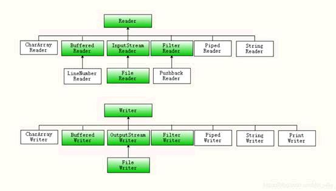

IO流、字符流、转换流、缓冲流、常见编码问题、数据流及对象流。

<!-- more -->


# 分类

1、字节类，


2、字符类



java输入/输出流体系中常用的流的分类表

|    分类    | 字节输入流               | 字节输出流                | 字符输入流          | 字符输出流          |
| :--------: | ------------------------ | ------------------------- | ------------------- | ------------------- |
|  抽象基类  | InputStream              | OutputStream              | Reader              | Writer              |
|  访问文件  | **FileInputStream**      | **FileOutputStream**      | **FileReader**      | **FileWriter**      |
|  访问数组  | **ByteArrayInputStream** | **ByteArrayOutputStream** | **CharArrayReader** | **CharArrayWriter** |
|  访问管道  | **PipedInputStream**     | **PipedOutputStream**     | **PipedReader**     | **PipedWriter**     |
| 访问字符串 |                          |                           | **StringReader**    | **StringWriter**    |
|   缓冲流   | BufferedInputStream      | BufferedOutputStream      | BufferedReader      | BufferedWriter      |
|   转换流   |                          |                           | InputStreamReader   | OutputStreamWriter  |
|   对象流   | ObjectInputStream        | ObjectOutputStream        |                     |                     |
|  抽象基类  | FilterInputStream        | FilterOutputStream        | FilterReader        | FilterWriter        |
|   打印流   |                          | PrintStream               |                     | PrintWriter         |
| 推回输入流 | PushbackInputStream      |                           | PushbackReader      |                     |
|   特殊流   | DataInputStream          | DataOutputStream          |                     |                     |

# Io流

## 什么是流

当不同的介质之间有数据交互的时候，JAVA就使用流来实现。
 数据源可以是文件，还可以是数据库，网络甚至是其他的程序

 比如读取文件的数据到程序中，站在程序的角度来看，就叫做输入流
 输入流： InputStream
 输出流：OutputStream


## 文件输入流

如下代码，就建立了一个文件输入流，这个流可以用来把数据从硬盘的文件，读取到JVM(内存)

 目前代码只是建立了流，还没有开始读取

## 文件输出流

参考文件输入流的建立，建立一个文件输出流


## Ascll码概念

所有的数据存放在计算机中都是以数字的形式存放的。 所以**字母就需要转换为数字才能够存放**
 比如A就对应的数字65，a对应的数字97. 不同的字母和符号对应不同的数字，就是一张码表。
 ASCII是这样的一种码表。 只**包含简单的英文字母**，符号，数字等等。 **不包含中文，德文，俄语等复杂**的。

 示例中列出了可见的ASCII码以及对应的十进制和十六进制数字，不可见的暂未列出

## 以字节流的形式读取文件

InputStream是字节输入流，同时也是抽象类，只提供方法声明，不提供方法的具体实现。
 FileInputStream 是InputStream子类，以FileInputStream 为例进行文件读取

## 以字节流的形式向文件写数据

OutputStream是字节输出流，同时也是抽象类，只提供方法声明，不提供方法的具体实现。
 FileOutputStream 是OutputStream子类，以FileOutputStream 为例向文件写出数据

 注: 如果文件d:/lol2.txt不存在，写出操作会自动创建该文件。
 但是如果是文件 d:/xyz/lol2.txt，而目录xyz又不存在，会抛出异常

# 字符流

Reader字符输入流
 Writer字符输出流
 专门用于字符的形式读取和写入数据

## 字符流读取文件

FileReader 是Reader子类，以FileReader 为例进行文件读取

```java
public static void main(String[] args) {
    //准备文件lol.txt其中的内容是AB
    File f = new File("d:/lol.txt");
    //创建基于文件的Reader
    try (FileReader fr = new FileReader(f)) {
        //创建字符数组，其长度就是文件的长度
        char[] all = new char[(int) f.length()];
        //以字符流的形式读取文件所有内容
        fr.read(all);
        for (char b : all) {
            //打印出来是A B
            System.out.println(b);
        }
    } catch (IOException e) {
        e.printStackTrace();
    }
}
```

## 字符流写入到文件

```java
private static void demo2() {
    // 准备文件lol2.txt
    File f = new File("d:/lol2.txt");
    // 创建基于文件的Writer
    try (FileWriter fr = new FileWriter(f)) {
        // 以字符流的形式把数据写入到文件中
        String data = "abcdefg1234567890";
        char[] cs = data.toCharArray();
        fr.write(cs);
    } catch (IOException e) {
        e.printStackTrace();
    }
}
```

# 转换流

# 缓冲流

以介质是硬盘为例，**字节流和字符流的弊端**：
 在每一次读写的时候，都会访问硬盘。 如果读写的频率比较高的时候，其性能表现不佳。

 为了解决以上弊端，采用缓存流。
 缓存流在读取的时候，**会一次性读较多的数据到缓存中**，以后每一次的读取，都是在缓存中访问，直到缓存中的数据读取完毕，再到硬盘中读取。

 就好比吃饭，**不用缓存就是每吃一口都到锅里去铲**。**用缓存就是先把饭盛到碗里**，碗里的吃完了，再到锅里去铲

 缓存流在写入数据的时候，会先把数据写入到缓存区，直到缓存区**达到一定的量**，才把这些数据，**一起写入到硬盘中去**。按照这种操作模式，就不会像字节流，字符流那样**每写一个字节都访问硬盘**，从而减少了IO操作

## 使用缓存流读数据

## 使用缓存流写数据

```text
public class PrintWriter

· extends Writer

Prints formatted representations of objects to a text-output stream. This class implements all of the print methods found in PrintStream. It does not contain methods for writing raw bytes, for which a program should use unencoded byte streams.

Unlike the PrintStreamclass, if automatic flushing is enabled it will be done only when one of the println, printf, or format methods is invoked, rather than whenever a newline character happens to be output. These methods use the platform's own notion of line separator rather than the newline character.

Methods in this class never throw I/O exceptions, although some of its constructors may. The client may inquire as to whether any errors have occurred by invoking checkError().
```


可以使用除开byte相关的print方法，实践案例是生成模板

```java
private static void demo3() {
        File source = new File("src\\com\\classtemplate");
        String className = null;
        String filedType = null;
        String filedName = null;
        String methodName = null;      //接收控制台的输入
        BufferedReader systemin = new BufferedReader(new InputStreamReader(System.in));
        try {
            System.out.println("请输入类名：");
            className = systemin.readLine();
            System.out.println("请输入成员类型：");
            filedType = systemin.readLine();
            System.out.println("请输入成员名称：");
            filedName = systemin.readLine();
            System.out.println("请输入方法名称：");
            methodName = systemin.readLine();
            systemin.close();
            BufferedReader br = new BufferedReader(new FileReader(source));      //String
            filedName = className.toUpperCase().charAt(0) + className.substring(1, className.length());
            String fileName = className;    //需要让printwriter具备缓冲功能--调高解析性能
            PrintWriter pw = new PrintWriter(//pw有很多打印方法
                    new BufferedWriter(//pw里面实现了缓冲功能，提高了解析效率
                            new FileWriter("src\\com\\" + fileName + ".java")), true);//真正实现输出文本的功能由filewriter实现
            // 2， br。readline-->pw.print()
            String line = null;
            String temp = "";
            while ((line = br.readLine()) != null) {
//         print--format（@xxx）
                if (line.contains("@ClassName")) {
                    temp += line.replaceAll("@ClassName", className);
                    //打印并换行 这里自动地flush一下，flush：把瓢瓢里面的数据取出来，写入目标中
                    pw.println(temp);
                } else if (line.contains("@Filed")) {
//         @FiledArea  @FiledType @FiledName
                    temp += line.replace("@FiledArea", "private").replace("@FiledType", filedType).replace("@FiledName", filedName);
                    pw.println(temp);
                } else if (line.contains("@package")) {
                    temp += line.replace("@package", "com");
                    pw.println(temp);
                } else if (line.contains("@Method")) {
//                @MethodArea @MethodType @MethodName(@MethodParamType@MethodParamName)
                    temp += line.replace("@MethodArea", "public").replace("@MethodType", "void")
                            .replace("@MethodName", methodName).replace("@MethodParamType", "")
                            .replace("@MethodParamName", "");
                    pw.println(temp);
                } else {
                    temp += line;
                    pw.println(temp);
                }
                temp = "";
            }
            //3，br pw  close
            pw.close();
            br.close();
        } catch (IOException e) {
            e.printStackTrace();
        }
    }
```

# 编码问题

步骤 1 : 编码概念  

步骤 2 : 常见编码  

步骤 3 : UNICODE和UTF  

步骤 4 : Java采用的是Unicode  

步骤 5 : 一个汉字使用不同编码方式的表现  

步骤 6 : 文件的编码方式-记事本  

步骤 7 : 文件的编码方式-eclipse  

步骤 8 : 用FileInputStream 字节流正确读取中文  

步骤 9 : 用FileReader 字符流正确读取中文


总结：保证文件的编码（存储的时候存储的文件编码格式）与编码化的文字，与取出来的编码，与展现的编码，要保证一致

最简单总结：凡是出现charset的地方，全部utf-8

## 步骤 1 : 编码概念

计算机存放数据只能存放数字，所有的字符都会被转换为不同的数字。
 就像一个棋盘一样，不同的字，处于不同的位置，而不同的位置，有不同的数字编号。
 有的棋盘很小，只能放数字和英文
 有的大一点，还能放中文
 有的“足够”大，能够放下世界人民所使用的所有文字和符号

 如图所示，英文字符 **A** 能够放在所有的棋盘里，而且位置都差不多
 中文字符, 中文字符 **中** 能够放在后两种棋盘里，并且位置不一样，而且在小的那个棋盘里，就放不下中文


## 步骤 2 : 常见编码  

工作后经常接触的编码方式有如下几种：
 **ISO-8859-1 ASCII** 数字和西欧字母
 **GBK GB2312 BIG5** 中文
 **UNICODE** (统一码，万国码)

 其中
 ISO-8859-1 包含 ASCII
 GB2312 是简体中文，BIG5是繁体中文，GBK同时包含简体和繁体以及日文。
 UNICODE 包括了所有的文字，无论中文，英文，藏文，法文，世界所有的文字都包含其中

## 步骤 3 : UNICODE和UTF  

不同的编码方式对应不同的**棋盘**，而UNICODE因为要存放所有的数据，那么它的棋盘是最大的。
 不仅如此，棋盘里每个数字都是很长的(4个字节)，因为不仅要表示字母，还要表示汉字等。

 如果完全按照UNICODE的方式来存储数据，就会有很大的浪费。
 比如在ISO-8859-1中，**a** 字符对应的数字是0x61
 而UNICODE中对应的数字是 0x00000061，倘若一篇文章大部分都是英文字母，那么按照UNICODE的方式进行数据保存就会消耗很多空间

 在这种情况下，就出现了UNICODE的各种**减肥**子编码, 比如UTF-8对数字和字母就使用一个字节，而对汉字就使用3个字节，从而达到了**减肥还能保证健康**的效果

 UTF-8，UTF-16和UTF-32 针对不同类型的数据有不同的**减肥效果**，一般说来UTF-8是比较常用的方式

 UTF-8，UTF-16和UTF-32 彼此的区别在此不作赘述，有兴趣的可以参考unicode码

Unicode（统一码、万国码、单一码）是计算机科学领域里的一项业界标准，包括字符集、编码方案等。Unicode 是为了解决传统的字符编码方案的局限而产生的，它为每种语言中的每个字符设定了统一并且唯一的二进制编码，以满足跨语言、跨平台进行文本转换、处理的要求。1990年开始研发，1994年正式公布


## 步骤 4 : Java采用的是Unicode  

写在.java源代码中的汉字，在执行之后，都会变成JVM中的字符。
 而这些中文字符采用的编码方式，都是使用UNICODE. "中"字对应的UNICODE是**4E2D**,所以在内存中，实际保存的数据就是十六进制的0x4E2D, 也就是十进制的20013

## 步骤 5 : 一个汉字使用不同编码方式的表现  

## 以字符 中 为例，查看其在不同编码方式下的值是多少  也即在不同的棋盘上的位置

```java
public static void main(String[] args) {
    String str = "中";
    showCode(str);
}

private static void showCode(String str) {
    String[] encodes = {"BIG5", "GBK", "GB2312", "UTF-8", "UTF-16", "UTF-32"};
    for (String encode : encodes) {
        showCode(str, encode);
    }
}

private static void showCode(String str, String encode) {
    try {
        System.out.printf("字符: \"%s\" 的在编码方式%s下的十六进制值是%n", str, encode);
        byte[] bs = str.getBytes(encode);
        for (byte b : bs) {
            int i = b & 0xff;
            System.out.print(Integer.toHexString(i) + "\t");
        }
        System.out.println();
        System.out.println();
    } catch (UnsupportedEncodingException e) {
        System.out.printf("UnsupportedEncodingException:  %s编码方式无法解析字符%s\n", encode, str);
    }
}
```

## 步骤 6 : 文件的编码方式-记事本  

接下来讲，字符在文件中的保存
 字符保存在文件中肯定也是以数字形式保存的，即对应在不同的**棋盘**上的不同的数字
 用**记事本**打开任意文本文件，并且**另存为**，就能够在编码这里看到一个下拉。
 **ANSI** 这个不是ASCII的意思，而是采用本地编码的意思。如果你是中文的操作系统，就会使GBK，如果是英文的就会是ISO-8859-1
 **Unicode UNICODE原生的编码方式
 **Unicode big endian**另一个 UNICODE编码方式
 **UTF-8** 最常见的UTF-8编码方式，数字和字母用一个字节， 汉字用3个字节


## 步骤 7 : 文件的编码方式-eclipse  

eclipse也有类似的编码方式，右键任意文本文件，点击最下面的"property"
 就可以看到**Text file encoding**
 也有ISO-8859-1，GBK,UTF-8等等选项。
 其他的US-ASCII,UTF-16，UTF-16BE,UTF-16LE不常用


## 步骤 8 : 用FileInputStream 字节流正确读取中文  

为了能够正确的读取中文内容
 \1. 必须了解文本是以哪种编码方式保存字符的
 \2. 使用字节流读取了文本后，再使用对应的**编码方式去识别这些数字**，得到正确的字符
 如本例，一个文件中的内容是字符**中**，编码方式是GBK，那么读出来的数据一定是D6D0。
 再使用GBK编码方式识别D6D0，就能正确的得到字符**中**

 **注：** 在GBK的棋盘上找到的**中**字后，JVM会自动找到**中**在UNICODE这个棋盘上对应的数字

```java
public static void main(String[] args) {
    File f = new File("E:\\project\\j2se\\src\\test.txt");
    try (FileInputStream fis = new FileInputStream(f);) {
        byte[] all = new byte[(int) f.length()];
        fis.read(all);
        System.out.println("文件中读出来的数据是：");
        for (byte b : all) {
            //只取16进制的后两位
            int i = b & 0x000000ff;
            System.out.println(Integer.toHexString(i));
        }
        System.out.println("把这个数字，放在GBK的棋盘上去：");
        String str = new String(all, "GBK");
        System.out.println(str);
    } catch (IOException e) {
        e.printStackTrace();
    }
} 
```

## 步骤 9 : 用FileReader 字符流正确读取中文

FileReader得到的是字符，所以一定是已经把字节**根据某种编码识别成了字符**了
 而FileReader使用的编码方式是Charset.defaultCharset()的返回值，如果是中文的操作系统，就是GBK
 FileReader是不能手动设置编码方式的，为了使用其他的编码方式，只能使用InputStreamReader来代替，像这样：

new InputStreamReader(new FileInputStream(f),Charset.forName("UTF-8"));

 在本例中，用记事本另存为UTF-8格式，然后用UTF-8就能识别对应的中文了。

 **解释：** 为什么中字前面有一个?
 如果是使用记事本另存为UTF-8的格式，那么在第一个字节有一个**标示符**，叫做BOM用来标志这个文件是用UTF-8来编码的

```java
private static void demo5() {
    File f = new File("E:\\project\\j2se\\src\\test.txt");
    System.out.println("默认编码方式:" + Charset.defaultCharset());
    //FileReader得到的是字符，所以一定是已经把字节根据某种编码识别成了字符了      
    // 而FileReader使用的编码方式是Charset.defaultCharset()的返回值，如果是中文的操作系统，就是GBK  
    try (FileReader fr = new FileReader(f)) {
        char[] cs = new char[(int) f.length()];
        fr.read(cs);
        System.out.printf("FileReader会使用默认的编码方式%s,识别出来的字符是：%n", Charset.defaultCharset());
        System.out.println(new String(cs));
    } catch (IOException e) {
        e.printStackTrace();
    }
    // FileReader是不能手动设置编码方式的，为了使用其他的编码方式，只能使用InputStreamReader来代替      
    // 并且使用new  InputStreamReader(new FileInputStream(f),Charset.forName("UTF-8"));  这样的形式    
    try (InputStreamReader isr = new InputStreamReader(new FileInputStream(f), Charset.forName("UTF-8"))) {
        char[] cs = new char[(int) f.length()];
        isr.read(cs);
        System.out.printf("InputStreamReader  指定编码方式UTF-8,识别出来的字符是：%n");
        System.out.println(new String(cs));
    } catch (IOException e) {
        e.printStackTrace();
    }
}
```

# 数据流

DataInputStream 数据输入流
DataOutputStream 数据输出流

## 直接进行字符串的读写

使用数据流的writeUTF()和readUTF() 可以进行数据的**格式化顺序读写**
 如本例，通过DataOutputStream 向文件顺序写出 布尔值，整数和字符串。 然后再通过DataInputStream 顺序读入这些数据。

 **注：** 要用DataInputStream 读取一个文件，这个文件必须是由DataOutputStream 写出的，否则会出现EOFException，因为DataOutputStream 在写出的时候会做一些特殊标记，只有DataInputStream 才能成功的读取

```java
private static void read() {
    File f = new File("d:/lol.txt");
    try (FileInputStream fis = new FileInputStream(f); DataInputStream dis = new DataInputStream(fis);) {
        boolean b = dis.readBoolean();
        int i = dis.readInt();
        String str = dis.readUTF();
        System.out.println("读取到布尔值:" + b);
        System.out.println("读取到整数:" + i);
        System.out.println("读取到字符串:" + str);
    } catch (IOException e) {
        e.printStackTrace();
    }
}

private static void write() {
    File f = new File("d:/lol.txt");
    try (FileOutputStream fos = new FileOutputStream(f); DataOutputStream dos = new DataOutputStream(fos);) {
        dos.writeBoolean(true);
        dos.writeInt(300);
        dos.writeUTF("123  this is gareen");
    } catch (IOException e) {
        e.printStackTrace();
    }
}
```

# 对象流

对象流指的是可以直接**把一个对象以流的形式**传输给其他的介质，比如硬盘

 一个对象以流的形式进行传输，叫做序列化。 该对象所对应的类，必须是实现Serializable接口

## 序列化一个对象

创建一个Hero对象，设置其名称为garen。
 把该对象序列化到一个文件garen.lol。
 然后再通过序列化把该文件转换为一个Hero对象

 **注：**把一个对象序列化有一个前提是：这个对象的类，必须实现了Serializable接口

```java
private static void demo6() {
    //创建一个Hero garen
    // 要把Hero对象直接保存在文件上，务必让Hero类实现Serializable接口
    Hero h = new Hero();
    h.name = "garen";
    h.hp = 616;
    // 准备一个文件用于保存该对象
    File f = new File("d:/garen.lol");
    try (
            // 创建对象输出流
            FileOutputStream fos = new FileOutputStream(f);
            ObjectOutputStream oos = new ObjectOutputStream(fos);
            // 创建对象输入流
            FileInputStream fis = new FileInputStream(f);
            ObjectInputStream ois = new ObjectInputStream(fis);
    ) {
        oos.writeObject(h);
        Hero h2 = (Hero) ois.readObject();
        System.out.println(h2.name);
        System.out.println(h2.hp);
    } catch (IOException | ClassNotFoundException e) {
        e.printStackTrace();
    }
}
```

```java
class Hero implements Serializable{
    private static final long serialVersionUID = 1L;
    public String name;
    public int hp;
}
```
