OOP核心：对象变量、方法函数、This与static、类、继承、接口、抽象、final及类图等。

<!-- more -->

## 写代码的终极思路

1，场景化需求分析

2，准确逻辑化需求分析

3，寻找解决模型——设计模式

4，编写调试，重复1-4

5，功能测试和性能测试

## 代码学习方法

1，     整体认知：要知道效果

2，     跟着源代码敲一遍，解决报错问题（百度定性，定范围|帮助文档查查查）

3，     一行一行地分析代码，在看代码的同时，需要理解里面出现的所有你现在还不能理解的东西，理解过程（百度定性，定范围——5篇博客之内|帮助文档查查查），必须加入你自己的骚操作，摆弄摆弄确保自己懂了这个道理——（首先达标源代码的代码水平，加入自己的尝试）

4，     不要去管有多少还有学，有多少已经学了，有时间，就做研究——无我地进行

## OOP 核心上（Object-Oriented Programming）

1，对象变量——引用

2，方法定义，方法传参，方法重载，构造函数（初始化）

3，this，static

4，访问修饰符与包的隔离（public ,private ,protected,default）

5，成员变量，成员方法

6，枚举类型

### 对象变量——引用

```java
public class Demo01 {
 //需求：大家都有女朋友，但是生活上有这样的几种情况
 //女朋友外号——baby  honey=new GF();
 //女朋友的男朋友  BF a=new BF(1);
      //a=new BF(2);
 
 //多个变量一个对象，多个对象与一个变量
 public static void main(String[] args) {
  BF  baby=new BF();//堆空间中唯一开辟的BF空间
  BF  honey=baby;
  
  GF  老婆=new GF();//路人甲  gc  坏叔叔收割new GF()  
      老婆=new GF();//只有出现一次new ，意味着堆空间中开辟了一个空间
      老婆=new GF();
      老婆=new GF();
      老婆=new GF();
      老婆=new GF();
 }
}
//女朋友
class GF{
 
}
//男朋友
class BF{
 
}

```

#### 引用与指向——对象变量与堆空间开辟的独立对象空间

new GirlFriend();

代表整出一个模型生产出来的对象。

意味着在堆空间中开辟了独立的运行（内存）空间，没有办法在方法中找到这个独立空间的起始地址。

为了访问到他，我们需要给一个名字变量（引用-把目标引过来用他，指针）

GirlFriend gf= new GirlFriend();

Gf就是GirlFriend的一个对象，引用，指向堆中空间

=  等号就是指向，代表这个堆中对象的起始地址

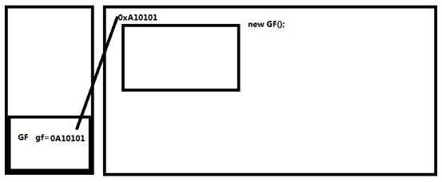

一个对象模型

 **class** GirlFriend{}

稍微有点结构的模型

```java
class GirlFriend{
 String name;
 String height;
 char sex;
 
 void drink() {
  
 }
 void eat() {
  
 }
 void bit() {
  
 }
}

```

总结：无论是简单还是复杂结构的模型，都称为一个类

#### 多个引用，一个对象

 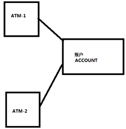

堆空间中的一个开辟空间，可以被多个引用指

 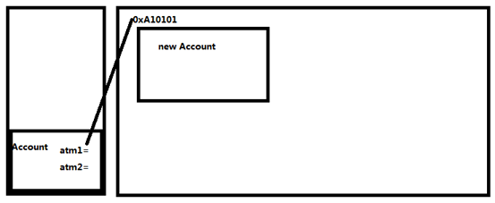

通俗解释：

在多个ATM机上取钱，实际上是操作的同一个账户，atm机就等于不同的引用，而那个被共同指向的账户就等于account对象

#### 一个引用多个对象

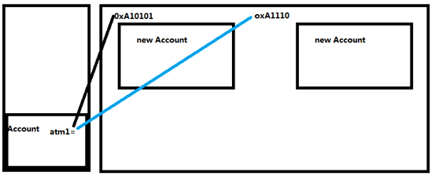

```java
Account atm1=new Account();
  atm1=new Account();//前面那个空间没有了指向，//成为了无名之地
 }
}
class Account{
}

```

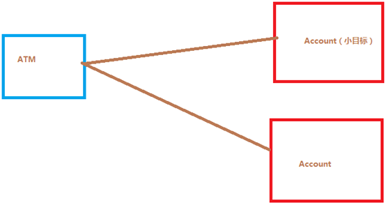

#### 练习题

请大家创建两个案例，分别体现多个引用一个对象和一个引用多个对象

### 方法定义，方法重载，构造函数

方法-method：一个模型的功能，一个对象的行为，一个function（函数）

#### 方法定义

##### 返回值

1，   无返回值 void——函数内部从上到下执行逻辑

2，   有返回值

```java
//返回基本类型
int getAge() {
  return 18;
 }
 boolean isPerson() {
  return false;
 }
//造人方法-返回对象类型
 Person create(Person p){
  return new Person();//返回一个新person
 }
```

a)  返回基本数据类型

b)  返回对象类型

##### 方法传参

###### 基本类型传参

```java

 public static void main(String[] args) {

  int age=10;
  m4(age);
  System.out.println(age);
  
 }
 //研究传入的基本类型变量的特性
 static void m4(int age) {//对于基本类型来说，传入的变量会被copy-复制  一份
  age+=10;
  System.out.println(age);
 }
 
 //传任意基本类型的参数变量 和 任意的传入顺序
 void m3(boolean isPerson,int age,float account) {
  
 }
 //传任意基本类型的参数变量
 void m2(int age,boolean isPerson,float account) {
  
 }
 //传基本数据类型
 void m1(int age){
  
 }
 //无参数
 void m() {
  
 }
```

> 对于方法传参，如果是基本类型参数，会copy一份，在函数内部是对copy后的那一份进行的相关操作，这些操作不影响传入之前参数那个本值

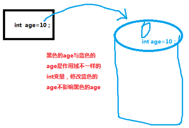

###### 对象类型传参

对象类型 传参的基本细节跟基本类型传参的细节相同，对于参数copy来说有一些变化

```java
class BoyF{
 int age=18;
}
public class Demo03 {
 //跟男朋友gank了一下
 static void gank(BoyF bf) {
  bf.age=3;//很开心的样子。仿佛3岁一样
  
 }

 public static void main(String[] args) {
  
  BoyF bf=new BoyF();
  gank(bf);
  System.out.println(bf.age);//只要被男朋友gank了，永久性伤害

```

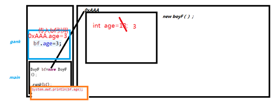

结论：方法传入的是类型变量，则传入的是堆中的对象空间首地址

###### 引申一下：数组对象作为方法参数传递对象

注意，对象数组和数组对象是有区别滴

对象数组：以对象为元素，创建一个多对象的数组结构容器

数组对象：把数组当做一个对象

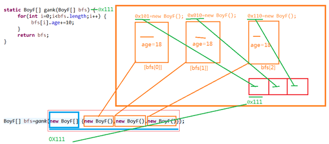

```java
 //gank了一队表哥
 static BoyF[] gank(BoyF[] bfs) {
  for(int i=0;i<bfs.length;i++) {
   bfs[i].age+=10;
  }
  return bfs;
 }

 public static void main(String[] args) {
  
//  BoyF bf=new BoyF();
//  gank(bf);
//  System.out.println(bf.age);//只要被男朋友gank了，永久性伤害
  BoyF[] bfs=gank(new BoyF[] {new BoyF(),new BoyF(),new BoyF()});
  for(BoyF boy:bfs) {
   System.out.println(boy.age);
  }

```

#### 方法重载

```java
 void drink(Milk milk) {
  System.out.println("牛奶");
 }
 void drink(int i) {//1
  System.out.println("咪一口");
 }
 //先ao一下，在咪一口，在吸一口牛奶，最后滋溜一下
 void drink(Ao ao,int i,Milk milk,Object obj) {
  System.out.println("吸一口酒");
 }
 //先ao一下，在咪一口，在吸一口牛奶，最后滋溜一下
 void drink() {
  drink(null);//
  drink(1);
  drink(null,1,null,null);
 }

```

函数重载：函数名相同，只要参数个数不同，参数顺序不同，则为不同的函数

##### 可变参数示例

```java
 void drink() {
  drink(1,1,1,1,1,1,1,2,1,1,1,1,1);//int[] a={1,1,1,1,1,1,1,2,1,1,1,1,1}
  drink(new int[] {1,2,3,4,5},5);
 }
 void drink(char a,int i) {
  
 }
 //可变参数
 void drink(int... i) {//与(int[] i)相似
  System.out.println("1");
 }
 void drink(int[] as,int a) {
  System.out.println("2");
 }
 void drink(int a,int b,int c) {
  
 }

```

可变参数实际上就是可以自定义传入函数参数的个数，会自动封装一个数组来接受例如：

> drink(1,1,1,1);==new int[]{1,1,1,1}

注意，可变参数不仅仅可以使用到基本数据类型，还可以用于对象类型

##### 练习题

设计一个英雄类（奶妈）（姓名，hp，提示一下自己被加血量），奶妈补奶方法——功能

奶妈的技能：

对一个英雄补奶——奶妈自己掉血——hp减少

大补——对一群英雄补奶——终极技能r

买一个救赎，装备指定地域补奶

增加一个技能，治疗群体补奶

天赋补奶——吸血天赋对自己补奶

备注：补奶等于加血 hp，对于所有的补奶（加血）方法有不同的hp的值被加

```java
package com.haoyu;

public class Demo05 {
 //模块化
 static Hero[] initHeros() {
  Hero gailun=new Hero("盖伦");
  Hero vn=new Hero("vn");
  Hero yasuo=new Hero("压缩");
  Hero[] heros= {gailun,vn,yasuo};
  return heros;
 }
 
 public static void main(String[] args) {
  
  new MilkMotherHero().hpAdd(0,0,100,100,initHeros());
  
  //我自己——奶妈
  //Hero naima=new MilkMotherHero();//多态
//  MilkMotherHero naima=new MilkMotherHero();
//  
//  //使用救赎
//  naima.hpAdd(0,0,100,100,heros);
  
 }
 
}

class Hero{
 int x=0;
 int y=0;
 
 Hero(){}
 Hero(String name){
  this.name=name;
 }
 String name;
 int hp;//0
 //加血提示方法
 void hpAddedHigh() {
  System.out.println("加血让我舒服。好嗨哟！"+this);
 }

 public String toString() {
  return "Hero [name=" + name + ", hp=" + hp + "]";
 }
 
}

class EquipMement{
 int hpp=1000;
 String name;
 //希望装备被new出来的同时，就给name赋值
 //像这样没有返回值，并且方法名称与类名   完全相同（所有字母内容相同，大小写相同）
 //称为构造方法——当一个对象在初始化的时候，首先调用的就是构造方法，用来做初始化操作
 EquipMement() {//如果这个不带参数的构造函数没有写在代码中，又没有其他的构造函数，系统会默认地生成一个无参数的构造函数
  
 }
 EquipMement(String name) {//如果出现了带参数的狗杂方法，但是又米有无参数的构造方法，默认只存在这个有参数的构造方法
        //原来那个无参数的构造方法失效
  //对于jiushu=new EquipMent()这个对象来说
  //this=jiushu;
  this.name=name;
 }
 
 //装备救赎的加血功能
 void hpAdd(int x,int y,int width,int height,Hero... heros) {
  for(int i=0;i<heros.length;i++) {
   heros[i].hp+=hpp;
   heros[i].hpAddedHigh();
  }
 }
}

//奶妈英雄  extends 继承 （继承遗产）
class MilkMotherHero extends Hero{
 int x=0;
 int y=0;
 
 String name="奶妈";
 int hp=100;
 int hpp=1;
 EquipMement[] ems= {new EquipMement("救赎")};//ems[0]=new EquipMement()
 //加血提示方法
 void hpAddedHigh() {
  System.out.println("加血让我舒服。好嗨哟！"+this);
 }
 //加血合集
 //单体加血
 void hpAdd(Hero hero) {
  //对方血曾加
  hero.hp+=hpp;
  hero.hpAddedHigh();
  //本身血减少
  hp-=hpp;
 }
 //群体加血
 void hpAdd(Hero[] heros) {
  for(int i=0;i<heros.length;i++) {
   heros[i].hp+=hpp;
   heros[i].hpAddedHigh();
  }
  //本身也要加血
  hp+=hpp;
  //自嗨
  this.hpAddedHigh();
 }
 //天赋加血
 void hpAdd() {
  hp+=hpp;
  this.hpAddedHigh();
 }
 //使用装备加血
 void hpAdd(int x,int y,int width,int height,Hero[] heros) {
  //检查一下是否有救赎装备
  if(ems!=null) {
   for(int i=0;i<ems.length;i++) {
    if(ems[i].name=="救赎") {
     //TODO 以后要注意，这里其实还有一个判断，就是这些英雄是否在这个区域
     
     Hero[] herosTemp=new Hero[heros.length+1];
     for(int index=0;index<herosTemp.length;index++) {
      if(index<heros.length) {
       herosTemp[index]=heros[index];
      }else {
       //奶妈对自己操作，把自己（我）this 加进去
       herosTemp[index]=this;
      }
     }
     //执行救赎方法
     ems[i].hpAdd(x,y,width,height,herosTemp);
    }
   }
  }
 }
 
 public String toString() {
  return "MilkMotherHero [name=" + name + ", hp=" + hp + "]";
 }
 
}

```

结构分析图：

 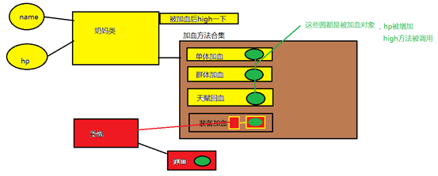

##### 内存分析TODO

#### 构造函数

步骤 1 : 什么是构造方法  

步骤 2 : 隐式的构造方法  

步骤 3 : 提供一个有参的构造方法  

步骤 4 : 构造方法的重载

步骤 **1** :

##### 什么是构造方法

> 方法名和类名一样（包括大小写）
>
> 没有返回类型
>
> 实例化一个对象的时候，必然调用构造方法

注释：

```java
public class Demo06 {

 public static void main(String[] args) {
  new Light();
 }
 
}
//灯泡  桌子  门  学生  教室  教师
class Light{
 //不管你写不写这个方法，自动生成一个跟类名相同的方法，默认有一个
 //这个特殊的方法就是构造方法
 //在创建一个模型对象的时候会被调用
 Light(){
  System.out.println("aaa");
 }
 //一般方法都有返回值，无返回值的声明
 void close() {
  
 }
 
 void open() {
  
 }
}

```

步骤 **2** :

##### 隐式的构造方法

Hero类的构造方法是

```java
public Hero(){ 

}
```

> 这个无参的构造方法，如果不写，就会默认提供一个

 步骤 **3** :

##### 提供一个有参的构造方法

一旦提供了一个有参的构造方法
 同时又**没有显式**的提供一个无参的构造方法
 那么默认的无参的构造方法，就“木有了“

 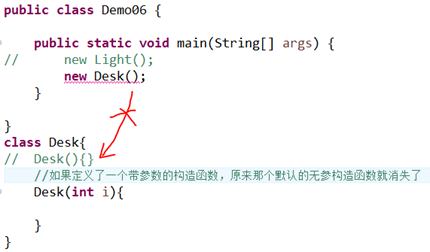

 步骤 **4** :

##### 构造方法的重载

 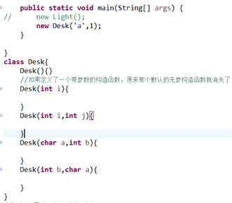

```java
public class Demo06 {
 public static void main(String[] args) {
  new ClassRoom(1);
  new ClassRoom("多功能厅");
  new ClassRoom(true);
  new ClassRoom(100,"里面有钢琴");
 }
}
//new 教室出来  
//console打印以下4句
//5-小教室  
//"多功能厅"-多工厅教室   
//true-真的是一个教室   
//100-“里面有钢琴”-音乐教室
class ClassRoom{
 public ClassRoom(int i) {
  System.out.println("小教室");
 }
 public ClassRoom(String name) {
  System.out.println(name);
 }
 public ClassRoom(boolean flag) {
  System.out.println("真的是一个教室 ");
 }
 public ClassRoom(int num,String name) {
  System.out.println("音乐教室");
 }
}

```

步骤 **5** :

##### 练习-构造方法

为装备类设计4个参数的构造方法
 这四个参数分别是 ，装备等级-int，装备合成的子装备-类，装备的价格-double，装备的功能-String

创建装备的时候以上4个属性可以打组合

打印定义时输入的内容

```java
//装备类
class Equipment{
 //
 private int level=1;
 final static private int defaultLevel=1;
 final static private double defaultPrice=50.0;
 //
 private Equipment[] es;
 //
 private double price;
 //e-description
 private String eDescription;
 public Equipment() {
  //super();
 }
 
 public Equipment(String eDescription) {
  this(defaultLevel,null,defaultPrice,eDescription);
 }

 //TODO ?static -defaultLevel
 public Equipment(double price, String eDescription) {
  this(defaultLevel,null,price,eDescription);
 }

 public Equipment(Equipment[] es, double price, String eDescription) {
  this(defaultLevel,es,price,eDescription);
 }

 public Equipment(int level, Equipment[] es, double price, String eDescription) {
  this.level = level;
  this.es = es;
  this.price = price;
  this.eDescription = eDescription;
  System.out.println(this.level+this.eDescription+this.price);
  print();
 }
 
 public void print() {
  for(Equipment e:this.es) {
   System.out.println(e);
  }
 }
 
 public String toString() {
  return "Equipment [level=" + level + ", price=" + price + ", eDescription="
    + eDescription + "]";
 }


 public int getLevel() {
  return level;
 }
 public void setLevel(int level) {
  this.level = level;
 }
 public Equipment[] getEs() {
  return es;
 }
 public void setEs(Equipment[] es) {
  this.es = es;
 }
 public double getPrice() {
  return price;
 }
 public void setPrice(double price) {
  this.price = price;
 }
 public String geteDescription() {
  return eDescription;
 }
 public void seteDescription(String eDescription) {
  this.eDescription = eDescription;
 }
}

```

### This与static

#### This

##### 内部类调用外部类中的this原理

 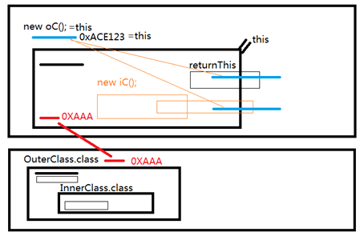

 ```java
   OuterClass oc=new OuterClass();
   //且认为70dea4e就是对象oc在堆空间的起始位置
   System.out.println(oc.getOuterThis());//oc=com.haoyu.OuterClass@70dea4e   =0XAAAFF123(假设)
   //如果把一个对象放在打印函数里面，对象会直接调用本身的toString方法，把本对象在堆空间里的地址形成一个字符串
   //由于这个字符串的@后的十六位进制数是唯一的，所以可以暂时认为它就是对象oc在堆空间的起始位置
   System.out.println(oc);
 //  oc.print();
   System.out.println(oc==oc.getOuterThis());//true
   //粗鲁理解：this==oc==0X70dea4e
   System.out.println(oc==oc.getInnerContainsOuterClassThis());
  }
  
 }
 class OuterClass extends Object{
  
  class InnerClass{
   public OuterClass returnOuterThis() {
    return OuterClass.this;
   }
  }
  
  public OuterClass getInnerContainsOuterClassThis() {
   //创建outerclass对象
   //this=0X70dea4e=在其他地方已经new OuterClass()
   InnerClass ic=this.new InnerClass();
   return ic.returnOuterThis();
  }
  
  public OuterClass getOuterThis() {
   return this;
  }
  public void print() {
   System.out.println(this.getClass().getName());
   System.out.println(Integer.toHexString(hashCode()));
  }
  //native 本地函数
     //public native int hashCode();//70dea4e
  //toString 可以构建一个对象的字符串形式
     public String toString() {
         return getClass().getName() + "@" + Integer.toHexString(hashCode());
     }
 }
 
 ```

##### This内部类的实例，builder模式

```java
//this--对象对自己说：“我”
//Outer.class 外部类
class Teacher{//new Teacher()=0xAAA
 //Inner.class 内部类
 //内部类可以随意调用外部类的成员变量的
 //一旦内部类声明了跟外部类一样的成员变量，方法的时候，覆盖外部类的方法
 class Builder{//new Teacher().new Builder()=0xBBB
  public Builder age(int age) {
   //Teacher.this=0XAAA
   Teacher.this.age=age;
   return this;//0xBBB
  }
  public Builder subject(String subject) {
   //Teacher.this=0XAAA
   Teacher.this.subject=subject;
   return this;//0xBBB
  }
  public Teacher build() {
   return Teacher.this;//0XAAA
  }
 }
 
 public static Builder builder() {
  //有点问题
  return (new Teacher()).new Builder();
 }
 
 private int age;//=0
 private String subject;
 
 public Teacher() {
  //调用带参数的构造方法
  this(1,"哲学");
 }

 public Teacher(int age, String subject) {
  //this有跟new出来的对象地址关联起来的功能
  this.age = age;
  this.subject = subject;
 }
 public Teacher getT() {
  return this;//0XAAA=new Teacher();
 }
 
 public int getAge() {
  return age;
 }
 public void setAge(int age) {
  this.age = age;
 }
 public String getSubject() {
  return subject;
 }
 public void setSubject(String subject) {
  this.subject = subject;
 }
 @Override
 public String toString() {
  return "Teacher [age=" + age + ", subject=" + subject + "]";
 }
}

Teacher t2=Teacher.builder().age(2).subject("语文").build();//链式表达--内部类

```

##### This调用构造函数

```java
 public Teacher() {
  //调用带参数的构造方法
  this(1,"哲学");
 }

 public Teacher(int age, String subject) {
  //this有跟new出来的对象地址关联起来的功能
  this.age = age;
  this.subject = subject;
 }

```

##### This成员变量传参

> **this**.age = age;     **this**.subject = subject;  

##### 把对象本身作为返回值

> **public** Teacher  getT() {     **return** **this**;//0XAAA=new Teacher();    }  

##### 内部类的使用

#### Static

在内存中只存储一份变量，可以类名.成员变量 和 类名.成员方法的方式调用，先于对象创建之前创建内容，通常用来做静态初始化，和方法简单调用

##### 类的成员变量--类属性--【类的属性并非对象的属性，重点区别】

1， 类属性（类的成员变量）定义

2， 访问类属性（类的成员变量）

3，什么时候使用对象属性，什么时候使用类属性

###### 类属性（类的成员变量）定义

类【是class ClassXX 的成员变量 不是对象new ClassXX（）的成员变量】的成员变量——静态属性，静态成员变量

```java
Class Student {
  Static int age;//静态属性
  String name;//对象属性
}
```

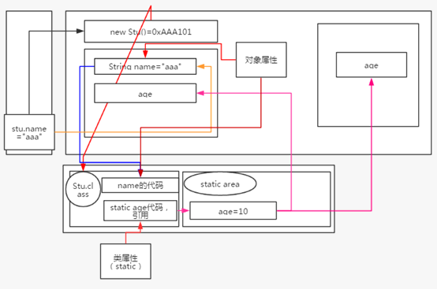

对象属性：也叫做实例属性，非静态属性

> New Student().name=”aaaa”

如果一个属性声明成类属性（static修饰符），所有的对象都共享一个属性值，类似案例参照ATM机

###### 访问类（class-static变量）属性

> ATM.account=10;
>
> 类名. static成员变量
>
> new ATM(“”).account=10;
>
> 对象.static成员变量

###### 什么时候使用对象属性，什么时候使用类属性

> 如果一个英雄，他的装备不一样，就设计成**对象属性**
>
> 如果每个英雄的法量上限制都是1000000，可以设计成**类属性**

##### 类方法

> 1，类方法定义
>
> 2，调用类方法
>
> 3，什么时候使用对象方法，什么时候使用类方法

###### 类方法定义

**类方法**：静态方法 static 方法

**对象方法**：实例方法，非静态方法

访问一个对象方法必须建立在一个对象的前提上

> New Stu().nostatic();

访问类方法，不需要对象，直接可以访问

> Stu.static()

###### 调用类方法

调用static方法

```java
class Hero{
    static void topHp(){
 }
}
//类名.方法
Hero.topHp();
//对象.方法
new Hero().topHp();
```

###### 什么时候使用对象方法，什么时候使用类方法

一局游戏，打印玩耍了多场时间，这个具体的时间并没有跟每个英雄关联起来，这样的共有时间属性的调用显示功能，就可以设计成类方法

```java
Game.printTime();
//类设计
class Game{
   static void printTime(){
      //time--out
 }
}
```

##### 对象属性初始化——研究的是被new出来的东西

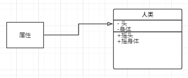

**对象**中的成员变量

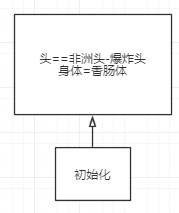

初始化：

成员变量第一次赋值

###### 对象属性初始化的方式

1，声明时初始化

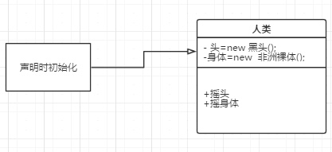

```java
class BlackPerson{
 String head=new String("黑头");// String head="黑头";
 String body=new String("非洲裸体");
}

```

2，构造方法初始化

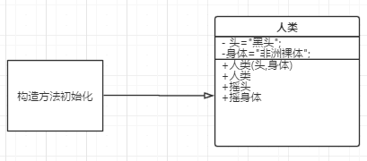

```java
public BlackPerson(String head, String body) {
  super();
  this.head = head;
  this.body = body;
 }
 public BlackPerson() {
  super();
 }

```

3，     代码块初始化

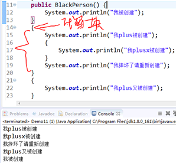

形式上的案例

只要是类中的{}，就叫一个代码块，在构造函数执行之前被调用，一般来说一个对象一个初始化代码块.

代码块初始化实用案例，打王者荣耀，**后羿**—class Hero—new Hero(“后羿”)

注释：以上三个概念均是针对后羿这个英雄对象的

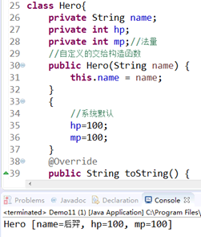

```java
class Hero{
 private String name;
 private int hp;
 private int mp;//法量
 //自定义的交给构造函数
 public Hero(String name) {
  this.name = name;
 }
 {
  //系统默认
  hp=100;
  mp=100;
 }
 @Override
 public String toString() {
  return "Hero [name=" + name + ", hp=" + hp + ", mp=" + mp + "]";
 }
}

public class Demo11 {
 
 public static void main(String[] args) {
  
  Hero h=new Hero("后羿");
  System.out.println(h);
  
 }
 
}

```

##### 类属性初始化——研究的是class{}代码层面的

直觉案例一：

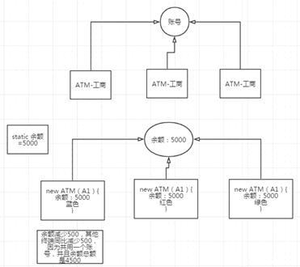

直觉案例二：

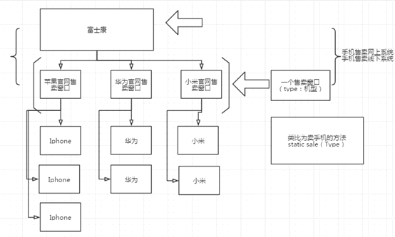

###### 声明属性时初始化

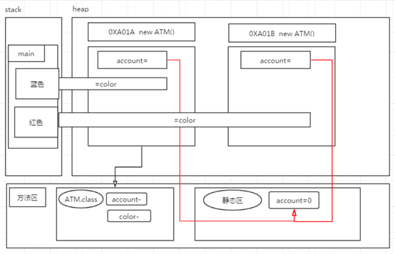

```java
class ATM{
 //在定义类的时候声明属性时初始化
 private static int account=0;//默认账号中的余额是0元
 private String color;
 
 public void setAccount(int account2) {
  account+=account2;//account=account+account2;
 }
 
 public ATM() {
 }
 public ATM(String color) {
  this.color = color;
 }
 @Override
 public String toString() {
  return "ATM [color=" + color + "]-[account=" + account + "]";
 }
 
}
public class Demo11 {
 
 public static void main(String[] args) {
  ATM ma1=new ATM("粉色");
  ATM ma2=new ATM("红色");
  ATM ma3=new ATM("蓝色");
  print(ma1,ma2,ma3);
  ma1.setAccount(10);
  print(ma1,ma2,ma3);
  ma2.setAccount(8);
  print(ma1,ma2,ma3);
  ma3.setAccount(1);
  print(ma1,ma2,ma3);
 }
 public static void print(ATM... mas) {
  for(ATM ma:mas) {
   System.out.println(ma);
  }
 }
 
}

```

来个静态方法变形

```java
class Bank{
 //在银行存钱
 public static void setAccount(int account2) {
  ATM.account+=account2;
 }
 static class ATM{
  //在定义类的时候声明属性时初始化
  private static int account=0;//默认账号中的余额是0元
  private String color;
  public void setAccount(int account2) {
   account+=account2;//account=account+account2;
  }
  public ATM() {
  }
  public ATM(String color) {
   this.color = color;
  }
  @Override
  public String toString() {
   return "ATM [color=" + color + "]-[account=" + account + "]";
  }
 }
}
public class Demo11 {
 
 public static void main(String[] args) {
  //类名.方法
  Bank.setAccount(5000);
  
  ATM ma1=new ATM("粉色");
  ATM ma2=new ATM("红色");
  ATM ma3=new ATM("蓝色");
  print(ma1,ma2,ma3);
  ma1.setAccount(10);
  print(ma1,ma2,ma3);
  ma2.setAccount(8);
  print(ma1,ma2,ma3);
  ma3.setAccount(1);
  print(ma1,ma2,ma3);
 }
 public static void print(ATM... mas) {
  for(ATM ma:mas) {
   System.out.println(ma);
  }
 }
 
}

```

###### 静态代码块初始化

```java
class Bank{
 //在银行存钱
 public static void setAccount(int account2) {
  System.out.println("Bank-setAccount");
  //只要class ATM类名出现了一次，就会初始化class ATM中的所有的static变量
  ATM.account+=account2;
 }
 static class ATM{
  //静态代码块
  static {
   account=0;
   System.out.println("static-init-针对class ATM类型滴，只要ATM.class相关的信息一出现，就自动完成static初始化");
  }
  //在定义类的时候声明属性时初始化
  private static int account;//默认账号中的余额是0元
  private String color;
  public void setAccount(int account2) {
   account+=account2;//account=account+account2;
  }
  public ATM() {
  }
  //针对实例对象的代码块初始化，用来初始化实例对象的变量
  {
   this.color="白色";
   System.out.println("代码块--"+color);
  }
  public ATM(String color) {
   this.color = color;
   System.out.println("构造方法--"+color);
  }
  @Override
  public String toString() {
   return "ATM [color=" + color + "]-[account=" + account + "]";
  }
 }
}
public class Demo11 {
 
 public static void main(String[] args) {
  //类名.方法
  Bank.setAccount(5000);
  Bank.setAccount(5000);
  ATM atm=new ATM();
  System.out.println(atm);//5000?  10000?
//  
//  ATM ma1=new ATM("粉色");
//  ATM ma2=new ATM("红色");
//  ATM ma3=new ATM("蓝色");
//  print(ma1,ma2,ma3);
//  ma1.setAccount(10);
//  print(ma1,ma2,ma3);
//  ma2.setAccount(8);
//  print(ma1,ma2,ma3);
//  ma3.setAccount(1);
//  print(ma1,ma2,ma3);
 }
 public static void print(ATM... mas) {
  for(ATM ma:mas) {
   System.out.println(ma);
  }
 }
 
}

```

## OOP核心下（继承，接口，抽象）

1，     **接口-api**，继承，super关键字，Object 超类

2，     多态

3，     继承，接口，抽象之封装

4，     Final

5，     抽象类

6，     内部类，基于接口，继承

7，     默认方法

8，     最佳实践

### 接口，继承，super关键字，Object 超类

案例实践

需求：王者荣耀，两类英雄，**约定**某些英雄是法系英雄，有些是物理系英雄，法系的魔法AP攻击，物理系的物理AD攻击

1，     设计接口ad，ap

```java
//约定两类英雄
interface AD{
 //物理攻击
 public void physicsAttack();
}

interface AP{
 public void spellsAttack();
}

```

2，     搞一些英雄进来，实现ad和ap功能

注意：设计两类英雄APHero，ADHero，他们均有血量，法量，姓名，然后他们遵守AD和AP的约定，所以需要让AD和AP这种约定称为一种特殊地类，就是上述的interface AD AP，我们设计的具体的英雄还应该有一个英雄模板Hero{血量，法量，姓名}，因此继承结构如下：

 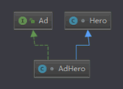

```java
//约定两类英雄
interface AD{
 //物理攻击
 public void physicsAttack();
}

interface AP{
 public void spellsAttack();
}
//英雄的基本类
class Hero{
 private String name;
 private int hp;
 private double price;
 private int mp;
 public String getName() {
  return name;
 }
 public void setName(String name) {
  this.name = name;
 }
 public int getHp() {
  return hp;
 }
 public void setHp(int hp) {
  this.hp = hp;
 }
 public double getPrice() {
  return price;
 }
 public void setPrice(double price) {
  this.price = price;
 }
 public int getMp() {
  return mp;
 }
 public void setMp(int mp) {
  this.mp = mp;
 }
}
/*
 * 
 */
//ad的英雄继承ad-物理 的约定
class AdHero extends Hero implements AD{
 @Override
 public void physicsAttack() {
  System.out.println("实现AD物理攻击");
 }
}

class ApHero extends Hero implements AP{
 @Override
 public void spellsAttack() {
  System.out.println("实现AP法术攻击");
 }
 
}

```

3，     设计一个既有ad功能也有ap功能的英雄

```java
//接口interface可以多继承（实现implements），父类只能单继承
class XManHero extends Hero implements AD,AP{
 @Override
 public void spellsAttack() {
  System.out.println("实现AD物理攻击");

 }
 @Override
 public void physicsAttack() {
  System.out.println("实现AP法术攻击");
 }
}

```

4，     根据上述案例，什么时候使用interface这种接口

学习一个知识点，由浅入深，切不可揠苗助长，引入概念后，需要在多加实践上才去思考该如何使用，如果没有这个大量实践的过程，是不能达到真正地深刻理解的，我们刚接触一个难的概念，更应该大量实践，之后再就清楚具体运用（熟练运用）

案例练习

需求：

场景化需求分析:

> 定义一个通讯接口
>
> 接口中有打电话，发短信，网络连接功能
>
> 实现接口的有电话，平板
>
> 其中电话可以和平板进行打电话，发短信，相互连接网络
>
> 定义一个工作接口
>
> 接口中有开会，安排工作，审核工作
>
> 于是分别有5个人在不同的两个会议室里开远程会议
>
> 分别用手机和平板进行会议，其中手机会时不时给平板发短信，平板会时不时给手机开视频和打语音电话

逻辑化：

> 所有通讯设备必须满足通讯条件和通讯流程，符合这个通讯规范约束的设备才是通讯设备，代码体现为设计一个约束类（interface-接口-通讯设备规范结构接口）
>
> 无论是哪种通讯方式，底层结构都是有两个对象，相互通讯传输，互为主语，所以推导出，通讯方式一定要有通讯对象，而这个通讯对象一定是符合通讯规范约束的通讯设备。
>
> 接受通讯规范约束的通讯设备A，与另外一个B，进行任意形式（三种之一）通讯，B能够以任意通讯形式返回数据。

寻找解决模型：

解决场景思考：思考选择设计模式——模板方法

代码：

```java
package com.haoyu;

public class Demo18 {

 public static void main(String[] args) {
//  System.out.println(CommunicationStatus.internetStatus);
//  System.out.println(CommunicationStatusPlus.phoneStatus);
  Phone iphone=new Phone("iphone");
  Phone android=new Phone("android");
  android.setCurrentCommunicationStatus(CommunicationStatus.SMSStatus);
  iphone.call(android);
 }
 
}
//设置状态_枚举-->就是类型
//Status：状态
//phoneStatus:电话状态
//SMSStatus：信息状态
//internetStatus:网络状态
//CommunicationStatus.phoneStatus
enum CommunicationStatus{
 phoneStatus,SMSStatus,internetStatus;
}
//如果你用不来上面的枚举，也可以整下面这个结构
//class CommunicationStatusPlus{
// static String phoneStatus="phoneStatus";
//}
//Communication 交流  Tool工具
interface CommunicationTool{
 void call(DefaultCommunicationToolTemplate ct);
 void sendSMS(DefaultCommunicationToolTemplate ct);
 void internet(DefaultCommunicationToolTemplate ct);
}
//Template 模板
//abstract 抽象   abstract class 理解成 和interface的区别在于既可以定义约束，又在实现方法
//abstract 跟interface一样，不可以被new出来
abstract class DefaultCommunicationToolTemplate implements CommunicationTool{
 private String name;
 //0是没有发信息的状态
 private int state=0;
 //默认通讯状态是网络连接状态
 //current :当前
 private  CommunicationStatus currentCommunicationStatus=CommunicationStatus.phoneStatus;
 //可以随时对这个通讯状进行改动
 public CommunicationStatus getCurrentCommunicationStatus() {
  return currentCommunicationStatus;
 }
 public void setCurrentCommunicationStatus(CommunicationStatus currentCommunicationStatus) {
  this.currentCommunicationStatus = currentCommunicationStatus;
 }
 public abstract void call(DefaultCommunicationToolTemplate ct);
 public abstract void sendSMS(DefaultCommunicationToolTemplate ct);
 public abstract void internet(DefaultCommunicationToolTemplate ct);
 //content:内容
 //protected:只能子类调用
 protected void defaultCommunication(DefaultCommunicationToolTemplate ct,String content) {
  if(state==0) {
   System.out.println(this+content);
   state=1;
   ct.communicationStatusChoose(this);//this--phone
  }
 }
 //可以通过这个方法来选择执行上面那条语句
 //主要用来做回送信息
 public void communicationStatusChoose(DefaultCommunicationToolTemplate ct) {
   switch(this.currentCommunicationStatus) {
   case phoneStatus:call(ct);break;
   case SMSStatus:sendSMS(ct);break;
   case internetStatus:internet(ct);break;
   }
 }
 //
 public int getState() {
  return state;
 }
 public void setState(int state) {
  this.state = state;
 }
 public DefaultCommunicationToolTemplate(String name) {
  this.name = name;
 }
 public String getName() {
  return name;
 }
 public void setName(String name) {
  this.name = name;
 }
 
 @Override
 public String toString() {
  return "CommunicationTool [name=" + name + ", currentCommunicationStatus="
    + currentCommunicationStatus + "]";
 }
}
class Phone extends DefaultCommunicationToolTemplate{
 public Phone(String name) {
  super(name);
 }
// //0是没有发信息的状态
// private int state=0;
// public int getState() {
//  return state;
// }
// public void setState(int state) {
//  this.state = state;
// }
 //ct--CommunicationTool简写：通讯工具
 public void call(DefaultCommunicationToolTemplate ct) {
//  ////java.lang.StackOverflowError
//  if(state==0) {
//   System.out.println(this+"疯狂打call");
//   state=1;
//   ct.communicationStatusChoose(this);//this--phone
//  }
  defaultCommunication(ct,"疯狂打call");
 }
 public void sendSMS(DefaultCommunicationToolTemplate ct) {
  defaultCommunication(ct,"疯狂打sms");
 }
 public void internet(DefaultCommunicationToolTemplate ct) {
  defaultCommunication(ct,"疯狂打ip");
 }
}
/*
i-state=0
iphone-call(android){
 -->iphone
  i-state=1
  android.choose(iphone);
 {
  case phoneStatus:call(ct){
   a-state=1;
   iphone.choose(android){
    call(){
     state=1;
        syso-->call;
        break;
    }
   }
  }
 }
}
*/

```

### 对象转型

1，     引用类型与对象类型的概念

2，     向上转型，向下转型，没有继承联系的两个类的转换

3，     Interface层面（向上，向下转型）

4，     Instanceof

#### 引用类型与对象类型的概念

```java
 public static void main(String[] args) {
  
  Animal cat=new Animal();
  //引用——》cat
  //对象——》cat——》【new Animal()】
  
 }
}
class Animal{
}
```

上诉例子：cat就是引用对象， new Animal（）就是对象

引用对象cat的类型：Animal

new Animal 的类型 ：Animal

正常情况下引用对象（那个指向堆内存地址的变量）的类型和堆中被new出来的那个对象的类型，是一样的

#### 向上转型，向下转型，没有继承联系的两个类的转换

不管是向上转，还是向下转，引用类型和对象类型不一致的时候才有需要转换的需求

```java
public class Demo19 {
 public static void main(String[] args) {

  Animal cat = new Animal();
  // 引用——》cat
  // 对象——》cat——》【new Animal()】

  // 苹果手机继承了普通手机的结构，我们把苹果手机当做普通手机来使用
  NomalPhone phone = new Iphone();//向上转型
  phone.call();
  phone.sms();
//  phone.siri();这里是有问题滴，必须是你知道这是苹果手机，你才知道要用siri，如果你只是把这个当做一个般手机，你
  //只知道要打电话和发短信
  //需要知道这个普通手机能够运行苹果系统，（Iphone）实际上就是声明一下要当做iphone来看来使用
  ((Iphone)phone).siri();//向下转型
  //
  //农夫山泉继承了饮料约束的结构     我们把农夫山泉当做饮料来使用
  Drink drink=new DrinkNF();//向上转型
  //现在要实现农夫山泉特殊的甜味，对drink引用变量进行向下转型，告诉使用者这里要使用农夫山泉的方法了
  ((DrinkNF)drink).addSth();//向下转型
  
  //java.lang.ClassCastException
  NomalPhone iphone=new NomalPhone();//山寨鸡     如果要向上转型，实例类型必须是引用类型的子类
  ((Iphone)iphone).siri();
  
  //苍老师继承了动物的结构，我们把苍老师当成。。。
  Animal mc=new CangLaoShi();
  mc.jiao();
  //苍老师上录播课
  ((CangLaoShi)mc).lessonVedio();
  
 }
}
//接口  约束  drink
interface Drink{
 void useMouse() ;
}
class DrinkNF implements Drink{
 public void useMouse() {
  
 }
 public void addSth() {
  
 }
}

class NomalPhone {
 public void call() {
  
 }
 public void sms() {
 
 }
}
class Iphone extends NomalPhone {
 // 模拟的人工智能
 public void siri() {
  System.out.println("siri");
 }
}
class Animal {

 public void jiao() {
  
 }
 
}
class CangLaoShi extends Animal{
 
 public void lessonVedio() {
  
 }
}
```

案例分析，上午案例中使用了向上转型

```java
  abastract DefaultCommunicationToolTemplate
  
  Phone extends DefaultCommunicationToolTemplate
  
  new Phone
  
  public void call(DefaultCommunicationToolTemplate ct) -->new Phone
  
  DefaultCommunicationToolTemplate ct=new Phone();

```

往方法中传递一个符合通讯约束规范的通讯设备，于是我们传进去了一个通讯设备android

##### 没有继承关系的一旦转换，会报错

```java
//java.lang.ClassCastException
  NomalPhone iphone=new NomalPhone();
//山寨鸡 如果要向上转型，实例类型必须是引用类型的子类
  ((Iphone)iphone).siri();
```

##### Interface层面（向上，向下转型）

任意类都继承Object

Class Object

> java.lang.Object
>
> public class Object
>
> Class `Object`是类`Object`结构的根。 每个class都有`Object`作为超类。 所有对象（包括数组）都实现了这个类的方法。
>
> 从以下版本开始：
>
> JDK1.0

Interface xxx

Interface yyy extends xxx

Abstract class zzz implements yyy

Class aaa extends zzz

##### 接口向上转型，向下转型

```java
public class Demo20 {
 public static void main(String[] args) {
  //把可乐当成水喝
  Water3 color=new BColor();
  ((BColor)color).shaJiJing();
 }
}
//定义约束
interface Water3{
 public void drink();
}
//可乐
class BColor implements Water3{
 public void drink() {
  System.out.println("喝阔乐");
 }
 public void shaJiJing() {
  System.out.println("杀鸡精");
 }
}

```

##### Instanceof—引用对象的类型是否是指定类型的系列（自己到子类）

Instanceof Animal 判断一个引用所指向的对象，是否是Animal类型，animal的子类

```java
package com.haoyu;
class Herox{
}
class ADHerox extends Herox{
}
class APHerox extends Herox{
}
public class Demo21 {
 
 public static void main(String[] args) {
  ADHerox ad=new ADHerox();
  APHerox ap=new APHerox();
  Herox h1=ad;
  Herox h2=ap;
  //判断引用h1指向对象，是否是adherox
//  System.out.println(h1 instanceof ADHerox);//true
//  //apherox
//  System.out.println(h2 instanceof APHerox);//true
//  //是否是herox的子类
//  System.out.println(h1 instanceof Herox);//true
  //动物  苍老师
  TeaCang  tc=new TeaCang();
  WildAnimal wa=tc;
  //是不是苍老师类型的？
  System.out.println(wa instanceof TeaCang);
  //是不是野生动物类型的？
  System.out.println(wa instanceof WildAnimal);
 }
}
//野生动物
class WildAnimal{
 
}
class TeaCang extends WildAnimal{
 
}
```

#### 重写（基于继承结构的）

继承结构下， 子类如果包含一个与父类方法相同的方法，子类自己的方法就会覆盖父类的方法

（private）私有的成员变量以及方法是不能够传递给子类的

如果只是需要子类继承父类的成员变量或者方法，则需protected修饰

**两部手机都是iphone4**，me-i4****在我的房间，fu-i4****在父的房间，现在我在我的房间拿iphone4****àme-i4****，我进入父的房间，拿iphone4,****手机却是fu-i4**

```java

class Demo22 {

 public static void main(String[] args) {
  // Type mismatch: cannot convert from Aniaml1 to Cang
  // Cang cang=new Aniaml1();
  // Aniaml1 a1=(Aniaml1)new Cang();
  // Aniaml1 a2=new Cang();
  // Life a3=new Cang();
//  new Cang() {
//   void actionMovie() {
//    System.out.println("苍式moive");
//   }
//  }.actionMoive(1);// extends Cang();
  // 在以上结构不变的情况下，需要一句语法执行父类和子类的相同方法的不同执行
  new CangPlus();//使用cangplus对象 打印父类cang中的private name
  System.out.println(new CangPlus().getName());
  //就近原则
  
 }
}
class Cang extends Aniaml1 {
 private String name="cangjielun";
 protected String getName() {
  System.out.println(this);
  System.out.println(this.name);
  return this.name;
 }
 private void actionMovie() {
  System.out.println("苍式moive2");
 }
 protected void actionMoive(int a) {
  
 }
}
class CangPlus extends Cang{
 String name="杰伦";
 public String getName() {
  super.getName();
  System.out.println(this);
  return this.name;
 }
}
interface Life {

}
class Aniaml1 implements Life {

}

```

#### 多态--（多种状态）

##### 操作符的多态

+可以作为算数运算，也可以作为字符串连接

> int a=1+1;  String a1=a+"pp";  

##### 类的多态

父类引用指向子类对象，方便业务场景的模块拆与装

使用多态，就类似同一把枪换弹夹，激光弹夹打激光弹，跑弹夹打炮弹

不适用多态，类似换枪，激光枪打激光，炮弹枪打炮弹，手枪 打手枪

```java
public class Demo23 {

 public static void main(String[] args) {
  int a=1+1;
  String a1=a+"pp";
  
  //多态//换弹夹
  PersonAnimal pa=new PersonAnimal();
  pa.eat();
  pa=new Fu();
  pa.eat();
  pa=new Son();
  pa.eat();
  pa=new GrandSon();
  pa.eat();
  //等于换枪
  PersonAnimal papa=new PersonAnimal();
  papa.eat();
  Fu fu=new Fu();
  fu.eat();
  Son son=new Son();
  son.eat();
  GrandSon gs=new GrandSon();
  gs.eat();
  
  fu.fuEat();
  son.sonEat();
  gs.grandSonEat();
  
 }
 
}
//智人
class PersonAnimal{
 public void eat() {
  System.out.println("蛋鞭");
 }
}
class Fu extends PersonAnimal{
 public void eat() {
  System.out.println("锁阳");
 }
 public void fuEat() {
  System.out.println("锁阳");
 }
}
class Son extends Fu{
 public void eat() {
  System.out.println("韭菜");
 }
 public void sonEat() {
  System.out.println("韭菜");
 }
}
class GrandSon extends Son{
 public void eat() {
  System.out.println("吃纸");
 }
 public void grandSonEat() {
  System.out.println("吃纸");
 }
}
```

#### Super关键字

o    定义一个父类，带无参构造函数

o    实例化子类，调用父类的构造函数

o    给父类加有参数的构造函数

o    子类调用父类的有参数构造函数

o    调用父类属性

o    调用父类方法

```java
package com.haoyu;

public class Demo25 {

}
class Fux{
 public Fux() {}
 public Fux(String name) {
  
 }
 public String name;
 private int age;
 protected int id;
 public int getAge() {
  return age;
 }
 //父类的public修饰关键字和protected都可以被子类super关键字调用
 public void setAge(int age) {
  this.age = age;
 }
 protected int getId() {
  return id;
 }
}
class Sonx extends Fux{

 //默认有一个无参构造函数
 //继承结构，必须要调用一个父类构造函数，如果没有默认的，也必须要调用一个带参数的
 public Sonx() {
  //默认方法 super();
  super();//显示地写出来,调用父类的构造方法，把父类对象给new出来
  super.name="";//使用super关键字，代表new出来的父类对象
  //getAge()实际上等于 super.getAge(),只是子类里没有getAge的方法，因此这里的getAge就可以省略super
  //当然，使用super.getAge();更加的直观
  //如果子类中也有getAge的方法，这里的调用就是this.getAge();
  //super.getAge();//使用父类的公共方法可以调用父类的私有变量
  getAge();
  super.id=10;//protected修饰符：代表只能被子类访问属性
 }
 public Sonx(String name) {
  //默认方法 super()
  super(name);
 }
}
```

#### Object类

##### public class Object

> Class Object is the root of the class hierarchy. Every class has Object as a superclass. All objects, including arrays, implement the methods of this class.

Object是所有自定义和系统自带类class的顶级父类，写不写继承都继承它

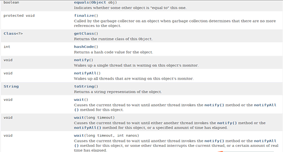

Equals:值相等

> public boolean equals(Object obj) { return (this == obj);}

##### 一般使用的时候需要重写equals

```java
package com.haoyu;

public class Demo26 extends Object{

 public static void main(String[] args) {
  
  SupportHerox sh1=new SupportHerox();
  sh1.name="a";
  sh1.hp=120;
  sh1.id=1;
  SupportHerox sh2=new SupportHerox();
  sh2.name="a";
  sh2.hp=120;
  sh2.id=1;
  System.out.println(sh1.equals(sh2));//对象中的指定值是否相同
  System.out.println(sh1==sh2);//比对的是堆空间中的地址，判断的是对象是否相等
  
 }
 
}
//辅助英雄
class SupportHerox{
 public String name;
 public int hp;
 public int id;//1是蓝方  2是红方
 
 //先不管这些代码时什么意思
 //简单理解为：如果name,hp,id的值都相同，就算是堆空间中的地址不相同，我们都认为这个两个对象是一个对象
 @Override
 public int hashCode() {
  final int prime = 31;
  int result = 1;
  result = prime * result + hp;
  result = prime * result + id;
  result = prime * result + ((name == null) ? 0 : name.hashCode());
  return result;
 }
 //alt+shift+s  h ide自动生成代码重写选中值
 @Override
 public boolean equals(Object obj) {
  if (this == obj)
   return true;
  if (obj == null)
   return false;
  if (getClass() != obj.getClass())
   return false;
  SupportHerox other = (SupportHerox) obj;
  if (hp != other.hp)
   return false;
  if (id != other.id)
   return false;
  if (name == null) {
   if (other.name != null)
    return false;
  } else if (!name.equals(other.name))
   return false;
  return true;
 }
 
}
```

##### toString:把对象打印成字符串

```java
getClass().getName() + '@' + Integer.toHexString(hashCode())
@Override
public String toString() {
 return "SupportHerox [name=" + name + ", hp=" + hp + ", id=" + id + "]";
}
```

##### Finalize：当一个对象没有任何引用指向的时候，他就满足垃圾回收条件

当这个对象被回收的时候，他的finalize方法就会被调用

这个方法不是由开发人员调用，而是有jvm自动调用

```java
SupportHerox sh;
for(int i=0;i<1000000;i++) {
//一直new新对象出来
//每次创建一个对象，前一个sh就移到新的对象上来，而上一个就没有引用指向他了
//这些失去引用对象的孤魂野鬼，满足被垃圾回收的条件
//当垃圾堆积多了的时候，jvm就会触发垃圾回收机制，每个被回收的对象就会调用finalize方法
  sh=new SupportHerox();//0xAAAF  0XAA10
}
public void finalize() throws Throwable{
  System.out.println(this+"这个辅助英雄正在被销毁");
}
```

一般情况下不去改动这个finalize方法

#### Final

1，     final修饰类

2，     final修饰方法

3，     final修饰基本类型变量

4，     final引用

5，     常量

```java
//01
//final修饰类，意味着这个类无法被继承，子类如果要去继承会直接出现编译错误
//还米有运行就直接报错叫你修改
final class Fuy{
 
}
//class Ziy extends Fuy{
 
//}
//02
//final修饰方法，意味着方法不能被重写
class Fuyy{
 final int getAge() {
  return 50;
 }
}
class Sony extends Fuyy{
 //子类这里无法重写或者覆盖父类带有final修饰的方法
// int getAge() {
//  return 1;
// }
}
//03 final修饰基本类型变量，对引用变量进行修饰
//表示该对象只有一次机会被赋值，一旦赋值成功，就不能再被赋值了
//04final修饰引用类型  和上一样
class Sonyy{
 //基本变量 int
 final int age=1;
 {
//  age=10;
 }
 //应用类型 String  类似的只要是类，也都满足这个效果
 final String name="aaaa";
// {
//  name="ppp";
// }
 public void method() {
//  name="[[[[";
  final String name2="aaaa";
//  name2="xxxx";
 }
}
//05常量，对所有代码公开，无法更改，作为全局参数变量
//
class Sonyyy{
 //常量——国籍，常量的引用名称一般是全大写
 public static final String COUNTRY="中国";
} 
```

#### 类图——uml图的一种，uml建模（帮助理清思路）

 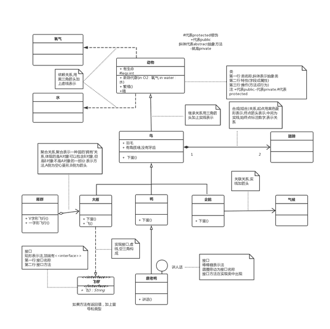
