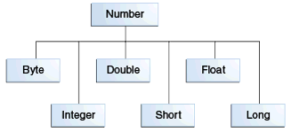
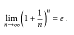
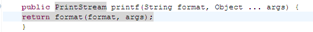
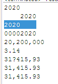
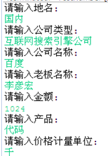
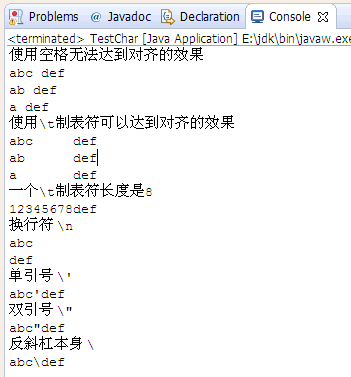
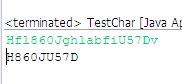
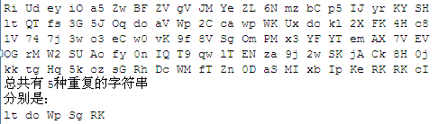
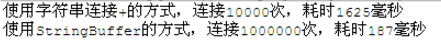

<!-- more -->

## 装箱拆箱

### 封装类

所有的**基本类型**，都有对应的**类类型**
比如int对应的类是Integer
这种类就叫做封装类

```java
package digit;
 
public class TestNumber {
    public static void main(String[] args) {
        int i = 5;
        //把一个基本类型的变量,转换为Integer对象
        Integer it = new Integer(i);
        //把一个Integer对象，转换为一个基本类型的int
        int i2 = it.intValue();
    }
}

```

### Number类

数字封装类有
 Byte,Short,Integer,Long,Float,Double
 这些类都是抽象类Number的子类



```java
package digit;
 

public class TestNumber {
 
    public static void main(String[] args) {
        int i = 5;
         
        Integer it = new Integer(i);
        //Integer是Number的子类，所以打印true
        System.out.println(it instanceof Number);
    }
}

```

### 基本类型转封装类

```java
package digit;
 
public class TestNumber {
 
    public static void main(String[] args) {
        int i = 5;
 
        //基本类型转换成封装类型
        Integer it = new Integer(i);
         
    }
}

```

### 封装类转基本类型

```java
package digit;
 
public class TestNumber {
 
    public static void main(String[] args) {
        int i = 5;
 
        //基本类型转换成封装类型
        Integer it = new Integer(i);
         
        //封装类型转换成基本类型
        int i2 = it.intValue();
         
    }
}

```

### 自动装箱

不需要调用构造方法，通过 = 符号自动把 基本类型 转换为 类类型 就叫装箱

```java
 package digit;
 
public class TestNumber {
 
    public static void main(String[] args) {
        int i = 5;
 
        //基本类型转换成封装类型
        Integer it = new Integer(i);
         
        //自动转换就叫装箱
        Integer it2 = i;
         
    }
}

```

### 自动拆箱

不需要调用Integer的intValue方法，通过=就自动转换成int类型，就叫拆箱

```java
 package digit;
  
public class TestNumber {
  
    public static void main(String[] args) {
        int i = 5;
  
        Integer it = new Integer(i);
          
        //封装类型转换成基本类型
        int i2 = it.intValue();
         
        //自动转换就叫拆箱
        int i3 = it;
          
    }
}

```

### int的最大值，最小值

int的最大值可以通过其对应的封装类Integer.MAX_VALUE获取

```java
 package digit;
  
public class TestNumber {
  
    public static void main(String[] args) {
 
        //int的最大值
        System.out.println(Integer.MAX_VALUE);
        //int的最小值      
        System.out.println(Integer.MIN_VALUE);
          
    }
}

```

### 练习-装箱拆箱

1. 对byte,short,float,double进行自动拆箱和自动装箱

2. byte和Integer之间能否进行自动拆箱和自动装箱

3. 通过Byte获取byte的最大值

```java
```

## 字符串转换

### 数字转字符串

方法1： 使用String类的静态方法valueOf
方法2： 先把基本类型装箱为对象，然后调用对象的toString

```java
 package digit;
  
public class TestNumber {
  
    public static void main(String[] args) {
        int i = 5;
         
        //方法1
        String str = String.valueOf(i);
         
        //方法2
        Integer it = i;
        String str2 = it.toString();
         
    }
}

```

### 字符串转数字

调用Integer的静态方法parseInt

```java
 package digit;
  
public class TestNumber {
  
    public static void main(String[] args) {
 
        String str = "999";
         
        int i= Integer.parseInt(str);
         
        System.out.println(i);
         
    }
}

```

### 练习-字符串转换

参考上述步骤
把浮点数 3.14 转换为 字符串 "3.14"
再把字符串 “3.14” 转换为 浮点数 3.14
如果字符串是 3.1a4，转换为浮点数会得到什么？

## 数学方法

java.lang.Math提供了一些常用的数学运算方法，并且都是以静态方法的形式存在

### 四舍五入, 随机数，开方，次方，π，自然常数

```java
package digit;
  
public class TestNumber {
  
    public static void main(String[] args) {
        float f1 = 5.4f;
        float f2 = 5.5f;
        //5.4四舍五入即5
        System.out.println(Math.round(f1));
        //5.5四舍五入即6
        System.out.println(Math.round(f2));
         
        //得到一个0-1之间的随机浮点数（取不到1）
        System.out.println(Math.random());
         
        //得到一个0-10之间的随机整数 （取不到10）
        System.out.println((int)( Math.random()*10));
        //开方
        System.out.println(Math.sqrt(9));
        //次方（2的4次方）
        System.out.println(Math.pow(2,4));
         
        //π
        System.out.println(Math.PI);
         
        //自然常数
        System.out.println(Math.E);
    }
}

```

### 练习-数学方法

这个图是自然对数的计算方式。
借助Math的方法，把自然对数计算出来，看看经过自己计算的自然对数和Math.E的区别有多大



## 格式化输出

### 1：格式化输出

如果不使用格式化输出，就需要进行字符串连接，如果变量比较多，拼接就会显得繁琐
使用格式化输出，就可以简洁明了
 %s 表示字符串
 %d 表示数字
 %n 表示换行

```java
package digit;
  
public class TestNumber {
  
    public static void main(String[] args) {
 
        String name ="盖伦";
        int kill = 8;
        String title="超神";
         
        //直接使用+进行字符串连接，编码感觉会比较繁琐，并且维护性差,易读性差
        String sentence = name+ " 在进行了连续 " + kill + " 次击杀后，获得了 " + title +" 的称号";
         
        System.out.println(sentence);
         
        //使用格式化输出
        //%s表示字符串，%d表示数字,%n表示换行
        String sentenceFormat ="%s 在进行了连续 %d 次击杀后，获得了 %s 的称号%n";
        System.out.printf(sentenceFormat,name,kill,title);
         
    }
}

```

### 2：printf和format

printf和format能够达到一模一样的效果



```java
package digit;
  
public class TestNumber {
  
    public static void main(String[] args) {
 
        String name ="盖伦";
        int kill = 8;
        String title="超神";
         
        String sentenceFormat ="%s 在进行了连续 %d 次击杀后，获得了 %s 的称号%n";
        //使用printf格式化输出
        System.out.printf(sentenceFormat,name,kill,title);
        //使用format格式化输出
        System.out.format(sentenceFormat,name,kill,title);
         
    }
}

```

### 3：换行符

**换行符**就是另起一行 --- '\n' 换行（newline）
 **回车符**就是回到一行的开头 --- '\r' 回车（return）
 在eclipse里敲一个回车，实际上是**回车换行符**
 Java是跨平台的编程语言，同样的代码，可以在不同的平台使用，比如Windows,Linux,Mac
 然而在不同的操作系统，换行符是不一样的
 （1）在DOS和Windows中，每行结尾是 “\r\n”；
 （2）Linux系统里，每行结尾只有 “\n”；
 （3）Mac系统里，每行结尾是只有 "\r"。
 为了使得同一个java程序的换行符在所有的操作系统中都有一样的表现，使用%n，就可以做到平台无关的换行

```java
package digit;
  
public class TestNumber {
  
    public static void main(String[] args) {
 
        System.out.printf("这是换行符%n");
        System.out.printf("这是换行符%n");
         
    }
}

```

### 4 : 总长度，左对齐，补0，千位分隔符，小数点位数，本地化表达

其他常用的格式化方式



```java
package digit;
  
import java.util.Locale;
   
public class TestNumber {
   
    public static void main(String[] args) {
        int year = 2020;
        //总长度，左对齐，补0，千位分隔符，小数点位数，本地化表达
          
        //直接打印数字
        System.out.format("%d%n",year);
        //总长度是8,默认右对齐
        System.out.format("%8d%n",year);
        //总长度是8,左对齐
        System.out.format("%-8d%n",year);
        //总长度是8,不够补0
        System.out.format("%08d%n",year);
        //千位分隔符
        System.out.format("%,8d%n",year*10000);
  
        //小数点位数
        System.out.format("%.2f%n",Math.PI);
          
        //不同国家的千位分隔符
        System.out.format(Locale.FRANCE,"%,.2f%n",Math.PI*10000);
        System.out.format(Locale.US,"%,.2f%n",Math.PI*10000);
        System.out.format(Locale.UK,"%,.2f%n",Math.PI*10000);
          
    }
}

```

### 5：Scanner

借助 Scanner 读取字符串数据，然后用格式化输出任意一段文字，类似以下



```java
```

## 字符

### 保存一个字符的时候使用char

```java
package character;
 
public class TestChar {
 
    public static void main(String[] args) {
        char c1 = 'a';
        char c2 = '1';//字符1,而非数字1
        char c3 = '中';//汉字字符
        char c4 = 'ab'; //只能放一个字符
         
    }
}

```

### char对应的封装类  

char对应的封装类是Character 装箱拆箱概念，参考 拆箱装箱

 ```java
 package character;
  
 public class TestChar {
  
     public static void main(String[] args) {
         char c1 = 'a';
         Character c = c1; //自动装箱
         c1 = c;//自动拆箱
          
     }
 }
 
 ```

### Character常见方法

```java
package character;
 
public class TestChar {
 
    public static void main(String[] args) {
         
        System.out.println(Character.isLetter('a'));//判断是否为字母
        System.out.println(Character.isDigit('a')); //判断是否为数字
        System.out.println(Character.isWhitespace(' ')); //是否是空白
        System.out.println(Character.isUpperCase('a')); //是否是大写
        System.out.println(Character.isLowerCase('a')); //是否是小写
         
        System.out.println(Character.toUpperCase('a')); //转换为大写
        System.out.println(Character.toLowerCase('A')); //转换为小写
 
        String a = 'a'; //不能够直接把一个字符转换成字符串
        String a2 = Character.toString('a'); //转换为字符串
         
    }
}

```

### 常见转义



```java
package character;
  
public class TestChar {
  
    public static void main(String[] args) {
        System.out.println("使用空格无法达到对齐的效果");
        System.out.println("abc def");
        System.out.println("ab def");
        System.out.println("a def");
          
        System.out.println("使用\\t制表符可以达到对齐的效果");
        System.out.println("abc\tdef");
        System.out.println("ab\tdef");
        System.out.println("a\tdef");
         
        System.out.println("一个\\t制表符长度是8");
        System.out.println("12345678def");
          
        System.out.println("换行符 \\n");
        System.out.println("abc\ndef");
 
        System.out.println("单引号 \\'");
        System.out.println("abc\'def");
        System.out.println("双引号 \\\"");
        System.out.println("abc\"def");
        System.out.println("反斜杠本身 \\");
        System.out.println("abc\\def");
    }
}

```

### 练习-character

通过Scanner从控制台读取字符串，然后把字符串转换为字符数组

参考的转换方式:

> String str = "abc123";  char[] cs = str.toCharArray();

转换为字符数组后，筛选出控制台读取到的字符串中的大写字母和数字，并打印出来



## 字符串

### 创建字符串  

字符串即字符的组合，在Java中，字符串是一个类，所以我们见到的字符串都是对象
 常见创建字符串手段：

1. 每当有一个**字面值**出现的时候，虚拟机就会创建一个字符串

2. 调用String的构造方法创建一个字符串对象

3. 通过+加号进行字符串拼接也会创建新的字符串对象

```java
package character;
 
public class TestString {
 
    public static void main(String[] args) {
        String garen ="盖伦"; //字面值,虚拟机碰到字面值就会创建一个字符串对象
         
        String teemo = new String("提莫"); //创建了两个字符串对象
         
        char[] cs = new char[]{'崔','斯','特'};
         
        String hero = new String(cs);//  通过字符数组创建一个字符串对象
         
        String hero3 = garen + teemo;//  通过+加号进行字符串拼接
    }
}

```

### final  

String 被修饰为final,所以是不能被继承的

代码比较复制代码

```java
package character;
 
public class TestString {
 
    public static void main(String[] args) {
        MyString str = new MyString();
         
    }
     
        /*这里会报错，因为String不能被继承*/
    static class MyString extends String{
         
    }
     
}

```

### immutable

immutable 是指不可改变的
 比如创建了一个字符串对象
 String garen ="盖伦";
 **不可改变**的具体含义是指：
 不能增加长度
 不能减少长度
 不能插入字符
 不能删除字符
 不能修改字符
 一旦创建好这个字符串，里面的内容 **永远** 不能改变

```java
package character;
  
public  class TestString {
  
    public static void main(String[] args) {
        String garen ="盖伦";
         
    }
}

```

### 字符串格式化  

如果不使用字符串格式化，就需要进行字符串连接，如果变量比较多，拼接就会显得繁琐
使用**字符串格式化**，就可以简洁明了

```java
package character;
   
public class TestString {
   
    public static void main(String[] args) {
  
        String name ="盖伦";
        int kill = 8;
        String title="超神";
          
        //直接使用+进行字符串连接，编码感觉会比较繁琐，并且维护性差,易读性差
        String sentence = name+ " 在进行了连续 " + kill + " 次击杀后，获得了 " + title +" 的称号";
          
        System.out.println(sentence);
         
        //格式化字符串
        //%s表示字符串，%d表示数字,%n表示换行
        String sentenceFormat ="%s 在进行了连续 %d 次击杀后，获得了 %s 的称号%n";
         
        String sentence2 = String.format(sentenceFormat, name,kill,title);
         
        System.out.println(sentence2);
         
    }
}

```

### 字符串长度  

length方法返回当前字符串的长度可以有长度为0的字符串,即空字符串

```java
package character;
   
public class TestString {
   
    public static void main(String[] args) {
  
        String name ="盖伦";
         
        System.out.println(name.length());
         
        String unknowHero = "";
         
        //可以有长度为0的字符串,即空字符串
        System.out.println(unknowHero.length());
          
    }
}

```

### 练习-长度是5的随机字符串

创建一个长度是5的随机字符串，随机字符有可能是数字，大写字母或者小写字母

 **给点提示** : 数字和字符之间可以通过互相转换

 ```java
 char c = 'A';
 short s = (short) c;
 ```

通过这个手段就能够知道字符 a-z A-Z 0-9 所对应的数字的区间了

### 练习-长度是8的字符串数组

创建一个长度是8的字符串数组

使用8个长度是5的随机字符串初始化这个数组

对这个数组进行排序，按照每个字符串的首字母排序(无视大小写)

 **注**1： 不能使用Arrays.sort() 要自己写
 **注**2： 无视大小写，即 Axxxx 和 axxxxx 没有先后顺序

## 操作字符串

### 获取字符串

charAt(int index)获取指定位置的字符

```java
package character;
    
public class TestString {
    
    public static void main(String[] args) {
   
        String sentence = "盖伦,在进行了连续8次击杀后,获得了 超神 的称号";
         
        char c = sentence.charAt(0);
         
        System.out.println(c);
           
    }
}

```

### 获取对应的字符数组

toCharArray() 获取对应的字符数组

```java
package character;
    
public class TestString {
    
    public static void main(String[] args) {
   
        String sentence = "盖伦,在进行了连续8次击杀后,获得了超神 的称号";
 
        char[] cs = sentence.toCharArray(); //获取对应的字符数组
         
        System.out.println(sentence.length() == cs.length);
         
    }
}

```

### 截取子字符串

subString 截取子字符串

```java
package character;
    
public class TestString {
    
    public static void main(String[] args) {
   
        String sentence = "盖伦,在进行了连续8次击杀后,获得了 超神 的称号";
         
        //截取从第3个开始的字符串 （基0）
        String subString1 = sentence.substring(3);
         
        System.out.println(subString1);
         
        //截取从第3个开始的字符串 （基0）
        //到5-1的位置的字符串
        //左闭右开
        String subString2 = sentence.substring(3,5);
         
        System.out.println(subString2);
         
    }
}

```

### 分割

split 根据分隔符进行分隔

```java
package character;
    
public class TestString {
    
    public static void main(String[] args) {
   
        String sentence = "盖伦,在进行了连续8次击杀后,获得了 超神 的称号";
         
        //根据,进行分割，得到3个子字符串
        String subSentences[] = sentence.split(",");
        for (String sub : subSentences) {
            System.out.println(sub);
        }
           
    }
}

```

### 去掉首位空格

trim 去掉首尾空格

```java
package character;
    
public class TestString {
    
    public static void main(String[] args) {
   
        String sentence = "        盖伦,在进行了连续8次击杀后,获得了 超神 的称号      ";
         
        System.out.println(sentence);
        //去掉首尾空格
        System.out.println(sentence.trim());
    }
}

```

### 大小写

toLowerCase 全部变成小写
toUpperCase 全部变成大写

```java
package character;
    
public class TestString {
    
    public static void main(String[] args) {
   
        String sentence = "Garen";
         
        //全部变成小写
        System.out.println(sentence.toLowerCase());
        //全部变成大写
        System.out.println(sentence.toUpperCase());
         
    }
}

```

### 定位

indexOf 判断字符或者子字符串出现的位置
contains 是否包含子字符串

```java
package character;
     
public class TestString {
     
    public static void main(String[] args) {
    
        String sentence = "盖伦,在进行了连续8次击杀后,获得了超神 的称号";
  
        System.out.println(sentence.indexOf('8')); //字符第一次出现的位置
          
        System.out.println(sentence.indexOf("超神")); //字符串第一次出现的位置
          
        System.out.println(sentence.lastIndexOf("了")); //字符串最后出现的位置
          
        System.out.println(sentence.indexOf(',',5)); //从位置5开始，出现的第一次,的位置
          
        System.out.println(sentence.contains("击杀")); //是否包含字符串"击杀"
          
    }
}

```

### 替换

replaceAll 替换所有的
replaceFirst 只替换第一个

```java
package character;
    
public class TestString {
    
    public static void main(String[] args) {
   
        String sentence = "盖伦,在进行了连续8次击杀后,获得了超神 的称号";
 
        String temp = sentence.replaceAll("击杀", "被击杀"); //替换所有的
         
        temp = temp.replaceAll("超神", "超鬼");
         
        System.out.println(temp);
         
        temp = sentence.replaceFirst(",","");//只替换第一个
         
        System.out.println(temp);
         
    }
}

```

## 比较字符串

### 是否是同一个对象

str1和str2的内容一定是一样的！
但是，并不是同一个字符串对象

```java
package character;
 
public class TestString {
 
    public static void main(String[] args) {
 
        String str1 = "the light";
         
        String str2 = new String(str1);
         
        //==用于判断是否是同一个字符串对象
        System.out.println( str1  ==  str2);
         
    }
 
}

```

### 是否是同一个对象-特例

> str1 = "the light";
>
> str3 = "the light";
> 一般说来，编译器每碰到一个字符串的字面值，就会创建一个新的对象
> 所以在第6行会创建了一个新的字符串"the light"
> 但是在第7行，编译器发现已经存在现成的"the light"，那么就直接拿来使用，而没有进行重复创建

```java
package character;
 
public class TestString {
 
    public static void main(String[] args) {
        String str1 = "the light";
        String str3 = "the light";
        System.out.println( str1  ==  str3);
    }
 
}

```

### 内容是否相同

使用equals进行字符串内容的比较，必须大小写一致
equalsIgnoreCase，忽略大小写判断内容是否一致

```java
package character;
  
public class TestString {
  
    public static void main(String[] args) {
  
        String str1 = "the light";
          
        String str2 = new String(str1);
         
        String str3 = str1.toUpperCase();
 
        //==用于判断是否是同一个字符串对象
        System.out.println( str1  ==  str2);
         
        System.out.println(str1.equals(str2));//完全一样返回true
         
        System.out.println(str1.equals(str3));//大小写不一样，返回false
        System.out.println(str1.equalsIgnoreCase(str3));//忽略大小写的比较，返回true
         
    }
  
}

```

### 是否以子字符串开始或者结束

startsWith //以...开始

endsWith //以...结束

```java
package character;
  
public class TestString {
  
    public static void main(String[] args) {
        String str1 = "the light";
         
        String start = "the";
        String end = "Ight";
         
        System.out.println(str1.startsWith(start));//以...开始
        System.out.println(str1.endsWith(end));//以...结束
          
    }
  
}

```

### 练习-长度是100的字符串数组

创建一个长度是100的字符串数组
使用长度是2的随机字符填充该字符串数组
统计这个字符串数组里**重复的字符串有多少种**



 ```java
 ```

## Stringbuffer

### 追加，删除，插入，反转

append追加
delete 删除
insert 插入
reverse 反转

```java
package character;
  
public class TestString {
  
    public static void main(String[] args) {
        String str1 = "let there ";
 
        StringBuffer sb = new StringBuffer(str1); //根据str1创建一个StringBuffer对象
        sb.append("be light"); //在最后追加
         
        System.out.println(sb);
         
        sb.delete(4, 10);//删除4-10之间的字符
         
        System.out.println(sb);
         
        sb.insert(4, "there ");//在4这个位置插入 there
         
        System.out.println(sb);
         
        sb.reverse(); //反转
         
        System.out.println(sb);
 
    }
  
}

```

### 长度，容量

为什么StringBuffer可以变长？

和String内部是一个字符数组一样，StringBuffer也维护了一个字符数组。 但是，这个字符数组，留有冗余长度

比如说new StringBuffer("the")，其内部的字符数组的长度，是19，而不是3，这样调用插入和追加，在现成的数组的基础上就可以完成了。

如果追加的长度超过了19，就会分配一个新的数组，长度比原来多一些，把原来的数据复制到新的数组中，看上去 数组长度就变长了

length: “the”的长度 3

capacity: 分配的总空间 19

注： 19这个数量，不同的JDK数量是不一样的

 ```java
 package character;
   
 public class TestString {
   
     public static void main(String[] args) {
         String str1 = "the";
  
         StringBuffer sb = new StringBuffer(str1);
          
         System.out.println(sb.length()); //内容长度
          
         System.out.println(sb.capacity());//总空间
   
     }
   
 }
 
 ```

### 练习

String与StringBuffer的性能区别?

生成10位长度的随机字符串

然后,先使用String的+,连接10000个随机字符串,计算消耗的时间

然后,再使用StringBuffer连接10000个随机字符串,计算消耗的时间

提示: 使用System.currentTimeMillis() 获取当前时间(毫秒)



### 练习-StringBuffer

根据接口IStringBuffer ，自己做一个MyStringBuffer

```java
package character;
  
public interface IStringBuffer {
    public void append(String str); //追加字符串
    public void append(char c);  //追加字符
    public void insert(int pos,char b); //指定位置插入字符
    public void insert(int pos,String b); //指定位置插入字符串
    public void delete(int start); //从开始位置删除剩下的
    public void delete(int start,int end); //从开始位置删除结束位置-1
    public void reverse(); //反转
    public int length(); //返回长度
}
package character;
public class MyStringBuffer implements IStringBuffer{
}

```
