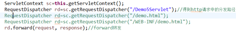
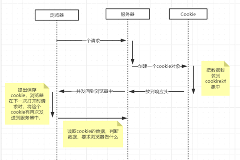

<!-- more -->

## 配置tomcat到eclipse中

a)


b)  


c)


d)


e)


f)


g)


h)


i) 双击并改动端口号


j) 启动成功


k) 运行页面时f12打开调试窗口


l)  


m)


> 页面的响应事件需要和后台的java代码关联起来

n)  Servlet是sun用来开发动态web资源的技术，在开发的api中提供了servlet接口，约定俗成把实现了servlet接口的java类称之为servlet，用户想要开发java代码去响应页面动作需要完成两个步骤

​        i.     编写一个java类实现一个servlet接口

​        ii.     把开发好的java类部署到web服务器中

### o)   缓缓开发过程

​        i. 

​        ii. 

​       iii. 

​       iv. 

判定是浏览器请求服务器的资源时，第一个url的斜杠，代表服务器，斜杠后的第一个单词是服务器下挂在的application，第二个斜杠后才是application下面具体的业务java代码（servlet）


拷贝servlet的全路径名


按照一一映射关系，对xml文件进行配置，将刚才拷贝的路径搞进去


### p) 速速开发过程

​        v. 

​       vi. 

​       vii. 

​      viii. 

​       ix. 写业务代码

​        x. 检查是否配置完整

## 资源路径详解（URL统一资源定位符）

### 1、url 进入服务器后，先进web.xml进行匹配，没有匹配时进入webapp 目录进行页面名称匹配，如果都没有，返回 404

### 2、WEB-INF目录下，无法通过浏览器直接输入资源定位访问，这里是绝对安全的，只能是服务器内部访问该WEB-INF目录下的资源

### 3、浏览器访问服务器资源

​        i.     / 代表服务器

​        ii.     任何访问路径建议在最头部都加上 /

​       iii.     多个不同映射可以访问同一个资源


​       iv.     *通配符

> *.扩展名*.do *.action …
>
> / 开头  以 / *结尾  /* /login/* …

​        v.     案例练习

1. 对于如下的一些映射关系：
    　Servlet1 映射到 /abc/*
    　Servlet2 映射到 /*
    　Servlet3 映射到 /abc
    　Servlet4 映射到 *.do
    问题：
    　当请求URL为“/abc/a.html”，“/abc/*”和“/*”都匹配，哪个servlet响应
      　Servlet引擎将调用Servlet1。
    　当请求URL为“/abc”时，“/abc/*”和“/abc”都匹配，哪个servlet响应
      　Servlet引擎将调用Servlet3。
    　当请求URL为“/abc/a.do”时，“/abc/*”和“*.do”都匹配，哪个servlet响应
      　Servlet引擎将调用Servlet1。
    　当请求URL为“/a.do”时，“/*”和“*.do”都匹配，哪个servlet响应
      　Servlet引擎将调用Servlet2。
    　当请求URL为“/xxx/yyy/a.do”时，“/*”和“*.do”都匹配，哪个servlet响应
      　Servlet引擎将调用Servlet2

2. 原则，谁像选谁

### 4、 服务器内部访问服务器资源

​        i.     / 代表项目名称

## Servlet的生命周期（单线程）

### 线程问题

servlet只会被初始化一次，没有特别处理的情况下，不应该在成员变量处放置可以被改变值的成员变量，线程处理方式有两种，加锁，交给框架


### 描述流程

web服务器接收到客户端的servlet访问请求

​        i.     Web容器首先检查是否已经装载了该servlet的实例对象，如果没有执行ii，如果有执行iv

​        ii.     实例化一个servlet并加载到服务器中的集合中存储

​       iii.     调用servlet的init方法

​       iv.     服务器创建一个用于封装http请求消息的HttpServeltRequest对象和一个代表http响应消息的HTTPServletResponse对象，接着调用servlet的service方法，并把request和response作为参数传递进去

​        v.     Web应用程序在被卸载或者停止之前，会卸载servlet引擎，并且在卸载引擎之前会调用servlet的destory（）方法

> 运用forward方法只能重定向到同一个Web应用程序中的一个资源。而sendRedirect方法可以让你重定向到任何URL。

## Servletconfig

在 servlet 的配置文件 web.xml 中，可以使用多个 \<init-param> 标签，作为 servlet 初始化的参数，是写在 \<servlet> 标签里面

1、配置web.xml中的init-param.


2、完成servlet的config初始化.


3、完成业务开发.


## Servletcontext

1、Servletcontext代表当前应用，web容器在启动的时候，会给每个应用都创建一个servletcontext对象，context的引用被config持有（维护），可以通过config.getContext的方式获取context对象，由于所有servlet都使用同一个context，通常用来做通讯使用，可称为context域


2、context 做 servlet 的通讯域


3、

4、

5、如何在配置中给整个web应用做配置呢？  从配置文件中读取context配置


6、Context如何实现两个servlet的跳转功能？RequestDispatcher




7、读取文本内容

```java
 protected void doGet(HttpServletRequest request, HttpServletResponse response) throws ServletException, IOException {
//  method1();
//  method2();
//  method3();
  method4();
 }
 //类装载器读取资源文件
 //TODO  jvm高级
 //webapp
 private void method4()throws IOException{
  //servlet.prop.properties
  Properties prop=new Properties();
  //获取文件输入流
  InputStream in=this.getServletContext().getResourceAsStream("/prop.properties");
  prop.load(in);
  String name=prop.getProperty("name");
  System.out.println(name);
 }
 //src
 private void method3()throws IOException{
  //servlet.prop.properties
  Properties prop=new Properties();
  //获取文件输入流
  InputStream in=this.getServletContext().getResourceAsStream("/WEB-INF/classes/prop.properties");
  prop.load(in);
  String name=prop.getProperty("name");
  System.out.println(name);
 }
 //com.demo
 private void method2()throws IOException{
  //servlet.prop.properties
  Properties prop=new Properties();
  //获取文件输入流
  InputStream in=this.getServletContext().getResourceAsStream("/WEB-INF/classes/com/demo/prop.properties");
  prop.load(in);
  String name=prop.getProperty("name");
  System.out.println(name);
 }
 //j2ee.servlet
 private void method1() throws IOException{
  //servlet.prop.properties
  Properties prop=new Properties();
  //获取文件输入流
  InputStream in=this.getServletContext().getResourceAsStream("/WEB-INF/classes/com/j2ee/servlet/prop.properties");
  prop.load(in);
  String name=prop.getProperty("name");
  System.out.println(name);
 }

```

8、类似这样的代码


## Request与response


分析项目案例核心：

​        i.     Request：url的解析，url跳转，url的传参，表单传参

​        ii.     Response：服务器命令浏览器基于某些规范，做规定资源内容（命令浏览器做事-显示网页，播放mp3，显示图片，下载文件，定时器自动跳转页面…）

​       iii.     涉及到的板块关联越多，规范越多，该板块就越重要，建议前期花时间解决—举例：response

### Response

<https://www.cnblogs.com/zhangyinhua/p/7629221.html>

　getMethod();   获得请求方式

　getRequestURL();  返回客户端发出请求时的完整URL。

　getRequestURI();  返回请求行中的资源名部分。

　getContextPath();  当前应用的虚拟目录

　getQueryString() ;  返回请求行中的参数部分。

### Response案例

​       iv.     字节字符流输出数据

​        v.     中文乱码处理

​       vi.     定时自动刷新

​       vii.     下载图片

​      viii.     下载文件中文乱码处理

​       ix.     随机图片

​        x.     验证码

​       xi.     重定向

​       xii.     防盗链

​      xiii.     压缩处理

r)   Request案例

### Request

#### RequestDemo01

```java
package com.j2ee.servlet.request;

import java.io.IOException;
import java.io.PrintWriter;

import javax.servlet.ServletException;
import javax.servlet.http.HttpServlet;
import javax.servlet.http.HttpServletRequest;
import javax.servlet.http.HttpServletResponse;

/**
 * 通过request对象获取客户端请求信息
 * 　getRequestURL方法返回客户端发出请求时的完整URL。
　getRequestURI方法返回请求行中的资源名部分。
　getQueryString 方法返回请求行中的参数部分。
　getPathInfo方法返回请求URL中的额外路径信息。额外路径信息是请求URL中的位于Servlet的路径之后和查询参数之前的内容，它以“/”开头。
　getRemoteAddr方法返回发出请求的客户机的IP地址。
　getRemoteHost方法返回发出请求的客户机的完整主机名。
　getRemotePort方法返回客户机所使用的网络端口号。
　getLocalAddr方法返回WEB服务器的IP地址。
　getLocalName方法返回WEB服务器的主机名。
 */
public class RequestDemo01 extends HttpServlet {

 public void doGet(HttpServletRequest request, HttpServletResponse response) throws ServletException, IOException {
  /**
   * 1.获得客户机信息
   */
  String requestUrl = request.getRequestURL().toString();//得到请求的资源
  String requestUri = request.getRequestURI().toString();//得到请求的url地址
  String queryStrig = request.getQueryString();//得到请求的URL地址中附带的参数
  String remoteAdd = request.getRemoteAddr();//得到访问记得ip地址
  String remoteHost = request.getRemoteHost();//得到
  int remotePort = request.getRemotePort();
  String remoteUser = request.getRemoteUser();//
  String method  = request.getMethod();//得到请求url地址时使用的请求方法
  String pathInfo = request.getPathInfo();
  String localaddr =request.getLocalAddr();//获取web服务器的ip地址
  String localName = request.getLocalName();//q获取web服务器的主机名
  
  
  //乱码问题
  response.setCharacterEncoding("UTF-8");
  response.setHeader("content-type", "text/html;charset=UTF-8");
  //显示到浏览器
  PrintWriter out = response.getWriter();
  out.write("获取到的客户端的信息如下：");
  out.write("<hr/>");
  out.write("请求的资源："+requestUrl);
  out.write("<br/>");
  out.write("请求的Url地址："+requestUri);
  out.write("<br/>");
  out.write("请求的URL地址中附带的参数："+queryStrig);
  out.write("<br/>");
  out.write("来访问者的ip地址："+remoteAdd);
  out.write("<br/>");
  out.write("来访问者的主机名："+remoteHost);
  out.write("<br/>");
  out.write("使用的端口号："+remotePort);
  out.write("<br/>");
  out.write("remoteUser："+remoteUser);
  out.write("<br/>");
  out.write("请求者使用的请求方式："+method);
  out.write("<br/>");
  out.write("pathInfo："+pathInfo);
  out.write("<br/>");
  out.write("获取web服务器的ip地址："+localaddr);
  out.write("<br/>");
  out.write("获取web服务器的名称："+localName);
  
 }

 public void doPost(HttpServletRequest request, HttpServletResponse response) throws ServletException, IOException {
  doGet(request, response);
 }

}

```

#### RequestDemo02

```java
package com.j2ee.servlet.request;

import java.io.IOException;
import java.io.PrintWriter;
import java.util.Enumeration;
import javax.servlet.ServletException;
import javax.servlet.http.HttpServlet;
import javax.servlet.http.HttpServletRequest;
import javax.servlet.http.HttpServletResponse;
/**
 * 获取客户端请求头信息
 * 客户端请求头：
 * 　getHeader(string name)方法:String 
　　getHeaders(String name)方法:Enumeration 
　　getHeaderNames()方法
 */
public class RequestDemo02 extends HttpServlet {

    public void doGet(HttpServletRequest request, HttpServletResponse response)
            throws ServletException, IOException {
     //设置字符以UTF-8的形式编写到客户端
     response.setCharacterEncoding("UTF-8");
     //要求浏览器怎么做
     response.setHeader("content-type", "text/html;charset=UTF-8");
     PrintWriter out = response.getWriter();
     
     //获取所有的请求头
     Enumeration<String> reqHeadInfos =request.getHeaderNames();
     out.write("获取到客户端的所有请求头信息如下：");
     out.write("<hr/>");
     while(reqHeadInfos.hasMoreElements()) {
      String headName= reqHeadInfos.nextElement();
      //根据请求头的名字获取对应的请求头的值
      String headValue = request.getHeader(headName);
      out.write(headName+":"+headValue);
      out.write("<br/>");//段标签
     }
     out.write("<br/>");//换行
     out.write("获取到客户端的Accept-Encoding请求头的值：");
     out.write("<hr/>");
     //获取Accept-Encoding请求头对应的值
     String value = request.getHeader("Accept-Encoding");
     out.write(value);
     
     //获取指定的值(与上一步结果相同)
     Enumeration<String> e = request.getHeaders("Accept-Encoding");
     while(e.hasMoreElements()) {
      String string = e.nextElement();
      System.out.println(string);
     }
    }

    public void doPost(HttpServletRequest request, HttpServletResponse response)
            throws ServletException, IOException {
        doGet(request, response);
    }

}


```

#### RequestDemo03

```java
package com.j2ee.servlet.request;

import java.io.IOException;
import java.io.UnsupportedEncodingException;
import java.text.MessageFormat;
import java.util.Enumeration;
import java.util.Map;

import javax.servlet.ServletException;
import javax.servlet.http.HttpServlet;
import javax.servlet.http.HttpServletRequest;
import javax.servlet.http.HttpServletResponse;

/**
 * 获取客户端通过Form表单提交上来的参数
 */
public class RequestDemo03 extends HttpServlet {
 @Override
 protected void doGet(HttpServletRequest request, HttpServletResponse response)
   throws ServletException, IOException {
  metchod01(request, response);
 }
 /**
  * getParameter(String)方法(常用)
  * getParameterValues(String name)方法(常用)
  * @param request
  * @param response
  * @throws IOException 
  */
 private void metchod01(HttpServletRequest request, HttpServletResponse response) throws IOException {
  //设置客户端以utf-8编码提交数据，
  request.setCharacterEncoding("UTF-8");
  //获取表单的编号
  String userid = request.getParameter("userid");
  //获取用户名
  String userName = request.getParameter("username");
  //获取密码
  String usesrpass = request.getParameter("userpass");
  //获取性别
  String sex = request.getParameter("sex");
  //获取部门
  String dept = request.getParameter("dept");
  //获取兴趣爱好（多选）
  String[] insts = request.getParameterValues("inst");
  //获取填写的说明信息
  String note = request.getParameter("note");
  //获取隐藏域的内容
  String hiddenField = request.getParameter("hiddenField");
  String str = "";
  /*
   *  获取数组数据的技巧，可以避免insts数组为null时引发的空指针异常错误！
   */
  for(int i=0;insts!=null&&i<insts.length;i++) {
   if(i==insts.length-1) {
    str +=insts[i];
   }else {
    str+=insts[i];
   }
  }
  //
  String htmlStr = "<table>"+
    "<tr><td>填写的编号：</td><td>{0}</td></tr>"+
    "<tr><td>填写的用户名：</td><td>{1}</td></tr>"+
    "<tr><td>填写的密码：</td><td>{2}</td></tr>"+
    "<tr><td>填写的性别：</td><td>{3}</td></tr>"+
    "<tr><td>填写的部门：</td><td>{4}</td></tr>"+
    "<tr><td>填写的兴趣：</td><td>{5}</td></tr>"+
    "<tr><td>填写的说明：</td><td>{6}</td></tr>"+
    "<tr><td>隐藏域的内容：</td><td>{7}</td></tr>"+
    "</table>";
  htmlStr=MessageFormat.format(htmlStr, userid,//
    userName,usesrpass,sex,dept,insts,note,hiddenField);
  response.setCharacterEncoding("UTF-8");
  response.setContentType("text/html;charset=UTF-8");
  response.getWriter().write(htmlStr);
 }
 /**
  * 在服务器端使用getParameterNames获取接收表单参数
  * @param request
  * @param response
  * @throws IOException 
  */
 private void metchod02(HttpServletRequest request, HttpServletResponse response) throws IOException {
  request.setCharacterEncoding("UTF-8");
  response.setCharacterEncoding("UTF-8");
  response.setHeader("content-type", "text/html;charsetp=utf-8");
  Enumeration<String> paramNames = request.getParameterNames();
  while(paramNames.hasMoreElements()) {
   String name = paramNames.nextElement();
   String value = request.getParameter(name);
//   System.out.println(name+">"+value);
//   System.out.println(MessageFormat.format("{0}={1}", name,value));
   response.getWriter().write(MessageFormat.format("{0}={1} <br/>", name,value));
  }
  
 }

 /**
  *  使用map获取表单值
  * @param request
  * @param response
  * @throws IOException
  */
 private void metchod03(HttpServletRequest request, HttpServletResponse response)
   throws IOException {
  // 设置字符编码
  response.setCharacterEncoding("UTF-8");
  request.setCharacterEncoding("UTF-8");
  response.setHeader("content-type", "text/html;charset=utf-8");
  // 获取封装对象
  Map<String, String[]> paramMap = request.getParameterMap();
  for (Map.Entry<String, String[]> entry : paramMap.entrySet()) {
   String paramName = entry.getKey();
   String paramValue = "";
   String[] paramValueArr = entry.getValue();
   for (int i = 0; paramValueArr != null && i < paramValueArr.length; i++) {
    if(i==paramValueArr.length-1) {
     paramValue+=paramValueArr[i];
    }else {
     paramValue+=paramValueArr[i]+"";
    }
    
   }
//   System.out.println(paramName+">"+paramValue);
//   System.out.println(MessageFormat.format("{0}={1}", paramName,paramValue));
   response.getWriter().write(MessageFormat.format("{0}={1} <br/>", paramName,paramValue));
  }

 }

 @Override
 protected void doPost(HttpServletRequest request, HttpServletResponse response)
   throws ServletException, IOException {
  doGet(request, response);
 }

}

```

#### RequestDemo04

```java
package com.j2ee.servlet.request;

import java.io.IOException;
import javax.servlet.ServletException;
import javax.servlet.http.HttpServlet;
import javax.servlet.http.HttpServletRequest;
import javax.servlet.http.HttpServletResponse;

public class RequestDemo04 extends CharcaterServlet {
 //request与response已经被乱码解决方案解决好勒
 protected void doGet(HttpServletRequest request, HttpServletResponse response) throws ServletException, IOException {
  String name = request.getParameter("username");
  System.out.println("RequestDemo04>>>"+name);
  //转发 传递数据转发之前设值
  request.setAttribute("name", name);
  request.getRequestDispatcher("/RequestDemo05").forward(request, response);
 }
 
 protected void doPost(HttpServletRequest request, HttpServletResponse response) throws ServletException, IOException {
  doGet(request, response);
 }

}

```

#### RequestDemo05

```java
package com.j2ee.servlet.request;

import java.io.IOException;
import javax.servlet.ServletException;
import javax.servlet.http.HttpServlet;
import javax.servlet.http.HttpServletRequest;
import javax.servlet.http.HttpServletResponse;

public class RequestDemo05 extends HttpServlet {
 protected void doGet(HttpServletRequest request, HttpServletResponse response) throws ServletException, IOException {
  String name = (String) request.getAttribute("name");
  System.out.println("RequestDemo05>>>"+name);
 }
 protected void doPost(HttpServletRequest request, HttpServletResponse response) throws ServletException, IOException {
  doGet(request, response);
 }

}

```

#### CharcaterServlet

```java
package com.j2ee.servlet.request;

import java.io.IOException;

import javax.servlet.ServletException;
import javax.servlet.ServletRequest;
import javax.servlet.ServletResponse;
import javax.servlet.http.HttpServlet;
import javax.servlet.http.HttpServletRequest;
import javax.servlet.http.HttpServletRequestWrapper;
import javax.servlet.http.HttpServletResponse;

/**
 *自定义框架真实现完全乱码处理
 * @author 18285
 *
 */
//自定义框架真实现完全乱码处理
//存储页面html的格式   html打开页面的格式   服务器解析http数据包解析格式  servlet处理request中的数据格式（get，post）
//response中数据需要格式解析  服务器对response数据包格式解析   response规定浏览器格式解析  往数据中写数据需要格式解析
//存入數據庫需要格式解析  读取数据库中数据要格式解析   读出来解析到哪个端口（客户端）需要格式解析 ...  代码文件有存储格式  数据库文件有存储格式
//数据库中有一些配置也含有数据解析的默认值
 
//request从浏览器带服务器，服务器到servlet get与post两种提交方式进行数据解析
public class CharcaterServlet extends HttpServlet {
 private String defalutCharset = "UTF-8";
 //重写service
 @Override
 public void service(ServletRequest req, ServletResponse res) throws ServletException, IOException {
  // ServletRequest 转为  HttpServletRequest
  // ServletResponse 转为  HttpServletResponse
  HttpServletRequest request;
  HttpServletResponse response;
  MyCharServletEncodingRequest requestWrapper;
  try {
   // HttpServletRequest extends ServletRequest
   request = (HttpServletRequest) req;// 接口向下转型
   response = (HttpServletResponse) res;// 接口向下转型

   //初始化编码格式
   String charset = this.getServletConfig().getInitParameter("charset");
   if (charset == null) {
    charset = defalutCharset;
   }
   // requset的post提交解码
   request.setCharacterEncoding(charset);
   //
   response.setHeader("content-type", "text/html;charset=" + charset);
   // 简便写法
   // respose.setContentType("text/html;charset="+charset);

   // request的get提交解码
   // 使用自定义子类，包装原来的HttpServletRequest，需要复写getParameter（）
   requestWrapper = new MyCharServletEncodingRequest(request, charset);
  } catch (Exception e) {
   throw new ServletException("non-HTTP request or response");
  }
  //传入父类的方法service(HttpServletRequest req, HttpServletResponse resp)
  //这个方法是对method的一个判断（get、post）
  service(requestWrapper, response);
 }

 // 使用內部类
 /*
  * 1.实现与被增强对象相同的接口 2、定义一个变量记住被增强对象 3、定义一个构造器，接收被增强对象 4、覆盖需要增强的方法
  * 5、对于不想增强的方法，直接调用被增强对象（目标对象）的方法
  */
 class MyCharServletEncodingRequest extends HttpServletRequestWrapper {
  private HttpServletRequest request;
  private String targetCharset;

  public MyCharServletEncodingRequest(HttpServletRequest request, String targetCharset) {
   super(request);
   this.request = request;
   this.targetCharset = targetCharset;
  }

  /**
   * 重写getParameter方法 ServletRequestWrapper>>>getParameter()
   */
  @Override
  public String getParameter(String name) {
   try {
    // 获取参数的值
    String value = this.request.getParameter(name);
    if (null == value) {
     return null;
    }
    // 如果不是以get方式提交数据的，就直接返回获取到的值
    if (!this.request.getMethod().equalsIgnoreCase("get")) {
     return value;
    } else {
     // 如果是以get方式提交数据的，这就直接返回获取到值
     value = new String(value.getBytes(targetCharset), this.request.getCharacterEncoding());
     return value;
    }
   } catch (Exception e1) {
    throw new RuntimeException(e1);
   }
  }
 }
}
```

## Cookie-response层面

<https://www.cnblogs.com/muzongyan/archive/2010/08/30/1812552.html>

<https://www.cnblogs.com/xdp-gacl/p/3803033.html>

<https://www.cnblogs.com/whgk/p/6422391.html>

s)   创建cookie打开一个浏览器就是一个cookie

t)   如何向客户端写Cookie：  CookieDemo01

u)   服务器如何得到客户端传来的Cookie  CookieDemo02  Cookie[] getCookies() 获取浏览器发来的信息（name=value）


设置生命周期：以秒为单位


v)   读取cookie

 

使用cookie记录用户上一次访问的时间：CookieDemo01

w)  删除cookie

 

x)   cookie中存取中文

 

y)   api

 

z)   中文存储使用


aa)  使用场景

记住用户名、历史记录、登录状态信息记录（在浏览器中）

bb) 执行流程



## Session


总结：

数据保存在客户端的Cookie技术
数据保存在服务端的Session技术

上传、下载、拦截

## Filter过滤、拦截

 

对web服务器管理的所有web资源：例如Jsp, Servlet,

静态图片文件或静态 html 文件等进行拦截，从而实现一些特殊的功能。

> 例如实现URL级别的权限访问控制、过滤敏感词汇、压缩响应信息等一些高级功能。

服务器初始化时filter就初始化了

Filter接口中有一个doFilter方法，当我们编写好Filter，并配置对哪个web资源进行拦截后，

WEB服务器每次在调用web资源的service方法之前，都会先调用一下filter的doFilter方法，

因此，在该方法内编写代码可达到如下目的：

> 调用目标资源之前，让一段代码执行。
>
> 是否调用目标资源（即是否让用户访问web资源）。
>
> 调用目标资源之后，让一段代码执行。

Filter开发步骤：

> 编写java类实现Filter接口，并实现其doFilter方法。
>
> 在 web.xml 文件中使用\<filter>和\<filter-mapping>元素对编写的filter类进行注册，并设置它所能拦截的资源

## Jsp

动态页面，就是服务器向浏览器写html文件，里面的变量可以根据实际应用场景进行改变

### Jsp 9大内置对象

request、response、session、application、out、pageContext、config、page和exception；

### jsp 7大动作

include、useBean、getProperty、setProperty、param、forward、plugin

### jsp跟servlet的关系

jsp经编译后就变成了servlet，所以说jsp本质就是servlet，jvm只能识别java的类，不能识别jsp代码，web容器将jsp的代码编译成jvm能够识别的java类。
