分布式锁、缓存

<!-- more -->

# 缓存一致性

1. 双写模式：写数据库，写缓存
2. 失效模式：缓存失效（删除缓存），写数据库

> 读取缓存步骤数据一致性一般没有什么问题，但是一旦涉及到数据更新：数据库和缓存更新，就容易出现**缓存(Redis)和数据库（MySQL）间的数据一致性问题**。
>
> 不管先保存到MySQL，还是先保存到Redis都面临着一个保存成功而另外一个保存失败的情况。
>
> 不管是先写MySQL数据库，再删除Redis缓存；还是先删除缓存，再写库，都有可能出现数据不一致的情况。举一个例子：
>
> 1.如果删除了缓存Redis，还没有来得及写库MySQL，另一个线程就来读取，发现缓存为空，则去数据库中读取数据写入缓存，此时缓存中为脏数据。
>
> 2.如果先写了库，在删除缓存前，写库的线程宕机了，没有删除掉缓存，则也会出现数据不一致情况。
>
> 因为写和读是并发的，没法保证顺序,就会出现缓存和数据库的数据不一致的问题。

## 解决

### 1 基于mysql的binlog日志（canal）

### 2 消息队列MQ

# 1、本地缓存&分布式缓存

## 1.1 使用场景

```bash
即时性（物流状态信息，更新慢）；
数据一致性不高的（导航菜单数据、比较固定的数据）；
访问量大且更新频率不高的数据（读多、写少）；

#举例: 电商类应用，商品分类，商品列表等适合缓存并加一个失效时间(根据数据更新频率来定)，后台如果发布一一个商品，买家需要5分钟才能看到新的商品般还是可以接受的。
```

## 1.2 使用流程

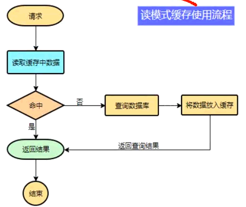

## 1.3 简单实例格式

```java
data = cache.load(id);//从缓存加载数据
lf(data == nul){
 data = db.load(id);//从数据库加载数据
 cache.put(id,data);//保存到cache中，添加过期时间
}
retum data;
```

## 1.4 本地缓存

Map<String,Object>：在多分布式部署实例时会存在：各自使用自己的本地缓存

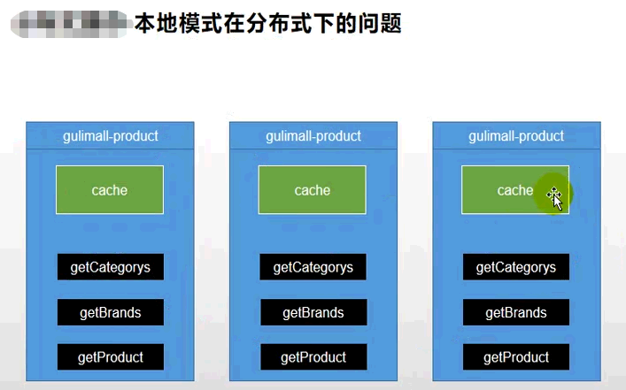

​ 解决办法：分布式缓存

## 1.5 分布式缓存

### 1.5.1 缓存穿透 <a name="缓存穿透"/>

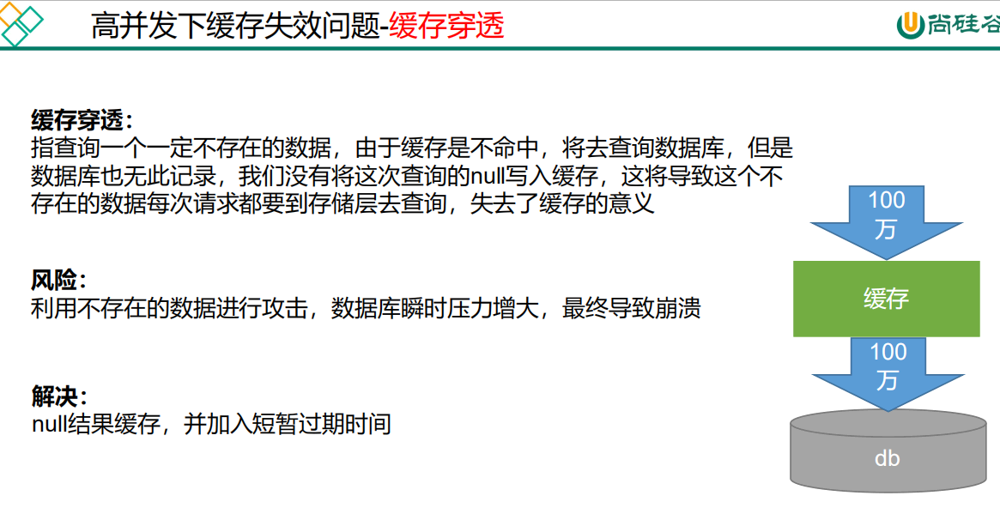

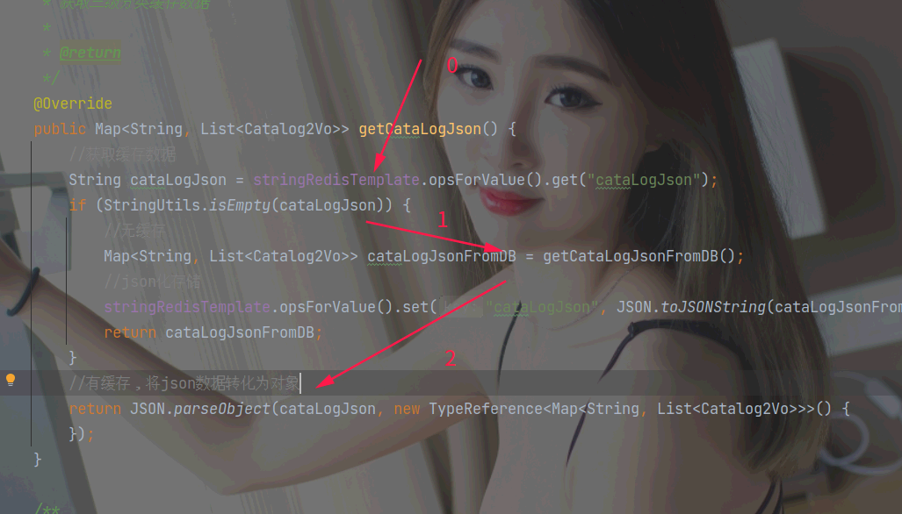

> （[缓存、DB]都不存在数据）1000万条并发请求，缓存为null，全部跑到db查询，db可能直接宕机。

### 1.5.2 缓存雪崩 <a name="缓存雪崩"/>

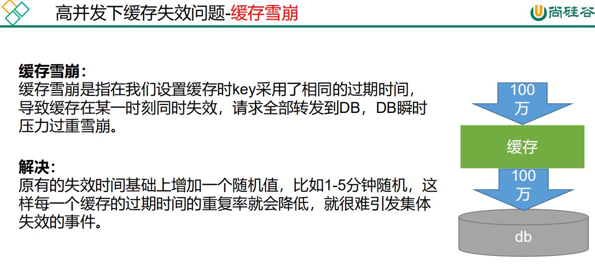

> 存在的数据，大面积数据同时失效)已经有很多数据存在，但有一些设置了同样的过期时间，导致了很多没命中。

### 1.5.3 缓存击穿 <a name="缓存击穿"/>

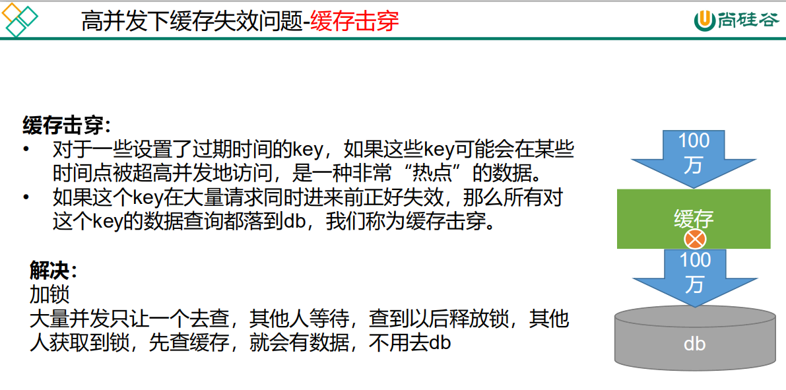

> （存在的数据，某一个数据热点失效）1000万条并发，，会全部跑到db查询，db可能直接宕机。

### 1.5.4 缓存穿透、击穿、雪崩的区别

#### 1.穿透是缓存不命中，DB也没有不命中

#### 2.击穿是一个热点key失效

#### 3.雪崩是很多key集体失效

## 1.6 总结

### 1.6.1、**解决缓存穿透：空结果缓存**

> .set("cataLogJson", cataLogJsonDB == null ? "1001" : cataLogJsonDB));

### 1.6.2、**解决缓存雪崩：设置过期时间(加随机值) 。存在的数据，大面积数据同时失效**

> .set("cataLogJson", JSON.toJSONString(cataLogJsonFromDB == null ? "1001" : cataLogJsonFromDB), 1, TimeUnit.DAYS);

### 1.6.3、**解决缓存击穿【难点】：加锁，存在的数据，某一个数据热点失效**

> 通过redis ...

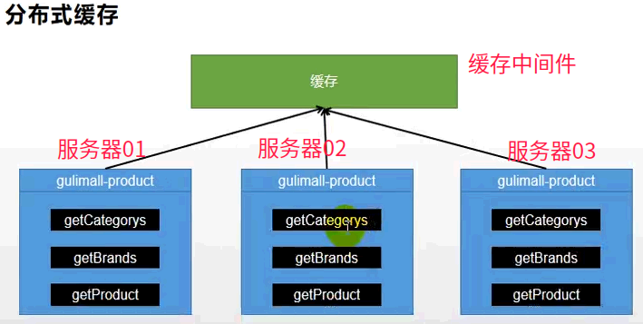

# 2、分布式锁+redis 配置

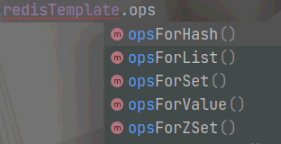

博客地址：<https://blog.csdn.net/qq_42476834/article/details/125108089>

## 2.1 业务测试

```java
@Override
public Map<String, List<Catalog2Vo>> getCataLogJson() {
    //获取缓存数据
    String cataLogJson = stringRedisTemplate.opsForValue().get("cataLogJson");
    if (StringUtils.isEmpty(cataLogJson)) {
        //无缓存
        Map<String, List<Catalog2Vo>> cataLogJsonFromDB = getCataLogJsonFromDB();
        //json化存储
        stringRedisTemplate.opsForValue().set("cataLogJson", JSON.toJSONString(cataLogJsonFromDB), 60 * 60 * 12, TimeUnit.SECONDS);
        return cataLogJsonFromDB;
    }
    //有缓存，将json数据转化为对象
    return JSON.parseObject(cataLogJson, new TypeReference<Map<String, List<Catalog2Vo>>>() {});
}
```

测试：<http://yumall.com/>

无缓存--时间：40

有缓存-----时间：1

## 2.2 压力测试与bug解决

```xml
//TODO产生堆外内存溢出:
OutOfDirectMemoryError
//1)、springboot2 . e以后默认使用lettuce作为操作redis的客户端。它使用netty进行网络通信。
//2)、lettuce的bug导致netty堆外内存溢出-Xmx300m; netty如果没有指定堆外内存，默认使用-Xmx300m
//可以通过 -Dio. netty . maxDirectMemory进行设置
//解决方案:不能使用-Dio. netty. maxDirec tMemory只去调大堆外内存。
//1)、升级Lettuce客户端。2) 、切换使用jedis
//redisTemplate:
//lettuce、jedis操作redis的底层客户端。Spring再次封装redis Template;

  <dependency>
            <groupId>org.springframework.boot</groupId>
            <artifactId>spring-boot-starter-data-redis</artifactId>
            <exclusions>
                <exclusion>
                    <groupId>io.lettuce</groupId>
                    <artifactId>lettuce-core</artifactId>
                </exclusion>
            </exclusions>
        </dependency>
        <dependency>
            <groupId>redis.clients</groupId>
            <artifactId>jedis</artifactId>
        </dependency>
```

## 2.3 加锁解决`缓存击穿`

单体：本地锁在分布式

//只要是同一把锁，就能锁住需要这个锁的所有线程
//1、synchronized (this): SpringBoot所有的组件在容器中都是单例的。

```java
getCataLogJsonFromDB() -> 
 synchronized (this) {//单体架构是没问题的，分布式就不行了
     String cataLogJson = stringRedisTemplate.opsForValue().get("cataLogJson");
            if (!StringUtils.isEmpty(cataLogJson)) {
                return JSON.parseObject(cataLogJson, new TypeReference<Map<String, List<Catalog2Vo>>>() {
                });
            }
     System.out.println("synchronized---查询了数据库");       
     //之前业务
```

模拟并发80：*没有锁住*

```
..........无缓存，..........无缓存，..........无缓存，..........无缓存，..........无缓存，..........无缓存
synchronized---查询了数据库
synchronized---查询了数据库
..........无缓存，..........无缓存，..........无缓存，... ...
```

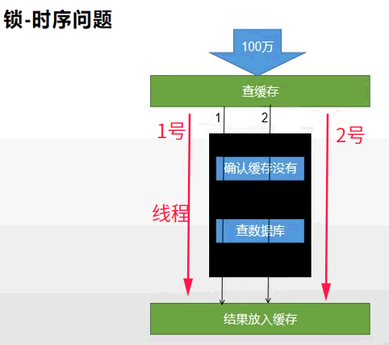

解决：

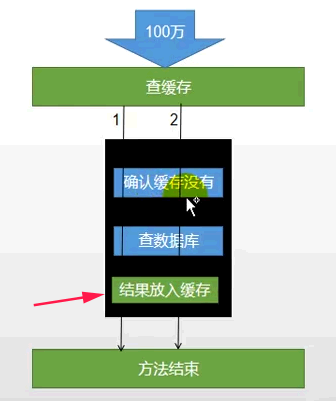

```java
return getCataLogJsonFromDB之前加入缓存：
    stringRedisTemplate.opsForValue().set("cataLogJson", JSON.toJSONString(collect1 == null ? "101" : collect1), RedisUtils.AUTOSECONDS() * 60 * 24, TimeUnit.SECONDS);
            return collect1;
```

测试80结果：查询数据库放入缓存

```
..........无缓存
..........无缓存
..........无缓存
..........无缓存
..........无缓存
synchronized---查询了数据库
..........无缓存
..........无缓存
有缓存........
有缓存........
有缓存........
有缓存........
```

## 2.4 本地锁在分布式服务

模拟多台服务器的商品服务，端口不一: --server.port=8101, 8102, 8103

发现：本地锁将只是对与本实例起作用。

解决：分布式锁

## 2.5 分布式锁原理&使用

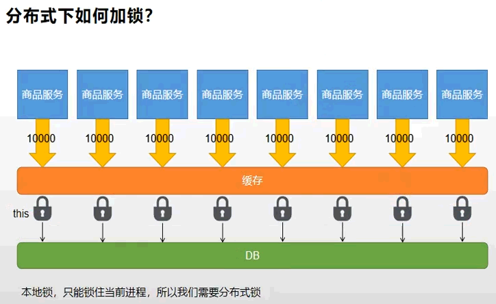

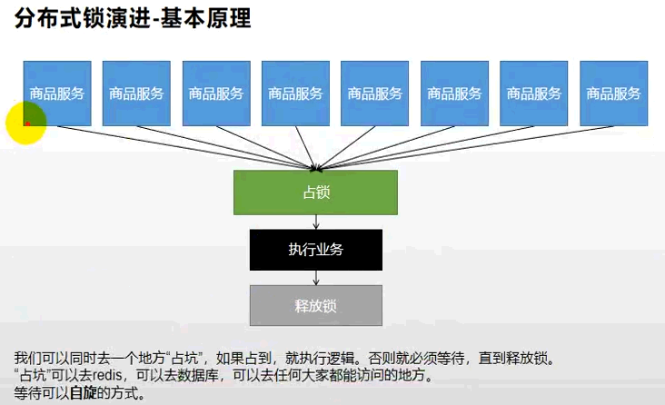

### 2.5.1 redis锁

文档：<http://redis.cn/commands.html>

SET命令 [key value]

```bash
    EX seconds – 设置指定的过期时间，以秒为单位
    PX 毫秒 – 设置指定的过期时间，以毫秒为单位。 
    NX –仅在密钥不存在时才设置密钥。 
    XX – 仅设置已存在的密钥。 
    EX seconds – 设置键key的过期时间，单位时秒
    PX milliseconds – 设置键key的过期时间，单位时毫秒
    NX – 只有键key不存在的时候才会设置key的值
    XX – 只有键key存在的时候才会设置key的值
set lock haha NX 
set lock haha XX 
```

### 2.5.2 简单的业务+分析

#### A、测试问题1：setnx占好了位，业务代码异常或者程序在页面过程中宕机。没有执行删除锁逻辑，这就造成了死锁

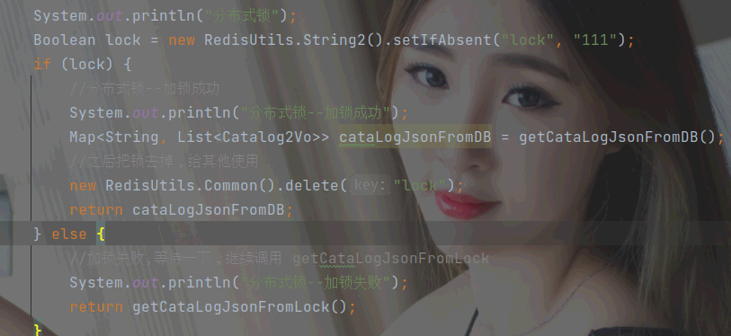

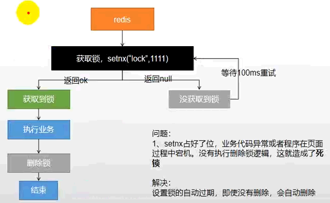

##### - - 解决: 设置锁的自动过期，即使没有删除，会自动删除

---

#### B、测试问题2：setnx设置好， 正要去设置过期时间，宕机。又死锁了

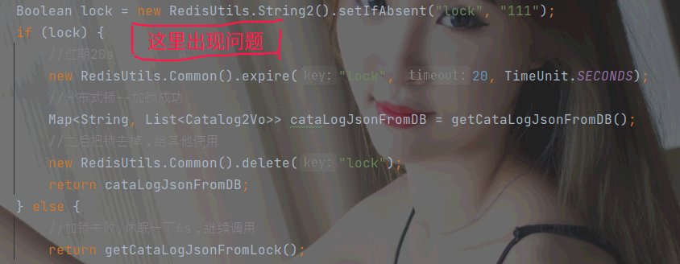

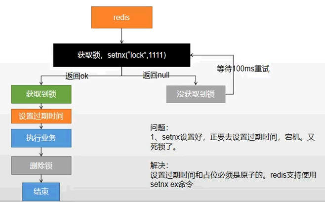

##### - - 解决: 设置过期时间和占位必须是原子的。redis支持使用setnx ex命令

---

#### C、测试问题3（加锁原子型）：删除锁直接删除？？? 如果由于业务时间很长（*超时*），锁自己过期了，我们直接删除，有可能把别人正在持有的锁删除了

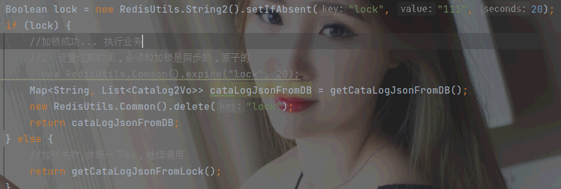

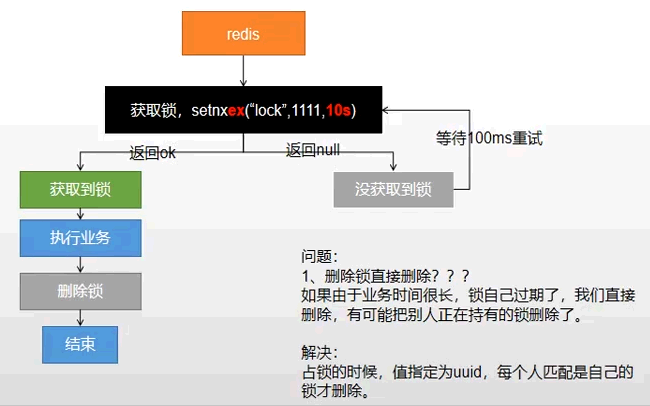

##### - - 解决: 占锁的时候，值指定为uuid,每个人匹配是自己的锁才删除

---

#### D、 测试问题4：占锁时指定为uuid,每个人匹配是自己的锁才删除。如果正好判断是当前值，正要删除锁的时候，锁已经过期了，别人已经设置到了新的值，那么我们删除的就是别人的锁了

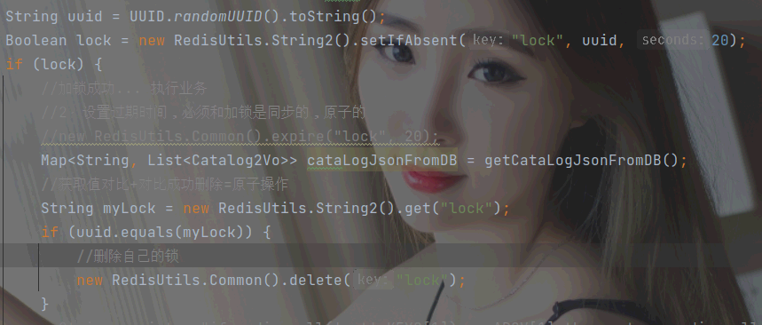

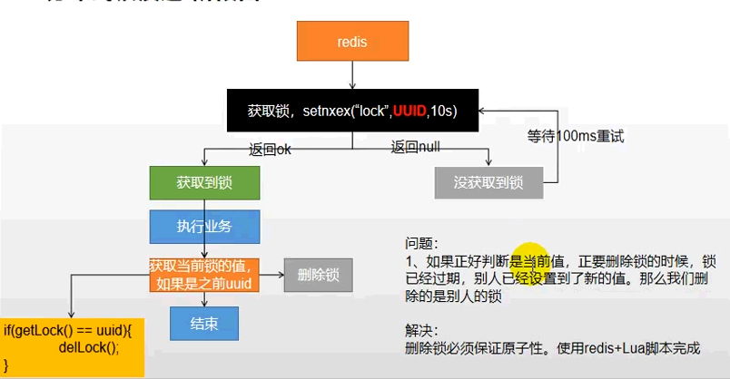

##### - - 解决: lua脚本解锁

---

#### E、 测试问题5：lua脚本解锁（最终形态）

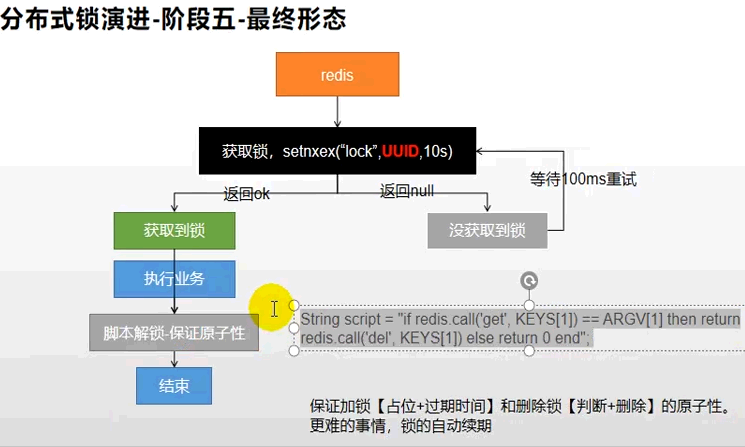

## 2.6 完整业务实例

```java
public Map<String, List<Catalog2Vo>> getCataLogJson2() {
        //获取缓存数据
        String cataLogJson = RedisUtils.String2.get("cataLogJson");
        if (StringUtils.isEmpty(cataLogJson)) {
            //无缓存
            return getCataLogJsonFromRedisLock();
        }
}

public Map<String, List<Catalog2Vo>> getCataLogJsonFromRedisLock() {
        String uuid = UUID.randomUUID().toString();
        Boolean lock = RedisUtils.String2.setIfAbsent("lock", uuid, 20);
        if (lock) {
            //System.out.println("获取分布式锁--成功");
            Map<String, List<Catalog2Vo>> cataLogJsonFromDB = null;
            try {
                //加锁成功... 执行业务
                cataLogJsonFromDB = getCataLogJsonFromDB();
            } finally {
                //获取值对比+对比成功删除=原子操作,lua脚本解锁
                String script = "if redis.call('get',KEYS[1]) == ARGV[1] then return redis.call('del',KEYS[1]) else return 0 end";
                Long lock1 = RedisUtils.redisTemplate().execute(new DefaultRedisScript<Long>(script, Long.class),Collections.singletonList("lock"), uuid);
            }
            return cataLogJsonFromDB;
        } else {
            System.err.println("获取分布式锁------失败");
            //加锁失败,休眠一下6s，继续调用
            try {
                Thread.sleep(200);
            } catch (Exception e) {
            }
            return getCataLogJsonFromRedisLock();
        }
    }
```

## **发现加锁与解锁重复，把他提出来到工具类，但分布式框架有成型产品《RedisSon 整合》**

# 3、分布式锁 RedisSon

<https://redis.io/topics/distlock>

## 3.1. RedisSon 整合

### - - 依赖

```xml
  <dependency>
            <groupId>org.redisson</groupId>
            <artifactId>redisson</artifactId>
            <version>3.12.0</version>
        </dependency>
```

### - - 配置

文档：<https://github.com/redisson/redisson/wiki>

```java
/**
 * destroyMethod = close/shutdown
 *
 * @return
 */
@Bean(destroyMethod = "shutdown")
public RedissonClient redisSon() {
    // 默认连接地址 127.0.0.1:6379
    Config config = new Config();
    config.useSingleServer().setAddress("redis://127.0.0.1:6379");
    RedissonClient redisson = Redisson.create(config);
    return redisson;
}
```

### - - 测试

```java
@Autowired
private RedissonClient redissonClient;

@Test
public void getInstance() {
    System.out.println(redissonClient);//org.redisson.Redisson@7037a680
}


异常：Redis url should start with redis:// or rediss:// (for SSL connection)
解决：config.useSingleServer().setAddress("redis://127.0.0.1:6379");
```

## 3.2. RedisSon-lock 锁测试

### - - 简单测试

```java
 //1、获取一把锁，只要锁的名字一样，就是同一把锁
        RLock lock = RedisUtils.redisson().getLock("my-lock");
        /*
        2、加锁、阻塞式等待，默认30s
        锁的自动续期，如果业务超长，运行期间自动给锁续上新的30s。不用担心业务时间长，锁自动过期被删掉。
        2)、加锁的业务只要运行完成，就不会给当前锁续期，即使不手动解锁，锁默认在30s以后自动删除。
        */
        lock.lock();
        try {
            System.out.println("加锁完成，业务处理中......." + Thread.currentThread().getId());
            Thread.sleep(20000);
        } catch (InterruptedException e) {
        } finally {
            System.out.println("释放锁..." + Thread.currentThread().getId());
            lock.unlock();
        }
```

### lock特点

加锁、阻塞式等待。
锁的自动续期，如果业务超长，运行期间自动给锁续上新的30s。不用担心业务时间长，锁自动过期被删掉。
加锁的业务只要运行完成，就不会给当前锁续期，即使不手动解锁，锁默认在30s以后自动删除。

## 3.3. RedisSon-lock 看门狗原理

## 3.4. RedisSon 读写锁 ReadWriteLock

### - - 测试

```java
/**
 * 保证一定能读到最新数据,修改期间，写锁是-个排他锁(互斥锁)。读锁是一个共享锁<p>
 * 写锁没释放读就必须等待
 *
 * @return uuid
 */
@GetMapping("/write")
@ResponseBody
public String writeValue() {
    RReadWriteLock lock = RedisUtils.redisson().getReadWriteLock("rw-lock");
    String uuid = "";
    RLock rLock = lock.writeLock();
    try {
        //1、改数据加写锁，读数据加读锁
        rLock.lock();
        System.out.println("写锁--加锁成功... " + Thread.currentThread().getId());
        uuid = UUID.randomUUID().toString();
        Thread.sleep(30000);
        RedisUtils.String2.set("writeValue", uuid);
    } catch (Exception e) {
        e.printStackTrace();
    } finally {
        rLock.unlock();
        System.out.println("写锁--释放" + Thread.currentThread().getId());
    }
    return uuid;
}

/**
 * @return
 */
@GetMapping("/read")
@ResponseBody
public String readValue() {
    RReadWriteLock lock = RedisUtils.redisson().getReadWriteLock("rw-lock");
    String uuid = "";
    RLock rLock = lock.readLock();
    try {
        //1、改数据加写锁，读数据加读锁
        rLock.lock();
        System.out.println("读锁--加锁成功... " + Thread.currentThread().getId());
        uuid = UUID.randomUUID().toString();
        Thread.sleep(30000);
        RedisUtils.String2.get("writeValue");
    } catch (Exception e) {
        e.printStackTrace();
    } finally {
        rLock.unlock();
        System.out.println("读锁--释放" + Thread.currentThread().getId());
    }
    return uuid;
}
```

### - - 结论

```
* 保证一定能读到最新数据，修改期间，写锁是一个排他锁 (互斥锁、独享锁)。读锁是一个共享锁
* 写锁没释放读就必须等待
* 读+读:相当于无锁，并发读，只会在redis中记录好， 所有当前的读锁。他们都会同时加锁成功
* 写+读:等待写锁释放
* 写+写:-阻塞方式
* 读+写:有读锁。写也需要等待。
* 只要有写的存在，都必须等待.
```

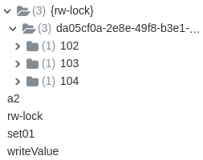

## 3.5. RedisSon 闭锁CountDownLatch 测试

### - - 放假，锁门 测试

```java
/**
 * 闭锁CountDownLatch
 *
 * @return
 * @throws InterruptedException
 */
@GetMapping("/lockDoor")
@ResponseBody
public String lockDoor() throws InterruptedException {
    RCountDownLatch door = RedisUtils.redisson().getCountDownLatch("door");
    door.trySetCount(3);
    door.await(); //等待闭锁都完成
    return "放假了...";
}

@GetMapping("/gogo/{id}")
@ResponseBody
public String gogo(@PathVariable("id") Long id) {
    RCountDownLatch door = RedisUtils.redisson().getCountDownLatch("door");
    door.countDown();//计数减- -;|
    return id + " 班的人都走了...";
}
```

### - - 结论

等待某一事物处理全部业务完成后，在执行某操作

## 3.6. RedisSon 信号量Semaphore 测试

### - - 车库停车测试

```java
/**
 * 进车库停车：A口<p>
 * 车位数-1，获取1个信号，获取1个值,占1个车位.<p>
 * 信号量也可以用作分布式限流;
 */
@GetMapping("/park")
@ResponseBody
public String park() throws InterruptedException {
    RSemaphore park = RedisUtils.redisson().getSemaphore("park");
    park.acquire();//获取1个信号，获取1个值,占1个车位
    boolean b = park.tryAcquire();
    if (b) {
        //执行业务
    } else {
        return "error";
    }
    return "ok=>" + b;
}

/**
 * 出车库：A口<p>
 * 释放1个车位，车位总量+1
 *
 * @return
 * @throws InterruptedException
 */
@GetMapping("/go")
@ResponseBody
public String go() throws InterruptedException {
    RSemaphore park = RedisUtils.redisson().getSemaphore("park");
    park.release();//释放- -个车位
    return "ok";
}
```

## 3.7. RedisSon 缓存一致性解决

### - - 原理：双写模式、失效模式

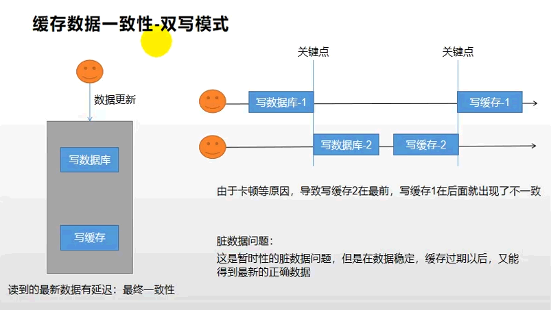

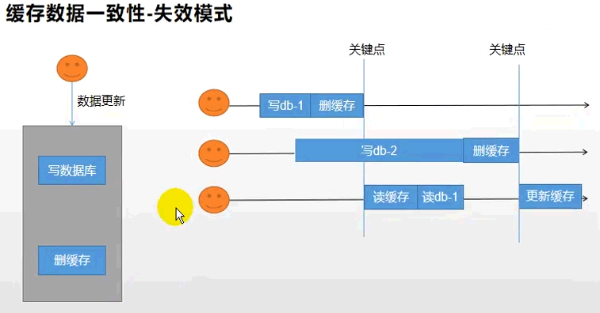

### - - 解决方案

```bash
●无论是双写模式还是失效模式，都会导致缓存的不一致问题。即多个实例同时更新会出事。怎么办?
    ●1、如果是用户纬度数据(订单数据、用户数据)，这种并发几率非常小，不用考虑这个问题，缓存数据加上过期时间，每隔一段时间触发读的主动更新即可
    ●2、如果是菜单，商品介绍等基础数据，也可以去使用 canal 订阅 binlog 的方式。
    ●3、缓存数据+过期时间也足够解决大部分业务对于缓存的要求。
    ●4、通过加锁保证并发读写，写写的时候按顺序排好队。读读无所谓。所以适合使用读写锁。 (业务不关心脏数据，允许临时脏数据可忽略).

●总结:
    ●我们能放入缓存的数据本就不应该是实时性、-致性要求超高的。所以缓存数据的时候加上过期时间，保证每天拿到当前最新数据即可。
    ●我们不应该过度设计，增加系统的复杂性
    ●遇到实时性、一致性要求高的数据，就应该查数据库，即使慢点。
```

### - - Canal

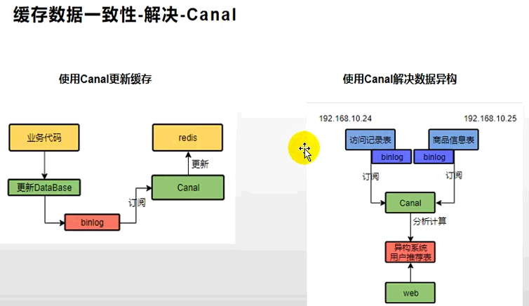

### - - 使用失效模式

我们系统的一致性解决方案:
1、 缓存的所有数据都有过期时间，数据过期下一次查询触发主动更新
2、读写数据的时候，加上分布式的读写锁。
    经常写，经常读

使用SpringCache

## RedissonLock完整业务实例

```java
public Map<String, List<Catalog2Vo>> getCataLogJson2() {
        //获取缓存数据
        String cataLogJson = RedisUtils.String2.get("cataLogJson");
        if (StringUtils.isEmpty(cataLogJson)) {
            //System.out.println("..........无缓存");
            //无缓存
            return getCataLogJsonFromRedissonLock();
        }
        //System.out.println("有缓存........");
        //有缓存，将json数据转化为对象
        return JSON.parseObject(cataLogJson, 。>() {
        });
}
public Map<String, List<Catalog2Vo>> getCataLogJsonFromRedissonLock() {
    //        System.out.println("获取分布式锁--成功");
    Lock lock = RedisUtils.redisson().getLock("cataLogJson-lock");
    Map<String, List<Catalog2Vo>> cataLogJsonFromDB = null;
    try {
        lock.lock();
        cataLogJsonFromDB = getCataLogJsonFromDB();//具体业务
    }catch (Exception e){
        lock.unlock();
    }finally {
        lock.unlock();
    }
    return cataLogJsonFromDB;
}
```

# 4、SpringCache

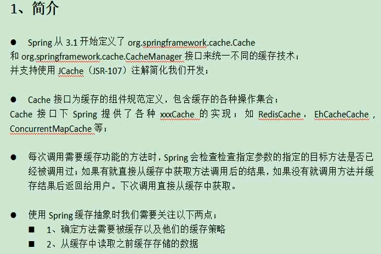

## 4.1. 整合

```bash
8、整合SpringCache简化缓存开发
    1)、引入依赖
     spring-boot-starter-cache、spring-boot-starter-data-redis
    2)、写配置
        (1)、自动配置了哪些
            CacheAuroConfiguration会导入RedisCacheConfiguration;
            自动配好了缓存管理器RedisCacheManager
        (2)、配置使用redis作为缓存
         spring.cache.type=redis #spring.cache.cache-names=qq
    3)、测试使用缓存
        @Cacheable: Triggers cache population.触发缓存填充
        @CacheEvict: Triggers cache eviction.触发缓存驱逐,失效模式使用
        @CachePut: Updates the cache without interfering with the method execution.在不干扰方法执行的情况下更新缓存，双写模式使用
        @Caching: Regroups multiple cache operations to be applied on a method.重新组合要应用于方法的多个缓存操作。
        @CacheConfig: Shares some common cache-related settings at class-level.在类级别共享一些常见的缓存相关设置。
        
  (1)、开启缓存：启动类 @EnableCaching、方法 @Cacheable({"category"})
   Cacheable代表当前方法的结果需要缓存，如果缓存中有，方法不用调用。如果缓存中没有，会调用方法
```

## 4.2. @Cacheable细节设置

@Cacheable(value="myCache")，代表当前方法的结果需要缓存，如果缓存中有，方法不用调用。如果缓存中没有，会调用方法。

```
*  -- key 默认自动生成，缓存名字::SimpleKey []
*  --value 默认使用jdk序列化机制
*  -- -1 数据持久化，
所以：使用自定义缓存设置
```

## 4.3. 自定义缓存设置

指定：key，时间，json化

key，时间:配置文件

```
@Cacheable(value = {"category"}, key = "'level1Categorys'")
@Cacheable(value = {"category"}, key = "#root.method.name")
#1小时
spring.cache.redis.time-to-live=3600000
#spring.cache.redis.key-prefix=CACHE_
spring.cache.redis.use-key-prefix=true
#存储null值，解决缓存穿透问题
spring.cache.redis.cache-null-values=true
```

json化+配置文件时间失效

```java
@EnableConfigurationProperties(CacheProperties.class)
@EnableCaching
@Configuration
public class MyCacheConfig {

    @Bean
    public RedisCacheConfiguration redisCacheConfiguration(CacheProperties cacheProperties) {
        RedisCacheConfiguration config = RedisCacheConfiguration.defaultCacheConfig();
        config = config.serializeKeysWith(RedisSerializationContext.SerializationPair.fromSerializer(new StringRedisSerializer()));
        config = config.serializeValuesWith(RedisSerializationContext.SerializationPair.fromSerializer(new GenericJackson2JsonRedisSerializer()));

//        config = config.entryTtl();
        //将配置文件中的所有配置都生效
        CacheProperties.Redis redisProperties = cacheProperties.getRedis();
        if (redisProperties.getTimeToLive() != null) {
            config = config.entryTtl(redisProperties.getTimeToLive());
        }
        if (redisProperties.getKeyPrefix() != null) {
            config = config.prefixKeysWith(redisProperties.getKeyPrefix());
        }
        if (!redisProperties.isCacheNullValues()) {
            config = config.disableCachingNullValues();
        }
        if (!redisProperties.isUseKeyPrefix()) {
            config = config.disableKeyPrefix();
        }
        return config;
    }
}
```

## 4.4. @CacheEvict+Caching 失效模式使用

@CachEvict 的作用 主要针对方法配置，能够根据一定的条件对缓存进行清空。

### 4.4.1 删除一个

```
@CacheEvict(value = {"category"}, key = "'getLevel1Categorys'")
```

### 4.4.2 删除多个

```
@Caching(evict = {
        @CacheEvict(value = {"category"}, key = "'getLevel1Categorys'"),
        @CacheEvict(value = {"category"}, key = "'getCataLogJson'"),
})
```

```
@CacheEvict(value = {"category"}, allEntries = true)
```

## 4.5. @CachePut 双写模式使用

## 4.6. 原理与不足

```
Spring-Cache的不足;
    1)、读模式:
     缓存穿透:查询一个null数据。解决:缓存空数据，redis.cache-null-values=true
        缓存击穿:大量并发进来同时查询-个正好过期的数据。解决:加锁; 默认是无锁的，sync=true（加锁，解决缓存击穿）
        缓存雪崩:大量的key同时过期。解决:加随机时间。加上过期时间。spring.cache.redis.time-to-live=3600000
    2)、写模式: (缓存与数据库-致)
        1)、读写加锁。
        2)、引入Canal,感知到MySQL的更新去更新数据库
        3)、读多写多，直接去数据库查询就行
```

## 4.7. 总结

**常规数据**：(读多写少，即时性，-致性要求不高的数据) ;完全可以使用Spring-Cache，写模式(只要缓存的数据有过期时间就足够了
**特殊数据**：特殊设计
