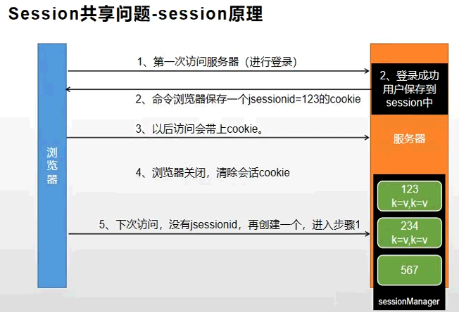
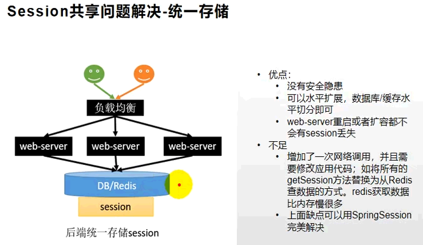
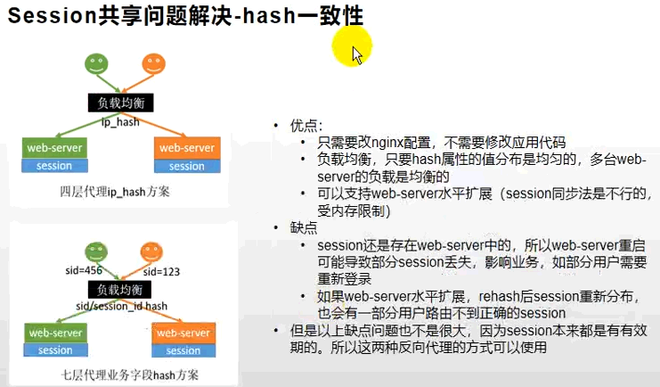
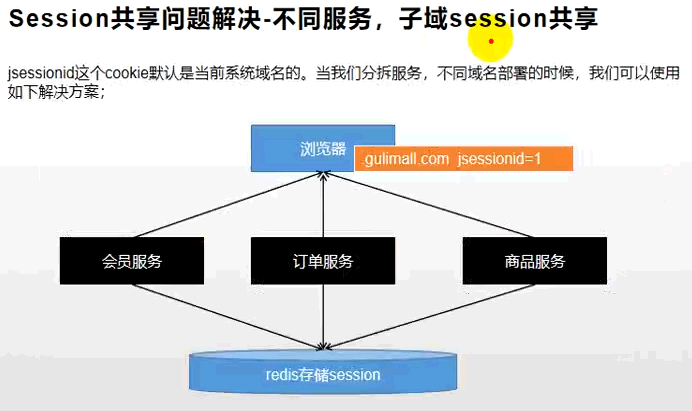

分布式session

<!-- more -->

## 分布式 session

### 7.1 分析



### 7.2 解决session已知弊端





使用第一种，但是存在子域名问题，所以使用SpringSession



### 7.3 开始

#### 7.3.1 依赖、启动类

```xml
<!-- 整合springsession -->
<dependency>
    <groupId>org.springframework.session</groupId>
    <artifactId>spring-session-data-redis</artifactId>
</dependency>
```

```java
@EnableRedisHttpSession     //开启springsession
```

#### 7.3.2 配置，放大作用域

```java
@Configuration
public class SessionConfig{
   @Bean
   public CookieSerializer cookieSerializer(){
      DefaultCookieSerializer cookieSerializer = new DefaultCookieSerializer();
      //放大作用域
      cookieSerializer.setDomainName("yumall.com");
      cookieSerializer.setCookieName("YUMALLSESSION");
      return cookieSerializer;}
   @Bean
   public RedisSerializer<Object> springSessionDefaultRedisSerializer(){
      return new GenericJackson2JsonRedisSerializer();}}
```

```properties
spring.session.store-type=redis
server:
  servlet:
    session:
      timeout: 30m
```

#### 7.3.2 开始

```java
session.setAttribute(LOGIN_USER, data);
```

```html
<li>
    <a th:if="${session.loginUser != null}">欢迎, [[${session.loginUser.nickname}]]</a>
    <a th:if="${session.loginUser == null}" href="http://auth.yumall.com/login.html">你好，请登录</a>
</li>
```
