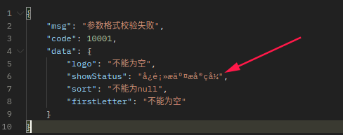

<!-- more -->

# JSR303校验

```Java
* 3、JSR303
*   1）、给Bean添加校验注解:javax.validation.constraints，并定义自己的message提示
*   2)、开启校验功能@Valid
*      效果：校验错误以后会有默认的响应；
*   3）、给校验的bean后紧跟一个BindingResult，就可以获取到校验的结果
    
*   4）、分组校验（多场景的复杂校验）
*         1)、  @NotBlank(message = "品牌名必须提交",groups = {AddGroup.class,UpdateGroup.class})
*          给校验注解标注什么情况需要进行校验
*         2）、@Validated({AddGroup.class})
*         3)、默认没有指定分组的校验注解@NotBlank，在分组校验情况@Validated({AddGroup.class})下不生效，只会在@Validated生效；

*   5）、自定义校验
*      1）、编写一个自定义的校验注解
*      2）、编写一个自定义的校验器 ConstraintValidator
*      3）、关联自定义的校验器和自定义的校验注解
*      @Documented
* @Constraint(validatedBy = { ListValueConstraintValidator.class【可以指定多个不同的校验器，适配不同类型的校验】 })
* @Target({ METHOD, FIELD, ANNOTATION_TYPE, CONSTRUCTOR, PARAMETER, TYPE_USE })
* @Retention(RUNTIME)
* public @interface ListValue {
```

## 1 分组校验

### 1.1  创建组接口

```java
package com.kong.yumall.common.valid;

public @interface AddGroup {
}

public @interface UpdateGroup {
}

public @interface UpdateStatusGroup {
}
```

### 1.2 使用Controller

```java
@RequestMapping("/save")
public R save(@Validated({AddGroup.class}) @RequestBody BrandEntity brand){
    brandService.save(brand);
    return R.ok();
}
```

### 1.3 实体类Entity

```java
/**
     * 品牌id
     */
    @NotNull(message = "修改必须指定品牌id", groups = {UpdateGroup.class})
    @Null(message = "新增不能指定id", groups = {AddGroup.class})
    @TableId
    private Long brandId;
    /**
     * 品牌名
     */
    @NotBlank(message = "品牌名必须提交", groups = {AddGroup.class, UpdateGroup.class})
    private String name;
    /**
     * 品牌logo地址
     */
    @NotBlank(groups = {AddGroup.class})
    @URL(message = "logo必须是一个合法的url地址", groups = {AddGroup.class, UpdateGroup.class})
    private String logo;
```

### 1.4 测试

​ <http://localhost:50000/api/product/brand/save>

```json
{
    "msg": "参数格式校验失败",
    "code": 10001,
    "data": {
        "brandId":"新增不能指定id",
        "name": "品牌名必须提交",
        "logo": "不能为空"
    }
}
```

## 2 自定义校验

>5）、自定义校验
>
>1）、编写一个自定义的校验注解
>
>2）、编写一个自定义的校验器 ConstraintValidator
>
>3）、关联自定义的校验器和自定义的校验注解

### 2.1 自定义校验注解

```java
package com.kong.yumall.common.valid;
@Documented
@Constraint(validatedBy = { ListValueConstraintValidator.class })
@Target({ METHOD, FIELD, ANNOTATION_TYPE, CONSTRUCTOR, PARAMETER, TYPE_USE })
@Retention(RUNTIME)
public @interface ListValue {
    String message() default "{com.kong.yumall.common.valid.ListValue.message}";
    Class<?>[] groups() default { };
    Class<? extends Payload>[] payload() default { };
    int[] vals() default { };
}
```

ValidationMessages.properties

```java
com.kong.yumall.common.valid.ListValue.message=必须提交指定的值
```

### 2.2 自定义的校验器

自定义的校验器 ConstraintValidator

```java
package com.kong.yumall.common.valid;

public class ListValueConstraintValidator implements ConstraintValidator<ListValue,Integer> {
    private Set<Integer> set = new HashSet<>();
    //初始化方法
    @Override
    public void initialize(ListValue constraintAnnotation) {
        int[] vals = constraintAnnotation.vals();
        for (int val : vals) {
            set.add(val);
        }
    }
    /**
     * 判断是否校验成功
     * @param value 需要校验的值
     */
    @Override
    public boolean isValid(Integer value, ConstraintValidatorContext context) {
        return set.contains(value);
    }
}
```

```java
@NotNull(groups = {AddGroup.class, UpdateStatusGroup.class})
@ListValue(vals = {0, 1}, groups = {AddGroup.class, UpdateStatusGroup.class})
private Integer showStatus;
```

### 2.3 关联自定义

```java
@Documented
@Constraint(validatedBy = {ListValueConstraintValidator.class}) //【可以指定多个不同的校验器，适配不同类型的校验】
@Target({METHOD, FIELD, ANNOTATION_TYPE, CONSTRUCTOR, PARAMETER, TYPE_USE})
@Retention(RUNTIME)
public @interface ListValue {
```


