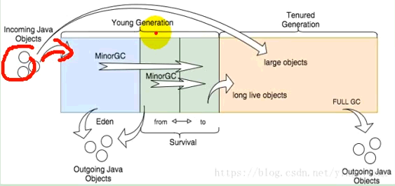

<!-- more -->

## -- 指标


## -- Jmeter

下载：<https://dlcdn.apache.org//jmeter/binaries/apache-jmeter-5.4.3.tgz>

<https://dlcdn.apache.org//jmeter/binaries/apache-jmeter-5.4.3.zip>


常用：


受【cpu,jvm,数据库，网络IO，中间件】分配等影响

## -- 堆内存&垃圾回收

jvm


---

堆空间


---

堆：

新生代



老年代


---

## -- 性能监控

jconsole& jvisualvm


安装插件报错地址：<https://visualvm.github.io/pluginscenters.html>

运行压力测试+visualvm，检测jvm使用情况

| 测试指标                                             | 压测线程数 |       吞吐量/s        | 90%响应时间 | 99%响应时间 |
| :--------------------------------------------------- | :--------: | :-------------------: | :---------: | :---------: |
| Nginx                                                |     80     |      40,063.148       |      2      |      3      |
| Gateway                                              |     80     |      36,176.975       |      4      |      8      |
| 简单服务 8100:hello                                  |     80     |      45,053.433       |      3      |      6      |
| Gateway+简单服务                                     |     80     |      12,609.957       |     10      |     18      |
| 全链路                                               |     80     |      12,444.525       |     11      |     18      |
| 全链路（Nginx动静分离）                              |    200     |      16,049.027       |     18      |     58      |
| 全链路（Nginx动静分离+缓存+去log+索引）              |    200     |      16,060.535       |     18      |     56      |
| 首页1级菜单渲染                                      |     80     |  1,373.826(db,渲染)   |     66      |     86      |
| 首页渲染(开缓存)                                     |     80     |       2,204.165       |     53      |     85      |
| 首页渲染(开缓存+去log+sql索引)                       |     80     |       3,156.914       |     29      |     37      |
| 3级分类数据获取                                      |     80     |      27.616(db)       |    3,207    |    3,414    |
| 3级分类数据获取(开缓存+去log+sql索引)                |     80     |        49.132         |    1,703    |    1,927    |
| 3级分类数据获取(业务优化+关缓存+log+sql索引)         |     80     |        310.131        |     436     |     646     |
| 3级分类数据获取(redis+业务优化+关缓存+log+sql索引)   |     80     |       4,890.867       |     25      |     43      |
| 首页全量数据获取                                     |     80     |        19.157         |     661     |     798     |
| 首页全量数据获取(开缓存+去log+sql索引)               |     80     |         65.36         |    1,513    |    1,845    |
| 首页全量数据获取(Nginx动静分离+开缓存+去log+sql索引) |   80/200   | 17,460.284/16,066.387 |    8/18     |    21/59    |
| Nginx+Gateway                                        |     80     |                       |             |             |

1、中间件有多，性能损失越大

业务：db(MySQL+创建索引)、模板的渲染速度、静态资源

### --- 首页渲染(开缓存+去log+sql)

getLevel1Categorys-》db无索引，开缓存，去log：

```
消耗时间：56
消耗时间：4
消耗时间：2
消耗时间：2
```

getLevel1Categorys-》db有索引，开缓存，去log：

```
消耗时间：5
消耗时间：1
消耗时间：1
消耗时间：1
```

## -- Nginx动静分离


1、以后将所有项目的静态资源都应该放在nginx里面
2、规则: /static/**所有请求都由nginx直接返回


配置

```xml
location / {
 proxy_pass http://yumall;
    #proxy_set_header Host $host;
}

location /static/ {
   #root /usr/share/nginx/html; #docker
   root html; #非docker运行
}
```

<http://yumall.com/static/index/img/img_01.png>

压力测试

## -- 示例：getCataLogJson优化

将数据库的多次查询放到一次，

```
/*
将数据库的多次查询放到一次，
 */
List<CategoryEntity> categoryEntities0 = baseMapper.selectList(null);

//1、查出所有1级分类
List<CategoryEntity> level1Categorys = getParent_cid(categoryEntities0, 0L);
//2、封装数据
Map<String, List<Catalog2Vo>> parent_cid = level1Categorys.stream().collect(Collectors.toMap(k -> k.getCatId().toString(), v -> {
    //1. 每一个的一级分类，查到这个一级分类的二级分类
    List<CategoryEntity> categoryEntities = getParent_cid(categoryEntities0, v.getCatId());
    //封装上面的结果
    List<Catalog2Vo> catalog2VoList = null;
    if (categoryEntities != null) {
        catalog2VoList = categoryEntities.stream().map(l2 -> {
            Catalog2Vo catalog2Vo = new Catalog2Vo(l2.getCatId().toString(), null, l2.getCatId().toString(), l2.getName());
            //查到这个二级分类的三级分类
            List<CategoryEntity> leve3CataLog = getParent_cid(categoryEntities0, l2.getCatId());
            if (leve3CataLog != null) {
                List<Catalog2Vo.Catalog3Vo> collect = leve3CataLog.stream().map(l3 -> {
                    Catalog2Vo.Catalog3Vo catalog3Vo = new Catalog2Vo.Catalog3Vo(l2.getCatId().toString(), l3.getCatId().toString(), l3.getName());

                    return catalog3Vo;
                }).collect(Collectors.toList());
                catalog2Vo.setCatalog3List(collect);
            }
            return catalog2Vo;
        }).collect(Collectors.toList());
    }
    return catalog2VoList;
}));
return parent_cid;

--------------------------------------------
  private List<CategoryEntity> getParent_cid(List<CategoryEntity> selectCategory, Long catId) {
//        return baseMapper.selectList(new QueryWrapper<CategoryEntity>().eq("parent_cid", catId));
        return selectCategory.stream().filter(item -> item.getParentCid() == catId).collect(Collectors.toList());
    }
```
