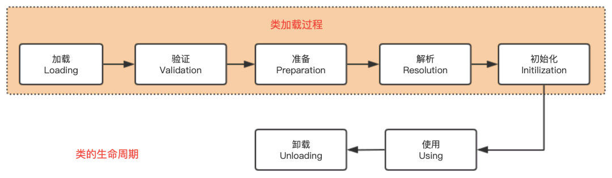
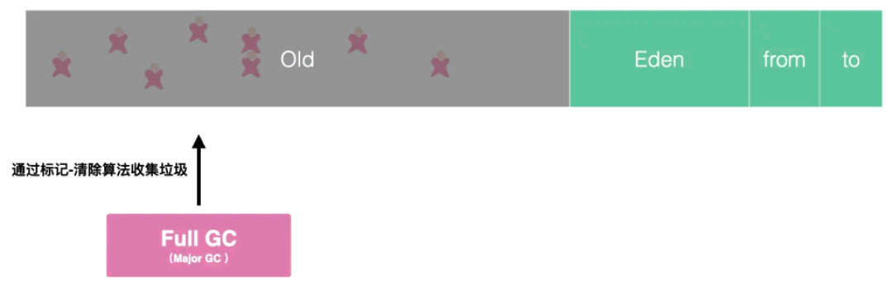

<!-- more -->


# 1. 类的加载过程

## 1.1 加载过程介绍

如果 JVM 想要执行这个 .class 文件，我们需要将其装进一个类加载器中，它就像一个搬运工一样，会把所有的 .class 文件全部搬进 JVM 里面来。


重点知识：

- Java 文件经过编译后变成 .class 字节码文件；
- 字节码文件通过类加载器被搬运到 JVM 虚拟机中；
- 虚拟机主要的 5 大块：方法区，堆都为线程共享区域，有线程安全问题，栈和本地方法栈和计数器都是独享区域，不存在线程安全问题，而 JVM 的调优主要就是围绕堆，栈两大块进行。


## 1.2 类加载流程

类加载的过程包括了**加载、验证、准备、解析、初始化**五个阶段。

在这五个阶段中，加载、验证、准备和初始化这四个阶段发生的顺序是确定的，而解析阶段则不一定，它在某些情况下可以在初始化阶段之后开始，这是为了支持 Java 语言的运行时绑定（也成为动态绑定或晚期绑定）。

另外注意这里的几个阶段是按顺序开始，而不是按顺序进行或完成，因为这些阶段通常都是互相交叉地混合进行的，通常在一个阶段执行的过程中调用或激活另一个阶段。



- **加载**：查找并加载类的二进制数据，在 Java 堆中也创建一个 java.lang.Class 类的对象；

- **连接**：连接又包含三块内容：验证、准备、初始化；

  - - 1）验证：文件格式、元数据、字节码、符号引用验证；
  - 2）准备：为类的静态变量分配内存，并将其初始化为默认值；
  - 3）解析：把类中的符号引用转换为直接引用。

- **初始化**：为类的静态变量赋予正确的初始值；

- **使用**：new出对象程序中使用；

- **卸载**：执行垃圾回收。

## 1.3 类加载器

加载一个 Class 类的顺序也是有优先级的，类加载器从最底层开始往上的顺序是这样的：

- BootStrap ClassLoader：rt.jar
- Extention ClassLoader：加载扩展的 jar 包
- App ClassLoader：指定的 classpath 下面的 jar 包
- Custom ClassLoader：自定义的类加载器


# 2. 垃圾回收

## 2.1 如何确定对象已死

通常，判断一个对象是否被销毁有两种方法：

- **引用计数算法**：为对象添加一个引用计数器，每当对象在一个地方被引用，则该计数器加 1，每当对象引用失效时，计数器减 1，但计数器为 0 的时候，就表明该对象没有被引用。
- **可达性分析算法**：通过一系列被称之为 “GC Roots” 的根节点开始，沿着引用链进行搜索，凡是在引用链上的对象都不会被回收。


就像上图的那样，绿色部分的对象都在 GC Roots 的引用链上，就不会被垃圾回收器回收，灰色部分的对象没有在引用链上，自然就被判定为可回收对象。

## 2.2 垃圾回收算法

### 2.2.1 标记--清除算法

见名知义，“标记--清除算法” 就是对无效的对象进行标记，然后清除。

### 2.2.2 复制算法

标记--复制算法就是把 Java 堆分成两块，每次垃圾回收时只使用其中一块，然后把存活的对象全部移动到另一块区域。


### 2.2.3 标记--整理算法

**“标记--整理算法” 算是一种折中的垃圾收集算法**，在对象标记的过程，和前面两个执行的是一样步骤。

进行标记之后，存活的对象会移动到堆的一端，然后直接清理存活对象以外的区域就可以了。这样，既避免了内存碎片，也不存在堆空间浪费的说法了。

但是，每次进行垃圾回收的时候，都要暂停所有的用户线程，特别是对老年代的对象回收，则需要更长的回收时间，这对用户体验是非常不好的。


## 2.3 垃圾收集器

### 2.3.1 Serial 收集器

**Serial 收集器是最基础、历史最悠久的收集器，是一个单线程工作的收集器。**

使用 Serial收集器，无论是进行 Minor gc 还是 Full GC ，清理堆空间时，所有的应用线程都会被暂停。


### 2.3.2 ParNew 收集器

**ParNew 收集器实质上是 Serial 收集器的多线程并行版本。**

除了同时使用多条线程进行垃圾收集之外，其余的行为包括 Serial 收集器可用的所有控制参数、收集算法、Stop The World、对象分配规则、回收策略等都与 Serial 收集器完全一致。


### 2.3.3 Parallel Scavenge 收集器

**Parallel Scavenge 收集器也是一款新生代收集器，基于标记——复制算法实现**，能够并行收集的多线程收集器和 ParNew 非常相似。

Parallel Scavenge 收集器的目标则是达到一个可控制的吞吐量（Throughput）。

所谓吞吐量就是处理器用于运行用户代码的时间与处理器总消耗时间的比值。如果虚拟机完成某个任务，用户代码加上垃圾收集总共耗费了 100 分钟，其中垃圾收集花掉 1 分钟，那吞吐量就是 99%。

### 2.3.4 Serial Old 收集器

**Serial Old 是 Serial 收集器的老年代版本**，它同样是一个单线程收集器，使用 “标记-整理算法”。


### 2.3.5 Parallel Old 收集器

**Parallel Old 是 Parallel Scavenge 收集器的老年代版本**，支持多线程并发收集，基于标记-整理算法实现。


### 2.3.6 CMS收集器

**CMS 收集器设计的初衷是为了消除 Parallel 收集器和 Serial 收集器 Full gc 周期中的长时间停顿。**

CMS收集器在 Minor gc 时会暂停所有的应用线程，并以多线程的方式进行垃圾回收。


### 2.3.7 垃圾收集器对比


# 3. 运行时数据区域

什么是运行时数据区域？

Java 程序在运行时，会为 JVM 单独划出一块内存区域，而这块内存区域又可以再次划分出一块运行时数据区，**运行时数据区域大致可以分为五个部分**：


## 3.1 Java 堆（Heap）

栈管运行，堆管存储，**虚拟机栈负责运行代码，而虚拟机堆负责存储数据。**

Java 堆区具有下面几个特点：

- 存储的是我们 new 来的对象，不存放基本类型和对象引用；
- 由于创建了大量的对象，垃圾回收器主要工作在这块区域；
- 线程共享区域，因此是线程不安全的；
- 能够发生 OutOfMemoryError。

其实，Java 堆区还可以划分为新生代和老年代，新生代又可以进一步划分为 Eden 区、Survivor 1 区、Survivor 2 区。

## 3.2 虚拟机栈（JVM Stacks）

Java 虚拟机栈也是一块被开发者重点关注的地方，同样，先把干货放上来：

- Java 虚拟机栈是线程私有的，每一个线程都有独享一个虚拟机栈，它的生命周期与线程相同。
- 虚拟机栈描述的是 Java 方法执行的内存模型：每个方法被执行的时候都会同时创建一个栈帧（Stack Frame）用于存储局部变量表、操作栈、动态链接、方法出口等信息。每一个方法被调用直至执行完成的过程，就对应着一个栈帧在虚拟机栈中从入栈到出栈的过程。
- 存放基本数据类型（boolean、byte、char、short、int、float、long、double）以及对象的引用（reference  类型，它不等同于对象本身，根据不同的虚拟机实现，它可能是一个指向对象起始地址的引用指针，也可能指向一个代表对象的句柄或者其他与此对象相关的位置）和 returnAddress 类型（指向了一条字节码指令的地址）。
- 这个区域可能有两种异常：如果线程请求的栈深度大于虚拟机所允许的深度，将抛出 StackOverflowError 异常；如果虚拟机栈可以动态扩，当扩展时无法申请到足够的内存时会抛出 OutOfMemoryError异常。

## 3.3 本地方法栈（Native Method Stacks）

本地方法栈与虚拟机栈所发挥的作用是非常相似的，其区别不过是**虚拟机栈为虚拟机执行 Java 方法（也就是字节码）服务，而本地方法栈则是为虚拟机使用到的 Native 方法服务。**

虚拟机规范中对本地方法栈中的方法使用的语言、使用方式与数据结构并没有强制规定，因此具体的虚拟机可以自由实现它。甚至有的虚拟机（譬如 Sun HotSpot 虚拟机）直接就把本地方法栈和虚拟机栈合二为一。

与虚拟机栈一样，本地方法栈区域也会抛出 StackOverflowError 和 OutOfMemoryError 异常。

## 3.4 方法区（Method Area）

方法区也是一块被重点关注的区域，主要特点如下：

- 线程共享区域，因此这是线程不安全的区域。
- 它用于存储已被虚拟机加载的类信息、常量、静态变量、即时编译器编译后的代码等数据。
- 当方法区无法满足内存分配需求时，将抛出 OutOfMemoryError 异常。

## 3.5 程序计数器（Program Counter Register）

它的作用就是记录当前线程所执行的位置。这样，当线程重新获得 CPU 的执行权的时候，就直接从记录的位置开始执行，分支、循环、跳转、异常处理也都依赖这个程序计数器来完成。

# 4. JVM堆内存

## 4.1 堆内存结构

**Java 堆区可以划分为新生代和老年代，新生代又可以进一步划分为 Eden 区、Survivor 1 区、Survivor 2 区**。具体比例参数的话，可以看一下这张图。


## 4.2 GC类型

- Minor GC/Young GC：针对新生代的垃圾收集；
- Major GC/Old GC：针对老年代的垃圾收集。
- Full GC：针对整个 Java 堆以及方法区的垃圾收集。


## 4.3 Minor GC 工作原理

通常情况下，初次被创建的对象存放在新生代的 Eden 区，当第一次触发 Minor GC，Eden 区存活的对象被转移到 Survivor区 的某一块区域。

以后再次触发 Minor GC 的时候，Eden区的对象连同一块 Survivor 区的对象一起，被转移到了另一块 Survivor 区。

可以看到，这两块 Survivor 区我们每一次只使用其中的一块，这样也仅仅是浪费了一块 Survivor 区。


## 4.4 Full GC 工作原理

老年代是存储长期存活的对象的，占满时就会触发我们最常听说的 Full GC，期间会停止所有线程等待 GC 的完成。

所以对于响应要求高的应用应该尽量去减少发生 Full GC 从而避免响应超时的问题。



# 5. GC 日志

## 5.1 GC 日志开启

偷个懒，直接贴网上的内容：


## 5.2 理解 GC 日志

Minor GC 日志：

Full GC 日志：

# 6. JVM 常用命令

Sun JDK监控和故障处理命令有 jps、jstat、jmap、jhat、jstack、jinfo。

## 6.1 jps

JVM Process Status Tool，**显示指定系统内所有的 HotSpot 虚拟机进程。**

## 6.2 jstat

jstat(JVM statistics Monitoring)是用于**监视虚拟机运行时状态**信息的命令，它可以显示出虚拟机进程中的类装载、内存、垃圾收集、JIT 编译等运行数据。

## 6.3 jmap

**dump 堆到文件**，可用于对文件的分析。

## 6.4 jhat

jhat(JVM Heap Analysis Tool)命令是与 jmap 搭配使用，**用来分析 jmap 生成的 dump**，jhat 内置了一个微型的 HTTP/HTML 服务器，生成 dump 的分析结果后，可以在浏览器中查看。

在此要注意，一般不会直接在服务器上进行分析，因为 jhat 是一个耗时并且耗费硬件资源的过程，一般把服务器生成的 dump 文件复制到本地或其他机器上进行分析。

## 6.5 jstack

**jstack 用于生成 java 虚拟机当前时刻的线程快照。**

线程快照是当前 java 虚拟机内每一条线程正在执行的方法堆栈的集合，生成线程快照的主要目的是定位线程出现长时间停顿的原因，如线程间死锁、死循环、请求外部资源导致的长时间等待等。

线程出现停顿的时候通过 jstack 来查看各个线程的调用堆栈，就可以知道没有响应的线程到底在后台做什么事情，或者等待什么资源。

# 7. 性能检测工具

## 7.1 jconsole

Jconsole（Java Monitoring and Management Console）是从 java5 开始，在 JD K中自带的 java 监控和管理控制台，**用于对 JVM 中内存，线程和类等的监控**，是一个基于 JMX（java management extensions）的 GUI 性能监测工具。

jconsole 使用 jvm 的扩展机制获取并展示虚拟机中运行的应用程序的性能和资源消耗等信息。

概览：包括堆内存使用情况、线程、类、CPU 使用情况四项信息的曲线图。


线程：相当于可视化的 jstack 命令，同时也可以点击 “检测死锁” 来检查线程之间是否有死锁的情况。


## 7.2 VisualVM

**VisualVM（All-in-One Java Troubleshooting Tool）是功能最强大的运行监视和故障处理程序之一**，曾经在很长一段时间内是 Oracle 官方主力发展的虚拟机故障处理工具。

相比一些第三方工具，VisualVM 有一个很大的优点：不需要被监视的程序基于特殊 Agent 去运行，因此它的通用性很强，对应用程序实际性能的影响也较小，使得它可以直接应用在生产环境中。

Visual GC 是常常使用的一个功能，需要通过插件，可以明显的看到年轻代、老年代的内存变化，以及 gc 频率、gc 的时间等，感觉这个插件很酷！


监控的主页其实也就是，cpu、内存、类、线程的图表，这里面可以执行堆 dump。


最后就是堆 dump：


# 8. JVM 调优

## 8.1 选择合适的垃圾回收器

- **CPU 单核**：那么毫无疑问 Serial 垃圾收集器是你唯一的选择；
- **CPU 多核**：关注吞吐量 ，那么选择 PS+PO 组合；
- **CPU 多核**：关注用户停顿时间，JDK 版本 1.6 或者 1.7，那么选择 CMS；
- **CPU 多核**：关注用户停顿时间，JDK1.8 及以上，JVM 可用内存 6G 以上，那么选择 G1。

参数配置：

```
 //设置Serial垃圾收集器（新生代）
 开启：-XX:+UseSerialGC
 
 //设置PS+PO,新生代使用功能Parallel Scavenge 老年代将会使用Parallel Old收集器
 开启 -XX:+UseParallelOldGC
 
 //CMS垃圾收集器（老年代）
 开启 -XX:+UseConcMarkSweepGC
 
 //设置G1垃圾收集器
 开启 -XX:+UseG1GC
```

## 8.2 调整内存大小

**现象**：垃圾收集频率非常频繁。

**原因**：如果内存太小，就会导致频繁的需要进行垃圾收集才能释放出足够的空间来创建新的对象，所以增加堆内存大小的效果是非常显而易见的。

**注意**：如果垃圾收集次数非常频繁，但是每次能回收的对象非常少，那么这个时候并非内存太小，而可能是内存泄露导致对象无法回收，从而造成频繁 GC。

参数配置：

```
 //设置堆初始值
 指令1：-Xms2g
 指令2：-XX:InitialHeapSize=2048m
 
 //设置堆区最大值
 指令1：`-Xmx2g` 
 指令2： -XX:MaxHeapSize=2048m
 
 //新生代内存配置
 指令1：-Xmn512m
 指令2：-XX:MaxNewSize=512m
```

## 8.3 设置符合预期的停顿时间

**现象**：程序间接性的卡顿

**原因**：如果没有确切的停顿时间设定，垃圾收集器以吞吐量为主，那么垃圾收集时间就会不稳定。

**注意**：不要设置不切实际的停顿时间，单次时间越短也意味着需要更多的 GC 次数才能回收完原有数量的垃圾.

参数配置：

```
 //GC停顿时间，垃圾收集器会尝试用各种手段达到这个时间
 -XX:MaxGCPauseMillis 
```

## 8.4 调整内存区域大小比率

**现象**：某一个区域的GC频繁，其他都正常。

**原因**：如果对应区域空间不足，导致需要频繁GC来释放空间，在JVM堆内存无法增加的情况下，可以调整对应区域的大小比率。

**注意**：也许并非空间不足，而是因为内存泄造成内存无法回收，从而导致 GC 频繁。

参数配置：

```
 //survivor区和Eden区大小比率
 指令：-XX:SurvivorRatio=6  //S区和Eden区占新生代比率为1:6,两个S区2:6
 
 //新生代和老年代的占比
 -XX:NewRatio=4  //表示新生代:老年代 = 1:4 即老年代占整个堆的4/5；默认值=2
```

## 8.5 调整对象升老年代的年龄

**现象**：老年代频繁 GC，每次回收的对象很多。

**原因**：如果升代年龄小，新生代的对象很快就进入老年代了，导致老年代对象变多，而这些对象其实在随后的很短时间内就可以回收，这时候可以调整对象的升级代年龄，让对象不那么容易进入老年代解决老年代空间不足频繁 GC 问题。

**注意**：增加了年龄之后，这些对象在新生代的时间会变长可能导致新生代的 GC 频率增加，并且频繁复制这些对象新生的 GC 时间也可能变长。

配置参数：

```
//进入老年代最小的GC年龄,年轻代对象转换为老年代对象最小年龄值，默认值7
 -XX:InitialTenuringThreshol=7 
```

## 8.6 调整大对象的标准

**现象**：老年代频繁 GC，每次回收的对象很多,而且单个对象的体积都比较大。

**原因**：如果大量的大对象直接分配到老年代，导致老年代容易被填满而造成频繁 GC，可设置对象直接进入老年代的标准。

**注意**：这些大对象进入新生代后可能会使新生代的 GC 频率和时间增加。

配置参数：

```
 //新生代可容纳的最大对象,大于则直接会分配到老年代，0代表没有限制。
  -XX:PretenureSizeThreshold=1000000 
```

## 8.7 调整GC的触发时机

**现象**：CMS，G1 经常 Full GC，程序卡顿严重。

**原因**：G1 和 CMS 部分 GC 阶段是并发进行的，业务线程和垃圾收集线程一起工作，也就说明垃圾收集的过程中业务线程会生成新的对象，所以在 GC  的时候需要预留一部分内存空间来容纳新产生的对象，如果这个时候内存空间不足以容纳新产生的对象，那么JVM就会停止并发收集暂停所有业务线程（STW）来保证垃圾收集的正常运行。这个时候可以调整GC触发的时机（比如在老年代占用 60% 就触发 GC），这样就可以预留足够的空间来让业务线程创建的对象有足够的空间分配。

**注意**：提早触发 GC 会增加老年代 GC 的频率。

配置参数：

```
 //使用多少比例的老年代后开始CMS收集，默认是68%，如果频繁发生SerialOld卡顿，应该调小
 -XX:CMSInitiatingOccupancyFraction
 
 //G1混合垃圾回收周期中要包括的旧区域设置占用率阈值。默认占用率为 65%
 -XX:G1MixedGCLiveThresholdPercent=65 
```

## 8.8 调整 JVM本地内存大小

**现象**：GC 的次数、时间和回收的对象都正常，堆内存空间充足，但是报 OOM

**原因**：JVM 除了堆内存之外还有一块堆外内存，这片内存也叫本地内存，可是这块内存区域不足了并不会主动触发 GC，只有在堆内存区域触发的时候顺带会把本地内存回收了，而一旦本地内存分配不足就会直接报 OOM 异常。

**注意**：本地内存异常的时候除了上面的现象之外，异常信息可能是 OutOfMemoryError：Direct buffer memory。解决方式除了调整本地内存大小之外，也可以在出现此异常时进行捕获，手动触发 GC（System.gc()）。

配置参数：

```
 XX:MaxDirectMemorySize
```

# 9. JVM 调试实战

## 9.1 网站流量浏览量暴增后，网站反应页面响很慢

1、问题推测：在测试环境测速度比较快，但是一到生产就变慢，所以推测可能是因为垃圾收集导致的业务线程停顿。

2、定位：为了确认推测的正确性，在线上通过 jstat -gc 指令 看到 JVM 进行 GC 次数频率非常高，GC 所占用的时间非常长，所以基本推断就是因为 GC 频率非常高，所以导致业务线程经常停顿，从而造成网页反应很慢。

3、解决方案：因为网页访问量很高，所以对象创建速度非常快，导致堆内存容易填满从而频繁 GC，所以这里问题在于新生代内存太小，所以这里可以增加 JVM 内存就行了，所以初步从原来的 2G 内存增加到 16G 内存。

4、第二个问题：增加内存后的确平常的请求比较快了，但是又出现了另外一个问题，就是不定期的会间断性的卡顿，而且单次卡顿的时间要比之前要长很多。

5、问题推测：之前的优化加大了内存，所以推测可能是因为内存加大了，从而导致单次 GC 的时间变长从而导致间接性的卡顿。

6、定位：还是通过 jstat -gc 指令 查看到 的确 FGC 次数并不是很高，但是花费在 FGC 上的时间是非常高的，根据 GC 日志 查看到单次 FGC 的时间有达到几十秒的。

7、解决方案：因为 JVM 默认使用的是 PS+PO 的组合，PS+PO 垃圾标记和收集阶段都是  STW，所以内存加大了之后，需要进行垃圾回收的时间就变长了，所以这里要想避免单次 GC 时间过长，所以需要更换并发类的收集器，因为当前的 JDK 版本为 1.7，所以最后选择 CMS 垃圾收集器，根据之前垃圾收集情况设置了一个预期的停顿的时间，上线后网站再也没有了卡顿问题。

## 9.2 后台导出数据引发的 OOM

**问题描述**：公司的后台系统，偶发性的引发 OOM 异常，堆内存溢出。

1、因为是偶发性的，所以第一次简单的认为就是堆内存不足导致，所以单方面的加大了堆内存从 4G 调整到 8G。

2、但是问题依然没有解决，只能从堆内存信息下手，通过开启了 -XX:+HeapDumpOnOutOfMemoryError 参数 获得堆内存的 dump 文件。

3、VisualVM 对堆 dump 文件进行分析，通过 VisualVM 查看到占用内存最大的对象是 String 对象，本来想跟踪着 String  对象找到其引用的地方，但 dump 文件太大，跟踪进去的时候总是卡死，而 String  对象占用比较多也比较正常，最开始也没有认定就是这里的问题，于是就从线程信息里面找突破点。

4、通过线程进行分析，先找到了几个正在运行的业务线程，然后逐一跟进业务线程看了下代码，发现有个引起我注意的方法，导出订单信息。

5、因为订单信息导出这个方法可能会有几万的数据量，首先要从数据库里面查询出来订单信息，然后把订单信息生成 excel，这个过程会产生大量的 String 对象。

6、为了验证自己的猜想，于是准备登录后台去测试下，结果在测试的过程中发现到处订单的按钮前端居然没有做点击后按钮置灰交互事件，结果按钮可以一直点，因为导出订单数据本来就非常慢，使用的人员可能发现点击后很久后页面都没反应，结果就一直点，结果就大量的请求进入到后台，堆内存产生了大量的订单对象和 EXCEL 对象，而且方法执行非常慢，导致这一段时间内这些对象都无法被回收，所以最终导致内存溢出。

7、知道了问题就容易解决了，最终没有调整任何 JVM 参数，只是在前端的导出订单按钮上加上了置灰状态，等后端响应之后按钮才可以进行点击，然后减少了查询订单信息的非必要字段来减少生成对象的体积，然后问题就解决了。

# 10. JVM参数设置优化

不管是YGC还是Full GC,GC过程中都会对导致程序运行中中断,正确的选择[不同的GC策略](http://www.cnblogs.com/redcreen/archive/2011/05/04/2037029.html),调整JVM、GC的参数，可以极大的减少由于GC工作，而导致的程序运行中断方面的问题，进而适当的提高Java程序的工作效率。

## JVM参数的含义

| 参数名称 | 含义 | 默认值 | |
| ---------- | ---------- | ----- | ----------- |
| -Xms | 初始堆大小 | 物理内存的1/64(<1GB) | 默认(MinHeapFreeRatio参数可以调整)空余堆内存小于40%时，JVM就会增大堆直到-Xmx的最大限制. |
| -Xmx | 最大堆大小 | 物理内存的1/4(<1GB)  | 默认(MaxHeapFreeRatio参数可以调整)空余堆内存大于70%时，JVM会减少堆直到 -Xms的最小限制 |
| -Xmn | 年轻代大小(1.4or lator) | | **注意**：此处的大小是（eden+ 2 survivor  space).与jmap -heap中显示的New gen是不同的。   整个堆大小=年轻代大小 + 年老代大小 + 持久代大小.   增大年轻代后,将会减小年老代大小.此值对系统性能影响较大,Sun官方推荐配置为整个堆的3/8 |
| -XX:NewSize | 设置年轻代大小(for 1.3/1.4) | | |
| -XX:MaxNewSize | 年轻代最大值(for 1.3/1.4) | | |
| -XX:PermSize | 设置持久代(perm gen)初始值 | 物理内存的1/64 | |
| -XX:MaxPermSize | 设置持久代最大值 | 物理内存的1/4 | |
| -Xss | 每个线程的堆栈大小 | | JDK5.0以后每个线程堆栈大小为1M,以前每个线程堆栈大小为256K.更具应用的线程所需内存大小进行 调整.在相同物理内存下,减小这个值能生成更多的线程.但是操作系统对一个进程内的线程数还是有限制的,不能无限生成,经验值在3000~5000左右 一般小的应用， 如果栈不是很深， 应该是128k够用的 大的应用建议使用256k。这个选项对性能影响比较大，需要严格的测试。（校长） 和threadstacksize选项解释很类似,官方文档似乎没有解释,在论坛中有这样一句话:`-Xss is translated in a VM flag named ThreadStackSize` 一般设置这个值就可以了。 |
| -*XX:ThreadStackSize* | Thread Stack Size | | `(0 means use default stack size) [Sparc: 512; Solaris x86: 320 (was 256  prior in 5.0 and earlier); Sparc 64 bit: 1024; Linux amd64: 1024 (was 0 in  5.0 and earlier); all others 0.]` |
| -XX:NewRatio | 年轻代(包括Eden和两个Survivor区)与年老代的比值(除去持久代) | | -XX:NewRatio=4表示年轻代与年老代所占比值为1:4,年轻代占整个堆栈的1/5   Xms=Xmx并且设置了Xmn的情况下，该参数不需要进行设置。 |
| -XX:SurvivorRatio | Eden区与Survivor区的大小比值 | | 设置为8,则两个Survivor区与一个Eden区的比值为2:8,一个Survivor区占整个年轻代的1/10 |
| -XX:LargePageSizeInBytes | 内存页的大小不可设置过大， 会影响Perm的大小 | | =128m |
| -XX:+UseFastAccessorMethods | 原始类型的快速优化 | | |
| -XX:+DisableExplicitGC | 关闭System.gc() | | 这个参数需要严格的测试 |
| -XX:MaxTenuringThreshold | 垃圾最大年龄 | | 如果设置为0的话,则年轻代对象不经过Survivor区,直接进入年老代. 对于年老代比较多的应用,可以提高效率.如果将此值设置为一个较大值,则年轻代对象会在Survivor区进行多次复制,这样可以增加对象再年轻代的存活 时间,增加在年轻代即被回收的概率   该参数只有在串行GC时才有效. |
| -XX:+AggressiveOpts | 加快编译 | | |
| -XX:+UseBiasedLocking | 锁机制的性能改善 | | |
| -Xnoclassgc | 禁用垃圾回收 | | |
| -XX:SoftRefLRUPolicyMSPerMB | 每兆堆空闲空间中SoftReference的存活时间 | 1s | `softly reachable objects will remain alive for some amount of time after  the last time they were referenced. The default value is one second of  lifetime per free megabyte in the heap` |
| -XX:PretenureSizeThreshold  | 对象超过多大是直接在旧生代分配 | 0 | 单位字节 新生代采用Parallel Scavenge GC时无效   另一种直接在旧生代分配的情况是大的数组对象,且数组中无外部引用对象. |
| -XX:TLABWasteTargetPercent  | TLAB占eden区的百分比 | 1% | |
| -XX:+*CollectGen0First*     | FullGC时是否先YGC | false | |

**并行收集器相关参数**

| 参数名称 | 含义 | 默认值 | |
| ---------- | ---------- | ----- | ----------- |
| -XX:+UseParallelGC | Full GC采用parallel MSC   (此项待验证) | | 选择垃圾收集器为并行收集器.此配置仅对年轻代有效.即上述配置下,年轻代使用并发收集,而年老代仍旧使用串行收集.(此项待验证) |
| -XX:+UseParNewGC | 设置年轻代为并行收集 | | 可与CMS收集同时使用   JDK5.0以上,JVM会根据系统配置自行设置,所以无需再设置此值 |
| -XX:ParallelGCThreads | 并行收集器的线程数 | | 此值最好配置与处理器数目相等 同样适用于CMS |
| -XX:+UseParallelOldGC | 年老代垃圾收集方式为并行收集(Parallel Compacting) | | 这个是JAVA 6出现的参数选项 |
| -XX:MaxGCPauseMillis | 每次年轻代垃圾回收的最长时间(最大暂停时间) | | 如果无法满足此时间,JVM会自动调整年轻代大小,以满足此值.       |
| -XX:+UseAdaptiveSizePolicy | 自动选择年轻代区大小和相应的Survivor区比例 | | 设置此选项后,并行收集器会自动选择年轻代区大小和相应的Survivor区比例,以达到目标系统规定的最低相应时间或者收集频率等,此值建议使用并行收集器时,一直打开. |
| -XX:GCTimeRatio | 设置垃圾回收时间占程序运行时间的百分比 | | 公式为1/(1+n)                                                |
| -XX:+*ScavengeBeforeFullGC* | Full GC前调用YGC | true | `Do young generation GC prior to a full GC. (Introduced in 1.4.1.)` |

**CMS****相关参数**

| 参数名称 | 含义 | 默认值 | |
| ---------- | ---------- | ----- | ----------- |
| -XX:+UseConcMarkSweepGC | 使用CMS内存收集 | | 测试中配置这个以后,-XX:NewRatio=4的配置失效了,原因不明.所以,此时年轻代大小最好用-Xmn设置.??? |
| -XX:+AggressiveHeap | | | 试图是使用大量的物理内存长时间大内存使用的优化，能检查计算资源（内存， 处理器数量）至少需要256MB内存大量的CPU／内存，（在1.4.1在4CPU的机器上已经显示有提升） |
| -XX:CMSFullGCsBeforeCompaction | 多少次后进行内存压缩 | | 由于并发收集器不对内存空间进行压缩,整理,所以运行一段时间以后会产生"碎片",使得运行效率降低.此值设置运行多少次GC以后对内存空间进行压缩,整理. |
| -XX:+CMSParallelRemarkEnabled | 降低标记停顿 | | |
| -XX+UseCMSCompactAtFullCollection | 在FULL GC的时候， 对年老代的压缩 | | CMS是不会移动内存的， 因此， 这个非常容易产生碎片，导致内存不够用，因此，内存的压缩这个时候就会被启用。 增加这个参数是个好习惯。可能会影响性能,但是可以消除碎片 |
| -XX:+UseCMSInitiatingOccupancyOnly | 使用手动定义初始化定义开始CMS收集 | | 禁止hostspot自行触发CMS GC |
| -XX:CMSInitiatingOccupancyFraction=70  | 使用cms作为垃圾回收使用70％后开始CMS收集 | 92 | 为了保证不出现promotion failed(见下面介绍)错误,该值的设置需要满足以下公式[CMSInitiatingOccupancyFraction计算公式](http://www.cnblogs.com/redcreen/archive/2011/05/04/2037057.html#CMSInitiatingOccupancyFraction_value) |
| -XX:CMSInitiatingPermOccupancyFraction | 设置Perm Gen使用到达多少比率时触发 | 92 | |
| -XX:+CMSIncrementalMode | 设置为增量模式 | | 用于单CPU情况 |
| -XX:+CMSClassUnloadingEnabled | | | |

**辅助信息**
| 参数名称 | 含义 | 默认值 | |
| ---------- | ---------- | ----- | ----------- |
| -XX:+PrintGC | | | 输出形式:  `[GC 118250K->113543K(130112K),  0.0094143 secs]   [Full GC 121376K->10414K(130112K), 0.0650971 secs]` |
| -XX:+PrintGCDetails | | | 输出形式:`[GC [DefNew: 8614K->781K(9088K),  0.0123035 secs] 118250K->113543K(130112K), 0.0124633 secs]`   `[GC [DefNew: 8614K->8614K(9088K), 0.0000665 secs][Tenured:  112761K->10414K(121024K), 0.0433488 secs] 121376K->10414K(130112K),  0.0436268 secs]` |
| -XX:+PrintGCTimeStamps | | | |
| -XX:+PrintGC:PrintGCTimeStamps | | | 可与-XX:+PrintGC  -XX:+PrintGCDetails混合使用，输出形式：`11.851: [GC 98328K->93620K(130112K),  0.0082960 secs]` |
| -XX:+PrintGCApplicationStoppedTime | 打印垃圾回收期间程序暂停的时间.可与上面混合使用 | | 输出形式：`Total time for which application threads  were stopped: 0.0468229 seconds` |
| -XX:+PrintGCApplicationConcurrentTime | 打印每次垃圾回收前,程序未中断的执行时间.可与上面混合使用 | | 输出形式:Application time: 0.5291524 seconds |
| -XX:+PrintHeapAtGC | 打印GC前后的详细堆栈信息 | | |
| -Xloggc:filename | 把相关日志信息记录到文件以便分析.   与上面几个配合使用   | | |
| -XX:+PrintClassHistogram | `garbage collects before printing the histogram.` |      | |
| -XX:+PrintTLAB | 查看TLAB空间的使用情况 | | |
| XX:+PrintTenuringDistribution | 查看每次minor GC后新的存活周期的阈值 | | `Desired survivor size 1048576 bytes, new  threshold 7 (max 15)`   new threshold 7即标识新的存活周期的阈值为7。|
