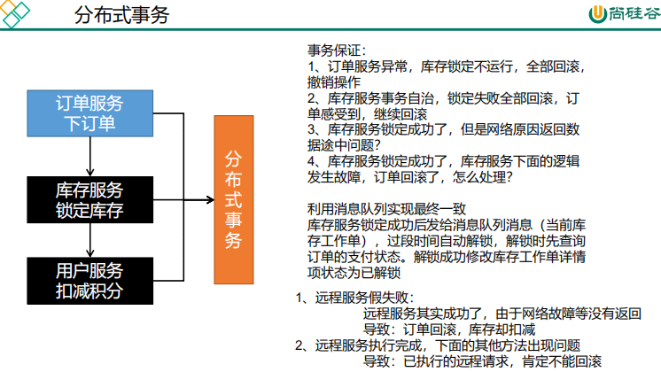
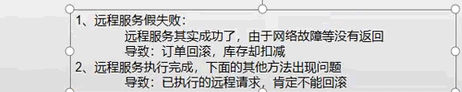
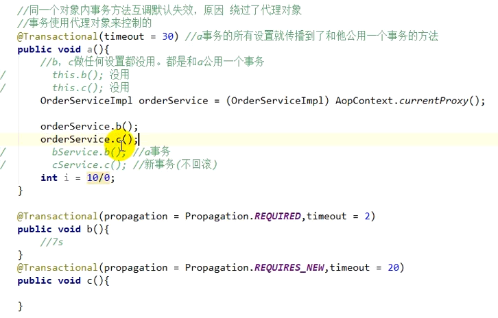
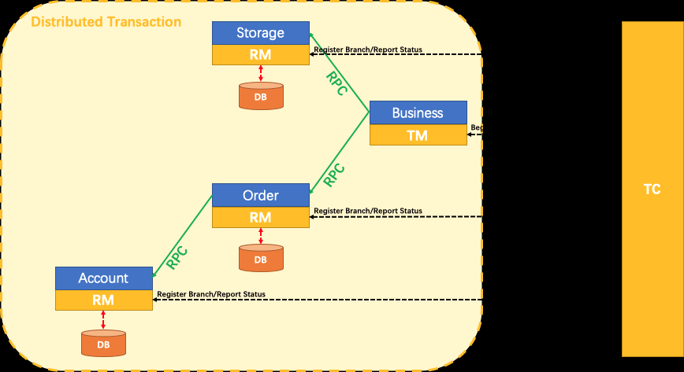
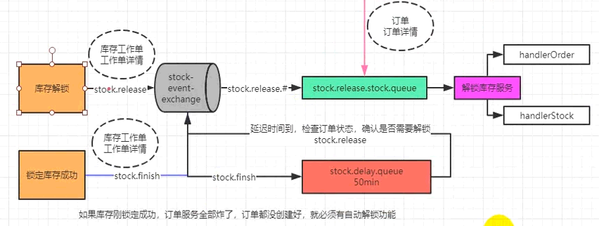

<!-- more -->

# 分布式事物<a name="分布式事物"></a>





## 1、事物本质：原子性、一致性、隔离性、持久性

数据库事务的几个特性：原子性(Atomicity )、一致性( Consistency )、隔离性或独立性( Isolation)
和持久性(Durabilily),简称就是ACID;
●**原子性**：一系列的操作整体不可拆分，要么同时成功，要么同时失败
●**一致性**：数据在事务的前后，业务整体一致。
  ■转账。A:1000; B:1000;转200事务成功;A: 800B: 1200
●**隔离性**：事务之间互相隔离。
●**持久性**:一旦事务成功，数据一定会落盘在数据库。

## 2、隔离级别 Isolation：读未提交 < 读已提交 < 可重复读（MySQL默认） < 序列化

级别越大，并发性越低。

### 脏读

一个事务可以读取另一个事务未提交的数据

### 不可重复读

一个事务可以读取另一个事务已提交的数据  单条记录前后不匹配

### 虚读（幻读）

一个事务可以读取另一个事务已提交的数据  读取的数据前后多了点或者少了点

### READ UNCOMTTTED (读未提交)

​ 该隔离级别的事务会读到其它未提交事务的数据，此现象也称之为`**脏读**`。

### READ COMMITTED (读已提交)

​ 一个事务可以读取另一个已提交的事务，多次读取会造成不一样的结果，此现象称为`**不可重复读问题**`，Oracle和SQL Server的默认隔离级别。

### REPEATABLE READ (可重复读)

​ 该隔离级别是MySQL默认的隔离级别，在同一个事务里，select 的结果是事务开始时时间点的状态，因此，同样的select操作读到的结果会是一致的， 但是，会有**幻读现象**。MySQL的InnoDB引擎可以通过next-keylocks 机制(参考下文行锁的算法"一节)来避免幻读。

### SERIALIZABLE (序列化)

​ 在该隔离级别下事务都是串行顺序执行的，MySQL数据库的InnoDB 引擎会给读操作隐式加一把读共享锁，从而避免了脏读、不可重读复读和幻读问题。

|      隔离级别       | 说明                                                         |
| :-----------------: | :----------------------------------------------------------- |
|       DEFAULT       | 使用底层数据存储的默认隔离级别。 所有其他级别对应于 JDBC 隔离级别。 |
|  READ_UNCOMMITTED   | 指示可能发生脏读、不可重复读和幻读的常量。 此级别允许由一个事务更改的行在提交该行中的任何更改之前被另一个事务读取（“脏读”）。 如果任何更改被回滚，则第二个事务将检索到无效行。 |
|   READ_COMMITTED    | 指示可能发生脏读、不可重复读和幻读的常量。 此级别允许由一个事务更改的行在提交该行中的任何更改之前被另一个事务读取（“脏读”）。 如果任何更改被回滚，则第二个事务将检索到无效行。 |
| **REPEATABLE_READ** | 表示防止脏读的常量； 可能会发生不可重复读和幻读。 此级别仅禁止事务读取其中包含未提交更改的行。*MySQL 默认的隔离级别* |
|    SERIALIZABLE     | 指示防止脏读、不可重复读和幻读的常量。 该级别包括ISOLATION_REPEATABLE_READ的禁止，并进一步禁止这样一种情况，即一个事务读取满足WHERE条件的所有行，第二个事务插入满足WHERE条件的行，第一个事务为相同条件重新读取，检索额外的“第二次阅读中的幻影”行。 |

### 相关命令

查看全局事务隔离级别：SELECT @@global.tx_isolation

设置全局事务隔离级别：set global transaction isolation level read committed;

**查看当前会话事务隔离级别：SELECT @@tx_isolation**

**设置当前会话事务隔离级别：set session transaction isolation level read committed;**

查看mysql默认自动提交状态：select @@autocommit

设置mysql默认自动提交状态：set autocommit = 0;【不自动提交】

**开启一个事务：start transaction;**

**提交事务：commit**

**回滚事务： rollback**

在事务中创建一个保存点：savepoint tx1

回滚到保存点：rollback to tx1

## 3、7种传播行为 Propagation：常用（required、required_new）

|         传播行为         | 说明                                                         |
| :----------------------: | :----------------------------------------------------------- |
|   **REQUIRED（常用）**   | 支持当前事务，如果不存在则创建一个新事务。<br/>这是事务注释的默认设置。 |
|         SUPPORTS         | 支持当前事务，如果不存在则以非事务方式执行。                 |
|        MANDATORY         | 支持当前事务，如果不存在则抛出异常。                         |
| **REQUIRES_NEW（常用）** | 创建一个新事务，存不存在都创建新的事物。                     |
|      NOT_SUPPORTED       | 以非事务方式执行，如果存在则暂停当前事务。                   |
|          NEVER           | 以非事务方式执行，如果存在事务则抛出异常。                   |
|          NESTED          | 如果当前事务存在，则在嵌套事务中执行，否则行为类似于REQUIRED 。 |

### 1.4.1.   伪代码练习

传播行为伪代码模拟：有a,b,c,d,e等5个方法，a中调用b,c,d,e方法的传播行为在小括号中标出

```java
a(required){
 b(required);
 c(requires_new);
 d(required);
 e(requires_new);
 // a方法的业务
}
```

问题：

1. a方法的业务出现异常，会怎样？a,b,d回滚 c,e不回滚
2. d方法出现异常，会怎样？a,b,d回滚 c,e不回滚
3. e方法出现异常，会怎样？a,b,d,e回滚 c不回滚，e方法出异常会上抛影响到上级方法
4. b方法出现异常，会怎样？a,b回滚 c,d,e未执行

加点难度：

```
a(required){
 b(required){
  f(requires_new);
  g(required)
 }
 c(requires_new){
  h(requires_new)
  i(required)
 }
 d(required);
 e(requires_new);
 // a方法的业务
}
```

问题：

1. a方法业务出异常
2. e方法出异常
3. d方法出异常
4. h,i方法分别出异常
5. i方法出异常
6. f,g方法分别出异常

### 1.4.2.   改造商品新增代码

现在商品保存的方法结构如下：

```java
    @Override
    public void bigSave(SpuVo spuVo) {
        /// 1.保存spu相关
        // 1.1. 保存spu基本信息 spu_info
        Long spuId = saveSpu(spuVo);

        // 1.2. 保存spu的描述信息 spu_info_desc
        saveSpuDesc(spuVo, spuId);

        // 1.3. 保存spu的规格参数信息
        saveBaseAttr(spuVo, spuId);

        /// 2. 保存sku相关信息
        saveSku(spuVo, spuId);
    }

    /**
     * 保存sku相关信息及营销信息
     * @param spuInfoVO
     */
    private void saveSku(SpuVo spuVo, Long spuId) { 。。。 }

    /**
     * 保存spu基本属性信息
     * @param spuInfoVO
     */
    private void saveBaseAttr(SpuVo spuVo, Long spuId) { 。。。 }

    /**
     * 保存spu描述信息（图片）
     * @param spuInfoVO
     */
    private void saveSpuDesc(SpuVo spuVo, Long spuId) { 。。。 }

    /**
     * 保存spu基本信息
     * @param spuInfoVO
     */
    private void saveSpu(SpuVo spuVo) {  。。。 }
```

为了测试事务传播行为，我们在SpuInfoService接口中把saveSkuInfoWithSaleInfo、saveBaseAttrs、saveSpuDesc、saveSpuInfo声明为service接口方法。

```java
public interface SpuInfoService extends IService<SpuInfoEntity> {

    PageVo queryPage(QueryCondition params);

    PageVo querySpuInfo(QueryCondition condition, Long catId);

    void saveSpuInfoVO(SpuInfoVO spuInfoVO);

    void saveSku(SpuVo spuVo, Long spuId);

    void saveBaseAttr(SpuVo spuVo, Long spuId);

    void saveSpuDesc(SpuVo spuVo, Long spuId);

    Long saveSpu(SpuVo spuVo);
}
```

再把SpuInfoServiceImpl实现类的对应方法改成public：

### 1.4.3.   测试1：同一 service + requires_new

> springboot 1.x 使用事务需要在引导类上添加 @EnableTransactionManagement 注解开启事务支持
>
> springboot 2.x 可直接使用 @Transactional 玩事务，传播行为默认是REQUIRED

添加事务：

> 这时，在保存商品的主方法中制造异常：
>
> 由于保存商品描述方法使用的是requires_new，spu应该会回滚，spu_desc应该保存成功。
>
> 清空pms_spu_desc表，再添加一个spu保存。
>
> 结果pms_spu_desc表中依然没有数据。
>
> 但是控制台打印了新增pms_spu_desc表的sql语句：
>
> 说明saveSpuDesc方法的事务回滚了，也就是说该方法配置的事务传播机制没有生效。

解决方案：

1. 把service方法放到不同的service中
2. 使用动态代理对象调用该方法

### 1.4.4.   测试2：不同service + requires_new

把saveSpuDesc方法放到SpuDescService中：

在实现类中实现该方法，可以把之前的实现copy过来：

改造SpuServiceImpl中保存商品的方法，调用SpuDescServiceImpl的saveSpuDesc方法：

再次重启gmall-pms，虽然控制台依然报错，但是数据可以保存成功，说明没有在一个事务中。

为什么测试1的事务传播行为没有生效，而测试2的事务传播行为生效了？

spring的事务是声明式事务，而声明式事务的本质是Spring AOP，SpringAOP的本质是动态代理。

### **事务要生效必须是代理对象在调用。**

测试1：通过this调用同一个service中的方法，this是指service实现类对象本身，不是代理对象，就相当于方法中的代码粘到了大方法里面，相当于还是一个方法。

测试2：通过其他service对象（spuDescService）调用，这个service对象本质是动态代理对象

接下来debug，打个断点看看：

1. spuDescService：

2. this:

### 1.4.5.   在同一个service中使用传播行为

只需要把测试1中的`this.方法名()`替换成`this代理对象.方法名()`即可。

问题是怎么在service中获取当前类的代理对象？

#### 在类中获取代理对象分三个步骤

1. 导入aop的场景依赖：`spring-boot-starter-aop`
2. 开启AspectJ的自动代理，同时要暴露代理对象：`@EnableAspectJAutoProxy(exposeProxy=true)`
3. 获取代理对象：`SpuInfoService proxy = (SpuInfoService) AopContext.currentProxy();`

具体如下：

```xml
        <dependency>
            <groupId>org.springframework.boot</groupId>
            <artifactId>spring-boot-starter-aop</artifactId>
        </dependency>
```

重启后测试：先清空pms_spu_info_desc表中数据

表中数据新增成功，说明saveSpuDesc方法走的是自己的事务，传播行为生效了。

debug可以看到，spuInfoService是一个代理对象。

## 4、本地事务失效问题

同一个对象内事务方法互调默认失效，原因绕过了代理对象，事务使用代理对象来控制的

解决：使用代理对象调用事物方法

​ 引入starter-aop代理模式

```
<dependency>
    <groupId>org.springframework.boot</groupId>
    <artifactId>spring-boot-starter-aop</artifactId>
</dependency>
```

​ 开启@EnableAspectJAutoProxy(exposeProxy = true)，不使用jdk的代理，exposeProxy对外暴露代理对象

​ 

## 5、CAP定理、RAFT

### CAP

● 一致性(Consistency) :
 ■在分布式系统中 的所有数据备份，在同一时刻是否同样的值。(等同于所有节点访问同一份最新的数据副本)
●可用性(Avilbility)
 ■在集群中一部分节点故障后，集群整体是否还能响应客户端的读写请求。(对数据更新具备高可用性)
●分区容错性(Partition tolerance)
 ■大多 数分布式系统都分布在多个子网络。每个子网络就叫做一一个区(partition) 。分区容错的意思是，区间通信可能失败。比如，一台服务器放在中国，另一台服务器放在美国，这就是两个区，它们之间可能无法通信。

CAP原则指的是，这三个要素最多只能同时实现两点，不可能三者兼顾。

**注意：CP、AP，不可能CA**

### RAFT

演示：<http://thesecretlivesofdata.com/raft/>

### BASE：基本使用、软状态、最终一致性

对CA的延伸

## 6、解决方案

### 2PC模式

### TCC

### 最大努力通知方案

### 可靠消息+最终一致性（异步确保型）

## 7、seata 控制分布式事物 AT模式介（2PC）绍与安装

### 7.1 介绍

文档：<http://seata.io/zh-cn/docs/user/quickstart.html>

服务器下载：<https://github.com/seata/seata/releases（https://github.com/seata/seata/releases/download/v1.3.0/seata-server-1.3.0.tar.gz>）



seata-server相当于**TC**

### 7.2 创建 UNDO_LOG 表

### 7.3 安装seata-server1.3.0 注意版本关系

springboot-2.1.13 <-> spring cloud alibaba-2.1.4 <-> seata-server-1.3.0.tar.gz

docker

#### 指定自定义配置文件启动

```bash
docker run -d --name seata \
    -p 8091:8091 \
    -e SEATA_PORT=8091 \
    -e STORE_MODE=file \
    --network=host \
    -e SEATA_CONFIG_NAME=file:/root/seata-config/registry \
    -v /data/home/kong/data/docker/seata/config:/root/seata-config \
    --privileged=true \
    seataio/seata-server:1.3.0
    
docker exec -it seata sh
docker update seata --restart=always
```

```xml
<dependency>
    <groupId>com.alibaba.cloud</groupId>
    <artifactId>spring-cloud-starter-alibaba-seata</artifactId>
</dependency>
```

#### registry.conf 注册中心

```bash
registry {
  # file 、nacos 、eureka、redis、zk、consul、etcd3、sofa 注册中心
  type = "nacos"
###################################################################
config {
  # file、nacos 、apollo、zk、consul、etcd3，
  # 如果使用file，会在file.conf文件里做配置，nacos则会在nacos里做配置
  type = "file"
```

#### file.conf 配置中心，事务日志存储到哪里

```bash
## transaction log store, only used in seata-server 事务日志存储到哪里，仅用于 seata-server
store {
  ## store mode: file、db、redis
  mode = "file"
```

先启动nacos、再启动seata

查看 nacos 服务列表：服务名（seata-server）

### 7.4 使用 @GlobalTransactional

5、启动测试分布式事务
6、给分布式大事务的入口标注@GlobalTransactional,高并发的接口不适用
7、每一个远程的小事务用@Transactional

### 7.5 使用 seata 代理各个服务的数据源 注入 DataSourceProxy

```java
@Configuration
public class MySeataConfig {
    @Autowired
    DataSourceProperties dataSourceProperties;
    @Bean
    public DataSource dataSource(DataSourceProperties dataSourceProperties) {
        HikariDataSource dataSource = dataSourceProperties.initializeDataSourceBuilder()
            .type(HikariDataSource.class).build();
        if (StringUtils.hasText(dataSourceProperties.getName())) {
            dataSource.setPoolName(dataSourceProperties.getName());
        }
        return new DataSourceProxy(dataSource);
    }
}
```

### 7.6 各个服务导入 registry.conf、file.conf 到 resources

### 7.7 在高并发情况下，seata（AT模式）GlobalTransactional就不适用了，为了保证高并发，不推荐使用seata，因为是加锁，并行化，提升不了效率,可以发消息给库存服务



## 8、数据最终一致性，MQ+MQ延迟队列

[前去MQ延迟队列](./spring-cloud-alibaba-note-high-level.md#_7-3、使用-mq-延迟队列)

## 9、如何保证消息可靠性

### a）、消息丢失

– **消息发送出去**，由于网络问题没有抵达服务器

​ `做好容错方法(try-catch)，发送消息可能会网络失败，失败后要有重试机制，可记录到数据库，采用定期扫描重发的方式`

​ `做好日志记录，每个消息状态是否都被服务器收到都应该记录`

​ `做好定期重发，如果消息没有发送成功，定期去数据库扫描未成功的消息进行重发`

– **消息抵达Broker**，Broker要将消息写入磁盘（(持久化)才算成功。此时Broker尚未持久化完成，宕机。

​ `publisher也必须加入确认回调机制，确认成功的消息，修改数据库消息状态。`

– **自动ACK的状态下**。消费者收到消息，但没来得及消息然后宕机
 `定开启手动ACK，消费成功才移除，失败或者没来得及处理就noAck并重新入队`

### b）、消息重复

– **消息消费成功**，事务已经提交，ack时，机器宕机。导致没有ack成功，Broker的消息重新由unack变为ready，并发送给其他消费者

– **消息消费失败**，由于重试机制，自动又将消息发送出去

– **成功消费**，ack时宕机，消息由unack变为ready，Broker又重新发送

​ `消费者的业务消费接口应该设计为幂等性的。比如扣库存有工作单的状态标志`

​ `使用防重表(redis/mysql)，发送消息每一个都有业务的唯一标识，处理过就不用处理`

​ `rabbitMQ的每一个消息都有redelivered字段，可以获取是否是被重新投递过来的，而不是第一次投递过来的`

### c）、消息积压

– **消费者宕机积压**

– **消费者消费能力不足积压**

– **发送者发送流量太大**
`上线更多的消费者，进行正常消费`
`上线专门的队列消费服务，将消息先批量取出来，记录数据库，离线慢慢处理`
