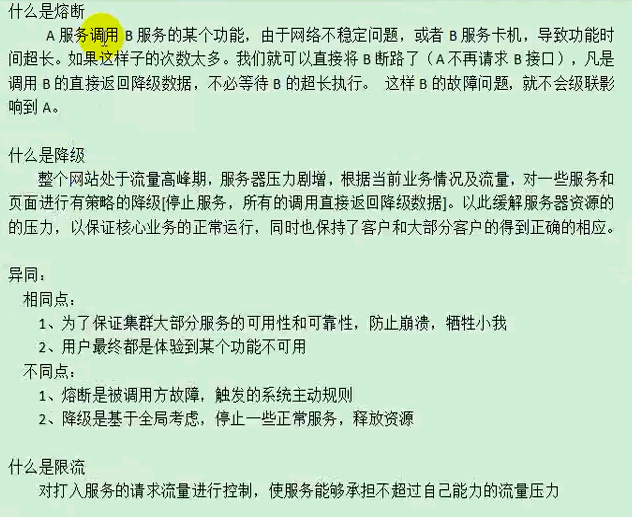
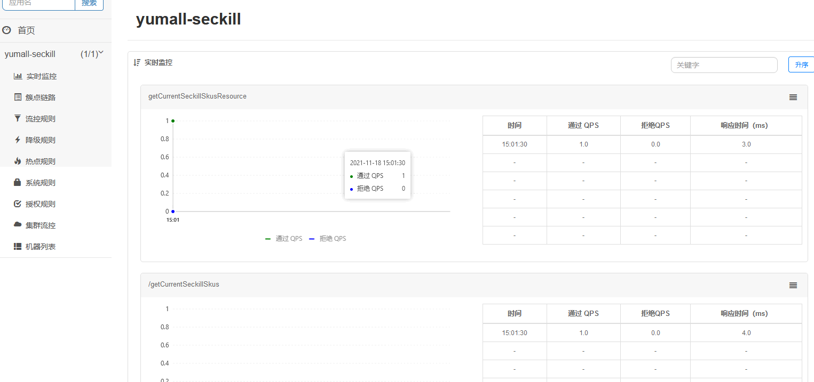
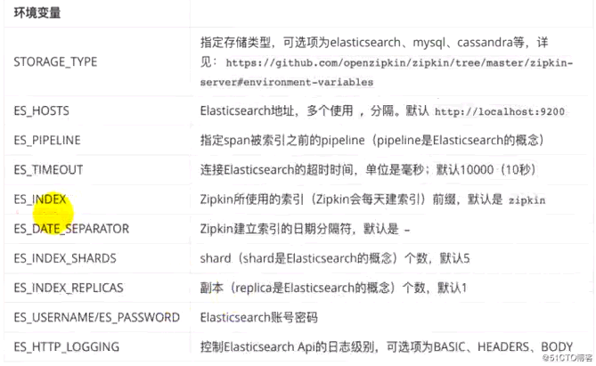

nacos、gateway、sentinel、sleuth

<!-- more -->

## 1、Nacos

官方地址：<https://nacos.io>

github地址：<https://github.com/alibaba/nacos>

<https://nacos.io/zh-cn/docs/quick-start-spring-boot.html>

### 面试题：微服务间远程交互的过程？

1. 先去注册中心查询服务的服务器地址
2. 调用方给对方发送http请求

### 可以干什么

Nacos是以服务为主要服务对象的中间件，Nacos支持所有主流的服务发现、配置和管理。

Nacos主要提供以下四大功能：

1. 服务发现和服务健康监测
2. 动态配置服务
3. 动态DNS服务
4. 服务及其元数据管理

### A、spring cloud

| 版本                   | spring cloud   | springboot     |
| ---------------------- | -------------- | -------------- |
| Spring Cloud Greenwich | 2.1.x. RELEASE | 2.1 x.RELEASE  |
| Spring Cloud Finchley  | 2.0.x. RELEASE | 2.0.x.RELEASE  |
| Spring Cloud Edgware   | 1.5.x.RELEASE  | 1.5.x.REL EASE |

```xml
commen：    
<dependencyManagement>
        <dependencies>
            <dependency>
                <groupId>com.alibaba.cloud</groupId>
                <artifactId>spring-cloud-alibaba-dependencies</artifactId>
                <version>2.1.0.RELEASE</version>
                <type>pom</type>
                <scope>import</scope>
            </dependency>
        </dependencies>
    </dependencyManagement>
模块：
  <properties>
        <java.version>1.8</java.version>
        <spring-cloud.version>Greenwich.SR3</spring-cloud.version>
    </properties>
    <dependencyManagement>
        <dependencies>
            <dependency>
                <groupId>org.springframework.cloud</groupId>
                <artifactId>spring-cloud-dependencies</artifactId>
                <version>${spring-cloud.version}</version>
                <type>pom</type>
                <scope>import</scope>
            </dependency>
        </dependencies>
    </dependencyManagement>
```

#### nacos 注册中心

```xml
common：
<dependency>
    <groupId>com.alibaba.cloud</groupId>
    <artifactId>spring-cloud-starter-alibaba-nacos-discovery</artifactId>
</dependency>

<dependency>
    <groupId>com.alibaba.boot</groupId>
    <artifactId>nacos-config-spring-boot-starter</artifactId>
    <version>0.2.7</version>
</dependency>
```

在应用的 application.properties 配置文件中配置 Nacos Server 地址

```bash
 spring.cloud.nacos.discovery.server-addr=127.0.0.1:8848
```

A、需要下载nacos：<https://github.com/alibaba/nacos/releases>

```bash
mvn -Prelease-nacos clean install -U
./startup.sh -m standalone
```

B、docker 安装nacos： docker pull nacos/nacos-mysql:5.7（docker pull nacos/nacos-server）

```bash
docker pull nacos/nacos-mysql:5.7
docker pull nacos/nacos-server
docker run --env MODE=standalone --name nacos -d -p 8848:8848 nacos/nacos-server
```

#### nacos 配置中心

##### 手动加载

common

```xml
 <!--        配置中心来做配置管理-->
        <dependency>
            <groupId>com.alibaba.cloud</groupId>
            <artifactId>spring-cloud-starter-alibaba-nacos-config</artifactId>
        </dependency>
```

yumall-coupon

创建bootstrap，优先于xxxx.properties

```properties
bootstrap.properties：：：：：：：
 spring.application.name=yumall-coupon
 #配置中心  
 spring.cloud.nacos.config.server-addr=127.0.0.1:8848
--------------------------
application.properties：：：：：：
 coupon.user.name=zhangsan2
 coupon.user.age=20
```

测试 <http://localhost:8400/coupon/coupon/test>

```java
@RestController
@RequestMapping("coupon/coupon")
public class CouponController {
@Value("${coupon.user.name}")
    private String name;
    @Value("${coupon.user.age}")
    private Integer age;

    @RequestMapping("/test")
    public R test(){
        return R.ok().put("name",name).put("age",age);
    }
}
```

```json
{"msg":"success","code":0,"name":"zhangsan2","age":20}
```

##### 自动加载配置文件

nacos--》配置列表-》新建：yumall-coupon.properties

```Java
@RefreshScope //自动加载配置文件
@RestController
@RequestMapping("coupon/coupon")
public class CouponController {....}
```

```json
http://localhost:8400/coupon/coupon/test
{"msg":"success","code":0,"name":"zhangsan2","age":200}
####修改 yumall-coupon.properties
{"msg":"success","code":0,"name":"zhang","age":22}
```

#### 总结1

优先使用配置中心的配置

```Java
/**
 * 1、如何使用Nacos作为配置中心统一管理配置
 *
 * 1）、引入依赖，
 *         <dependency>
 *             <groupId>com.alibaba.cloud</groupId>
 *             <artifactId>spring-cloud-starter-alibaba-nacos-config</artifactId>
 *         </dependency>
 * 2）、创建一个bootstrap.properties。
 *      spring.application.name=yumall-coupon
 *      spring.cloud.nacos.config.server-addr=127.0.0.1:8848
 * 3）、需要给配置中心默认添加一个叫 数据集（Data Id）gulimall-coupon.properties。默认规则，应用名.properties
 * 4）、给 应用名.properties 添加任何配置
 * 5）、动态获取配置。
 *      @RefreshScope：动态获取并刷新配置
 *      @Value("${配置项的名}")：获取到配置。
 *      如果配置中心和当前应用的配置文件中都配置了相同的项，优先使用配置中心的配置。
 *
 * 2、细节
 *  
 *
 * 3、同时加载多个配置集
 * 1)、微服务任何配置信息，任何配置文件都可以放在配置中心中
 * 2）、只需要在bootstrap.properties说明加载配置中心中哪些配置文件即可
 * 3）、@Value，@ConfigurationProperties。。。
 * 以前SpringBoot任何方法从配置文件中获取值，都能使用。
 * 配置中心有的优先使用配置中心中的，
 */
```

#### 细节

##### 命名空间、配置集、配置集ID、配置分组

```java
/**
 * 1）、命名空间：配置隔离；
 *      默认：public(保留空间)；默认新增的所有配置都在public空间。
 *      1、开发，测试，生产：利用命名空间来做环境隔离。
 *         注意：在bootstrap.properties；配置上，需要使用哪个命名空间下的配置，
 *         spring.cloud.nacos.config.namespace=9de62e44-cd2a-4a82-bf5c-95878bd5e871
 *      2、每一个微服务之间互相隔离配置，每一个微服务都创建自己的命名空间，只加载自己命名空间下的所有配置
 * 2）、配置集：所有的配置的集合
 * 3）、配置集ID：类似文件名。
 *      Data ID：类似文件名
 * 4）、配置分组：
 *      默认所有的配置集都属于：DEFAULT_GROUP；
 *      1111，618，1212
 *
 * 项目中的使用：每个微服务创建自己的命名空间，使用配置分组区分环境，dev，test，prod
 */
```

###### 创建命名空间

在prod空间创建 yumall-coupon.properties

```properties
coupon.user.name=zzz
coupon.user.age=222
```

配置文件使用

```properties
#指定命名空间
spring.cloud.nacos.config.namespace=d1ed6f76-3248-4166-ae01-13ab72eaea60
```

```json
http://localhost:8400/coupon/coupon/test

{"msg":"success","code":0,"name":"zzz","age":222}
修改prod---yumall-coupon.properties
{"msg":"success","code":0,"name":"zzz222","age":2022}
```

每一个微服务之间互相隔离配置，每一个微服务都创建自己的命名空间，只加载自己命名空间下的所有配置

| 命名空间名称     | 命名空间ID                           | 配置数 | 操作         |
| :--------------- | :----------------------------------- | :----- | :----------- |
| public(保留空间) |                                      | 1      | 详情删除编辑 |
| coupon           | ce7e5c1c-645e-460f-b486-bc4659d2207b | 0      | 详情删除编辑 |
| product          | 9b620b25-6af6-46b3-a430-2f5e9fd79e5a | 0      | 详情删除编辑 |
| ware             | aa5b7425-7db2-4ed9-a608-e84163837478 | 0      | 详情删除编辑 |
| member           | acce6cd5-2d58-412f-903a-7d22ab41d7ea | 0      | 详情删除编辑 |
| order            | afdf7969-5d7b-460f-8e53-f4c35da8c060 | 0      | 详情删除编辑 |
| coupon           | ce7e5c1c-645e-460f-b486-bc4659d2207b | 0      | 详情删除编辑 |

把克隆到自己的命名空间内，并项目更新配置文件

```properties
spring.cloud.nacos.config.namespace=ce7e5c1c-645e-460f-b486-bc4659d2207b
```

刷新OK

###### 配置分组

- 默认所有的配置集都属于：DEFAULT_GROUP；
- test，618，1212

coupon空间新建配置 yumall-coupon.properties

|      | Data Id                  | Group         | 操作 |      |
| :--- | :----------------------- | :------------ | :--- | ---- |
|      | yumall-coupon.properties | DEFAULT_GROUP |      |      |
|      | yumall-coupon.properties | test          |      |      |

指定组

```properties
spring.cloud.nacos.config.group=test
```

每个微服务创建自己的命名空间，使用配置分组区分环境，dev，test，prod

yumall-coupon.properties

|      | Data Id                  | Group |
| :--- | :----------------------- | :---- |
|      | yumall-coupon.properties | test  |
|      | yumall-coupon.properties | prod  |
|      | yumall-coupon.properties | dev   |

```properties
spring.cloud.nacos.config.group=dev
```

<http://localhost:8400/coupon/coupon/test>

```json
{"msg":"success","code":0,"name":"dev00","age":200}
```

#### 全部加载多配置集

##### nacos创建配置集

|      | Data Id                  | Group | 归属应用: | 操作                             |
| :--- | :----------------------- | :---- | :-------- | :------------------------------- |
|      | yumall-coupon.properties | prod  |           | 详情\|示例代码\|编辑\|删除\|更多 |
|      | datasource.yml           | dev   |           | 详情\|示例代码\|编辑\|删除\|更多 |
|      | mybatis.yml              | dev   |           | 详情\|示例代码\|编辑\|删除\|更多 |
|      | redis.yml                | dev   |           | 详情\|示例代码\|编辑\|删除\|更多 |
|      | nacos.yml                | dev   |           | 详情\|示例代码\|编辑\|删除\|更多 |
|      | yumall-coupon.properties | dev   |           | 详情\|示例代码\|编辑\|删除\|更多 |

##### 配置文件

```properties
spring.application.name=yumall-coupon
#配置中心
spring.cloud.nacos.config.server-addr=127.0.0.1:8848
##指定命名空间
spring.cloud.nacos.config.namespace=bef46632-ac77-4fac-b493-ad31926761be
##prod dev
spring.cloud.nacos.config.group=dev
#refresh 自动刷新配置
#基本配置
spring.cloud.nacos.config.ext-config[0].data-id=other.yml
spring.cloud.nacos.config.ext-config[0].group=dev
spring.cloud.nacos.config.ext-config[0].refresh=true
#数据源
spring.cloud.nacos.config.ext-config[1].data-id=datasource.yml
spring.cloud.nacos.config.ext-config[1].group=dev
spring.cloud.nacos.config.ext-config[1].refresh=true
#mybatis-plus
spring.cloud.nacos.config.ext-config[2].data-id=mybatis.yml
spring.cloud.nacos.config.ext-config[2].group=dev
spring.cloud.nacos.config.ext-config[2].refresh=true
#redis
spring.cloud.nacos.config.ext-config[3].data-id=redis.yml
spring.cloud.nacos.config.ext-config[3].group=dev
spring.cloud.nacos.config.ext-config[3].refresh=true
#多数据源
#spring.cloud.nacos.config.ext-config[4].data-id=dynamic.yml
#spring.cloud.nacos.config.ext-config[4].group=dev
#spring.cloud.nacos.config.ext-config[4].refresh=true
```

#### 总结2

```bash
3、同时加载多个配置集
 1)、微服务任何配置信息，任何配置文件都可以放在配置中心中
 2）、只需要在bootstrap.properties说明加载配置中心中哪些配置文件即可
 3）、@Value，@ConfigurationProperties
 以前SpringBoot任何方法从配置文件中获取值，都能使用。
 配置中心有的优先使用配置中心中的
```

#### 全部测试

<http://localhost:8100/product/attr/test> <http://localhost:8200/order/order/test>

<http://localhost:8300/ware/wareinfo/test> <http://localhost:8400/coupon/coupon/test>

<http://localhost:8500/member/member/test>

### B、spring boot

​ 项目中没有使用nacos官方提供的方式使用SpringBoot的集成方式来进行集成，而是使用了Alibaba Spring  Cloud的依赖包进行集成。

​ 原因是因为官网提供的SpringBoot集成方式中，同时使用配置中心和服务发现功能，会使得服务发现功能配置的部分属性冲突不生效。最直接的就是配置中心和服务发现功能不可以配置2个不同的namespace，会默认选择使用配置中心中配置的namespace作为服务发现的 namespace。

​ **由于spring cloud alibaba nacos  config的加载机制问题，配置信息如果写在了 application-{xx}.yml  的配置文件中无法被解析。所以如果需要分多环境动态加载，可以写在 bootstrap-{xxx}.yml 文件中。**

```xml
  <groupId>org.springframework.boot</groupId>
        <artifactId>spring-boot-starter-parent</artifactId>
        <version>2.3.12.RELEASE</version>

<dependency>
    <groupId>com.alibaba.cloud</groupId>
    <artifactId>spring-cloud-starter-alibaba-nacos-config</artifactId>
    <version>2.2.5.RELEASE</version>
</dependency>
<dependency>
    <groupId>com.alibaba.cloud</groupId>
    <artifactId>spring-cloud-starter-alibaba-nacos-config-server</artifactId>
    <version>2.2.5.RELEASE</version>
</dependency>
```

bootstrap-{xxx}.yml

```yaml
spring:
  cloud:
    nacos:
      discovery:
        server-addr: 127.0.0.1:8848
      config:
        server-addr: 127.0.0.1:8848
        namespace: ec067xxxxxxxxx
        file-extension: yml
        extension-configs:
          - dataId: other.yml
            group: dev
            refresh: true
          - dataId: redis.yml
            group: dev
            refresh: true
          - dataId: oss.yml
            group: dev
            refresh: true
```

问题：

```ABAP
com.alibaba.nacos.client.naming : [initializer namespace from System Property :null]
com.alibaba.nacos.client.naming : [initializer namespace from System Environment :null]
com.alibaba.nacos.client.naming : [initializer namespace from System Property :null]

Ignore the empty nacos configuration and get it based on dataId[codetools] & group[DEFAULT_GROUP]
Ignore the empty nacos configuration and get it based on dataId[codetools.yml] & group[DEFAULT_GROUP]
Ignore the empty nacos configuration and get it based on dataId[codetools-prod.yml] & group[DEFAULT_GROUP]

Error creating bean with name 'testController': Injection of autowired dependencies failed; nested exception is java.lang.IllegalArgumentException: Could not resolve placeholder 'user1.name' in value "${user1.name}"

解决办法：application-*.yml 换成 bootstrap-*.yml
application-dev.yml  bootstrap-dev.yml
application-prod.yml bootstrap-prod.yml
application-test.yml bootstrap-test.yml
application.yml   bootstrap.yml
```

```java
@Slf4j
@RequestMapping("/get")
@RestController
@RefreshScope
public class TestController {

    @Value("${user1.name}")
    private String name;
    @Value("${spring.redis.open}")
    private Boolean open;

    @RequestMapping("/log")
    public String getLog() {
        String str = "name:" + name + ",open:" + open;
        log.debug("=====测试日志 debug 级别打印====");
        log.info("======测试日志 info 级别打印=====");
        log.error("=====测试日志 error 级别打印====");
        log.warn("======测试日志 warn 级别打印=====");
        return str;
    }
}
```

## 2、 服务网关 Gateway

```yml
spring:
  cloud:
    gateway:
      routes:  
        - id: product_route
          uri: lb://yumall-product
          predicates:
            - Path=/api/product/**
          filters:
            - RewritePath=/api/(?<segment>.*),/$\{segment}  
            
        - id: admin_route
          uri: lb://renren-fast  lb：负载均衡，//到哪个服务
          predicates:    断言
            - Path=/api/**
          filters:     RewritePath重写路径
            - RewritePath=/api/(?<segment>.*),/renren-fast/$\{segment}    
```

创建gateway项目，引入gateway依赖，

```java
<dependency>
            <groupId>com.kong.yumall</groupId>
            <artifactId>yumall-common</artifactId>
            <version>0.0.1</version>
            <exclusions>
                <exclusion>
                    <groupId>com.baomidou</groupId>
                    <artifactId>mybatis-plus-boot-starter</artifactId>
                </exclusion>
                <exclusion>
                    <groupId>mysql</groupId>
                    <artifactId>mysql-connector-java</artifactId>
                </exclusion>
                <exclusion>
                    <groupId>com.alibaba</groupId>
                    <artifactId>druid-spring-boot-starter</artifactId>
                </exclusion>
            </exclusions>
        </dependency>
        <dependency>
            <groupId>org.springframework.cloud</groupId>
            <artifactId>spring-cloud-starter-gateway</artifactId>
        </dependency>
------------------------------------------------- 
/**
 * 1、开启服务注册发现
 * (配置nacos的注册中心地址)
 * 2、编写网关配置文件
 */
@EnableDiscoveryClient
@SpringBootApplication(exclude = {DataSourceAutoConfiguration.class})
public class YumallGatewayApplication {
```

application.properties

```properties
spring.application.name=yumall-gateway
spring.cloud.nacos.discovery.server-addr=127.0.0.1:8848
server.port=50000
```

bootstrap.properties

```properties
spring.application.name=yumall-gateway
spring.cloud.nacos.config.server-addr=127.0.0.1:8848
spring.cloud.nacos.config.namespace=e8fdcd97-4d77-4da5-8b2b-bd70f36ffbc3
```

断言:application.yml

<https://cloud.spring.io/spring-cloud-static/spring-cloud-gateway/2.1.5.RELEASE/single/spring-cloud-gateway.html>

```yml
spring:
  cloud:
    gateway:
      routes:
        - id: query_route
          uri: https://example.org
          predicates:
            - Query=foo, ba

        - id: test_route
          uri: https://www.baidu.com
          predicates:
            - Query=url, baidu

        - id: qq_route
          uri: https://www.qq.com
          predicates:
            - Query=url, qq
```

测试  <http://localhost:50000/hello?foo=ba> ----  <http://localhost:50000/hello?url=baidu>

## 3、openfeign 远程调用服务

- 1、想要远程调用别的服务
  - 1）、引入open-feign
  - 2）、编写一个接口，告诉SpringCloud这个接口需要调用远程服务
    - 1、声明接口的每一个方法都是调用哪个远程服务的那个请求
  - 3）、开启远程调用功能

member调用coupon

准备

```xml
引入open-feign
<dependency>
        <groupId>org.springframework.cloud</groupId>
        <artifactId>spring-cloud-starter-openfeign</artifactId>
</dependency>
```

```java
coupon:-------------------------------------
@RequestMapping("coupon/coupon")
public class CouponController {
    @Autowired
    private CouponService couponService;
    @RequestMapping("/member/list")
    public R membercoupons() {
        CouponEntity couponEntity = new CouponEntity();
        couponEntity.setCouponName("满100减10");
        return R.ok().put("coupons", Arrays.asList(couponEntity));
    }
```

编写一个接口，告诉SpringCloud这个接口需要调用远程服务

```java
member-feign->CouponFeignService
/**
 * 这是一个声明式的远程调用
 */
@FeignClient("yumall-coupon")
public interface CouponFeignService {
 //声明接口的每一个方法都是调用哪个远程服务的那个请求
    @RequestMapping("/coupon/coupon/member/list")
    public R membercoupons();
}
```

开启远程调用功能

```Java
//member：YumallMemberApplication启动类
    @EnableFeignClients(basePackages = "com.kong.yumall.member.feign")
```

测试

```Java
member-MemberController
    @Autowired
    CouponFeignService couponFeignService;

    /**
     * 获取优惠券信息
     * @return
     */
    @RequestMapping("/coupons")
    public R test(){
        MemberEntity memberEntity = new MemberEntity();
        memberEntity.setNickname("张三");
        R membercoupons = couponFeignService.membercoupons();
        return R.ok().put("member",memberEntity).put("coupons",membercoupons.get("coupons"));
    }
```

<http://localhost:8500/member/member/coupons>

```json
{"msg":"success","code":0,"coupons":[{"id":null,"couponType":null,"couponImg":null,"couponName":"满100减10","num":null,"amount":null,"perLimit":null,"minPoint":null,"startTime":null,"endTime":null,"useType":null,"note":null,"publishCount":null,"useCount":null,"receiveCount":null,"enableStartTime":null,"enableEndTime":null,"code":null,"memberLevel":null,"publish":null}],"member":{"id":null,"levelId":null,"username":null,"password":null,"nickname":"张三","mobile":null,"email":null,"header":null,"gender":null,"birth":null,"city":null,"job":null,"sign":null,"sourceType":null,"integration":null,"growth":null,"status":null,"createTime":null}}
```

## 4. Sentinel



官网：<https://github.com/alibaba/spring-cloud-alibaba/wiki/Sentinel>

### 1、安装+配置

```xml
     <dependency>
            <groupId>com.alibaba.cloud</groupId>
            <artifactId>spring-cloud-starter-alibaba-sentinel</artifactId>
        </dependency>
        <!--自定义 sentinel 流控-->
        <dependency>
            <groupId>org.springframework.boot</groupId>
            <artifactId>spring-boot-starter-actuator</artifactId>
        </dependency>
        <dependency>
            <groupId>com.alibaba.csp</groupId>
            <artifactId>sentinel-core</artifactId>
            <version>1.8.0</version>
        </dependency>
  <dependency>
            <groupId>com.alibaba.csp</groupId>
            <artifactId>sentinel-web-servlet</artifactId>
            <version>1.8.0</version>
        </dependency>
```

Sentinel界面下载：<https://github.com/alibaba/Sentinel/releases/tag/v1.8.0>

运行： java -jar .\sentinel-dashboard-1.8.0.jar --server.port=8999

<http://127.0.0.1:8999> sentinel

配置控制台信息：

```properties
cloud:
  sentinel:
    transport:
      #配置sentinel dashboard地址
      dashboard: localhost:8999
      #默认8719端口，假如被占用会自动从8719开始依次+1扫描，直至找到未被占用的端口
      port: 8719
```

测试 <http://localhost:8700/getCurrentSeckillSkus> <http://seckill.yumall.com/getCurrentSeckillSkus>



```java
/**
 * 1、整合Sentinel
 * 1）、导入依赖 spring-cloud-starter-alibaba-sentinel
 * 2）、下载sentinel控制台
 * 3）、配置 sentinel 控制台地址信息
 * 4）、在控制台调整参数、【默认所有的流控规则保存在内存中，重启失效】
 * <p>
 * 2、每一个微服务都导入 actuator ：并配合 management.endpoints.web.exposure.include=*
 * 3、自定义 sentinel 流控返回的数据
 * <p>
 * 4、使用Sentinel来保护feign远程调用，熔断；
 * 1）、调用方的熔断保护：feign.sentinel.enable=true
 * 2）、调用方手动指定远程服务的降级策略。远程服务被降级处理。触发我们的熔断回调方法
 * 3）、超大浏览的时候，必须牺牲一些远程服务。在服务的提供方（远程服务）指定降级策略；
 * 提供方是在运行，但是不允许自己的业务逻辑，返回的是默认的降级数据（限流的数据）
 * <p>
 * 5、自定义受保护的资源
 * 1）、代码
 * try (Entry entry = SphU.entry("seckillSkus")) {
 * //业务逻辑
 * } catch(Exception e) {}
 * <p>
 * 2）、基于注解
 */
```

### 2、自定义流控

导入spring-boot-starter-actuator

配置，暴露所有端点：management.endpoints.web.exposure.include=*

```java
@Configuration
public class MySentinelConfig {
    public MySentinelConfig() {
        WebCallbackManager.setUrlBlockHandler(new UrlBlockHandler() {
            @Override
            public void blocked(HttpServletRequest request, HttpServletResponse response, BlockException ex) throws IOException {
                R error = R.error(BizCodeEnum.TO_MANY_REQUEST.getCode(), BizCodeEnum.TO_MANY_REQUEST.getMsg());
                response.setCharacterEncoding("UTF-8");
                response.setContentType("application/json");
                response.getWriter().write(JSON.toJSONString(error));
            }
        });
```

### 3、熔断、降级

```java
 * 4、使用Sentinel来保护feign远程调用，熔断；
 * 1）、调用方的熔断保护：feign.sentinel.enable=true
 * 2）、调用方手动指定远程服务的降级策略。远程服务被降级处理。触发我们的熔断回调方法
 * 3）、超大浏览的时候，必须牺牲一些远程服务。在服务的提供方（远程服务）指定降级策略；
 * 提供方是在运行，但是不允许自己的业务逻辑，返回的是默认的降级数据（限流的数据）
```

SeckillFeignService

```java
@FeignClient(value = "yumall-seckill",fallback = SeckillFeignServiceFallBack.class)
public interface SeckillFeignService {

   /**
    * 根据skuId查询商品是否参加秒杀活动
    * @param skuId
    * @return
    */
   @GetMapping(value = "/sku/seckill/{skuId}")
    R getSkuSeckilInfo(@PathVariable("skuId") Long skuId);

}

@Component
public class SeckillFeignServiceFallBack implements SeckillFeignService {
    @Override
    public R getSkuSeckilInfo(Long skuId) {
        return R.error(BizCodeEnum.TO_MANY_REQUEST.getCode(),BizCodeEnum.TO_MANY_REQUEST.getMsg());
    }
}
```

### 4、自定义受保护的资源

```
 * 5、自定义受保护的资源
 * 1）、代码
 * try (Entry entry = SphU.entry("seckillSkus")) {
 * //业务逻辑
 * } catch(Exception e) {}
 * <p>
 * 2）、基于注解
```

```java
@SentinelResource(value = "getCurrentSeckillSkusResource", blockHandler = "blockHandler")
    @Override
    public List<SeckillSkuRedisTo> getCurrentSeckillSkus() {
    
    
    
public List<SeckillSkuRedisTo> blockHandler(BlockException e) {
        log.error("getCurrentSeckillSkusResource被限流了,{}", e.getMessage());
        return null;
    }
```

### 4.1. Sentinel 是什么？

Sentinel 以流量为切入点，从流量控制、熔断降级、系统负载保护等多个维度保护服务的稳定性。

Sentinel 分为两个部分:

- 核心库（Java 客户端）不依赖任何框架/库，能够运行于所有 Java 运行时环境，同时对 Dubbo / Spring Cloud 等框架也有较好的支持。
- 控制台（Dashboard）基于 Spring Boot 开发，打包后可以直接运行，不需要额外的 Tomcat 等应用容器。

Sentinel 可以简单的分为 Sentinel 核心库和 Dashboard。核心库不依赖 Dashboard，但是结合 Dashboard 可以取得最好的效果。

### 4.2. 基本概念及作用

基本概念：

 **资源**：是 Sentinel 的关键概念。它可以是 Java 应用程序中的任何内容，例如，由应用程序提供的服务，或由应用程序调用的其它应用提供的服务，甚至可以是一段代码。在接下来的文档中，我们都会用资源来描述代码块。

只要通过 Sentinel API 定义的代码，就是资源，能够被 Sentinel 保护起来。大部分情况下，可以使用方法签名，URL，甚至服务名称作为资源名来标示资源。

**规则**：围绕资源的实时状态设定的规则，可以包括流量控制规则、熔断降级规则以及系统保护规则。所有规则可以动态实时调整。

主要作用：

1. 流量控制
2. 熔断降级
3. 系统负载保护

我们说的资源，可以是任何东西，服务，服务里的方法，甚至是一段代码。使用 Sentinel 来进行资源保护，主要分为几个步骤:

1. 定义资源
2. 定义规则
3. 检验规则是否生效

先把可能需要保护的资源定义好，之后再配置规则。也可以理解为，只要有了资源，我们就可以在任何时候灵活地定义各种流量控制规则。在编码的时候，只需要考虑这个代码是否需要保护，如果需要保护，就将之定义为一个资源。

### 4.3. 快速开始

官方文档：<https://github.com/alibaba/spring-cloud-alibaba/wiki/Sentinel>

#### 4.3.1. 搭建Dashboard控制台

您可以从 release 页面 下载最新版本的控制台 jar 包。

<https://github.com/alibaba/Sentinel/releases>

下载的jar包（课前资料已下发），copy到一个没有空格或者中文的路径下，打开dos窗口切换到jar包所在目录。

执行：java -jar sentinel-dashboard-xxx.jar

在浏览器中访问sentinel控制台，默认端口号是8080。进入登录页面，管理页面用户名和密码：sentinel/sentinel

此时页面为空，这是因为还没有监控任何服务。另外，sentinel是懒加载的，如果服务没有被访问，也看不到该服务信息。

#### 4.3.2. 改造nacos-consumer

1. 引入 sentinel 依赖

使用 group ID 为 `com.alibaba.cloud` 和 artifact ID 为 `spring-cloud-starter-alibaba-sentinel` 的 starter。

```xml
<dependency>
    <groupId>com.alibaba.cloud</groupId>
    <artifactId>spring-cloud-starter-alibaba-sentinel</artifactId>
</dependency>
```

2. 在application.properties中添加配置

```properties
## 指定dashboard地址
spring.cloud.sentinel.transport.dashboard=localhost:8080
## 启动该服务，会在应用程序的相应服务器上启动HTTP Server，并且该服务器将与Sentinel dashboard进行交互
spring.cloud.sentinel.transport.port=8719
```

重启nacos-consumer工程，在浏览器中反复访问：<http://localhost:18080/hi>

再次查看sentinel控制台页面：

### 4.4. 整合Feign组件

Sentinel 适配了 Feign 组件。使用分三步：

1. 引入依赖：

引入feign及sentinel的依赖

```xml
<dependency>
    <groupId>com.alibaba.cloud</groupId>
    <artifactId>spring-cloud-starter-alibaba-sentinel</artifactId>
</dependency>

<dependency>
    <groupId>org.springframework.cloud</groupId>
    <artifactId>spring-cloud-starter-openfeign</artifactId>
</dependency>
```

2. 开启sentinel监控功能

```
feign.sentinel.enabled=true
```

3. 代码实现

添加feign接口的熔断类ProviderFallback：

```java
@Component
public class ProviderFallback implements ProviderClient {

    @Override
    public String hello() {
        return "现在服务器忙，请稍后再试！";
    }
}
```

在feign接口ProviderClient中指定熔断类：

测试之前，先在服务提供方的controller方法中添加异常：

再重启nacos-provider和nacos-consumer服务。在浏览器中地址栏访问消费方测试：

### 4.5. 流量控制

#### 4.5.1. 什么是流量控制

流量控制在网络传输中是一个常用的概念，它用于调整网络包的发送数据。然而，从系统稳定性角度考虑，在处理请求的速度上，也有非常多的讲究。任意时间到来的请求往往是随机不可控的，而系统的处理能力是有限的。我们需要根据系统的处理能力对流量进行控制。Sentinel 作为一个调配器，可以根据需要把随机的请求调整成合适的形状，如下图所示：

流量控制有以下几个角度:

- 资源的调用关系，例如资源的调用链路，资源和资源之间的关系；
- 运行指标，例如 QPS、线程数等；
- 控制的效果，例如直接限流（快速失败）、冷启动（Warm Up）、匀速排队（排队等待）等。

Sentinel 的设计理念是让您自由选择控制的角度，并进行灵活组合，从而达到想要的效果。

配置如下：

#### 4.5.2. QPS流量控制

当 QPS 超过某个阈值的时候，则采取措施进行流量控制。流量控制的效果包括以下几种：**直接拒绝**、**Warm Up**、**匀速排队**。

##### 4.5.2.1. 直接拒绝

**直接拒绝**（`RuleConstant.CONTROL_BEHAVIOR_DEFAULT`）方式是默认的流量控制方式，当QPS超过任意规则的阈值后，新的请求就会被立即拒绝，拒绝方式为抛出`FlowException`。这种方式适用于对系统处理能力确切已知的情况下，比如通过压测确定了系统的准确水位时。

这里做一个最简单的配置：

​    阈值类型选择：QPS

​    单机阈值：2

综合起来的配置效果就是，该接口的限流策略是每秒最多允许2个请求进入。

点击新增按钮之后，可以看到如下界面：

在浏览器访问：<http://localhost:18080/hi>，并疯狂刷新，出现如下信息：

##### 4.5.2.2. Warm Up（预热）

Warm Up（`RuleConstant.CONTROL_BEHAVIOR_WARM_UP`）方式，即预热/冷启动方式。当系统长期处于低水位的情况下，当流量突然增加时，直接把系统拉升到高水位可能瞬间把系统压垮。通过"冷启动"，让通过的流量缓慢增加，在一定时间内逐渐增加到阈值上限，给冷系统一个预热的时间，避免冷系统被压垮。

疯狂访问：<http://localhost:18080/hi>

可以发现前几秒会发生熔断，几秒钟之后就完全没有问题了

##### 4.5.2.3. 匀速排队

匀速排队（`RuleConstant.CONTROL_BEHAVIOR_RATE_LIMITER`）方式会严格控制请求通过的间隔时间，也即是让请求以均匀的速度通过，对应的是漏桶算法。

测试配置如下：1s处理一个请求，排队等待，等待时间20s。

在postman中，新建一个collection（这里collection名称是sentinel），并把一个请求添加到该collection

请求添加成功后，点击run按钮：

配置每隔100ms发送一次请求，一共发送20个请求：

点击“run sentinel”按钮

查看控制台，效果如下：可以看到基本每隔1s打印一次

#### 4.5.3. 关联限流

关联限流：当关联的资源请求达到阈值时，就限流自己。

配置如下：/hi2的关联资源/hi，并发数超过2时，/hi2就限流自己

给消费者添加一个controller方法

测试：

postman配置如下：每个400ms发送一次请求，一共发送50个。每秒钟超过了2次

在浏览器中访问/hi2  已经被限流。

#### 4.5.4. 链路限流

一棵典型的调用树如下图所示：

```
                machine-root
                    /       \
                   /         \
             Entrance1     Entrance2
                /             \
               /               \
      DefaultNode(nodeA)   DefaultNode(nodeA)
```

上图中来自入口 `Entrance1` 和 `Entrance2` 的请求都调用到了资源 `NodeA`，Sentinel 允许只根据某个入口的统计信息对资源限流。

配置如下：表示只针对Entrance1进来的请求做限流限制

#### 4.5.5. 线程数限流

**并发线程数限流用于保护业务线程数不被耗尽。**例如，当应用所依赖的下游应用由于某种原因导致服务不稳定、响应延迟增加，对于调用者来说，意味着吞吐量下降和更多的线程数占用，极端情况下甚至导致线程池耗尽。为应对太多线程占用的情况，业内有使用隔离的方案，比如通过不同业务逻辑使用不同线程池来隔离业务自身之间的资源争抢（线程池隔离）。这种隔离方案虽然隔离性比较好，但是代价就是线程数目太多，线程上下文切换的 overhead 比较大，特别是对低延时的调用有比较大的影响。Sentinel 并发线程数限流不负责创建和管理线程池，而是简单统计当前请求上下文的线程数目，如果超出阈值，新的请求会被立即拒绝，效果类似于信号量隔离。

配置如下：如果请求的并发数超过一个就限流

改造controller中的hi方法：

**测试**

postmain配置如下：

同时在浏览器访问：

### 4.6. 熔断降级

Sentinel除了流量控制以外，对调用链路中不稳定的资源进行熔断降级也是保障高可用的重要措施之一。

Sentinel **熔断降级**会在调用链路中某个资源出现不稳定状态时（例如调用超时或异常比例升高），对这个资源的调用进行限制，让请求快速失败，避免影响到其它的资源而导致级联错误。当资源被降级后，在接下来的降级时间窗口之内，对该资源的调用都自动熔断（默认行为是抛出 `DegradeException`）。

Sentinel 和 Hystrix 的原则是一致的: 当调用链路中某个资源出现不稳定，例如，表现为 timeout，异常比例升高的时候，则对这个资源的调用进行限制，并让请求快速失败，避免影响到其它的资源，最终产生雪崩的效果。

限流降级指标有三个，如下图：

1. 平均响应时间（RT）

2. 异常比例

3. 异常数

#### 4.6.1. 平均响应时间（RT）

**平均响应时间** (`DEGRADE_GRADE_RT`)：**当资源的平均响应时间超过阈值**（`DegradeRule` 中的 `count`，以 **ms** 为单位，默认上限是4900ms）之后，资源进入准降级状态。如果**1s之内持续进入 5 个请求**，它们的 RT 都持续超过这个阈值，那么在**接下来的时间窗口**（`DegradeRule` 中的 `timeWindow`，以 s 为单位）之内，对这个方法的调用都会自动地返回（抛出 `DegradeException`）。在下一个时间窗口到来时, 会接着再放入5个请求, 再重复上面的判断。

配置如下：超时时间100ms，熔断时间10s

代码中依然睡了1s

也就是说请求肯定都会超时。

先执行postmain，配置如下：

再次见到了熟悉的界面：

10s之内，都是熔断界面

#### 4.6.2. 异常比例

**异常比例** (`DEGRADE_GRADE_EXCEPTION_RATIO`)：**当资源的每秒请求量 >= 5，且每秒异常总数占通过量的比值超过阈值**（`DegradeRule` 中的 `count`）之后，资源进入降级状态，即在接下的时间窗口（`DegradeRule`中的 `timeWindow`，以 s 为单位）之内，对这个方法的调用都会自动地返回。异常比率的阈值范围是 `[0.0, 1.0]`，代表 0% - 100%。

#### 4.6.3. 异常数

**异常数** (`DEGRADE_GRADE_EXCEPTION_COUNT`)：当资源近 1 分钟的异常数目超过阈值之后会进行熔断。

### 4.7. 规则持久化

无论是通过硬编码的方式来更新规则，还是通过接入 Sentinel Dashboard 后，在页面上操作更新规则，都无法避免一个问题，那就是服务重启后，规则就丢失了，因为默认情况下规则是保存在内存中的。

我们在 Dashboard 上为客户端配置好了规则，并推送给了客户端。这时由于一些因素客户端出现异常，服务不可用了，当客户端恢复正常再次连接上 Dashboard 后，这时所有的规则都丢失了，我们还需要重新配置一遍规则，这肯定不是我们想要的。

持久化配置分以下3步：

1. 引入依赖

```xml
<dependency>
    <groupId>com.alibaba.csp</groupId>
    <artifactId>sentinel-datasource-nacos</artifactId>
</dependency>
```

2. 添加配置：

```properties
## 这里datasource后的consumer是数据源名称，可以随便写，推荐使用服务名
spring.cloud.sentinel.datasource.consumer.nacos.server-addr=localhost:8848
spring.cloud.sentinel.datasource.consumer.nacos.dataId=${spring.application.name}-sentinel-rules
spring.cloud.sentinel.datasource.consumer.nacos.groupId=SENTINEL_GROUP
spring.cloud.sentinel.datasource.consumer.nacos.data-type=json
## 规则类型，取值见：org.springframework.cloud.alibaba.sentinel.datasource.RuleType
spring.cloud.sentinel.datasource.consumer.nacos.rule_type=flow
```

3. nacos中创建流控规则

配置内容如下：

```json
[
    {
        "resource": "/hello",
        "limitApp": "default",
        "grade": 1,
        "count": 2,
        "strategy": 0,
        "controlBehavior": 0,
        "clusterMode": false
    }
]
```

resource：资源名称

limitApp：限流应用，就是用默认就可以

grade：阈值类型，0表示线程数，1表示qps

count：单机阈值

strategy：流控模式，0-直接，1-关联， 2-链路

controlBehavior：流控效果。0-快速失败，1-warm up 2-排队等待

clusterMode：是否集群

重启consumser，并多次访问：<http://localhost:18080/hi>。

查看sentinel客户端：就有了限流配置了

现在你可以尝试测试一下限流配置了

### 5、网关流控

```
<dependency>
    <groupId>com.alibaba.cloud</groupId>
    <artifactId>spring-cloud-alibaba-sentinel-gateway</artifactId>
</dependency>
```

```java
@Configuration
public class SentinelGatewayConfig {

    public SentinelGatewayConfig() {
        GatewayCallbackManager.setBlockHandler(new BlockRequestHandler() {
            //网关限流了请求，就会调用此回调
            @Override
            public Mono<ServerResponse> handleRequest(ServerWebExchange exchange, Throwable t) {

                R error = R.error(BizCodeEnum.TO_MANY_REQUEST.getCode(), BizCodeEnum.TO_MANY_REQUEST.getMsg());
                String errorJson = JSON.toJSONString(error);

                return ServerResponse.ok().body(Mono.just(errorJson), String.class);
            }
        });
    }

}
```

## 5. Sleuth

​  Spring Cloud Sleuth为springCloud实现了一个分布式链路追踪解决方案，大量借鉴了Dapper，Zipkin和HTrace等链路追踪技术。对于大多数用户而言，Sleuth应该是不可见的，并且您与外部系统的所有交互都应自动进行检测。您可以简单地在日志中捕获数据，也可以将其发送到远程收集器服务。

​  随着分布式系统越来越复杂，你的一个请求发过发过去，各个微服务之间的跳转，有可能某个请求某一天压力太大了，一个请求过去没响应，一个请求下去依赖了三四个服务，但是你去不知道哪一个服务出来问题，这时候我是不是需要对微服务进行追踪呀？监控一个请求的发起，从服务之间传递之间的过程，我最好记录一下，记录每一个的耗时多久，一旦出了问题，我们就可以针对性的进行优化，是要增加节点，减轻压力，还是服务继续拆分，让逻辑更加简单点呢？这时候**springcloud-sleuth集成zipkin**能帮我们解决这些服务追踪问题。

### 5.1. zipkin分布式监控客户端

Zipkin是一种分布式跟踪系统。它有助于收集解决微服务架构中的延迟问题所需的时序数据。它管理这些数据的收集和查找。Zipkin的设计基于Google Dapper论文。应用程序用于向Zipkin报告时序数据。Zipkin UI还提供了一个依赖关系图，显示了每个应用程序通过的跟踪请求数。如果要解决延迟问题或错误，可以根据应用程序，跟踪长度，注释或时间戳对所有跟踪进行筛选或排序。选择跟踪后，您可以看到每个跨度所需的总跟踪时间百分比，从而可以识别有问题的应用程序。

通过docker安装：docker run -d -p 9411:9411 openzipkin/zipkin

通过jar包安装：java -jar zipkin-server-*exec.jar

jar包下载地址：<https://search.maven.org/remote_content?g=io.zipkin&a=zipkin-server&v=LATEST&c=exec>

课前资料有已下载的jar包

在浏览器端访问：<http://localhost:9411>

### 5.2. 改造consumer/provider工程

对consumer和provider工程分别做如下操作：

1. 引入sleuth的依赖

```xml
<dependency>
    <groupId>org.springframework.cloud</groupId>
    <artifactId>spring-cloud-starter-zipkin</artifactId>
</dependency>
```

zipkin的启动器包含了sleuth的依赖。

2. 配置zipkin的相关信息

```properties
## zipkin服务器的地址
spring.zipkin.base-url=http://localhost:9411
## 关闭服务发现，否则springCloud会把zipkin的url当作服务名称
spring.zipkin.discovery-client-enabled=false
## 数据发送的方式：ACTIVEMQ RABBIT KAFKA WEB
spring.zipkin.sender.type=web
## 设置抽样采集率，默认0.1（即10%），这里设置为100%
spring.sleuth.sampler.probability=1
```

3. 重启consumer/provider服务后，访问消费者：<http://localhost:18080/hi。查看zipkin>客户端如下

这时候我们可以在zipkin的ui控制界面看看效果，可以发现，服务之间的调用关系，服务名称已经清晰展现出来了，同时包括服务之间的调用时常等详细信息以及更细的信息都可以通过控制台看到。

还可以查看调用关系图：

### 5.3. 基本概念

Span：基本工作单元。发送一个远程请求就会产生一个span，span通过一个64位ID唯一标识，trace以另一个64位ID表示，span还有其他数据信息，比如摘要、时间戳事件、关键值注释(tags)、span的ID、以及进度ID(通常是IP地址)。span在不断的启动和停止，同时记录了时间信息，当你创建了一个span，你必须在未来的某个时刻停止它。

Trace：一系列spans组成的一个树状结构。例如：发送一个请求，需要调用多个微服务，每调用一个微服务都会产生一个span，这些span组成一个trace

Annotation：用来及时记录一个事件的存在，一些核心annotations用来定义一个请求的开始和结束

- cs - Client Sent -客户端发起一个请求，这个annotion描述了这个span的开始
- sr - Server Received -服务端获得请求并准备开始处理它，如果将其sr减去cs时间戳便可得到网络延迟
- ss - Server Sent -注解表明请求处理的完成(当请求返回客户端)，如果ss减去sr时间戳便可得到服务端需要的处理请求时间
- cr - Client Received -表明span的结束，客户端成功接收到服务端的回复，如果cr减去cs时间戳便可得到客户端从服务端获取回复的所有所需时间

例如一个请求如下：

使用zipkin跟踪整个请求过程如下：

上图表示一请求链路，一条链路通过`Trace Id`唯一标识，`Span`标识发起的请求信息，各`span`通过`parent id` 关联起来，如图

## 6、sleuth+zipkin

### 1、介绍

**Span（跨度）**：基本工作单元，发送一个远程调度任务就会产生一个 Span，Span是一个64位ID唯一标识的,Trace是用另一个64位ID唯一标识的,Span还有其他数据信息，比如摘要、时间戳事件、Span 的 ID、以及进度 ID。

**Trace(跟踪)**：一系列 Span组成的一个树状结构。请求一个微服务系统的API接口，这个API接口,需要调用多个微服务，调用每个微服务都会产生一个新的 Span，所有由这个请求产生的 Span组成了这个Trace。

**Annotation(标注)**：用来及时记录一个事件的，一些核心注解用来定义一个请求的开始和结束。这些注解包括以下:

`**cs** - Client Sent-客户端发送一个请求，这个注解描述了这个 Span 的开始
**sr** - Server Received -服务端获得请求并准备开始处理它,如果将其s减去cs时间戳便可得到网络传输的时间。
**sr** - Server Sent（服务端发送响应）-该注解表明请求处理的完成(当请求返回客户端),如果 ss的时间戳减去s时间默，就可以得到服务器请求的时间。
**cr** - Client Received(客户端接收响应）-此时Span的结束，如果c,的时间戳减去cs时间践便可以得到整个请求所消耗的时间。`

### 2、配置

```
<dependency>
    <groupId>org.springframework.cloud</groupId>
    <artifactId>spring-cloud-starter-sleuth</artifactId>
</dependency>
```

```
logging.level.org.springframework.cloud.openfeign=debug
logging.level.org.springframework.cloud.sleuth=debug
```

### 3、zipkin可视化

docker pull openzipkin/zipkin:latest

docker run -d --name=zipkin -p 9411:9411 openzipkin/zipkin:latest

<http://127.0.0.1:9411/>

```xml
<dependency>
    <groupId>org.springframework.cloud</groupId>
    <artifactId>spring-cloud-starter-zipkin</artifactId>
</dependency>
```

```properties
#服务追踪
spring.zipkin.base-url=http://192.168.100.7:9411/
#关闭服务发现
spring.zipkin.discovery-client-enabled=false
spring.zipkin.sender.type=web
#配置采样器
spring.sleuth.sampler.probability=1
```

启动项目，<http://127.0.0.1:9411/>

### 4、zipkin 数据保存ES

docker pull openzipkin/zipkin-dependencies:latest

docker run --env STORAGE_TYPE=elasticsearch --env ES_HOSTS=127.0.0.1:9200 openzipkin/zipkin-dependencies:latest

docker run --name=zipkin_dependencies --env STORAGE_TYPE=elasticsearch --env ES_HOSTS=127.0.0.1:9200 openzipkin/zipkin-dependencies:latest


