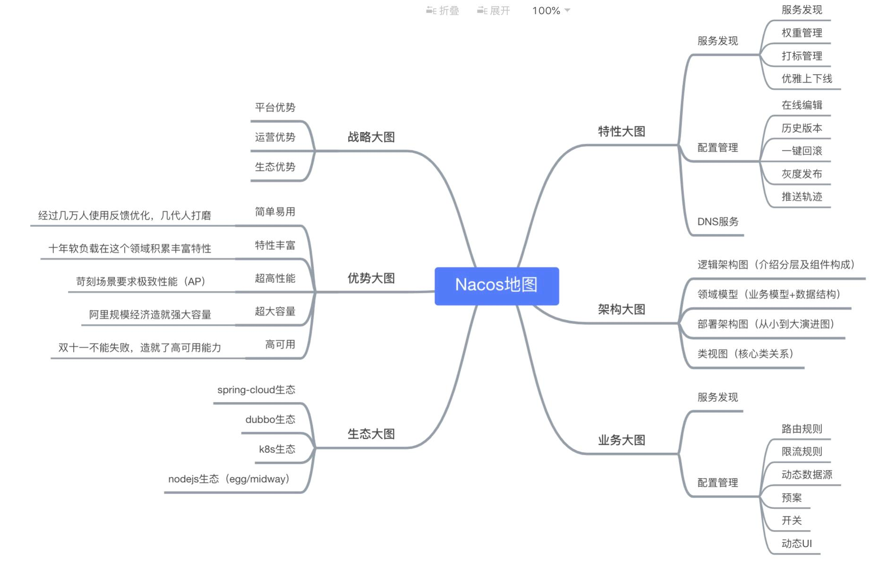
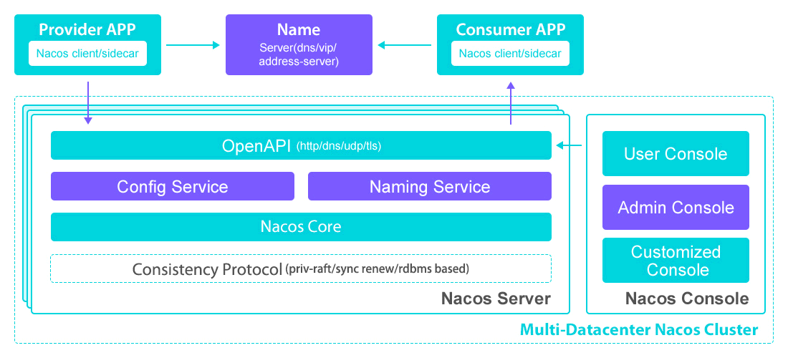
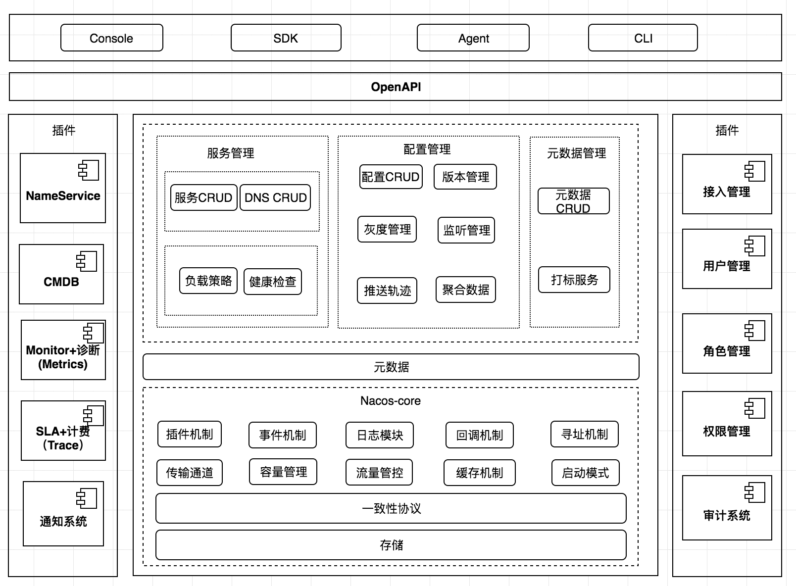
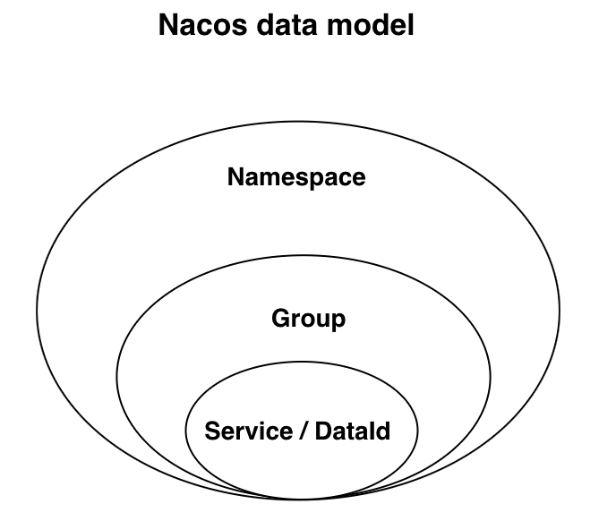
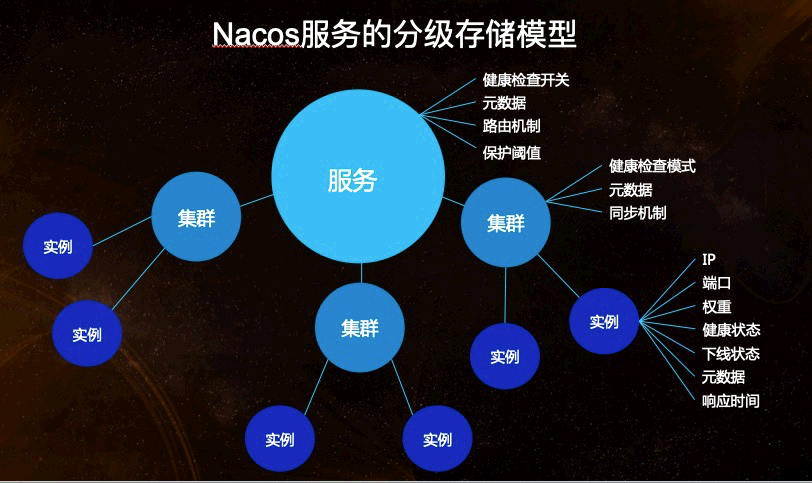
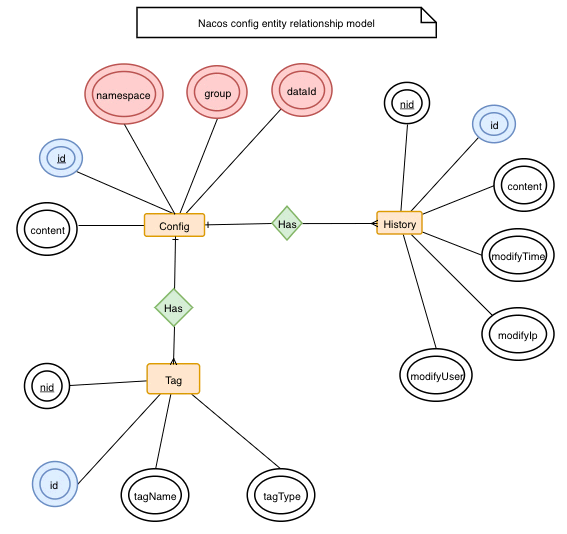
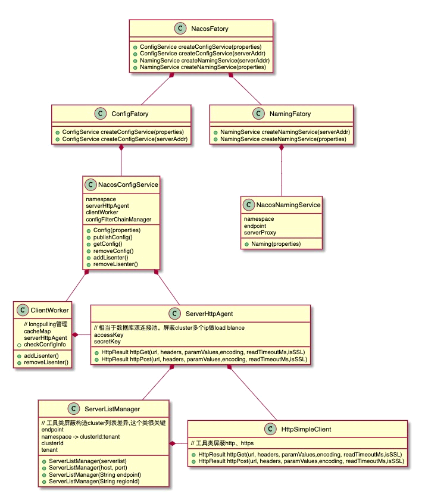
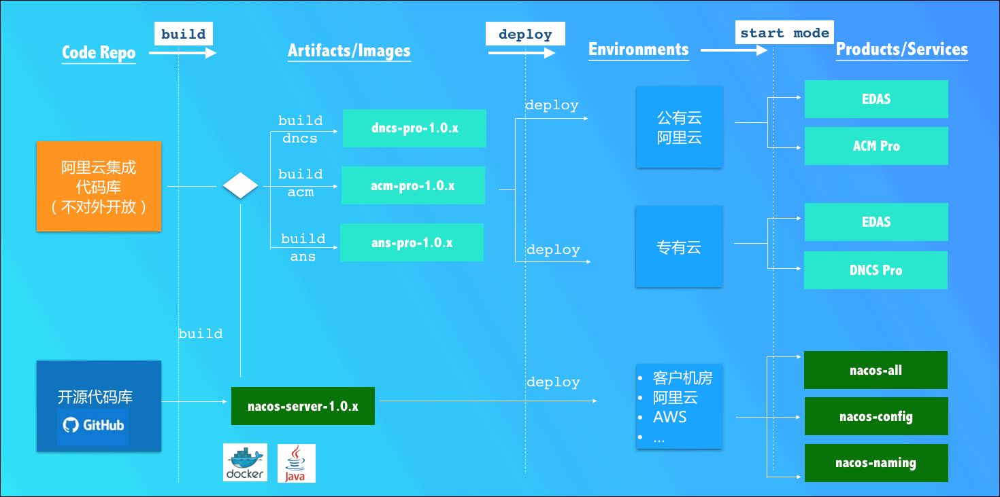

<!-- more -->

# Nacos

文档：<https://nacos.io/zh-cn/docs/what-is-nacos.html>

## Nacos是什么?

### [Nacos简介](https://nacos.io/zh-cn/docs/what-is-nacos.html)

**什么是 Nacos**

服务（Service）是 Nacos 世界的一等公民。Nacos 支持几乎所有主流类型的“服务”的发现、配置和管理：

[Kubernetes Service](https://kubernetes.io/docs/concepts/services-networking/service/)、[gRPC](https://grpc.io/docs/guides/concepts.html#service-definition) & [Dubbo RPC Service](https://dubbo.incubator.apache.org/)、[Spring Cloud RESTful Service](https://spring.io/understanding/REST)

#### Nacos 的关键特性包括

- **服务发现和服务健康监测**

  ```
  Nacos 支持基于 DNS 和基于 RPC 的服务发现。服务提供者使用 [原生SDK]、[OpenAPI]、或一个[独立的Agent TODO]注册 Service 后，服务消费者可以使用[DNS TODO] 或[HTTP&API]查找和发现服务。
  
  Nacos 提供对服务的实时的健康检查，阻止向不健康的主机或服务实例发送请求。Nacos 支持传输层 (PING 或 TCP)和应用层 (如 HTTP、MySQL、用户自定义）的健康检查。 对于复杂的云环境和网络拓扑环境中（如 VPC、边缘网络等）服务的健康检查，Nacos 提供了 agent 上报模式和服务端主动检测2种健康检查模式。Nacos 还提供了统一的健康检查仪表盘，帮助您根据健康状态管理服务的可用性及流量。
  ```

- **动态配置服务**

  ```
  动态配置服务可以让您以中心化、外部化和动态化的方式管理所有环境的应用配置和服务配置。
  动态配置消除了配置变更时重新部署应用和服务的需要，让配置管理变得更加高效和敏捷。
  配置中心化管理让实现无状态服务变得更简单，让服务按需弹性扩展变得更容易。
  Nacos 提供了一个简洁易用的UI ([控制台样例 Demo](http://console.nacos.io/nacos/index.html)) 帮助您管理所有的服务和应用的配置。Nacos 还提供包括配置版本跟踪、金丝雀发布、一键回滚配置以及客户端配置更新状态跟踪在内的一系列开箱即用的配置管理特性，帮助您更安全地在生产环境中管理配置变更和降低配置变更带来的风险。
  ```

- **动态 DNS 服务**

  ```bash
  动态 DNS 服务支持权重路由，让您更容易地实现中间层负载均衡、更灵活的路由策略、流量控制以及数据中心内网的简单DNS解析服务。动态DNS服务还能让您更容易地实现以 DNS 协议为基础的服务发现，以帮助您消除耦合到厂商私有服务发现 API 上的风险。
  
  Nacos 提供了一些简单的 [DNS APIs TODO](https://nacos.io/zh-cn/docs/xx) 帮助您管理服务的关联域名和可用的 IP:PORT 列表.
  ```

- **服务及其元数据管理**

  ```
  Nacos 能让您从微服务平台建设的视角管理数据中心的所有服务及元数据，包括管理服务的描述、生命周期、服务的静态依赖分析、服务的健康状态、服务的流量管理、路由及安全策略、服务的 SLA 以及最首要的 metrics 统计数据。
  ```

#### Nacos 地图

一图看懂 Nacos，下面架构部分会详细介绍。



- 特性大图：要从功能特性，非功能特性，全面介绍我们要解的问题域的特性诉求
- 架构大图：通过清晰架构，让您快速进入 Nacos 世界
- 业务大图：利用当前特性可以支持的业务场景，及其最佳实践
- 生态大图：系统梳理 Nacos 和主流技术生态的关系
- 优势大图：展示 Nacos 核心竞争力
- 战略大图：要从战略到战术层面讲 Nacos 的宏观优势

#### Nacos 生态图


```bash
如 Nacos 全景图所示，Nacos 无缝支持一些主流的开源生态，例如

- [Spring Cloud](https://nacos.io/en-us/docs/quick-start-spring-cloud.html)
- [Apache Dubbo and Dubbo Mesh](https://nacos.io/zh-cn/docs/use-nacos-with-dubbo.html)
- [Kubernetes and CNCF](https://nacos.io/zh-cn/docs/use-nacos-with-kubernetes.html)。

使用 Nacos 简化服务发现、配置管理、服务治理及管理的解决方案，让微服务的发现、管理、共享、组合更加容易。
```

### 概念

#### 地域

​  物理的数据中心，资源创建成功后不能更换。

#### 可用区

​  同一地域内，电力和网络互相独立的物理区域。同一可用区内，实例的网络延迟较低。

#### 接入点

​  地域的某个服务的入口域名。

#### 命名空间

```
用于进行租户粒度的配置隔离。不同的命名空间下，可以存在相同的 Group 或 Data ID 的配置。Namespace 的常用场景之一是不同环境的配置的区分隔离，例如开发测试环境和生产环境的资源（如配置、服务）隔离等。
```

#### 配置

```
在系统开发过程中，开发者通常会将一些需要变更的参数、变量等从代码中分离出来独立管理，以独立的配置文件的形式存在。目的是让静态的系统工件或者交付物（如 WAR，JAR 包等）更好地和实际的物理运行环境进行适配。配置管理一般包含在系统部署的过程中，由系统管理员或者运维人员完成。配置变更是调整系统运行时的行为的有效手段。
```

#### 配置管理

```
系统配置的编辑、存储、分发、变更管理、历史版本管理、变更审计等所有与配置相关的活动。
```

#### 配置项

```
一个具体的可配置的参数与其值域，通常以 param-key=param-value 的形式存在。例如我们常配置系统的日志输出级别（logLevel=INFO|WARN|ERROR） 就是一个配置项。
```

#### 配置集

```
一组相关或者不相关的配置项的集合称为配置集。在系统中，一个配置文件通常就是一个配置集，包含了系统各个方面的配置。例如，一个配置集可能包含了数据源、线程池、日志级别等配置项。
```

#### 配置集 ID

```
Nacos 中的某个配置集的 ID。配置集 ID 是组织划分配置的维度之一。Data ID 通常用于组织划分系统的配置集。一个系统或者应用可以包含多个配置集，每个配置集都可以被一个有意义的名称标识。Data ID 通常采用类 Java 包（如 com.taobao.tc.refund.log.level）的命名规则保证全局唯一性。此命名规则非强制。
```

#### 配置分组

```
Nacos 中的一组配置集，是组织配置的维度之一。通过一个有意义的字符串（如 Buy 或 Trade ）对配置集进行分组，从而区分 Data ID 相同的配置集。当您在 Nacos 上创建一个配置时，如果未填写配置分组的名称，则配置分组的名称默认采用 DEFAULT_GROUP 。配置分组的常见场景：不同的应用或组件使用了相同的配置类型，如 database_url 配置和 MQ_topic 配置。
```

#### 配置快照

```
Nacos 的客户端 SDK 会在本地生成配置的快照。当客户端无法连接到 Nacos Server 时，可以使用配置快照显示系统的整体容灾能力。配置快照类似于 Git 中的本地 commit，也类似于缓存，会在适当的时机更新，但是并没有缓存过期（expiration）的概念。
```

#### 服务

```
通过预定义接口网络访问的提供给客户端的软件功能。
```

#### 服务名

```
服务提供的标识，通过该标识可以唯一确定其指代的服务。
```

#### 服务注册中心

```
存储服务实例和服务负载均衡策略的数据库。
```

#### 服务发现

```
在计算机网络上，（通常使用服务名）对服务下的实例的地址和元数据进行探测，并以预先定义的接口提供给客户端进行查询。
```

#### 元信息

```
Nacos数据（如配置和服务）描述信息，如服务版本、权重、容灾策略、负载均衡策略、鉴权配置、各种自定义标签 (label)，从作用范围来看，分为服务级别的元信息、集群的元信息及实例的元信息。
```

#### 应用

​  用于标识服务提供方的服务的属性。

#### 服务分组

​  不同的服务可以归类到同一分组。

#### 虚拟集群

```
同一个服务下的所有服务实例组成一个默认集群, 集群可以被进一步按需求划分，划分的单位可以是虚拟集群。
```

#### 实例

```
提供一个或多个服务的具有可访问网络地址（IP:Port）的进程。
```

#### 权重

```
实例级别的配置。权重为浮点数。权重越大，分配给该实例的流量越大。
```

#### 健康检查

```
以指定方式检查服务下挂载的实例 (Instance) 的健康度，从而确认该实例 (Instance) 是否能提供服务。根据检查结果，实例 (Instance) 会被判断为健康或不健康。对服务发起解析请求时，不健康的实例 (Instance) 不会返回给客户端。
```

#### 健康保护阈值

```
为了防止因过多实例 (Instance) 不健康导致流量全部流向健康实例 (Instance) ，继而造成流量压力把健康 健康实例 (Instance) 压垮并形成雪崩效应，应将健康保护阈值定义为一个 0 到 1 之间的浮点数。当域名健康实例 (Instance) 占总服务实例 (Instance) 的比例小于该值时，无论实例 (Instance) 是否健康，都会将这个实例 (Instance) 返回给客户端。这样做虽然损失了一部分流量，但是保证了集群的剩余健康实例 (Instance) 能正常工作。
```

### [架构](https://nacos.io/zh-cn/docs/architecture.html)

#### 基本架构及概念



#### 服务 (Service)

服务是指一个或一组软件功能（例如特定信息的检索或一组操作的执行），其目的是不同的客户端可以为不同的目的重用（例如通过跨进程的网络调用）。Nacos 支持主流的服务生态，如 Kubernetes Service、gRPC|Dubbo RPC Service 或者 Spring Cloud RESTful Service.

#### 服务注册中心 (Service Registry)

服务注册中心，它是服务，其实例及元数据的数据库。服务实例在启动时注册到服务注册表，并在关闭时注销。服务和路由器的客户端查询服务注册表以查找服务的可用实例。服务注册中心可能会调用服务实例的健康检查 API 来验证它是否能够处理请求。

#### 服务元数据 (Service Metadata)

服务元数据是指包括服务端点(endpoints)、服务标签、服务版本号、服务实例权重、路由规则、安全策略等描述服务的数据

#### 服务提供方 (Service Provider)

是指提供可复用和可调用服务的应用方

#### 服务消费方 (Service Consumer)

是指会发起对某个服务调用的应用方

#### 配置 (Configuration)

在系统开发过程中通常会将一些需要变更的参数、变量等从代码中分离出来独立管理，以独立的配置文件的形式存在。目的是让静态的系统工件或者交付物（如 WAR，JAR 包等）更好地和实际的物理运行环境进行适配。配置管理一般包含在系统部署的过程中，由系统管理员或者运维人员完成这个步骤。配置变更是调整系统运行时的行为的有效手段之一。

#### 配置管理 (Configuration Management)

在数据中心中，系统中所有配置的编辑、存储、分发、变更管理、历史版本管理、变更审计等所有与配置相关的活动统称为配置管理。

#### 名字服务 (Naming Service)

提供分布式系统中所有对象(Object)、实体(Entity)的“名字”到关联的元数据之间的映射管理服务，例如 ServiceName -> Endpoints Info, Distributed Lock Name -> Lock Owner/Status Info, DNS Domain Name -> IP List, 服务发现和 DNS 就是名字服务的2大场景。

#### 配置服务 (Configuration Service)

在服务或者应用运行过程中，提供动态配置或者元数据以及配置管理的服务提供者。

#### 逻辑架构及其组件介绍



- 服务管理：实现服务CRUD，域名CRUD，服务健康状态检查，服务权重管理等功能
- 配置管理：实现配置管CRUD，版本管理，灰度管理，监听管理，推送轨迹，聚合数据等功能
- 元数据管理：提供元数据CURD 和打标能力
- 插件机制：实现三个模块可分可合能力，实现扩展点SPI机制
- 事件机制：实现异步化事件通知，sdk数据变化异步通知等逻辑
- 日志模块：管理日志分类，日志级别，日志可移植性（尤其避免冲突），日志格式，异常码+帮助文档
- 回调机制：sdk通知数据，通过统一的模式回调用户处理。接口和数据结构需要具备可扩展性
- 寻址模式：解决ip，域名，nameserver、广播等多种寻址模式，需要可扩展
- 推送通道：解决server与存储、server间、server与sdk间推送性能问题
- 容量管理：管理每个租户，分组下的容量，防止存储被写爆，影响服务可用性
- 流量管理：按照租户，分组等多个维度对请求频率，长链接个数，报文大小，请求流控进行控制
- 缓存机制：容灾目录，本地缓存，server缓存机制。容灾目录使用需要工具
- 启动模式：按照单机模式，配置模式，服务模式，dns模式，或者all模式，启动不同的程序+UI
- 一致性协议：解决不同数据，不同一致性要求情况下，不同一致性机制
- 存储模块：解决数据持久化、非持久化存储，解决数据分片问题
- Nameserver：解决namespace到clusterid的路由问题，解决用户环境与nacos物理环境映射问题
- CMDB：解决元数据存储，与三方cmdb系统对接问题，解决应用，人，资源关系
- Metrics：暴露标准metrics数据，方便与三方监控系统打通
- Trace：暴露标准trace，方便与SLA系统打通，日志白平化，推送轨迹等能力，并且可以和计量计费系统打通
- 接入管理：相当于阿里云开通服务，分配身份、容量、权限过程
- 用户管理：解决用户管理，登录，sso等问题
- 权限管理：解决身份识别，访问控制，角色管理等问题
- 审计系统：扩展接口方便与不同公司审计系统打通
- 通知系统：核心数据变更，或者操作，方便通过SMS系统打通，通知到对应人数据变更
- OpenAPI：暴露标准Rest风格HTTP接口，简单易用，方便多语言集成
- Console：易用控制台，做服务管理、配置管理等操作
- SDK：多语言sdk
- Agent：dns-f类似模式，或者与mesh等方案集成
- CLI：命令行对产品进行轻量化管理，像git一样好用

#### 领域模型

##### 数据模型

Nacos 数据模型 Key 由三元组唯一确定, Namespace默认是空串，公共命名空间（public），分组默认是 DEFAULT_GROUP。



##### 服务领域模型



##### 配置领域模型

围绕配置，主要有两个关联的实体，一个是配置变更历史，一个是服务标签（用于打标分类，方便索引），由 ID 关联。



#### 类视图

##### Nacos-SDK 类视图

服务部分待续



##### 构建物、部署及启动模式



#### 两种交付工件

Nacos 支持标准 Docker 镜像(TODO: 0.2版本开始支持）及 zip(tar.gz)压缩包的构建物。

#### 两种启动模式

Nacos 支持将注册中心(Service Registry）与配置中心(Config Center) 在一个进程合并部署或者将2者分离部署的两种模式。

## 快速开始

### [Nacos](https://nacos.io/zh-cn/docs/quick-start.html) docker 安装与启动

[我的教程](https://blog.csdn.net/qq_42476834/article/details/121149424)

**版本选择：当前推荐的稳定版本为 2.0.3。**

[下载地址](https://github.com/alibaba/nacos/releases)

> docker pull nacos/nacos-server:1.4.2
>
> docker pull nacos/nacos-server:2.0.3
>
> docker pull nacos/nacos-server:2.1.0

```bash
docker run --env MODE=standalone  --name nacos \
--restart=always \
-v /docker/nacos/data:/home/nacos/data \
-v /docker/nacos/logs:/home/nacos/logs \
-e SPRING_DATASOURCE_PLATFORM=mysql \
-e MYSQL_DATABASE_NUM=1 \
-e MYSQL_SERVICE_HOST=192.168.101.4 \
-e MYSQL_SERVICE_PORT=3306 \
-e MYSQL_SERVICE_DB_NAME=nacos_config \
-e MYSQL_SERVICE_USER=root \
-e MYSQL_SERVICE_PASSWORD=root \
-e JVM_XMS=1g \
-e JVM_XMX=1g \
-e JVN_XMN=512m \
-d -p 8848:8848 nacos/nacos-server:1.4.2
```

```bash
docker run --env MODE=standalone --name nacos --restart=always -v E:\docker\nacos\data:/home/nacos/data -v E:\docker\nacos\logs:/home/nacos/logs -e SPRING_DATASOURCE_PLATFORM=mysql -e MYSQL_DATABASE_NUM=1 -e MYSQL_SERVICE_HOST=192.168.101.4 -e MYSQL_SERVICE_PORT=3306 -e MYSQL_SERVICE_DB_NAME=nacos_config -e MYSQL_SERVICE_USER=root -e MYSQL_SERVICE_PASSWORD=root -e JVM_XMS=1g -e JVM_XMX=1g -e JVN_XMN=512m -d -p 8848:8848 nacos/nacos-server:1.4.2
```

application.properties

```properties
server.servlet.contextPath=/nacos
server.port=8848

spring.datasource.platform=mysql
db.num=1
db.url.0=jdbc:mysql://192.168.101.4:3306/nacos_config?characterEncoding=utf8&connectTimeout=1000&socketTimeout=3000&autoReconnect=true&useUnicode=true&useSSL=false&serverTimezone=UTC
db.user.0=root
db.password.0=root
```

### [Nacos Spring](https://nacos.io/zh-cn/docs/quick-start-spring.html)

### [Nacos Spring Boot](https://nacos.io/zh-cn/docs/quick-start-spring-boot.html)

本文主要面向 Spring Boot 的使用者，通过两个示例来介绍如何使用 Nacos 来实现分布式环境下的配置管理和服务发现。

关于 Nacos Spring Boot 的详细文档请参看：[nacos-spring-boot-project](https://github.com/nacos-group/nacos-spring-boot-project/wiki/spring-boot-0.2.2-以及-0.1.2版本新功能使用手册)。

- 通过 Nacos Server 和 nacos-config-spring-boot-starter 实现配置的动态变更；
- 通过 Nacos Server 和 nacos-discovery-spring-boot-starter 实现服务的注册与发现。

#### 启动配置管理

启动了 Nacos server 后，您就可以参考以下示例代码，为您的 Spring Boot 应用启动 Nacos 配置管理服务了。完整示例代码请参考：[nacos-spring-boot-config-example](https://github.com/nacos-group/nacos-examples/tree/master/nacos-spring-boot-example/nacos-spring-boot-config-example)

1. 添加依赖。

```xml
<dependency>
    <groupId>com.alibaba.boot</groupId>
    <artifactId>nacos-config-spring-boot-starter</artifactId>
    <version>${latest.version}</version>
</dependency>
```

**注意**：版本 [0.2.x.RELEASE](https://mvnrepository.com/artifact/com.alibaba.boot/nacos-config-spring-boot-starter) 对应的是 Spring Boot 2.x 版本，版本 [0.1.x.RELEASE](https://mvnrepository.com/artifact/com.alibaba.boot/nacos-config-spring-boot-starter) 对应的是 Spring Boot 1.x 版本。

1. 在 `application.properties` 中配置 Nacos server 的地址：

```properties
nacos.config.server-addr=127.0.0.1:8848
```

1. 使用 `@NacosPropertySource` 加载 `dataId` 为 `example` 的配置源，并开启自动更新：

```java
@SpringBootApplication
@NacosPropertySource(dataId = "application.yml",groupId = "dev", autoRefreshed = true)
public class Qyk8Application {

    public static void main(String[] args) {
        SpringApplication.run(Qyk8Application.class, args);
    }

}
```

1. 通过 Nacos 的 `@NacosValue` 注解设置属性值。

```java
public class NacosController {
    @NacosValue(value = "${qyk8.name}", autoRefreshed = true)
    private String name;
    @NacosValue(value = "${qyk8.age}", autoRefreshed = true)
    private Integer age;
    @RequestMapping("/getNacosValue")
    public R getNacosValue() {
        return R.ok().put("name", name).put("age", age);
    }
}
```

1. 启动 `NacosConfigApplication`，调用 <http://localhost:51000/qyk8/nacos/getData>，返回内容是 `false`。
2. 通过调用 [Nacos Open API](https://nacos.io/zh-cn/docs/open-api.html) 向 Nacos server 发布配置：dataId 为`xxx.yml`，内容为`useLocalCache=true`

```properties
curl -X POST "http://127.0.0.1:8848/nacos/v1/cs/configs?dataId=example&group=DEFAULT_GROUP&content=useLocalCache=true"
```

1. 再次访问 `http://localhost:8080/config/get`，此时返回内容为`true`，说明程序中的`useLocalCache`值已经被动态更新了。

#### 启动服务发现

本节演示如何在您的 Spring Boot 项目中启动 Nacos 的服务发现功能。完整示例代码请参考：[nacos-spring-boot-discovery-example](https://github.com/nacos-group/nacos-examples/tree/master/nacos-spring-boot-example/nacos-spring-boot-discovery-example)

1. 添加依赖。

```xml
<dependency>
    <groupId>com.alibaba.boot</groupId>
    <artifactId>nacos-discovery-spring-boot-starter</artifactId>
    <version>${latest.version}</version>
</dependency>
```

**注意**：版本 [0.2.x.RELEASE](https://mvnrepository.com/artifact/com.alibaba.boot/nacos-discovery-spring-boot-starter) 对应的是 Spring Boot 2.x 版本，版本 [0.1.x.RELEASE](https://mvnrepository.com/artifact/com.alibaba.boot/nacos-discovery-spring-boot-starter) 对应的是 Spring Boot 1.x 版本。

1. 在 `application.properties` 中配置 Nacos server 的地址：

```properties
nacos.discovery.server-addr=127.0.0.1:8848
```

1. 使用 `@NacosInjected` 注入 Nacos 的 `NamingService` 实例：

```java
@Controller
@RequestMapping("discovery")
public class DiscoveryController {

    @NacosInjected
    private NamingService namingService;

    @RequestMapping(value = "/get", method = GET)
    @ResponseBody
    public List<Instance> get(@RequestParam String serviceName) throws NacosException {
        return namingService.getAllInstances(serviceName);
    }
}

@SpringBootApplication
public class NacosDiscoveryApplication {

    public static void main(String[] args) {
        SpringApplication.run(NacosDiscoveryApplication.class, args);
    }
}
```

1. 启动 `NacosDiscoveryApplication`，调用 `curl http://localhost:8080/discovery/get?serviceName=example`，此时返回为空 JSON 数组`[]`。
2. 通过调用 [Nacos Open API](https://nacos.io/zh-cn/docs/open-api.html) 向  Nacos server 注册一个名称为 `example` 服务

```properties
curl -X PUT 'http://127.0.0.1:8848/nacos/v1/ns/instance?serviceName=example&ip=127.0.0.1&port=8080'
```

1. 再次访问 `curl http://localhost:8080/discovery/get?serviceName=example`，此时返回内容为：

```json
[
  {
    "instanceId": "127.0.0.1-8080-DEFAULT-example",
    "ip": "127.0.0.1",
    "port": 8080,
    "weight": 1.0,
    "healthy": true,
    "cluster": {
      "serviceName": null,
      "name": "",
      "healthChecker": {
        "type": "TCP"
      },
      "defaultPort": 80,
      "defaultCheckPort": 80,
      "useIPPort4Check": true,
      "metadata": {}
    },
    "service": null,
    "metadata": {}
  }
]
```

### [Nacos Spring Cloud](https://nacos.io/zh-cn/docs/quick-start-spring-cloud.html)

### [Nacos Docker](https://nacos.io/zh-cn/docs/quick-start-docker.html)

### [Nacos Dubbo](https://nacos.io/zh-cn/docs/use-nacos-with-dubbo.html)

### [Nacos k8s](https://nacos.io/zh-cn/docs/use-nacos-with-kubernetes.html)
