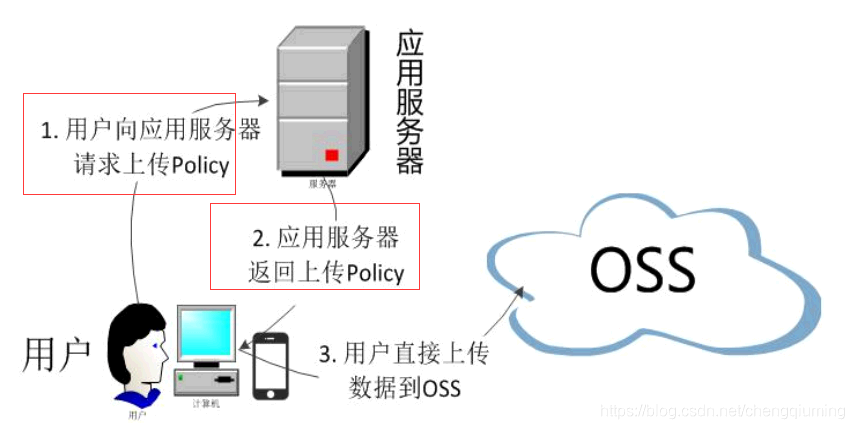
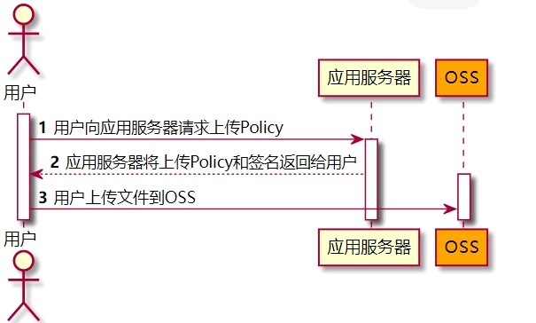
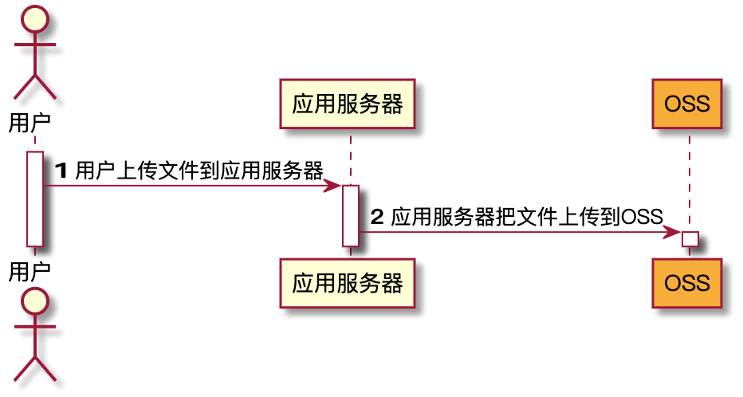

阿里OSS使用

<!-- more -->

[阿里文档]( <https://help.aliyun.com/document_detail/32009.html>

# 1，OSS 依赖

<https://mvnrepository.com/artifact/com.aliyun.oss/aliyun-sdk-oss>

```xml
<!-- https://mvnrepository.com/artifact/com.aliyun.oss/aliyun-sdk-oss -->
<oss.version>3.13.2</oss.version>
<dependency>
    <groupId>com.aliyun.oss</groupId>
    <artifactId>aliyun-sdk-oss</artifactId>
    <version>${oss.version}</version>
</dependency>
```

如果使用的是Java 9及以上的版本，则需要添加jaxb相关依赖

```xml
<jaxb-api.version>2.3.1</jaxb-api.version>
<activation.version>1.1.1</activation.version>
<jaxb-runtime.version>2.3.3</jaxb-runtime.version>

<dependency>
    <groupId>javax.xml.bind</groupId>
    <artifactId>jaxb-api</artifactId>
    <version>${jaxb-api.version}</version>
</dependency>
<dependency>
    <groupId>javax.activation</groupId>
    <artifactId>activation</artifactId>
    <version>${activation.version}</version>
</dependency>
<dependency>
    <groupId>org.glassfish.jaxb</groupId>
    <artifactId>jaxb-runtime</artifactId>
    <version>${jaxb-runtime.version}</version>
</dependency>
```

## 创建\获取账户

<https://ram.console.aliyun.com/users/new> ,+ 分配权限

```Java
// Endpoint以杭州为例，其它Region请按实际情况填写。
String endpoint = "http://oss-cn-hangzhou.aliyuncs.com";
// 云账号AccessKey有所有API访问权限
String accessKeyId = "<yourAccessKeyId>";
String accessKeySecret = "<yourAccessKeySecret>";

// 创建OSSClient实例。
OSS ossClient = new OSSClientBuilder().build(endpoint, accessKeyId, accessKeySecret);

// 上传文件流。
InputStream inputStream = new FileInputStream("<yourlocalFile>");
ossClient.putObject("<yourBucketName>", "<yourObjectName>", inputStream);
```

## 常用方法

| 方法                                                         | 说明                                                         |
| :----------------------------------------------------------- | :----------------------------------------------------------- |
| new OSSClientBuilder().build(endpoint, accessId, secretKey, conf); | 创建OSSClient实例。                                          |
| new ClientBuilderConfiguration();                            | 配置OSSClient实例                                            |
| ossClient.createBucket(bucketName);                          | 创建存储空间。                                               |
|                                         | 关闭OSSClient。                                              |
| ossClient.putObject()                                        | 上传文件                                                     |
| InputStream content =ossClient.getObject(bucketName, objectName).getObjectContent(); <br/>content .close(); | 下载文件(存储空间,文件名路径)<br>流必须关闭,否则会造成连接泄漏 |
| objectListing = ossClient.listObjects(bucketName);<br/>objectListing .getObjectSummaries | 获取文件list<br/>获取所有文件的描述信息                      |
| .deleteObject(bucketName, objectName);                       | 删除文件                                                     |
|                                                              |                                                              |
|                                                              |                                                              |
|                                                              |                                                              |

# 2，oss(跨域+获取签名) 推荐<a name="cloud-oss"></a>

## -- nacos .yml 配置

bootstrap.yml

```properties
spring:
  cloud:
    nacos:
      config:
        server-addr: 127.0.0.1:8848
        namespace: ec067840-e24c-4f81-a5f1-8bdabbaebac7
        file-extension: yml
        extension-configs:
          - dataId: oss.yml
            group: dev
            refresh: true
```

nacos -> oss.yml

access申请：<https://ram.console.aliyun.com/users>

```yaml
spring:
  ali:
    access-key: ....
    secret-key: ....
    oss:
      endpoint: oss-cn-chengdu.aliyuncs.com
      bucket: ...
```

### Consider defining a bean of type 'com.aliyun.oss.OSS' in your configuration

```java
Consider defining a bean of type 'com.aliyun.oss.OSS' in your configuration.


#########分析 OSS：
oss的bean注入冲突，自己注入配置
import com.aliyun.oss.OSS;
import com.aliyun.oss.OSSClientBuilder;
import lombok.extern.slf4j.Slf4j;
import org.springframework.beans.factory.annotation.Value;
import org.springframework.context.annotation.Bean;
import org.springframework.context.annotation.Configuration;
import org.springframework.context.annotation.Scope;
import org.springframework.stereotype.Component;

@Slf4j
@Configuration
@Component
public class OssClientConfig {

    private OSS ossClient;
    private OSSClientBuilder ossClientBuilder;

    @Value("${spring.ali.oss.endpoint}")
    private String endpoint;
    @Value("${spring.ali.oss.bucket}")
    private String bucket;
    @Value("${spring.ali.access-key}")
    private String accessId;
    @Value("${spring.ali.secret-key}")
    private String secretKey;

    @Bean
    @Scope("prototype")
    public OSS initOSSClient() {
        if (ossClient == null) {
            synchronized (OssClientConfig.class) {
                if (ossClient == null) {
                    ossClient = initOSSClientBuilder().build(endpoint, accessId, secretKey);
                }
            }
        }
        return ossClient;
    }

    public OSSClientBuilder initOSSClientBuilder() {
        if (ossClientBuilder == null) {
            synchronized (OssClientConfig.class) {
                if (ossClientBuilder == null) {
                    ossClientBuilder = new OSSClientBuilder();
                }
            }
        }
        return ossClientBuilder;
    }
}
```

## -- [获取签名](https://help.aliyun.com/document_detail/31926.html)<a name="获取签名"></a>





| 字段 | 描述 |
| :-------- | :----------------------------------------------------------- |
| accessid | 用户请求的AccessKey ID："xxx" |
| host | 用户发送上传请求的域名 `"http://xxx.oss-cn-hangzhou.aliyuncs.com"`|
| policy | 用户表单上传的策略（Policy），Policy为经过Base64编码过的字符串。"...." |
| signature | 对Policy签名后的字符串  "******" |
| expire | 由服务器端指定的Policy过期时间，格式为Unix时间戳1446727949 |
| dir | 上传的文件前缀 |

```java
@RestController
public class OssController {
    //@Autowired
    OSS ossClient;
    @Value("${spring.ali.oss.endpoint}")
    private String endpoint;
    @Value("${spring.ali.oss.bucket}")
    private String bucket;
    @Value("${spring.ali.access-key}")
    private String accessId;

    /**
     * 获取oss签名
     * @return oss签名
     */
    @RequestMapping("/oss/policy")
    public R policy() {

        String host = "https://" + bucket + "." + endpoint; // host的格式为 bucketname.endpoint
        String format = new SimpleDateFormat("yyyy-MM-dd").format(new Date());
        String dir = format + "/"; // 用户上传文件时指定的前缀。

        Map<String, String> respMap = null;
        try {
            long expireTime = 30;
            long expireEndTime = System.currentTimeMillis() + expireTime * 1000;
            Date expiration = new Date(expireEndTime);
            PolicyConditions policyConds = new PolicyConditions();
            policyConds.addConditionItem(PolicyConditions.COND_CONTENT_LENGTH_RANGE, 0, 1048576000);
            policyConds.addConditionItem(MatchMode.StartWith, PolicyConditions.COND_KEY, dir);

            String postPolicy = ossClient.generatePostPolicy(expiration, policyConds);
            byte[] binaryData = postPolicy.getBytes("utf-8");
            String encodedPolicy = BinaryUtil.toBase64String(binaryData);
            String postSignature = ossClient.calculatePostSignature(postPolicy);

            respMap = new LinkedHashMap<String, String>();
            respMap.put("accessid", accessId);
            respMap.put("policy", encodedPolicy);
            respMap.put("signature", postSignature);
            respMap.put("dir", dir);
            respMap.put("host", host);
            respMap.put("expire", String.valueOf(expireEndTime / 1000));

        } catch (Exception e) {
            e.getStackTrace();
        }
        return R.ok().put("data", respMap);
    }
}
```

[web上传示例](#web上传示例)

## -- 获取签名测试

<http://localhost:50000/api/thirdparty/oss/policy>

```json
{
    "msg": "success",
    "code": 0,
    "data": {
        "accessid": "LTA",
        "policy": "eyJleHBpdXX0=",
        "signature": "n0TsLEPu=",
        "dir": "2021-06-02/",
        "host": "https://xxx.oss-cn-chengdu.aliyuncs.com",
        "expire": "1231....60"
    }
}

```

# [3，存储空间（Bucket）](https://help.aliyun.com/document_detail/145203.html)

## -- 创建存储空间 createBucket

```java
// 创建CreateBucketRequest对象。
CreateBucketRequest createBucketRequest = new CreateBucketRequest("examplebucket");

// 如果创建存储空间的同时需要指定存储类型和数据容灾类型, 请参考如下代码。
// 此处以设置存储空间的存储类型为标准存储为例介绍。
//createBucketRequest.setStorageClass(StorageClass.Standard);
// 数据容灾类型默认为本地冗余存储，即DataRedundancyType.LRS。
//如果需要设置数据容灾类型为同城冗余存储，请设置为DataRedundancyType.ZRS。
//createBucketRequest.setDataRedundancyType(DataRedundancyType.ZRS);
// 设置存储空间的权限为公共读，默认为私有。
//createBucketRequest.setCannedACL(CannedAccessControlList.PublicRead);

// 创建存储空间。
ossClient.createBucket(createBucketRequest);
```

## -- 列举存储空间

### 列举所有存储空间 listBuckets

```java
// 列举当前账号下的所有存储空间。
List<Bucket> buckets = ossClient.listBuckets();
for (Bucket bucket : buckets) {
    System.out.println(" - " + bucket.getName());
}
```

### 列举指定前缀的存储空间 setPrefix

```java
ListBucketsRequest listBucketsRequest = new ListBucketsRequest();
// 填写前缀。
listBucketsRequest.setPrefix("example");
BucketList bucketList = ossClient.listBuckets(listBucketsRequest);
for (Bucket bucket : bucketList.getBucketList()) {
    System.out.println(" - " + bucket.getName());
}
```

### 列举指定marker之后的存储空间 setMarker

```java
listBucketsRequest.setMarker("examplebucket");
BucketList bucketList = ossClient.listBuckets(listBucketsRequest);
for (Bucket bucket : bucketList.getBucketList()) {
    System.out.println(" - " + bucket.getName());
}  
```

### 列举指定个数的存储空间 setMaxKeys

```java
listBucketsRequest.setMaxKeys(500);
BucketList bucketList = ossClient.listBuckets(listBucketsRequest);
for (Bucket bucket : bucketList.getBucketList()) {
    System.out.println(" - " + bucket.getName());
}    
```

## -- 判断存储空间是否存在  doesBucketExist("bucketName")

## -- 获取存储空间的地域 getBucketLocation("bucketName")

## -- 获取存储空间的信息 getBucketInfo("bucketName")

```java
// 获取地域。
info.getBucket().getLocation();
// 获取创建日期。
info.getBucket().getCreationDate();
// 获取拥有者信息。
info.getBucket().getOwner();
// 获取容灾类型。
info.getDataRedundancyType();
```

## -- 管理存储空间读写权限

### 设置存储空间的访问权限

```java
ossClient.setBucketAcl("yourBucketName", CannedAccessControlList.Private);
```

### 获取存储空间读写权限

```java
ossClient.getBucketAcl("yourBucketName");
```

## -- 删除存储空间

```java
ossClient.deleteBucket("yourBucketName");
```

## -- [存储空间标签](https://help.aliyun.com/document_detail/119163.html)

```java
SetBucketTaggingRequest request = new SetBucketTaggingRequest(bucketName);
```

### 设置

```java
request.setTag("owner", "John");
request.setTag("location", "hangzhou");
ossClient.setBucketTagging(request);
```

### 获取

```java
TagSet tagSet = ossClient.getBucketTagging(new GenericRequest(bucketName));
Map<String, String> tags = tagSet.getAllTags();
for(Map.Entry tag:tags.entrySet()){
    System.out.println("key:"+tag.getKey()+" value:"+tag.getValue());
}
```

### 列举指定标签

```java
TagSet tagSet = ossClient.getBucketTagging(new GenericRequest(bucketName));
Map<String, String> tags = tagSet.getAllTags();
for(Map.Entry tag:tags.entrySet()){
    System.out.println("key:"+tag.getKey()+" value:"+tag.getValue());
}
```

### 删除

```java
ossClient.deleteBucketTagging(new GenericRequest(bucketName));
```

## -- [存储空间清单](https://help.aliyun.com/document_detail/177804.html)

## -- [授权策略](https://help.aliyun.com/document_detail/155204.html)

## -- [合规保留策略](https://help.aliyun.com/document_detail/181366.html)

## -- [生命周期](https://help.aliyun.com/document_detail/32017.html)

## -- [请求者付费模式]()

## -- [防盗链]()

## -- [访问日志]()

## -- [静态网站托管（镜像回源）]()

## -- [跨区域复制]()

## -- [跨域资源共享]()

## -- [传输加速]()

# [4，上传文件](https://help.aliyun.com/document_detail/84778.html)

## -- [概述](https://help.aliyun.com/document_detail/32013.html)

    简单上传：包括流式上传和文件上传。最大不能超过5GB。
    表单上传：最大不能超过5GB。
    追加上传：最大不能超过5GB。
    断点续传上传：支持并发、断点续传、自定义分片大小。大文件上传推荐使用断点续传。最大不能超过48.8TB。
    分片上传：当文件较大时，可以使用分片上传，最大不能超过48.8TB。

## -- [简单上传](https://help.aliyun.com/document_detail/84781.html)

### 流式上传

使用流式上传，您可以将数据流上传到OSS文件。
**说明** `如果OSS文件存在，则上传的数据会覆盖该文件的内容；如果OSS文件不存在，则会新建该文件`

#### 上传字符串

  以下代码用于将字符串上传到目标存储空间examplebucket中exampledir目录下的exampleobject.txt文件。

```java
  // yourEndpoint填写Bucket所在地域对应的Endpoint。以华东1（杭州）为例，Endpoint填写为https://oss-cn-hangzhou.aliyuncs.com。
  String endpoint = "yourEndpoint";
  // 阿里云账号AccessKey拥有所有API的访问权限，风险很高。强烈建议您创建并使用RAM用户进行API访问或日常运维，请登录RAM控制台创建RAM用户。
  String accessKeyId = "yourAccessKeyId";
  String accessKeySecret = "yourAccessKeySecret";
  
  // 创建OSSClient实例。
  OSS ossClient = new OSSClientBuilder().build(endpoint, accessKeyId, accessKeySecret);
  
  // 填写字符串。
  String content = "Hello OSS";
  
  // 创建PutObjectRequest对象。
  // 依次填写Bucket名称（例如examplebucket）和Object完整路径（例如exampledir/exampleobject.txt）。Object完整路径中不能包含Bucket名称。
  PutObjectRequest putObjectRequest = new PutObjectRequest("examplebucket", "exampledir/exampleobject.txt", new ByteArrayInputStream(content.getBytes()));
  
  // 如果需要上传时设置存储类型和访问权限，请参考以下示例代码。
  // ObjectMetadata metadata = new ObjectMetadata();
  // metadata.setHeader(OSSHeaders.OSS_STORAGE_CLASS, StorageClass.Standard.toString());
  // metadata.setObjectAcl(CannedAccessControlList.Private);
  // putObjectRequest.setMetadata(metadata);
  
  // 上传字符串。
  ossClient.putObject(putObjectRequest);   
```

#### 上传Byte数组

```java
  // yourEndpoint填写Bucket所在地域对应的Endpoint。以华东1（杭州）为例，Endpoint填写为https://oss-cn-hangzhou.aliyuncs.com。
  String endpoint = "yourEndpoint";
  // 阿里云主账号AccessKey拥有所有API的访问权限，风险很高。强烈建议您创建并使用RAM账号进行API访问或日常运维，请登录 https://ram.console.aliyun.com 创建RAM账号。
  String accessKeyId = "yourAccessKeyId";
  String accessKeySecret = "yourAccessKeySecret";
  
  // 创建OSSClient实例。
  OSS ossClient = new OSSClientBuilder().build(endpoint, accessKeyId,accessKeySecret);
  
  // 填写Byte数组。
  byte[] content = "Hello OSS".getBytes();
  // 依次填写Bucket名称（例如examplebucket）和Object完整路径（例如exampledir/exampleobject.txt）。Object完整路径中不能包含Bucket名称。
  ossClient.putObject("examplebucket", "exampledir/exampleobject.txt", new ByteArrayInputStream(content));
```

#### 上传网络流

  以下代码用于将网络流上传到目标存储空间的exampleobject.txt文件。

```java
  // yourEndpoint填写Bucket所在地域对应的Endpoint。以华东1（杭州）为例，Endpoint填写为https://oss-cn-hangzhou.aliyuncs.com。
  String endpoint = "yourEndpoint";
  // 阿里云账号AccessKey拥有所有API的访问权限，风险很高。强烈建议您创建并使用RAM用户进行API访问或日常运维，请登录RAM控制台创建RAM用户。
  String accessKeyId = "yourAccessKeyId";
  String accessKeySecret = "yourAccessKeySecret";
  
  // 创建OSSClient实例。
  OSS ossClient = new OSSClientBuilder().build(endpoint, accessKeyId, accessKeySecret);
  
  // 填写网络流地址。
  InputStream inputStream = new URL("https://www.aliyun.com/").openStream();
  // 依次填写Bucket名称（例如examplebucket）和Object完整路径（例如exampledir/exampleobject.txt）。Object完整路径中不能包含Bucket名称。
  ossClient.putObject("examplebucket", "exampledir/exampleobject.txt", inputStream);
```

#### 上传文件流

```java
  // yourEndpoint填写Bucket所在地域对应的Endpoint。以华东1（杭州）为例，Endpoint填写为https://oss-cn-hangzhou.aliyuncs.com。
  String endpoint = "yourEndpoint";
  // 阿里云账号AccessKey拥有所有API的访问权限，风险很高。强烈建议您创建并使用RAM用户进行API访问或日常运维，请登录RAM控制台创建RAM用户。
  String accessKeyId = "yourAccessKeyId";
  String accessKeySecret = "yourAccessKeySecret";
  
  // 创建OSSClient实例。
  OSS ossClient = new OSSClientBuilder().build(endpoint, accessKeyId, accessKeySecret);
  
  // 填写本地文件的完整路径。如果未指定本地路径，则默认从示例程序所属项目对应本地路径中上传文件流。
  InputStream inputStream = new FileInputStream("D:\\localpath\\examplefile.txt");
  // 依次填写Bucket名称（例如examplebucket）和Object完整路径（例如exampledir/exampleobject.txt）。Object完整路径中不能包含Bucket名称。
  ossClient.putObject("examplebucket", "exampledir/exampleobject.txt", inputStream);
```

### 文件上传

使用文件上传，您可以将本地文件上传到OSS文件。
以下代码用于将本地文件examplefile.txt上传到目标存储空间examplebucket中exampledir目录下的exampleobject.txt文件。

```java
// yourEndpoint填写Bucket所在地域对应的Endpoint。以华东1（杭州）为例，Endpoint填写为https://oss-cn-hangzhou.aliyuncs.com。
String endpoint = "yourEndpoint";
// 阿里云账号AccessKey拥有所有API的访问权限，风险很高。强烈建议您创建并使用RAM用户进行API访问或日常运维，请登录RAM控制台创建RAM用户。
String accessKeyId = "yourAccessKeyId";
String accessKeySecret = "yourAccessKeySecret";

// 创建OSSClient实例。
OSS ossClient = new OSSClientBuilder().build(endpoint, accessKeyId, accessKeySecret);

// 创建PutObjectRequest对象。
// 依次填写Bucket名称（例如examplebucket）、Object完整路径（例如exampledir/exampleobject.txt）和本地文件的完整路径。Object完整路径中不能包含Bucket名称。
// 如果未指定本地路径，则默认从示例程序所属项目对应本地路径中上传文件。
PutObjectRequest putObjectRequest = new PutObjectRequest("examplebucket", "exampledir/exampleobject.txt", new File("D:\\localpath\\examplefile.txt"));

// 如果需要上传时设置存储类型和访问权限，请参考以下示例代码。
// ObjectMetadata metadata = new ObjectMetadata();
// metadata.setHeader(OSSHeaders.OSS_STORAGE_CLASS, StorageClass.Standard.toString());
// metadata.setObjectAcl(CannedAccessControlList.Private);
// putObjectRequest.setMetadata(metadata);

// 上传文件。
ossClient.putObject(putObjectRequest);
 
```

## -- web上传

`浏览器或App端上传文件到应用服务器，应用服务器再把文件上传到OSS`



### 缺点

和`数据直传`到OSS相比，web端：

- 上传慢：用户数据需先上传到应用服务器，之后再上传到OSS，网络传输时间比直传到OSS多一倍。如果用户数据不通过应用服务器中转，而是直传到OSS，速度将大大提升。而且OSS采用BGP带宽，能保证各地各运营商之间的传输速度。
- 扩展性差：如果后续用户数量逐渐增加，则应用服务器会成为瓶颈。
- 费用高：需要准备多台应用服务器。由于OSS上行流量是免费的，如果数据直传到OSS，将节省多台应用服务器的费用。

### VUE获取签名后直传<a name="web上传示例"></a>


[1、2步：获取签名](#获取签名)

```vue
<template>
  <!-- 使用服务端签名后直传 -->
  <div>
    <el-upload
        :action="uploadUrl"
        :data="dataObj"
        list-type="picture"
        :limit="1"
        :multiple="false" :show-file-list="showFileList"
        :file-list="fileList"
        :before-upload="beforeUpload"
        :on-remove="handleRemove"
        :on-success="handleUploadSuccess"
        :on-preview="handlePreview">
      <el-button size="small" type="primary">点击上传</el-button>
      <div slot="tip" class="el-upload__tip">只能上传jpg/png文件，且不超过10MB</div>
    </el-upload>
    <el-dialog :visible.sync="dialogVisible">
      
    </el-dialog>
  </div>
</template>
<script>
import {policy} from './policy'
import {getUUID} from '@/util'

export default {
  name: 'singleUpload',
  props: {
    value: String
  },
  computed: {
    imageUrl() {
      return this.value;
    },
    imageName() {
      if (this.value != null && this.value !== '') {
        return this.value.substr(this.value.lastIndexOf("/") + 1);
      } else {
        return null;
      }
    },
    fileList() {
      return [{
        name: this.imageName,
        url: this.imageUrl
      }]
    },
    /*是否显示已上传文件列表*/
    showFileList: {
      get: function () {
        return this.value !== null && this.value !== '' && this.value !== undefined;
      },
      set: function (newValue) {
      }
    }
  },
  data() {
    return {
      uploadUrl: '',
      dataObj: {
        policy: '',
        signature: '',
        key: '',
        OSSAccessKeyId: '',
        dir: '',
        host: '',
        // callback:'',
      },
      dialogVisible: false
    };
  },
  methods: {
    emitInput(val) {
      this.$emit('input', val)
    },
    handleRemove(file, fileList) {
      this.emitInput('');
    },
    handlePreview(file) {
      this.dialogVisible = true;
    },
    /*获取oss签名后，文件上传之前*/
    beforeUpload(file) {
      let _self = this;
      return new Promise((resolve, reject) => {
        //response返回的签名
        policy().then(response => {
          _self.uploadUrl = response.data.host;
          console.log("uploadUrl:::::", uploadUrl)
          _self.dataObj.policy = response.data.policy;
          _self.dataObj.signature = response.data.signature;
          _self.dataObj.OSSAccessKeyId = response.data.accessid;
          _self.dataObj.key = response.data.dir + getUUID() + '_${filename}';
          _self.dataObj.dir = response.data.dir;
          _self.dataObj.host = response.data.host;
          resolve(true)
        }).catch(err => {
          reject(false)
        })
      })
    },
    handleUploadSuccess(res, file) {
      //console.log"上传成功...: ", file.name)
      this.showFileList = true;
      this.fileList.pop();
      this.fileList.push({
        name: file.name,
        url: this.dataObj.host + '/' + this.dataObj.key.replace("${filename}", file.name)
      });
      this.emitInput(this.fileList[0].url);
    }
  }
}
</script>
```

```js
import http from '@/util/httpRequest.js'
export function policy() {
    return new Promise((resolve, reject) => {
        http({
            url: http.forUrl("oss/policy"),
            method: "get",
            params: http.getD({})
        }).then(({data}) => {
            resolve(data);
        })
    });
}
```

### Java获取签名直传并设置上传回调

[java获取签名](#获取签名)

[上传回调](#上传回调)

## -- [表单上传](https://help.aliyun.com/document_detail/84788.html)

```java
public class PostObjectSample {
    // 上传文件
    private String localFilePath = "<yourLocalFile>";
    // Endpoint以杭州为例，其它Region请按实际情况填写。
    private String endpoint = "http://oss-cn-hangzhou.aliyuncs.com";
    // 阿里云主账号AccessKey拥有所有API的访问权限，风险很高。强烈建议您创建并使用RAM账号进行API访问或日常运维，请登录RAM控制台创建RAM账号。
    private String accessKeyId = "<yourAccessKeyId>";
    private String accessKeySecret = "<yourAccessKeySecret>";
    // 设置存储空间名称。
    private String bucketName = "<yourBucketName>";
    // 设置文件名称。
    private String objectName = "<yourObjectName>";
    /**
     * 表单上传。
     * @throws Exception
     */
    private void PostObject() throws Exception {
        // 在URL中添加存储空间名称，添加后URL如下：http://yourBucketName.oss-cn-hangzhou.aliyuncs.com。
        String urlStr = endpoint.replace("http://", "http://" + bucketName+ ".");
        // 设置表单Map。
        Map<String, String> formFields = new LinkedHashMap<String, String>();
        // 设置文件名称。
        formFields.put("key", this.objectName);
        // 设置Content-Disposition。
        formFields.put("Content-Disposition", "attachment;filename="
                + localFilePath);
        // 设置回调参数。
        Callback callback = new Callback();
        // 设置回调服务器地址，如http://oss-demo.aliyuncs.com:23450或http://127.0.0.1:9090。
        callback.setCallbackUrl("<yourCallbackServerUrl>");
        // 设置回调请求消息头中Host的值，如oss-cn-hangzhou.aliyuncs.com。
        callback.setCallbackHost("<yourCallbackServerHost>");
        // 设置发起回调时请求body的值。
        callback.setCallbackBody("{\\\"mimeType\\\":${mimeType},\\\"size\\\":${size}}");
        // 设置发起回调请求的Content-Type。
        callback.setCalbackBodyType(CalbackBodyType.JSON);
        // 设置发起回调请求的自定义参数，由Key和Value组成，Key必须以x:开始，且必须小写。
        callback.addCallbackVar("x:var1", "value1");
        callback.addCallbackVar("x:var2", "value2");
        // 在表单Map中设置回调参数。
        setCallBack(formFields, callback);
        // 设置OSSAccessKeyId。
        formFields.put("OSSAccessKeyId", accessKeyId);
        String policy = "{\"expiration\": \"2120-01-01T12:00:00.000Z\",\"conditions\": [[\"content-length-range\", 0, 104857600]]}";
        String encodePolicy = new String(Base64.encodeBase64(policy.getBytes()));
        // 设置policy。
        formFields.put("policy", encodePolicy);
        // 生成签名。
        String signaturecom = com.aliyun.oss.common.auth.ServiceSignature.create().computeSignature(accessKeySecret, encodePolicy);
        // 设置签名。
        formFields.put("Signature", signaturecom);
        String ret = formUpload(urlStr, formFields, localFilePath);
        System.out.println("Post Object [" + this.objectName + "] to bucket [" + bucketName + "]");
        System.out.println("post reponse:" + ret);
    }
    
    private static String formUpload(String urlStr, Map<String, String> formFields, String localFile)
            throws Exception {
        String res = "";
        HttpURLConnection conn = null;
        String boundary = "9431149156168";
        try {
            URL url = new URL(urlStr);
            conn = (HttpURLConnection) url.openConnection();
            conn.setConnectTimeout(5000);
            conn.setReadTimeout(30000);
            conn.setDoOutput(true);
            conn.setDoInput(true);
            conn.setRequestMethod("POST");
            conn.setRequestProperty("User-Agent", 
                    "Mozilla/5.0 (Windows; U; Windows NT 6.1; zh-CN; rv:1.9.2.6)");
            // 设置MD5值。MD5值由整个body计算得出。
            conn.setRequestProperty("Content-MD5", "<yourContentMD5>");
            conn.setRequestProperty("Content-Type",
                    "multipart/form-data; boundary=" + boundary);
            OutputStream out = new DataOutputStream(conn.getOutputStream());
            // 遍历读取表单Map中的数据，将数据写入到输出流中。
            if (formFields != null) {
                StringBuffer strBuf = new StringBuffer();
                Iterator<Entry<String, String>> iter = formFields.entrySet().iterator();
                int i = 0;
                while (iter.hasNext()) {
                    Entry<String, String> entry = iter.next();
                    String inputName = entry.getKey();
                    String inputValue = entry.getValue();
                    if (inputValue == null) {
                        continue;
                    }
                    if (i == 0) {
                        strBuf.append("--").append(boundary).append("\r\n");
                        strBuf.append("Content-Disposition: form-data; name=\""
                                + inputName + "\"\r\n\r\n");
                        strBuf.append(inputValue);
                    } else {
                        strBuf.append("\r\n").append("--").append(boundary).append("\r\n");
                        strBuf.append("Content-Disposition: form-data; name=\""
                                + inputName + "\"\r\n\r\n");
                        strBuf.append(inputValue);
                    }
                    i++;
                }
                out.write(strBuf.toString().getBytes());
            }
            // 读取文件信息，将要上传的文件写入到输出流中。
            File file = new File(localFile);
            String filename = file.getName();
            String contentType = new MimetypesFileTypeMap().getContentType(file);
            if (contentType == null || contentType.equals("")) {
                contentType = "application/octet-stream";
            }
            StringBuffer strBuf = new StringBuffer();
            strBuf.append("\r\n").append("--").append(boundary)
                    .append("\r\n");
            strBuf.append("Content-Disposition: form-data; name=\"file\"; "
                    + "filename=\"" + filename + "\"\r\n");
            strBuf.append("Content-Type: " + contentType + "\r\n\r\n");
            out.write(strBuf.toString().getBytes());
            DataInputStream in = new DataInputStream(new FileInputStream(file));
            int bytes = 0;
            byte[] bufferOut = new byte[1024];
            while ((bytes = in.read(bufferOut)) != -1) {
                out.write(bufferOut, 0, bytes);
            }
            in.close();
            byte[] endData = ("\r\n--" + boundary + "--\r\n").getBytes();
            out.write(endData);
            out.flush();
            out.close();
            // 读取返回数据。
            strBuf = new StringBuffer();
            BufferedReader reader = new BufferedReader(new InputStreamReader(conn.getInputStream()));
            String line = null;
            while ((line = reader.readLine()) != null) {
                strBuf.append(line).append("\n");
            }
            res = strBuf.toString();
            reader.close();
            reader = null;
        } catch (Exception e) {
            System.err.println("Send post request exception: " + e);
            throw e;
        } finally {
            if (conn != null) {
                conn.disconnect();
                conn = null;
            }
        }
        return res;
    }
     private static void setCallBack(Map<String, String> formFields, Callback callback) {
        if (callback != null) {
            String jsonCb = OSSUtils.jsonizeCallback(callback);
            String base64Cb = BinaryUtil.toBase64String(jsonCb.getBytes());
            formFields.put("callback", base64Cb);
            if (callback.hasCallbackVar()) {
                Map<String, String> varMap = callback.getCallbackVar();
                for (Entry<String, String> entry : varMap.entrySet()) {
                    formFields.put(entry.getKey(), entry.getValue());
                }
            }
        }
    }
    public static void main(String[] args) throws Exception {
        PostObjectSample ossPostObject = new PostObjectSample();
        ossPostObject.PostObject();
    }
}
```

## -- [追加上传](https://help.aliyun.com/document_detail/84784.html)

### 注意事项

- 当文件不存在时，调用AppendObject接口会创建一个追加类型文件。
- 当文件已存在时，如果文件为追加类型文件，且设置的追加位置和文件当前长度相等，则直接在该文件末尾追加内容；如果文件为追加类型文件，但是设置的追加位置和文件当前长度不相等，则抛出PositionNotEqualToLength异常；如果文件为非追加类型文件时，则抛出ObjectNotAppendable异常。
- 追加类型文件暂不支持CopyObject操作。

```java
// yourEndpoint填写Bucket所在地域对应的Endpoint。以华东1（杭州）为例，Endpoint填写为https://oss-cn-hangzhou.aliyuncs.com。
String endpoint = "yourEndpoint";
// 阿里云账号AccessKey拥有所有API的访问权限，风险很高。强烈建议您创建并使用RAM用户进行API访问或日常运维，请登录RAM控制台创建RAM用户。
String accessKeyId = "yourAccessKeyId";
String accessKeySecret = "yourAccessKeySecret";
// 填写Bucket名称，例如examplebucket。关于Bucket名称命名规范的更多信息，请参见Bucket。
String bucketName = "examplebucket";
// 填写Object完整路径，例如exampledir/exampleobject.txt。Object完整路径中不能包含Bucket名称。关于Object名称命名规范的更多信息，请参见对象（Object）。
String objectName = "exampledir/exampleobject.txt";
String content1 = "Hello OSS A \n";
String content2 = "Hello OSS B \n";
String content3 = "Hello OSS C \n";

// 创建OSSClient实例。
OSS ossClient = new OSSClientBuilder().build(endpoint, accessKeyId, accessKeySecret);

ObjectMetadata meta = new ObjectMetadata();
// 指定上传的内容类型。
meta.setContentType("text/plain");
// 指定该Object的网页缓存行为。
//meta.setCacheControl("no-cache");
// 指定该Object被下载时的名称。
//meta.setContentDisposition("attachment;filename=oss_download.txt");
// 指定该Object的内容编码格式。
//meta.setContentEncoding(OSSConstants.DEFAULT_CHARSET_NAME);
// 该请求头用于检查消息内容是否与发送时一致。
//meta.setContentMD5("ohhnqLBJFiKkPSBO1eNaUA==");
// 指定过期时间。
//try {
//    meta.setExpirationTime(DateUtil.parseRfc822Date("Wed, 08 Jul 2022 16:57:01 GMT"));
//} catch (ParseException e) {
//    e.printStackTrace();
//}
// 指定服务器端加密方式。此处指定为OSS完全托管密钥进行加密（SSE-OSS）。
//meta.setServerSideEncryption(ObjectMetadata.AES_256_SERVER_SIDE_ENCRYPTION);
// 指定Object的访问权限。此处指定为私有访问权限。
//meta.setObjectAcl(CannedAccessControlList.Private);
// 指定Object的存储类型。
//meta.setHeader(OSSHeaders.OSS_STORAGE_CLASS, StorageClass.Standard);
// 创建AppendObject时可以添加x-oss-meta-*，继续追加时不可以携带此参数。如果配置以x-oss-meta-*为前缀的参数，则该参数视为元数据。
//meta.setHeader("x-oss-meta-author", "Alice");

// 通过AppendObjectRequest设置多个参数。
AppendObjectRequest appendObjectRequest = new AppendObjectRequest(bucketName, objectName, new ByteArrayInputStream(content1.getBytes()),meta);

// 通过AppendObjectRequest设置单个参数。
// 设置Bucket名称。
//appendObjectRequest.setBucketName(bucketName);
// 设置Object名称。
//appendObjectRequest.setKey(objectName);
// 设置待追加的内容。可选类型包括InputStream类型和File类型。此处为InputStream类型。
//appendObjectRequest.setInputStream(new ByteArrayInputStream(content1.getBytes()));
// 设置待追加的内容。可选类型包括InputStream类型和File类型。此处为File类型。
//appendObjectRequest.setFile(new File("D:\\localpath\\examplefile.txt"));
// 指定文件的元信息，第一次追加时有效。
//appendObjectRequest.setMetadata(meta);

// 第一次追加。
// 设置文件的追加位置。
appendObjectRequest.setPosition(0L);
AppendObjectResult appendObjectResult = ossClient.appendObject(appendObjectRequest);
// 文件的64位CRC值。此值根据ECMA-182标准计算得出。
System.out.println(appendObjectResult.getObjectCRC());

// 第二次追加。
// nextPosition表示下一次请求中应当提供的Position，即文件当前的长度。
appendObjectRequest.setPosition(appendObjectResult.getNextPosition());
appendObjectRequest.setInputStream(new ByteArrayInputStream(content2.getBytes()));
appendObjectResult = ossClient.appendObject(appendObjectRequest);

// 第三次追加。
appendObjectRequest.setPosition(appendObjectResult.getNextPosition());
appendObjectRequest.setInputStream(new ByteArrayInputStream(content3.getBytes()));
appendObjectResult = ossClient.appendObject(appendObjectRequest); 
```

## -- [断点续传上传](https://help.aliyun.com/document_detail/84785.html)

### 参数

您可以通过ossClient.uploadFile方法实现断点续传上传。此方法的uploadFileRequest请求包含的参数请参见下表。

| 参数             | 描述                                                         |
| ---------------- | ------------------------------------------------------------ |
| BucketName       | 存储空间名称。                                               |
| Key              | 上传到OSS的文件名称。                                        |
| UploadFile       | 待上传的本地文件路径。                                       |
| TaskNum          | 上传并发线程数，默认值为1。                                  |
| PartSize         | 上传的分片大小，单位为Byte，取值范围为100 KB~5 GB。默认值为100 KB。 |
| EnableCheckpoint | 是否开启断点续传功能，默认关闭。                             |
| CheckpointFile   | 记录本地分片上传结果的文件。上传过程中的进度信息会保存在该文件中，如果某一分片上传失败，再次上传时会根据文件中记录的点继续上传。上传完成后，该文件会被删除。如果未设置该值，默认与待上传的本地文件同路径，名称为${uploadFile}.ucp。 |
| Callback         | 使用上传回调。关于上传回调的更多信息                         |

### 示例

```java
/// yourEndpoint填写Bucket所在地域对应的Endpoint。以华东1（杭州）为例，Endpoint填写为https://oss-cn-hangzhou.aliyuncs.com。
String endpoint = "yourEndpoint";
// 阿里云账号AccessKey拥有所有API的访问权限，风险很高。强烈建议您创建并使用RAM用户进行API访问或日常运维，请登录RAM控制台创建RAM用户。
String accessKeyId = "yourAccessKeyId";
String accessKeySecret = "yourAccessKeySecret";

// 创建OSSClient实例。
OSS ossClient = new OSSClientBuilder().build(endpoint, accessKeyId, accessKeySecret);

ObjectMetadata meta = new ObjectMetadata();
// 指定上传的内容类型。
meta.setContentType("text/plain");

// 文件上传时设置访问权限ACL。
// meta.setObjectAcl(CannedAccessControlList.Private);

// 通过UploadFileRequest设置多个参数。
// 填写Bucket名称和Object完整路径。Object完整路径中不能包含Bucket名称。
UploadFileRequest uploadFileRequest = new UploadFileRequest("examplebucket","exampleobject.txt");

// 通过UploadFileRequest设置单个参数。
// 填写Bucket名称。
//uploadFileRequest.setBucketName("examplebucket");
// 填写Object完整路径。Object完整路径中不能包含Bucket名称。
//uploadFileRequest.setKey("exampleobject.txt");
// 填写本地文件的完整路径。如果未指定本地路径，则默认从示例程序所属项目对应本地路径中上传文件。
uploadFileRequest.setUploadFile("D:\\localpath\\examplefile.txt");
// 指定上传并发线程数，默认值为1。
uploadFileRequest.setTaskNum(5);
// 指定上传的分片大小。
uploadFileRequest.setPartSize(1 * 1024 * 1024);
// 开启断点续传，默认关闭。
uploadFileRequest.setEnableCheckpoint(true);
// 记录本地分片上传结果的文件。上传过程中的进度信息会保存在该文件中。
uploadFileRequest.setCheckpointFile("yourCheckpointFile");
// 文件的元数据。
uploadFileRequest.setObjectMetadata(meta);
// 设置上传成功回调，参数为Callback类型。
//uploadFileRequest.setCallback("yourCallbackEvent");

// 断点续传上传。
ossClient.uploadFile(uploadFileRequest); 
```

## -- [分片上传](https://help.aliyun.com/document_detail/84786.html)

### 分片上传流程

分片上传（Multipart Upload）分为以下三个步骤：

1. 初始化一个分片上传事件。

    调用ossClient.initiateMultipartUpload方法返回OSS创建的全局唯一的uploadId。

2. 上传分片。

   调用ossClient.uploadPart方法上传分片数据。

   **说明**

   - 对于同一个uploadId，分片号（PartNumber）标识了该分片在整个文件内的相对位置。如果使用同一个分片号上传了新的数据，则OSS上该分片已有的数据将会被覆盖。
   - OSS将收到的分片数据的MD5值放在ETag头内返回给用户。
   - OSS计算上传数据的MD5值，并与SDK计算的MD5值比较，如果不一致则返回InvalidDigest错误码。

3. 完成分片上传。

   所有分片上传完成后，调用ossClient.completeMultipartUpload方法将所有分片合并成完整的文件。

### 分片上传完整示例

```java
// yourEndpoint填写Bucket所在地域对应的Endpoint。以华东1（杭州）为例，Endpoint填写为https://oss-cn-hangzhou.aliyuncs.com。
String endpoint = "yourEndpoint";
// 阿里云账号AccessKey拥有所有API的访问权限，风险很高。强烈建议您创建并使用RAM用户进行API访问或日常运维，请登录RAM控制台创建RAM用户。
String accessKeyId = "yourAccessKeyId";
String accessKeySecret = "yourAccessKeySecret";

// 填写Bucket名称，例如examplebucket。
String bucketName = "examplebucket";
// 填写Object完整路径，例如exampledir/exampleobject.txt。Object完整路径中不能包含Bucket名称。
String objectName = "exampledir/exampleobject.txt";

// 创建OSSClient实例。
OSS ossClient = new OSSClientBuilder().build(endpoint, accessKeyId, accessKeySecret);

// 创建InitiateMultipartUploadRequest对象。
InitiateMultipartUploadRequest request = new InitiateMultipartUploadRequest(bucketName, objectName);

// 如果需要在初始化分片时设置请求头，请参考以下示例代码。
// ObjectMetadata metadata = new ObjectMetadata();
// metadata.setHeader(OSSHeaders.OSS_STORAGE_CLASS, StorageClass.Standard.toString());
// 指定该Object的网页缓存行为。
// metadata.setCacheControl("no-cache");
// 指定该Object被下载时的名称。
// metadata.setContentDisposition("attachment;filename=oss_MultipartUpload.txt");
// 指定该Object的内容编码格式。
// metadata.setContentEncoding(OSSConstants.DEFAULT_CHARSET_NAME);
// 指定过期时间，单位为毫秒。
// metadata.setHeader(HttpHeaders.EXPIRES, "1000");
// 指定初始化分片上传时是否覆盖同名Object。此处设置为true，表示禁止覆盖同名Object。
// metadata.setHeader("x-oss-forbid-overwrite", "true");
// 指定上传该Object的每个part时使用的服务器端加密方式。
// metadata.setHeader(OSSHeaders.OSS_SERVER_SIDE_ENCRYPTION, ObjectMetadata.KMS_SERVER_SIDE_ENCRYPTION);
// 指定Object的加密算法。如果未指定此选项，表明Object使用AES256加密算法。
// metadata.setHeader(OSSHeaders.OSS_SERVER_SIDE_DATA_ENCRYPTION, ObjectMetadata.KMS_SERVER_SIDE_ENCRYPTION);
// 指定KMS托管的用户主密钥。
// metadata.setHeader(OSSHeaders.OSS_SERVER_SIDE_ENCRYPTION_KEY_ID, "9468da86-3509-4f8d-a61e-6eab1eac****");
// 指定Object的存储类型。
// metadata.setHeader(OSSHeaders.OSS_STORAGE_CLASS, StorageClass.Standard);
// 指定Object的对象标签，可同时设置多个标签。
// metadata.setHeader(OSSHeaders.OSS_TAGGING, "a:1");
// request.setObjectMetadata(metadata);

// 初始化分片。
InitiateMultipartUploadResult upresult = ossClient.initiateMultipartUpload(request);
// 返回uploadId，它是分片上传事件的唯一标识。您可以根据该uploadId发起相关的操作，例如取消分片上传、查询分片上传等。
String uploadId = upresult.getUploadId();

// partETags是PartETag的集合。PartETag由分片的ETag和分片号组成。
List<PartETag> partETags =  new ArrayList<PartETag>();
// 每个分片的大小，用于计算文件有多少个分片。单位为字节。
final long partSize = 1 * 1024 * 1024L;   //1 MB。

// 填写本地文件的完整路径。如果未指定本地路径，则默认从示例程序所属项目对应本地路径中上传文件。
final File sampleFile = new File("D:\\localpath\\examplefile.txt");
long fileLength = sampleFile.length();
int partCount = (int) (fileLength / partSize);
if (fileLength % partSize != 0) {
    partCount++;
}
// 遍历分片上传。
for (int i = 0; i < partCount; i++) {
    long startPos = i * partSize;
    long curPartSize = (i + 1 == partCount) ? (fileLength - startPos) : partSize;
    InputStream instream = new FileInputStream(sampleFile);
    // 跳过已经上传的分片。
    instream.skip(startPos);
    UploadPartRequest uploadPartRequest = new UploadPartRequest();
    uploadPartRequest.setBucketName(bucketName);
    uploadPartRequest.setKey(objectName);
    uploadPartRequest.setUploadId(uploadId);
    uploadPartRequest.setInputStream(instream);
    // 设置分片大小。除了最后一个分片没有大小限制，其他的分片最小为100 KB。
    uploadPartRequest.setPartSize(curPartSize);
    // 设置分片号。每一个上传的分片都有一个分片号，取值范围是1~10000，如果超出此范围，OSS将返回InvalidArgument错误码。
    uploadPartRequest.setPartNumber( i + 1);
    // 每个分片不需要按顺序上传，甚至可以在不同客户端上传，OSS会按照分片号排序组成完整的文件。
    UploadPartResult uploadPartResult = ossClient.uploadPart(uploadPartRequest);
    // 每次上传分片之后，OSS的返回结果包含PartETag。PartETag将被保存在partETags中。
    partETags.add(uploadPartResult.getPartETag());
}


// 创建CompleteMultipartUploadRequest对象。
// 在执行完成分片上传操作时，需要提供所有有效的partETags。OSS收到提交的partETags后，会逐一验证每个分片的有效性。当所有的数据分片验证通过后，OSS将把这些分片组合成一个完整的文件。
CompleteMultipartUploadRequest completeMultipartUploadRequest =
        new CompleteMultipartUploadRequest(bucketName, objectName, uploadId, partETags);

// 如果需要在完成分片上传的同时设置文件访问权限，请参考以下示例代码。
// completeMultipartUploadRequest.setObjectACL(CannedAccessControlList.Private);
// 指定是否列举当前UploadId已上传的所有Part。如果通过服务端List分片数据来合并完整文件时，以上CompleteMultipartUploadRequest中的partETags可为null。
// Map<String, String> headers = new HashMap<String, String>();
// 如果指定了x-oss-complete-all:yes，则OSS会列举当前UploadId已上传的所有Part，然后按照PartNumber的序号排序并执行CompleteMultipartUpload操作。
// 如果指定了x-oss-complete-all:yes，则不允许继续指定body，否则报错。
// headers.put("x-oss-complete-all","yes");
// completeMultipartUploadRequest.setHeaders(headers);

// 完成分片上传。
CompleteMultipartUploadResult completeMultipartUploadResult = ossClient.completeMultipartUpload(completeMultipartUploadRequest);
System.out.println(completeMultipartUploadResult.getETag());

```

### 取消分片上传事件

您可以调用ossClient.abortMultipartUpload方法来取消分片上传事件。当一个分片上传事件被取消后，无法再使用该uploadId进行任何操作，已上传的分片数据会被删除。

```java
// yourEndpoint填写Bucket所在地域对应的Endpoint。以华东1（杭州）为例，Endpoint填写为https://oss-cn-hangzhou.aliyuncs.com。
String endpoint = "yourEndpoint";
// 阿里云账号AccessKey拥有所有API的访问权限，风险很高。强烈建议您创建并使用RAM用户进行API访问或日常运维，请登录RAM控制台创建RAM用户。
String accessKeyId = "yourAccessKeyId";
String accessKeySecret = "yourAccessKeySecret";

// 填写Bucket名称，例如examplebucket。
String bucketName = "examplebucket";
// 填写Object完整路径，例如exampledir/exampleobject.txt。Object完整路径中不能包含Bucket名称。
String objectName = "exampledir/exampleobject.txt";
// 填写uploadId，例如0004B999EF518A1FE585B0C9360D****。uploadId来自于InitiateMultipartUpload返回的结果。
String uploadId = "0004B999EF518A1FE585B0C9360D****";

// 创建OSSClient实例。
OSS ossClient = new OSSClientBuilder().build(endpoint, accessKeyId, accessKeySecret);

// 取消分片上传。
AbortMultipartUploadRequest abortMultipartUploadRequest =
        new AbortMultipartUploadRequest(bucketName, objectName, uploadId);
ossClient.abortMultipartUpload(abortMultipartUploadRequest);

         
```

### 列举已上传的分片

#### 简单列举已上传的分片

```java
// yourEndpoint填写Bucket所在地域对应的Endpoint。以华东1（杭州）为例，Endpoint填写为https://oss-cn-hangzhou.aliyuncs.com。
String endpoint = "yourEndpoint";
// 阿里云账号AccessKey拥有所有API的访问权限，风险很高。强烈建议您创建并使用RAM用户进行API访问或日常运维，请登录RAM控制台创建RAM用户。
String accessKeyId = "yourAccessKeyId";
String accessKeySecret = "yourAccessKeySecret";

// 填写Bucket名称，例如examplebucket。
String bucketName = "examplebucket";
// 填写Object完整路径，例如exampledir/exampleobject.txt。Object完整路径中不能包含Bucket名称。
String objectName = "exampledir/exampleobject.txt";
// 填写uploadId，例如0004B999EF518A1FE585B0C9360D****。uploadId来自于InitiateMultipartUpload返回的结果。
String uploadId = "0004B999EF518A1FE585B0C9360D****";

// 创建OSSClient实例。
OSS ossClient = new OSSClientBuilder().build(endpoint, accessKeyId, accessKeySecret);

// 列举已上传的分片。
ListPartsRequest listPartsRequest = new ListPartsRequest(bucketName, objectName, uploadId);
// 设置uploadId。
//listPartsRequest.setUploadId(uploadId);
// 设置分页时每一页中分片数量为100个。默认列举1000个分片。
listPartsRequest.setMaxParts(100);
// 指定List的起始位置。只有分片号大于此参数值的分片会被列举。
listPartsRequest.setPartNumberMarker(2);
PartListing partListing = ossClient.listParts(listPartsRequest);

for (PartSummary part : partListing.getParts()) {
    // 获取分片号。
    part.getPartNumber();
    // 获取分片数据大小。
    part.getSize();
    // 获取分片的ETag。
    part.getETag();
    // 获取分片的最后修改时间。
    part.getLastModified();
}
 
```

#### 列举所有已上传的分片  

```java
// yourEndpoint填写Bucket所在地域对应的Endpoint。以华东1（杭州）为例，Endpoint填写为https://oss-cn-hangzhou.aliyuncs.com。
String endpoint = "yourEndpoint";
// 阿里云账号AccessKey拥有所有API的访问权限，风险很高。强烈建议您创建并使用RAM用户进行API访问或日常运维，请登录RAM控制台创建RAM用户。
String accessKeyId = "yourAccessKeyId";
String accessKeySecret = "yourAccessKeySecret";

// 填写Bucket名称，例如examplebucket。
String bucketName = "examplebucket";
// 填写Object完整路径，例如exampledir/exampleobject.txt。Object完整路径中不能包含Bucket名称。
String objectName = "exampledir/exampleobject.txt";
// 填写uploadId，例如0004B999EF518A1FE585B0C9360D****。uploadId来自于InitiateMultipartUpload返回的结果。
String uploadId = "0004B999EF518A1FE585B0C9360D****";

// 创建OSSClient实例。
OSS ossClient = new OSSClientBuilder().build(endpoint, accessKeyId, accessKeySecret);

// 列举所有已上传的分片。
PartListing partListing;
ListPartsRequest listPartsRequest = new ListPartsRequest(bucketName, objectName, uploadId);

do {
    partListing = ossClient.listParts(listPartsRequest);

    for (PartSummary part : partListing.getParts()) {
        // 获取分片号。
        part.getPartNumber();
        // 获取分片数据大小。
        part.getSize();
        // 获取分片的ETag。
        part.getETag();
        // 获取分片的最后修改时间。
        part.getLastModified();
    }
// 指定List的起始位置，只有分片号大于此参数值的分片会被列出。
listPartsRequest.setPartNumberMarker(partListing.getNextPartNumberMarker());
} while (partListing.isTruncated());

```

#### 分页列举所有已上传的分片

```java
// yourEndpoint填写Bucket所在地域对应的Endpoint。以华东1（杭州）为例，Endpoint填写为https://oss-cn-hangzhou.aliyuncs.com。
String endpoint = "yourEndpoint";
// 阿里云账号AccessKey拥有所有API的访问权限，风险很高。强烈建议您创建并使用RAM用户进行API访问或日常运维，请登录RAM控制台创建RAM用户。
String accessKeyId = "yourAccessKeyId";
String accessKeySecret = "yourAccessKeySecret";
// 填写Bucket名称，例如examplebucket。
String bucketName = "examplebucket";
// 填写Object完整路径，例如exampledir/exampleobject.txt。Object完整路径中不能包含Bucket名称。
String objectName = "exampledir/exampleobject.txt";
// 填写uploadId，例如0004B999EF518A1FE585B0C9360D****。uploadId来自于InitiateMultipartUpload返回的结果。
String uploadId = "0004B999EF518A1FE585B0C9360D****";


// 创建OSSClient实例。
OSS ossClient = new OSSClientBuilder().build(endpoint, accessKeyId, accessKeySecret);

// 分页列举已上传的分片。
PartListing partListing;
ListPartsRequest listPartsRequest = new ListPartsRequest(bucketName, objectName, uploadId);
// 设置分页列举时，每页列举100个分片。
listPartsRequest.setMaxParts(100);

do {
    partListing = ossClient.listParts(listPartsRequest);

    for (PartSummary part : partListing.getParts()) {
        // 获取分片号。
        part.getPartNumber();
        // 获取分片数据大小。
        part.getSize();
        // 获取分片的ETag。
        part.getETag();
        // 获取分片的最后修改时间。
        part.getLastModified();
    }

    listPartsRequest.setPartNumberMarker(partListing.getNextPartNumberMarker());

} while (partListing.isTruncated());

```

### 列举分片上传事件

| 参数           | 作用                                                         | 设置方法                                                     |
| -------------- | ------------------------------------------------------------ | ------------------------------------------------------------ |
| prefix         | 限定返回的文件名称必须以指定的prefix作为前缀。注意使用prefix查询时，返回的文件名称中仍会包含prefix。 | ListMultipartUploadsRequest.setPrefix(String prefix)         |
| delimiter      | 用于对文件名称进行分组的一个字符。所有名称包含指定的前缀且第一次出现delimiter字符之间的文件作为一组元素。 | ListMultipartUploadsRequest.setDelimiter(String delimiter)   |
| maxUploads     | 限定此次返回分片上传事件的最大个数，默认值和最大值均为1000。 | ListMultipartUploadsRequest.setMaxUploads(Integer maxUploads) |
| keyMarker      | 所有文件名称的字典序大于keyMarker参数值的分片上传事件。与uploadIdMarker参数一同使用，用于指定返回结果的起始位置。 | ListMultipartUploadsRequest.setKeyMarker(String keyMarker)   |
| uploadIdMarker | 与keyMarker参数一同使用，用于指定返回结果的起始位置。 如果未设置keyMarker参数，则此参数无效。如果设置了keyMarker参数，则查询结果中包含：                                                                                             文件名称的字典序大于keyMarker参数值的所有文件。                                 文件名称等于keyMarker参数值且uploadId比uploadIdMarker参数值大的所有分片上传事件。 | ListMultipartUploadsRequest.setUploadIdMarker(String uploadIdMarker) |

#### 简单列举分片上传事件

```java
// yourEndpoint填写Bucket所在地域对应的Endpoint。以华东1（杭州）为例，Endpoint填写为https://oss-cn-hangzhou.aliyuncs.com。
String endpoint = "yourEndpoint";
// 阿里云账号AccessKey拥有所有API的访问权限，风险很高。强烈建议您创建并使用RAM用户进行API访问或日常运维，请登录RAM控制台创建RAM用户。
String accessKeyId = "yourAccessKeyId";
String accessKeySecret = "yourAccessKeySecret";
// 填写Bucket名称，例如examplebucket。
String bucketName = "examplebucket";

// 创建OSSClient实例。
OSS ossClient = new OSSClientBuilder().build(endpoint, accessKeyId, accessKeySecret);

// 列举分片上传事件。默认列举1000个分片。
ListMultipartUploadsRequest listMultipartUploadsRequest = new ListMultipartUploadsRequest(bucketName);
MultipartUploadListing multipartUploadListing = ossClient.listMultipartUploads(listMultipartUploadsRequest);

for (MultipartUpload multipartUpload : multipartUploadListing.getMultipartUploads()) {
    // 获取uploadId。
    multipartUpload.getUploadId();
    // 获取Key。
    multipartUpload.getKey();
    // 获取分片上传的初始化时间。
    multipartUpload.getInitiated();
}
 
```

#### 列举全部分片上传事件

```java
// yourEndpoint填写Bucket所在地域对应的Endpoint。以华东1（杭州）为例，Endpoint填写为https://oss-cn-hangzhou.aliyuncs.com。
String endpoint = "yourEndpoint";
// 阿里云账号AccessKey拥有所有API的访问权限，风险很高。强烈建议您创建并使用RAM用户进行API访问或日常运维，请登录RAM控制台创建RAM用户。
String accessKeyId = "yourAccessKeyId";
String accessKeySecret = "yourAccessKeySecret";
// 填写Bucket名称，例如examplebucket。
String bucketName = "examplebucket";

// 创建OSSClient实例。
OSS ossClient = new OSSClientBuilder().build(endpoint, accessKeyId, accessKeySecret);

// 列举分片上传事件。
MultipartUploadListing multipartUploadListing;
ListMultipartUploadsRequest listMultipartUploadsRequest = new ListMultipartUploadsRequest(bucketName);

do {
    multipartUploadListing = ossClient.listMultipartUploads(listMultipartUploadsRequest);

    for (MultipartUpload multipartUpload : multipartUploadListing.getMultipartUploads()) {
        // 获取uploadId。
        multipartUpload.getUploadId();
        // 获取文件名称。
        multipartUpload.getKey();
        // 获取分片上传的初始化时间。
        multipartUpload.getInitiated();
    }

    listMultipartUploadsRequest.setKeyMarker(multipartUploadListing.getNextKeyMarker());

    listMultipartUploadsRequest.setUploadIdMarker(multipartUploadListing.getNextUploadIdMarker());
} while (multipartUploadListing.isTruncated()); 
```

#### 分页列举全部上传事件

```java
// yourEndpoint填写Bucket所在地域对应的Endpoint。以华东1（杭州）为例，Endpoint填写为https://oss-cn-hangzhou.aliyuncs.com。
String endpoint = "yourEndpoint";
// 阿里云账号AccessKey拥有所有API的访问权限，风险很高。强烈建议您创建并使用RAM用户进行API访问或日常运维，请登录RAM控制台创建RAM用户。
String accessKeyId = "yourAccessKeyId";
String accessKeySecret = "yourAccessKeySecret";
// 填写Bucket名称，例如examplebucket。
String bucketName = "examplebucket";

// 创建OSSClient实例。
OSS ossClient = new OSSClientBuilder().build(endpoint, accessKeyId, accessKeySecret);

// 列举分片上传事件。
MultipartUploadListing multipartUploadListing;
ListMultipartUploadsRequest listMultipartUploadsRequest = new ListMultipartUploadsRequest(bucketName);
// 设置每页列举的分片上传事件个数。
listMultipartUploadsRequest.setMaxUploads(50);

do {
    multipartUploadListing = ossClient.listMultipartUploads(listMultipartUploadsRequest);

    for (MultipartUpload multipartUpload : multipartUploadListing.getMultipartUploads()) {
        // 获取uploadId。
        multipartUpload.getUploadId();
        // 获取Key。
        multipartUpload.getKey();
        // 获取分片上传的初始化时间。
        multipartUpload.getInitiated();
    }

    listMultipartUploadsRequest.setKeyMarker(multipartUploadListing.getNextKeyMarker());
    listMultipartUploadsRequest.setUploadIdMarker(multipartUploadListing.getNextUploadIdMarker());

} while (multipartUploadListing.isTruncated());
 
```

## -- [进度条](https://help.aliyun.com/document_detail/84796.html)

ossClient.putObject、ossClient.getObject、ossClient.uploadPart、ossClient.uploadFile以及ossClient.downloadFile方法均支持进度条功能，使用方法与ossClient.putObject类似。

```java
public class PutObjectProgressListener implements ProgressListener {
    private long bytesWritten = 0;
    private long totalBytes = -1;
    private boolean succeed = false;

    @Override
    public void progressChanged(ProgressEvent progressEvent) {
        long bytes = progressEvent.getBytes();
        ProgressEventType eventType = progressEvent.getEventType();
        switch (eventType) {
        case TRANSFER_STARTED_EVENT:
            System.out.println("Start to upload......");
            break;
        case REQUEST_CONTENT_LENGTH_EVENT:
            this.totalBytes = bytes;
            System.out.println(this.totalBytes + " bytes in total will be uploaded to OSS");
            break;
        case REQUEST_BYTE_TRANSFER_EVENT:
            this.bytesWritten += bytes;
            if (this.totalBytes != -1) {
                int percent = (int)(this.bytesWritten * 100.0 / this.totalBytes);
                System.out.println(bytes + " bytes have been written at this time, upload progress: " + percent + "%(" + this.bytesWritten + "/" + this.totalBytes + ")");
            } else {
                System.out.println(bytes + " bytes have been written at this time, upload ratio: unknown" + "(" + this.bytesWritten + "/...)");
            }
            break;
        case TRANSFER_COMPLETED_EVENT:
            this.succeed = true;
            System.out.println("Succeed to upload, " + this.bytesWritten + " bytes have been transferred in total");
            break;
        case TRANSFER_FAILED_EVENT:
            System.out.println("Failed to upload, " + this.bytesWritten + " bytes have been transferred");
            break;
        default:
            break;
        }
    }

    public boolean isSucceed() {
        return succeed;
    }

    public static void main(String[] args) {
        // Endpoint以杭州为例，其它Region请按实际情况填写。
        String endpoint = "http://oss-cn-hangzhou.aliyuncs.com";
        // 阿里云主账号AccessKey拥有所有API的访问权限，风险很高。强烈建议您创建并使用RAM账号进行API访问或日常运维，请登录RAM控制台创建RAM账号。
        String accessKeyId = "<yourAccessKeyId>";
        String accessKeySecret = "<yourAccessKeySecret>";
        String bucketName = "<yourBucketName>";
        String objectName = "<yourObjectName>";

        // 创建OSSClient实例。
        OSS ossClient = new OSSClientBuilder().build(endpoint, accessKeyId, accessKeySecret);

        try {
            // 上传文件的同时指定了进度条参数。
            ossClient.putObject(new PutObjectRequest(bucketName, objectName, new File("<yourLocalFile>")).
                    <PutObjectRequest>withProgressListener(new PutObjectProgressListener()));

        } catch (Exception e) {
            e.printStackTrace();
        }
    }
}
```

## -- [上传回调](https://help.aliyun.com/document_detail/84798.html)<a name="上传回调"></a>

OSS会在文件上传完成后，把文件上传信息通过此回调URL发送给应用服务器。

### 例子1

```java
// Endpoint以杭州为例，其它Region请按实际情况填写。
String endpoint = "http://oss-cn-hangzhou.aliyuncs.com";
// 阿里云主账号AccessKey拥有所有API的访问权限，风险很高。强烈建议您创建并使用RAM账号进行API访问或日常运维，请登录RAM控制台创建RAM账号。
String accessKeyId = "<yourAccessKeyId>";
String accessKeySecret = "<yourAccessKeySecret>";
String bucketName = "<yourBucketName>";
String objectName = "<yourObjectName>";
// 您的回调服务器地址，如http://oss-demo.aliyuncs.com:23450或http://127.0.0.1:9090。
String callbackUrl = "<yourCallbackServerUrl>";

// 创建OSSClient实例。
OSS ossClient = new OSSClientBuilder().build(endpoint, accessKeyId, accessKeySecret);

String content = "Hello OSS";
PutObjectRequest putObjectRequest = new PutObjectRequest(bucketName, objectName,new ByteArrayInputStream(content.getBytes()));

// 上传回调参数。
Callback callback = new Callback();
callback.setCallbackUrl(callbackUrl);
//（可选）设置回调请求消息头中Host的值，即您的服务器配置Host的值。
// callback.setCallbackHost("yourCallbackHost");
// 设置发起回调时请求body的值。
callback.setCallbackBody("{\\\"mimeType\\\":${mimeType},\\\"size\\\":${size}}");
// 设置发起回调请求的Content-Type。
callback.setCalbackBodyType(CalbackBodyType.JSON);
// 设置发起回调请求的自定义参数，由Key和Value组成，Key必须以x:开始。
callback.addCallbackVar("x:var1", "value1");
callback.addCallbackVar("x:var2", "value2");
putObjectRequest.setCallback(callback);

PutObjectResult putObjectResult = ossClient.putObject(putObjectRequest);

// 读取上传回调返回的消息内容。
byte[] buffer = new byte[1024];
putObjectResult.getResponse().getContent().read(buffer);
// 数据读取完成后，获取的流必须关闭，否则会造成连接泄漏，导致请求无连接可用，程序无法正常工作。
putObjectResult.getResponse().getContent().close();
```

### 例子2

```java
protected boolean VerifyOSSCallbackRequest(HttpServletRequest request, String ossCallbackBody)
            throws NumberFormatException, IOException {
        boolean ret = false;
        String autorizationInput = new String(request.getHeader("Authorization"));
        String pubKeyInput = request.getHeader("x-oss-pub-key-url");
        byte[] authorization = BinaryUtil.fromBase64String(autorizationInput);
        byte[] pubKey = BinaryUtil.fromBase64String(pubKeyInput);
        String pubKeyAddr = new String(pubKey);
        if (!pubKeyAddr.startsWith("https://gosspublic.alicdn.com/")
                && !pubKeyAddr.startsWith("https://gosspublic.alicdn.com/")) {
            System.out.println("pub key addr must be oss addrss");
            return false;
        }
        String retString = executeGet(pubKeyAddr);
        retString = retString.replace("-----BEGIN PUBLIC KEY-----", "");
        retString = retString.replace("-----END PUBLIC KEY-----", "");
        String queryString = request.getQueryString();
        String uri = request.getRequestURI();
        String decodeUri = java.net.URLDecoder.decode(uri, "UTF-8");
        String authStr = decodeUri;
        if (queryString != null && !queryString.equals("")) {
            authStr += "?" + queryString;
        }
        authStr += "\n" + ossCallbackBody;
        ret = doCheck(authStr, authorization, retString);
        return ret;
    }

    protected void doPost(HttpServletRequest request, HttpServletResponse response)
            throws ServletException, IOException {
        String ossCallbackBody = GetPostBody(request.getInputStream(),
                Integer.parseInt(request.getHeader("content-length")));
        boolean ret = VerifyOSSCallbackRequest(request, ossCallbackBody);
        System.out.println("verify result : " + ret);
        // System.out.println("OSS Callback Body:" + ossCallbackBody);
        if (ret) {
            response(request, response, "{\"Status\":\"OK\"}", HttpServletResponse.SC_OK);
        } else {
            response(request, response, "{\"Status\":\"verify not ok\"}", HttpServletResponse.SC_BAD_REQUEST);
        }
    }
```

# [5，下载文件](https://help.aliyun.com/document_detail/84822.html)

## -- [流式下载](https://help.aliyun.com/document_detail/84823.html)

```java
// yourEndpoint填写Bucket所在地域对应的Endpoint。以华东1（杭州）为例，Endpoint填写为https://oss-cn-hangzhou.aliyuncs.com。
String endpoint = "yourEndpoint";
// 阿里云账号AccessKey拥有所有API的访问权限，风险很高。强烈建议您创建并使用RAM用户进行API访问或日常运维，请登录RAM控制台创建RAM用户。
String accessKeyId = "yourAccessKeyId";
String accessKeySecret = "yourAccessKeySecret";
// 填写Bucket名称。
String bucketName = "examplebucket";
// 填写Object的完整路径。Object完整路径中不能包含Bucket名称。
String objectName = "exampleobject.txt";

// 创建OSSClient实例。
OSS ossClient = new OSSClientBuilder().build(endpoint, accessKeyId, accessKeySecret);

// ossObject包含文件所在的存储空间名称、文件名称、文件元信息以及一个输入流。
OSSObject ossObject = ossClient.getObject(bucketName, objectName);

// 读取文件内容。
System.out.println("Object content:");
BufferedReader reader = new BufferedReader(new InputStreamReader(ossObject.getObjectContent()));
while (true) {
    String line = reader.readLine();
    if (line == null) break;

    System.out.println("\n" + line);
}
// 数据读取完成后，获取的流必须关闭，否则会造成连接泄漏，导致请求无连接可用，程序无法正常工作。
reader.close();
```

## -- [下载到本地文件](https://help.aliyun.com/document_detail/84824.html)

```java
// yourEndpoint填写Bucket所在地域对应的Endpoint。以华东1（杭州）为例，Endpoint填写为https://oss-cn-hangzhou.aliyuncs.com。
String endpoint = "yourEndpoint";
// 阿里云账号AccessKey拥有所有API的访问权限，风险很高。强烈建议您创建并使用RAM用户进行API访问或日常运维，请登录RAM控制台创建RAM用户。
String accessKeyId = "yourAccessKeyId";
String accessKeySecret = "yourAccessKeySecret";
// 填写Bucket名称。
String bucketName = "examplebucket";
// 填写不包含Bucket名称在内的Object完整路径，例如testfolder/exampleobject.txt。
String objectName = "testfolder/exampleobject.txt";

// 创建OSSClient实例。
OSS ossClient = new OSSClientBuilder().build(endpoint, accessKeyId, accessKeySecret);

// 下载Object到本地文件，并保存到指定的本地路径中。如果指定的本地文件存在会覆盖，不存在则新建。
// 如果未指定本地路径，则下载后的文件默认保存到示例程序所属项目对应本地路径中。
ossClient.getObject(new GetObjectRequest(bucketName, objectName), new File("D:\\localpath\\examplefile.txt")); 
```

## -- [范围下载](https://help.aliyun.com/document_detail/84825.html)

### 指定正常的下载范围

流式读取一次可能无法读取全部数据。如果您需要流式读取64 KB的数据，请使用如下的方式多次读取，直到读取到64 KB或者文件结束

```java
// Endpoint以杭州为例，其它Region请按实际情况填写。
String endpoint = "http://oss-cn-hangzhou.aliyuncs.com";
// 阿里云主账号AccessKey拥有所有API的访问权限，风险很高。强烈建议您创建并使用RAM账号进行API访问或日常运维，请登录RAM控制台创建RAM账号。
String accessKeyId = "<yourAccessKeyId>";
String accessKeySecret = "<yourAccessKeySecret>";
String bucketName = "<yourBucketName>";
//<yourObjectName>表示从OSS下载文件时需要指定包含文件后缀在内的完整路径，例如abc/efg/123.jpg。
String objectName = "<yourObjectName>";

// 创建OSSClient实例。
OSS ossClient = new OSSClientBuilder().build(endpoint, accessKeyId, accessKeySecret);

GetObjectRequest getObjectRequest = new GetObjectRequest(bucketName, objectName);
// 对于大小为1000 Bytes的文件，正常的字节范围为0~999。
// 获取0~999字节范围内的数据，包括0和999，共1000个字节的数据。如果指定的范围无效（比如开始或结束位置的指定值为负数，或指定值大于文件大小），则下载整个文件。
getObjectRequest.setRange(0, 999);

// 范围下载。
OSSObject ossObject = ossClient.getObject(getObjectRequest);

// 读取数据。
byte[] buf = new byte[1024];
InputStream in = ossObject.getObjectContent();
for (int n = 0; n != -1; ) {
    n = in.read(buf, 0, buf.length);
}

// 数据读取完成后，获取的流必须关闭，否则会造成连接泄漏，导致请求无连接可用，程序无法正常工作。
in.close();

```

### 指定异常的下载范围

假设现有大小为1000 Bytes的Object，则指定的正常下载范围应为0~999。如果指定范围不在有效区间，会导致Range不生效，响应返回值为200，并传送整个Object的内容。请求不合法的示例及返回说明如下：

- 若指定了Range: bytes=500~2000，此时范围末端取值不在有效区间，返回整个文件的内容，且HTTP Code为200。
- 若指定了Range: bytes=1000~2000，此时范围首端取值不在有效区间，返回整个文件的内容，且HTTP Code为200。

### 兼容行为范围下载

假设现有大小为1000 Bytes的Object，则指定的正常下载范围应为0~999。如果指定范围不在有效区间，会导致Range不生效，响应返回值为200，并传送整个Object的内容。请求不合法的示例及返回说明如下：

- 若指定了Range: bytes=500~2000，此时范围末端取值不在有效区间，返回整个文件的内容，且HTTP Code为200。
- 若指定了Range: bytes=1000~2000，此时范围首端取值不在有效区间，返回整个文件的内容，且HTTP Code为200。

```java
// Endpoint以杭州为例，其它Region请按实际情况填写。
String endpoint = "http://oss-cn-hangzhou.aliyuncs.com";
// 阿里云主账号AccessKey拥有所有API的访问权限，风险很高。强烈建议您创建并使用RAM账号进行API访问或日常运维，请登录RAM控制台创建RAM账号。
String accessKeyId = "<yourAccessKeyId>";
String accessKeySecret = "<yourAccessKeySecret>";
String bucketName = "<yourBucketName>";
// 指定大小为1000 Bytes的文件。
String objectName = "<yourObjectName>";

// 创建OSSClient实例。
OSS ossClient = new OSSClientBuilder().build(endpoint, accessKeyId, accessKeySecret);

// 指定兼容行为。
// 范围末端取值不在有效区间，返回500~999字节范围内容，且HTTP Code为206。
getObjectRequest = new GetObjectRequest(bucketName, objectName);
getObjectRequest.setRange(500, 2000);
getObjectRequest.addHeader("x-oss-range-behavior", "standard");
OSSObject ossObject = ossClient.getObject(getObjectRequest);
ossObject.close();

System.out.println("standard get " + "500~2000 "+ "statusCode:"  + ossObject.getResponse().getStatusCode());
System.out.println("standard get " + "500~2000 " + "contentLength:" + ossObject.getResponse().getContentLength());

try {
    // 范围首端取值不在有效区间，以下代码会抛出异常。返回HTTP Code为416，错误码为InvalidRange。
    getObjectRequest = new GetObjectRequest(bucketName, objectName);
    getObjectRequest.setRange(1000, 2000);
    getObjectRequest.addHeader("x-oss-range-behavior", "standard");
    ossClient.getObject(getObjectRequest);
} catch (OSSException e) {
    System.out.println("standard get " + "1000~2000:" + "error code:" + e.getErrorCode());
}
```

## -- [断点续传下载](https://help.aliyun.com/document_detail/84827.html)

| 参数             | 是否必选 | 示例值                             | 描述                                                         | 如何设置                            |
| ---------------- | -------- | ---------------------------------- | ------------------------------------------------------------ | ----------------------------------- |
| bucketName       | 是       | examplebucket                      | 存储空间（Bucket）名称。                                     | 通过构造方法设置。                  |
| key              | 是       | exampledir/exampleobject.txt       | Object完整路径。Object完整路径中不能包含Bucket名称。         | 通过构造方法设置。                  |
| downloadFile     | 否       | D:\\localpath\\examplefile.txt     | 本地文件的完整路径。OSS文件将下载到该本地文件。              | 通过构造方法或setDownloadFile设置。 |
| partSize         | 否       | 1 *1024* 1024                    | 分片大小，取值范围为1 B~5 GB。                               | 通过setPartSize设置。               |
| taskNum          | 否       | 10                                 | 分片下载的并发数。默认值为1。                                | 通过setTaskNum设置。                |
| enableCheckpoint | 否       | true                               | 是否开启断点续传功能。取值范围如下：                                                         false（默认）：关闭                              true：开启 | 通过setEnableCheckpoint设置。       |
| checkpointFile   | 否       | D:\\localpath\\examplefile.txt.dcp | 记录本地分片下载结果的文件。开启断点续传功能时需要设置此参数。下载过程中的进度信息会保存在该文件中，如果某一分片下载失败，再次下载时会根据文件中记录的点继续下载。下载完成后，该文件会被删除。                           文件默认名称为downloadFile.dcp，且与downloadFile处于相同路径。 | 通过setCheckpointFile设置。         |

```java
// yourEndpoint填写Bucket所在地域对应的Endpoint。以华东1（杭州）为例，Endpoint填写为https://oss-cn-hangzhou.aliyuncs.com。
String endpoint = "yourEndpoint";
// 阿里云账号AccessKey拥有所有API的访问权限，风险很高。强烈建议您创建并使用RAM用户进行API访问或日常运维，请登录RAM控制台创建RAM用户。
String accessKeyId = "yourAccessKeyId";
String accessKeySecret = "yourAccessKeySecret";
// 填写Bucket名称，例如examplebucket。
String bucketName = "examplebucket";
// 填写Object完整路径，例如exampledir/exampleobject.txt。Object完整路径中不能包含Bucket名称。
String objectName = "exampledir/exampleobject.txt";

// 创建OSSClient实例。
OSS ossClient = new OSSClientBuilder().build(endpoint, accessKeyId, accessKeySecret);

// 下载请求，10个任务并发下载，启动断点续传。
DownloadFileRequest downloadFileRequest = new DownloadFileRequest(bucketName, objectName);
downloadFileRequest.setDownloadFile("D:\\localpath\\examplefile.txt");
downloadFileRequest.setPartSize(1 * 1024 * 1024);
downloadFileRequest.setTaskNum(10);
downloadFileRequest.setEnableCheckpoint(true);
// 设置断点记录文件的完整路径。只有当Object下载中断产生了断点记录文件后，如果需要继续下载该Object，才需要设置对应的断点记录文件。
//downloadFileRequest.setCheckpointFile("D:\\localpath\\examplefile.txt.dcp");

// 下载文件。
DownloadFileResult downloadRes = ossClient.downloadFile(downloadFileRequest);
// 下载成功时，会返回文件元信息。
ObjectMetadata objectMetadata = downloadRes.getObjectMetadata();
System.out.println(objectMetadata.getETag());
System.out.println(objectMetadata.getLastModified());
System.out.println(objectMetadata.getUserMetadata().get("meta"));

```

## -- [限定条件下载](https://help.aliyun.com/document_detail/84828.html)

下载文件时，可以指定一个或多个限定条件。满足限定条件则下载，不满足则返回错误，不下载。可以使用的限定条件如下：

| 参数                | 描述                                                         |
| ------------------- | ------------------------------------------------------------ |
| If-Modified-Since   | 如果指定的时间早于实际修改时间，则正常传输文件，否则返回错误（304 Not modified）。 |
| If-Unmodified-Since | 如果指定的时间等于或者晚于文件实际修改时间，则正常传输文件，否则返回错误（412 Precondition failed）。 |
| If-Match            | 如果指定的ETag和OSS文件的ETag匹配，则正常传输文件，否则返回错误（412 Precondition failed）。 |
| If-None-Match       | 如果指定的ETag和OSS文件的ETag不匹配，则正常传输文件，否则返回错误（304 Not modified）。 |

If-Modified-Since和If-Unmodified-Since可以同时存在。If-Match和If-None-Match可以同时存在。

ETag可以通过ossClient.getObjectMeta方法获取。

```java
// Endpoint以杭州为例，其它Region请按实际情况填写。
String endpoint = "http://oss-cn-hangzhou.aliyuncs.com";
// 阿里云主账号AccessKey拥有所有API的访问权限，风险很高。强烈建议您创建并使用RAM账号进行API访问或日常运维，请登录 https://ram.console.aliyun.com 创建RAM账号。
String accessKeyId = "<yourAccessKeyId>";
String accessKeySecret = "<yourAccessKeySecret>";
String bucketName = "<yourBucketName>";
String objectName = "<yourObjectName>";

// 创建OSSClient实例。
OSS ossClient = new OSSClientBuilder().build(endpoint, accessKeyId, accessKeySecret);

GetObjectRequest request = new GetObjectRequest(bucketName, objectName);
// 设置限定条件。
request.setModifiedSinceConstraint(new Date());

// 下载OSS文件到本地文件。
ossClient.getObject(request, new File("<yourLocalFile>"));
  
```

## -- [进度条](https://help.aliyun.com/document_detail/84829.html)

ossClient.putObject、ossClient.getObject、ossClient.uploadPart、ossClient.uploadFile以及ossClient.downloadFile方法均支持进度条功能，使用方法与ossClient.getObject类似。

```java
static class GetObjectProgressListener implements ProgressListener {
        private long bytesRead = 0;
        private long totalBytes = -1;
        private boolean succeed = false;
        @Override
        public void progressChanged(ProgressEvent progressEvent) {
            long bytes = progressEvent.getBytes();
            ProgressEventType eventType = progressEvent.getEventType();
            switch (eventType) {
            case TRANSFER_STARTED_EVENT:
                System.out.println("Start to download......");
                break;
            case RESPONSE_CONTENT_LENGTH_EVENT:
                this.totalBytes = bytes;
                System.out.println(this.totalBytes + " bytes in total will be downloaded to a local file");
                break;
            case RESPONSE_BYTE_TRANSFER_EVENT:
                this.bytesRead += bytes;
                if (this.totalBytes != -1) {
                    int percent = (int)(this.bytesRead * 100.0 / this.totalBytes);
                    System.out.println(bytes + " bytes have been read at this time, download progress: " +
                            percent + "%(" + this.bytesRead + "/" + this.totalBytes + ")");
                } else {
                    System.out.println(bytes + " bytes have been read at this time, download ratio: unknown" +
                            "(" + this.bytesRead + "/...)");
                }
                break;
            case TRANSFER_COMPLETED_EVENT:
                this.succeed = true;
                System.out.println("Succeed to download, " + this.bytesRead + " bytes have been transferred in total");
                break;
            case TRANSFER_FAILED_EVENT:
                System.out.println("Failed to download, " + this.bytesRead + " bytes have been transferred");
                break;
            default:
                break;
            }
        }
        public boolean isSucceed() {
            return succeed;
        }
    }
public static void main(String[] args) { 
    // Endpoint以杭州为例，其它Region请按实际情况填写。
    String endpoint = "http://oss-cn-hangzhou.aliyuncs.com";
    // 阿里云主账号AccessKey拥有所有API的访问权限，风险很高。强烈建议您创建并使用RAM账号进行API访问或日常运维，请登录RAM控制台创建RAM账号。
    String accessKeyId = "<yourAccessKeyId>";
    String accessKeySecret = "<yourAccessKeySecret>";
    String bucketName = "<yourBucketName>";
    String objectName = "<yourObjectName>";
    OSS ossClient = new OSSClientBuilder().build(endpoint, accessKeyId, accessKeySecret);
    try {            
            // 下载文件的同时指定了进度条参数。
            ossClient.getObject(new GetObjectRequest(bucketName, objectName).
                    <GetObjectRequest>withProgressListener(new GetObjectProgressListener()),
                    new File("<yourLocalFile>"));
    } catch (Exception e) {
        e.printStackTrace();
    }
}
```

# [6，管理文件](https://help.aliyun.com/document_detail/84835.html)

## -- [判断文件是否存在](https://help.aliyun.com/document_detail/84837.html)

```java
// yourEndpoint填写Bucket所在地域对应的Endpoint。以华东1（杭州）为例，Endpoint填写为https://oss-cn-hangzhou.aliyuncs.com。
String endpoint = "yourEndpoint";
// 阿里云账号AccessKey拥有所有API的访问权限，风险很高。强烈建议您创建并使用RAM用户进行API访问或日常运维，请登录RAM控制台创建RAM用户。
String accessKeyId = "yourAccessKeyId";
String accessKeySecret = "yourAccessKeySecret";

// 创建OSSClient实例。
OSS ossClient = new OSSClientBuilder().build(endpoint, accessKeyId, accessKeySecret);

// 判断文件是否存在。如果返回值为true，则文件存在，否则存储空间或者文件不存在。
// 设置是否进行重定向或者镜像回源。默认值为true，表示忽略302重定向和镜像回源；如果设置isINoss为false，则进行302重定向或者镜像回源。
//boolean isINoss = true;
// 填写Bucket名称和Object完整路径。Object完整路径中不能包含Bucket名称。
boolean found = ossClient.doesObjectExist("examplebucket", "exampleobject.txt");
//boolean found = ossClient.doesObjectExist("examplebucket", "exampleobject.txt", isINoss);
System.out.println(found);
 
```

## -- [管理文件访问权限](https://help.aliyun.com/document_detail/84838.html)

| 访问权限   | 描述                                                         | 访问权限值                              |
| ---------- | ------------------------------------------------------------ | --------------------------------------- |
| 继承Bucket | 文件遵循存储空间的访问权限。                                 | CannedAccessControlList.Default         |
| 私有       | 文件的拥有者和授权用户有该文件的读写权限，其他用户没有权限操作该文件。 | CannedAccessControlList.Private         |
| 公共读     | 文件的拥有者和授权用户有该文件的读写权限，其他用户只有文件的读权限。请谨慎使用该权限。 | CannedAccessControlList.PublicRead      |
| 公共读写   | 所有用户都有该文件的读写权限。请谨慎使用该权限。             | CannedAccessControlList.PublicReadWrite |

### 设置文件访问权限

```java
// Endpoint以杭州为例，其它Region请按实际情况填写。
String endpoint = "http://oss-cn-hangzhou.aliyuncs.com";
// 阿里云主账号AccessKey拥有所有API的访问权限，风险很高。强烈建议您创建并使用RAM账号进行API访问或日常运维，请登录 https://ram.console.aliyun.com 创建RAM账号。
String accessKeyId = "<yourAccessKeyId>";
String accessKeySecret = "<yourAccessKeySecret>";

// 创建OSSClient实例。
OSS ossClient = new OSSClientBuilder().build(endpoint, accessKeyId, accessKeySecret);

// 设置文件的访问权限为公共读。
ossClient.setObjectAcl("<yourBucketName>", "<yourObjectName>", CannedAccessControlList.PublicRead);

```

### 获取文件访问权限

```java
// Endpoint以杭州为例，其它Region请按实际情况填写。
String endpoint = "http://oss-cn-hangzhou.aliyuncs.com";
// 阿里云主账号AccessKey拥有所有API的访问权限，风险很高。强烈建议您创建并使用RAM账号进行API访问或日常运维，请登录 https://ram.console.aliyun.com 创建RAM账号。
String accessKeyId = "<yourAccessKeyId>";
String accessKeySecret = "<yourAccessKeySecret>";

// 创建OSSClient实例。
OSSClient ossClient = new OSSClient(endpoint, accessKeyId, accessKeySecret);

// 获取文件的访问权限。
ObjectAcl objectAcl = ossClient.getObjectAcl("<yourBucketName>", "<yourObjectName>");
System.out.println(objectAcl.getPermission().toString());


   
```

## -- [管理文件元信息](https://help.aliyun.com/document_detail/84840.html)

### 设置文件元信息

#### 设置HTTP header

```java
// Endpoint以杭州为例，其它Region请按实际情况填写。
String endpoint = "http://oss-cn-hangzhou.aliyuncs.com";
// 阿里云主账号AccessKey拥有所有API的访问权限，风险很高。强烈建议您创建并使用RAM账号进行API访问或日常运维，请登录RAM控制台创建RAM账号。
String accessKeyId = "<yourAccessKeyId>";
String accessKeySecret = "<yourAccessKeySecret>";

String content = "Hello OSS";

// 创建上传文件的元信息，可以通过文件元信息设置HTTP header。
ObjectMetadata meta = new ObjectMetadata();

String md5 = BinaryUtil.toBase64String(BinaryUtil.calculateMd5(content.getBytes()));
// 开启文件内容MD5校验。开启后OSS会把您提供的MD5与文件的MD5比较，不一致则抛出异常。
meta.setContentMD5(md5);
// 指定上传的内容类型。内容类型决定浏览器将以什么形式、什么编码读取文件。如果没有指定则根据文件的扩展名生成，如果没有扩展名则为默认值application/octet-stream。
meta.setContentType("text/plain");
// 设置内容被下载时的名称。
meta.setContentDisposition("attachment; filename=\"DownloadFilename\"");
// 设置上传文件的长度。如超过此长度，则上传文件会被截断，上传的文件长度为设置的长度。如小于此长度，则为上传文件的实际长度。
meta.setContentLength(content.length());
// 设置内容被下载时网页的缓存行为。
meta.setCacheControl("Download Action");
// 设置缓存过期时间，格式是格林威治时间（GMT）。
meta.setExpirationTime(DateUtil.parseIso8601Date("2022-10-12T00:00:00.000Z"));
// 设置内容被下载时的编码格式。
meta.setContentEncoding("utf-8");
// 设置header。
meta.setHeader("<yourHeader>", "<yourHeaderValue>");
// 创建OSSClient实例。
OSS ossClient = new OSSClientBuilder().build(endpoint, accessKeyId, accessKeySecret);

// 上传文件。
ossClient.putObject("<yourBucketName>", "<yourObjectName>", new ByteArrayInputStream(content.getBytes()), meta);


                    
```

#### 设置自定义元信息

```java
// Endpoint以杭州为例，其它Region请按实际情况填写。
String endpoint = "http://oss-cn-hangzhou.aliyuncs.com";
// 阿里云主账号AccessKey拥有所有API的访问权限，风险很高。强烈建议您创建并使用RAM账号进行API访问或日常运维，请登录RAM控制台创建RAM账号。
String accessKeyId = "<yourAccessKeyId>";
String accessKeySecret = "<yourAccessKeySecret>";

String content = "Hello OSS";

// 创建OSSClient实例。
OSS ossClient = new OSSClientBuilder().build(endpoint, accessKeyId, accessKeySecret);

// 创建文件元信息。
ObjectMetadata meta = new ObjectMetadata();

// 设置自定义元信息property值为property-value。建议使用Base64编码。
meta.addUserMetadata("property", "property-value");

// 上传文件。
ossClient.putObject("<yourBucketName>", "<yourObjectName>", new ByteArrayInputStream(content.getBytes()), meta);

// 获取文件元信息。
ossClient.getObjectMetadata("<yourBucketName>", "<yourObjectName>");


 
```

### 修改文件元信息

```java
// Endpoint以杭州为例，其它Region请按实际情况填写。
String endpoint = "http://oss-cn-hangzhou.aliyuncs.com";
// 阿里云主账号AccessKey拥有所有API的访问权限，风险很高。强烈建议您创建并使用RAM账号进行API访问或日常运维，请登录RAM控制台创建RAM账号。
String accessKeyId = "<yourAccessKeyId>";
String accessKeySecret = "<yourAccessKeySecret>";
String sourceBucketName = "<yourSourceBucketName>";
String sourceObjectName = "<yourSourceObjectName>";
String destinationBucketName = "<yourDestinationBucketName>";
String destinationObjectName = "<yourDestinationObjectName>";

// 创建OSSClient实例。
OSS ossClient = new OSSClientBuilder().build(endpoint, accessKeyId,accessKeySecret);

// 设置源文件与目标文件相同，调用ossClient.copyObject方法修改文件元信息。
CopyObjectRequest request = new CopyObjectRequest(sourceBucketName, sourceObjectName, destinationBucketName, destinationObjectName);

ObjectMetadata meta = new ObjectMetadata();
// 指定上传的内容类型。内容类型决定浏览器将以什么形式、什么编码读取文件。如果没有指定则根据文件的扩展名生成，如果没有扩展名则为默认值application/octet-stream。
meta.setContentType("text/plain");
// 设置内容被下载时的名称。
meta.setContentDisposition("Download File Name");
// 设置内容被下载时网页的缓存行为。
meta.setCacheControl("Download Action");
// 设置缓存过期时间，格式是格林威治时间（GMT）。
meta.setExpirationTime(DateUtil.parseIso8601Date("2022-10-12T00:00:00.000Z"));
// 设置内容被下载时的编码格式。
meta.setContentEncoding("utf-8");
// 设置header。
meta.setHeader("<yourHeader>", "<yourHeaderValue>");
// 设置自定义元信息property值为property-value。
meta.addUserMetadata("property", "property-value");
request.setNewObjectMetadata(meta);

// 修改元信息。
ossClient.copyObject(request);


  
```

### 获取文件元信息

| 方法                              | 描述                                                         | 优势         |
| --------------------------------- | ------------------------------------------------------------ | ------------ |
| ossClient.getSimplifiedObjectMeta | 获取文件的ETag、Size（文件大小）、 LastModified（最后修改时间）。 | 更轻量、更快 |
| ossClient.getObjectMetadata       | 获取文件的全部元信息。                                       | 无           |

```java
// Endpoint以杭州为例，其它Region请按实际情况填写。
String endpoint = "http://oss-cn-hangzhou.aliyuncs.com";
// 阿里云主账号AccessKey拥有所有API的访问权限，风险很高。强烈建议您创建并使用RAM账号进行API访问或日常运维，请登录RAM控制台创建RAM账号。
String accessKeyId = "<yourAccessKeyId>";
String accessKeySecret = "<yourAccessKeySecret>";

// 创建OSSClient实例。
OSS ossClient = new OSSClientBuilder().build(endpoint, accessKeyId, accessKeySecret);

// 获取文件的部分元信息。
SimplifiedObjectMeta objectMeta = ossClient.getSimplifiedObjectMeta("<yourBucketName>", "<yourObjectName>");
System.out.println(objectMeta.getSize());
System.out.println(objectMeta.getETag());
System.out.println(objectMeta.getLastModified());

// 获取文件的全部元信息。
ObjectMetadata metadata = ossClient.getObjectMetadata("<yourBucketName>", "<yourObjectName>");
System.out.println(metadata.getContentType());
System.out.println(metadata.getLastModified());
System.out.println(metadata.getExpirationTime());


            
```

## -- [转换文件存储类型](https://help.aliyun.com/document_detail/116556.html)

### 用于将Object的存储类型从标准或低频访问转换为归档类型

```java
// Endpoint以杭州为例，其它Region请按实际情况填写。
String endpoint = "http://oss-cn-hangzhou.aliyuncs.com";

// 阿里云主账号AccessKey拥有所有API的访问权限，风险很高。强烈建议您创建并使用RAM账号进行API访问或日常运维，请登录RAM控制台创建RAM账号。
String accessKeyId = "<yourAccessKeyId>";
String accessKeySecret = "<yourAccessKeySecret>";

// 本示例中的Bucket与Object需提前创建好, 且Object类型为标准或低频访问存储类型。
String bucketName = "<yourBucketName>";
String objectName = "<yourObjectName>";

// 创建OSSClient实例。
OSS ossClient = new OSSClientBuilder().build(endpoint, accessKeyId, accessKeySecret);

// 创建CopyObjectRequest对象。
CopyObjectRequest request = new CopyObjectRequest(bucketName, objectName, bucketName, objectName) ;

// 创建ObjectMetadata对象。
ObjectMetadata objectMetadata = new ObjectMetadata();

// 封装header，此处以设置存储类型为归档类型为例。
objectMetadata.setHeader("x-oss-storage-class", StorageClass.Archive);
request.setNewObjectMetadata(objectMetadata);

// 更改文件存储类型。
CopyObjectResult result = ossClient.copyObject(request);


```

### 用于将Object的存储类型从归档转换为低频访问类型

```java
// Endpoint以杭州为例，其它Region请按实际情况填写。
String endpoint = "http://oss-cn-hangzhou.aliyuncs.com";

// 阿里云主账号AccessKey拥有所有API的访问权限，风险很高。强烈建议您创建并使用RAM账号进行API访问或日常运维，请登录RAM控制台创建RAM账号。
String accessKeyId = "<yourAccessKeyId>";
String accessKeySecret = "<yourAccessKeySecret>";

// 本示例中的Bucket与Object需提前创建好, 且Object类型为归档存储类型。
String bucketName = "<yourBucketName>";
String objectName = "<yourObjectName>";

// 创建OSSClient实例。
OSS ossClient = new OSSClientBuilder().build(endpoint, accessKeyId, accessKeySecret);

// 获取文件元信息。
ObjectMetadata objectMetadata = ossClient.getObjectMetadata(bucketName, objectName);

// 检查目标文件是否为归档类型。如果是，则需要先解冻才能更改存储类型。
StorageClass storageClass = objectMetadata.getObjectStorageClass();
System.out.println("storage type:" + storageClass);
if (storageClass == StorageClass.Archive) {
    // 解冻文件。
    ossClient.restoreObject(bucketName, objectName);

    // 等待解冻完成。
    do {
        Thread.sleep(1000);
        objectMetadata = ossClient.getObjectMetadata(bucketName, objectName);  
    } while (!objectMetadata.isRestoreCompleted());
}

 // 创建CopyObjectRequest对象。
CopyObjectRequest request = new CopyObjectRequest(bucketName, objectName, bucketName, objectName) ;

// 创建ObjectMetadata对象。
objectMetadata = new ObjectMetadata();

// 封装header，此处以设置存储类型为低频访问类型为例。
objectMetadata.setHeader("x-oss-storage-class", StorageClass.IA);
request.setNewObjectMetadata(objectMetadata);

// 更改文件存储类型。
CopyObjectResult result = ossClient.copyObject(request);


```

## -- [列举文件](https://help.aliyun.com/document_detail/84841.html)

## -- [查询文件](https://help.aliyun.com/document_detail/123634.html)

## -- [删除文件](https://help.aliyun.com/document_detail/84842.html)

## -- [拷贝文件](https://help.aliyun.com/document_detail/84843.html)

## -- [禁止覆盖同名文件](https://help.aliyun.com/document_detail/146172.html)

## -- [解冻文件](https://help.aliyun.com/document_detail/84846.html)

## -- [管理软链接](https://help.aliyun.com/document_detail/84848.html)

# [7，管理版本控制](https://help.aliyun.com/document_detail/119164.html)

## -- [管理版本控制](https://help.aliyun.com/document_detail/119165.html)

## -- [上传文件](https://help.aliyun.com/document_detail/119173.html)

## -- [下载文件](https://help.aliyun.com/document_detail/119175.html)

## -- [拷贝文件](https://help.aliyun.com/document_detail/119177.html)

## -- [列举文件](https://help.aliyun.com/document_detail/190262.html)

## -- [删除文件](https://help.aliyun.com/document_detail/119178.html)

## -- [解冻文件](https://help.aliyun.com/document_detail/119181.html)

## -- [获取文件元信息](https://help.aliyun.com/document_detail/119182.html)

## -- [管理文件访问权限](https://help.aliyun.com/document_detail/119183.html)

## -- [管理软链接](https://help.aliyun.com/document_detail/119185.html)

# [8，数据加密](https://help.aliyun.com/document_detail/162791.html)

## -- [服务器端加密](https://help.aliyun.com/document_detail/119162.html)

### 配置Bucket加密

您可以通过以下代码设置Bucket默认加密方式，设置成功之后，所有上传至该Bucket但未设置加密方式的Object都会使用Bucket默认加密方式进行加密：

```java
// Endpoint以杭州为例，其它Region请按实际情况填写。
String endpoint = "http://oss-cn-hangzhou.aliyuncs.com";
// 阿里云主账号AccessKey拥有所有API的访问权限，风险很高。强烈建议您创建并使用RAM账号进行API访问或日常运维，请登录RAM控制台创建RAM账号。
String accessKeyId = "<yourAccessKeyId>";
String accessKeySecret = "<yourAccessKeySecret>";

// 创建OSSClient实例。
OSS ossClient = new OSSClientBuilder().build(endpoint, accessKeyId, accessKeySecret);

// 设置Bucket加密。
ServerSideEncryptionByDefault applyServerSideEncryptionByDefault = new ServerSideEncryptionByDefault(SSEAlgorithm.KMS);
applyServerSideEncryptionByDefault.setKMSMasterKeyID("<yourTestKmsId>");
ServerSideEncryptionConfiguration sseConfig = new ServerSideEncryptionConfiguration();
sseConfig.setApplyServerSideEncryptionByDefault(applyServerSideEncryptionByDefault);
SetBucketEncryptionRequest request = new SetBucketEncryptionRequest("<yourBucketName>", sseConfig);
ossClient.setBucketEncryption(request);


      
```

### 获取Bucket加密配置

```java
// Endpoint以杭州为例，其它Region请按实际情况填写。
String endpoint = "http://oss-cn-hangzhou.aliyuncs.com";
// 阿里云主账号AccessKey拥有所有API的访问权限，风险很高。强烈建议您创建并使用RAM账号进行API访问或日常运维，请登录RAM控制台创建RAM账号。
String accessKeyId = "<yourAccessKeyId>";
String accessKeySecret = "<yourAccessKeySecret>";

// 创建OSSClient实例。
OSS ossClient = new OSSClientBuilder().build(endpoint, accessKeyId, accessKeySecret);

// 获取Bucket加密配置。
ServerSideEncryptionConfiguration sseConfig = ossClient.getBucketEncryption("<yourBucketName>");
System.out.println("get Algorithm: " + sseConfig.getApplyServerSideEncryptionByDefault().getSSEAlgorithm());
System.out.println("get kmsid: " + sseConfig.getApplyServerSideEncryptionByDefault().getKMSMasterKeyID());


```

### 删除Bucket加密配置

```java
// Endpoint以杭州为例，其它Region请按实际情况填写。
String endpoint = "http://oss-cn-hangzhou.aliyuncs.com";
// 阿里云主账号AccessKey拥有所有API的访问权限，风险很高。强烈建议您创建并使用RAM账号进行API访问或日常运维，请登录RAM控制台创建RAM账号。
String accessKeyId = "<yourAccessKeyId>";
String accessKeySecret = "<yourAccessKeySecret>";

// 创建OSSClient实例。
OSS ossClient = new OSSClientBuilder().build(endpoint, accessKeyId, accessKeySecret);

// 删除Bucket加密配置。
ossClient.deleteBucketEncryption("<yourBucketName>");


```

## -- [客户端加密](https://help.aliyun.com/document_detail/162792.html)

## -- 加密方式

对于主密钥的使用，目前支持如下两种方式：

- 使用KMS托管用户主密钥
  当使用KMS托管用户主密钥用于客户端数据加密时，需要将KMS用户主密钥ID（即CMK ID）传递给SDK。
- 使用用户自主管理的主密钥（RSA）
  主密钥信息由用户提供，需要用户将主密钥的公钥、私钥信息当做参数传递给SDK。
  使用以上两种加密方式能够有效地避免数据泄漏，保护客户端数据安全。即使数据泄漏，其他人也无法解密得到原始数据。

### 加密元信息

| 参数                                                         | 描述                                                         | 是否必须       |
| ------------------------------------------------------------ | ------------------------------------------------------------ | -------------- |
| x-oss-meta-client-side-encryption-key                        | 加密后的密钥。 经过主密钥加密后再经过base64编码的字符串。    | 是             |
| x-oss-meta-client-side-encryption-start                      | 随机产生的用于加密数据的初始值 。经过主密钥加密后再经过base64编码的字符串。 | 是             |
| x-oss-meta-client-side-encryption-cek-alg                    | 数据的加密算法。                                             | 是             |
| x-oss-meta-client-side-encryption-wrap-alg                   | 数据密钥的加密算法。                                         | 是             |
| x-oss-meta-client-side-encryption-matdesc                    | 主密钥的描述信息。JSON格式。                                                                                                 **警告** 强烈建议为每个主密钥都配置描述信息，并保存好主密钥和描述信息之间的对应关系。否则加密之后不支持更换主密钥进行加密。 | 否             |
| x-oss-meta-client-side-encryption-unencrypted-content-length | 加密前的数据长度。若未指定content-length，则不生成该参数。   | 否             |
| x-oss-meta-client-side-encryption-unencrypted-content-md5    | 加密前数据的MD5。若未指定MD5，则不生成该参数。               | 否             |
| x-oss-meta-client-side-encryption-data-size                  | 若加密Multipart文件，则需要在init_multipart时传入整个大文件的总大小。 | 是（分片上传） |
| x-oss-meta-client-side-encryption-part-size                  | 若加密Multipart文件，则需要在init_multipart时传入分片大小。                                                                                                 **注意** 目前分片大小必须是16的整数倍。 | 是（分片上传） |

## -- 创建加密客户端

**说明** 使用客户端加密时，需确保您使用了OSS Java SDK 3.9.1及以上版本，同时在工程里添加Bouncy Castle Crypto包，例如在pom.xml中加入如下依赖。

```xml
<dependency>
    <groupId>org.bouncycastle</groupId>
    <artifactId>bcprov-jdk15on</artifactId>
    <version>1.62</version>
</dependency>
```

如果运行时报`java.security.InvalidKeyException: Illegal key size or default parameters`异常，则需要补充Oracle的JCE文件，将其部署在JRE的环境中。
请根据使用的JDK版本分别下载对应的文件，将其解压后保存在jre/lib/security目录下。

- [JDK6 JCE补充包](https://www.oracle.com/java/technologies/jce-6-download.html)
- [JDK7 JCE补充包](https://www.oracle.com/java/technologies/javase-jce7-downloads.html)
- [JDK8 JCE补充包](https://www.oracle.com/java/technologies/javase-jce8-downloads.html)

以下提供了创建RSA、KMS加密客户端的完整示例。

### 创建RSA加密客户端

创建RSA加密客户端之前，需要创建非对称密钥KeyPair对象。OSS Java  SDK提供了从PKCS1编码或PKCS8编码的pem格式私钥字符串到RSAPrivateKey对象的转换，以及从X509编码pem格式公钥字符串到RSAPublicKey对象的转换。

  `RSAPrivateKey SimpleRSAEncryptionMaterials.getPrivateKeyFromPemPKCS1(String privateKeyStr);`

  `RSAPrivateKey SimpleRSAEncryptionMaterials.getPrivateKeyFromPemPKCS8(String privateKeyStr);`

  `RSAPublicKey SimpleRSAEncryptionMaterials.getPublicKeyFromPemX509(String publicKeyStr);`

```java
  // Endpoint以杭州为例，其它Region请按实际情况填写。
  String endpoint = "http://oss-cn-hangzhou.aliyuncs.com";
  // 阿里云主账号AccessKey拥有所有API的访问权限，风险很高。强烈建议您创建并使用RAM账号进行API访问或日常运维，请登录RAM控制台创建RAM账号。
  String accessKeyId = "<yourAccessKeyId>";
  String accessKeySecret = "<yourAccessKeySecret>";
  
  // 您可以使用以下命令分别生成私钥与公钥pem文件，然后复制pem文件中的字符串到PRIVATE_PKCS1_PEM，PUBLIC_X509_PEM变量中。
  // openssl genrsa -out private_key.pem 2048
  // openssl rsa -in private_key.pem -out rsa_public_key.pem -pubout
  
  // 填写您的RSA私钥字符串。
  final String PRIVATE_PKCS1_PEM = "<yourPrivateKeyWithPKCS1PemString>";
  // 填写您的RSA公钥字符串。
  final String PUBLIC_X509_PEM = "<yourPublicKeyWithX509PemString>";
  
  // 创建一个RSA密钥对。
  RSAPrivateKey privateKey = SimpleRSAEncryptionMaterials.getPrivateKeyFromPemPKCS1(PRIVATE_PKCS1_PEM);
  RSAPublicKey publicKey = SimpleRSAEncryptionMaterials.getPublicKeyFromPemX509(PUBLIC_X509_PEM);
  KeyPair keyPair = new KeyPair(publicKey, privateKey);
  
  // 创建主密钥RSA的描述信息，创建后不允许修改。主密钥描述信息和主密钥一一对应。
  // 如果所有的Object都使用相同的主密钥，主密钥描述信息可以为空，但后续不支持更换主密钥。
  // 如果主密钥描述信息为空，解密时无法判断文件使用的是哪个主密钥进行加密。
  // 强烈建议为每个主密钥都配置描述信息，由客户端保存主密钥和描述信息之间的对应关系（服务端不保存两者之间的对应关系）。
  Map<String, String> matDesc = new HashMap<String, String>();
  matDesc.put("<yourDescriptionKey>", "<yourDescriptionValue>");
  
  // 创建RSA加密材料。
  SimpleRSAEncryptionMaterials encryptionMaterials = new SimpleRSAEncryptionMaterials(keyPair, matDesc);
  // 如果要下载并解密其他RSA密钥加密的文件，请将其他主密钥及其描述信息添加到加密材料中。
  // encryptionMaterials.addKeyPairDescMaterial(<otherKeyPair>, <otherKeyPairMatDesc>);
  
  // 创建RSA加密客户端。
  OSSEncryptionClient ossEncryptionClient = new OSSEncryptionClientBuilder().
                          build(endpoint, accessKeyId, accessKeySecret, encryptionMaterials);
```

### 创建KMS加密客户端  

```java
  // Endpoint以杭州为例，其它Region请按实际情况填写。
  String endpoint = "http://oss-cn-hangzhou.aliyuncs.com";
  // 阿里云主账号AccessKey拥有所有API的访问权限，风险很高。强烈建议您创建并使用RAM账号进行API访问或日常运维，请登录RAM控制台创建RAM账号。
  String accessKeyId = "<yourAccessKeyId>";
  String accessKeySecret = "<yourAccessKeySecret>";
  // 用户主密钥。
  String cmk = "<yourCmkId>";
  // cmk所在的region。
  String region = "<yourKmsRegion>";
  
  
  // 创建主密钥KMS的描述信息，创建后不允许修改。主密钥描述信息、region以及用户主密钥（cmk)是一一对应关系。
  // 如果所有的object都使用相同的cmk，主密钥描述信息可以为空，但后续不支持更换主密钥。
  // 如果主密钥描述信息为空，解密时无法判断文件使用的是哪个主密钥进行加密。
  // 强烈建议为每个主密钥都配置主密钥描述信息，由客户端保存主密钥和描述信息之间的对应关系（服务端不保存两者之间的对应关系）。
  Map<String, String> matDesc = new HashMap<String, String>();
  matDesc.put("<yourDescriptionKey>", "<yourDescriptionValue>");
  
  // 创建KMS加密材料。
  KmsEncryptionMaterials encryptionMaterials = new KmsEncryptionMaterials(region, cmk, matDesc); 
  
  // 如果要下载并解密其他cmk加密的文件，请把cmk的region名称以及描述信息添加到KMS加密材料中。
  // encryptionMaterials.addKmsDescMaterial(<otherKmsRegion>, <otherKmsMatDesc>);
  // 如果要下载并解密其他cmk加密的文件，并且kms的账号不同于OSS客户端账号，请把Kms的region名称、凭证以及描述信息添加到加密材料中。
  // encryptionMaterials.addKmsDescMaterial(<otherKmsRegion>, <otherKmsCredentialsProvider>, <otherKmsMatDesc>);
  
  // 创建加密客户端。
  OSSEncryptionClient ossEncryptionClient = new OSSEncryptionClientBuilder().
                      build(endpoint, accessKeyId, accessKeySecret, encryptionMaterials);
```

以下提供了如何使用用户自主管理的主密钥（RSA）进行普通上传和下载文件、分片上传、范围下载等场景的完整示例。

**说明** 使用主密钥KMS与使用主密钥RSA的方式，区别仅在于OSSEncryptionClient的创建过程。

## -- 普通上传和下载文件

使用**主密钥RSA**进行普通上传和下载Object示例代码如下：

```java
// Endpoint以杭州为例，其它Region请按实际情况填写。
String endpoint = "http://oss-cn-hangzhou.aliyuncs.com";
// 阿里云主账号AccessKey拥有所有API的访问权限，风险很高。强烈建议您创建并使用RAM账号进行API访问或日常运维，请登录RAM控制台创建RAM账号。
String accessKeyId = "<yourAccessKeyId>";
String accessKeySecret = "<yourAccessKeySecret>";
String bucketName = "<yourBucketName>";
String objectName = "<yourObjectName>";
String content = "Hello OSS!";

// 填写您的RSA私钥字符串。
final String PRIVATE_PKCS1_PEM = "<yourPrivateKeyWithPKCS1PemString>";
// 填写您的RSA公钥字符串。
final String PUBLIC_X509_PEM = "<yourPublicKeyWithX509PemString>";

// 创建一个RSA密钥对。
RSAPrivateKey privateKey = SimpleRSAEncryptionMaterials.getPrivateKeyFromPemPKCS1(PRIVATE_PKCS1_PEM);
RSAPublicKey publicKey = SimpleRSAEncryptionMaterials.getPublicKeyFromPemX509(PUBLIC_X509_PEM);
KeyPair keyPair = new KeyPair(publicKey, privateKey);

// 创建主密钥RSA的描述信息。创建后不允许修改。主密钥描述信息和主密钥一一对应。
// 如果所有的object都使用相同的主密钥，主密钥描述信息可以为空，但后续不支持更换主密钥。
// 如果主密钥描述信息为空，解密时无法判断文件使用的是哪个主密钥进行加密。
// 强烈建议为每个主密钥都配置描述信息，由客户端保存主密钥和描述信息之间的对应关系（服务端不保存两者之间的对应关系）。
Map<String, String> matDesc = new HashMap<String, String>();
matDesc.put("<yourDescriptionKey>", "<yourDescriptionValue>");

// 创建RSA加密材料。
SimpleRSAEncryptionMaterials encryptionMaterials = new SimpleRSAEncryptionMaterials(keyPair, matDesc);
// 如果要下载并解密其他RSA密钥加密的文件，请将其他主密钥及其描述信息添加到加密材料中。
// encryptionMaterials.addKeyPairDescMaterial(<otherKeyPair>, <otherKeyPairMatDesc>);

// 创建加密客户端。
OSSEncryptionClient ossEncryptionClient = new OSSEncryptionClientBuilder().
                        build(endpoint, accessKeyId, accessKeySecret, encryptionMaterials);
// 加密上传文件。
ossEncryptionClient.putObject(bucketName, objectName, new ByteArrayInputStream(content.getBytes()));

// 下载文件时自动解密。
OSSObject ossObject = ossEncryptionClient.getObject(bucketName, objectName);
BufferedReader reader = new BufferedReader(new InputStreamReader(ossObject.getObjectContent()));
StringBuffer buffer = new StringBuffer();
String line;
while ((line = reader.readLine()) != null) {
    buffer.append(line);
}
reader.close();

// 查看解密后的内容是否与上传的明文一致。
System.out.println("Put plain text: " + content);
System.out.println("Get and decrypted text: " + buffer.toString());
```

## -- 分片上传

使用**主密钥RSA**进行分片上传的示例代码如下：

```java
// Endpoint以杭州为例，其它Region请按实际情况填写。
String endpoint = "http://oss-cn-hangzhou.aliyuncs.com";
// 阿里云主账号AccessKey拥有所有API的访问权限，风险很高。强烈建议您创建并使用RAM账号进行API访问或日常运维，请登录RAM控制台创建RAM账号。
String accessKeyId = "<yourAccessKeyId>";
String accessKeySecret = "<yourAccessKeySecret>";
String bucketName = "<yourBucketName>";
String objectName = "<yourObjectName>";
String localFile = "<yourLocalFilePath>";

// 填写您的RSA私钥字符串。
final String PRIVATE_PKCS1_PEM = "<yourPrivateKeyWithPKCS1PemString>";
// 填写您的RSA公钥字符串。
final String PUBLIC_X509_PEM = "<yourPublicKeyWithX509PemString>";

// 创建一个RSA密钥对。
RSAPrivateKey privateKey = SimpleRSAEncryptionMaterials.getPrivateKeyFromPemPKCS1(PRIVATE_PKCS1_PEM);
RSAPublicKey publicKey = SimpleRSAEncryptionMaterials.getPublicKeyFromPemX509(PUBLIC_X509_PEM);
KeyPair keyPair = new KeyPair(publicKey, privateKey);


// 创建主密钥RSA的描述信息，创建后不允许修改。主密钥描述信息和主密钥一一对应。
// 如果所有的Object都使用相同的主密钥，主密钥描述信息可以为空，但后续不支持更换主密钥。
// 如果主密钥描述信息为空，解密时无法判断文件使用的是哪个主密钥进行加密。
// 强烈建议为每个主密钥都配置描述信息，由客户端保存主密钥和描述信息之间的对应关系（服务端不保存两者之间的对应关系）。
Map<String, String> matDesc = new HashMap<String, String>();
matDesc.put("<yourDescriptionKey>", "<yourDescriptionValue>");

// 创建RSA加密材料。
SimpleRSAEncryptionMaterials encryptionMaterials = new SimpleRSAEncryptionMaterials(keyPair, matDesc);
// 如果要下载并解密其他RSA密钥加密的文件，请将其他主密钥及其描述信息添加到加密材料中。
// encryptionMaterials.addKeyPairDescMaterial(<otherKeyPair>, <otherKeyPairMatDesc>);

// 创建加密客户端。
OSSEncryptionClient ossEncryptionClient = new OSSEncryptionClientBuilder().
                        build(endpoint, accessKeyId, accessKeySecret, encryptionMaterials);

// 创建MultipartUploadCryptoContext对象，指定分片大小与文件大小。分片大小需16字节对齐。
File file = new File(localFile);
long fileLength = file.length();
final long partSize = 100 * 1024L;   // 100K
MultipartUploadCryptoContext context = new MultipartUploadCryptoContext();
context.setPartSize(partSize);
context.setDataSize(fileLength);

// 初始化一个分片上传事件。
InitiateMultipartUploadRequest initiateMultipartUploadRequest = new InitiateMultipartUploadRequest(bucketName, objectName);
// 传入MultipartUploadCryptoContext对象。
InitiateMultipartUploadResult upresult = ossEncryptionClient.initiateMultipartUpload(initiateMultipartUploadRequest, context);
String uploadId = upresult.getUploadId();

// 创建PartETag的集合。PartETag由分片的ETag和分片号组成。
List<PartETag> partETags =  new ArrayList<PartETag>();
int partCount = (int) (fileLength / partSize);
if (fileLength % partSize != 0) {
    partCount++;
}

// 遍历分片上传。
for (int i = 0; i < partCount; i++) {
    long startPos = i * partSize;
    long curPartSize = (i + 1 == partCount) ? (fileLength - startPos) : partSize;
    InputStream instream = new FileInputStream(file);
    instream.skip(startPos);
    UploadPartRequest uploadPartRequest = new UploadPartRequest();
    uploadPartRequest.setBucketName(bucketName);
    uploadPartRequest.setKey(objectName);
    uploadPartRequest.setUploadId(uploadId);
    uploadPartRequest.setInputStream(instream);
    uploadPartRequest.setPartSize(curPartSize);
    uploadPartRequest.setPartNumber( i + 1);
    // 传入MultipartUploadCryptoContext对象。
    UploadPartResult uploadPartResult = ossEncryptionClient.uploadPart(uploadPartRequest, context);
    partETags.add(uploadPartResult.getPartETag());
}

// 完成分片上传。
CompleteMultipartUploadRequest completeMultipartUploadRequest =
        new CompleteMultipartUploadRequest(bucketName, objectName, uploadId, partETags);
ossEncryptionClient.completeMultipartUpload(completeMultipartUploadRequest);

// 关闭OSSEncryptionClient。
ossEncryptionClient.shutdown();
```

## -- 断点续传上传

使用**主密钥RSA**进行断点续传上传的示例代码如下：

```java
// Endpoint以杭州为例，其它Region请按实际情况填写。
String endpoint = "http://oss-cn-hangzhou.aliyuncs.com";
// 阿里云主账号AccessKey拥有所有API的访问权限，风险很高。强烈建议您创建并使用RAM账号进行API访问或日常运维，请登录RAM控制台创建RAM账号。
String accessKeyId = "<yourAccessKeyId>";
String accessKeySecret = "<yourAccessKeySecret>";
String bucketName = "<yourBucketName>";
String objectName = "<yourObjectName>";
String localFile = "<yourLocalFilePath>";

// 填写您的RSA私钥字符串，可以使用OpenSSL工具生成。
final String PRIVATE_PKCS1_PEM = "<yourPrivateKeyWithPKCS1PemString>";
// 填写您的RSA公钥字符串，可以使用OpenSSL工具生成。
final String PUBLIC_X509_PEM = "<yourPublicKeyWithX509PemString>";

// 创建一个RSA密钥对。
RSAPrivateKey privateKey = SimpleRSAEncryptionMaterials.getPrivateKeyFromPemPKCS1(PRIVATE_PKCS1_PEM);
RSAPublicKey publicKey = SimpleRSAEncryptionMaterials.getPublicKeyFromPemX509(PUBLIC_X509_PEM);
KeyPair keyPair = new KeyPair(publicKey, privateKey);

// 创建主密钥RSA的描述信息，创建后不允许修改。主密钥描述信息和主密钥一一对应。
// 如果所有的Object都使用相同的主密钥，主密钥描述信息可以为空，但后续不支持更换主密钥。
// 如果主密钥描述信息为空，解密时无法判断文件使用的是哪个主密钥进行加密。
// 强烈建议为每个主密钥都配置描述信息，由客户端保存主密钥和描述信息之间的对应关系（服务端不保存两者之间的对应关系）。
Map<String, String> matDesc = new HashMap<String, String>();
matDesc.put("<yourDescriptionKey>", "<yourDescriptionValue>");

// 创建RSA加密材料。
SimpleRSAEncryptionMaterials encryptionMaterials = new SimpleRSAEncryptionMaterials(keyPair, matDesc);
// 如果要下载并解密其他RSA密钥加密的文件，请将RSA密钥加密的文件及其描述信息添加至加密材料中。
// encryptionMaterials.addKeyPairDescMaterial(<otherKeyPair>, <otherKeyPairMatDesc>);

// 创建加密客户端。
OSSEncryptionClient ossEncryptionClient = new OSSEncryptionClientBuilder().
                        build(endpoint, accessKeyId, accessKeySecret, encryptionMaterials);

// 创建UploadFileRequest对象。   
UploadFileRequest uploadFileRequest = new UploadFileRequest(bucketName, key);

// 设置要上传的文件的路径。
uploadFileRequest.setUploadFile(localFile));
// 指定上传的分片大小，范围为100 KB~5 GB，默认为文件大小的1/10000。
uploadFileRequest.setPartSize(100 * 1024);
// 开启断点续传，默认关闭。
uploadFileRequest.setEnableCheckpoint(true);
// 设置断点记录文件。如未指定，则默认名称为localfile + ".ucp"，与localfile同目录。
// 上传过程中的进度信息会保存在该文件中，如果某一分片上传失败，再次上传时会根据文件中记录的点继续上传。上传完成后，该文件会被删除。
uploadFileRequest.setCheckpointFile("test-upload.ucp");

// 开始断点续传上传。
ossEncryptionClient.uploadFile(uploadFileRequest);

// 关闭OSSEncryptionClient。
ossEncryptionClient.shutdown();
```

## -- 断点续传下载

使用**主密钥RSA**进行断点续传下载的示例代码如下：

```java
// Endpoint以杭州为例，其它Region请按实际情况填写。
String endpoint = "http://oss-cn-hangzhou.aliyuncs.com";
// 阿里云主账号AccessKey拥有所有API的访问权限，风险很高。强烈建议您创建并使用RAM账号进行API访问或日常运维，请登录RAM控制台创建RAM账号。
String accessKeyId = "<yourAccessKeyId>";
String accessKeySecret = "<yourAccessKeySecret>";
String bucketName = "<yourBucketName>";
String objectName = "<yourObjectName>";

// 填写您的RSA私钥字符串，可以使用OpenSSL工具生成。
final String PRIVATE_PKCS1_PEM = "<yourPrivateKeyWithPKCS1PemString>";
// 填写您的RSA公钥字符串，可以使用OpenSSL工具生成。
final String PUBLIC_X509_PEM = "<yourPublicKeyWithX509PemString>";

// 创建一个RSA密钥对。
RSAPrivateKey privateKey = SimpleRSAEncryptionMaterials.getPrivateKeyFromPemPKCS1(PRIVATE_PKCS1_PEM);
RSAPublicKey publicKey = SimpleRSAEncryptionMaterials.getPublicKeyFromPemX509(PUBLIC_X509_PEM);
KeyPair keyPair = new KeyPair(publicKey, privateKey);

// 创建主密钥RSA的描述信息，创建后不允许修改。主密钥描述信息和主密钥一一对应。
// 如果所有的Object都使用相同的主密钥，主密钥描述信息可以为空，但后续不支持更换主密钥。
// 如果主密钥描述信息为空，解密时无法判断文件使用的是哪个主密钥进行加密。
// 强烈建议为每个主密钥都配置描述信息，由客户端保存主密钥和描述信息之间的对应关系（服务端不保存两者之间的对应关系）。
Map<String, String> matDesc = new HashMap<String, String>();
matDesc.put("<yourDescriptionKey>", "<yourDescriptionValue>");

// 创建RSA加密材料。
SimpleRSAEncryptionMaterials encryptionMaterials = new SimpleRSAEncryptionMaterials(keyPair, matDesc);
// 如果要下载并解密其他RSA密钥加密的文件，请把它以及其描述信息添加到加密材料里。
// encryptionMaterials.addKeyPairDescMaterial(<otherKeyPair>, <otherKeyPairMatDesc>);

// 创建加密客户端。
OSSEncryptionClient ossEncryptionClient = new OSSEncryptionClientBuilder().
                        build(endpoint, accessKeyId, accessKeySecret, encryptionMaterials);

// 发起下载请求，指定10个任务并发下载，启动断点续传下载。
DownloadFileRequest downloadFileRequest = new DownloadFileRequest(bucketName, objectName);
downloadFileRequest.setDownloadFile("<yourDownloadFile>");
downloadFileRequest.setPartSize(1 * 1024 * 1024);
downloadFileRequest.setTaskNum(10);
downloadFileRequest.setEnableCheckpoint(true);
downloadFileRequest.setCheckpointFile("<yourCheckpointFile>");

// 开始断点续传下载。
DownloadFileResult downloadRes = ossEncryptionClient.downloadFile(downloadFileRequest);

// 关闭OSSEncryptionClient。
ossEncryptionClient.shutdown();
```

## -- 范围下载

使用**主密钥RSA**对范围下载的文件进行解密的示例代码如下：

```java
// Endpoint以杭州为例，其它Region请按实际情况填写。
String endpoint = "http://oss-cn-hangzhou.aliyuncs.com";
// 阿里云主账号AccessKey拥有所有API的访问权限，风险很高。强烈建议您创建并使用RAM账号进行API访问或日常运维，请登录RAM控制台创建RAM账号。
String accessKeyId = "<yourAccessKeyId>";
String accessKeySecret = "<yourAccessKeySecret>";
String bucketName = "<yourBucketName>";
String objectName = "<yourObjectName>";
String content = "test-range-get-content-82042795hlnf12s8yhfs976y2nfoshhnsdfsf235bvsmnhtskbcfd!";

// 填写您的RSA私钥字符串。
final String PRIVATE_PKCS1_PEM = "<yourPrivateKeyWithPKCS1PemString>";
// 填写您的RSA公钥字符串。
final String PUBLIC_X509_PEM = "<yourPublicKeyWithX509PemString>";

// 创建一个RSA密钥对。
RSAPrivateKey privateKey = SimpleRSAEncryptionMaterials.getPrivateKeyFromPemPKCS1(PRIVATE_PKCS1_PEM);
RSAPublicKey publicKey = SimpleRSAEncryptionMaterials.getPublicKeyFromPemX509(PUBLIC_X509_PEM);
KeyPair keyPair = new KeyPair(publicKey, privateKey);

// 创建主密钥RSA的描述信息，创建后不允许修改。主密钥描述信息和主密钥一一对应。
// 如果所有的Object都使用相同的主密钥，主密钥描述信息可以为空，但后续不支持更换主密钥。
// 如果主密钥描述信息为空，解密时无法判断文件使用的是哪个主密钥进行加密。
// 强烈建议为每个主密钥都配置描述信息，由客户端保存主密钥和描述信息之间的对应关系（服务端不保存两者之间的对应关系）。
Map<String, String> matDesc = new HashMap<String, String>();
matDesc.put("<yourDescriptionKey>", "<yourDescriptionValue>");

// 创建RSA加密材料。
SimpleRSAEncryptionMaterials encryptionMaterials = new SimpleRSAEncryptionMaterials(keyPair, matDesc);
// 如果要下载并解密其他RSA密钥加密的文件，请将其他主密钥及其描述信息添加到加密材料中。
// encryptionMaterials.addKeyPairDescMaterial(<otherKeyPair>, <otherKeyPairMatDesc>);

// 创建加密客户端。
OSSEncryptionClient ossEncryptionClient = new OSSEncryptionClientBuilder().
                        build(endpoint, accessKeyId, accessKeySecret, encryptionMaterials);
// 加密上传文件。
ossEncryptionClient.putObject(bucketName, objectName, new ByteArrayInputStream(content.getBytes()));

// 范围下载。
int start = 17;
int end = 35;
GetObjectRequest getObjectRequest = new GetObjectRequest(bucketName, objectName);
getObjectRequest.setRange(start, end);
ossObject = ossEncryptionClient.getObject(getObjectRequest);
reader = new BufferedReader(new InputStreamReader(ossObject.getObjectContent()));
buffer = new StringBuffer();
while ((line = reader.readLine()) != null) {
    buffer.append(line);
}
reader.close();

// 查看范围下载结果。
System.out.println("Range-Get plain text:" + content.substring(start, end + 1));
System.out.println("Range-Get decrypted text: " + buffer.toString());

// 关闭OSSEncryptionClient。
ossEncryptionClient.shutdown();
```

# [9、授权访问](https://help.aliyun.com/document_detail/32016.html)

## 使用STS进行临时授权

STS的优势如下：

- 您无需透露您的长期密钥（AccessKey）给第三方应用，只需生成一个访问令牌并将令牌交给第三方应用。您可以自定义这个令牌的访问权限及有效期限。
- 您无需关心权限撤销问题，访问令牌过期后自动失效。

```java
String endpoint = "yourEndpoint";
// 从STS服务获取的临时访问密钥（AccessKey ID和AccessKey Secret）。
String accessKeyId = "yourAccessKeyId";
String accessKeySecret = "yourAccessKeySecret";
// 从STS服务获取的安全令牌（SecurityToken）。
String securityToken = "yourSecurityToken";
// 填写Bucket名称，例如examplebucket。
//String bucketName = "examplebucket";
// 填写Object完整路径，例如exampleobject.txt。Object完整路径中不能包含Bucket名称。
//String objectName = "exampleobject.txt";

// 从STS服务获取临时访问凭证后，您可以通过临时访问密钥和安全令牌生成OSSClient。
// 创建OSSClient实例。
OSS ossClient = new OSSClientBuilder().build(endpoint, accessKeyId, accessKeySecret, securityToken);

// 执行OSS相关操作，例如上传、下载文件等。
// 上传文件，此处以上传本地文件为例介绍。
// 填写本地文件的完整路径。如果未指定本地路径，则默认从示例程序所属项目对应本地路径中上传文件。
//PutObjectRequest putObjectRequest = new PutObjectRequest(bucketName, objectName, new File("D:\\localpath\\examplefile.txt"));
//ossClient.putObject(putObjectRequest);

// 下载OSS文件到本地文件。如果指定的本地文件存在则覆盖，不存在则新建。
// 如果未指定本地路径，则下载后的文件默认保存到示例程序所属项目对应本地路径中。
//ossClient.getObject(new GetObjectRequest(bucketName, objectName), new File("D:\\localpath\\examplefile.txt"));
```

## 使用签名URL进行临时授权

**说明**  `由于STS临时账号以及签名URL均需设置有效时长，当您使用STS临时账号生成签名URL执行相关操作（例如上传、下载文件）时，以最小的有效时长为准。例如您的STS临时账号的有效时长设置为1200秒、签名URL设置为3600秒时，当有效时长超过1200秒后，您无法使用此STS临时账号生成的签名URL上传文件。`

- 生成签名URL
  您可以将生成的签名URL提供给访客进行临时访问。生成签名URL时，您可以通过指定URL的过期时间来限制访客的访问时长。签名URL的默认过期时间为3600秒，最大值为32400秒。
  在URL中加入签名信息，以便将该URL转给第三方实现授权访问。
- 生成以GET方法访问的签名URL

### 生成单个以GET方法访问的签名URL

```java
  // yourEndpoint填写Bucket所在地域对应的Endpoint。以华东1（杭州）为例，Endpoint填写为https://oss-cn-hangzhou.aliyuncs.com。
  String endpoint = "yourEndpoint";
  // 从STS服务获取的临时访问密钥（AccessKey ID和AccessKey Secret）。
  String accessKeyId = "yourAccessKeyId";
  String accessKeySecret = "yourAccessKeySecret";
  // 从STS服务获取的安全令牌（SecurityToken）。
  String securityToken = "yourSecurityToken";
  // 填写Bucket名称，例如examplebucket。
  String bucketName = "examplebucket";
  // 填写Object完整路径，例如exampleobject.txt。Object完整路径中不能包含Bucket名称。
  String objectName = "exampleobject.txt";
  
  // 创建OSSClient实例。
  OSS ossClient = new OSSClientBuilder().build(endpoint, accessKeyId, accessKeySecret, securityToken);
  
  // 设置签名URL过期时间为3600秒（1小时）。
  Date expiration = new Date(new Date().getTime() + 3600 * 1000);
  // 生成以GET方法访问的签名URL，访客可以直接通过浏览器访问相关内容。
  URL url = ossClient.generatePresignedUrl(bucketName, objectName, expiration);
  System.out.println(url);
  
```

### 生成多个以GET方法访问的签名URL

```java
    // yourEndpoint填写Bucket所在地域对应的Endpoint。以华东1（杭州）为例，Endpoint填写为https://oss-cn-hangzhou.aliyuncs.com。
    String endpoint = "yourEndpoint";
    // 从STS服务获取的临时访问密钥（AccessKey ID和AccessKey Secret）。
    String accessKeyId = "yourAccessKeyId";
    String accessKeySecret = "yourAccessKeySecret";
    // 从STS服务获取的安全令牌（SecurityToken）。
    String securityToken = "yourSecurityToken";
    // 填写Bucket名称，例如examplebucket。
    String bucketName = "examplebucket";
    // 填写Object完整路径，例如exampleobject.txt。Object完整路径中不能包含Bucket名称。
    // 此处请填写多个Object完整路径，用于一次性获取多个Object的签名URL。
    String objectNameList [] = {"exampleobject.txt","exampleimage.jpg"};
    
    // 创建OSSClient实例。
    OSS ossClient = new OSSClientBuilder().build(endpoint, accessKeyId, accessKeySecret, securityToken);
    
    // 设置签名URL过期时间为3600秒（1小时）。
    Date expiration = new Date(new Date().getTime() + 3600 * 1000);
    
    List<URL> urlList = new ArrayList<URL>();
    for(int i=0; i<objectNameList.length; i++){
        URL url = ossClient.generatePresignedUrl(bucketName, objectNameList[i], expiration);
        urlList.add(url);
    }
    // 打印签名URL。
    for(URL url:urlList){
        System.out.println(url);
    }
```

- 生成以其他HTTP方法访问的签名URL
  如果您要授权其他用户临时执行其他操作（例如上传、删除文件等），需要生成对应的签名URL，例如生成以PUT方法访问的签名URL来上传文件。您可以根据需要一次生成单个或者多个以其他HTTP方法访问的签名URL。

### 生成单个以其他HTTP方法访问的签名URL

```java
    // yourEndpoint填写Bucket所在地域对应的Endpoint。以华东1（杭州）为例，Endpoint填写为https://oss-cn-hangzhou.aliyuncs.com。
    String endpoint = "yourEndpoint";
    // 从STS服务获取的临时访问密钥（AccessKey ID和AccessKey Secret）。
    String accessKeyId = "yourAccessKeyId";
    String accessKeySecret = "yourAccessKeySecret";
    // 从STS服务获取的安全令牌（SecurityToken）。
    String securityToken = "yourSecurityToken";
    // 填写Bucket名称，例如examplebucket。
    String bucketName = "examplebucket";
    // 填写Object完整路径，例如exampleobject.txt。Object完整路径中不能包含Bucket名称。
    String objectName = "exampleobject.txt";
    
    // 从STS服务获取临时访问凭证后，您可以通过临时访问密钥和安全令牌生成OSSClient。
    // 创建OSSClient实例。
    OSS ossClient = new OSSClientBuilder().build(endpoint, accessKeyId, accessKeySecret, securityToken);
    
    GeneratePresignedUrlRequest request = new GeneratePresignedUrlRequest(bucketName, objectName, HttpMethod.PUT);
    // 设置签名URL过期时间为3600秒（1小时）。
    Date expiration = new Date(new Date().getTime() + 3600 * 1000);
    request.setExpiration(expiration);
    // 设置ContentType。
    request.setContentType("text/plain");
    // 设置自定义元信息。
    request.addUserMetadata("author", "aliy");
    
    // 生成签名URL。
    URL signedUrl = ossClient.generatePresignedUrl(request);
    System.out.println(signedUrl);
    
    Map<String, String> requestHeaders = new HashMap<String, String>();
    // 设置ContentType，必须和生成签名URL时设置的ContentType一致。
    requestHeaders.put(HttpHeaders.CONTENT_TYPE, "text/plain");
    // 设置自定义元信息。
    requestHeaders.put(OSS_USER_METADATA_PREFIX + "author", "aliy");
    
    // 使用签名URL上传文件。
    ossClient.putObject(signedUrl, new ByteArrayInputStream("Hello OSS".getBytes()), -1, requestHeaders, true);
```

### 生成多个以其他HTTP方法访问的签名URL

```java
    // yourEndpoint填写Bucket所在地域对应的Endpoint。以华东1（杭州）为例，Endpoint填写为https://oss-cn-hangzhou.aliyuncs.com。
    String endpoint = "yourEndpoint";
    // 从STS服务获取的临时访问密钥（AccessKey ID和AccessKey Secret）。
    String accessKeyId = "yourAccessKeyId";
    String accessKeySecret = "yourAccessKeySecret";
    // 从STS服务获取的安全令牌（SecurityToken）。
    String securityToken = "yourSecurityToken";
    // 填写Bucket名称，例如examplebucket。
    String bucketName = "examplebucket";
    // 填写Object完整路径，例如exampleobject.txt。Object完整路径中不能包含Bucket名称。
    // 此处请填写多个Object完整路径，用于一次性获取多个Object的签名URL。
    String objectNameList [] = {"exampleobject.txt","exampleimage.jpg"};
    String upLoadNameArray [] = {"D:\\localpath\\examplefile1.txt","D:\\localpath\\examplefile2.jpg"};
    
    
    // 从STS服务获取临时访问凭证后，您可以通过临时访问密钥和安全令牌生成OSSClient。
    // 创建OSSClient实例。
    OSS ossClient = new OSSClientBuilder().build(endpoint, accessKeyId, accessKeySecret, securityToken);
    
    // 设置签名URL过期时间为3600秒（1小时）。
    Date expiration = new Date(new Date().getTime() + 3600 * 1000);
    for(int i=0; i<objectNameList.length; i++){
        GeneratePresignedUrlRequest request = new GeneratePresignedUrlRequest(bucketName, objectNameList[i], HttpMethod.PUT);
        request.setExpiration(expiration);
        // 设置ContentType。
        request.setContentType(DEFAULT_OBJECT_CONTENT_TYPE);
        // 设置自定义元信息。
        request.addUserMetadata("author", "aliy");
    
        // 生成签名URL。
        URL signedUrl = ossClient.generatePresignedUrl(request);
        // 打印签名URL。
        System.out.println(signedUrl);
    
        Map<String, String> requestHeaders = new HashMap<String, String>();
        requestHeaders.put(HttpHeaders.CONTENT_TYPE, DEFAULT_OBJECT_CONTENT_TYPE);
        requestHeaders.put(OSS_USER_METADATA_PREFIX + "author", "aliy");
    
        // 如果要上传字符串，请使用如下方式。
        //ossClient.putObject(signedUrl, new ByteArrayInputStream("Hello OSS".getBytes()), -1, requestHeaders, true);
       
        // 使用签名URL上传文件。
        try {
          ossClient.putObject(signedUrl, new FileInputStream(new File(upLoadNameArray[i])), -1, requestHeaders, true);
        } catch (FileNotFoundException e) {
          e.printStackTrace();
        }
    }
```

  通过传入HttpMethod.PUT参数，访客可以使用生成的签名URL上传文件。

- 生成带有指定参数的签名URL

  您可以根据需要一次生成单个或者多个带有指定参数的签名URL。

### 生成单个带有指定参数的签名URL

```java
    // yourEndpoint填写Bucket所在地域对应的Endpoint。以华东1（杭州）为例，Endpoint填写为https://oss-cn-hangzhou.aliyuncs.com。
    String endpoint = "yourEndpoint";
    // 从STS服务获取的临时访问密钥（AccessKey ID和AccessKey Secret）。
    String accessKeyId = "yourAccessKeyId";
    String accessKeySecret = "yourAccessKeySecret";
    // 从STS服务获取的安全令牌（SecurityToken）。
    String securityToken = "yourSecurityToken";
    // 填写Bucket名称，例如examplebucket。
    String bucketName = "examplebucket";
    // 填写Object完整路径，例如exampleobject.txt。Object完整路径中不能包含Bucket名称。
    String objectName = "exampleobject.txt";
    
    // 创建OSSClient实例。
    OSS ossClient = new OSSClientBuilder().build(endpoint, accessKeyId, accessKeySecret, securityToken);
    
    // 创建请求。
    GeneratePresignedUrlRequest generatePresignedUrlRequest = new GeneratePresignedUrlRequest(bucketName, objectName);
    // 设置HttpMethod为PUT。
    generatePresignedUrlRequest.setMethod(HttpMethod.PUT);
    // 添加用户自定义元信息。
    generatePresignedUrlRequest.addUserMetadata("author", "baymax");
    // 设置ContentType。
    generatePresignedUrlRequest.setContentType("application/txt");
    // 设置签名URL过期时间为3600秒（1小时）。
    Date expiration = new Date(new Date().getTime() + 3600 * 1000);
    generatePresignedUrlRequest.setExpiration(expiration);
    // 生成签名URL。
    URL url = ossClient.generatePresignedUrl(generatePresignedUrlRequest);
    System.out.println(url);
```

### 生成多个带有指定参数的签名URL

```java
    // yourEndpoint填写Bucket所在地域对应的Endpoint。以华东1（杭州）为例，Endpoint填写为https://oss-cn-hangzhou.aliyuncs.com。
    String endpoint = "yourEndpoint";
    // 从STS服务获取的临时访问密钥（AccessKey ID和AccessKey Secret）。
    String accessKeyId = "yourAccessKeyId";
    String accessKeySecret = "yourAccessKeySecret";
    // 从STS服务获取的安全令牌（SecurityToken）。
    String securityToken = "yourSecurityToken";
    // 填写Bucket名称，例如examplebucket。
    String bucketName = "examplebucket";
    // 填写Object完整路径，例如exampleobject.txt。Object完整路径中不能包含Bucket名称。
    // 此处请填写多个Object完整路径，用于一次性获取多个Object的签名URL。
    String objectNameList [] = {"exampleobject.txt","exampleimage.jpg"};
    
    // 创建OSSClient实例。
    OSS ossClient = new OSSClientBuilder().build(endpoint, accessKeyId, accessKeySecret, securityToken);
    // 设置签名URL过期时间为3600秒（1小时）。
    Date expiration = new Date(new Date().getTime() + 3600 * 1000);
    for(int i=0; i<objectNameList.length; i++){
        // 创建请求。
        GeneratePresignedUrlRequest generatePresignedUrlRequest = new GeneratePresignedUrlRequest(bucketName, objectNameList[i]);
        // 设置HttpMethod为PUT。
        generatePresignedUrlRequest.setMethod(HttpMethod.PUT);
        // 添加用户自定义元信息。
        generatePresignedUrlRequest.addUserMetadata("author", "baymax");
        // 设置ContentType。
        generatePresignedUrlRequest.setContentType("application/txt");
        generatePresignedUrlRequest.setExpiration(expiration);
        // 生成签名URL。
        URL url = ossClient.generatePresignedUrl(generatePresignedUrlRequest);
        // 打印签名URL。
        System.out.println(url);
    }
```

## 使用签名URL上传文件

```java
    // yourEndpoint填写Bucket所在地域对应的Endpoint。以华东1（杭州）为例，Endpoint填写为https://oss-cn-hangzhou.aliyuncs.com。
    String endpoint = "yourEndpoint";
    // 从STS服务获取的临时访问密钥（AccessKey ID和AccessKey Secret）。
    String accessKeyId = "yourAccessKeyId";
    String accessKeySecret = "yourAccessKeySecret";
    // 从STS服务获取的安全令牌（SecurityToken）。
    String securityToken = "yourSecurityToken";
    // 填写Bucket名称，例如examplebucket。
    String bucketName = "examplebucket";
    // 填写Object完整路径，例如exampleobject.txt。Object完整路径中不能包含Bucket名称。
    String objectName = "exampleobject.txt";
    
    // 创建OSSClient实例。
    OSS ossClient = new OSSClientBuilder().build(endpoint, accessKeyId, accessKeySecret, securityToken);
    
    // 填写签名URL的过期时间。
    Date expiration = null;
    try {
        expiration = DateUtil.parseRfc822Date("Wed, 18 Mar 2022 14:20:00 GMT");
    } catch (ParseException e) {
        e.printStackTrace();
    }
    // 生成签名URL。
    GeneratePresignedUrlRequest request = new GeneratePresignedUrlRequest(bucketName, objectName, HttpMethod.PUT);
    // 设置过期时间。
    request.setExpiration(expiration);
    // 设置ContentType。
    request.setContentType("application/txt");
    // 添加用户自定义元信息。
    request.addUserMetadata("author", "aliy");
    // 通过HTTP PUT请求生成签名URL。
    URL signedUrl = ossClient.generatePresignedUrl(request);
    System.out.println("signed url for putObject: " + signedUrl);
    
    // 使用签名URL发送请求。
    // 填写本地文件的完整路径。如果未指定本地路径，则默认从示例程序所属项目对应本地路径中上传文件。
    File f = new File("D:\\localpath\\examplefile.txt");
    FileInputStream fin = null;
    try {
        fin = new FileInputStream(f);
    } catch (FileNotFoundException e) {
        e.printStackTrace();
    }
    // 添加PutObject请求头。
    Map<String, String> customHeaders = new HashMap<String, String>();
    customHeaders.put("Content-Type", "application/txt");
    customHeaders.put("x-oss-meta-author", "aliy");
    
    PutObjectResult result = ossClient.putObject(signedUrl, fin, f.length(), customHeaders);
```

## 使用签名URL获取文件

```java
    // yourEndpoint填写Bucket所在地域对应的Endpoint。以华东1（杭州）为例，Endpoint填写为https://oss-cn-hangzhou.aliyuncs.com。
    String endpoint = "yourEndpoint";
    // 从STS服务获取的临时访问密钥（AccessKey ID和AccessKey Secret）。
    String accessKeyId = "yourAccessKeyId";
    String accessKeySecret = "yourAccessKeySecret";
    // 从STS服务获取的安全令牌（SecurityToken）。
    String securityToken = "yourSecurityToken";
    // 填写Bucket名称，例如examplebucket。
    String bucketName = "examplebucket";
    // 填写Object完整路径，例如exampleobject.txt。Object完整路径中不能包含Bucket名称。
    String objectName = "exampleobject.txt";
    
    // 创建OSSClient实例。
    OSS ossClient = new OSSClientBuilder().build(endpoint, accessKeyId, accessKeySecret, securityToken);
    
    // 填写签名URL的过期时间。
    Date expiration = null;
    try {
        expiration = DateUtil.parseRfc822Date("Wed, 18 Mar 2022 14:20:00 GMT");
    } catch (ParseException e) {
        e.printStackTrace();
    }
    // 生成签名URL。
    GeneratePresignedUrlRequest request = new GeneratePresignedUrlRequest(bucketName, objectName, HttpMethod.GET);
    // 设置过期时间。
    request.setExpiration(expiration);
    // 通过HTTP GET请求生成签名URL。
    URL signedUrl = ossClient .generatePresignedUrl(request);
    System.out.println("signed url for getObject: " + signedUrl);
    
    // 使用签名URL发送请求。
    Map<String, String> customHeaders = new HashMap<String, String>();
    // 添加GetObject请求头。
    customHeaders.put("Range", "bytes=100-1000");
    OSSObject object = ossClient.getObject(signedUrl,customHeaders);

```

# [10、数据安全性](https://help.aliyun.com/document_detail/85170.html)

# [11、图片处理](https://help.aliyun.com/document_detail/47505.html)

[项目](https://github.com/aliyun/aliyun-oss-java-sdk/blob/master/src/samples/ImageSample.java?spm=a2c4g.11186623.0.0.79e460b3gmbYI7&file=ImageSample.java)

# 12、OSS常见错误码

| 错误码                          | 描述                                        | HTTP状态码 |
| ------------------------------- | ------------------------------------------- | ---------- |
| AccessDenied                    | 拒绝访问                                    | 403        |
| BucketAlreadyExists             | 存储空间已经存在                            | 409        |
| BucketNotEmpty                  | 存储空间非空                                | 409        |
| EntityTooLarge                  | 实体过大                                    | 400        |
| EntityTooSmall                  | 实体过小                                    | 400        |
| FileGroupTooLarge               | 文件组过大                                  | 400        |
| FilePartNotExist                | 文件分片不存在                              | 400        |
| FilePartStale                   | 文件分片过时                                | 400        |
| InvalidArgument                 | 参数格式错误                                | 400        |
| InvalidAccessKeyId              | AccessKeyId不存在                           | 403        |
| InvalidBucketName               | 无效的存储空间名称                          | 400        |
| InvalidDigest                   | 无效的摘要                                  | 400        |
| InvalidObjectName               | 无效的文件名称                              | 400        |
| InvalidPart                     | 无效的分片                                  | 400        |
| InvalidPartOrder                | 无效的分片顺序                              | 400        |
| InvalidTargetBucketForLogging   | Logging操作中有无效的目标存储空间           | 400        |
| InternalError                   | OSS内部错误                                 | 500        |
| MalformedXML                    | XML格式非法                                 | 400        |
| MethodNotAllowed                | 不支持的方法                                | 405        |
| MissingArgument                 | 缺少参数                                    | 411        |
| MissingContentLength            | 缺少内容长度                                | 411        |
| NoSuchBucket                    | 存储空间不存在                              | 404        |
| NoSuchKey                       | 文件不存在                                  | 404        |
| NoSuchUpload                    | 分片上传ID不存在                            | 404        |
| NotImplemented                  | 无法处理的方法                              | 501        |
| PreconditionFailed              | 预处理错误                                  | 412        |
| RequestTimeTooSkewed            | 客户端本地时间和OSS服务器时间相差超过15分钟 | 403        |
| RequestTimeout                  | 请求超时                                    | 400        |
| SignatureDoesNotMatch           | 签名错误                                    | 403        |
| InvalidEncryptionAlgorithmError | 指定的熵编码加密算法错误                    | 400        |
