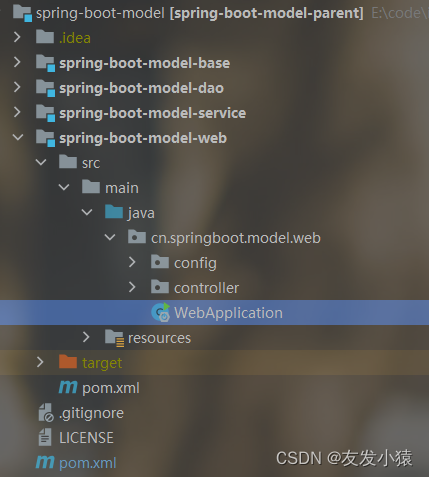

Springboot 项目中使用 @RestControllerAdvice 注解不生效

<!-- more -->

# Springboot 项目中使用 @RestControllerAdvice 注解不生效


**我的是基于 Springboot 多模块项目**



```java
package cn.springboot.model.base.exception;

@RestControllerAdvice
public class GlobalExceptionControllerAdvice {
    private static final Logger log = LoggerFactory.getLogger(GlobalExceptionControllerAdvice.class);

    /**     
     * 未知异常
     *
     * @param e
     * @return R
     */
    @ExceptionHandler(Exception.class)
    public R handleException(Exception e) {
        log.error("未知异常，请联系管理员.{} {}", e.getMessage(), e);
        return R.error(GlobalExceptionEnum.UNKNOWN_EXCEPTION.getCode(), GlobalExceptionEnum.UNKNOWN_EXCEPTION.getmessage());
    }
}
```

>检查异常处理类是否被Spring管理
>
>@SpringbootApplication默认扫描本包和子包；如果为扫描到，使用@SpringbootApplication(scanBasePackages="xxx.xxx")
>
>检查项目中的切面编程，查看是否在某个切面将异常try-catch，然后没有扔出来。

```java
@SpringBootApplication(scanBasePackages = "cn.springboot.model.*")
public class WebApplication {

    public static void main(String[] args) {
        SpringApplication.run(WebApplication.class, args);
    }      
}
```
