SpringCloud-Alibaba项目笔记-基础篇

<!-- more -->

# 一、准备

## 1,环境准备--技术选型

开发环境:

Linux UOS --> idea2019.3 --> maven3.6.3 ---> jdk1.8---> redis5.0---> nginx--->docker--->k8s

1、分布式基础概念
●微服务、注册中心、配置中心、远程调用、Feign、 网关
2、基础开发
SpringBoot2.0、SpringCloud、 Mybatis- Plus、Vue组件化、阿里云对象存储
3、环境
●Vagrant、 Linux、 Docker、 MySQL、 Redis、 逆向工程&人人开源
4、开发规范
数据校验JSR303、全局异常处理、全局统一返回、全局跨域处理
●枚举状态、业务状态码、VO与TO与PO划分、逻辑删除
●Lombok: @Data、 @Slf4j

## 2,模块划分

## 3,程序安装

# 二、创建项目

## 1、码云创建仓库

<https://gitee.com/iskong/yumall.git>

```xml
<module>yumall-coupon</module>
<module>yumall-member</module>
<module>yumall-order</module>
<module>yumall-product</module>
<module>yumall-ware</module>
<module>yumall-common</module>

<module>yumall-fast</module>
<module>yumall-generator</module>
```

过滤git上传文件

```
#
**/.mvn
**/mvnw
**/mvnw.cmd
**/target/

.idea
**/.gitignore
```

## 2、数据库导入：算了

## 3、人人开源脚手架（码云）

### 3-1、下载

renren-fast  | renren-fast-vue |  renren-generator

<https://gitee.com/renrenio>

运行renren-fast

配置sql——》yumall_admin

vscode、运行renren-fast-vue

账号密码: admin

第一次下载包资源：npm install

Linux原因：

```bash
npm ERR! 
npm ERR! Failed at the chromedriver@2.27.2 install script.
npm ERR! This is probably not a problem with npm. There is likely additional logging output above.

npm ERR! A complete log of this run can be found in:
npm ERR!     /home/kong8/.npm/_logs/2020-12-12T11_52_46_106Z-debug.log
```

自己下载：<https://chromedriver.storage.googleapis.com/2.27/chromedriver_linux64.zip> 解压到项目的 》

​ 》》renren-fast-vue/node_modules/chromedriver

```bash
kong8@kong:/data/code/cloud/yumall2/renren-fast-vue$ npm install
npm WARN deprecated request@2.88.2: request has been deprecated, see https://github.com/request/request/issues/3142
npm WARN deprecated har-validator@5.1.5: this
up to date in 16.663s
```

开始运行：npm run dev

<https://www.python.org/download/releases/2.7/>

```
npm run dev-------------
error  in src/views/common/404.vue
Module build failed: Error: ENOENT: no such file or directory, scandir '/data/code/cloud/yumall/renren-fast-vue/node_modules/node-sass/vendor'
```

#### 解决 node-sass/vendor

sudo npm rebuild node-sass

npm install -g npm@7.12.1

vsc：ctrl+~  终端输入 npm install

# 三、逆向工程 mybatisplus、dao、controller、service、pojo

1、配置fast、genrator：数据库源

逆向工程controller去掉RequiresPermissions

```java
Controller.java.vm:
  /**
     * 保存
     */
    @RequestMapping("/save")
    //@RequiresPermissions("${moduleName}:${pathName}:save")
```

# 四、整合mybatis-plus

# 五、分布式组件

```
SpringCloud-Alibaba- Nacos: 注册中心(服务发现/注册)
SpringCloud-Alibaba- Nacos: 配置中心(动态配置管理)
SpringCloud- Ribbon: 负载均衡
SpringCloud- Feign: 声明式HTTP客户端(调用远程服务)
SpringCloud-Alibaba- Sentinel: 服务容错(限流、降级、熔断)
SpringCloud- Gateway: API 网关(webflux 编程模式)
SpringCloud- Sleuth: 调用链监控
SpringCloud-Alibaba- Seata: 原Fescar,即分布式事务解决方案
```

## 人人vue+fast,路由配置

所有前段URL均发送到网关

yumall-gateway/src/main/resources/application.yml

```properties
        - id: admin_route
          uri: lb://renren-fast
          predicates:
            - Path=/api/**
          filters:
            - RewritePath=/api/(?<segment>.*),/renren-fast/$\{segment}
  ## 前端项目，开头以/api
## http://localhost:50000/api/captcha.jpg
## http://localhost:8080/renren-fast/captcha.jpg
## http://localhost:50000/api/product/category/list/tree
## http://localhost:8100/product/category/list/tree
```

renren-fast-vue/static/config/index.js

```js
  // api接口请求地址
  window.SITE_CONFIG['baseUrl'] = 'http://localhost:50000/api';
```

renren-fast添加注册中心

```xml
<dependency>
   <groupId>com.kong.yumall</groupId>
   <artifactId>yumall-common</artifactId>
   <version>0.0.1</version>
</dependency>
```

```yaml
application:
  name: renren-fast
cloud:
  nacos:
    discovery:
      server-addr: 127.0.0.1:8848
```

```java
RenrenApplication
@EnableDiscoveryClient
```

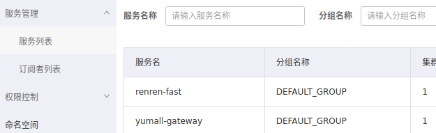

访问

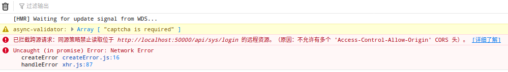

### 跨域流程

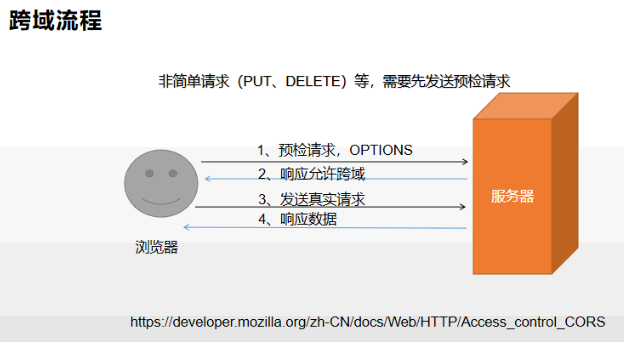

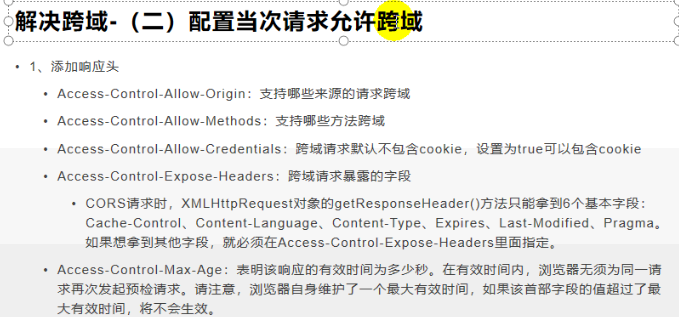

```java
@Configuration
public class YumallCorsConfiguration {

    @Bean
    public CorsWebFilter corsWebFilter(){
        UrlBasedCorsConfigurationSource source = new UrlBasedCorsConfigurationSource();

        CorsConfiguration corsConfiguration = new CorsConfiguration();

        //1、配置跨域
        corsConfiguration.addAllowedHeader("*");
        corsConfiguration.addAllowedMethod("*");
        corsConfiguration.addAllowedOrigin("*");
        corsConfiguration.setAllowCredentials(true);

        source.registerCorsConfiguration("/**",corsConfiguration);
        return new CorsWebFilter(source);
    }
}
```

把人人里的跨域去掉

### menu

```js
getMenus() {
  this.$http({
    url: this.$http.adornUrl("/product/category/list/tree"),
    method: "get"
  }).then(({data}) => {
    console.log("成功获取到菜单数据...", data.data);
    // this.menus = data.data;
  });
}
```

### 网关设置

```
- id: product_route
  uri: lb://yumall-product
  predicates:
    - Path=/api/product/**
  filters:
    - RewritePath=/api/(?<segment>.*),/$\{segment}

- id: third_party_route
  uri: lb://yumall-third-party
  predicates:
    - Path=/api/thirdparty/**
  filters:
    - RewritePath=/api/thirdparty/(?<segment>.*),/$\{segment}

- id: member_route
  uri: lb://yumall-member
  predicates:
    - Path=/api/member/**
  filters:
    - RewritePath=/api/(?<segment>.*),/$\{segment}

- id: ware_route
  uri: lb://yumall-ware
  predicates:
    - Path=/api/ware/**
  filters:
    - RewritePath=/api/(?<segment>.*),/$\{segment}
```

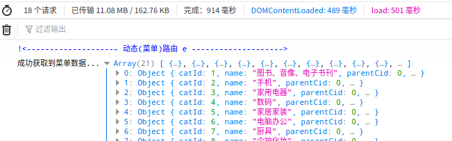

回到vue端

# 六、商品系统

## 1 分类维护

### 1.1 菜单删除

```java
    /**
     * 删除
     */
    @RequestMapping("/delete")
    //@RequiresPermissions("product:category:delete")
    public R delete(@RequestBody Long[] catIds) {
//        categoryService.removeByIds(Arrays.asList(catIds));
        categoryService.removeMenuByIds(Arrays.asList(catIds));
        return R.ok();
    }
```

### 1.2 mybatis-plus逻辑删除

```java
@Override
public void removeMenuByIds(List<Long> asList) {
    // TODO  1、检查当前删除的菜单，是否被别的地方引用
    
    /*  数据库删除：物理删除
     * 2、mybatis-plus逻辑删除：标识字段是否显示[0-不显示，1显示]
     *  1）、配置全局的逻辑删除规则（省略）
     *  2）、配置逻辑删除的组件Bean（省略）
     *  3）、version<3.2.0,给Bean加上逻辑删除注解@TableLogic，实体类字段上加上@TableLogic注解
     */
    baseMapper.deleteBatchIds(asList);
}

 /**
  * 是否显示[0-不显示，1显示]
  */
 @TableLogic(value = "1", delval = "0")
 private Integer showStatus;
```

<http://localhost:50000/api/product/category/delete>

body -> raw [1433]

SELECT * FROM `pms_category` WHERE NAME='asds'; 发现show_status为0，而不是真真的物理删除。

### 1.3 三级分类一致性

/product/category/update

```java
/**
 * 级联更新所有关联的数据
 * @param category
 */
@Transactional
@Override
public void updateCascade(CategoryEntity category) {
    this.updateById(category);
    categoryBrandRelationService.updateCategory(category.getCatId(), category.getName());
}
```

```java
@Override
public void updateCategory(Long catId, String name) {
    this.baseMapper.updateCategory(catId, name);
}
```

```java
@Mapper
public interface CategoryBrandRelationDao
-----------------------------------------------------
void updateCategory(@Param("catId") Long catId, @Param("name") String name);
```

```xml
<update id="updateCategory">
    UPDATE `pms_category_brand_relation` SET catelog_name=#{name} WHERE catelog_id=#{catId}
</update>
```

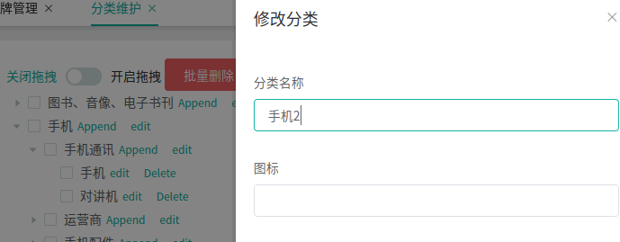

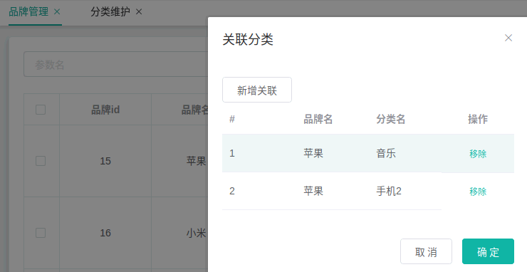

---

## 2 品牌管理

### 2.1 更新显示状态

brand/update/status

### 2.2 文件上传OSS

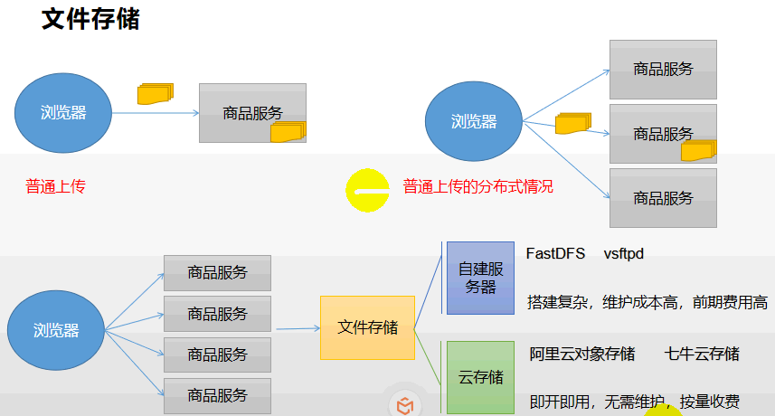

### 2.3 更新【数据一致性】

BrandController

```java
@Transactional
@Override
public void updateDetail(BrandEntity brand) {
    //保证冗余字段的数据一致
    this.updateById(brand);
    if (!StringUtils.isEmpty(brand.getName())) {
        //同步更新其他关联表中的数据
        categoryBrandRelationService.updateBrand(brand.getBrandId(), brand.getName());
        //TODO 更新其他关联
    }
}
```

```java
/**
 * @param brandId
 * @param name
 */
@Override
public void updateBrand(Long brandId, String name) {
    CategoryBrandRelationEntity relationEntity = new CategoryBrandRelationEntity();
    relationEntity.setBrandId(brandId);
    relationEntity.setBrandName(name);
    this.update(relationEntity, new UpdateWrapper<CategoryBrandRelationEntity>().eq("brand_id", brandId));
}
```

## 3 一次性倒入目录菜单SQL——menu

```sql
INSERT  INTO `sys_menu`(`menu_id`,`parent_id`,`name`,`url`,`perms`,`type`,`icon`,`order_num`) VALUES (37,31,'平台属性','','',0,'system',0),(38,37,'属性分组','product/attrgroup','',1,'tubiao',0),(39,37,'规格参数','product/baseattr','',1,'log',0),(40,37,'销售属性','product/saleattr','',1,'zonghe',0),(41,31,'商品维护','product/spu','',0,'zonghe',0),(42,0,'优惠营销','','',0,'mudedi',0),(43,0,'库存系统','','',0,'shouye',0),(44,0,'订单系统','','',0,'config',0),(45,0,'用户系统','','',0,'admin',0),(46,0,'内容管理','','',0,'sousuo',0),(47,42,'优惠券管理','coupon/coupon','',1,'zhedie',0),(48,42,'发放记录','coupon/history','',1,'sql',0),(49,42,'专题活动','coupon/subject','',1,'tixing',0),(50,42,'秒杀活动','coupon/seckill','',1,'daohang',0),(51,42,'积分维护','coupon/bounds','',1,'geren',0),(52,42,'满减折扣','coupon/full','',1,'shoucang',0),(53,43,'仓库维护','ware/wareinfo','',1,'shouye',0),(54,43,'库存工作单','ware/task','',1,'log',0),(55,43,'商品库存','ware/sku','',1,'jiesuo',0),(56,44,'订单查询','order/order','',1,'zhedie',0),(57,44,'退货单处理','order/return','',1,'shanchu',0),(58,44,'等级规则','order/settings','',1,'system',0),(59,44,'支付流水查询','order/payment','',1,'job',0),(60,44,'退款流水查询','order/refund','',1,'mudedi',0),(61,45,'会员列表','member/member','',1,'geren',0),(62,45,'会员等级','member/level','',1,'tubiao',0),(63,45,'积分变化','member/growth','',1,'bianji',0),(64,45,'统计信息','member/statistics','',1,'sql',0),(65,46,'首页推荐','content/index','',1,'shouye',0),(66,46,'分类热门','content/category','',1,'zhedie',0),(67,46,'评论管理','content/comments','',1,'pinglun',0),(68,41,'spu管理','product/spu','',1,'config',0),(69,41,'发布商品','product/spuadd','',1,'bianji',0),(70,43,'采购单维护','','',0,'tubiao',0),(71,70,'采购需求','ware/purchaseitem','',1,'editor',0),(72,70,'采购单','ware/purchase','',1,'menu',0),(73,41,'商品管理','product/manager','',1,'zonghe',0),(74,42,'会员价格','coupon/memberprice','',1,'admin',0),(75,42,'每日秒杀','coupon/seckillsession','',1,'job',0);
```

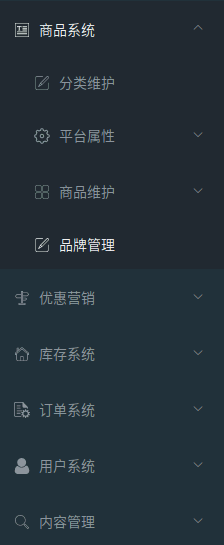

回到vue前端

---

## 4 平台属性

### 4.1  属性分组 attrgroup

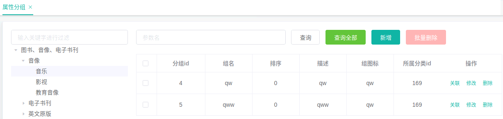

#### 4.1.1 获取分类属性分组

/product/attrgroup/list/{catelogId}

```java
String key = (String) params.get("key");
//条件查询
//select * from pms_attr_group where catelog_id=? and (attr_group_id=key or attr_group_name like %key%)
QueryWrapper<AttrGroupEntity> wrapper = new QueryWrapper<AttrGroupEntity>();
if (!StringUtils.isEmpty(key)) {
    wrapper.and((obj) -> {
        obj.eq("attr_group_id", key).or().like("attr_group_name", key);
    });
}
```

#### 4.1.2 获取属性分组详情

/product/attrgroup/info/{attrGroupId}

#### 4.1.3 新增属性分组

/product/attrgroup/save

---

### 4.2 规格参数 attr/base

#### 4.2.1 获取规格参数

/product/attr/${type}/list/${this.catId}

```
type："sale" : "base"
```

```java
/**
 * 获取数据列表
 * <p>
 * product/attr/sale/list/0?
 * product/attr/base/list/{catelogId}
 *
 * @param params    参数
 * @param catelogId 所属分类
 * @param type      属性类型[0-销售属性，1-基本属性，2-既是销售属性又是基本属性]
 * @return page
 */
@GetMapping("/{attrType}/list/{catelogId}")
public R baseAttrList(@RequestParam Map<String, Object> params,
                      @PathVariable("catelogId") Long catelogId,
                      @PathVariable("attrType") String type) {

    PageUtils page = attrService.queryBaseAttrPage(params, catelogId, type);
    return R.ok().put("page", page);
}
```

#### 4.2.2 修改规格参数

```java
/**
 * 修改规格参数
 * @param attr 规格参数
 */
@Transactional
@Override
public void updateAttr(AttrVo attr) {
    AttrEntity attrEntity = new AttrEntity();
    BeanUtils.copyProperties(attr, attrEntity);
    this.updateById(attrEntity);

    if (attrEntity.getAttrType() == ProductConstant.AttrEnum.ATTR_TYPE_BASE.getCode()) {
        //1、修改分组关联
        AttrAttrgroupRelationEntity relationEntity = new AttrAttrgroupRelationEntity();

        relationEntity.setAttrGroupId(attr.getAttrGroupId());
        relationEntity.setAttrId(attr.getAttrId());

        Integer count = relationDao.selectCount(new QueryWrapper<AttrAttrgroupRelationEntity>().eq("attr_id", attr.getAttrId()));
        if (count > 0) {//更新
            relationDao.update(relationEntity, new UpdateWrapper<AttrAttrgroupRelationEntity>().eq("attr_id", attr.getAttrId()));
        } else {//插入
            relationDao.insert(relationEntity);
        }
    }
}
```

#### 4.2.3 保存属性

/product/attr/save

#### 4.2.4 属性详情

/product/attr/info/{attrId}

#### 4.2.5 修改属性

/product/attr/update

#### 4.2.6 获取分类销售属性

/product/attr/sale/list/{catelogId}

---

### 4.3  销售属性 attr

添加、修改

删除

---

### 4.4  关联【分组与属性】

#### 4.4.1 获取属性与分组的关联的所有属性

/product/attrgroup/{attrgroupId}/attr/relation

#### 4.4.2 添加属性与分组关联关系

/product/attrgroup/attr/relation

#### 4.4.3 删除属性与分组的关联关系

/product/attrgroup/attr/relation/delete

#### 4.4.4 获取属性分组没有关联的其他属性

/product/attrgroup/{attrgroupId}/noattr/relation

#### 4.4.5 获取分类关联的品牌

/product/categorybrandrelation/brands/list

#### 4.4.6 获取品牌关联的分类

/product/categorybrandrelation/catelog/list

#### 4.4.7 新增品牌与分类关联关系

/product/categorybrandrelation/save

#### 4.4.8 获取分类下所有分组&关联属性

/product/attrgroup/{catelogId}/withattr

---

## 5 商品维护

### 5.1 CPU管理

### 5.2 发布商品

#### 流程

SpuInfoServiceImpl.java

```java
//1、保存spu基本信息 pms_spu_info
//2、保存Spu的描述图片 pms_spu_info_desc
//3、保存spu的图片集 pms_spu_images
//4、保存spu的规格参数;pms_product_attr_value
//5、保存spu的积分信息；yumall_sms->sms_spu_bounds,远程服务调用
//5、保存当前spu对应的所有sku信息；
  5.1）、sku的基本信息；pms_sku_info
        5.2）、sku的图片信息；pms_sku_image
        5.3）、sku的销售属性信息：pms_sku_sale_attr_value
        5.4）、sku的优惠、满减等信息；gulimall_sms->sms_sku_ladder\sms_sku_full_reduction\sms_member_price
```

### 5.3 商品管理

#### SPU检索

#### SKU检索

# 七、订单系统

# 八、用户系统

## 1 会员列表

## 2 会员等级

## 3 积分变化

## 4 统计信息

# 十、分布式基础篇总结

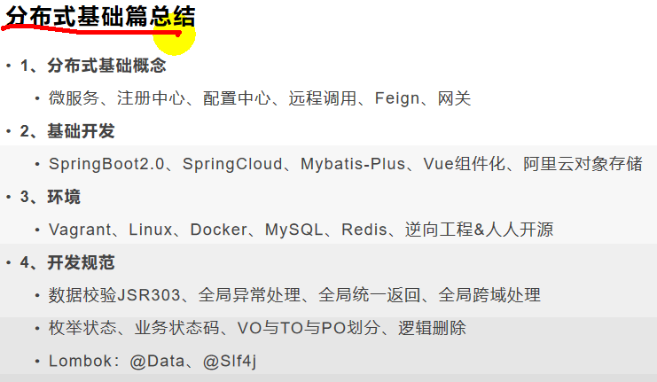
