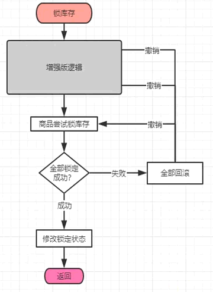
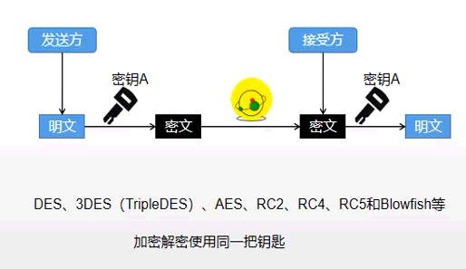

SpringCloud-Alibaba项目笔记-高级篇

<!-- more -->

## ES集群


# 七、商品上架

**商品上架 ：把数据保存到es** ：spu

## -- 构造sku检索属性

### 1、上架 product/spuinfo/list/{spuId}/up

```java
spuInfoService.up(spuId);
skuInfoService.getSkusBySpuId(spuId);
 -> List<SkuInfoEntity> skuInfoEntityList = this.list(new QueryWrapper<SkuInfoEntity>().eq("spu_id", spuId));
//组装需要的数据
skus.stream().map(sku -> {
    SkuEsModel esModel = new SkuEsModel();
 BeanUtils.copyProperties(sku, esModel);
    //TODO 1、发送远程调用，库存系统查询是否有库存
    //TODO 2、热度评分。e,
    setHotScore(0L);
    //TODO 3 查询品牌和分类的名字信息
    brandService.getById(esModel.getBrandId());
    //setSkuPrice/setSkuImg/setHotScore(0L)/setBrandName(brand.getName());
    //esModel.setBrandImg(brand.getLogo());
    categoryService.getById(esModel.getCatalogId());
    //setCatalogName(categoryServiceById.getName());
    setAttrs(attrsList);
} 
///////////////////
List<Long> searchAttrIds = attrService.selectSearchAttrIds(attrIds);
 --> baseMapper.selectSearchAttrIds(attrIds); 
        --> List<Long> selectSearchAttrIds(@Param("attrIds") List<Long> attrIds); 
             --> SELECT attr_id FROM pms_attr WHERE attr_id IN <foreach collection="attrIds" item="id" separator="," open="(" close=")"> #{id} </foreach> AND search_type = 1
//////////////////                  
                  
Set<Long> idSet = new HashSet<>(searchAttrIds);
List<SkuEsModel.Attrs> attrsList = baseAttrs.stream().filter(item -> {
    return idSet.contains(item.getAttrId());
}).map(item -> {
    SkuEsModel.Attrs attrs1 = new SkuEsModel.Attrs();
    BeanUtils.copyProperties(item, attrs1);
    return attrs1;
}).collect(Collectors.toList());              
```

## -- 发送远程调用，库存系统查询是否有库存

/ware/waresku/hasstock

```java
getSkusHasStock(@RequestBody List<Long> skuIds) {
    wareSkuService.getSkusHasStock(skuIds);
//////////////getSkusHasStock:
List<SkuHasStockVo> collect = skuIds.stream().map(skuId -> {
            SkuHasStockVo vo = new SkuHasStockVo();
        //查询当前sku的总库存量
        //SELECT SUM(stock-stock_ locked) FROM、 wms_ _ware_ sku^ WHERE sku_ id=1
            long count = baseMapper.getSkuStock(skuId);
            vo.setSkuld(skuId);
            vo.setHasStock(count > 0);
            return vo;
        }).collect(Collectors.toList());    
    --> getSkuStock:
     SELECT SUM(stock-stock_ locked) FROM wms_ _ware_ sku WHERE sku_id=#{skuId}
```

创建 WareFeignService

```java
@PostMapping("/ware/waresku/hasstock")
R<List<SkuHasStockVo>> getSkusHasStock(@RequestBody List<Long> skuIds);
```

```java
Map<Long, Boolean> stockMap = null;
try {
    R<List<SkuHasStockVo>> skusHasStock = wareFeignService.getSkusHasStock(collect);
    stockMap = skusHasStock.getData().stream().collect(Collectors.toMap(SkuHasStockVo::getSkuld, item -> item.getHasStock()));
} catch (Exception e) {
    log.error("库存服务查询异常:原因{}", e);
}

  Map<Long, Boolean> finalStockMap = stockMap;
   if (finalStockMap == null) {
                esModel.setHasStock(true);
            } else {
                esModel.setHasStock(finalStockMap.get(sku.getSkuId()));
            }
```

## -- 将数据发送给es进行保存;yumall-search

/ElasticSavaController::productStatusUp

```java
//保存到es，
//1、给es中建立索引。product,建立好映射关系。
//2、给es中保存这些数据
productStatusUp->BulkRequest->for->IndexRequest->restHighLevelClient.bulk
```


//BizCodeEnume :: PRODUCT_UP_EXCEPTION(11000, "商品上架异常");

商品服务调用Search

```java
yumall-product：feign：SearchFeignService
-------------------
@FeignClient("yumall-search")
public interface SearchFeignService {
    @PostMapping("/search/save/product")
    R productStatusUp(@RequestBody List<SkuEsModel> skuEsModels);
```

//SpuInfoServiceImpl

```java
//TODO 5、将数据发送给es进行保存;yumall-search
R r = searchFeignService.productStatusUp(upProducts);
```

成功：修改spu状态

```java
//枚举类：yumall.common.constant.ProductConstant.StatusEnum
NEW_SPU(0, "新建"),
        SPU_UP(1, "上架"),
        SPU_DOWN(2, "下架");
////////////////
baseMapper.updateStatusBySPUId(spuId, ProductConstant.StatusEnum.SPU_UP.getCode());
UPDATE pms_spu_info SET publish_status=#{code}, update_time=NOW() WHERE id=#{spuId}        
```

失败：重复操作？

## -- 优化库存

```java
R::::
public <T> T getData(TypeReference<T> typeReference) {
    Object data = get("data");//默认是map
    String s = JSON.toJSONString(data);
    T t = JSON.parseObject(s, (Type) typeReference);
    return t;
}

public R setData(Object data) {
    put("data", data);
    return this;
}
----------------------
//查询sku是否有库存
    @PostMapping("/hasstock")
    public R getSkusHasStock(@RequestBody List<Long> skuIds) {
        List<SkuHasStockVo> skuHasStockVos = wareSkuService.getSkusHasStock(skuIds);
        return R.ok().setData(skuHasStockVos);
    }
-------------------    
 R skusHasStock = wareFeignService.getSkusHasStock(collect);
            TypeReference<List<SkuHasStockVo>> listTypeReference = new TypeReference<List<SkuHasStockVo>>() {
            };
            stockMap = skusHasStock.getData(listTypeReference).stream().collect(Collectors.toMap(SkuHasStockVo::getSkuld, item -> item.getHasStock()));
        
```

# 八、首页&nginx

## -- 商品：product

### --- 导入thymeleaf

```xml
<dependency>
    <groupId>org.springframework.boot</groupId>
    <artifactId>spring-boot-starter-thymeleaf</artifactId>
</dependency>
```

### --- 导入首页


```
spring.thymeleaf.cache=false
```


创建：app、web文件夹

热插件：

```
<dependency>
    <groupId>org.springframework.boot</groupId>
    <artifactId>spring-boot-devtools</artifactId>
    <optional>true</optional>
</dependency>
```

### --- 查出所有的1级分类

```
getLevel1Categorys:-> List<CategoryEntity> categoryEntities = baseMapper.selectList(new QueryWrapper<CategoryEntity>().eq("parent_ .cid", 0));
```

index引入: `<html xmlns:th="http://www.thymeleaf.org">`


### --- 显示二级&三级分类

json数据

```json
{
 "21": [
    {
      "catalog1Id": "21",
      "catalog3List": [
        {
          "catalog2Id": "143",
          "id": "1259",
          "name": "面包车（二手）"
        }
      ],
      "id": "143",
      "name": "二手车"
    }
  ]
}        
```

```java
@NoArgsConstructor
@AllArgsConstructor
@Data
public class Catalog2Vo {
    /**
     * 一级父分类ID
     */
    private String catalog1Id;
    /**
     * 三级子分类
     */
    private List<Catalog3Vo> catalog3List;
    private String id;
    private String name;

    /**
     * 三级子分类
     */
    @NoArgsConstructor
    @AllArgsConstructor
    @Data
    public static class Catalog3Vo {
        /**
         * 二级父分类id
         */
        private String catalog2Id;
        private String id;
        private String name;
    }
}
```

```
@RequestMapping("index/catalog.json")
getCataLogJson：：categoryService.getCataLogJson();
1、查出所有1级分类：：2、封装数据：：
 2.1 每一个的一级分类，查到这个一级分类的二级分类
 2.2 封装上面的结果
 2.2.1 查到这个二级分类的三级分类
return 2、； 
```


## -- nginx

### --- 静态配置

```bash
server {
    listen       80;
    server_name yumall.com;
    charset utf-8;
  root html;
   index index.html index.htm;
    access_log  logs/yumall.com.log  main;

    location / {
  proxy_pass http://192.168.101.6:8100;
   }
}
```

### --- 分布式网关配置

**nginx代理到网关50000,网关代理到其他服务**

nginx.conf

```xml
##负载均衡
upstream yumall{
  server 192.168.101.6:50000; #网关port：50000
}
```

yumall.conf

```xml
location / {
 proxy_pass http://yumall;
    proxy_set_header Host $host;
}
```

网关服务配置

```xml
##########################uri: lb：负载均衡，到哪个服务#####################
        - id: product_route
          uri: lb://yumall-product
          predicates:
            - Path=/api/product/**
          filters:
            - RewritePath=/api/(?<segment>.*),/$\{segment}
##########################网关配置放在最后面#################################
        - id: yumall_nginx_host
          uri: lb://yumall-product
          predicates:
            - Host=**.yumall.com,yumall.com
```

<http://yumall.com/api/product/category/list/tree>


# 十一、检索服务

## - - 模型分析

1、前端设置 list.html

2、后端es检索接口

3、创建vo，SearchParamVo、SearchResultVo

## - - es检索简单测试

结构：

must：模糊关键字查询

filter过滤：属性、分类、品牌、价格、库存...

sort：排序

分页，高亮，聚合

```bash
GET /product/_search
{
  "query": {
    "bool": {
      "must": [
        {
          "match": {
            "skuTitle": "华为"
          }
        }
      ],
      "filter": [
        {
          "term": {
            "catalogId": "225"
          }
        },
        {
          "terms": {
            "brandId": [
              "1",
              "2",
              "9"
            ]
          }
        },
        {
          "nested": {
            "path": "attrs",
            "query": {
              "bool": {
                "must": [
                  {
                    "term": {
                      "attrs.attrId": {
                        "value": "15"
                      }
                    }
                  },
                  {
                    "terms": {
                      "attrs.attrValue": [
                        "华为",
                        "navo 7 5G"
                      ]
                    }
                  }
                ]
              }
            }
          }
        },
        {
          "term": {
            "hasStock": {
              "value": "true"
            }
          }
        },
        {
          "range": {
            "skuPrice": {
              "gte": 100,
              "lte": 70000
            }
          }
        }
      ]
    }
  },
  "sort": [
    {
      "skuPrice": {
        "order": "desc"
      }
    }
  ],
  "from": 0,
  "size": 20,
  "highlight": {
    "fields": {"skuTitle":{}},
    "pre_tags": "<b style='color:red'>",
    "post_tags": "</b>"
  }
}
```

## - - 聚合查询

```
//1、构建请求；2、构建查询条件
SearchRequest searchRequest = buildSearchRequest();
//3、执行查询
   SearchResponse response = client.search(searchRequest, ElasticSearchConfig.COMMON_OPTIONS);
//4、数据分析封装
   result = buildSearchResult(response);
```

### --- 构建请求

```java
SearchSourceBuilder sourceBuilder = new SearchSourceBuilder();
BoolQueryBuilder boolQueryBuilder = QueryBuilders.boolQuery();
```

#### - - must：模糊关键字查询

```java
if(!StringUtils.isEmpty(paramVo.getKeyword())){
   boolQueryBuilder.must(QueryBuilders.matchQuery("skuTitle", paramVo.getKeyword()));
}
```

#### - - filter：分类

```java
if(null != paramVo.getCatalog3Id()){
   boolQueryBuilder.filter(QueryBuilders.termQuery("catalogId", paramVo.getCatalog3Id()));
  }
```

#### - - filter：品牌id

```java
if(null != paramVo.getBrandId() && 0 < paramVo.getBrandId().size()){
   boolQueryBuilder.filter(QueryBuilders.termQuery("brandId", paramVo.getBrandId()));
  }
```

#### - - filter：*属性*

```java
if(null != paramVo.getAttrs() && 0 < paramVo.getAttrs().size()){
   //1.2、bool - filter -按照所有指定的属性进行查询
   for(String attrStr : paramVo.getAttrs()){
    //attrs=1_ .5寸 :8寸&attrs=2_ 166:8G
    BoolQueryBuilder nestedboolQuery = QueryBuilders.boolQuery();
    //attr = 1_ .5寸:8寸
    String[] s = attrStr.split("_");
    //检索的属性id
    String attrId = s[0];
    //这个属性的检索用的值
    String[] attrValues = s[1].split(":");
    nestedboolQuery.must(QueryBuilders.termQuery("attrs . attrId", attrId));
    nestedboolQuery.must(QueryBuilders.termsQuery("attrs . attrValue", attrValues));
    //每一个必须都得生成1个nested查询
    boolQueryBuilder.filter(QueryBuilders.nestedQuery("attrs", nestedboolQuery, ScoreMode.None));
   }
  }
```

#### - - filter：库存

```java
if(null != paramVo.getHasStock()){
   boolQueryBuilder.filter(QueryBuilders.termQuery("hasStock", paramVo.getHasStock() == 1));
  }
```

#### - - filter：价格

```java
if(!StringUtils.isEmpty(paramVo.getSkuPrice())){
   RangeQueryBuilder rangeQuery = QueryBuilders.rangeQuery("skuPrice");
   String[] strings = paramVo.getSkuPrice().split("_");
   if(strings.length == 2){
    rangeQuery.gte(strings[0]).lte(strings[1]);
   }else if(strings.length == 1){
    if(paramVo.getSkuPrice().startsWith("_")){
     rangeQuery.lte(strings[0]);
    }
    if(paramVo.getSkuPrice().endsWith("_")){
     rangeQuery.gte(strings[0]);
    }
   }
   boolQueryBuilder.filter(rangeQuery);
  }
```

#### - - from 分页

```java
// 分页，from（开始位置），size（每次几条）
  sourceBuilder.from((paramVo.getPageNum()-1)*EsConstant.PRODUCT_PAGESIZE);
  sourceBuilder.size(EsConstant.PRODUCT_PAGESIZE);
```

#### - - highlighter 高亮

```java
if(!StringUtils.isEmpty(paramVo.getKeyword())){
   HighlightBuilder builder = new HighlightBuilder();
   builder.field("skuTit1e");
   builder.preTags("<b sty1e='color:red'>");
   builder.postTags("</b>");
   sourceBuilder.highlighter(builder);
  }
```

#### - - 聚合分析

```java
//1、品牌聚合 brand_agg
TermsAggregationBuilder brand_agg = AggregationBuilders.terms("brand_agg");
brand_agg.field("brandId").size(50);
//品牌聚合的子聚合
brand_agg.subAggregation(AggregationBuilders.terms("brand_name_agg").field("brandName.keyword").size(1));
brand_agg.subAggregation(AggregationBuilders.terms("brand_img_agg").field("brandImg.keyword").size(1));
sourceBuilder.aggregation(brand_agg);
//2、分类聚合 catalog_agg
TermsAggregationBuilder catalog_agg = AggregationBuilders.terms("catalog_agg").field("catalogId").size(20);
catalog_agg.subAggregation(AggregationBuilders.terms("catalog_name_agg").field("catalogName.keyword").size(1));
sourceBuilder.aggregation(catalog_agg);
//3、属性聚合 attr_agg
NestedAggregationBuilder attr_agg = AggregationBuilders.nested("attr_agg", "attrs");
TermsAggregationBuilder attr_id_agg = AggregationBuilders.terms("attr_id_agg").field("attrs.attrId");
attr_id_agg.subAggregation(AggregationBuilders.terms("attr_name_agg").field("attrs.attrName.keyword").size(1));
attr_id_agg.subAggregation(AggregationBuilders.terms("attr_value_agg").field("attrs.attrValue.keyword").size(50));
attr_agg.subAggregation(attr_id_agg);
sourceBuilder.aggregation(attr_agg);
```

### --- 数据响应封装

#### - - 封装SearchResultVo主要参数

List\<SkuEsModel> products; List\<BrandVo> brands; List\<CatalogVo> catalogs; List\<AttrVo> attrs;

```java
@Data
public static class BrandVo{
   private Long brandId;
   private String brandName;
   private String brandImg;
}

@Data
public static class CatalogVo{
   private Long catalogId;
   private String catalogName;
}

@Data
public static class AttrVo{
   private Long attrId;
   private String attrName;
   private List<String> attrValue;
}
```

SearchResultVo result = new SearchResultVo();

#### - - 1、返回的所有查询到的商品

```java
SearchHits hits = response.getHits();
List<SkuEsModel> esModels = new ArrayList<>();
for(SearchHit hit : hits.getHits()){
    hit.getSourceAsString();
    SkuEsModel esModel = JSON.parseObject(sourceAsString, SkuEsModel.class);
    //是检索时，获取高亮信息
    if(!StringUtils.isEmpty(paramVo.getKeyword())){
     String string = hit.getHighlightFields().get("skuTitle")
       .getFragments()[0].string();
     esModel.setSkuTitle(string);
    }
    esModels.add(esModel);
}    
result.setProducts(esModels);    
```

#### - - 2、当前所有商品涉及到的所有属性信息

```java
List<SearchResultVo.AttrVo> attrVos = new ArrayList<>();
ParsedNested attrAgg = response.getAggregations().get("attr_agg");
ParsedLongTerms attrIdAgg = attrAgg.getAggregations().get("attr_id_agg");
for(Terms.Bucket bucket : attrIdAgg.getBuckets()){
    SearchResultVo.AttrVo attrVo = new SearchResultVo.AttrVo();
   //1、得到属性的id
   long attrId = bucket.getKeyAsNumber().longValue();
   //2、得到属性的名字
   String attrName = JSON.toJSONString(((ParsedStringTerms) bucket.getAggregations().get("attr_name_agg")).getBuckets());
   //3、得到属性的所有值.
   List<String> attrValues = ((ParsedStringTerms) bucket.getAggregations().get("attr_value_agg"))
     .getBuckets().stream().map(item -> {
      return ((Terms.Bucket) item).getKeyAsString();
     }).collect(Collectors.toList());
    attrVo.set....
    attrVos.add(attrVo);
}
result.setAttrs(attrVos);
```

#### - - 3、当前所有商品涉及到的所有品牌信息

```java
List<SearchResultVo.BrandVo> brandVos = new ArrayList<>();
ParsedLongTerms brandAgg = response.getAggregations().get("brand_agg");

for(Terms.Bucket bucket : brandAgg.getBuckets()){
   SearchResultVo.BrandVo brandVo = new SearchResultVo.BrandVo();
   //1、得到品牌的id
   long brandId = bucket.getKeyAsNumber().longValue();
   //2、得到品牌的名
   String brandName = ((ParsedStringTerms) bucket.getAggregations().get("brand_name_agg")).getBuckets().get(0).getKeyAsString();
   //3、得到品牌的图片
   String brandImg = ((ParsedStringTerms) bucket.getAggregations().get("brand_img_agg")).getBuckets().get(0).getKeyAsString();
   brandVo.set...
   brandVos.add(brandVo);
  }
result.setBrands(brandVos);

```

#### - - 4、当前所有商品涉及到的所有分类信息

```java
List<SearchResultVo.CatalogVo> catalogVos = new ArrayList<>();
  ParsedLongTerms cataLogAgg = response.getAggregations().get("catalog_agg");
  List<? extends Terms.Bucket> buckets = cataLogAgg.getBuckets();
  for(Terms.Bucket bucket : buckets){
   SearchResultVo.CatalogVo catalogVo = new SearchResultVo.CatalogVo();
   //得到分类id
   catalogVo.setCatalogId(Long.parseLong(bucket.getKeyAsString()));
   //得到分类名
   String catalogNameAgg = ((ParsedStringTerms) bucket.getAggregations().get("catalog_name_agg")).getBuckets().get(0).getKeyAsString();
   catalogVo.setCatalogName(catalogNameAgg);
   catalogVos.add(catalogVo);
  }
  result.setCatalogs(catalogVos);
```

#### - - 5、分页信息 pageNum total totalPages pageNavs

```java
//5、分页信息-页码
  result.setPageNum(paramVo.getPageNum());
  //5、分页信息-总记录树
  long total = hits.getTotalHits().value;
  result.setTotal(total);
  //5、分页信息总页码-计算11/2 = 5.. 1
  //5、2分页信息-总页码-计算
  int totalPages = (int) total%EsConstant.PRODUCT_PAGESIZE == 0 ? (int) total/EsConstant.PRODUCT_PAGESIZE
    : ((int) total/EsConstant.PRODUCT_PAGESIZE+1);
  result.setTotalPages(totalPages);

  List<Integer> pageNavs = new ArrayList<>();
  for(int i = 1; i <= totalPages; i++){
   pageNavs.add(i);
  }
  result.setPageNavs(pageNavs);
```

#### - - 6、构建面包屑导航

```java
//6、构建面包屑导航
  if(param.getAttrs() != null && param.getAttrs().size() > 0){
   List<SearchResult.NavVo> collect = param.getAttrs().stream().map(attr -> {
    //1、分析每一个attrs传过来的参数值
    SearchResult.NavVo navVo = new SearchResult.NavVo();
    String[] s = attr.split("_");
    navVo.setNavValue(s[1]);
    R r = productFeignService.attrInfo(Long.parseLong(s[0]));
    if(r.getCode() == 0){
     AttrResponseVo data = r.getData("attr", new TypeReference<AttrResponseVo>(){
     });
     navVo.setNavName(data.getAttrName());
    }else{
     navVo.setNavName(s[0]);
    }

    //2、取消了这个面包屑以后，我们要跳转到哪个地方，将请求的地址url里面的当前置空
    //拿到所有的查询条件，去掉当前
    String encode = null;
    try{
     encode = URLEncoder.encode(attr, "UTF-8");
     //浏览器对空格的编码和Java不一样，差异化处理
     encode.replace("+", "%20");
    }catch(UnsupportedEncodingException e){
     e.printStackTrace();
    }
    String replace = param.get_queryString().replace("&attrs="+attr, "");
    navVo.setLink("http://search.yumall.com/list.html?"+replace);

    return navVo;
   }).collect(Collectors.toList());

   result.setNavs(collect);
  }
```

## - - 页面处理

### --- 点击跳转

```
th:href="${'javascript:searchProducts(&quot;brandId&quot;,'+brand.brandId+')'}"

function searchProducts(name, value) {
        //原來的页面
        location.href = replaceParamVal(location.href,name,value,true)
    }
    
function replaceParamVal(url, paramName, replaceVal,forceAdd) {
    var oUrl = url.toString();
    var nUrl;
    if (oUrl.indexOf(paramName) != -1) {
        if( forceAdd ) {
            if (oUrl.indexOf("?") != -1) {
                nUrl = oUrl + "&" + paramName + "=" + replaceVal;
            } else {
                nUrl = oUrl + "?" + paramName + "=" + replaceVal;
            }
        } else {
            var re = eval('/(' + paramName + '=)([^&]*)/gi');
            nUrl = oUrl.replace(re, paramName + '=' + replaceVal);
        }
    } else {
        if (oUrl.indexOf("?") != -1) {
            nUrl = oUrl + "&" + paramName + "=" + replaceVal;
        } else {
            nUrl = oUrl + "?" + paramName + "=" + replaceVal;
        }
    }
    return nUrl;
};
```

### --- 综合排序、销量、价格、评分、上架时间、分页、排序内容、仅显示有货

### --- 面包屑导航

```
<div class="JD_ipone_one c">
    <!-- 遍历面包屑功能 -->
    <a th:href="${nav.link}" th:each="nav:${result.navs}"><span th:text="${nav.navName}"></span>：<span
            th:text="${nav.navValue}"></span> x</a>
</div>
```

# 十三、商品详情

## 0、线程池配置

### --- MyThreadConfig

```java
@EnableConfigurationProperties(ThreadPoolConfigProperties.class)
@Configuration
public class MyThreadConfig{

   @Bean
   public ThreadPoolExecutor threadPoolExecutor(ThreadPoolConfigProperties pool){
      return new ThreadPoolExecutor(
            pool.getCoreSize(),
            pool.getMaxSize(),
            pool.getKeepAliveTime(),
            TimeUnit.SECONDS,
            new LinkedBlockingDeque<>(100000),
            Executors.defaultThreadFactory(),
            new ThreadPoolExecutor.AbortPolicy()
      );
   }

}
```

### --- ThreadPoolConfigProperties

```java
@ConfigurationProperties(prefix = "yumall.thread")
@Data
public class ThreadPoolConfigProperties{
    private Integer coreSize;
    private Integer maxSize;
    private Integer keepAliveTime;
}
```

### --- Properties

```xml
#配置线程池
yumall.thread.coreSize=20
yumall.thread.maxSize=200
yumall.thread.keepAliveTime=10
```

ThreadPoolExecutor executor;

## 1、sku基本信息的获取  pms_sku_info

```java
CompletableFuture<SkuInfoEntity> infoFuture = CompletableFuture.supplyAsync(() -> {
   SkuInfoEntity info = this.getById(skuId);
   skuItemVo.setInfo(info);
   return info;
}, executor);
```

## 2、sku的图片信息

```java
CompletableFuture<Void> imageFuture = CompletableFuture.runAsync(() -> {
   List<SkuImagesEntity> imagesEntities = skuImagesService.getImagesBySkuId(skuId);
   skuItemVo.setImages(imagesEntities);
}, executor);

getImagesBySkuId::this.baseMapper.selectList(new QueryWrapper<SkuImagesEntity>().eq("sku_id", skuId));
```

## 3、获取spu的销售属性组合

```java
CompletableFuture<Void> saleAttrFuture = infoFuture.thenAcceptAsync((res) -> {
   List<SkuItemSaleAttrVo> saleAttrVos = skuSaleAttrValueService.getSaleAttrBySpuId(res.getSpuId());
   skuItemVo.setSaleAttr(saleAttrVos);
}, executor);

getSaleAttrBySpuId::
 SkuSaleAttrValueDao baseMapper = this.getBaseMapper();
 return baseMapper.getSaleAttrBySpuId(spuId);
```

## 4、获取spu的介绍

```java
CompletableFuture<Void> descFuture = infoFuture.thenAcceptAsync((res) -> {
   SpuInfoDescEntity spuInfoDescEntity = spuInfoDescService.getById(res.getSpuId());
   skuItemVo.setDesc(spuInfoDescEntity);
}, executor);
```

## 5、获取spu的规格参数信息

```java
CompletableFuture<Void> baseAttrFuture = infoFuture.thenAcceptAsync((res) -> {
   List<SpuItemAttrGroupVo> attrGroupVos = attrGroupService.getAttrGroupWithAttrsBySpuId(res.getSpuId(), res.getCatalogId());
   skuItemVo.setGroupAttrs(attrGroupVos);
}, executor);

getAttrGroupWithAttrsBySpuId::
 //1、查出当前spu对应的所有属性的分组信息以及当前分组下的所有属性对应的值
        AttrGroupDao baseMapper = this.getBaseMapper();
        return baseMapper.getAttrGroupWithAttrsBySpuId(spuId,catalogId);
```

## //TODO 6、远程调用查询当前sku是否参与秒杀优惠活动

```java
CompletableFuture<Void> seckillFuture = CompletableFuture.runAsync(() -> {
   R skuSeckilInfo = seckillFeignService.getSkuSeckilInfo(skuId);
   if(skuSeckilInfo.getCode() == 0){
      //查询成功
      SeckillSkuVo seckilInfoData = skuSeckilInfo.getData("data", new TypeReference<SeckillSkuVo>(){
      });
      skuItemVo.setSeckillSkuVo(seckilInfoData);

      if(seckilInfoData != null){
         long currentTime = System.currentTimeMillis();
         if(currentTime > seckilInfoData.getEndTime()){
            skuItemVo.setSeckillSkuVo(null);
         }
      }
   }
}, executor);
```

CompletableFuture.allOf(saleAttrFuture, descFuture, baseAttrFuture, imageFuture).get();

return skuItemVo;

# 十四、认证服务

## 1、初始化

创建yumall-auth-server服务，port：20000，pom排除SQL依赖

nacos：other.yml，redis.yml

nginx：login，reg，auth.yumall.com;

## 2、网关

```xml
- id: yumall_auth_route
  uri: lb://yumall-auth-server
  predicates:
    - Host=auth.yumall.com
```

## 3、首页

```java
@GetMapping(value = {"/", "/login.html"})
public String loginPage(HttpSession session){

   //从session先取出来用户的信息，判断用户是否已经登录过了
   Object attribute = session.getAttribute(LOGIN_USER);
   //如果用户没登录那就跳转到登录页面
   if(attribute == null){
      return "login";
   }else{
      return "redirect:http://yumall.com";
   }
}
```

## 4、注册-获取手机验证码，倒计时

### 4.1 html

```js
<div class="register-box">
            <label class="other_label">验 证 码
                <input name="code" maxlength="20" type="text" placeholder="请输入验证码" class="caa">
            </label>
            <a id="sendCode" class=""> 发送验证码 </a>
        </div>


$(function () {
    $("#sendCode").click(function () {
        //2、倒计时
        if ($(this).hasClass("disabled")) {
            //正在倒计时中
        } else {
            //1、给指定手机号发送验证码
            $.get("/sms/sendCode?phone=" + $("#phoneNum").val(), function (data) {
                if (data.code != 0) {
                    alert(data.msg);
                }
            });
            timeoutChangeStyle();
        }
    });
});
var num = 60;

    function timeoutChangeStyle() {
        $("#sendCode").attr("class", "disabled");
        if (num == 0) {
            $("#sendCode").text("发送验证码");
            num = 60;
            $("#sendCode").attr("class", "");
        } else {
            var str = num + "s 后再次发送";
            $("#sendCode").text(str);
            setTimeout("timeoutChangeStyle()", 1000);
        }
        num--;
    }
```

### 4.2 后端

#### 4.2.1 a、接口防刷，b、验证码的再次效验，c、存入redis，防止同一个手机号在60秒内再次发送验证码

```java
@ResponseBody
@GetMapping(value = "/sms/sendCode")
public R sendCode(@RequestParam("phone") String phone){

   //1、接口防刷
   String redisCode = stringRedisTemplate.opsForValue().get(AuthServerConstant.SMS_CODE_CACHE_PREFIX+phone);
   if(!StringUtils.isEmpty(redisCode)){
      //活动存入redis的时间，用当前时间减去存入redis的时间，判断用户手机号是否在60s内发送验证码
      long currentTime = Long.parseLong(redisCode.split("_")[1]);
      if((System.currentTimeMillis()-currentTime) < 60000){
         //60s内不能再发
         return R.error(BizCodeEnum.SMS_CODE_EXCEPTION.getCode(), BizCodeEnum.SMS_CODE_EXCEPTION.getMsg());
      }
   }

   //2、验证码的再次效验 redis.存key-phone,value-code
   int code = (int) ((Math.random()*9+1)*100000);
   String codeNum = String.valueOf(code);
   String redisStorage = codeNum+"_"+System.currentTimeMillis();

   //存入redis，防止同一个手机号在60秒内再次发送验证码，10分钟
   stringRedisTemplate.opsForValue().set(AuthServerConstant.SMS_CODE_CACHE_PREFIX+phone,
         redisStorage, 10, TimeUnit.MINUTES);
 //进入第三方服务+使用阿里发送验证码
   thirdPartFeignService.sendCode(phone, codeNum);

   return R.ok();
}
```

#### 4.2.2 进入第三方服务+使用阿里发送验证码

package com.kong.yumall.authserver.feign;

```java
@FeignClient("yumall-third-party")
public interface ThirdPartFeignService{
   @GetMapping(value = "/sms/sendCode")
   R sendCode(@RequestParam("phone") String phone, @RequestParam("code") String code);
}
```

```java
@GetMapping(value = "/sendCode")
public R sendCode(@RequestParam("phone") String phone, @RequestParam("code") String code) {
    //发送验证码
    smsComponent.sendCode(phone,code);
    return R.ok();
}
```

阿里云

<https://market.console.aliyun.com/imageconsole/index.htm?#/bizlist?_k=fxmn6k>

```
<dependency>
    <groupId>org.springframework.boot</groupId>
    <artifactId>spring-boot-configuration-processor</artifactId>
    <optional>true</optional>
</dependency>
```

```
spring.cloud.nacos.config.ext-config[0].data-id=oss.yml
spring.cloud.nacos.config.ext-config[0].group=DEFAULT_GROUP
spring.cloud.nacos.config.ext-config[0].refresh=true
spring.cloud.nacos.config.ext-config[1].data-id=sms.yml
spring.cloud.nacos.config.ext-config[1].group=DEFAULT_GROUP
spring.cloud.nacos.config.ext-config[1].refresh=true
```

```xml
spring:
  cloud:
    alicloud:
      sms:
        host: https://dfsns.market.alicloudapi.com
        path: /data/send_sms
        appcode: 2805a9d8f3644286a74525e800288d18
```

```java
@ConfigurationProperties(prefix = "spring.cloud.alicloud.sms")
@Data
@Component
public class SmsComponent{

 private String host;
 private String path;
 private String appcode;
 private String skin;
 private String sign;

 /**
  * @param phone
  * @param code
  */
 public void sendCode(String phone, String code){
  String method = "POST";
  Map<String, String> headers = new HashMap<String, String>();
  headers.put("Authorization", "APPCODE "+appcode);
  headers.put("Content-Type", "application/x-www-form-urlencoded; charset=UTF-8");
  Map<String, String> query = new HashMap<String, String>();
  Map<String, String> bodys = new HashMap<String, String>();
  bodys.put("content", "code:"+code+",expire_at:5");
  bodys.put("phone_number", phone);
  bodys.put("template_id", "TPL_0001");
  try{
   HttpResponse response = HttpUtils.doPost(host, path, method, headers, query, bodys);
   System.err.println(response.toString());
  }catch(Exception e){
   e.printStackTrace();
  }
 }
```

## 5、用户注册

### 5.1、用户实体类

```java
UserRegisterVo {

    @NotEmpty(message = "用户名不能为空")
    @Length(min = 6, max = 19, message="用户名长度在6-18字符")
    private String userName;

    @NotEmpty(message = "密码必须填写")
    @Length(min = 6,max = 18,message = "密码必须是6—18位字符")
    private String password;

    @NotEmpty(message = "手机号不能为空")
    @Pattern(regexp = "^[1]([3-9])[0-9]{9}$", message = "手机号格式不正确")
    private String phone;

    @NotEmpty(message = "验证码不能为空")
    private String code;
```

### 5.2、注册流程

```java
@PostMapping(value = "/register")
public String register(@Valid UserRegisterVo vos, BindingResult result,
                  RedirectAttributes attributes){

   //如果有错误回到注册页面
   if(result.hasErrors()){
      Map<String, String> errors = result.getFieldErrors().stream().collect(Collectors.toMap(FieldError::getField, FieldError::getDefaultMessage));
      attributes.addFlashAttribute("errors", errors);

      //效验出错回到注册页面
      return "redirect:http://auth.yumall.com/reg.html";
   }

   //1、效验验证码
   String code = vos.getCode();

   //获取存入Redis里的验证码
   String redisCode = stringRedisTemplate.opsForValue().get(AuthServerConstant.SMS_CODE_CACHE_PREFIX+vos.getPhone());
   if(!StringUtils.isEmpty(redisCode)){
      //截取字符串
      if(code.equals(redisCode.split("_")[0])){
         //删除验证码;令牌机制
         stringRedisTemplate.delete(AuthServerConstant.SMS_CODE_CACHE_PREFIX+vos.getPhone());
         //验证码通过，真正注册，调用远程服务进行注册
         R register = memberFeignService.register(vos);
         if(register.getCode() == 0){
            //成功
            return "redirect:http://auth.yumall.com/login.html";
         }else{
            //失败
            Map<String, String> errors = new HashMap<>();
            errors.put("msg", register.getData("msg", new TypeReference<String>(){}));
            attributes.addFlashAttribute("errors", errors);
            return "redirect:http://auth.yumall.com/reg.html";
         }


      }else{
         //效验出错回到注册页面
         Map<String, String> errors = new HashMap<>();
         errors.put("code", "验证码错误");
         attributes.addFlashAttribute("errors", errors);
         return "redirect:http://auth.yumall.com/reg.html";
      }
   }else{
      //效验出错回到注册页面
      Map<String, String> errors = new HashMap<>();
      errors.put("code", "验证码错误");
      attributes.addFlashAttribute("errors", errors);
      return "redirect:http://auth.yumall.com/reg.html";
   }
}
```

### 5.3、远程调用会员服务实现注册

/memberFeignService.register(vos);

```java
@FeignClient("yumall-member")
public interface MemberFeignService {

    @PostMapping(value = "/member/member/register")
    R register(@RequestBody UserRegisterVo vo);
```

```java
@PostMapping(value = "/register")
public R register(@RequestBody MemberUserRegisterVo vo){

   try{
      memberService.register(vo);
   }catch(PhoneException e){
      return R.error(BizCodeEnum.PHONE_EXIST_EXCEPTION.getCode(), BizCodeEnum.PHONE_EXIST_EXCEPTION.getMsg());
   }catch(UsernameException e){
      return R.error(BizCodeEnum.USER_EXIST_EXCEPTION.getCode(), BizCodeEnum.USER_EXIST_EXCEPTION.getMsg());
   }
```

```java
public void register(MemberUserRegisterVo vo){

   MemberEntity memberEntity = new MemberEntity();

   //设置默认等级
   MemberLevelEntity levelEntity = memberLevelDao.getDefaultLevel();
   memberEntity.setLevelId(levelEntity.getId());

   //设置其它的默认信息
   //检查用户名和手机号是否唯一。感知异常，异常机制
   checkPhoneUnique(vo.getPhone());
   checkUserNameUnique(vo.getUserName());

   memberEntity.setNickname(vo.getUserName());
   memberEntity.setUsername(vo.getUserName());
   //密码进行MD5加密
   BCryptPasswordEncoder bCryptPasswordEncoder = new BCryptPasswordEncoder();
   String encode = bCryptPasswordEncoder.encode(vo.getPassword());
   memberEntity.setPassword(encode);
   memberEntity.setMobile(vo.getPhone());
   memberEntity.setGender(0);
   memberEntity.setCreateTime(new Date());

   //保存数据
   this.baseMapper.insert(memberEntity);
}
```

```
public void checkPhoneUnique(String phone) throws PhoneException{
   Integer phoneCount = this.baseMapper.selectCount(new QueryWrapper<MemberEntity>().eq("mobile", phone));
   if(phoneCount > 0){
      throw new PhoneException();
   }
```

```
public void checkUserNameUnique(String userName) throws UsernameException{
   Integer usernameCount = this.baseMapper.selectCount(new QueryWrapper<MemberEntity>().eq("username", userName));
   if(usernameCount > 0){
      throw new UsernameException();
   }
```

## 6、登录

/package com.kong.yumall.authserver.feign;

### 6.1、远程-用户登录

```java
@PostMapping(value = "/login")
public String login(UserLoginVo vo, RedirectAttributes attributes, HttpSession session){
   //远程登录
   R login = memberFeignService.login(vo);
   if(login.getCode() == 0){
      MemberResponseVo data = login.getData("data", new TypeReference<MemberResponseVo>(){});
      session.setAttribute(LOGIN_USER, data);
      return "redirect:http://yumall.com";
   }else{
      Map<String, String> errors = new HashMap<>();
      errors.put("msg", login.getData("msg", new TypeReference<String>(){}));
      attributes.addFlashAttribute("errors", errors);
      return "redirect:http://auth.yumall.com/login.html";
   }
}
```

#### 调用会员服务

```java
@FeignClient("yumall-member")
public interface MemberFeignService {

@PostMapping(value = "/member/member/login")
R login(@RequestBody UserLoginVo vo);
```

#### 会员服务实现登录

/controller

```java
@PostMapping(value = "/login")
public R login(@RequestBody MemberUserLoginVo vo){

   MemberEntity memberEntity = memberService.login(vo);

   if(memberEntity != null){
      return R.ok().setData(memberEntity);
```

MemberService

```java
public MemberEntity login(MemberUserLoginVo vo){
   String loginacct = vo.getLoginacct();
   String password = vo.getPassword();

   //1、去数据库查询 SELECT * FROM ums_member WHERE username = ? OR mobile = ?
   MemberEntity memberEntity = this.baseMapper.selectOne(new QueryWrapper<MemberEntity>()
         .eq("username", loginacct).or().eq("mobile", loginacct));

   if(memberEntity == null){
      //登录失败
      return null;
   }else{
      //获取到数据库里的password
      String password1 = memberEntity.getPassword();
      BCryptPasswordEncoder passwordEncoder = new BCryptPasswordEncoder();
      //进行密码匹配
      boolean matches = passwordEncoder.matches(password, password1);
      if(matches){
         //登录成功
         return memberEntity;
      }
   }
   return null;
}
```

### 6.2、远程-社交用户的登录（微信）

#### controller

```java
/**
 * 获取扫码人的信息，添加数据
 *
 * @return
 */
@GetMapping(value = "/callback")
public String callback(String code, String state, HttpSession session) throws Exception{
   try{
      //得到授权临时票据code
      System.out.println(code);
      System.out.println(state);
      //从redis中将state获取出来，和当前传入的state作比较
      //如果一致则放行，如果不一致则抛出异常：非法访问

      //向认证服务器发送请求换取access_token
      //2、拿着code请求 微信固定的地址，得到两个 access_token 和 openid
      String baseAccessTokenUrl = "https://api.weixin.qq.com/sns/oauth2/access_token"+
            "?appid=%s"+
            "&secret=%s"+
            "&code=%s"+
            "&grant_type=authorization_code";

      //拼接三个参数：id 秘钥 和 code 值
      String accessTokenUrl = String.format(
            baseAccessTokenUrl,
            ConstantWxUtils.WX_OPEN_APP_ID,
            ConstantWxUtils.WX_OPEN_APP_SECRET,
            code
      );

      String accessTokenInfo = HttpClientUtils.get(accessTokenUrl);
      R r = memberFeignService.weixinLogin(accessTokenInfo);
      if(r.getCode() == 0){
         MemberResponseVo data = r.getData("data", new TypeReference<MemberResponseVo>(){});
         log.info("登录成功：用户信息：{}", data.toString());

         //1、第一次使用session，命令浏览器保存卡号，JSESSIONID这个cookie
         //以后浏览器访问哪个网站就会带上这个网站的cookie
         //TODO 1、默认发的令牌。当前域（解决子域session共享问题）
         //TODO 2、使用JSON的序列化方式来序列化对象到Redis中
         session.setAttribute(LOGIN_USER, data);

         //2、登录成功跳回首页
         return "redirect:http://yumall.com";
      }else{

         return "redirect:http://auth.yumall.com/login.html";
      }

   }catch(Exception e){
      e.printStackTrace();
   }
   return "redirect:http://auth.yumall.com/login.html";
}

/**
 * 生成微信扫描二维码
 *
 * @return
 * @throws UnsupportedEncodingException
 */
@GetMapping(value = "/login")
public String getWxCode() throws UnsupportedEncodingException{

   //微信开发平台授权baseUrl   %s相当于？表示占位符
   String baseUrl = "https://open.weixin.qq.com/connect/qrconnect"+
         "?appid=%s"+
         "&redirect_uri=%s"+
         "&response_type=code"+
         "&scope=snsapi_login"+
         "&state=%s"+
         "#wechat_redirect";

   //对redirect_url进行URLEncoder编码
   String redirect_url = ConstantWxUtils.WX_OPEN_REDIRECT_URL;
   redirect_url = URLEncoder.encode(redirect_url, "UTF-8");

   // 防止csrf攻击（跨站请求伪造攻击）
   // 一般情况下会使用一个随机数
   //String state = UUID.randomUUID().toString().replaceAll("-", "");

   //为了让大家能够使用我搭建的外网的微信回调跳转服务器，这里填写你在 ngrok 的前置域名
   String state = "hjl.mynatapp.cc";
   System.out.println("state = "+state);
   // 采用redis等进行缓存state 使用sessionId为key 30分钟后过期，可配置
   //键： "wechar-open-state-" + httpServletRequest.getSession().getId()
   //值： satte
   //过期时间： 30分钟
   //生成qrcodeUrl

   //设置%s中的值
   String url = String.format(
         baseUrl,
         ConstantWxUtils.WX_OPEN_APP_ID,
         redirect_url,
         "kong"
   );

   //重定向到请求微信地址
   return "redirect:"+url;
}
```

#### 远程调用

```java
@PostMapping(value = "/member/member/weixin/login")
R weixinLogin(@RequestParam("accessTokenInfo") String accessTokenInfo);
```

#### 会员服务实现微信登录

```java
/**
 * 微信登录
 *
 * @param accessTokenInfo
 * @return
 */
@PostMapping(value = "/weixin/login")
public R weixinLogin(@RequestParam("accessTokenInfo") String accessTokenInfo){

   MemberEntity memberEntity = memberService.login(accessTokenInfo);
   if(memberEntity != null){
      return R.ok().setData(memberEntity);
   }else{
      return R.error(BizCodeEnum.LOGINACCT_PASSWORD_EXCEPTION.getCode(), BizCodeEnum.LOGINACCT_PASSWORD_EXCEPTION.getMsg());
   }
}
```

```java
/**
 * 微信登录
 *
 * @param accessTokenInfo
 * @return
 */
@Override public MemberEntity login(String accessTokenInfo){

   //从accessTokenInfo中获取出来两个值 access_token 和 oppenid
   //把accessTokenInfo字符串转换成map集合，根据map里面中的key取出相对应的value
   Gson gson = new Gson();
   HashMap accessMap = gson.fromJson(accessTokenInfo, HashMap.class);
   String accessToken = (String) accessMap.get("access_token");
   String openid = (String) accessMap.get("openid");

   //3、拿到access_token 和 oppenid，再去请求微信提供固定的API，获取到扫码人的信息
   //TODO 查询数据库当前用用户是否曾经使用过微信登录

   MemberEntity memberEntity = this.baseMapper.selectOne(new QueryWrapper<MemberEntity>().eq("social_uid", openid));

   if(memberEntity == null){
      System.out.println("新用户注册");
      //访问微信的资源服务器，获取用户信息
      String baseUserInfoUrl = "https://api.weixin.qq.com/sns/userinfo"+
            "?access_token=%s"+
            "&openid=%s";
      String userInfoUrl = String.format(baseUserInfoUrl, accessToken, openid);
      //发送请求
      String resultUserInfo = null;
      try{
         resultUserInfo = HttpClientUtils.get(userInfoUrl);
         System.out.println("resultUserInfo=========="+resultUserInfo);
      }catch(Exception e){
         e.printStackTrace();
      }

      //解析json
      HashMap userInfoMap = gson.fromJson(resultUserInfo, HashMap.class);
      //昵称
      String nickName = (String) userInfoMap.get("nickname");
      //性别
      Double sex = (Double) userInfoMap.get("sex");
      //微信头像
      String headimgurl = (String) userInfoMap.get("headimgurl");

      //把扫码人的信息添加到数据库中
      memberEntity = new MemberEntity();
      memberEntity.setNickname(nickName);
      memberEntity.setGender(Integer.valueOf(Double.valueOf(sex).intValue()));
      memberEntity.setHeader(headimgurl);
      memberEntity.setCreateTime(new Date());
      memberEntity.setSocialUid(openid);
      // register.setExpiresIn(socialUser.getExpires_in());
      this.baseMapper.insert(memberEntity);
   }
   return memberEntity;
}
```

### 6.3、远程-社交用户的登录（微博）

#### 准备

<https://open.weibo.com/connect>

#### 流程：跳转微博登录->成功获取code->拿code换取Access token(code只能用一次) ->使用获得的Access Token调用API

web

```text
<a href="https://api.weibo.com/oauth2/authorize?client_id=2077705774&response_type=code&redirect_uri=http://auth.yumall.com/oauth2.0/weibo/success">
```

#### controller

```java
@GetMapping(value = "/oauth2.0/weibo/success")
public String weibo(@RequestParam("code") String code, HttpSession session) throws Exception{

   Map<String, String> map = new HashMap<>();SD
   map.put("client_id", "2077705774");
   map.put("client_secret", "40af02bd1c7e435ba6a6e9cd3bf799fd");
   map.put("grant_type", "authorization_code");
   map.put("redirect_uri", "http://auth.yumall.com/oauth2.0/weibo/success");
   map.put("code", code);

   //1、根据用户授权返回的code换取access_token
   HttpResponse response = HttpUtils.doPost("https://api.weibo.com", "/oauth2/access_token", "post", new HashMap<>(), map, new HashMap<>());

   //2、处理
   if(response.getStatusLine().getStatusCode() == 200){
      //获取到了access_token,转为通用社交登录对象
      String json = EntityUtils.toString(response.getEntity());
      SocialUser socialUser = JSON.parseObject(json, SocialUser.class);

      //知道了哪个社交用户
      //1）、当前用户如果是第一次进网站，自动注册进来（为当前社交用户生成一个会员信息，以后这个社交账号就对应指定的会员）
      //登录或者注册这个社交用户
      System.out.println(socialUser.getAccess_token());
      //调用远程服务
      R oauthLogin = memberFeignService.oauthLogin(socialUser);
      if(oauthLogin.getCode() == 0){
         MemberResponseVo data = oauthLogin.getData("data", new TypeReference<MemberResponseVo>(){});
         log.info("登录成功：用户信息：{}", data.toString());

         //1、第一次使用session，命令浏览器保存卡号，JSESSIONID这个cookie
         //以后浏览器访问哪个网站就会带上这个网站的cookie
         //TODO 1、默认发的令牌。当前域（解决子域session共享问题）
         //TODO 2、使用JSON的序列化方式来序列化对象到Redis中
         session.setAttribute(LOGIN_USER, data);

         //2、登录成功跳回首页
         return "redirect:http://yumall.com";
      }else{

         return "redirect:http://auth.yumall.com/login.html";
      }

   }else{
      return "redirect:http://auth.yumall.com/login.html";
   }

}
```

#### 远程调用

```java
@PostMapping(value = "/member/member/oauth2/login")
R oauthLogin(@RequestBody SocialUser socialUser) throws Exception;
```

#### 会员服务实现微博登录

```java
/**
 * 微博认证
 *
 * @param socialUser
 * @return
 * @throws Exception
 */
@PostMapping(value = "/oauth2/login")
public R oauthLogin(@RequestBody SocialUser socialUser) throws Exception{
   MemberEntity memberEntity = memberService.login(socialUser);
   if(memberEntity != null){
      return R.ok().setData(memberEntity);
   }else{
      return R.error(BizCodeEnum.LOGINACCT_PASSWORD_EXCEPTION.getCode(), BizCodeEnum.LOGINACCT_PASSWORD_EXCEPTION.getMsg());
   }
}
```

这个用户已经注册过,更新用户的访问令牌的时间和access_token。

没有查到当前社交用户对应的记录我们就需要注册一个,查询当前社交用户的社交账号信息（昵称、性别等）。

```java
/**
 * 社交用户的登录 微博
 *
 * @param socialUser
 * @return
 */
@Override public MemberEntity login(SocialUser socialUser) throws Exception{
   //具有登录和注册逻辑
   String uid = socialUser.getUid();

   //1、判断当前社交用户是否已经登录过系统
   MemberEntity memberEntity = this.baseMapper.selectOne(new QueryWrapper<MemberEntity>().eq("social_uid", uid));

   if(memberEntity != null){
      //这个用户已经注册过
      //更新用户的访问令牌的时间和access_token
      MemberEntity update = new MemberEntity();
      update.setId(memberEntity.getId());
      update.setAccessToken(socialUser.getAccess_token());
      update.setExpiresIn(socialUser.getExpires_in());
      this.baseMapper.updateById(update);

      memberEntity.setAccessToken(socialUser.getAccess_token());
      memberEntity.setExpiresIn(socialUser.getExpires_in());
      return memberEntity;
   }else{
      //2、没有查到当前社交用户对应的记录我们就需要注册一个
      MemberEntity register = new MemberEntity();
      //3、查询当前社交用户的社交账号信息（昵称、性别等）
      Map<String, String> query = new HashMap<>();
      query.put("access_token", socialUser.getAccess_token());
      query.put("uid", socialUser.getUid());
      HttpResponse response = HttpUtils.doGet("https://api.weibo.com", "/2/users/show.json", "get", new HashMap<String, String>(), query);

      if(response.getStatusLine().getStatusCode() == 200){
         //查询成功
         String json = EntityUtils.toString(response.getEntity());
         JSONObject jsonObject = JSON.parseObject(json);
         String name = jsonObject.getString("name");
         String gender = jsonObject.getString("gender");
         String profileImageUrl = jsonObject.getString("profile_image_url");

         register.setNickname(name);
         register.setGender("m".equals(gender) ? 1 : 0);
         register.setHeader(profileImageUrl);
         register.setCreateTime(new Date());
         register.setSocialUid(socialUser.getUid());
         register.setAccessToken(socialUser.getAccess_token());
         register.setExpiresIn(socialUser.getExpires_in());

         //把用户信息插入到数据库中
         this.baseMapper.insert(register);

      }
      return register;
   }
}
```

## 7、分布式 session

## 8、单点登录：多系统

### 8.1、分析


```
127.0.0.1 ssoserver.com
127.0.0.1 client1.com
127.0.0.1 client2.com

http://ssoserver:45001/employees 

 - > 未登录,跳转到登录服务："redirect:http://ssoserver.com:45000/login.html?redirect_url=http://client1.com:45001/employees";
 
 - > 登录成功后跳转到：http://client1.com:45001/employees?token=c2360a53-8a42-4896-b642-659a817c7903
 http://ssoserver.com:45000/login.html?redirect_url=http://client2.com:45002/boos
 
 - > 查看登录信息：http://ssoserver.com:45000/userinfo?token=c2360a53-8a42-4896-b642-659a817c7903

登录client1，访问client2（不用登录了），

```

# 十五、购物车 cart

## 1、购物车项目 cart 准备config，web、nginx、nacos、redis

不需要SQL数据源、开启Feign、nacos、redis-session、Thread

```java
config:
    CartSentinelConfig
    MyThreadConfig
    SessionConfig
    ThreadPoolConfigProperties
```

## 2、分析、Vo模型

CartItemVo
CartVo
SkuInfoVo

## 3、去购物车页面

### web拦截器,在执行目标方法之前，判断用户的登录状态.并封装传递给controller目标请求，业务执行之后，分配临时用户来浏览器保存

```java
@Configuration
public class WebConfig implements WebMvcConfigurer {
    @Override
    public void addInterceptors(InterceptorRegistry registry) {
        //注册拦截器
        registry.addInterceptor(new CartInterceptor())
                .addPathPatterns("/**");
    }
}
```

```java
/**
 * 在执行目标方法之前，判断用户的登录状态.并封装传递给controller目标请求
 * @author kong
 */
public class CartInterceptor implements HandlerInterceptor{
    public static ThreadLocal<UserInfoTo> toThreadLocal = new ThreadLocal<>();
    /***
     * 目标方法执行之前
     */
    @Override
    public boolean preHandle(HttpServletRequest request, HttpServletResponse response, Object handler) throws Exception {
        UserInfoTo userInfoTo = new UserInfoTo();
        HttpSession session = request.getSession();
        //获得当前登录用户的信息
        MemberResponseVo memberResponseVo = (MemberResponseVo) session.getAttribute(LOGIN_USER);
        if (memberResponseVo != null) {
            //用户登录了
            userInfoTo.setUserId(memberResponseVo.getId());
        }
        Cookie[] cookies = request.getCookies();
        if (cookies != null && cookies.length > 0) {
            for (Cookie cookie : cookies) {
                //user-key
                String name = cookie.getName();
                if (name.equals(TEMP_USER_COOKIE_NAME)) {
                    userInfoTo.setUserKey(cookie.getValue());
                    //标记为已是临时用户
                    userInfoTo.setTempUser(true);
                }
            }
        }
        //如果没有临时用户一定分配一个临时用户
        if (StringUtils.isEmpty(userInfoTo.getUserKey())) {
            String uuid = UUID.randomUUID().toString();
            userInfoTo.setUserKey(uuid);
        }
        //目标方法执行之前
        toThreadLocal.set(userInfoTo);
        return true;
    }

    /**
     * 业务执行之后，分配临时用户来浏览器保存
     */
    @Override
    public void postHandle(HttpServletRequest request, HttpServletResponse response, Object handler, ModelAndView modelAndView) throws Exception {
        //获取当前用户的值
        UserInfoTo userInfoTo = toThreadLocal.get();
        //如果没有临时用户一定保存一个临时用户
        if (!userInfoTo.getTempUser()) {
            //创建一个cookie
            Cookie cookie = new Cookie(TEMP_USER_COOKIE_NAME, userInfoTo.getUserKey());
            //扩大作用域
            cookie.setDomain("yumall.com");
            //设置过期时间
            cookie.setMaxAge(TEMP_USER_COOKIE_TIMEOUT);
            response.addCookie(cookie);
        }
    }
   public void afterCompletion().....
```

### 3.1、首页

```java
 /**
  * 去购物车页面的请求
  * 浏览器有一个cookie:user-key 标识用户的身份，一个月过期
  * 如果第一次使用jd的购物车功能，都会给一个临时的用户身份:
  * 浏览器以后保存，每次访问都会带上这个cookie；
  * <p>
  * 登录：session有
  * 没登录：按照cookie里面带来user-key来做
  * 第一次，如果没有临时用户，自动创建一个临时用户
  *
  * @return
  */
@GetMapping(value = "/cart.html")
public String cartListPage(Model model) throws ExecutionException, InterruptedException {
    CartVo cartVo = cartService.getCart();//获取用户登录或者未登录购物车里所有的数据
    model.addAttribute("cart",cartVo);
    return "cartList";
}
```

### 3.2 获取购物车里面的信息-获取用户登录或者未登录购物车里所有的数据

```java
public CartVo getCart() throws ExecutionException, InterruptedException {
    CartVo cartVo = new CartVo();
    UserInfoTo userInfoTo = CartInterceptor.toThreadLocal.get();
    if (userInfoTo.getUserId() != null) {
        //1、登录
        String cartKey = CART_PREFIX + userInfoTo.getUserId();
        //临时购物车的键
        String temptCartKey = CART_PREFIX + userInfoTo.getUserKey();
        //2、如果临时购物车的数据还未进行合并
        List<CartItemVo> tempCartItems = getCartItems(temptCartKey);
        if (tempCartItems != null) {
            //临时购物车有数据需要进行合并操作
            for (CartItemVo item : tempCartItems) {
                addToCart(item.getSkuId(),item.getCount());
            }
            //清除临时购物车的数据
            clearCartInfo(temptCartKey);
        }
        //3、获取登录后的购物车数据【包含合并过来的临时购物车的数据和登录后购物车的数据】
        List<CartItemVo> cartItems = getCartItems(cartKey);
        cartVo.setItems(cartItems);
    } else {
        //没登录
        String cartKey = CART_PREFIX + userInfoTo.getUserKey();
        //获取临时购物车里面的所有购物项
        List<CartItemVo> cartItems = getCartItems(cartKey);
        cartVo.setItems(cartItems);
    }
    return cartVo;
}
```

### 3.3、获取购物车里面的数据getCartItems、删除

```java
private List<CartItemVo> getCartItems(String cartKey){
   //获取购物车里面的所有商品
   BoundHashOperations<String, Object, Object> operations = redisTemplate.boundHashOps(cartKey);
   List<Object> values = operations.values();
   if(values != null && values.size() > 0){
      return values.stream().map((obj) -> {
         String str = (String) obj;
         return JSON.parseObject(str, CartItemVo.class);
      }).collect(Collectors.toList());
   }
   return null;
}
```

```java
@Override
public void clearCartInfo(String cartKey){
   redisTemplate.delete(cartKey);
}
```

## 4、添加商品到购物车

### 获取到我们要操作的购物车，是哪个账号 getCartOps

```java
private BoundHashOperations<String, Object, Object> getCartOps(){
   //先得到当前用户信息
   UserInfoTo userInfoTo = CartInterceptor.toThreadLocal.get();
   String cartKey = "";
   if(userInfoTo.getUserId() != null){
      //gulimall:cart:1
      cartKey = CART_PREFIX+userInfoTo.getUserId();
   }else{
      cartKey = CART_PREFIX+userInfoTo.getUserKey();
   }
   //绑定指定的key操作Redis
   return redisTemplate.boundHashOps(cartKey);
}
```

### 4.1、添加商品到购物车 addCartItem

```java
@GetMapping(value = "/addCartItem")
public String addCartItem(@RequestParam("skuId") Long skuId,
                    @RequestParam("num") Integer num,
                    RedirectAttributes attributes) throws ExecutionException, InterruptedException{
   cartService.addToCart(skuId, num);
   attributes.addAttribute("skuId", skuId);
   return "redirect:http://cart.yumall.com/addToCartSuccessPage.html";
}
```

```java
public CartItemVo addToCart(Long skuId, Integer num) throws ExecutionException, InterruptedException{
   //拿到要操作的购物车信息
   BoundHashOperations<String, Object, Object> cartOps = getCartOps();
   //判断Redis是否有该商品的信息
   String productRedisValue = (String) cartOps.get(skuId.toString());
   //如果没有就添加数据
   if(StringUtils.isEmpty(productRedisValue)){
      //2、添加新的商品到购物车(redis)
      CartItemVo cartItemVo = new CartItemVo();
      //开启第一个异步任务
      CompletableFuture<Void> getSkuInfoFuture = CompletableFuture.runAsync(() -> {
         //1、远程查询当前要添加商品的信息
         R productSkuInfo = productFeignService.getInfo(skuId);
         SkuInfoVo skuInfo = productSkuInfo.getData("skuInfo", new TypeReference<SkuInfoVo>(){});
         //数据赋值操作
         cartItemVo.setSkuId(skuInfo.getSkuId());
         cartItemVo.setTitle(skuInfo.getSkuTitle());
         cartItemVo.setImage(skuInfo.getSkuDefaultImg());
         cartItemVo.setPrice(skuInfo.getPrice());
         cartItemVo.setCount(num);
      }, executor);
      //开启第二个异步任务
      CompletableFuture<Void> getSkuAttrValuesFuture = CompletableFuture.runAsync(() -> {
         //2、远程查询skuAttrValues组合信息
         List<String> skuSaleAttrValues = productFeignService.getSkuSaleAttrValues(skuId);
         cartItemVo.setSkuAttrValues(skuSaleAttrValues);
      }, executor);
      //等待所有的异步任务全部完成
      CompletableFuture.allOf(getSkuInfoFuture, getSkuAttrValuesFuture).get();
      String cartItemJson = JSON.toJSONString(cartItemVo);
      cartOps.put(skuId.toString(), cartItemJson);
      return cartItemVo;
   }else{
      //购物车有此商品，修改数量即可
      CartItemVo cartItemVo = JSON.parseObject(productRedisValue, CartItemVo.class);
      cartItemVo.setCount(cartItemVo.getCount()+num);
      //修改redis的数据
      String cartItemJson = JSON.toJSONString(cartItemVo);
      cartOps.put(skuId.toString(), cartItemJson);
      return cartItemVo;
   }
}
```

### 4.2、远程查询当前要添加商品的信息getInfo(skuId);，远程查询skuAttrValues组合信息getSkuSaleAttrValues(skuId)

```java
ProductFeignService：
    @GetMapping(value = "/product/skusaleattrvalue/stringList/{skuId}")
    List<String> getSkuSaleAttrValues(@PathVariable("skuId") Long skuId);
```

```java
/**
 * 根据skuId查询pms_sku_sale_attr_value表中的信息
 *
 * @param skuId
 * @return
 */
@GetMapping(value = "/stringList/{skuId}")
public List<String> getSkuSaleAttrValues(@PathVariable("skuId") Long skuId){
   return skuSaleAttrValueService.getSkuSaleAttrValuesAsStringList(skuId);
}

getSkuSaleAttrValuesAsStringList:::::
        SkuSaleAttrValueDao baseMapper = this.baseMapper;
        return baseMapper.getSkuSaleAttrValuesAsStringList(skuId);
```

## 5、跳转到添加购物车成功页面

```java
@GetMapping(value = "/addToCartSuccessPage.html")
public String addToCartSuccessPage(@RequestParam("skuId") Long skuId, Model model){
   //重定向到成功页面。再次查询购物车数据即可
   CartItemVo cartItemVo = cartService.getCartItem(skuId);
   model.addAttribute("cartItem", cartItemVo);
   return "success";
}
```

```java
@Override
public CartItemVo getCartItem(Long skuId){
   //拿到要操作的购物车信息
   BoundHashOperations<String, Object, Object> cartOps = getCartOps();
   String redisValue = (String) cartOps.get(skuId.toString());
   return JSON.parseObject(redisValue, CartItemVo.class);
}
```

## 6、商品是否选中

```java
@GetMapping(value = "/checkItem")
public String checkItem(@RequestParam(value = "skuId") Long skuId,
                  @RequestParam(value = "checked") Integer checked){
   cartService.checkItem(skuId, checked);
   return "redirect:http://cart.yumall.com/cart.html";
}
```

```java
public void checkItem(Long skuId, Integer check){
   //查询购物车里面的商品
   CartItemVo cartItem = getCartItem(skuId);
   //修改商品状态
   cartItem.setCheck(check == 1 ? true : false);
   //序列化存入redis中
   String redisValue = JSON.toJSONString(cartItem);
   BoundHashOperations<String, Object, Object> cartOps = getCartOps();
   cartOps.put(skuId.toString(), redisValue);
}
```

## 7、修改购物项数量

```java
@GetMapping(value = "/countItem")
public String countItem(@RequestParam(value = "skuId") Long skuId,
                  @RequestParam(value = "num") Integer num){
   cartService.changeItemCount(skuId, num);
   return "redirect:http://cart.yumall.com/cart.html";
}
```

```java
public void changeItemCount(Long skuId, Integer num){
   //查询购物车里面的商品
   CartItemVo cartItem = getCartItem(skuId);
   cartItem.setCount(num);
   BoundHashOperations<String, Object, Object> cartOps = getCartOps();
   //序列化存入redis中
   String redisValue = JSON.toJSONString(cartItem);
   cartOps.put(skuId.toString(), redisValue);
}
```

## 8、删除商品信息

```java
@GetMapping(value = "/deleteItem")
public String deleteItem(@RequestParam("skuId") Integer skuId){
   cartService.deleteIdCartInfo(skuId);
   return "redirect:http://cart.yumall.com/cart.html";

}

public void deleteIdCartInfo(Integer skuId){
  BoundHashOperations<String, Object, Object> cartOps = getCartOps();
  cartOps.delete(skuId.toString());
 }
```

## 9、获取当前用户的购物车商品项

```java
@GetMapping(value = "/currentUserCartItems")
@ResponseBody
public List<CartItemVo> getCurrentCartItems(){
   return cartService.getUserCartItems();
}
```

```java
public List<CartItemVo> getUserCartItems(){
   List<CartItemVo> cartItemVoList = new ArrayList<>();
   //获取当前用户登录的信息
   UserInfoTo userInfoTo = CartInterceptor.toThreadLocal.get();
   //如果用户未登录直接返回null
   if(userInfoTo.getUserId() == null){
      return null;
   }else{
      //获取购物车项
      String cartKey = CART_PREFIX+userInfoTo.getUserId();
      //获取所有的
      List<CartItemVo> cartItems = getCartItems(cartKey);
      if(cartItems == null){
         throw new CartExceptionHandler();
      }
      //筛选出选中的
      cartItemVoList = cartItems.stream()
            .filter(items -> items.getCheck())
            .map(item -> {
               //更新为最新的价格（查询数据库）
               BigDecimal price = productFeignService.getPrice(item.getSkuId());
               item.setPrice(price);
               return item;
            })
            .collect(Collectors.toList());
   }
   return cartItemVoList;
}
```

# 十七、订单服务

## 1、配置web、nginx、springSession、配置线程池

## 2、订单概念、分析

### 订单中心


### 订单流程


### 幂等性处理

### 订单业务

## 3、登录拦截

WebConfig

```java
@Configuration
public class WebConfig implements WebMvcConfigurer {
    @Autowired
    private LoginUserInterceptor loginUserInterceptor;
    @Override
    public void addInterceptors(InterceptorRegistry registry) {
        registry.addInterceptor(loginUserInterceptor).addPathPatterns("/**");
    }
}
```

Interceptor

```java
@Component
public class LoginUserInterceptor implements HandlerInterceptor {
    public static ThreadLocal<MemberResponseVo> loginUser = new ThreadLocal<>();
    @Override
    public boolean preHandle(HttpServletRequest request, HttpServletResponse response, Object handler) throws Exception {
        String uri = request.getRequestURI();
        AntPathMatcher antPathMatcher = new AntPathMatcher();
        boolean match = antPathMatcher.match("/order/order/status/**", uri);
        boolean match1 = antPathMatcher.match("/payed/notify", uri);
        if (match || match1) {
            return true;
        }
        //获取登录的用户信息
        MemberResponseVo attribute = (MemberResponseVo) request.getSession().getAttribute(LOGIN_USER);
        if (attribute != null) {
            //把登录后用户的信息放在ThreadLocal里面进行保存
            loginUser.set(attribute);
            return true;
        } else {
            //未登录，返回登录页面
            response.setContentType("text/html;charset=UTF-8");
            PrintWriter out = response.getWriter();
            out.println("<script>alert('请先进行登录，再进行后续操作！');location.href='http://auth.yumall.com/login.html'</script>");
            // session.setAttribute("msg", "请先进行登录");
            // response.sendRedirect("http://auth.yumall.com/login.html");
            return false;
        }
    }
```

## 4、由购物车 cart 去结算确认页 confirm

购物车 `cart：cartList.html：toTrade：window.location.href = "http://order.yumall.com/toTrade"`;

`order：OrderWebController：toTrade()`

**注意：** *a) 获取当前用户登录的信息，获取当前线程请求头信息(解决Feign异步调用丢失请求头问题)；b) 开启异步任务；c) 每一个线程都来共享之前的请求数据；d) 执行具体业务。*

### 解决Feign异步调用 丢失请求头|上下文 问题


```java
/**
 * feign拦截器功能
 *
 * @author kong
 */
@Configuration
public class FeignConfig{

   @Bean("requestInterceptor")
   public RequestInterceptor requestInterceptor(){
      return new RequestInterceptor(){
         @Override
         public void apply(RequestTemplate template){
            //1、使用RequestContextHolder拿到刚进来的请求数据
            ServletRequestAttributes requestAttributes = (ServletRequestAttributes) RequestContextHolder.getRequestAttributes();
            if(requestAttributes != null){
               //老请求
               HttpServletRequest request = requestAttributes.getRequest();
               if(request != null){
                  //2、同步请求头的数据（主要是cookie）
                  //把老请求的cookie值放到新请求上来，进行一个同步
                  String cookie = request.getHeader("Cookie");
                  template.header("Cookie", cookie);
               }
            }
         }
      };
   } }
```


```java
RequestAttributes requestAttributes = RequestContextHolder.getRequestAttributes();
-------------------
CompletableFuture<Void> addressFuture = CompletableFuture.runAsync(() -> {
//每一个线程都来共享之前的请求数据,上下文
RequestContextHolder.setRequestAttributes(requestAttributes);
    //Feign异步调用
```

### 4.1、Controller、构建OrderConfirmVo

```java
/**
 * 去结算确认页
 */
@GetMapping(value = "/toTrade")
public String toTrade(Model model, HttpServletRequest request) throws ExecutionException, InterruptedException {
    OrderConfirmVo confirmVo = orderService.confirmOrder();
    model.addAttribute("confirmOrderData",confirmVo);
    //展示订单确认的数据
    return "confirm";
}
```

构建OrderConfirmVo

```
/**
 * 订单确认页需要用的数据
 */
public class OrderConfirmVo{
   /** 会员收获地址列表 **/
   @Getter
   @Setter
   List<MemberAddressVo> memberAddressVos;
   /** 所有选中的购物项 **/
   @Getter
   @Setter
   List<OrderItemVo> items;
   /** 发票记录 **/
   @Getter
   @Setter
   /** 优惠券（会员积分） **/
   private Integer integration;
   /** 防止重复提交的令牌 **/
   @Getter
   @Setter
   private String orderToken;
   @Getter
   @Setter
   Map<Long, Boolean> stocks;
   public Integer getCount(){
      Integer count = 0;
      if(items != null && items.size() > 0){
         for(OrderItemVo item : items){
            count += item.getCount();
         }
      }
      return count;
   }

   /** 订单总额 **/
   //BigDecimal total;
   //计算订单总额
   public BigDecimal getTotal(){
      BigDecimal totalNum = BigDecimal.ZERO;
      if(items != null && items.size() > 0){
         for(OrderItemVo item : items){
            //计算当前商品的总价格
            BigDecimal itemPrice = item.getPrice().multiply(new BigDecimal(item.getCount().toString()));
            //再计算全部商品的总价格
            totalNum = totalNum.add(itemPrice);
         }
      }
      return totalNum;
   }

   /** 应付价格 **/
   //BigDecimal payPrice;
   public BigDecimal getPayPrice(){
      return getTotal();
   }
}
```

```java
//构建OrderConfirmVo
  OrderConfirmVo confirmVo = new OrderConfirmVo();
  //获取当前用户登录的信息
  MemberResponseVo memberResponseVo = LoginUserInterceptor.loginUser.get();
  //TODO :获取当前线程请求头信息(解决Feign异步调用丢失请求头问题)
  RequestAttributes requestAttributes = RequestContextHolder.getRequestAttributes();
  //开启第一个异步任务：远程查询所有的收获地址列表
  CompletableFuture<Void> addressFuture = CompletableFuture.runAsync(() -> {
   //每一个线程都来共享之前的请求数据
   RequestContextHolder.setRequestAttributes(requestAttributes);
   //1、远程查询所有的收获地址列表
   List<MemberAddressVo> address = memberFeignService.getAddress(memberResponseVo.getId());
   confirmVo.setMemberAddressVos(address);
  }, threadPoolExecutor);
  //开启第二个异步任务：远程查询购物车所有选中的购物项：查询商品库存信息
  CompletableFuture<Void> cartInfoFuture = CompletableFuture.runAsync(() -> {
   //每一个线程都来共享之前的请求数据
   RequestContextHolder.setRequestAttributes(requestAttributes);
   //2、远程查询购物车所有选中的购物项
   List<OrderItemVo> currentCartItems = cartFeignService.getCurrentCartItems();
   confirmVo.setItems(currentCartItems);
   //feign在远程调用之前要构造请求，调用很多的拦截器
  }, threadPoolExecutor).thenRunAsync(() -> {
   List<OrderItemVo> items = confirmVo.getItems();
   //获取全部商品的id
   List<Long> skuIds = items.stream().map((itemVo -> itemVo.getSkuId())).collect(Collectors.toList());
   //远程查询商品库存信息
   R skuHasStock = wmsFeignService.getSkuHasStock(skuIds);
   List<SkuStockVo> skuStockVos = skuHasStock.getData("data", new TypeReference<List<SkuStockVo>>(){});
   if(skuStockVos != null && skuStockVos.size() > 0){
    //将skuStockVos集合转换为map
    confirmVo.setStocks(((Map<Long, Boolean>) skuStockVos.stream().collect(Collectors.toMap(SkuStockVo::getSkuId, SkuStockVo::getHasStock))));
   }
  }, threadPoolExecutor);
  //3、查询用户积分
  Integer integration = memberResponseVo.getIntegration();
  confirmVo.setIntegration(integration);
  //4、价格数据自动计算
  //TODO 5、防重令牌(防止表单重复提交)
  //为用户设置一个token，三十分钟过期时间（存在redis）
  String token = UUID.randomUUID().toString().replace("-", "");
  redisTemplate.opsForValue().set(USER_ORDER_TOKEN_PREFIX+memberResponseVo.getId(), token, 30, TimeUnit.MINUTES);
  confirmVo.setOrderToken(token);
  CompletableFuture.allOf(addressFuture, cartInfoFuture).get();
  return confirmVo;
```

### 4.2、memberFeignService 远程查询所有的收获地址列表

```java
@FeignClient("yumall-member")
public interface MemberFeignService{
   /**
    * 查询当前用户的全部收货地址
    */
   @GetMapping(value = "/member/memberreceiveaddress/{memberId}/address")
   List<MemberAddressVo> getAddress(@PathVariable("memberId") Long memberId);
```

```java
public List<MemberReceiveAddressEntity> getAddress(Long memberId){
   return this.baseMapper.selectList(new QueryWrapper<MemberReceiveAddressEntity>().eq("member_id", memberId));
}
```

### 4.3、cartFeignService 远程查询购物车所有选中的购物项

```java
@FeignClient("yumall-cart")
public interface CartFeignService {
    /**
     * 查询当前用户购物车选中的商品项
     * @return
     */
    @GetMapping(value = "/currentUserCartItems")
    List<OrderItemVo> getCurrentCartItems();
```

### 4.4、wmsFeignService 远程查询商品库存信息

```java
 @PostMapping(value = "/ware/waresku/hasStock")
    R getSkuHasStock(@RequestBody List<Long> skuIds);

```

### 4.5、memberResponseVo 查询用户积分

### 4.6、为用户设置一个token，三十分钟过期时间（存在redis）防重令牌(防止表单重复提交)

```java
String token = UUID.randomUUID().toString().replace("-", "");
      RedisUtils.String2.set(USER_ORDER_TOKEN_PREFIX+memberResponseVo.getId(), token, 60*30);
      confirmVo.setOrderToken(token);
```

### 4.7、结算确认页渲染

## 5、确认页模拟运费信息

<http://yumall.com/api/ware/wareinfo/fare?addrId=120120>

```java
 public FareVo getFare(Long addrId){
   FareVo fareVo = new FareVo();
   //收获地址的详细信息
   R addrInfo = memberFeignService.info(addrId);
   MemberAddressVo memberAddressVo = addrInfo.getData("memberReceiveAddress", new TypeReference<MemberAddressVo>(){});
   if(memberAddressVo != null){
      String phone = memberAddressVo.getPhone();
      //截取用户手机号码最后一位作为我们的运费计算
      //1558022051
      String fare = phone.substring(phone.length()-10, phone.length()-8);
      BigDecimal bigDecimal = new BigDecimal(fare);
      fareVo.setFare(bigDecimal);
      fareVo.setAddress(memberAddressVo);
      return fareVo;
   }
   return null;
}
```

## 6、幂等性


### 6.1、概念

接口幂等性就是用户对于同一操作发起的一次请求或者多次请求的结果是一致的，不会因
为多次点击而产生了副作用:比如说支付场景，用户购买了商品支付扣款成功，但是返回结
果的时候网络异常，此时钱已经扣了，用户再次点击按钮，此时会进行第二次扣款，返回结
果成功，用户查询余额返发现多扣钱了，流水记录也变成了两条. . .，这就没有保证接口
的幂等性。

### 6.2、使用场景

用户多次点击按钮
用户页面回退再次提交
微服务互相调用，由于网络问题，导致请求失败。feign 触发重试机制
其他业务情况

### 6.3、解决方案

## 7、订单提交 submitOrder


### 备注：redis原子验证令牌、构造订单数据、订单验证价格、保存订单数据、库存锁定，只要有异常，回滚订单数据、订单创建成功，发送消息给MQ、删除购物车里的数据

```java
public SubmitOrderResponseVo submitOrder(OrderSubmitVo orderSubmitVo){
   confirmVoThreadLocal.set(orderSubmitVo);
   SubmitOrderResponseVo responseVo = new SubmitOrderResponseVo();
   //去创建、下订单、验令牌、验价格、锁定库存...
   //获取当前用户登录的信息
   MemberResponseVo memberResponseVo = LoginUserInterceptor.loginUser.get();
   responseVo.setCode(0);

   //1、验证令牌是否合法【令牌的对比和删除必须保证原子性】
   String script = "if redis.call('get', KEYS[1]) == ARGV[1] then return redis.call('del', KEYS[1]) else return 0 end";
   String orderToken = orderSubmitVo.getOrderToken();

   //通过lure脚本原子验证令牌和删除令牌
   Long result = redisTemplate.execute(new DefaultRedisScript<Long>(script, Long.class),
         Arrays.asList(USER_ORDER_TOKEN_PREFIX+memberResponseVo.getId()), orderToken);

   if(result == 0L){
      //令牌验证失败
      responseVo.setCode(1);
      return responseVo;
   }else{
      //令牌验证成功
      //1、创建订单、订单项等信息
      OrderCreateTo order = createOrder();
      //2、验证价格
      BigDecimal payAmount = order.getOrder().getPayAmount();
      BigDecimal payPrice = orderSubmitVo.getPayPrice();
      if(Math.abs(payAmount.subtract(payPrice).doubleValue()) < 0.01){
         //金额对比
         //3、保存订单
         saveOrder(order);
         //4、库存锁定,只要有异常，回滚订单数据
         //订单号、所有订单项信息(skuId,skuNum,skuName)
         WareSkuLockVo lockVo = new WareSkuLockVo();
         lockVo.setOrderSn(order.getOrder().getOrderSn());
         //获取出要锁定的商品数据信息
         List<OrderItemVo> orderItemVos = order.getOrderItems().stream().map((item) -> {
            OrderItemVo orderItemVo = new OrderItemVo();
            return orderItemVo;
         }).collect(Collectors.toList());
         lockVo.setLocks(orderItemVos);
         // 调用远程锁定库存的方法
         // 出现的问题：扣减库存成功了，但是由于网络原因超时，出现异常，导致订单事务回滚，库存事务不回滚(解决方案：seata)
         //为了保证高并发，不推荐使用seata，因为是加锁，并行化，提升不了效率,可以发消息给库存服务
         R r = wmsFeignService.orderLockStock(lockVo);
         if(r.getCode() == 0){
            //锁定成功
            responseVo.setOrder(order.getOrder());
            // int i = 10/0;
            //订单创建成功，发送消息给MQ
            rabbitTemplate.convertAndSend("order-event-exchange", "order.create.order", order.getOrder());
            //删除购物车里的数据
            redisTemplate.delete(CART_PREFIX+memberResponseVo.getId());
            return responseVo;
         }else{
            //锁定失败
            String msg = (String) r.get("msg");
            throw new NoStockException(msg); 
         }
      }else{
         responseVo.setCode(2);
         return responseVo;
      }
   }
}
```

### 7.1、提交流程 createOrder、saveOrder


### 7.2、库存锁

`wmsFeignService.orderLockStock()`

```ABAP
库存解锁的场景
1）、下订单成功，订单过期没有支付被系统自动取消或者被用户手动取消，都要解锁库存
2）、下订单成功，库存锁定成功，接下来的业务调用失败，导致订单回滚。之前锁定的库存就要自动解锁
```



```java
 public boolean orderLockStock(WareSkuLockVo vo) {
     
//告诉MQ库存锁定成功
StockLockedTo lockedTo = new StockLockedTo();
lockedTo.setId(wareOrderTaskEntity.getId());
StockDetailTo detailTo = new StockDetailTo();
BeanUtils.copyProperties(taskDetailEntity, detailTo);
//只发id不行，防止回滚以后找不到数据   
lockedTo.setDetailTo(detailTo);
rabbitTemplate.convertAndSend("stock-event-exchange", "stock.locked", lockedTo);
```

### 7.3、使用 MQ 延迟队列

前去分布式事物

前去MQ延迟队列

### - - 订单释放&库存解锁


```java
package com.kong.yumall.order.config;MyOrderMQConfig
/**
 * 订单释放直接和库存释放进行绑定
 *
 * @return
 */
@Bean
public Binding orderReleaseOtherBinding() {
    return new Binding("stock.release.stock.queue",
            Binding.DestinationType.QUEUE,
            "order-event-exchange",
            "order.release.other.#",
            null);
}
```

### 7.4、自动解锁库存

yumall/ware/listener/StockReleaseListener.java

```java
@Slf4j
@RabbitListener(queues = "stock.release.stock.queue")
@Service
public class StockReleaseListener {
    @Autowired
    private WareSkuService wareSkuService;
    /**
     * 1、库存自动解锁
     *  下订单成功，库存锁定成功，接下来的业务调用失败，导致订单回滚。之前锁定的库存就要自动解锁
     *  2、订单失败
     *      库存锁定失败
     *   只要解锁库存的消息失败，一定要告诉服务解锁失败
     * @param to
     * @param message
     * @param channel
     * @throws IOException
     */
    @RabbitHandler
    public void handleStockLockedRelease(StockLockedTo to, Message message, Channel channel) throws IOException {
        log.info("******收到解锁库存的信息******");
        try {
            //当前消息是否被第二次及以后（重新）派发过来了
            // Boolean redelivered = message.getMessageProperties().getRedelivered();
            //解锁库存
            wareSkuService.unlockStock(to);
            // 手动删除消息
            channel.basicAck(message.getMessageProperties().getDeliveryTag(),false);
        } catch (Exception e) {
            // 解锁失败 将消息重新放回队列，让别人消费
            channel.basicReject(message.getMessageProperties().getDeliveryTag(),true);
        }
    }
    /**
     * 订单关闭（取消）-自动解锁
     * @param orderTo
     * @param message
     * @param channel
     * @throws IOException
     */
    @RabbitHandler
    public void handleOrderCloseRelease(OrderTo orderTo, Message message, Channel channel) throws IOException {
        log.info("******收到订单关闭，准备解锁库存的信息******");
        try {
            wareSkuService.unlockOrder(orderTo);
            // 手动删除消息
            channel.basicAck(message.getMessageProperties().getDeliveryTag(),false);
        } catch (Exception e) {
            // 解锁失败 将消息重新放回队列，让别人消费
            channel.basicReject(message.getMessageProperties().getDeliveryTag(),true);
        }}}
```

```java
@RabbitListener(queues = "stock.release.stock.queue")
@Service("wareSkuService")
public class WareSkuServiceImpl
    
     @Autowired
    private RabbitTemplate rabbitTemplate;

/**
     * 解锁库存
     * <p>
     * 1、查询数据库关于这个订单锁定库存信息<p>
     * ---有：证明库存锁定成功了<p>
     * ------解锁：订单状况<p>
     * ---------1、没有这个订单，必须解锁库存<p>
     * ---------2、有这个订单，不一定解锁库存<p>
     * ------------订单状态：已取消：解锁库存<p>
     * ---------------------已支付：不能解锁库存<p>
     * ---没有<p>
     *     库存锁定失败了，库存回滚了。这种情况无需解锁
     * @param to
     */
    @Override
    public void unlockStock(StockLockedTo to) {
        //库存工作单的id
        StockDetailTo detail = to.getDetailTo();
        Long detailId = detail.getId();

        WareOrderTaskDetailEntity taskDetailInfo = wareOrderTaskDetailService.getById(detailId);
        if (taskDetailInfo != null) {
            //查出wms_ware_order_task工作单的信息
            Long id = to.getId();
            WareOrderTaskEntity orderTaskInfo = wareOrderTaskService.getById(id);
            //获取订单号查询订单状态
            String orderSn = orderTaskInfo.getOrderSn();
            //远程查询订单信息
            R orderData = orderFeignService.getOrderStatus(orderSn);
            if (orderData.getCode() == 0) {
                //订单数据返回成功
                OrderVo orderInfo = orderData.getData("data", new TypeReference<OrderVo>() {
                });
                //判断订单状态是否已取消或者支付或者订单不存在
                if (orderInfo == null || orderInfo.getStatus() == 4) {
                    //订单已被取消，才能解锁库存
                    if (taskDetailInfo.getLockStatus() == 1) {
                        //当前库存工作单详情状态1，已锁定，但是未解锁才可以解锁
                        unLockStock(detail.getSkuId(), detail.getWareId(), detail.getSkuNum(), detailId);
                    }
                }
            } else {
                //消息拒绝以后重新放在队列里面，让别人继续消费解锁
                //远程调用服务失败
                throw new RuntimeException("远程调用服务失败");
            }
        } else {
            //无需解锁
        }
    }
```

```java
/**
 * 解锁库存的方法
 *
 * @param skuId
 * @param wareId
 * @param num
 * @param taskDetailId
 */
public void unLockStock(Long skuId, Long wareId, Integer num, Long taskDetailId) {
    //库存解锁
    wareSkuDao.unLockStock(skuId, wareId, num);
    //更新工作单的状态
    WareOrderTaskDetailEntity taskDetailEntity = new WareOrderTaskDetailEntity();
    taskDetailEntity.setId(taskDetailId);
    //变为已解锁
    taskDetailEntity.setLockStatus(2);
    wareOrderTaskDetailService.updateById(taskDetailEntity);
}
```

### 7.5、自动解锁订单

```java
    /**
     * 解锁订单
     * <p>
     * 防止订单服务卡顿，导致订单状态消息一直改不了，库存优先到期，查订单状态新建，什么都不处理
     * 导致卡顿的订单，永远都不能解锁库存
     *
     * @param orderTo
     */
    @Transactional(rollbackFor = Exception.class)
    @Override
    public void unlockOrder(OrderTo orderTo) {
        String orderSn = orderTo.getOrderSn();
        //查一下最新的库存解锁状态，防止重复解锁库存
        WareOrderTaskEntity orderTaskEntity = wareOrderTaskService.getOrderTaskByOrderSn(orderSn);
        //按照工作单的id找到所有 没有解锁的库存，进行解锁
        Long id = orderTaskEntity.getId();
        List<WareOrderTaskDetailEntity> list = wareOrderTaskDetailService.list(new QueryWrapper<WareOrderTaskDetailEntity>()
                .eq("task_id", id).eq("lock_status", 1));
        for (WareOrderTaskDetailEntity taskDetailEntity : list) {
            unLockStock(taskDetailEntity.getSkuId(),
                    taskDetailEntity.getWareId(),
                    taskDetailEntity.getSkuNum(),
                    taskDetailEntity.getId());
        }
    }
```

### 7.6、定时关闭订单

设计流程：前去 延迟队列实现

```java
@Slf4j
@RabbitListener(queues = "order.release.order.queue")
@Service
public class OrderCloseListener{

   @Autowired
   private OrderService orderService;

   @RabbitHandler
   public void listener(OrderEntity orderEntity, Channel channel, Message message) throws IOException{
      log.info("收到过期的订单信息，准备关闭订单:{}",orderEntity.getOrderSn());
      try{
         orderService.closeOrder(orderEntity);
         channel.basicAck(message.getMessageProperties().getDeliveryTag(), false);
      }catch(Exception e){
         channel.basicReject(message.getMessageProperties().getDeliveryTag(), true);
      }
```

```java
public void closeOrder(OrderEntity orderEntity) {
    //关闭订单之前先查询一下数据库，判断此订单状态是否已支付
    OrderEntity orderInfo = this.getOne(new QueryWrapper<OrderEntity>().
            eq("order_sn", orderEntity.getOrderSn()));
    if (orderInfo.getStatus().equals(OrderStatusEnum.CREATE_NEW.getCode())) {
        //代付款状态进行关单
        OrderEntity orderUpdate = new OrderEntity();
        orderUpdate.setId(orderInfo.getId());
        orderUpdate.setStatus(OrderStatusEnum.CANCLED.getCode());
        this.updateById(orderUpdate);
        // 发送消息给MQ
        OrderTo orderTo = new OrderTo();
        BeanUtils.copyProperties(orderInfo, orderTo);
        try {
            //TODO 确保每个消息发送成功，给每个消息做好日志记录，(给数据库保存每一个详细信息)保存每个消息的详细信息
            rabbitTemplate.convertAndSend("order-event-exchange", "order.release.other", orderTo);
        } catch (Exception e) {
            //TODO 定期扫描数据库，重新发送失败的消息
        }
```

# 十九、订单支付

#

## 1、支付宝沙箱

<https://open.alipay.com/platform/home.htm>

沙箱环境使用说明：<https://opendocs.alipay.com/support/01razc>

支付宝demo：<https://opendocs.alipay.com/open/270/106291/>

## 2、加密-对称加密



## 3、加密-非对称加密


## 4、签名


## 5、内网穿透

1、natapp: <https://natapp.cn/>

2、续断:www.zhexi.tech

3、花生壳:<https://www.oray.com/>

## 6、整合支付宝-订单支付

```xml
<dependency>
    <groupId>com.alipay.sdk</groupId>
    <artifactId>alipay-sdk-java</artifactId>
    <version>4.17.9.ALL</version>
</dependency>
```

```java
package com.kong.yumall.order.config;

@ConfigurationProperties(prefix = "alipay")
@Component
@Data
public class AlipayTemplate {

    /**
     * 应用ID,您的APPID，收款账号既是您的APPID对应支付宝账号
     */
    public String app_id;

    /**
     * 商户私钥，您的PKCS8格式RSA2私钥
     */
    public String merchant_private_key;

    /**
     * 支付宝公钥,查看地址：https://openhome.alipay.com/platform/keyManage.htm 对应APPID下的支付宝公钥。
     */
    public String alipay_public_key;

    /**
     * 服务器[异步通知]页面路径  需http://格式的完整路径，不能加?id=123这类自定义参数，必须外网可以正常访问
     * 支付宝会悄悄的给我们发送一个请求，告诉我们支付成功的信息
     */
    public String notify_url;

    /**
     * 页面跳转同步通知页面路径 需http://格式的完整路径，不能加?id=123这类自定义参数，必须外网可以正常访问
     * 同步通知，支付成功，一般跳转到成功页
     */
    public String return_url;

    /**
     * 签名方式
     */
    private String sign_type;

    /**
     * 字符编码格式
     */
    private String charset;

    /**
     * 订单超时时间
     */
    private String timeout = "1m";

    /**
     * 支付宝网关； https://openapi.alipaydev.com/gateway.do
     */
    public String gatewayUrl;

    public String pay(PayVo vo) throws AlipayApiException {

        //AlipayClient alipayClient = new DefaultAlipayClient(AlipayTemplate.gatewayUrl, AlipayTemplate.app_id, AlipayTemplate.merchant_private_key, "json", AlipayTemplate.charset, AlipayTemplate.alipay_public_key, AlipayTemplate.sign_type);
        //1、根据支付宝的配置生成一个支付客户端
        AlipayClient alipayClient = new DefaultAlipayClient(gatewayUrl,
                app_id, merchant_private_key, "json",
                charset, alipay_public_key, sign_type);
        //2、创建一个支付请求 //设置请求参数
        AlipayTradePagePayRequest alipayRequest = new AlipayTradePagePayRequest();
        alipayRequest.setReturnUrl(return_url);
        alipayRequest.setNotifyUrl(notify_url);
        //商户订单号，商户网站订单系统中唯一订单号，必填
        String out_trade_no = vo.getOut_trade_no();
        //付款金额，必填
        String total_amount = vo.getTotal_amount();
        //订单名称，必填
        String subject = vo.getSubject();
        //商品描述，可空
        String body = vo.getBody();

        alipayRequest.setBizContent("{\"out_trade_no\":\"" + out_trade_no + "\","
                + "\"total_amount\":\"" + total_amount + "\","
                + "\"subject\":\"" + subject + "\","
                + "\"body\":\"" + body + "\","
                + "\"timeout_express\":\"" + timeout + "\","
                + "\"product_code\":\"FAST_INSTANT_TRADE_PAY\"}");
        String result = alipayClient.pageExecute(alipayRequest).getBody();
        //会收到支付宝的响应，响应的是一个页面，只要浏览器显示这个页面，就会自动来到支付宝的收银台页面
        System.out.println("支付宝的响应：" + result);
        return result;
    }
}
```

```properties
#支付宝相关的配置
alipay.app_id=2016102600766009
alipay.merchant_private_key=MIIEvQIB
alipay.alipay_public_key=MIIBIjANBgkqhkiG
alipay.notify_url=http://hjl.mynatapp.cc/payed/notify
alipay.return_url=http://member.yumall.com/memberOrder.html
alipay.sign_type=RSA2
alipay.charset=utf-8
alipay.gatewayUrl=https://openapi.alipaydev.com/gateway.do
```

```java
/**
 * 用户下单:支付宝支付
 * 1、让支付页让浏览器展示
 * 2、支付成功以后，跳转到用户的订单列表页
 * @param orderSn
 * @return
 * @throws AlipayApiException
 */
@ResponseBody
@GetMapping(value = "/aliPayOrder",produces = "text/html")
public String aliPayOrder(@RequestParam("orderSn") String orderSn) throws AlipayApiException {

    PayVo payVo = orderService.getOrderPay(orderSn);
    String pay = alipayTemplate.pay(payVo);
    System.out.println(pay);
    return pay;
}
```

```java
public PayVo getOrderPay(String orderSn) {
    PayVo payVo = new PayVo();
    OrderEntity orderInfo = this.getOrderByOrderSn(orderSn);

    //保留两位小数点，向上取值
    BigDecimal payAmount = orderInfo.getPayAmount().setScale(2, BigDecimal.ROUND_UP);
    payVo.setTotal_amount(payAmount.toString());
    payVo.setOut_trade_no(orderInfo.getOrderSn());

    //查询订单项的数据
    List<OrderItemEntity> orderItemInfo = orderItemService.list(
            new QueryWrapper<OrderItemEntity>().eq("order_sn", orderSn));
    OrderItemEntity orderItemEntity = orderItemInfo.get(0);
    payVo.setBody(orderItemEntity.getSkuAttrsVals());

    payVo.setSubject(orderItemEntity.getSkuName());
    return payVo;
}
```

## 7、订单支付成功监听器（通知）

```java
@RestController
public class OrderPayedListener {
    @Autowired
    private OrderService orderService;
    @Autowired
    private AlipayTemplate alipayTemplate;
    
    @PostMapping(value = "/payed/notify")
    public String handleAlipayed(PayAsyncVo asyncVo, HttpServletRequest request) throws AlipayApiException, UnsupportedEncodingException {
        // 只要收到支付宝的异步通知，返回 success 支付宝便不再通知
        // 获取支付宝POST过来反馈信息
        //TODO 需要验签
        Map<String, String> params = new HashMap<>();
        Map<String, String[]> requestParams = request.getParameterMap();
        for (String name : requestParams.keySet()) {
            String[] values = requestParams.get(name);
            String valueStr = "";
            for (int i = 0; i < values.length; i++) {
                valueStr = (i == values.length - 1) ? valueStr + values[i]
                        : valueStr + values[i] + ",";
            }
            //乱码解决，这段代码在出现乱码时使用
            // valueStr = new String(valueStr.getBytes("ISO-8859-1"), "utf-8");
            params.put(name, valueStr);
        }
        boolean signVerified = AlipaySignature.rsaCheckV1(params, alipayTemplate.getAlipay_public_key(),
                alipayTemplate.getCharset(), alipayTemplate.getSign_type()); //调用SDK验证签名

        if (signVerified) {
            System.out.println("签名验证成功...");
            //去修改订单状态
            String result = orderService.handlePayResult(asyncVo);
            return result;
        } else {
            System.out.println("签名验证失败...");
            return "error";
        }
    }

    @PostMapping(value = "/pay/notify")
    public String asyncNotify(@RequestBody String notifyData) {
        //异步通知结果
        return orderService.asyncNotify(notifyData);
    }
```

```
location /static/ {
       root   /usr/share/nginx/html;
    }
    location /payed/  {
       proxy_set_header Host order.gulimall.com;
       proxy_pass http://gulimall;
    }

    location / {
       proxy_set_header Host $host;
       proxy_pass http://gulimall;
    }
```

## 8、微信支付

# 二十、秒杀服务


## 1、定时任务 cron

<http://www.quartz-scheduler.org/documentation/quartz-2.3.0/tutorials/crontrigger.html>

语法: 秒 分 时 日 月 周 年(Spring不支持)


```java
/**
 * 定时任务
 * 1、@EnableScheduling 开启定时任务
 * 2、@Scheduled开启一个定时任务
 * 3、自动配置类TaskSchedulingAutoConfiguration
 * <p>
 * 异步任务
 * 1、@EnableAsync:开启异步任务
 * 2、@Async：给希望异步执行的方法标注
 * 3、自动配置类TaslExecutionAutoConfiguration
 */
/**
 * 1、在Spring中表达式是6位组成，不允许第七位的年份
 * 2、在周几的的位置,1-7代表周一到周日
 * 3、定时任务不该阻塞。默认是阻塞的
 *      1）、可以让业务以异步的方式，自己提交到线程池
 *              CompletableFuture.runAsync(() -> {
 *         },execute);
 *
 *      2）、支持定时任务线程池；设置 TaskSchedulingProperties
 *        spring.task.scheduling.pool.size: 5
 *
 *      3）、让定时任务异步执行
 *          异步任务
 *
 *      解决：使用异步任务 + 定时任务来完成定时任务不阻塞的功能
 *
 */
@Slf4j
@Component
// @EnableAsync
@EnableScheduling
public class HelloScheduled {
     @Async
     @Scheduled(cron = "*/5 * * ? * 4")
     public void hello() {
         log.info("hello...");
     } 
}
```

## 2、上架秒杀商品

### 定时任务 SeckillScheduled

```java
/**
 * 秒杀商品定时上架
 * 每天晚上3点，上架最近三天需要三天秒杀的商品
 * 当天00:00:00 - 23:59:59
 * 明天00:00:00 - 23:59:59
 * 后天00:00:00 - 23:59:59
 */
@Slf4j
@Service
public class SeckillScheduled {

    @Autowired
    private SeckillService seckillService;

    @Autowired
    private RedissonClient redissonClient;

    //秒杀商品上架功能的锁
    private final String upload_lock = "seckill:upload:lock";

    //TODO 保证幂等性问题
    // @Scheduled(cron = "*/5 * * * * ? ")
    @Scheduled(cron = "0 0 1/1 * * ? ")
    public void uploadSeckillSkuLatest3Days() {
        //1、重复上架无需处理
        log.info("上架秒杀的商品...");

        //分布式锁
        RLock lock = redissonClient.getLock(upload_lock);
        try {
            //加锁
            lock.lock(10, TimeUnit.SECONDS);
            seckillService.uploadSeckillSkuLatest3Days();
        } catch (Exception e) {
            e.printStackTrace();
        } finally {
            lock.unlock();
        }
    }
}
```

### 要参加三天的商品秒杀活动 uploadSeckillSkuLatest3Days

```java
@Override
public void uploadSeckillSkuLatest3Days() {

    //1、扫描最近三天的商品需要参加秒杀的活动
    R lates3DaySession = couponFeignService.getLates3DaySession();
    if (lates3DaySession.getCode() == 0) {
        //上架商品
        List<SeckillSessionWithSkusVo> sessionData = lates3DaySession.getData("data", new TypeReference<List<SeckillSessionWithSkusVo>>() {
        });
        //缓存到Redis
        //1、缓存活动信息
        saveSessionInfos(sessionData);
        //2、缓存活动的关联商品信息
        saveSessionSkuInfo(sessionData);
    }

}

/**
 * 缓存秒杀活动信息
 *
 * @param sessions
 */
private void saveSessionInfos(List<SeckillSessionWithSkusVo> sessions) {

    sessions.stream().forEach(session -> {

        //获取当前活动的开始和结束时间的时间戳
        long startTime = session.getStartTime().getTime();
        long endTime = session.getEndTime().getTime();

        //存入到Redis中的key
        String key = SESSION__CACHE_PREFIX + startTime + "_" + endTime;

        //判断Redis中是否有该信息，如果没有才进行添加
        Boolean hasKey = redisTemplate.hasKey(key);
        //缓存活动信息
        if (!hasKey) {
            //获取到活动中所有商品的skuId
            List<String> skuIds = session.getRelationSkus().stream()
                    .map(item -> item.getPromotionSessionId() + "-" + item.getSkuId().toString()).collect(Collectors.toList());
            redisTemplate.opsForList().leftPushAll(key, skuIds);
        }
    });

}

/**
 * 缓存秒杀活动所关联的商品信息
 *
 * @param sessions
 */
private void saveSessionSkuInfo(List<SeckillSessionWithSkusVo> sessions) {

    sessions.stream().forEach(session -> {
        //准备hash操作，绑定hash
        BoundHashOperations<String, Object, Object> operations = redisTemplate.boundHashOps(SECKILL_CHARE_PREFIX);
        session.getRelationSkus().stream().forEach(seckillSkuVo -> {
            //生成随机码
            String token = UUID.randomUUID().toString().replace("-", "");
            String redisKey = seckillSkuVo.getPromotionSessionId().toString() + "-" + seckillSkuVo.getSkuId().toString();
            if (!operations.hasKey(redisKey)) {

                //缓存我们商品信息
                SeckillSkuRedisTo redisTo = new SeckillSkuRedisTo();
                Long skuId = seckillSkuVo.getSkuId();
                //1、先查询sku的基本信息，调用远程服务
                R info = productFeignService.getSkuInfo(skuId);
                if (info.getCode() == 0) {
                    SkuInfoVo skuInfo = info.getData("skuInfo", new TypeReference<SkuInfoVo>() {
                    });
                    redisTo.setSkuInfo(skuInfo);
                }

                //2、sku的秒杀信息
                BeanUtils.copyProperties(seckillSkuVo, redisTo);

                //3、设置当前商品的秒杀时间信息
                redisTo.setStartTime(session.getStartTime().getTime());
                redisTo.setEndTime(session.getEndTime().getTime());

                //4、设置商品的随机码（防止恶意攻击）
                redisTo.setRandomCode(token);

                //序列化json格式存入Redis中
                String seckillValue = JSON.toJSONString(redisTo);
                operations.put(seckillSkuVo.getPromotionSessionId().toString() + "-" + seckillSkuVo.getSkuId().toString(), seckillValue);

                //如果当前这个场次的商品库存信息已经上架就不需要上架
                //5、使用库存作为分布式Redisson信号量（限流）
                // 使用库存作为分布式信号量
                RSemaphore semaphore = redissonClient.getSemaphore(SKU_STOCK_SEMAPHORE + token);
                // 商品可以秒杀的数量作为信号量
                semaphore.trySetPermits(seckillSkuVo.getSeckillCount());
            }
        });
    });
}
```

@FeignClient("yumall-coupon")---------coupon/seckillsession/Lates3DaySession

### 查询最近三天需要参加秒杀商品的信息 getLates3DaySession

```java
public List<SeckillSessionEntity> getLates3DaySession() {
//计算最近三天
//查出这三天参与秒杀活动的商品
List<SeckillSessionEntity> list = this.baseMapper.selectList(new QueryWrapper<SeckillSessionEntity>()
        .between("start_time", startTime(), endTime()));

if (list != null && list.size() > 0) {
    List<SeckillSessionEntity> collect = list.stream().map(session -> {
        Long id = session.getId();
        //查出sms_seckill_sku_relation表中关联的skuId
        List<SeckillSkuRelationEntity> relationSkus = seckillSkuRelationService.list(new QueryWrapper<SeckillSkuRelationEntity>()
                .eq("promotion_session_id", id));
        session.setRelationSkus(relationSkus);
        return session;
    }).collect(Collectors.toList());
    return collect;
}
 /**
     * 当前时间
     * @return
     */
    private String startTime() {
        LocalDate now = LocalDate.now();
        LocalTime min = LocalTime.MIN;
        LocalDateTime start = LocalDateTime.of(now, min);

        //格式化时间
        return start.format(DateTimeFormatter.ofPattern("yyyy-MM-dd HH:mm:ss"));
    }

    /**
     * 结束时间
     * @return
     */
    private String endTime() {
        LocalDate now = LocalDate.now();
        LocalDate plus = now.plusDays(2);
        LocalTime max = LocalTime.MAX;
        LocalDateTime end = LocalDateTime.of(plus, max);

        //格式化时间
        return end.format(DateTimeFormatter.ofPattern("yyyy-MM-dd HH:mm:ss"));
    }
```

## 3、获取到当前可以参加秒杀商品的信息 getCurrentSeckillSkus

```java
@SentinelResource(value = "getCurrentSeckillSkusResource", blockHandler = "blockHandler")
@Override
public List<SeckillSkuRedisTo> getCurrentSeckillSkus() {
    try (Entry entry = SphU.entry("seckillSkus")) {
        //1、确定当前属于哪个秒杀场次
        long currentTime = System.currentTimeMillis();
        //从Redis中查询到所有key以seckill:sessions开头的所有数据
        Set<String> keys = redisTemplate.keys(SESSION__CACHE_PREFIX + "*");
        for (String key : keys) {
            //seckill:sessions:1594396764000_1594453242000
            String replace = key.replace(SESSION__CACHE_PREFIX, "");
            String[] s = replace.split("_");
            //获取存入Redis商品的开始时间
            long startTime = Long.parseLong(s[0]);
            //获取存入Redis商品的结束时间
            long endTime = Long.parseLong(s[1]);
            //判断是否是当前秒杀场次
            if (currentTime >= startTime && currentTime <= endTime) {
                //2、获取这个秒杀场次需要的所有商品信息
                List<String> range = redisTemplate.opsForList().range(key, -100, 100);
                BoundHashOperations<String, String, String> hasOps = redisTemplate.boundHashOps(SECKILL_CHARE_PREFIX);
                assert range != null;
                List<String> listValue = hasOps.multiGet(range);
                if (listValue != null && listValue.size() >= 0) {
                    List<SeckillSkuRedisTo> collect = listValue.stream().map(item -> {
                        String items = (String) item;
                        SeckillSkuRedisTo redisTo = JSON.parseObject(items, SeckillSkuRedisTo.class);
                        // redisTo.setRandomCode(null);当前秒杀开始需要随机码
                        return redisTo;
                    }).collect(Collectors.toList());
                    return collect;
                }
                break;
            }
        }
    } catch (BlockException e) {
        log.error("资源被限流{}", e.getMessage());
    }
    return null;
}
 public List<SeckillSkuRedisTo> blockHandler(BlockException e) {
        log.error("getCurrentSeckillSkusResource被限流了,{}", e.getMessage());
        return null;
    }
```

## 4、根据skuId查询商品是否参加秒杀活动

```java
public SeckillSkuRedisTo getSkuSeckilInfo(Long skuId) {

    //1、找到所有需要秒杀的商品的key信息---seckill:skus
    BoundHashOperations<String, String, String> hashOps = redisTemplate.boundHashOps(SECKILL_CHARE_PREFIX);

    //拿到所有的key
    Set<String> keys = hashOps.keys();
    if (keys != null && keys.size() > 0) {
        //4-45 正则表达式进行匹配
        String reg = "\\d-" + skuId;
        for (String key : keys) {
            //如果匹配上了
            if (Pattern.matches(reg, key)) {
                //从Redis中取出数据来
                String redisValue = hashOps.get(key);
                //进行序列化
                SeckillSkuRedisTo redisTo = JSON.parseObject(redisValue, SeckillSkuRedisTo.class);

                //随机码
                Long currentTime = System.currentTimeMillis();
                Long startTime = redisTo.getStartTime();
                Long endTime = redisTo.getEndTime();
                //如果当前时间大于等于秒杀活动开始时间并且要小于活动结束时间
                if (currentTime >= startTime && currentTime <= endTime) {
                    return redisTo;
                }
                redisTo.setRandomCode(null);
                return redisTo;
            }
        }
    }
    return null;
}
```

## 5、当前商品进行秒杀（秒杀开始）


```java
public String kill(String killId, String key, Integer num) throws InterruptedException {

    long s1 = System.currentTimeMillis();
    //获取当前用户的信息
    MemberResponseVo user = LoginUserInterceptor.loginUser.get();

    //1、获取当前秒杀商品的详细信息从Redis中获取
    BoundHashOperations<String, String, String> hashOps = redisTemplate.boundHashOps(SECKILL_CHARE_PREFIX);
    String skuInfoValue = hashOps.get(killId);
    if (StringUtils.isEmpty(skuInfoValue)) {
        return null;
    }
    //(合法性效验)
    SeckillSkuRedisTo redisTo = JSON.parseObject(skuInfoValue, SeckillSkuRedisTo.class);
    Long startTime = redisTo.getStartTime();
    Long endTime = redisTo.getEndTime();
    long currentTime = System.currentTimeMillis();
    //判断当前这个秒杀请求是否在活动时间区间内(效验时间的合法性)
    if (currentTime >= startTime && currentTime <= endTime) {

        //2、效验随机码和商品id
        String randomCode = redisTo.getRandomCode();
        String skuId = redisTo.getPromotionSessionId() + "-" + redisTo.getSkuId();
        if (randomCode.equals(key) && killId.equals(skuId)) {
            //3、验证购物数量是否合理和库存量是否充足
            Integer seckillLimit = redisTo.getSeckillLimit();

            //获取信号量
            String seckillCount = redisTemplate.opsForValue().get(SKU_STOCK_SEMAPHORE + randomCode);
            Integer count = Integer.valueOf(seckillCount);
            //判断信号量是否大于0,并且买的数量不能超过库存
            if (count > 0 && num <= seckillLimit && count > num) {
                //4、验证这个人是否已经买过了（幂等性处理）,如果秒杀成功，就去占位。userId-sessionId-skuId
                //SETNX 原子性处理
                String redisKey = user.getId() + "-" + skuId;
                //设置自动过期(活动结束时间-当前时间)
                Long ttl = endTime - currentTime;
                Boolean aBoolean = redisTemplate.opsForValue().setIfAbsent(redisKey, num.toString(), ttl, TimeUnit.MILLISECONDS);
                if (aBoolean) {
                    //占位成功说明从来没有买过,分布式锁(获取信号量-1)
                    RSemaphore semaphore = redissonClient.getSemaphore(SKU_STOCK_SEMAPHORE + randomCode);
                    //TODO 秒杀成功，快速下单
                    boolean semaphoreCount = semaphore.tryAcquire(num, 100, TimeUnit.MILLISECONDS);
                    //保证Redis中还有商品库存
                    if (semaphoreCount) {
                        //创建订单号和订单信息发送给MQ
                        // 秒杀成功 快速下单 发送消息到 MQ 整个操作时间在 10ms 左右
                        String timeId = IdWorker.getTimeId();
                        SeckillOrderTo orderTo = new SeckillOrderTo();
                        orderTo.setOrderSn(timeId);
                        orderTo.setMemberId(user.getId());
                        orderTo.setNum(num);
                        orderTo.setPromotionSessionId(redisTo.getPromotionSessionId());
                        orderTo.setSkuId(redisTo.getSkuId());
                        orderTo.setSeckillPrice(redisTo.getSeckillPrice());
                        rabbitTemplate.convertAndSend("order-event-exchange", "order.seckill.order", orderTo);
                        long s2 = System.currentTimeMillis();
                        log.info("耗时..." + (s2 - s1));
                        return timeId;
                    }
                }
            }
        }
    }
    long s3 = System.currentTimeMillis();
    log.info("耗时..." + (s3 - s1));
    return null;
}
```

## 6、MQ 秒杀监听

```java
@Slf4j
@Component
@RabbitListener(queues = "order.seckill.order.queue")
public class OrderSeckillListener {

    @Autowired
    private OrderService orderService;

    @RabbitHandler
    public void listener(SeckillOrderTo orderTo, Channel channel, Message message) throws IOException {

        log.info("准备创建秒杀单的详细信息...");

        try {
            //创建秒杀单
            orderService.createSeckillOrder(orderTo);
            channel.basicAck(message.getMessageProperties().getDeliveryTag(), false);
        } catch (Exception e) {
            channel.basicReject(message.getMessageProperties().getDeliveryTag(), true);
        }

    }
```

```java
public void createSeckillOrder(SeckillOrderTo orderTo) {
    //TODO 保存订单信息
    OrderEntity orderEntity = new OrderEntity();
    orderEntity.setOrderSn(orderTo.getOrderSn());
    orderEntity.setMemberId(orderTo.getMemberId());
    orderEntity.setCreateTime(new Date());
    BigDecimal totalPrice = orderTo.getSeckillPrice().multiply(BigDecimal.valueOf(orderTo.getNum()));
    orderEntity.setPayAmount(totalPrice);
    orderEntity.setStatus(OrderStatusEnum.CREATE_NEW.getCode());

    //保存订单
    this.save(orderEntity);

    //保存订单项信息
    OrderItemEntity orderItem = new OrderItemEntity();
    orderItem.setOrderSn(orderTo.getOrderSn());
    orderItem.setRealAmount(totalPrice);

    orderItem.setSkuQuantity(orderTo.getNum());

    //保存商品的spu信息
    R spuInfo = productFeignService.getSpuInfoBySkuId(orderTo.getSkuId());
    SpuInfoVo spuInfoData = spuInfo.getData("data", new TypeReference<SpuInfoVo>() {
    });
    orderItem.setSpuId(spuInfoData.getId());
    orderItem.setSpuName(spuInfoData.getSpuName());
    orderItem.setSpuBrand(spuInfoData.getBrandName());
    orderItem.setCategoryId(spuInfoData.getCatalogId());

    //保存订单项数据
    orderItemService.save(orderItem);
}
```

## 7、秒杀（高并发）关注问题


