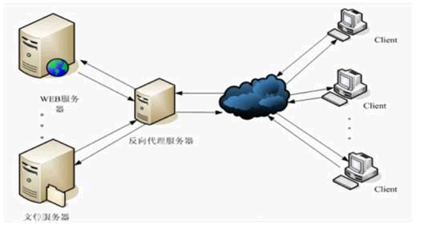
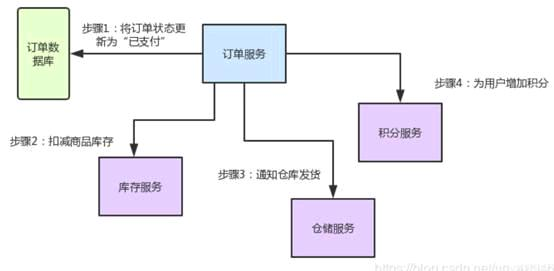
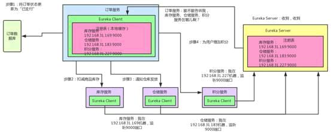
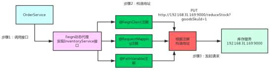
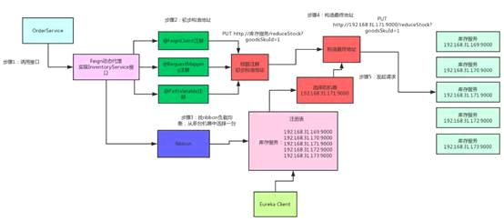
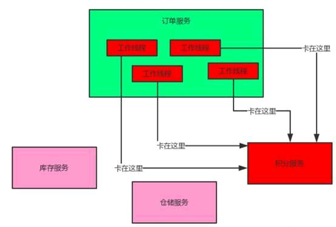
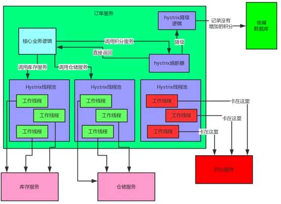
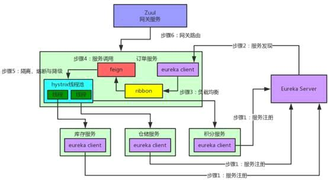

spring cloud 的几大组件

<!-- more -->

## spring cloud 的几大组件

|组件|名称|
| ----- | ----- |
| 分布式系统套件版本| Spring Cloud + Alibaba|
| 服务注册与发现| Eureka / Consul / Nacos|
| 配置中心| Config / Nacos|
| 网关路由| Gateway / Zull (动态网关)|
| 服务调用| OpenFeign（推荐） / RestTemplate（使用繁琐、冗余，不推荐）|
| 负载均衡| LoadBalancer / Ribbon / Nginx|
| 流量控制| Sentinel / Hystrix (限流、熔断降级、负载保护)|
| 分布式事务 | Seata / TX-LCN  (可选组件)|
| 链路追踪 | Sleuth + Zipkin (可选组件)|
| 工作流引擎框架 | Flowable (可选组件)|
| 分布式定时任务 | xxl-job (可选组件)|

## Spring cloud 基础流程

Eureka

**作用**：服务注册中心，服务发现与注册

**原理**：通过心跳检测、健康检查和客户端缓存等机制

**高可用说明**：eureka可以把自己设置为一个应用程序到自己和其他节点相互注册，这样当一个节点挂掉后，另一个eureka节点就会代替该节点。

**注意**：注册eureka，要同时写多个地址。因为防止eureka挂掉，然后serviceA挂掉，然后serviceA重启，这时候其他服务就访问不到。

---

Zuul网关（负载均衡功能）

将服务保留的rest进行代理和网关控制，除了平常经常使用的node.js、nginx外，Spring Cloud系列的zuul和rebbion，可以帮我们进行正常的网关管控和负载均衡。

Zuul过滤器

四种过滤器类型

> （1） PRE：过滤器在请求被路由之前调用，可以利用这种过滤器实现身份验证、在集群中选择请求的微服务、记录调试信息等。
>
> （2） ROUTING：过滤器请求理由到微服务。可以用于构建发送给微服务的请求，并使用Apache HttpClient或Netfilx Ribbon请求微服务
>
> （3） POST：过滤器到微服务后执行。可用来为响应添加标准的HTTP Header、收集统计信息和指标、将响应从微服务发送给客户端等。
>
> （4） ERROR：在其他阶段发生错误时执行该过滤器。

---

Feign：相当于一个HttpClient的东西，会保持长连接和监控线程池。它可以默认自己包下的Retryer进行重试配置，默认为5次

---

Ribbion：相当于是从eureka中获取所有的微服务列表，然后从例如A服务有两个节点，会根据算法选择一个让Feign进行调用。

---

Nginx实现反向代理和负载均衡

> **正向代理**：客户机指定代理服务器，将本要直接发送到Web服务器上的Http请求发送到代理服务器中由代理服务器向internet上的web服务器发送请求，达到客户机上网的目的。
>
> **反向代理**：指以代理服务器接受internet上的连接请求，然后将请求转发给内部网上的服务器，并将从服务器上得到的结果返回给internet上请求连接的客户端，此时代理服务器对外就表现为一个代理服务器。如图所示：

Nginx只做请求的转发，后台有多个http服务器提供服务，nginx的功能就是把请求转发给后面的服务器，决定把请求转发给谁。

---

## SpringCloud底层服务之间怎么相互调用

核心组件：Eureka、Ribbon、Feign、Hystrix、Zuul

从业务场景入手：开发个电商网站，需要实现支付订单的功能。流程如下：

² 创建一个订单后，如果用户立刻支付这个订单，我们需要将订单状态更新为“已支付”

² 扣减相应的商品库存

² 通知仓储中心，进行发货

² 给用户的这次购物增加相应的积分

以上流程，我们需要有订单服务、库存服务、仓储服务、积分服务。

## 一、Eureka、nacos

订单服务想要调用库存服务、仓储服务或者积分服务怎么调用？

每个服务中都有一个Eureka Client组件，这个组件专门负责将这个服务的信息注册到Eureka Server中，自己在哪台机器上，监听哪个端口。Eureka
Server是一个注册中心，里面有一个注册表，保存了各服务所在的机器和端口号。

订单服务中有一个Eureka Client组件，这个会找Server问一下：库存服务在哪台机器？监听着哪个端口，然后把相关信息从注册表中拉取到本地缓存起来。

这时，想要进行服务之间的调用，只需要找自己本地的Eureka Client问一下在哪台机器？哪个端口？收到响应后，紧接着就可以发送一个请求过去，调用接口！

总结：

​ Eureka Client：负责将这个服务的信息注册到Eureka Server中。

​ Eureka Server：注册中心，里面有一个注册表，保存了各个服务所在的机器和端口号

## 二、OpenFeign

知道端口号后，**难道订单服务要自己写一堆代码，跟其他服务建立网络连接，然后构造一个复杂的请求，接着发送请求过去，最后对返回的响应结果再写一大堆代码来处理？**

J Feign是一个关键机制使用了动态代理。

J 首先，如果你对某个接口定义了@FeignClient注解，Feign就会针对这个接口创建一个动态代理

J 接着你要调用哪个接口，本质就是会调用Feign创建的动态代理，这个就是核心

J Feign的动态代理会根据你在接口上的@RequestMapping等注解，来动态构造出你要请求的服务地址

J 最后根据这个地址，发起请求、解析响应

## 三、Ribbon、Nginx

如果库存服务上部署在了5台机器上，Feign怎么请求哪台机器？

Ribbon的负载均衡默认使用的最经典的Round Robin轮询算法，简单说就是订单服务对库存服务发起10次请求，那就让你请求第1台机器、然后是第2台机器、第3台机器、第4台机器，第5台机器，接着又继续循环。

J 首先Ribbon会从Eureka Client里获取到对应的服务注册表，也就知道所有的服务都部署在哪些机器上，在监听哪些端口号。

J 然后Ribbon就可以使用默认的Round Robin算法，从中选择一台机器

J Feign就会针对这台机器，构造并发起请求。

## 四、Hystrix

订单服务在一个业务流程里需要调用三个服务。现在假设订单服务自己最多只有100个线程可以处理请求，然后，积分服务挂掉了，每次订单服务调用积分服务时候，都会卡住几秒钟，然后抛出一个超时异常。

如果系统处于高并发的场景下，大量请求涌过来的时候，订单服务的100个线程就会卡在请求积分服务这一块，导致订单服务没有一个线程可以处理请求。

然后就会导致别人请求订单服务的时候，发现订单服务也挂了，不响应任何请求

这就是微服务了中的服务雪崩问题

Hystrix是隔离、熔断以及降级的一个框架。即Hystrix会搞很多个小小的线程池，比如订单服务请求库存服务是一个线程池，请求积分服务又是一个线程池。每个线程池仅仅用于请求那个服务。

熔断：比如在5分钟内请求积分服务直接就返回了，不要去走网络卡几秒钟，这个过程就是熔断。

降级：每次调用积分服务，就在数据库中记录一条消息，说给某某用户增加多少积分，因为积分服务挂掉，所以增加不成功，等积分服务恢复了，你可以根据这些记录手工加以下积分。

## 五、Zuul、Gateway

微服务网关，这个是负责网络路由的。

假设你后台部署了几百个服务，现在有个前端的小姐姐，人家请求是直接从浏览器哪儿发过来的。 人家要请求库存服务，你难道还要让人家记着这服务的名字叫做xxxxxx？部署在5台机器上，你后台可是有几百个服务的名称和地址？难道都需要一个一个记着？

所有的请求都可以走网关，网关还有许多好处：统一的降级、限流、认证授权、安全、等等。

## 总结

**Eureka、Nacos**：（注册中心）各个服务启动时，Eureka Client都会将服务注册到Eureka Server，并且Eureka Client还可以反过来从Eureka Server拉取注册表，从而知道其他服务在哪里

**Ribbon、nginx**：服务间发起请求的时候，基于Ribbon做负载均衡，从一个服务的多台机器中选择一台

**Feign**：基于Feign的动态代理机制，根据注解和选择的机器，拼接请求URL地址，发起请求

**Hystrix**：发起请求是通过Hystrix的线程池来走的，不同的服务走不同的线程池，实现了不同服务调用的隔离，避免了服务雪崩的问题

**Zuul、Gateway**：如果前端、移动端要调用后端系统，统一从Zuul网关进入，由Zuul网关转发请求给对应的服务

