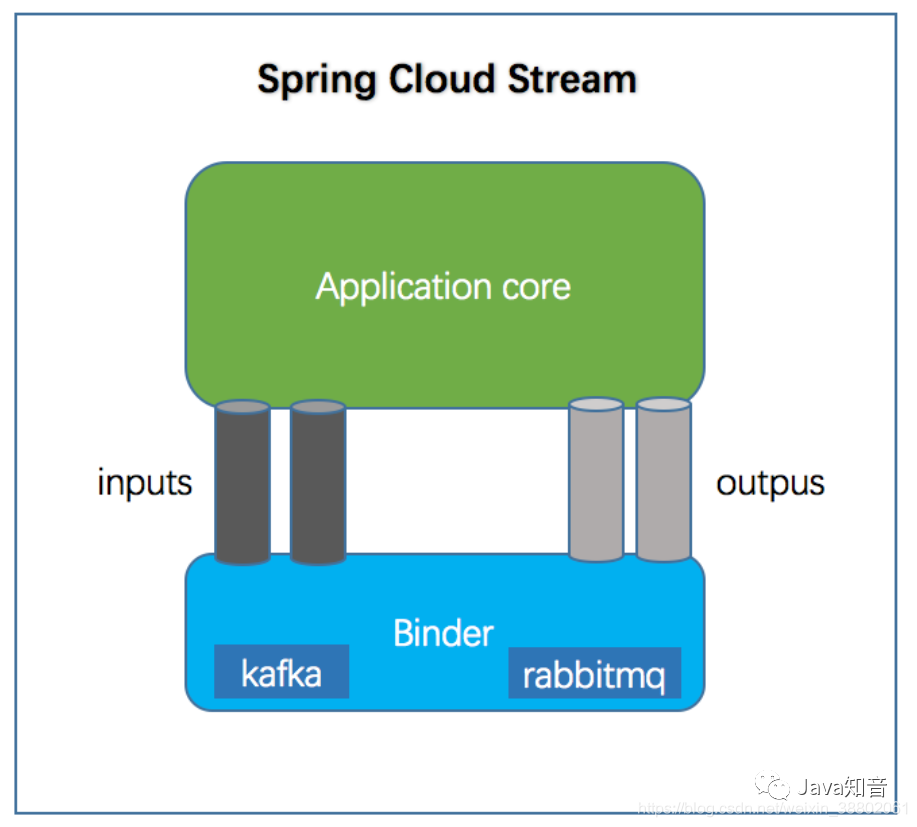

无论在什么系统中，日志管理模块都属于十分重要的部分，接下来会通过注解+AOP+MQ的方式实现一个简易的日志管理系统

<!-- more -->

## 思路

- *注解*：标记需要记录日志的方法

- *AOP*：通过AOP增强代码，利用后置/异常通知的方式获取相关日志信息，最后使用MQ将日志信息发送到专门处理日志的系统

- *RabbitMQ*：利用解耦、异步的特性，协调完成各个微服务系统之间的通信


## 工作流程

> `注解标记`--->`AOP拦截`--->`日志发送到MQ`--->`专门处理日志的系统监听MQ消息` --->`日志插入到数据库`


## 日志表结构

### 表结构（sys_log）

```
CREATE TABLE `sys_log` (
  `id` int(11) NOT NULL AUTO_INCREMENT COMMENT '唯一ID',
  `opt_id` int(11) DEFAULT NULL COMMENT '操作用户id',
  `opt_name` varchar(50) DEFAULT NULL COMMENT '操作用户名',
  `log_type` varchar(20) DEFAULT NULL COMMENT '日志类型',
  `log_message` varchar(255) DEFAULT NULL COMMENT '日志信息（具体方法名）',
  `create_time` datetime DEFAULT NULL COMMENT '创建时间',
  PRIMARY KEY (`id`)
) ENGINE=InnoDB AUTO_INCREMENT=17 DEFAULT CHARSET=utf8 COMMENT='系统日志表';
```

### 实体类（SysLog）

```java
@Data
public class SysLog  {
 
    private static final long serialVersionUID = 1L;
 
    /**
     * 唯一ID
     */
    @TableId(value = "id", type = IdType.AUTO)
    private Integer id;
    /**
     * 操作用户id
     */
    private Integer optId;
    /**
     * 操作用户名
     */
    private String optName;
    /**
     * 日志类型
     */
    private String logType;
    /**
     * 日志信息（具体方法名）
     */
    private String logMessage;
    /**
     * 创建时间
     */
    private Date createTime;
 
}
```


## 注解

### 注解（SystemLog）

仅作为标记的作用，目的让JVM可以识别，然后可以从中获取相关信息

- **@Target**： 定义注解作用的范围，这里是方法

- **@Retention**： 定义注解生命周期，这里是运行时

```java
@Target(ElementType.METHOD)
@Retention(RetentionPolicy.RUNTIME)
public @interface SystemLog {
 
    SystemLogEnum type();
 
}
```

### 枚举（SystemLogEnum）

限定日志类型范围

```java
public enum SystemLogEnum {
 
    SAVE_LOG("保存"),
    DELETE_LOG("删除"),
    REGISTER_LOG("注册"),
    LOGIN_LOG("登录"),
    LAUD_LOG("点赞"),
    COLLECT_LOG("收藏"),
    THROW_LOG("异常"),
    ;
    private String type;
 
    SystemLogEnum(String type) {
        this.type = type;
    }
 
    public String getType() {
        return type;
    }
}
```


## AOP切面

### AOP（SysLogAspect）

实现代码的增强，主要通过动态代理方式实现的代码增强。拦截注解，并获取拦截到的相关信息，封装成日志对象发送到MQ队列（生产端）

```java
Component
@Aspect
@Slf4j
public class SysLogAspect {
 
    @Autowired
    MqStream stream;
 
    //切点
    @Pointcut("@annotation(cn.zdxh.commons.utils.SystemLog)")
    public void logPointcut(){}
 
    //后置通知
    @After("logPointcut()")
    public void afterLog(JoinPoint joinPoint) {
        //一般日志
        SysLog sysLog = wrapSysLog(joinPoint);
 
        log.info("Log值：{}", sysLog);
 
        //发送mq消息
        stream.logOutput().send(MessageBuilder.withPayload(sysLog).build());
 
    }
 
    //异常通知
    @AfterThrowing(value = "logPointcut()", throwing = "e")
    public void throwingLog(JoinPoint joinPoint, Exception e) {
        //异常日志
        SysLog sysLog = wrapSysLog(joinPoint);
        sysLog.setLogType(SystemLogEnum.THROW_LOG.getType());
        sysLog.setLogMessage(sysLog.getLogMessage()+"==="+e);
 
        log.info("异常Log值：{}", sysLog);
 
        //发送mq消息
        stream.logOutput().send(MessageBuilder.withPayload(sysLog).build());
    }
 
    /**
     * 封装SysLog对象
     * @param joinPoint
     * @return
     */
    public SysLog wrapSysLog(JoinPoint joinPoint){
        //获取请求响应对象
        ServletRequestAttributes attributes = (ServletRequestAttributes) RequestContextHolder.getRequestAttributes();
        HttpServletRequest request = attributes.getRequest();
        MethodSignature signature = (MethodSignature)joinPoint.getSignature();
        SysLog sysLog = new SysLog();
 
        //获取方法全路径
        String methodName = signature.getDeclaringTypeName()+"."+signature.getName();
        //获取注解参数值
        SystemLog systemLog = signature.getMethod().getAnnotation(SystemLog.class);
        //从header取出token
        String token = request.getHeader("token");
        if (!StringUtils.isEmpty(token)) {
            //操作人信息
            Integer userId = JwtUtils.getUserId(token);
            String username = JwtUtils.getUsername(token);
            sysLog.setOptId(userId);
            sysLog.setOptName(username);
        }
        if (!StringUtils.isEmpty(systemLog.type())){
            sysLog.setLogType(systemLog.type().getType());
        }
        sysLog.setLogMessage(methodName);
        sysLog.setCreateTime(new Date());
        return sysLog;
    }
 
}
```


## RabbitMQ消息队列

### MQ

这里主要是通过 `Spring Cloud Stream` 集成的 RabbitMQ

### Spring Cloud Stream

作为MQ的抽象层，已屏蔽各种MQ的各自名词，统称为`input、output`两大块。可以更方便灵活地切换各种MQ，如 `kafka、RocketMQ` 等




**（1）定义Input/Ouput接口（MqStream）**

```java
@Component
public interface MqStream {
 
    String LOG_INPUT = "log_input";
 
    String LOG_OUTPUT = "log_output";
  
    @Input(LOG_INPUT)
    SubscribableChannel logInput();
 
    @Output(LOG_OUTPUT)
    MessageChannel logOutput();
 
}
```


**（2）MQ生产者**

> 注：这里使用到AOP切面的微服务，都属于MQ生产者服务

*引入依赖*：这里没有版本号的原因是spring cloud已经帮我们管理好各个版本号，已无需手动定义版本号

```yml
<!--Spring Cloud Stream-->
<dependency>
    <groupId>org.springframework.cloud</groupId>
     <artifactId>spring-cloud-stream</artifactId>
</dependency>
<dependency>
    <groupId>org.springframework.cloud</groupId>
    <artifactId>spring-cloud-stream-binder-rabbit</artifactId>
</dependency>
```

在程序入口开启MQ的Input/Output绑定：

```java
@SpringBootApplication(scanBasePackages = {"cn.zdxh.user","cn.zdxh.commons"})
@EnableEurekaClient
@MapperScan("cn.zdxh.user.mapper")
@EnableBinding(MqStream.class) //开启绑定
@EnableFeignClients 
public class YouquServiceProviderUserApplication {
 
    public static void main(String[] args) {
        SpringApplication.run(YouquServiceProviderUserApplication.class, args);
    }
 
}
```

*yml配置*

在生产者端设置output

- **destination**： 相当于rabbitmq的exchange
- **group**： 相当于rabbitmq的queue，不过是和destination一起组合成的queue名
- **binder**： 需要绑定的MQ

*Spring Cloud Stream相关配置*

```
spring:
  cloud:
    stream:
      bindings: # exchange与queue绑定
        log_output: # 日志生产者设置output
          destination: log.exchange
          content-type: application/json
          group: log.queue
          binder: youqu_rabbit #自定义名称
      binders:
        youqu_rabbit:  #自定义名称
          type: rabbit
          environment:
            spring:
              rabbitmq:
                host: localhost
                port: 5672
                username: guest
                password: 25802580
```

> 注：完成以上操作，即完成MQ生产端的所有工作


**（3）MQ消费者**

引入依赖、开启Input/Output绑定：均和生产者的设置一致

*yml配置*

在生产者端设置input

```yml
spring:
  cloud:
    stream:
      bindings: # exchange与queue绑定
        log_input: # 日志消费者设置input
          destination: log.exchange
          content-type: application/json
          group: log.queue
          binder: youqu_rabbit
      binders:
        youqu_rabbit:
          type: rabbit
          environment:
            spring:
              rabbitmq:
                host: localhost
                port: 5672
                username: guest
                password: 25802580
```

### 消费者监听（LogMqListener）

监听生产者发过来的日志信息，将信息添加到数据库即可

```java
@Service
@Slf4j
public class LogMqListener {
 
    @Autowired
    SysLogService sysLogService;
 
    @StreamListener(MqStream.LOG_INPUT)
    public void input(SysLog sysLog)  {
        log.info("开始记录日志========================");
 
        sysLogService.save(sysLog);
 
        log.info("结束记录日志========================");
 
    }
}
```

> 注：完成以上操作，即完成MQ消费端的所有工作


## 应用

简述：

只需将 `@SystemLog(type = SystemLogEnum.REGISTER_LOG)` ，标记在需要记录的方法上，当有客户端访问该方法时，就可以自动完成日志的记录


