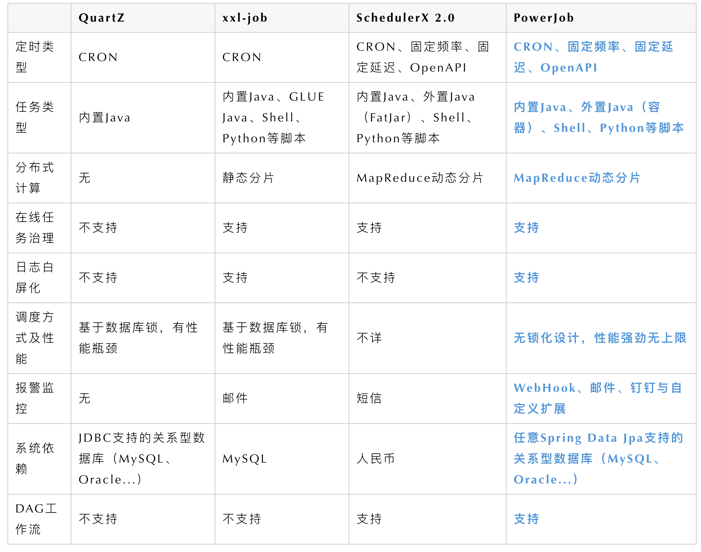

创建的几种定时任务组件（Quartz、xxl-job、PowerJob、SchudulerX 2.0）

<!-- more -->



## 常用的表达式

[CRON表达式在线验证网址](http://cron.qqe2.com/)

[秒 分钟 小时 天 月 星期 年]

```text
秒（0~59，不能超过59，若取值为60的话，也会提示表达式不合格）
分钟（0~59）
小时（0~23）
天（1~31）
月（0~11）
星期（1~7 1=SUN 或 SUN，MON，TUE，WED，THU，FRI，SAT）
年份（1970－2199）
```

- `*` 字符代表所有可能的值 (符号`*`在`/`前面（如：`*/10`）等价于0在`/`前面（如：`0/10`）)
- `/` 字符用来指定数值的增量

>例如：
>
>在子表达式（分钟）里的`0/15`表示从第0分钟开始，每15分钟
>
>在子表达式（分钟）里的`3/20`表示从第3分钟开始，每20分钟（它和`3，23，43`）的含义一样

- `?` 字符仅被用于天（月）和天（星期）两个子表达式，表示不指定值（每月的某一天，或第周的某一天）

>注： 当2个子表达式其中之一被指定了值以后，为了避免冲突，需要将另一个子表达式的值设为`?`

- `L` 字符仅被用于天（月）和天（星期）两个子表达式，它是单词“last”的缩写，表示最后的，用在日期上表示每月最后几天，用在星期上表示每月最后一周的周几

>注： 如果在“L”前有具体的内容，它就具有其他的含义了。例如：“6L”用在日期元素上，表示这个月的倒数第６天
>
>注意：在使用“L”参数时，不要指定列表或范围，因为这会导致问题

- `W`字符代表着工作日(Mon-Fri / 周一 ~ 周五)，并且仅能用于日域中。它用来指定离指定日的最近的一个工作日。

>例如：
>
>日域中的 15W 意味着 "离该月15号的最近一个工作日。" 假如15号是星期六，那么 trigger 会在14号(星期五)触发，因为星期四比星期一离15号更近。如果15号是周日，则任务会在周一也就是16号触发。
>如果 是在日期域填写 `1W` 即使1号是周六，那么任务也只会在下周一，也就是3号触发，“W”字符指定的最近工作日是不能够跨月份的。字符“W”只能配合一个 单独的数值使用，不能够是一个数字段，如：1-15W是错误的。

- `L` 和`W`可以在日期域中联合使用，LW表示这个月最后一周的工作日。
- `#` 只允许在 星期域 中出现。这个字符用于指定本月的某某天。(格式： 星期中天数的编号1-7/月中的第几周1-5) 例如：“6#3”表示本月第三周的星期五（6表示星期五，3表示第三周）。“2#1”表示本月第一周的星期一。“4#5”表示第五周的星期三。
- `C`：代表“Calendar”的意思。它的意思是计划所关联的日期，如果日期没有被关联，则相当于日历中所有日期。例如: 5C在日期字段中就相当于日历5日以后的第一天。1C在星期字段中相当于星期日后的第一天。 （暂不理解）


|字段 |允许值 |允许的特殊字符| 特殊字符说明|
|----|----|----|----|
|秒 |0-59 |, - * / |" , " (逗号)：用来指定元素中的一个列表|
|分 |0-59|, - * / |" - ” 字符被用来指定一个范围(连续区间)|
|小时 |0-23 |, - * / |" / " 字符用于指定增量|
|日期(天)|1-31 |, - * ? / L W C |" * " 字符代表所有可能的值|
|月份 |1-12 或者 JAN-DEC |, - * / |L W C 参考上面解释|
|星期 |1-7 或者 SUN-SAT |, - * ? / L C #| |
|年（可选） |留空, 1970-2199 |, - * /|      |


- 0）`0/2 * * * * ?` 表示每2秒 执行任务
- 0）`0 0/2 * * * ?` 表示每2分钟 执行任务
- 1）`0 0 2 1 * ?` 表示在每月的1日的凌晨2点调整任务
- 2）`0 15 10 ? * MON-FRI` 表示周一到周五每天上午10:15执行作业
- 3）`0 15 10 ? 6L 2002-2006` 表示2002-2006年的每个月的最后一个星期五上午10:15执行作
- 4）`0 0 10,14,16 * * ?` 每天上午10点，下午2点，4点
- 5）`0 0/30 9-17 * * ?` 朝九晚五工作时间内每半小时
- 6）`0 0 12 ? * WED` 表示每个星期三中午12点
- 7）`0 0 12 * * ?` 每天中午12点触发
- 8）`0 15 10 ? * *` 每天上午10:15触发
- 9）`0 15 10 * * ?` 每天上午10:15触发
- 10）`0 15 10 * * ?` 每天上午10:15触发
- 11）`0 15 10 * * ? 2005` 2005年的每天上午10:15触发
- 12）`0 * 14 * * ?` 在每天下午2点到下午2:59期间的每1分钟触发
- 13）`0 0/5 14 * * ?` 在每天下午2点到下午2:55期间的每5分钟触发
- 14）`0 0/5 14,18 * * ?` 在每天下午2点到2:55期间和下午6点到6:55期间的每5分钟触发
- 15）`0 0-5 14 * * ?` 在每天下午2点到下午2:05期间的每1分钟触发
- 16）`0 10,44 14 ? 3 WED` 每年三月的星期三的下午2:10和2:44触发
- 17）`0 15 10 ? * MON-FRI` 周一至周五的上午10:15触发
- 18）`0 15 10 15 * ?` 每月15日上午10:15触发
- 19）`0 15 10 L * ?` 每月最后一日的上午10:15触发
- 20）`0 15 10 ? * 6L` 每月的最后一个星期五上午10:15触发
- 21）`0 15 10 ? * 6L 2002-2005` 2002年至2005年的每月的最后一个星期五上午10:15触发
- 22）`0 15 10 ? * 6#3` 每月的第三个星期五上午10:15触发
