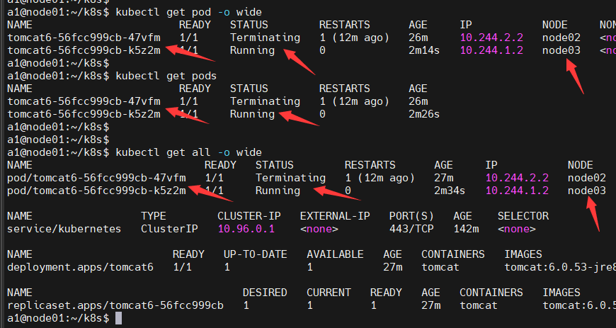

k8s入门体验：kubectl命令使用、yaml文件配置、Deployment与service概念

<!-- more -->


## k8s入门篇

后期yaml文件参考可直接到这里开始复习吧：[使用[apps+暴露Service port]的yaml格式](#_2、使用apps-暴露service-port的yaml格式)

**资源包括(不区分大小写)：pod（po），service（svc），replication controller（rc），deployment（deploy），replica set（rs）**

具体命令请看：[k8s-alias](./setting-alias.md)

### kubectl get po

```bash
[root@master-120 ~]# kubectl get po
NAME                      READY   STATUS    RESTARTS      AGE
nginx-689b55fcd-2c8v8     1/1     Running   1 (19h ago)   19h
nginx-689b55fcd-5qpkp     1/1     Running   1 (19h ago)   19h
nginx-689b55fcd-gpdqz     1/1     Running   1 (19h ago)   19h
tomcat-549f8d66bc-bln66   1/1     Running   1 (19h ago)   19h
tomcat-549f8d66bc-rqhvm   1/1     Running   1 (19h ago)   19h
tomcat-549f8d66bc-zkc94   1/1     Running   1 (19h ago)   19h
```

### kubectl get svc

```bash
[root@master-120 ~]# kubectl get svc
NAME         TYPE        CLUSTER-IP     EXTERNAL-IP   PORT(S)    AGE
kubernetes   ClusterIP   10.96.0.1      <none>        443/TCP    29h
nginx        ClusterIP   10.96.99.230   <none>        8000/TCP   19h
tomcat       ClusterIP   10.96.102.96   <none>        8001/TCP   19h
```

### kubectl get rc

```bash
No resources found in default namespace.
```

### kubectl get deploy

```bash
[root@master-120 ~]# kubectl get deploy
NAME     READY   UP-TO-DATE   AVAILABLE   AGE
nginx    3/3     3            3           19h
tomcat   3/3     3            3           19h
```

### kubectl get rs

```bash
[root@master-120 ~]# kubectl get rs
NAME                DESIRED   CURRENT   READY   AGE
nginx-689b55fcd     3         3         3       19h
tomcat-549f8d66bc   3         3         3       19h
```

### A、基本命令

#### 1、创建apps：create deployment

master安装tomcat

```shell
kubectl create deployment tomcat6 --image=tomcat:6.0.53-jre8
```

#### 2、查看 kg all

```shell
a1@node01:~/k8s$ kubectl get all
NAME                           READY   STATUS              RESTARTS     AGE
pod/tomcat6-56fcc999cb-47vfm   0/1     ContainerCreating      0         23s
NAME                 TYPE        CLUSTER-IP   EXTERNAL-IP   PORT(S)      AGE
service/kubernetes   ClusterIP   10.96.0.1    <none>        443/TCP     115m
NAME                      READY   UP-TO-DATE   AVAILABLE        AGE
deployment.apps/tomcat6   0/1       1             0               23s
NAME                                 DESIRED   CURRENT   READY     AGE
replicaset.apps/tomcat6-56fcc999cb   1         1         0         23s
```

#### 3、查看详细 kg all -o wide

tomcat6在节点node2---docker下载镜像ok


在node2查看


#### 4、查看 kg pod -o wide


##### node02模拟宕机，看看k8s怎么处理（dkstop与node02关机）


发现node2节点已经不行了，全部压力到了node3




##### 重启 node02


#### 5、暴露port：expose

> expose (-f FILENAME | TYPE NAME) [--port=port] [--protocol=TCP|UDP] [--target-port=number-or-name] [--name=name] [--external-ip=external-ip-of-service] [--type=type]

```shell
kubectl expose rc nginx --port=80 --target-port=8080
kubectl expose deploy tomcat6 --port=80 --target-port=8080 --type=NodePort
```


<http://192.168.100.131:31002/>

#### 6、修改port：edit

修改app应用服务的port：`kubectl edit svc tomcat6`

修改app应用：`kubectl edit deploy tomcat6`

#### 7、扩容或缩容：scale

> scale [--resource-version=version] [--current-replicas=count] --replicas=COUNT (-f FILENAME | TYPE NAME)

将名为tomcat6中的pod副本数设置为3。

```shell
kubectl scale --replicas=3 deployment tomcat6
kg pods -o wide
```


如果当前副本数为2，则将其扩展至3。

```shell
kubectl scale --current-replicas=2 --replicas=3 deployment/tomcat6
```

#### 8、删除以 create deployment 部署的(apps、service) delete

```shell
kubectl  get all
kubectl delete deployment.apps/tomcat6
kubectl delete service/tomcat6
```


#### 9、部署&删除以 yaml 部署的实例

[查看 xxx.yaml](#xxx-yaml)

```shell
kubectl apply -f xxx.yaml

kubectl delete -f xxx.yaml
```


### B、yaml & 基本使用

<https://kubernetes.io/zh/docs/reference/kubectl/overview/>

后期使用：[使用[apps+暴露Service port]的yaml格式](#_2、使用apps-暴露service-port的yaml格式)，而不是使用 [初级使用yaml创建apps](#_1、初级使用yaml创建apps)

#### Pod 模版

一般不会自己创建

```yaml
apiVersion: v1
kind: Pod
metadata:
  labels:
    app: tomcat9-02
  name: tomcat9-02
  namespace: default
spec:
  containers:
  - image: tomcat:6.0.53-jre8
    imagePullPolicy: IfNotPresent
    name: tomcat9-02
  - image: nginx
    imagePullPolicy: IfNotPresent
    name: nginx
```

#### Deployment 模版

```yaml
apiVersion: apps/v1
kind: Deployment
metadata:
  labels:
    app: tomcat601
  name: tomcat601-deployment
spec:
  #replicas复制几份
  replicas: 2 
  selector:
    matchLabels:
      app: tomcat601
  template:
    #Pod模板
    metadata:
      labels:
        app: tomcat601
    spec:
      containers:
      - image: tomcat:6.0.53-jre8
        name: tomcat601
        imagePullPolicy: IfNotPresent
```

```yaml
apiVersion: apps/v1
kind: Deployment
metadata:
  name: nginx-deployment
  labels:
    app: nginx
spec:
  replicas: 3
  selector:
    matchLabels:
      app: nginx
  template:
  #Pod模板
    metadata:
      labels:
        app: nginx
  #Pod模板规约：spec-指示 Pods 运行一个 nginx 容器
    spec:
      containers:
      - name: nginx
        image: nginx:1.14.2
        imagePullPolicy: IfNotPresent
        ports:
        - containerPort: 80
```

#### Service 模版

```yaml
apiVersion: v1
kind: Service
metadata:
  labels:
    app: tomcat601
  name: tomcat601-xxx-jp3sk
  namespace: default
spec:
  ports:
  #- NodePort: 30965
  - port: 80
    protocol: TCP
    targetPort: 8080
  selector:
    app: tomcat601
  type: NodePort
```

#### 1、初级使用yaml创建apps

**后期不推荐使用这种方式**

```shell
# 使用 example-service.yaml 中的定义创建服务。
kubectl apply -f example-service.yaml

# 使用 example-controller.yaml 中的定义创建 replication controller。
kubectl apply -f example-controller.yaml

# 使用 <directory> 路径下的任意 .yaml, .yml, 或 .json 文件 创建对象。
kubectl apply -f <directory>
```

查看并保存 Deployment 的 yaml 文件（--dry-run）

> --dry-run：仅查看不运行
>
> kubectl create deployment [服务名称]--image=[镜像名称] --dry-run -o yaml > [保存目标]
>
> kubectl create deployment tomcat6 --image=tomcat:6.0.53-jre8 --dry-run -o yaml > tomcat6.yaml

```yaml
apiVersion: apps/v1
kind: Deployment
metadata:
  labels:
    app: tomcat6
  name: tomcat6
spec:
  replicas: 2
  selector:
    matchLabels:
      app: tomcat6
  template:
    metadata:
      labels:
        app: tomcat6
    spec:
      containers:
      - image: tomcat:6.0.53-jre8
        name: tomcat
```

创建 Deployment apps：`kubectl apply -f tomcat6.yaml`

查看deployments信息：`kubectl get deployments`

更新 Deployment

```shell
kubectl set image deployment.v1.apps/tomcat6 tomcat=tomcat:9.0.53-jre8
或
kubectl set image deployment/tomcat6 tomcat=tomcat:9.0.53-jre8
```

回滚 Deployment

```shell
kubectl set image deployment/tomcat6 tomcat=tomcat:9.0.53-jre8 --record=true
```

暴露 service 端口：`kubectl expose deploy tomcat6 --port=80 --target-port=8080 --type=NodePort`

查看 Pod（`kg all` ，`kg pods -o wide`，`kg pod xx -o yaml`）


```yaml
apiVersion: v1
kind: Pod
metadata:
  labels:
    app: tomcat6
    pod-template-hash: 56fcc999cb
  name: tomcat6-56fcc999cb-nm2nx
  namespace: default
  ownerReferences:
  - apiVersion: apps/v1
    blockOwnerDeletion: true
    controller: true
    kind: ReplicaSet
    name: tomcat6-56fcc999cb
    uid: 28633fd6-b3ee-45aa-93d5-fb8931735029
  resourceVersion: "47929"
  uid: 59333abe-6a24-4995-888b-88577fef9559
spec:
  containers:
  - image: tomcat:6.0.53-jre8
    imagePullPolicy: IfNotPresent
    name: tomcat
... ...
```

自己创建 pod（yaml）文件，Pod 通常不是直接创建的，而是使用工作负载资源创建的。

```yaml
apiVersion: v1
kind: Pod
metadata:
  labels:
   #实例名称
    app: tomcat601
  #容器名称  
  name:  tomcat6-xxx-wzfj2
  #命名空间
  namespace: default
spec:
  #容器
  containers:
  - image: tomcat:6.0.53-jre8
    imagePullPolicy: IfNotPresent
    name: tomcat601
  - image: nginx
    imagePullPolicy: IfNotPresent
    name: nginx
```

创建Pod实例：`kubectl apply -f myPod.yaml`

查看 Service（`kg svc tomcat6 -o yaml`）

```yaml
apiVersion: v1
kind: Service
metadata:
  creationTimestamp: "2021-12-08T13:41:18Z"
  labels:
    app: tomcat6
  name: tomcat6
  namespace: default
  resourceVersion: "48461"
  uid: b4ebfb65-4e0c-478a-8e85-f03acef2d166
spec:
  clusterIP: 10.96.126.87
  clusterIPs:
  - 10.96.126.87
  externalTrafficPolicy: Cluster
  internalTrafficPolicy: Cluster
  ipFamilies:
  - IPv4
  ipFamilyPolicy: SingleStack
  ports:
  - nodePort: 31005 #暴露给外部使用port
    port: 80
    protocol: TCP
    targetPort: 8080
  selector:
    app: tomcat6
  sessionAffinity: None
  type: NodePort
status:
  loadBalancer: {}
```

查看 Deployment-apps（`kg deploy tomcat6 -o yaml`）

```yaml
apiVersion: apps/v1
kind: Deployment
metadata:
  labels:
    app: tomcat6
  name: tomcat6
  namespace: default
  ...
spec:
  replicas: 2
  selector:
    matchLabels:
      app: tomcat6
  template:
    metadata:
      labels:
        app: tomcat6
    spec:
      containers:
      - image: tomcat:6.0.53-jre8
        imagePullPolicy: IfNotPresent
        name: tomcat
        terminationMessagePath: /dev/termination-log
        terminationMessagePolicy: File
   ....
status:
    ...
```

查看 Deployment 上线状态：`kubectl rollout status deployment/nginx-deployment`

校验：<http://192.168.100.130:80/>


#### 2、使用apps+暴露Service-port的yaml格式


**安装Deployment（apps）与暴露Service（expose-port）在同一个yaml文件里设置，通过`---`分隔**

##### xxx.yaml

::: details 点击查看代码

```yaml
apiVersion: apps/v1
kind: Deployment
metadata:
  labels:
    app: tomcat
  name: tomcat
spec:
  replicas: 3
  selector:
    matchLabels:
      app: tomcat
  template:
    metadata:
      labels:
        app: tomcat
    spec:
      containers:
      - name: tomcat
        image: registry.cn-chengdu.aliyuncs.com/k8sjf/tomcat:9.0.62-jre11-temurin-focal
        ports:
        - containerPort: 8080
        imagePullPolicy: IfNotPresent
---
apiVersion: v1
kind: Service
metadata:
  labels:
    app: tomcat
  name: tomcat
  namespace: default
spec:
  ports:
  - port: 80
    protocol: TCP
    targetPort: 8080
  selector:
    app: tomcat
  type: NodePort
```

:::


### C、Deployment & service 概念


#### pod&service


将一组pod公开为网络服务，通过service代理，可以实现负载均衡


#### ClusterIP

此方式只能在集群内访问

#### label&selector


通讯1


通讯2


#### 说明

> 一个集群或多台mster、node，一个节点node，里面有多个Pod，一个Pod里可能有多个服务，各个Pod通过service暴露port给其他Pod、node之间是互通，通过controller来管理使用Pod资源。

pod容器组有IP地址，而pod里的容器服务有port端口。

简单流程：node -> pod ->  service -> controller
