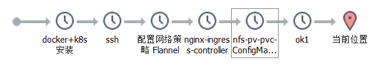
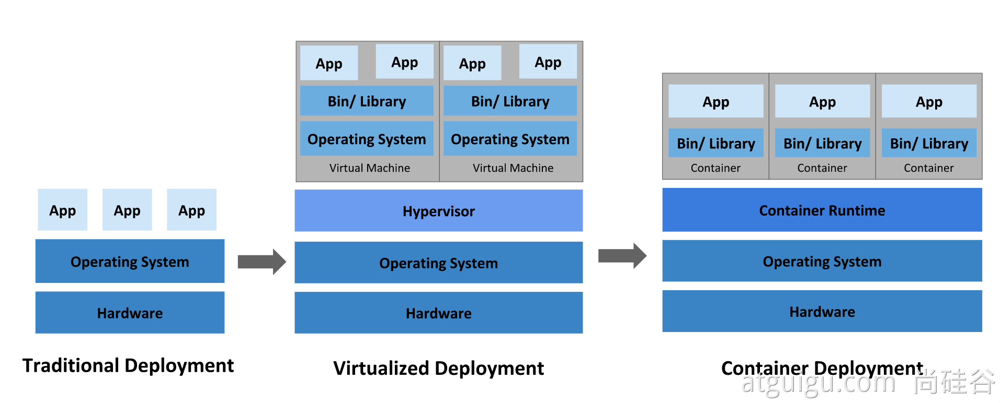
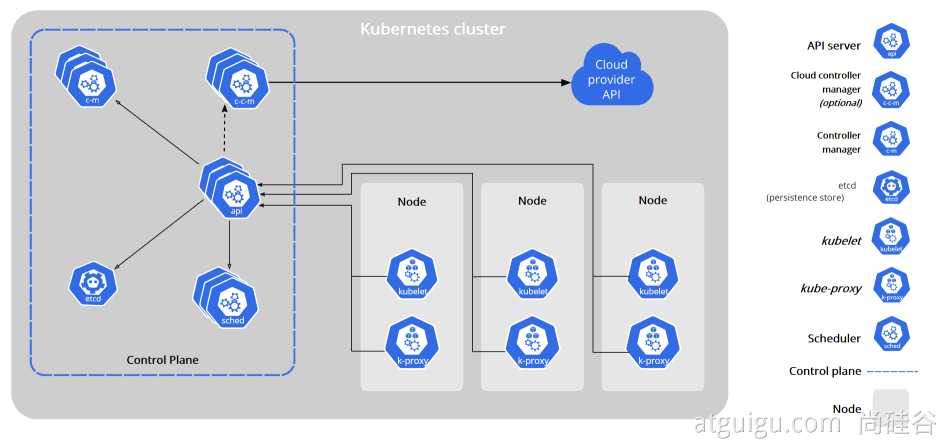
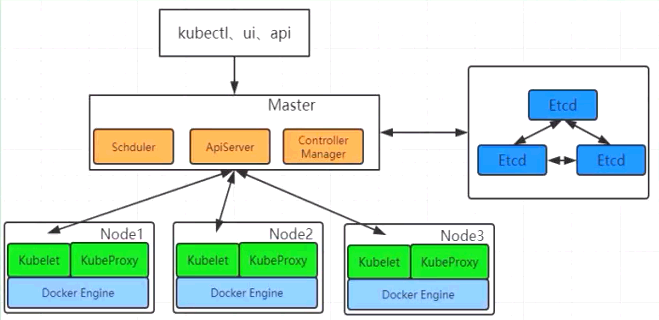

k8s 集群搭建，部署网络策略插件，可视化管理工具

<!-- more -->

中文社区: <https://www.kubernetes.org.cn/>

官方文档: <https://kubernetes.io/zh/docs/home/>

社区文档: <http://docs.kubernetes.org.cn/>

<https://feisky.gitbooks.io/kubernetes/content/>

[历史版本 Release History](https://kubernetes.io/releases/)

[客户端下载 github](https://github.com/kubernetes/kubernetes/tree/master/CHANGELOG)

配置SSH、配置k8s环境、安装docker、安装k8s、初始化k8s集群（加入节点）、网络插件fiannel、安装ingress负载均衡



## 一、概念



**传统部署时代**

**虚拟化部署时代**

**容器部署时代**

好处：

- **敏捷应用程序的创建和部署**：与使用 VM 镜像相比，提高了容器镜像创建的简便性和效率。
- **持续开发、集成和部署**：通过快速简单的回滚(由于镜像不可变性)，提供可靠且频繁的容器镜像构建和部署。
- **关注开发与运维的分离**：在构建/发布时而不是在部署时创建应用程序容器镜像，从而将应用程序与基础架构分离。
- **可观察性**：不仅可以显示操作系统级别的信息和指标，还可以显示应用程序的运行状况和其他指标信号。
- **跨开发、测试和生产的环境一致性**：在便携式计算机上与在云中相同地运行。
- **云和操作系统分发的可移植性**：可在 Ubuntu、RHEL、CoreOS、本地、Google Kubernetes Engine 和其他任何地方运行。
- **以应用程序为中心的管理**：提高抽象级别，从在虚拟硬件上运行 OS 到使用逻辑资源在 OS 上运行应用程序。
- **松散耦合、分布式、弹性、解放的微服务**：应用程序被分解成较小的独立部分，并且可以动态部署和管理 - 而不是在一台大型单机上整体运行。
- **资源隔离**：可预测的应用程序性能。
- **资源利用**：高效率和高密度

### [为什么需要 Kubernetes，它能做什么?](https://v1-18.docs.kubernetes.io/zh/docs/concepts/overview/what-is-kubernetes/#为什么需要-kubernetes-它能做什么)

### 简介：调度、自动修复、水平伸缩


### 组件架构



#### kube-apiserver

API 服务器是 Kubernetes [控制面](https://kubernetes.io/zh/docs/reference/glossary/?all=true#term-control-plane)的组件， 该组件公开了 Kubernetes API。

#### etcd

etcd 是兼具一致性和高可用性的键值数据库，可以作为保存 Kubernetes 所有集群数据的后台数据库。

#### kube-scheduler

控制平面组件，负责监视新创建的、未指定运行[节点（node）](https://kubernetes.io/zh/docs/concepts/architecture/nodes/)的 [Pods](https://kubernetes.io/docs/concepts/workloads/pods/pod-overview/)，选择节点让 Pod 在上面运行。

#### kube-controller-manager

在主节点上运行 [控制器](https://kubernetes.io/zh/docs/concepts/architecture/controller/) 的组件

这些控制器包括:

- **节点控制器（Node Controller）**: 负责在节点出现故障时进行通知和响应
- **任务控制器（Job controller）**: 监测代表一次性任务的 Job 对象，然后创建 Pods 来运行这些任务直至完成
- **端点控制器（Endpoints Controller）**: 填充端点(Endpoints)对象(即加入 Service 与 Pod)
- **服务帐户和令牌控制器（Service Account & Token Controllers）**: 为新的命名空间创建默认帐户和 API 访问令牌

#### cloud-controller-manager

云控制器管理器是指嵌入特定云的控制逻辑的 [控制平面](https://kubernetes.io/zh/docs/reference/glossary/?all=true#term-control-plane)组件

下面的控制器都包含对云平台驱动的依赖：

- **节点控制器（Node Controller）**: 用于在节点终止响应后检查云提供商以确定节点是否已被删除
- **路由控制器（Route Controller）**: 用于在底层云基础架构中设置路由
- **服务控制器（Service Controller）**: 用于创建、更新和删除云提供商负载均衡器

### Node 组件

#### kubelet

一个在集群中每个节点（node）上运行的代理。 它保证容器containers都运行在 Pod 中。

#### kube-proxy

是集群中每个节点上运行的网络代理


## 二、集群安装+环境配置搭建

### kubectl 快捷键（alias）

[csdn原文链接](https://blog.csdn.net/qq_42476834/article/details/117373828)

具体命令请看：[k8s-alias](./setting-alias.md)


### 部署步骤

```ABAP
1.在所有节点上安装 Docker和 kubeadm
2.部署 Kubernetes Master
3.部署容器网络插件（Cilium、Calico、Flannel、Weave）
4.部署 Kubernetes Node，将节点加入 Kubernetes集群中
5.部署可视化管理工具-(KubeSphere、Rancher、Kuboard)
6.部署程序
```



### 环境准备k8s-init


安装 net-tools 工具

```shell
yum install -y net-tools
```

本机添加hosts：`C:\Windows\System32\drivers\etc`

```yacas
192.168.100.130 tomcat.k8s.com
192.168.100.130 nginx.k8s.com
# k8s-可视化管理工具-KubeSphere
192.168.100.130 ks.k8s.com
# k8s-可视化管理工具-Rancher
192.168.100.130 rc.k8s.com
# k8s-可视化管理工具-Kuboard
192.168.100.130 ka.k8s.com
# k8s-可视化管理工具-KubeOperator
192.168.100.130 ko.k8s.com
192.168.100.130 master
192.168.100.131 node1
192.168.100.132 node2
```

在每个node节点上添加：`vim /etc/hosts`

```yacas
127.0.0.1   localhost localhost.localdomain localhost4 localhost4.localdomain4
::1         localhost localhost.localdomain localhost6 localhost6.localdomain6

192.168.100.130 master
192.168.100.131 node1
192.168.100.132 node2
```

重启网络服务：`service network restart`

`ping -c 3 master && ping -c 3 node1 && ping -c 3 node2`

用户：`a`，密码：`123456a`， 设置主机名称：`hostnamectl set-hostname`

#### 关闭防火墙

```
systemctl stop firewalld
systemctl disable firewalld
```


#### 禁用selinux

```shell
setenforce 0

sed -i 's/^SELINUX=enforcing$/SELINUX=permissive/' /etc/selinux/config
```


#### 禁用swap分区

`nano /etc/fstab`

```shell
[root@master ~]# cat /etc/fstab

#
# /etc/fstab
# Created by anaconda on Sat Mar  9 21:50:29 2024
#
# Accessible filesystems, by reference, are maintained under '/dev/disk'
# See man pages fstab(5), findfs(8), mount(8) and/or blkid(8) for more info
#
/dev/mapper/centos-root /                       xfs     defaults        0 0
UUID=6e78f73f-f9c1-47ff-8a2e-27042e0cfaaf /boot                   xfs     defaults        0 0
/dev/mapper/centos-home /home                   xfs     defaults        0 0
/dev/mapper/centos-swap swap                    swap    defaults        0 0
```

把*/dev/mapper/centos-swap swap* 改为 *#/dev/mapper/centos-swap swap*，用**#**注释掉


#### 开启IPVS支持

`vim /etc/sysconfig/modules/ipvs.modules`

```shell
cat -s <<EOF > /etc/sysconfig/modules/ipvs.modules
#!/bin/bash
ipvs_modules="ip_vs ip_vs_lc ip_vs_wlc ip_vs_rr ip_vs_wrr ip_vs_lblc ip_vs_lblcr ip_vs_dh ip_vs_sh ip_vs_fo ip_vs_nq ip_vs_sed ip_vs_ftp nf_conntrack"
for kernel_module in ${ipvs_modules}; do
  /sbin/modinfo -F filename ${kernel_module} > /dev/null 2>&1
  if [ $? -eq 0 ]; then
    /sbin/modprobe ${kernel_module}
  fi
done
EOF
```

> chmod 755 /etc/sysconfig/modules/ipvs.modules
>
> sh /etc/sysconfig/modules/ipvs.modules
>
> lsmod | grep ip_vs

#### k8s.conf配置

将桥接的IPv4流量传递到iptables的链

```shell
cat -s <<EOF > /etc/modules-load.d/k8s.conf
overlay
br_netfilter
EOF
echo -e "\n"
echo "----> modprobe overlay and br_netfilter"
modprobe overlay
modprobe br_netfilter

# cat /usr/lib/sysctl.d/00-system.conf 与之相同
cat -s <<EOF > /etc/sysctl.d/k8s.conf
# For binary values, 0 is disabled, 1 is enabled
net.bridge.bridge-nf-call-ip6tables = 1
net.bridge.bridge-nf-call-iptables = 1
net.ipv4.ip_forward = 1
vm.swappiness=0
EOF

echo -e "\n"
echo "----> start iptables：[sysctl -p /etc/sysctl.d/k8s.conf]"
sysctl -p /etc/sysctl.d/k8s.conf
sysctl --system
#校验
lsmod | grep br_netfilter
lsmod | grep overlay
sysctl net.bridge.bridge-nf-call-iptables net.bridge.bridge-nf-call-ip6tables net.ipv4.ip_forward
```

#### network-security开启网络安全

```shell
#修改/etc/sysctl.d/10-network-security.conf
#与 /usr/lib/sysctl.d/50-default.conf 类似
cat -s <<EOF > /etc/sysctl.d/10-network-security.conf
net.ipv4.conf.default.rp_filter=1
net.ipv4.conf.all.rp_filter=1
EOF

#然后使之生效
sysctl --system
```


#### 时间同步

```shell
rm -rf /var/run/yum.pid
yum install -y chrony
systemctl enable chronyd
systemctl start chronyd
timedatectl set-ntp true
timedatectl set-timezone Asia/Shanghai
echo "----> 时区状态：timedatectl status"
timedatectl status
echo "----> 检测：chronyc activity -v"
chronyc activity -v
yum -y install ntpdate
yum install -y ntpsec-ntpdate
ntpdate time.windows.com
echo -e "\n"
```


#### 开启 ssh 远程登录

[具体参考文档](https://blog.csdn.net/qq_42476834/article/details/124766896)

[开启 ssh 远程登录文档](./ssh.md)

[执行sh脚本](./script.md)：`k8s-centos7.sh，k8s-docker.sh，k8s-init.sh，k8s-install.sh`


#### 所有节点安装容器运行时containerd

[官方原文地址](https://kubernetes.io/zh-cn/docs/setup/production-environment/container-runtimes/#containerd)

**安装containerd，默认已经安装**

```shell
yum install -y yum-utils
yum-config-manager --add-repo https://download.docker.com/linux/centos/docker-ce.repo
yum -y install containerd.io
```


需要从这里开始配置：**生成config.toml配置**

```shell
containerd config default > /etc/containerd/config.toml
```


**配置 systemd cgroup 驱动 在 /etc/containerd/config.toml 中设置**

```shell
sed -i 's/SystemdCgroup = false/SystemdCgroup = true/g' /etc/containerd/config.toml

或手动修改

[plugins]
    [plugins."io.containerd.grpc.v1.cri".containerd.runtimes.runc]
      [plugins."io.containerd.grpc.v1.cri".containerd.runtimes.runc.options]
        SystemdCgroup = true
```


**将sandbox_image下载地址改为阿里云地址**

```shell
sed -i 's/sandbox_image = \"registry.k8s.io\/pause:3.6\"/sandbox_image = \"registry.aliyuncs.com\/google_containers\/pause:3.9\"/g' /etc/containerd/config.toml

或手动修改

[plugins."io.containerd.grpc.v1.cri"]
    sandbox_image = "registry.aliyuncs.com/google_containers/pause:3.9"
```


**启动containerd 并设置开机自启动**

```shell
systemctl restart containerd && systemctl enable containerd
```


#### containerd和docker操作差异

| 操作                | Docker            | Containerd (ctr)     | Crictl (K8s)      |
| ------------------- | ----------------- | -------------------- | ----------------- |
| 查看运行的容器      | docker ps         | ctr task ls          | crictl ps         |
| 查看镜像            | docker images     | ctr image ls         | crictl images     |
| 查看容器日志        | docker logs       | 无                   | crictl logs       |
| 查看容器数据信息    | docker inspect    | ctr container info   | crictl inspect    |
| 查看容器资源        | docker stats      | 无                   | crictl stats      |
| 启动/关闭已有的容器 | docker start/stop | ctr task start/kill  | crictl start/stop |
| 运行一个新的容器    | docker run        | ctr run              | 无                |
| 修改镜像标签        | docker tag        | ctr image tag        | 无                |
| 创建一个新的容器    | docker create     | ctr container create | crictl create     |
| 导入镜像            | docker load       | ctr image import     | 无                |
| 导出镜像            | docker save       | ctr image export     | 无                |
| 删除容器            | docker rm         | ctr container rm     | crictl rm         |
| 删除镜像            | docker rmi        | ctr image rm         | crictl rmi        |
| 拉取镜像            | docker pull       | ctr image pull       | crictl pull       |
| 推送镜像            | docker push       | ctr image push       | 无                |
| 在容器内部执行命令  | docker exec       | 无                   | crictl exec       |


### A、在所有节点上安装 Docker和kubernetes

[安装工具](https://kubernetes.io/zh/docs/tasks/tools/)：[docker](https://docs.docker.com/engine/install/centos/)、kubeadm管理、kukelet代理、kubectl命令行

[kubernetes版本 History](https://kubernetes.io/zh-cn/releases/)

<https://github.com/kubernetes/kubernetes/tree/master/CHANGELOG>

#### 安装docker

**Kubernetes 1.24+ 版本已经去除了对Docker的直接接口支持,需要通过containerd + docker CRI使用Docker。**

<https://docs.docker.com/engine/install/centos/>

卸载的旧版本

```shell
yum remove docker docker-client docker-client-latest docker-common docker-latest docker-latest-logrotate docker-logrotate docker-engine
```

华为安装

```shell
1、若您安装过docker，需要先删掉，之后再安装依赖:
  yum remove docker docker-common docker-selinux docker-engine
  yum install -y yum-utils device-mapper-persistent-data lvm2
2、下载repo文件
  wget -O /etc/yum.repos.d/docker-ce.repo https://repo.huaweicloud.com/docker-ce/linux/centos/docker-ce.repo
替换为：
  sed -i 's+download.docker.com+repo.huaweicloud.com/docker-ce+' /etc/yum.repos.d/docker-ce.repo
3、更新索引文件并安装
  yum clean all &&   yum makecache fast
  yum list docker-ce.x86_64 --showduplicates | sort -r
  yum install -y docker-ce
4、开启Docker服务
```

阿里安装

```shell
# step 1: 安装必要的一些系统工具
  yum install -y yum-utils device-mapper-persistent-data lvm2
# Step 2: 添加软件源信息
  yum-config-manager --add-repo https://mirrors.aliyun.com/docker-ce/linux/centos/docker-ce.repo
# Step 3
  sed -i 's+download.docker.com+mirrors.aliyun.com/docker-ce+' /etc/yum.repos.d/docker-ce.repo
# Step 4: 更新并安装Docker-CE
  yum clean all &&   yum makecache fast
  yum list docker-ce.x86_64 --showduplicates | sort -r
  yum -y install docker-ce-[VERSION]
# Step 4: 开启Docker服务
  service docker start
```

```shell
systemctl docker
systemctl restart docker
systemctl stop docker
systemctl enable docker
systemctl disable docker
systemctl status docker
usermod -aG docker a #非root用户
```

设置加速

```bash
cat -su <<EOF > /etc/docker/daemon.json
{
  "exec-opts": ["native.cgroupdriver=systemd"],
  "log-driver": "json-file",
  "log-opts": {
    "max-size": "100m"
  },
  "storage-driver": "overlay2",
  "registry-mirrors": [
    "https://04eo9xup.mirror.aliyuncs.com",
    "https://098cc8006500f4db0f2fc01937bbce40.mirror.swr.myhuaweicloud.com"
  ],
}
EOF
```

```shell
  systemctl daemon-reload
  systemctl restart docker
```

**docker配置http代理（可选）**

首先, 使用`systemctl status docker`命令查询`docker.service`文件的路径, 在我的环境中它的文件路径是`/lib/systemd/system/docker.service`; 然后编辑这个文件, 添加如下内容:

`vim /lib/systemd/system/docker.service`

```shell
[Service]
Environment="HTTP_PROXY=http://127.0.0.1:10809"
Environment="HTTPS_PROXY=http://127.0.0.1:10809" 
Environment="NO_PROXY=localhost,127.0.0.0/8,192.168.0.0/16,10.0.0.0/8"
```

#### 添加kubernetes仓库源


```shell
## 老版配置v1.28以前+部分版本
cat -s <<EOF > /etc/yum.repos.d/kubernetes.repo
[kubernetes]
name=Kubernetes
baseurl=https://mirrors.aliyun.com/kubernetes/yum/repos/kubernetes-el7-x86_64/
enabled=1
gpgcheck=1
repo_gpgcheck=0
gpgkey=https://mirrors.aliyun.com/kubernetes/yum/doc/yum-key.gpg https://mirrors.aliyun.com/kubernetes/yum/doc/rpm-package-key.gpg
EOF

## 新版配置v1.24-v1.29
cat <<EOF | tee /etc/yum.repos.d/kubernetes.repo
[kubernetes]
name=Kubernetes
baseurl=https://mirrors.aliyun.com/kubernetes-new/core/stable/v1.28/rpm/
enabled=1
gpgcheck=1
gpgkey=https://mirrors.aliyun.com/kubernetes-new/core/stable/v1.28/rpm/repodata/repomd.xml.key
EOF
```

**更新索引文件并查看 kubernetes版本列表**

```shell
yum clean all && yum makecache && yum -y update && yum repolist

yum list kube*
```

`failure: repodata/repomd.xml from kubernetes: [Errno 256] No more mirrors to try.`

暂时禁用存储库：`yum --disablerepo=kubernetes`

永久禁用存储库：`yum-config-manager --disable kubernetes or subscription-manager repos --disable=kubernetes`

如果不可用，则跳过：`yum-config-manager --save --setopt=kubernetes.skip_if_unavailable=true`

#### master节点安装

**升级0，新安装0，降级3，删除0，未升级25**

```ABAP
apt-get install -y kubeadm=1.27.2-0 kubelet=1.27.2-0 kubectl=1.27.2-0

yum install kubelet-1.27.2-0 kubeadm-1.27.2-0 kubectl-1.27.2-0

华为：
yum install kubelet-1.27.2-0 kubeadm-1.27.2-0 kubectl-1.27.2-0 --disableexcludes=kubernetes
阿里：
yum install kubelet-1.27.2 kubeadm-1.27.2 kubectl-1.27.2 --disableexcludes=kubernetes
yum install --nogpgcheck kubelet-1.27.2 kubeadm-1.27.2 kubectl-1.27.2 --disableexcludes=kubernetes
```

#### node节点安装

`yum install kubelet-1.27.2-0 kubeadm-1.27.2-0 kubectl-1.27.2-0`

#### 创建k8s软连接

执行：`ln -s /usr/bin/kube*  /usr/local/bin/`

#### 启动 k8s

```shell
systemctl enable kubelet
systemctl disable kubelet
systemctl start kubelet
systemctl stop kubelet
systemctl status kubelet
```

发现：`kubelet.service - kubelet: The Kubernetes Node Agent`，属于正常，k8s还没有配置


### B、Master 部署 Kubernetes

编辑 master_images.sh：设置需要的镜像，仓库地址：[官网docker镜像搜索](https://hub.docker.com/)

<https://hub.docker.com/u/aiotceo> 、<https://hub.docker.com/u/mirrorgooglecontainers>

```shell
> swr.myhuaweicloud.com/iivey
> registry.k8s.io
> registry.cn-chengdu.aliyuncs.com/k8sjf
> registry.aliyuncs.com/google_containers
```


#### 设置k8s镜像仓库源

查看安装k8s的相关信息

`kubeadm config print init-defaults`

查询需要的镜像

`kubeadm config images list`

设置k8s镜像仓库为，如果不确定，可以设置为 **registry.aliyuncs.com/google_containers**

`kubeadm config images list --kubernetes-version=v1.27.2 --image-repository registry.aliyuncs.com/google_containers`


所需镜像版本：

```text
------------官方需要
registry.k8s.io/kube-apiserver:v1.27.2
registry.k8s.io/kube-controller-manager:v1.27.2
registry.k8s.io/kube-scheduler:v1.27.2
registry.k8s.io/kube-proxy:v1.27.2
registry.k8s.io/pause:3.9
registry.k8s.io/etcd:3.5.10-0
registry.k8s.io/coredns/coredns:v1.10.1
```

```shell
docker login --username=ngerapp registry.cn-chengdu.aliyuncs.com
```

#### master-kubeadm初始化

```shell
kubeadm init \
--apiserver-advertise-address=192.168.100.130 \
--control-plane-endpoint=192.168.100.130 \
--image-repository registry.aliyuncs.com/google_containers \
--kubernetes-version v1.27.2 \
--service-cidr=10.96.0.0/16 \
--pod-network-cidr=10.244.0.0/16
```

#### 得到 kubeadm join

```shell
您的Kubernetes控制平面已成功初始化！
要开始使用群集，您需要以普通用户身份运行以下命令：
    mkdir -p $HOME/.kube
    sudo cp -i /etc/kubernetes/admin.conf $HOME/.kube/config
    sudo chown $(id -u):$(id -g) $HOME/.kube/config

或者，如果您是root用户，则可以运行：
  export KUBECONFIG=/etc/kubernetes/admin.conf
  
您现在应该在集群上部署一个pod网络。
使用下列选项之一运行“kubectl apply -f [podnetwork].yaml”：
https://kubernetes.io/docs/concepts/cluster-administration/addons/

##### master
现在，您可以通过复制证书颁发机构来加入任意数量的控制平面节点
和每个节点上的服务帐户密钥，然后以root用户身份运行以下操作：
kubeadm join 192.168.100.130:6443 --token y1iv7u.3j2bvevxwj0pcmxr \
        --discovery-token-ca-cert-hash sha256:5aba30843f69ff954e4afed9b712cfd1773c5a0c622a9d6e1cdcc2d937857815 \
        --control-plane

然后，在每个节点上以root身份运行以下操作，可以加入任意数量的工作节点：
###### node
su root
kubeadm join 192.168.100.130:6443 --token y1iv7u.3j2bvevxwj0pcmxr \
        --discovery-token-ca-cert-hash sha256:5aba30843f69ff954e4afed9b712cfd1773c5a0c622a9d6e1cdcc2d937857815
```


#### [ERROR CRI]: container runtime is not running

[官网解决方案](https://kubernetes.io/zh-cn/docs/setup/production-environment/container-runtimes/#containerd)

[所有节点安装containerd](#所有节点安装containerd)

1. 删除 `/etc/containerd/config.toml` 文件。
2. 要确保 `cri` 没有出现在 `/etc/containerd/config.toml` 文件中 `disabled_plugins` 列表内。
3. 执行`生成config.toml配置` 命令：`containerd config default > /etc/containerd/config.toml`

然后重新启动 containerd：

```shell
systemctl restart containerd
```


#### 重启后出现：`The connection to the server localhost:8080 was refused - did you specify the right host or port?`

解决：<https://blog.csdn.net/qq_42476834/article/details/124730955>

[ssh免密登录访问](./ssh.md)

#### 将主节点（master）中的“/etc/kubernetes/admin.conf”文件拷贝到从节点（node）相同目录下

```shell
scp /etc/kubernetes/admin.conf root@192.168.100.131:/etc/kubernetes/ && \
scp /etc/kubernetes/admin.conf root@192.168.100.132:/etc/kubernetes/

echo "export KUBECONFIG=/etc/kubernetes/admin.conf" >> ~/.bash_profile
或者
scp ~/.bash_profile root@192.168.100.131:/root/ && \
scp ~/.bash_profile root@192.168.100.132:/root/

source ~/.bash_profile
```


#### 解决端口占用：kubeadm reset


### C、将从节点（node）加入 Kubernetes （Master）集群中

su root 在每个根节点上运行以下操作：

[查看 kubeadm init](#master-kubeadm初始化)

```shell
su root
kubeadm join 192.168.100.130:6443 --token wmgb01.rwvu0csqrn5ayt1k \
        --discovery-token-ca-cert-hash sha256:e542e830fa...42627bc27f39bb0
```

```shell
[root@node-121 ~]# kubeadm join 192.168.100.130:6443 --token 971p07.4h9ljb93kcm471bd --discovery-token-ca-cert-hash sha256:2f02b1e110...5bc55393ea61b

[preflight] 进行飞行前检查
[preflight] 从集群中读取配置...
[preflight] 仅供参考：您可以查看此配置文件'kubectl -n kube-system get cm kubeadm-config -o yaml'
[kubelet-start] 将 kubelet 配置写入文件 "/var/lib/kubelet/config.yaml"
[kubelet-start] 将带有标志的 kubelet 环境文件写入文件 "/var/lib/kubelet/kubeadm-flags.env"
[kubelet-start] 启动 kubelet
[kubelet-start] 等待 kubelet 执行 TLS Bootstrap...

此节点已加入集群：
* 证书签名请求已发送到 apiserver 并收到响应。
* Kubelet  被告知新的安全连接细节。

Run 'kubectl get nodes' 在控制平面上查看该节点加入集群。
```

#### kubeadm-config（略过 嘿嘿嘿）

`kubectl -n kube-system get cm kubeadm-config -o yaml > /etc/kubernetes/kubeadm-config.yaml`

```json
apiVersion: v1
data:
  ClusterConfiguration: |
    apiServer:
      extraArgs:
        authorization-mode: Node,RBAC
      timeoutForControlPlane: 4m0s
    apiVersion: kubeadm.k8s.io/v1beta3
    certificatesDir: /etc/kubernetes/pki
    clusterName: kubernetes
    controlPlaneEndpoint: 192.168.100.130:6443
    controllerManager: {}
    dns: {}
    etcd:
      local:
        dataDir: /var/lib/etcd
    imageRepository: registry.cn-chengdu.aliyuncs.com/k8sjf
    kind: ClusterConfiguration
    kubernetesVersion: v1.27.2
    networking:
      dnsDomain: cluster.local
      podSubnet: 10.244.0.0/16
      serviceSubnet: 10.96.0.0/16
    scheduler: {}
kind: ConfigMap
metadata:
  creationTimestamp: "2022-08-27T07:05:29Z"
  name: kubeadm-config
  namespace: kube-system
  resourceVersion: "199"
  uid: 45ddd51c-8ef3-4f86-8406-3d1a11d5e4c5
```

#### token过期，重新设置

> kubeadm token list
>
> kubeadm token create --print-join-command
>
> kubeadm token create --ttl 0 --print-join-command

### D、master 部署网络策略插件


参考：<https://kubernetes.io/zh/docs/concepts/cluster-administration/addons/>

下表总结了不同的 GitHub 指标，让你了解每个项目的受欢迎程度和活动。数据收集于 2024 年 3 月。

| 提供商  | 项目                                                         | Stars | Forks | Contributors贡献者 |
| ------- | ------------------------------------------------------------ | ----- | ----- | ------------------ |
| Cilium  | [cilium/cilium](https://github.com/cilium/cilium)            | 18.1k | 2.6k  | 713                |
| Calico  | [projectcalico/calico](https://github.com/projectcalico/calico) | 5.4k  | 1.2k  | 337                |
| Flannel | [flannel-io/flannel](https://github.com/flannel-io/flannel)  | 8.4k  | 2.9k  | 231                |
| Weave   | [weaveworks/weave](https://github.com/weaveworks/weave/)     | 6.6k  | 660   | 87                 |
| Canal   | [projectcalico/canal](https://github.com/projectcalico/canal) | 709   | 100   | 20                 |


Flannel 的缺点之一是缺乏高级功能，例如配置网络策略和防火墙的能力。因此 Flannel 是 Kubernetes 集群网络的一个很好的入门级选择，但是，如果你正在寻找高级网络功能，你可能需要考虑其他 CNI 选项，例如 Cilium和Calico。

#### 配置网络策略 Flannel

root用户：

```shell
https://github.com/flannel-io/flannel#deploying-flannel-manually

https://gitee.com/k8s_s/flannel/blob/master/Documentation/kube-flannel.yml

kubectl apply -f kube-flannel.yml

kubectl apply -f https://github.com/flannel-io/flannel/releases/latest/download/kube-flannel.yml
```

删除：kubectl delete -f kube-flannel.yml


获取pods所有名称空间

```shell
[root@master ~]# kubectl get pods --all-namespaces -o wide
NAMESPACE      NAME                             READY   STATUS    RESTARTS   AGE    IP                NODE     NOMINATED NODE   READINESS GATES
kube-flannel   kube-flannel-ds-2vkzl            1/1     Running   0          2m7s   192.168.100.130   master   <none>           <none>
kube-flannel   kube-flannel-ds-f5jkp            1/1     Running   0          2m7s   192.168.100.131   node1    <none>           <none>
kube-flannel   kube-flannel-ds-tlh6w            1/1     Running   0          2m7s   192.168.100.132   node2    <none>           <none>
kube-system    coredns-66f779496c-7qfs6         1/1     Running   0          42m    10.244.2.2        node1    <none>           <none>
kube-system    coredns-66f779496c-bhx66         1/1     Running   0          42m    10.244.2.3        node1    <none>           <none>
kube-system    etcd-master                      1/1     Running   0          42m    192.168.100.130   master   <none>           <none>
kube-system    kube-apiserver-master            1/1     Running   0          42m    192.168.100.130   master   <none>           <none>
kube-system    kube-controller-manager-master   1/1     Running   0          42m    192.168.100.130   master   <none>           <none>
kube-system    kube-proxy-2wq4b                 1/1     Running   0          35m    192.168.100.131   node1    <none>           <none>
kube-system    kube-proxy-69rng                 1/1     Running   0          42m    192.168.100.130   master   <none>           <none>
kube-system    kube-proxy-q4tj8                 1/1     Running   0          35m    192.168.100.132   node2    <none>           <none>
kube-system    kube-scheduler-master            1/1     Running   0          42m    192.168.100.130   master   <none>           <none>
```


#### 配置网络策略 Cilium


#### [kubectl命令表](https://blog.csdn.net/qq_42476834/article/details/121781274)

#### 查看

列出所有运行的Pod信息

列出Pod以及运行Pod节点信息。

```shell
[root@master-120 kubelet]# kubectl get pods
No resources found in default namespace.
[root@master-120 ~]# kubectl get pods -o wide
No resources found in default namespace.
```

查看所以节点 **kg nodes**

```shell
[root@master-120 kubelet]# kg nodes
NAME         STATUS   ROLES                  AGE   VERSION
master-120   Ready    control-plane,master   63m   v1.27.2
node-121     Ready    <none>                 58m   v1.27.2
node-122     Ready    <none>                 58m   v1.27.2
node-123     Ready    <none>                 58m   v1.27.2
```

查看命名空间 **kubectl get ns**

```shell
[root@master-120 kubelet]# kubectl get ns
NAME              STATUS   AGE
default           Active   63m
kube-node-lease   Active   63m
kube-public       Active   63m
kube-system       Active   63m
```

查看 pod 命名空间 **kubectl get pods --all-namespaces -owide**

```shell
[root@master ~]# kubectl get pods --all-namespaces
NAMESPACE      NAME                             READY   STATUS    RESTARTS   AGE
kube-flannel   kube-flannel-ds-kfd89            1/1     Running   0          4m50s
kube-flannel   kube-flannel-ds-n8fr9            1/1     Running   0          4m50s
kube-flannel   kube-flannel-ds-tfj78            1/1     Running   0          4m50s
kube-system    coredns-687d9f64f-b8cvf          1/1     Running   0          55m
kube-system    coredns-687d9f64f-d99x9          1/1     Running   0          55m
kube-system    etcd-master                      1/1     Running   0          55m
kube-system    kube-apiserver-master            1/1     Running   0          55m
kube-system    kube-controller-manager-master   1/1     Running   0          55m
kube-system    kube-proxy-6v2v9                 1/1     Running   0          51m
kube-system    kube-proxy-8z62f                 1/1     Running   0          52m
kube-system    kube-proxy-ch88v                 1/1     Running   0          55m
kube-system    kube-scheduler-master            1/1     Running   0          55m
```

**kubectl get pods -n kube-system**

```shell
[root@master-120 kubelet]# kubectl get pods -n kube-flannel
NAME                                 READY   STATUS    RESTARTS   AGE
kube-flannel-ds-44l8g                1/1     Running   0          48m
kube-flannel-ds-cf2zd                1/1     Running   0          48m
kube-flannel-ds-tkbnh                1/1     Running   0          48m
kube-flannel-ds-wxhk4                1/1     Running   0          48m
```

**kubectl get pods -n kube-system -o wide**

```shell
[root@master ~]# kubectl get pods -n kube-flannel -o wide
NAME                    READY   STATUS    RESTARTS   AGE     IP                NODE     NOMINATED NODE   READINESS GATES
kube-flannel-ds-kfd89   1/1     Running   0          4m15s   192.168.100.132   node2    <none>           <none>
kube-flannel-ds-n8fr9   1/1     Running   0          4m15s   192.168.100.130   master   <none>           <none>
kube-flannel-ds-tfj78   1/1     Running   0          4m15s   192.168.100.131   node1    <none>           <none>
```

**kube-flannel-ds-xxxx 必须运行OK**


### E、可视化管理工具

#### 1、dashboard（不推荐）

文档：<https://kuboard.cn/install/install-k8s-dashboard.html>

<https://github.com/kubernetes/dashboard/releases/tag/v2.4.0>

`kubectl apply -f https://gitee.com/k8s_s/dashboard1/blob/v2.4.0/aio/deploy/recommended.yaml -o yaml > dashboard.yaml`

#### 2、KubeSphere（推荐1）

- [跳转-本站文档](./kubeSphere.md)
- [Github KubeSphere](https://github.com/kubesphere/kubesphere)，star: 14.1+K

#### 3、Rancher（推荐2）

- [跳转-本站文档](./rancher.md)
- [Github Rancher](https://github.com/rancher/rancher)，star: 22.4+K

#### 4、Kuboard（推荐3）

- [跳转-本站文档](./kuboard.md)
- [Github Kuboard](https://github.com/eip-work/kuboard-press) stars 20.7+K

#### 5、KubeOperator

- [跳转-本站文档](./kubeoperator.md)
- [Github KubeOperator](https://github.com/eip-work/kuboard-press) stars 4.9+K

