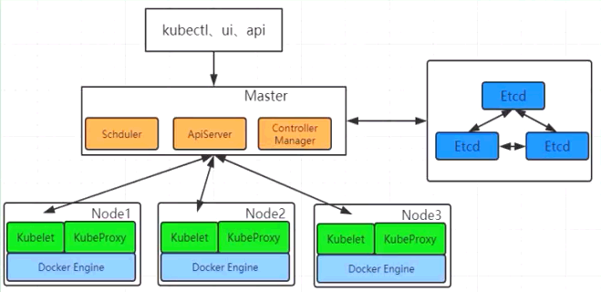
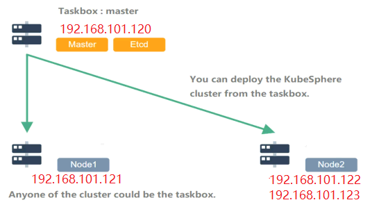
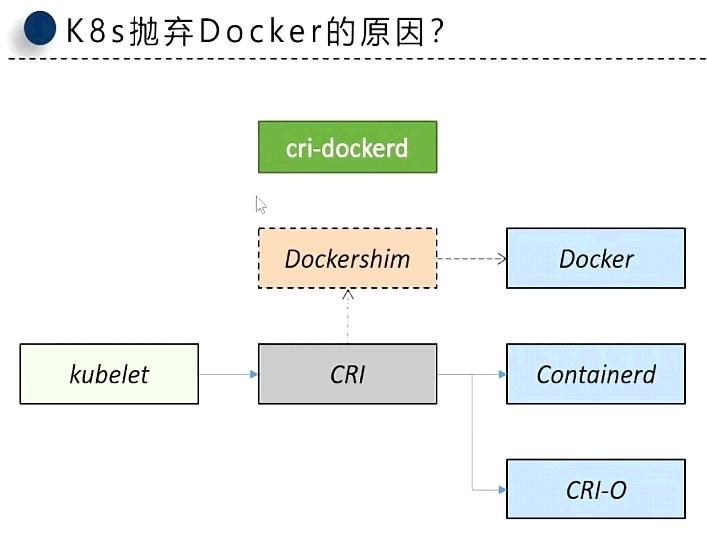
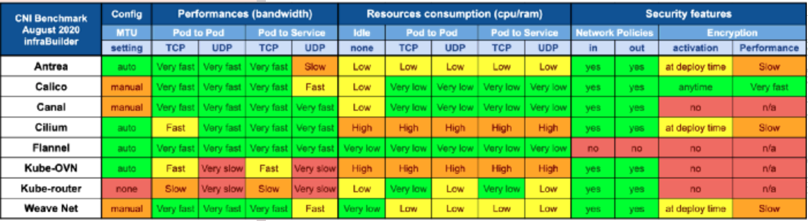

k8s 集群搭建，部署网络策略插件，可视化管理工具

<!-- more -->

中文社区: <https://www.kubernetes.org.cn/>

官方文档: <https://kubernetes.io/zh/docs/home/>

社区文档: <http://docs.kubernetes.org.cn/>

[历史版本 Release History](https://kubernetes.io/releases/)

[客户端下载 github](https://github.com/kubernetes/kubernetes/tree/master/CHANGELOG)


# 集群配置安装

## kubectl 快捷键（alias）

[csdn原文链接](https://blog.csdn.net/qq_42476834/article/details/117373828)

具体命令请看：[k8s-alias](./setting-alias.md)


## 部署步骤

```ABAP
0.k8s模板系统环境配置（环境准备k8s-init），完成后开始克隆主机。
1.在所有节点上安装 containerd 和 kubeadm。
2.部署 Kubernetes Master。
3.部署容器网络插件（Cilium、Calico、Flannel、Weave）。
4.部署 Kubernetes Node，将节点加入 Kubernetes集群中。
5.部署可视化管理工具-(KubeSphere、Rancher、Kuboard)。
6.部署程序。
```

**对于集群相同的环境配置，可以使用 ansible 来统一配置机器**



## 环境准备k8s-init



安装 net-tools 工具

```shell
apt-get install net-tools
```

本机添加hosts：`C:\Windows\System32\drivers\etc`

```yacas
192.168.0.130 tomcat.k8s.com
192.168.0.130 nginx.k8s.com
# k8s-可视化管理工具-KubeSphere
192.168.0.130 ks.k8s.com
# k8s-可视化管理工具-Rancher
192.168.0.130 rc.k8s.com
# k8s-可视化管理工具-Kuboard
192.168.0.130 ka.k8s.com
# k8s-可视化管理工具-KubeOperator
192.168.0.130 ko.k8s.com
192.168.0.130 master
192.168.0.131 node1
192.168.0.132 node2
```

在每个主机上添加：`nano /etc/hosts`

centos

```yacas
127.0.0.1   localhost localhost.localdomain localhost4 localhost4.localdomain4
::1         localhost localhost.localdomain localhost6 localhost6.localdomain6

192.168.0.130 master
192.168.0.131 node1
192.168.0.132 node2
```

重启网络服务：`service network restart`

Ubuntu：

```yaml
127.0.0.1 localhost
127.0.1.1 ubuntu24
192.168.0.130 master
192.168.0.131 node1
192.168.0.132 node2

# The following lines are desirable for IPv6 capable hosts
::1     ip6-localhost ip6-loopback
fe00::0 ip6-localnet
ff00::0 ip6-mcastprefix
ff02::1 ip6-allnodes
ff02::2 ip6-allrouters
```

重启网络服务：`netplan apply`

`ping -c 3 master && ping -c 3 node1 && ping -c 3 node2`

用户：`ubuntu`，密码：`123456a`， 设置主机名称：`hostnamectl set-hostname`


### 关闭防火墙

centos：

```bash
systemctl stop firewalld
systemctl disable firewalld
```

ubuntu:

```bash
ufw disable
ufw status
```


### 禁用selinux

centos：

```shell
setenforce 0

sed -i 's/^SELINUX=enforcing$/SELINUX=permissive/' /etc/selinux/config
```


### 禁用swap分区

为了保证kubelet正常工作，k8s强制要求禁用，否则集群初始化失败。

**临时关闭**：`swapoff -a`

**永久关闭**：`sed -ri 's/.*swap.*/#&/' /etc/fstab`

查看：`grep "*.swap.*" /etc/fstab`

Centos：

```shell
[root@master ~]# cat /etc/fstab
/dev/mapper/centos-root /                       xfs     defaults        0 0
UUID=6e78f73f-f9c1-47ff-8a2e-27042e0cfaaf /boot                   xfs     defaults        0 0
/dev/mapper/centos-home /home                   xfs     defaults        0 0
/dev/mapper/centos-swap swap                    swap    defaults        0 0
```

把*/dev/mapper/centos-swap swap* 改为 *#/dev/mapper/centos-swap swap*，用**#**注释掉

Ubuntu：

```bash
swapoff -a
sed -i 's|^/swap.img|#/swap.img|' /etc/fstab
rm -f /swap.img
```


### 开启IPVS支持

IPVS仅Centos：

`nano /etc/sysconfig/modules/ipvs.modules`

```shell
cat -s <<EOF > /etc/sysconfig/modules/ipvs.modules
#!/bin/bash
ipvs_modules="ip_vs ip_vs_lc ip_vs_wlc ip_vs_rr ip_vs_wrr ip_vs_lblc ip_vs_lblcr ip_vs_dh ip_vs_sh ip_vs_fo ip_vs_nq ip_vs_sed ip_vs_ftp nf_conntrack"
for kernel_module in ${ipvs_modules}; do
  /sbin/modinfo -F filename ${kernel_module} > /dev/null 2>&1
  if [ $? -eq 0 ]; then
    /sbin/modprobe ${kernel_module}
  fi
done
EOF
```

> - chmod +x /etc/sysconfig/modules/ipvs.modules
> - sh /etc/sysconfig/modules/ipvs.modules
> - lsmod | grep ip_vs


### 加载内核模块

```shell
cat -s <<EOF > /etc/modules-load.d/k8s.conf
overlay
br_netfilter
EOF

modprobe overlay
modprobe br_netfilter
```

将桥接的IPv4流量传递到iptables的链

```shell

# cat /usr/lib/sysctl.d/00-system.conf 与之相同
cat -s <<EOF > /etc/sysctl.d/k8s.conf
net.bridge.bridge-nf-call-ip6tables = 1
net.bridge.bridge-nf-call-iptables = 1
net.ipv4.ip_forward = 1
vm.swappiness=0
EOF

--------------------------
--------------------------
# /etc/sysctl.conf，这里推荐在企业正式环境里配置
net.core.somaxconn = 32768
net.ipv4.tcp_tw_reuse = 1
fs.file-max = 2097152
--------------------------
--------------------------

sysctl -p /etc/sysctl.d/k8s.conf
sysctl --system
#校验
lsmod | grep br_netfilter
lsmod | grep overlay
sysctl net.bridge.bridge-nf-call-iptables net.bridge.bridge-nf-call-ip6tables net.ipv4.ip_forward
```

### 磁盘I/O优化

```bash
# 使用deadline调度器
echo deadline > /sys/block/sda/queue/scheduler
# 调整预读缓存
blockdev --setra 4096 /dev/sda
```


### network-security开启网络安全

```shell
#修改/etc/sysctl.d/10-network-security.conf
#与 /usr/lib/sysctl.d/50-default.conf 类似
cat -s <<EOF > /etc/sysctl.d/10-network-security.conf
net.ipv4.conf.default.rp_filter=1
net.ipv4.conf.all.rp_filter=1
EOF

#然后使之生效
sysctl --system
```

### 生产环境必装工具包

```bash
apt-get install -y \
  conntrack \    # kube-proxy依赖
  socat \        # kubectl port-forward需要
  ebtables \     # 网络策略支持
  chrony        # 时间同步
```

> 查验安装是否成功：systemctl list-units --type=service | grep chrony


### 设置时间同步

centos：

```shell
rm -rf /var/run/yum.pid
yum install -y chrony | apt-get install -y chrony
systemctl start chrony
systemctl enable chrony
timedatectl set-ntp true
timedatectl set-timezone Asia/Shanghai
echo "----> 时区状态：timedatectl status"
timedatectl status
echo "----> 检测：chronyc activity -v"
chronyc activity -v
yum -y install ntpdate | apt-get install -y ntpdate
yum install -y ntpsec-ntpdate | apt-get install -y ntpsec-ntpdate
ntpdate time.windows.com
```


### 所有节点安装容器运行时containerd

[官方原文地址](https://kubernetes.io/zh-cn/docs/setup/production-environment/container-runtimes/#containerd)

**安装containerd，有可能默认已经安装**

```shell
yum install -y yum-utils
yum-config-manager --add-repo https://download.docker.com/linux/centos/docker-ce.repo
yum -y install containerd.io
```

ubuntu:

```bash
apt-get install -y containerd
```

**生成config.toml配置：**

```shell
mkdir -p /etc/containerd
containerd config default > /etc/containerd/config.toml
systemctl restart containerd
systemctl enable containerd
```


**配置 systemd cgroup 驱动 在 /etc/containerd/config.toml 中设置**

使用 systemd 作为 cgroup 驱动（必须和 kubelet 保持一致）

```shell
sed -i 's/SystemdCgroup = false/SystemdCgroup = true/g' /etc/containerd/config.toml

或手动修改

[plugins]
  [plugins.'io.containerd.cri.v1.runtime'.containerd.runtimes.runc]
    ......
    [plugins."io.containerd.cri.v1.runtime".containerd.runtimes.runc.options]
      SystemdCgroup = true
```


**将 sandbox 下载地址改为阿里云地址**，替换 pause 镜像（国内必须改，否则 kubeadm init 大概率卡死）

```shell
sed -i "s/sandbox = 'registry.k8s.io\/pause:3.10.1'/sandbox = 'registry.aliyuncs.com\/google_containers\/pause:3.10.1'/g" /etc/containerd/config.toml

或手动修改
    [plugins.'io.containerd.cri.v1.images'.pinned_images]
      sandbox = 'registry.aliyuncs.com/google_containers/pause:3.10.1'
```

> systemctl restart containerd


### containerd和docker操作差异

| 操作                | Docker            | Containerd (ctr)     | Crictl (K8s)      |
| ------------------- | ----------------- | -------------------- | ----------------- |
| 查看运行的容器      | docker ps         | ctr task ls          | crictl ps         |
| 查看镜像            | docker images     | ctr image ls         | crictl images     |
| 查看容器日志        | docker logs       | 无                   | crictl logs       |
| 查看容器数据信息    | docker inspect    | ctr container info   | crictl inspect    |
| 查看容器资源        | docker stats      | 无                   | crictl stats      |
| 启动/关闭已有的容器 | docker start/stop | ctr task start/kill  | crictl start/stop |
| 运行一个新的容器    | docker run        | ctr run              | 无                |
| 修改镜像标签        | docker tag        | ctr image tag        | 无                |
| 创建一个新的容器    | docker create     | ctr container create | crictl create     |
| 导入镜像            | docker load       | ctr image import     | 无                |
| 导出镜像            | docker save       | ctr image export     | 无                |
| 删除容器            | docker rm         | ctr container rm     | crictl rm         |
| 删除镜像            | docker rmi        | ctr image rm         | crictl rmi        |
| 拉取镜像            | docker pull       | ctr image pull       | crictl pull       |
| 推送镜像            | docker push       | ctr image push       | 无                |
| 在容器内部执行命令  | docker exec       | 无                   | crictl exec       |


## 完成后开始克隆主机


## 开启 ssh 远程登录

[开启 ssh 远程登录文档](./ssh.md)

[执行sh脚本](./script.md)：`k8s-centos7.sh，k8s-docker.sh，k8s-init.sh，k8s-install.sh`


## A、在所有节点上安装kubernetes

[安装工具](https://kubernetes.io/zh/docs/tasks/tools/)：[docker](https://docs.docker.com/engine/install/centos/)、kubeadm管理、kukelet代理、kubectl命令行

[kubernetes版本 History](https://kubernetes.io/zh-cn/releases/)

<https://github.com/kubernetes/kubernetes/tree/master/CHANGELOG>

### K8s抛弃Docker的原因



Kubernetes 1.24+ 版本虽然已经不使用原始docker，k8s使用了containerd替代，但如果不想用它，也可以使用docker推出的 cri-dockerd。


**...安装docker...忽略...；Kubernetes 1.24+ 版本已经去除了对Docker的直接接口支持,需要通过containerd + docker CRI使用Docker。**

<https://docs.docker.com/engine/install/centos/>

卸载的旧版本

```shell
yum remove docker docker-client docker-client-latest docker-common docker-latest docker-latest-logrotate docker-logrotate docker-engine
```

```shell
# step 1: 安装必要的一些系统工具
  yum install -y yum-utils device-mapper-persistent-data lvm2
# Step 2: 添加软件源信息
  yum-config-manager --add-repo https://mirrors.aliyun.com/docker-ce/linux/centos/docker-ce.repo
# Step 3
  sed -i 's+download.docker.com+mirrors.aliyun.com/docker-ce+' /etc/yum.repos.d/docker-ce.repo
# Step 4: 更新并安装Docker-CE
  yum clean all &&   yum makecache fast
  yum list docker-ce.x86_64 --showduplicates | sort -r
  yum -y install docker-ce-[VERSION]
# Step 4: 开启Docker服务
  service docker start

```

```shell
systemctl docker
systemctl restart docker
systemctl stop docker
systemctl enable docker
systemctl disable docker
systemctl status docker
usermod -aG docker a #非root用户
```

设置加速

```bash
cat -su <<EOF > /etc/docker/daemon.json
{
  "exec-opts": ["native.cgroupdriver=systemd"],
  "log-driver": "json-file",
  "log-opts": {
    "max-size": "100m"
  },
  "storage-driver": "overlay2",
  "registry-mirrors": [
    "https://04eo9xup.mirror.aliyuncs.com"
  ],
}
EOF
```

> `"https://098cc8006500f4db0f2fc01937bbce40.mirror.swr.myhuaweicloud.com"`

```shell
  systemctl daemon-reload
  systemctl restart docker
```

**docker配置http代理（可选）**

首先, 使用`systemctl status docker`命令查询`docker.service`文件的路径, 在我的环境中它的文件路径是`/lib/systemd/system/docker.service`; 然后编辑这个文件, 添加如下内容:

`vim /lib/systemd/system/docker.service`

```shell
[Service]
Environment="HTTP_PROXY=http://127.0.0.1:10809"
Environment="HTTPS_PROXY=http://127.0.0.1:10809" 
Environment="NO_PROXY=localhost,127.0.0.0/8,192.168.0.0/16,10.0.0.0/8"
```

### 添加kubernetes仓库源

centos：

```shell
# 新版配置v1.24-v1.29
cat <<EOF | tee /etc/yum.repos.d/kubernetes.repo
[kubernetes]
name=Kubernetes
baseurl=https://mirrors.aliyun.com/kubernetes-new/core/stable/v1.28/rpm/
enabled=1
gpgcheck=1
gpgkey=https://mirrors.aliyun.com/kubernetes-new/core/stable/v1.28/rpm/repodata/repomd.xml.key
EOF
```

**更新索引文件并查看 kubernetes版本列表**

```shell
yum clean all && yum makecache && yum -y update && yum repolist

yum list kube*
```

`failure: repodata/repomd.xml from kubernetes: [Errno 256] No more mirrors to try.`

暂时禁用存储库：`yum --disablerepo=kubernetes`

永久禁用存储库：`yum-config-manager --disable kubernetes or subscription-manager repos --disable=kubernetes`

如果不可用，则跳过：`yum-config-manager --save --setopt=kubernetes.skip_if_unavailable=true`


Ubuntu：

```bash
mkdir -p /etc/apt/keyrings

apt-get update && apt-get install -y apt-transport-https ca-certificates curl gnupg

curl -fsSL https://mirrors.aliyun.com/kubernetes-new/core/stable/v1.34/deb/Release.key |
    gpg --dearmor -o /etc/apt/keyrings/kubernetes-apt-keyring.gpg

echo "deb [signed-by=/etc/apt/keyrings/kubernetes-apt-keyring.gpg] https://mirrors.aliyun.com/kubernetes-new/core/stable/v1.34/deb/ /" |
    tee /etc/apt/sources.list.d/kubernetes.list

apt-get update
```

### 安装kubernetes

**升级0，新安装0，降级3，删除0，未升级25**

```bash
apt search kube*
apt-get install -y kubelet=1.34.6-* kubeadm=1.34.6-* kubectl=1.34.6-*

华为：
yum install kubelet-1.34.6-0 kubeadm-1.34.6-0 kubectl-1.34.6-0 --disableexcludes=kubernetes
阿里：
yum install kubelet-1.34.6 kubeadm-1.34.6 kubectl-1.34.6 --disableexcludes=kubernetes
yum install --nogpgcheck kubelet-1.34.6 kubeadm-1.34.6 kubectl-1.34.6 --disableexcludes=kubernetes
```

- 设置 `disableexcludes` 运行 yum update 时不会升级kubernetes。

### 锁版本（防止系统突然"帮你升级"）

`apt-mark hold kubelet kubeadm kubectl`

- auto：将指定软件包标记为自动安装。
- manual：将指定软件包标记为手动安装。
- minimize-manual：将 meta 包的所有依赖项标记为自动安装。
- hold：将指定软件包标记为保留，阻止其自动更新。
- unhold：取消指定软件包的保留标记，允许其自动更新。
- showauto：列出所有自动安装的软件包。
- showmanual：列出所有手动安装的软件包。
- showhold：列出所有标记为保留的软件包。

### 创建k8s软连接

如没有执行：`ln -s /usr/bin/kube*  /usr/local/bin/`

### 启动 k8s

```shell
systemctl start kubelet | disable | enable | stop | status
```

发现：`kubelet.service - kubelet: The Kubernetes Node Agent`，属于正常，k8s还没有配置


## B、Master 部署 Kubernetes

编辑 master_images.sh：设置需要的镜像，仓库地址：[官网docker镜像搜索](https://hub.docker.com/)

<https://hub.docker.com/u/aiotceo> 、<https://hub.docker.com/u/mirrorgooglecontainers>

```shell
> swr.myhuaweicloud.com/iivey
> registry.k8s.io
> registry.cn-chengdu.aliyuncs.com/k8sjf
> registry.aliyuncs.com/google_containers
```

- 查询需要的镜像：

`kubeadm config images list --kubernetes-version=v1.34.6 --image-repository registry.aliyuncs.com/google_containers`

```bash
registry.aliyuncs.com/google_containers/kube-apiserver:v1.34.6
registry.aliyuncs.com/google_containers/kube-controller-manager:v1.34.6
registry.aliyuncs.com/google_containers/kube-scheduler:v1.34.6
registry.aliyuncs.com/google_containers/kube-proxy:v1.34.6
registry.aliyuncs.com/google_containers/coredns:v1.12.1
registry.aliyuncs.com/google_containers/pause:3.10.1
registry.aliyuncs.com/google_containers/etcd:3.6.5-0
```

- 提前拉取kubernetes镜像

```bash
kubeadm config images pull \
--image-repository registry.aliyuncs.com/google_containers \
--kubernetes-version v1.34.6
```

通过 `crictl images` 查验是否下载成功。

### master-kubeadm初始化

- 生成k8s默认配置文件信息：

`kubeadm config print init-defaults > kubeadm.yaml`

设置：

```bash
sed -i 's/advertiseAddress: .*/advertiseAddress: 192.168.0.130/' kubeadm.yaml
sed -i 's#imageRepository: .*#imageRepository: registry.aliyuncs.com/google_containers#' kubeadm.yaml
sed -i 's/^\s*name: .*$/  name: master/' kubeadm.yaml
sed -i 's/kubernetesVersion: .*/kubernetesVersion: v1.34.6/' kubeadm.yaml
sed -i '/serviceSubnet/a\  podSubnet: 10.244.0.0/16' kubeadm.yaml
```

执行初始化：`kubeadm init --config kubeadm.yaml`

或：Centos：

```shell
kubeadm init \
--apiserver-advertise-address=192.168.0.130 \
--control-plane-endpoint=192.168.0.130 \
--image-repository registry.aliyuncs.com/google_containers \
--kubernetes-version v1.34.6 \
--service-cidr=10.96.0.0/16 \
--pod-network-cidr=10.244.0.0/16
```

于定义服务和 Pod 网络：

- `serviceSubnet`=`service-cidr`
- `podSubnet`=`pod-network-cidr`

### 得到 kubeadm join

```shell
您的Kubernetes控制平面已成功初始化！
要开始使用群集，您需要以普通用户身份运行以下命令：
    mkdir -p $HOME/.kube
    sudo cp -i /etc/kubernetes/admin.conf $HOME/.kube/config
    sudo chown $(id -u):$(id -g) $HOME/.kube/config

或者，如果您是root用户，则可以运行：
  export KUBECONFIG=/etc/kubernetes/admin.conf
  
您现在应该在集群上部署一个pod网络。
使用下列选项之一运行“kubectl apply -f [podnetwork].yaml”：
https://kubernetes.io/docs/concepts/cluster-administration/addons/

#### master
现在，您可以通过复制证书颁发机构来加入任意数量的控制平面节点
和每个节点上的服务帐户密钥，然后以root用户身份运行以下操作：
kubeadm join 192.168.0.130:6443 --token abcdef.0123456789abcdef \
        --discovery-token-ca-cert-hash sha256:5083504d7d835c239dc7a1f510d79e13b71a1314ec602afd07da5b427e421be1 \
        --control-plane

然后，在每个节点上以root身份运行以下操作，可以加入任意数量的工作节点：
##### node
su root
kubeadm join 192.168.0.130:6443 --token abcdef.0123456789abcdef \
        --discovery-token-ca-cert-hash sha256:5083504d7d835c239dc7a1f510d79e13b71a1314ec602afd07da5b427e421be1
```


### [ERROR CRI]: container runtime is not running

[官网解决方案](https://kubernetes.io/zh-cn/docs/setup/production-environment/container-runtimes/#containerd)

[所有节点安装containerd](#所有节点安装containerd)

1. 删除 `/etc/containerd/config.toml` 文件。
2. 要确保 `cri` 没有出现在 `/etc/containerd/config.toml` 文件中 `disabled_plugins` 列表内。
3. 执行`生成config.toml配置` 命令：`containerd config default > /etc/containerd/config.toml`

然后重新启动 containerd：

```shell
systemctl restart containerd
```


### 重启后出现：`The connection to the server localhost:8080 was refused - did you specify the right host or port?`

解决：<https://blog.csdn.net/qq_42476834/article/details/124730955>

[ssh免密登录访问](./ssh.md)

### 将主节点（master）中的“/etc/kubernetes/admin.conf”文件拷贝到从节点（node）相同目录下

```shell
scp /etc/kubernetes/admin.conf root@192.168.0.131:/etc/kubernetes/ && \
scp /etc/kubernetes/admin.conf root@192.168.0.132:/etc/kubernetes/

echo "export KUBECONFIG=/etc/kubernetes/admin.conf" >> ~/.bashrc  |||  ~/.bash_profile
或者
scp ~/.bash_profile root@192.168.0.131:/root/ && \
scp ~/.bash_profile root@192.168.0.132:/root/

source ~/.bash_profile
```


### 解决端口占用：kubeadm reset


## C、将从节点（node）加入 Kubernetes （Master）集群中

su root 在每个根节点上运行以下操作：

[查看 kubeadm init](#master-kubeadm初始化)

```shell
su root
kubeadm join 192.168.0.130:6443 --token abcdef.0123456789abcdef \
        --discovery-token-ca-cert-hash sha256:5083504d7d835c239dc7a1f510d79e13b71a1314ec602afd07da5b427e421be1
```

```shell
[root@node-121 ~]# kubeadm join 192.168.0.130:6443 --token 971p07.4h9ljb93kcm471bd --discovery-token-ca-cert-hash sha256:2f02b1e110...5bc55393ea61b

[preflight] 进行飞行前检查
[preflight] 从集群中读取配置...
[preflight] 仅供参考：您可以查看此配置文件'kubectl -n kube-system get cm kubeadm-config -o yaml'
[kubelet-start] 将 kubelet 配置写入文件 "/var/lib/kubelet/config.yaml"
[kubelet-start] 将带有标志的 kubelet 环境文件写入文件 "/var/lib/kubelet/kubeadm-flags.env"
[kubelet-start] 启动 kubelet
[kubelet-start] 等待 kubelet 执行 TLS Bootstrap...

此节点已加入集群：
* 证书签名请求已发送到 apiserver 并收到响应。
* Kubelet  被告知新的安全连接细节。

Run 'kubectl get nodes' 在控制平面上查看该节点加入集群。
```

### kubeadm-config（略过 嘿嘿嘿）

`kubectl -n kube-system get cm kubeadm-config -o yaml > /etc/kubernetes/kubeadm-config.yaml`

```json
apiVersion: v1
data:
  ClusterConfiguration: |
    apiServer:
      extraArgs:
        authorization-mode: Node,RBAC
      timeoutForControlPlane: 4m0s
    apiVersion: kubeadm.k8s.io/v1beta3
    certificatesDir: /etc/kubernetes/pki
    clusterName: kubernetes
    controlPlaneEndpoint: 192.168.0.130:6443
    controllerManager: {}
    dns: {}
    etcd:
      local:
        dataDir: /var/lib/etcd
    imageRepository: registry.cn-chengdu.aliyuncs.com/k8sjf
    kind: ClusterConfiguration
    kubernetesVersion: v1.34.6
    networking:
      dnsDomain: cluster.local
      podSubnet: 10.244.0.0/16
      serviceSubnet: 10.96.0.0/16
    scheduler: {}
kind: ConfigMap
metadata:
  creationTimestamp: "2022-08-27T07:05:29Z"
  name: kubeadm-config
  namespace: kube-system
  resourceVersion: "199"
  uid: 45ddd51c-8ef3-4f86-8406-3d1a11d5e4c5
```

### token过期，重新设置

> kubeadm token list
>
> kubeadm token create --print-join-command
>
> kubeadm token create --ttl 0 --print-join-command

## D、master 部署网络策略插件



参考：<https://kubernetes.io/zh/docs/concepts/cluster-administration/addons/>

下表总结了不同的 GitHub 指标，让你了解每个项目的受欢迎程度和活动。数据收集于 2024 年 3 月。

| 提供商  | 项目                                                         | Stars | Forks | Contributors贡献者 |
| ------- | ------------------------------------------------------------ | ----- | ----- | ------------------ |
| Cilium  | [cilium/cilium](https://github.com/cilium/cilium)            | 18.1k | 2.6k  | 713                |
| Calico  | [projectcalico/calico](https://github.com/projectcalico/calico) | 5.4k  | 1.2k  | 337                |
| Flannel | [flannel-io/flannel](https://github.com/flannel-io/flannel)  | 8.4k  | 2.9k  | 231                |
| Weave   | [weaveworks/weave](https://github.com/weaveworks/weave/)     | 6.6k  | 660   | 87                 |
| Canal   | [projectcalico/canal](https://github.com/projectcalico/canal) | 709   | 100   | 20                 |


Flannel 的缺点之一是缺乏高级功能，例如配置网络策略和防火墙的能力。因此 Flannel 是 Kubernetes 集群网络的一个很好的入门级选择，但是，如果你正在寻找高级网络功能，你可能需要考虑其他 CNI 选项，例如 Cilium和Calico。

### 配置网络策略 Flannel

root用户：

```shell
https://github.com/flannel-io/flannel#deploying-flannel-manually

https://gitee.com/k8s_s/flannel/blob/master/Documentation/kube-flannel.yml

kubectl apply -f kube-flannel.yml

kubectl apply -f https://github.com/flannel-io/flannel/releases/latest/download/kube-flannel.yml
```

删除：kubectl delete -f kube-flannel.yml


获取pods所有名称空间

```shell
[root@master ~]# kubectl get pods --all-namespaces -o wide
NAMESPACE      NAME                             READY   STATUS    RESTARTS   AGE    IP                NODE     NOMINATED NODE   READINESS GATES
kube-flannel   kube-flannel-ds-2vkzl            1/1     Running   0          2m7s   192.168.0.130   master   <none>           <none>
kube-flannel   kube-flannel-ds-f5jkp            1/1     Running   0          2m7s   192.168.0.131   node1    <none>           <none>
kube-flannel   kube-flannel-ds-tlh6w            1/1     Running   0          2m7s   192.168.0.132   node2    <none>           <none>
kube-system    coredns-66f779496c-7qfs6         1/1     Running   0          42m    10.244.2.2        node1    <none>           <none>
kube-system    coredns-66f779496c-bhx66         1/1     Running   0          42m    10.244.2.3        node1    <none>           <none>
kube-system    etcd-master                      1/1     Running   0          42m    192.168.0.130   master   <none>           <none>
kube-system    kube-apiserver-master            1/1     Running   0          42m    192.168.0.130   master   <none>           <none>
kube-system    kube-controller-manager-master   1/1     Running   0          42m    192.168.0.130   master   <none>           <none>
kube-system    kube-proxy-2wq4b                 1/1     Running   0          35m    192.168.0.131   node1    <none>           <none>
kube-system    kube-proxy-69rng                 1/1     Running   0          42m    192.168.0.130   master   <none>           <none>
kube-system    kube-proxy-q4tj8                 1/1     Running   0          35m    192.168.0.132   node2    <none>           <none>
kube-system    kube-scheduler-master            1/1     Running   0          42m    192.168.0.130   master   <none>           <none>
```


### 配置网络策略 Cilium


### [kubectl命令表](https://blog.csdn.net/qq_42476834/article/details/121781274)

### 查看

列出所有运行的Pod信息

列出Pod以及运行Pod节点信息。

```shell
[root@master-120 kubelet]# kubectl get pods
No resources found in default namespace.
[root@master-120 ~]# kubectl get pods -o wide
No resources found in default namespace.
```

查看所以节点 **kg nodes**

```shell
[root@master-120 kubelet]# kg nodes
NAME         STATUS   ROLES                  AGE   VERSION
master-120   Ready    control-plane,master   63m   v1.34.6
node-121     Ready    <none>                 58m   v1.34.6
node-122     Ready    <none>                 58m   v1.34.6
node-123     Ready    <none>                 58m   v1.34.6
```

查看命名空间 **kubectl get ns**

```shell
[root@master-120 kubelet]# kubectl get ns
NAME              STATUS   AGE
default           Active   63m
kube-node-lease   Active   63m
kube-public       Active   63m
kube-system       Active   63m
```

查看 pod 命名空间 **kubectl get pods --all-namespaces -owide**

```shell
[root@master ~]# kubectl get pods --all-namespaces
NAMESPACE      NAME                             READY   STATUS    RESTARTS   AGE
kube-flannel   kube-flannel-ds-kfd89            1/1     Running   0          4m50s
kube-flannel   kube-flannel-ds-n8fr9            1/1     Running   0          4m50s
kube-flannel   kube-flannel-ds-tfj78            1/1     Running   0          4m50s
kube-system    coredns-687d9f64f-b8cvf          1/1     Running   0          55m
kube-system    coredns-687d9f64f-d99x9          1/1     Running   0          55m
kube-system    etcd-master                      1/1     Running   0          55m
kube-system    kube-apiserver-master            1/1     Running   0          55m
kube-system    kube-controller-manager-master   1/1     Running   0          55m
kube-system    kube-proxy-6v2v9                 1/1     Running   0          51m
kube-system    kube-proxy-8z62f                 1/1     Running   0          52m
kube-system    kube-proxy-ch88v                 1/1     Running   0          55m
kube-system    kube-scheduler-master            1/1     Running   0          55m
```

**kubectl get pods -n kube-system**

```shell
[root@master-120 kubelet]# kubectl get pods -n kube-flannel
NAME                                 READY   STATUS    RESTARTS   AGE
kube-flannel-ds-44l8g                1/1     Running   0          48m
kube-flannel-ds-cf2zd                1/1     Running   0          48m
kube-flannel-ds-tkbnh                1/1     Running   0          48m
kube-flannel-ds-wxhk4                1/1     Running   0          48m
```

**kubectl get pods -n kube-system -o wide**

```shell
[root@master ~]# kubectl get pods -n kube-flannel -o wide
NAME                    READY   STATUS    RESTARTS   AGE     IP                NODE     NOMINATED NODE   READINESS GATES
kube-flannel-ds-kfd89   1/1     Running   0          4m15s   192.168.0.132   node2    <none>           <none>
kube-flannel-ds-n8fr9   1/1     Running   0          4m15s   192.168.0.130   master   <none>           <none>
kube-flannel-ds-tfj78   1/1     Running   0          4m15s   192.168.0.131   node1    <none>           <none>
```

**kube-flannel-ds-xxxx 必须运行OK**


## E、可视化管理工具

### 1、dashboard（不推荐）

文档：<https://kuboard.cn/install/install-k8s-dashboard.html>

<https://github.com/kubernetes/dashboard/releases/tag/v2.4.0>

`kubectl apply -f https://gitee.com/k8s_s/dashboard1/blob/v2.4.0/aio/deploy/recommended.yaml -o yaml > dashboard.yaml`

### 2、KubeSphere（推荐1）

- [跳转-本站文档](./kubesphere.md)
- [Github KubeSphere](https://github.com/kubesphere/kubesphere)，star: 14.1+K

### 3、Rancher（推荐2）

- [跳转-本站文档](./rancher.md)
- [Github Rancher](https://github.com/rancher/rancher)，star: 22.4+K

### 4、Kuboard（推荐3）

- [跳转-本站文档](./kuboard.md)
- [Github Kuboard](https://github.com/eip-work/kuboard-press) stars 20.7+K

### 5、KubeOperator

- [跳转-本站文档](./kubeoperator.md)
- [Github KubeOperator](https://github.com/eip-work/kuboard-press) stars 4.9+K

