k8s 基础篇，集群搭建与入门体验

<!-- more -->

# K8S 基础搭建

中文社区: <https://www.kubernetes.org.cn/>

官方文档: <https://kubernetes.io/zh/docs/home/>

社区文档: <http://docs.kubernetes.org.cn/>

<https://feisky.gitbooks.io/kubernetes/content/>

[历史版本 Release History](https://kubernetes.io/releases/)

[客户端下载 github](https://github.com/kubernetes/kubernetes/tree/master/CHANGELOG)

配置SSH、配置k8s环境、安装docker、安装k8s、初始化k8s集群（加入节点）、网络插件fiannel、安装ingress负载均衡、配置nfs


## 1）、概念


**传统部署时代**

**虚拟化部署时代**

**容器部署时代**

好处：

- 敏捷应用程序的创建和部署：与使用 VM 镜像相比，提高了容器镜像创建的简便性和效率。
- 持续开发、集成和部署：通过快速简单的回滚(由于镜像不可变性)，提供可靠且频繁的容器镜像构建和部署。
- 关注开发与运维的分离：在构建/发布时而不是在部署时创建应用程序容器镜像，从而将应用程序与基础架构分离。
- 可观察性不仅可以显示操作系统级别的信息和指标，还可以显示应用程序的运行状况和其他指标信号。
- 跨开发、测试和生产的环境一致性：在便携式计算机上与在云中相同地运行。
- 云和操作系统分发的可移植性：可在 Ubuntu、RHEL、CoreOS、本地、Google Kubernetes Engine 和其他任何地方运行。
- 以应用程序为中心的管理：提高抽象级别，从在虚拟硬件上运行 OS 到使用逻辑资源在 OS 上运行应用程序。
- 松散耦合、分布式、弹性、解放的微服务：应用程序被分解成较小的独立部分，并且可以动态部署和管理 - 而不是在一台大型单机上整体运行。
- 资源隔离：可预测的应用程序性能。
- 资源利用：高效率和高密度

### [为什么需要 Kubernetes，它能做什么?](https://v1-18.docs.kubernetes.io/zh/docs/concepts/overview/what-is-kubernetes/#为什么需要-kubernetes-它能做什么)

### 简介：调度、自动修复、水平伸缩


### 组件架构


#### kube-apiserver

API 服务器是 Kubernetes [控制面](https://kubernetes.io/zh/docs/reference/glossary/?all=true#term-control-plane)的组件， 该组件公开了 Kubernetes API。

#### etcd

etcd 是兼具一致性和高可用性的键值数据库，可以作为保存 Kubernetes 所有集群数据的后台数据库。

#### kube-scheduler

控制平面组件，负责监视新创建的、未指定运行[节点（node）](https://kubernetes.io/zh/docs/concepts/architecture/nodes/)的 [Pods](https://kubernetes.io/docs/concepts/workloads/pods/pod-overview/)，选择节点让 Pod 在上面运行。

#### kube-controller-manager

在主节点上运行 [控制器](https://kubernetes.io/zh/docs/concepts/architecture/controller/) 的组件

> 这些控制器包括:
>
> - 节点控制器（Node Controller）: 负责在节点出现故障时进行通知和响应
> - 任务控制器（Job controller）: 监测代表一次性任务的 Job 对象，然后创建 Pods 来运行这些任务直至完成
> - 端点控制器（Endpoints Controller）: 填充端点(Endpoints)对象(即加入 Service 与 Pod)
> - 服务帐户和令牌控制器（Service Account & Token Controllers）: 为新的命名空间创建默认帐户和 API 访问令牌

#### cloud-controller-manager

云控制器管理器是指嵌入特定云的控制逻辑的 [控制平面](https://kubernetes.io/zh/docs/reference/glossary/?all=true#term-control-plane)组件

> 下面的控制器都包含对云平台驱动的依赖：
>
> - 节点控制器（Node Controller）: 用于在节点终止响应后检查云提供商以确定节点是否已被删除
> - 路由控制器（Route Controller）: 用于在底层云基础架构中设置路由
> - 服务控制器（Service Controller）: 用于创建、更新和删除云提供商负载均衡器

### Node 组件

#### kubelet

一个在集群中每个节点（node）上运行的代理。 它保证容器containers都 运行在 Pod 中。

#### kube-proxy

是集群中每个节点上运行的网络代理

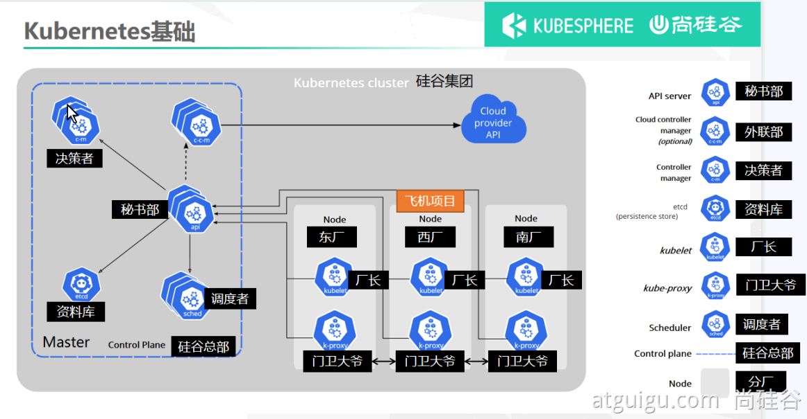

## 2）、集群安装+环境配置搭建

### kubectl 快捷键（alias）

[csdn原文链接](https://blog.csdn.net/qq_42476834/article/details/117373828)

具体命令请看：[k8s-alias](./setting-alias.md)


### 部署步骤

```ABAP
1.在所有节点上安装 Docker和 kubeadm
2.部署 Kubernetes Master
3.部署容器网络插件
4.部署 Kubernetes Node，将节点加入 Kubernetes集群中
5.部署可视化管理 Kubernetes 资源
6.部署程序
```


### 环境准备

#### VMware

#### 创建虚拟机

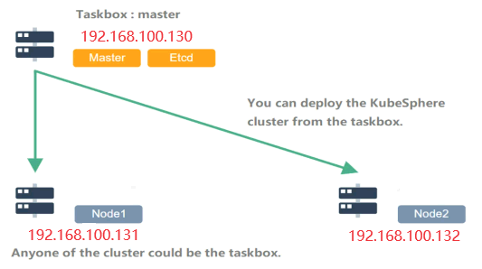

安装 net-tools 工具

```shell
yum install -y net-tools
```

本机添加hosts：C:\Windows\System32\drivers\etc

```
192.168.100.130 tomcat.k8s.com
192.168.100.130 nginx.k8s.com
# k8s-可视化管理工具-KubeSphere
192.168.100.130 ks.k8s.com
# k8s-可视化管理工具-KubeOperator
192.168.100.130 ko.k8s.com
192.168.100.130 master
192.168.100.131 node1
192.168.100.132 node2
```

在每个节点上添加   vim /etc/hosts

```
127.0.0.1   localhost localhost.localdomain localhost4 localhost4.localdomain4
::1         localhost localhost.localdomain localhost6 localhost6.localdomain6

192.168.100.130 master
192.168.100.131 node1
192.168.100.132 node2
```

> systemctl restart network.service //重启网络服务，
>
> ping -c 3 master-120 && ping -c 3 node-121 && ping -c 3 node-122 && ping -c 3 node-123

用户：a，密码：123456a， 设置主机名称： hostnamectl set-hostname

#### 开启 ssh 远程登录

[具体参考文档](https://blog.csdn.net/qq_42476834/article/details/124766896)

[开启 ssh 远程登录文档](./ssh.md)

执行sh脚本：`k8s-init.sh，k8s-docker.sh，k8s-install.sh`

#### 开启IPVS支持

  vim /etc/sysconfig/modules/ipvs.modules

```shell
cat -s <<EOF > /etc/sysconfig/modules/ipvs.modules
#!/bin/bash
ipvs_modules="ip_vs ip_vs_lc ip_vs_wlc ip_vs_rr ip_vs_wrr ip_vs_lblc ip_vs_lblcr ip_vs_dh ip_vs_sh ip_vs_fo ip_vs_nq ip_vs_sed ip_vs_ftp nf_conntrack"
for kernel_module in ${ipvs_modules}; do
  /sbin/modinfo -F filename ${kernel_module} > /dev/null 2>&1
  if [ $? -eq 0 ]; then
    /sbin/modprobe ${kernel_module}
  fi
done
EOF
```

> chmod 755 /etc/sysconfig/modules/ipvs.modules
>
> sh /etc/sysconfig/modules/ipvs.modules
>
> lsmod | grep ip_vs

#### 将桥接的IPv4流量传递到iptables的链

```shell
cat -s <<EOF > /etc/modules-load.d/k8s.conf
br_netfilter
EOF

# cat /usr/lib/sysctl.d/00-system.conf 与之相同
cat -s <<EOF > /etc/sysctl.d/k8s.conf
# For binary values, 0 is disabled, 1 is enabled
net.bridge.bridge-nf-call-ip6tables = 1
net.bridge.bridge-nf-call-iptables = 1
net.ipv4.ip_forward = 1
vm.swappiness=0
EOF

cat -s <<EOF > /etc/sysctl.d/k8s.conf
net.bridge.bridge-nf-call-ip6tables = 1
net.bridge.bridge-nf-call-iptables = 1
net.ipv4.ip_forward = 1
vm.swappiness=0
EOF

modprobe br_netfilter
sysctl -p /etc/sysctl.d/k8s.conf
sysctl --system

#修改/etc/sysctl.d/10-network-security.conf
#与 /usr/lib/sysctl.d/50-default.conf 类似
cat -s <<EOF > /etc/sysctl.d/10-network-security.conf
net.ipv4.conf.default.rp_filter=1
net.ipv4.conf.all.rp_filter=1
EOF
#然后使之生效
sysctl --system
```

#### 时间同步

```shell
  yum install -y chrony
  systemctl enable chronyd
  systemctl start chronyd
  timedatectl set-ntp true
  设置时区：timedatectl set-timezone Asia/Shanghai
  timedatectl status
  检查 ntp-server 是否可用：chronyc activity -v
---------------------------------------
  yum -y install ntpdate && yum install ntpsec-ntpdate
  ntpdate time.windows.com
```

### A、在所有节点上安装 Docker和 kubeadm、kubelet、kubectl

#### 准备

[安装工具](https://kubernetes.io/zh/docs/tasks/tools/)：[docker](https://docs.docker.com/engine/install/centos/)、kubeadm管理、kukelet代理、kubectl命令行

#### 1、安装docker

<https://docs.docker.com/engine/install/centos/>

卸载的旧版本

```shell
  yum remove docker docker-client docker-client-latest docker-common docker-latest docker-latest-logrotate docker-logrotate docker-engine
```

华为安装

```shell
1、若您安装过docker，需要先删掉，之后再安装依赖:
  yum remove docker docker-common docker-selinux docker-engine
  yum install -y yum-utils device-mapper-persistent-data lvm2
2、下载repo文件
  wget -O /etc/yum.repos.d/docker-ce.repo https://repo.huaweicloud.com/docker-ce/linux/centos/docker-ce.repo
替换为：
  sed -i 's+download.docker.com+repo.huaweicloud.com/docker-ce+' /etc/yum.repos.d/docker-ce.repo
3、更新索引文件并安装
  yum clean all &&   yum makecache fast
  yum list docker-ce.x86_64 --showduplicates | sort -r
  yum install -y docker-ce
4、开启Docker服务
```

阿里安装

```shell
# step 1: 安装必要的一些系统工具
  yum install -y yum-utils device-mapper-persistent-data lvm2
# Step 2: 添加软件源信息
  yum-config-manager --add-repo https://mirrors.aliyun.com/docker-ce/linux/centos/docker-ce.repo
# Step 3
  sed -i 's+download.docker.com+mirrors.aliyun.com/docker-ce+' /etc/yum.repos.d/docker-ce.repo
# Step 4: 更新并安装Docker-CE
  yum clean all &&   yum makecache fast
  yum list docker-ce.x86_64 --showduplicates | sort -r
  yum -y install docker-ce-[VERSION]
# Step 4: 开启Docker服务
  service docker start
```

`systemctl docker`

`systemctl restart docker`

`systemctl stop docker`

`systemctl enable docker`

`systemctl disable docker`

`systemctl status docker`

`usermod -aG docker a` #非root用户

设置加速

```bash
cat -su <<EOF > /etc/docker/daemon.json
{
  "exec-opts": ["native.cgroupdriver=systemd"],
  "log-driver": "json-file",
  "log-opts": {
    "max-size": "100m"
  },
  "storage-driver": "overlay2",
  "registry-mirrors": [
    "https://04eo9xup.mirror.aliyuncs.com",
    "https://098cc8006500f4db0f2fc01937bbce40.mirror.swr.myhuaweicloud.com"
  ],
}
EOF
```

```shell
  systemctl daemon-reload
  systemctl restart docker
```

**docker配置http代理（可选）**

首先, 使用`systemctl status docker`命令查询`docker.service`文件的路径, 在我的环境中它的文件路径是`/lib/systemd/system/docker.service`; 然后编辑这个文件, 添加如下内容:

  vim /lib/systemd/system/docker.service

```shell
[Service]
Environment="HTTP_PROXY=http://127.0.0.1:10809"
Environment="HTTPS_PROXY=http://127.0.0.1:10809" 
Environment="NO_PROXY=localhost,127.0.0.0/8,192.168.0.0/16,10.0.0.0/8"
```


#### 2、添加 阿里kubernetes 仓库源（推荐）

```shell
cat -s <<EOF > /etc/yum.repos.d/kubernetes.repo
[kubernetes]
name=Kubernetes
baseurl=https://mirrors.aliyun.com/kubernetes/yum/repos/kubernetes-el7-x86_64/
enabled=1
gpgcheck=1
repo_gpgcheck=0
gpgkey=https://mirrors.aliyun.com/kubernetes/yum/doc/yum-key.gpg https://mirrors.aliyun.com/kubernetes/yum/doc/rpm-package-key.gpg
EOF
```

#### 3、添加 华为kubernetes 仓库源（仓库维护太慢了）

```shell
cat -s <<EOF > /etc/yum.repos.d/kubernetes.repo
[kubernetes]
name=Kubernetes
baseurl=https://repo.huaweicloud.com/kubernetes/yum/repos/kubernetes-el7-x86_64
enabled=1
gpgcheck=1
repo_gpgcheck=0
gpgkey=https://repo.huaweicloud.com/kubernetes/yum/doc/yum-key.gpg https://repo.huaweicloud.com/kubernetes/yum/doc/rpm-package-key.gpg
EOF
```

#### 4、更新索引文件并安装 **kubernetes**

```shell
yum clean all && yum makecache && yum -y update && yum repolist all
yum list kubelet yum list kube*
```

`failure: repodata/repomd.xml from kubernetes: [Errno 256] No more mirrors to try.`

暂时禁用存储库：`yum --disablerepo=kubernetes`

永久禁用存储库：`yum-config-manager --disable kubernetes or subscription-manager repos --disable=kubernetes`

如果不可用，则跳过：`yum-config-manager --save --setopt=kubernetes.skip_if_unavailable=true`

#### 5、master 安装

**升级0，新安装0，降级3，删除0，未升级25**

```ABAP
apt-get install -y kubeadm=1.23.8-0 kubelet=1.23.8-0 kubectl=1.23.8-0

yum install kubeadm-1.23.8-0 kubelet-1.23.8-0 kubectl-1.23.8-0
yum install --nogpgcheck kubelet-1.23.8-0 kubeadm-1.23.8-0 kubectl-1.23.8-0
华为：yum install kubeadm-1.23.8-0 kubelet-1.23.8-0 kubectl-1.23.8-0 --disableexcludes=kubernetes
阿里：yum install kubeadm-1.23.8-0 kubelet-1.23.8-0 kubectl-1.23.8-0
```

#### 6、node 节点安装

> yum install kubeadm-1.23.8-0 kubelet-1.23.8-0 kubectl-1.23.8-0

#### 7、创建k8s软连接

执行：`ln -s /usr/bin/kube*  /usr/local/bin/`

#### 启动 k8s

> systemctl enable kubelet   systemctl disable kubelet
>
> systemctl start kubelet    systemctl stop kubelet
>
> systemctl status kubelet
>
> 发现：`kubelet.service - kubelet: The Kubernetes Node Agent`，属于正常，k8s还没有配置

[版本 History](https://kubernetes.io/releases/) <https://github.com/kubernetes/kubernetes/tree/master/CHANGELOG>

### B、Master 部署 Kubernetes

编辑 master_images.sh：设置需要的镜像，仓库地址,[官网docker镜像搜索](https://hub.docker.com/)

> <https://hub.docker.com/u/aiotceo> 、<https://hub.docker.com/u/mirrorgooglecontainers>
>
> swr.myhuaweicloud.com/iivey
>
> registry.cn-chengdu.aliyuncs.com/k8sjf
>
> registry.aliyuncs.com/google_containers

#### 设置k8s镜像仓库源

```ABAP
#查看安装k8s的相关信息
kubeadm config print init-defaults
#查询需要的镜像
kubeadm config images list
------------------
#设置k8s镜像仓库为，如果不确定，可以设置为 registry.aliyuncs.com/google_containers
kubeadm config images list --kubernetes-version=v1.23.8 --image-repository registry.cn-chengdu.aliyuncs.com/k8sjf
```

所需镜像版本：

```text
------------官方需要
kube-apiserver:v1.23.8
kube-controller-manager:v1.23.8
kube-scheduler:v1.23.8
kube-proxy:v1.23.8
pause:3.6
etcd:3.5.1-0
coredns:v1.8.6
------------其他需要
flannel:v0.19.0
flannelcni-flannel-cni-plugin:v1.1.0
nginx-ingress-controller:v1.3.0
kube-webhook-certgen:v1.1.1
```

```shell
docker login --username=小牛 registry.cn-chengdu.aliyuncs.com
```

#### master -> kubeadm 初始化<a name="kubeadm init"></a>

```shell
kubeadm init \
--apiserver-advertise-address=192.168.100.130 \
--control-plane-endpoint=192.168.100.130 \
--image-repository registry.cn-chengdu.aliyuncs.com/k8sjf \
--kubernetes-version v1.23.8 \
--service-cidr=10.96.0.0/16 \
--pod-network-cidr=10.244.0.0/16
```

#### 得到 kubeadm join

```shell
您的Kubernetes控制平面已成功初始化！
要开始使用群集，您需要以普通用户身份运行以下命令：
    mkdir -p $HOME/.kube
    sudo cp -i /etc/kubernetes/admin.conf $HOME/.kube/config
    sudo chown $(id -u):$(id -g) $HOME/.kube/config

或者，如果您是root用户，则可以运行：
  export KUBECONFIG=/etc/kubernetes/admin.conf
  
您现在应该在集群上部署一个pod网络。
使用下列选项之一运行“kubectl apply-f[podnetwork].yaml”：
https://kubernetes.io/docs/concepts/cluster-administration/addons/

##### master
现在，您可以通过复制证书颁发机构来加入任意数量的控制平面节点
和每个节点上的服务帐户密钥，然后以root用户身份运行以下操作：
kubeadm join 192.168.100.130:6443 --token wmgb01.rwvu0csqrn5ayt1k \
        --discovery-token-ca-cert-hash sha256:e542e830faf3e7e5ed7449989279c288800600260f327a7fd42627bc27f39bb0 \
        --control-plane

然后，在每个节点上以root身份运行以下操作，可以加入任意数量的工作节点：
###### node
su root
kubeadm join 192.168.100.130:6443 --token wmgb01.rwvu0csqrn5ayt1k \
        --discovery-token-ca-cert-hash sha256:e542e830faf3e7e5ed7449989279c288800600260f327a7fd42627bc27f39bb0

```

#### kubectl 命令的自动补全功能（所有的节点）

> echo "source <(kubectl completion bash)" >> ~/.bashrc

#### 重启后出现：`The connection to the server localhost:8080 was refused - did you specify the right host or port?`

解决：<https://blog.csdn.net/qq_42476834/article/details/124730955>

[ssh免密登录访问](./ssh.md)

#### 将主节点（master）中的“/etc/kubernetes/admin.conf”文件拷贝到从节点（node）相同目录下

```shell
scp /etc/kubernetes/admin.conf root@192.168.100.131:/etc/kubernetes/ && \
scp /etc/kubernetes/admin.conf root@192.168.100.132:/etc/kubernetes/

echo "export KUBECONFIG=/etc/kubernetes/admin.conf" >> ~/.bash_profile
scp ~/.bash_profile root@192.168.100.131:/root/ && \
scp ~/.bash_profile root@192.168.100.132:/root/

source ~/.bash_profile
```

#### 解决端口占用：kubeadm reset

### C、将从节点（node）加入 Kubernetes （Master）集群中

su root 在每个根节点上运行以下操作：

[查看 kubeadm init](#kubeadm init)

```shell
su root
kubeadm join 192.168.100.130:6443 --token wmgb01.rwvu0csqrn5ayt1k \
        --discovery-token-ca-cert-hash sha256:e542e830faf3e7e5ed7449989279c288800600260f327a7fd42627bc27f39bb0
```

```shell
[root@node-121 ~]# kubeadm join 192.168.100.130:6443 --token 971p07.4h9ljb93kcm471bd --discovery-token-ca-cert-hash sha256:2f02b1e11049f9cbe3784ed6a78f1f7f4fc794d421eabe642335bc55393ea61b

[preflight] 进行飞行前检查
[preflight] 从集群中读取配置...
[preflight] 仅供参考：您可以查看此配置文件'kubectl -n kube-system get cm kubeadm-config -o yaml'
[kubelet-start] 将 kubelet 配置写入文件 "/var/lib/kubelet/config.yaml"
[kubelet-start] 将带有标志的 kubelet 环境文件写入文件 "/var/lib/kubelet/kubeadm-flags.env"
[kubelet-start] 启动 kubelet
[kubelet-start] 等待 kubelet 执行 TLS Bootstrap...

此节点已加入集群：
* 证书签名请求已发送到 apiserver 并收到响应。
* Kubelet  被告知新的安全连接细节。

Run 'kubectl get nodes' 在控制平面上查看该节点加入集群。
```

#### kubeadm-config（略过 嘿嘿嘿）

kubectl -n kube-system get cm kubeadm-config -o yaml > /etc/kubernetes/kubeadm-config.yaml

```json
apiVersion: v1
data:
  ClusterConfiguration: |
    apiServer:
      extraArgs:
        authorization-mode: Node,RBAC
      timeoutForControlPlane: 4m0s
    apiVersion: kubeadm.k8s.io/v1beta3
    certificatesDir: /etc/kubernetes/pki
    clusterName: kubernetes
    controlPlaneEndpoint: 192.168.100.130:6443
    controllerManager: {}
    dns: {}
    etcd:
      local:
        dataDir: /var/lib/etcd
    imageRepository: registry.cn-chengdu.aliyuncs.com/k8sjf
    kind: ClusterConfiguration
    kubernetesVersion: v1.23.8
    networking:
      dnsDomain: cluster.local
      podSubnet: 10.244.0.0/16
      serviceSubnet: 10.96.0.0/16
    scheduler: {}
kind: ConfigMap
metadata:
  creationTimestamp: "2022-08-27T07:05:29Z"
  name: kubeadm-config
  namespace: kube-system
  resourceVersion: "199"
  uid: 45ddd51c-8ef3-4f86-8406-3d1a11d5e4c5
```

#### token过期，重新设置

> kubeadm token list
>
> kubeadm token create --print-join-command
>
> kubeadm token create --ttl 0 --print-join-command

### D、master 部署容器网络插件 Flannel

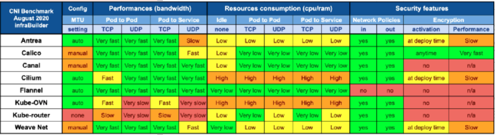

参考：<https://kubernetes.io/zh/docs/concepts/cluster-administration/addons/>

Flannel 的缺点之一是缺乏高级功能，例如配置网络策略和防火墙的能力。因此 Flannel 是 Kubernetes 集群网络的一个很好的入门级选择，但是，如果你正在寻找高级网络功能，你可能需要考虑其他 CNI 选项，例如 Calico。

#### 配置网络策略 Flannel

root用户：使用[Flannel](https://github.com/flannel-io/flannel#deploying-flannel-manually) 配置，执行：

><https://gitee.com/k8s_s/flannel/blob/master/Documentation/kube-flannel.yml>
>
><https://gitee.com/k8s_s/flannel/blob/v0.17.0/Documentation/kube-flannel.yml>
>
><https://gitee.com/k8s_s/flannel/blob/v0.19.1/Documentation/kube-flannel.yml>
>
>kubectl apply -f kube-flannel-0.19.1.yml
>
>删除：kubectl delete -f kube-flannel-0.19.1.yml

##### kube-flannel.yml 镜像版本

```yaml
（flannel版本）---（flannel-cni-plugin镜像版本）---（flannel镜像版本）
### v0.15.1-v0.16.1：：：：：：v1.0.0、v0.15.1
### v0.16.2-v0.16.3：：：：：：v1.0.1、v0.16.1
### v0.17.0：：：：：：v1.0.1、v0.16.3
### v0.18.0：：：：：：v1.1.0、v0.18.0
### v0.18.1：：：：：：v1.1.0、v0.18.1
### v0.19.0：：：：：：v1.1.0、v0.18.1
### v0.19.1：：：：：：v1.1.0、v0.19.0

dkpull rancher/mirrored-flannelcni-flannel-cni-plugin:v1.1.0
dkpull rancher/mirrored-flannelcni-flannel:v0.19.0

docker tag rancher/mirrored-flannelcni-flannel-cni-plugin:v1.1.0 registry.cn-chengdu.aliyuncs.com/k8sjf/flannelcni-flannel-cni-plugin:v1.1.0
docker push registry.cn-chengdu.aliyuncs.com/k8sjf/flannelcni-flannel-cni-plugin:v1.1.0
docker rmi rancher/mirrored-flannelcni-flannel-cni-plugin:v1.1.0
------------------------
docker tag rancher/mirrored-flannelcni-flannel:v0.19.0 registry.cn-chengdu.aliyuncs.com/k8sjf/flannel:v0.19.0
docker push registry.cn-chengdu.aliyuncs.com/k8sjf/flannel:v0.19.0
docker rmi rancher/mirrored-flannelcni-flannel:v0.19.0

image修改：
registry.cn-chengdu.aliyuncs.com/k8sjf/flannelcni-flannel-cni-plugin:v1.1.0
registry.cn-chengdu.aliyuncs.com/k8sjf/flannel:v0.19.0
```

#### [kubectl 命令基础](https://blog.csdn.net/qq_42476834/article/details/121781274)

#### 查看

列出所有运行的Pod信息

列出Pod以及运行Pod节点信息。

```shell
[root@master-120 kubelet]# kubectl get pods
No resources found in default namespace.
[root@master-120 ~]# kubectl get pods -o wide
No resources found in default namespace.
```

查看所以节点 kg nodes

```shell
[root@master-120 kubelet]# kg nodes
NAME         STATUS   ROLES                  AGE   VERSION
master-120   Ready    control-plane,master   63m   v1.23.8
node-121     Ready    <none>                 58m   v1.23.8
node-122     Ready    <none>                 58m   v1.23.8
node-123     Ready    <none>                 58m   v1.23.8
```

查看命名空间 kubectl get ns

```shell
[root@master-120 kubelet]# kubectl get ns
NAME              STATUS   AGE
default           Active   63m
kube-node-lease   Active   63m
kube-public       Active   63m
kube-system       Active   63m
```

查看 pod 命名空间   kubectl get pods --all-namespaces -owide

```shell
[root@master ~]# kubectl get pods --all-namespaces
NAMESPACE      NAME                             READY   STATUS    RESTARTS   AGE
kube-flannel   kube-flannel-ds-kfd89            1/1     Running   0          4m50s
kube-flannel   kube-flannel-ds-n8fr9            1/1     Running   0          4m50s
kube-flannel   kube-flannel-ds-tfj78            1/1     Running   0          4m50s
kube-system    coredns-687d9f64f-b8cvf          1/1     Running   0          55m
kube-system    coredns-687d9f64f-d99x9          1/1     Running   0          55m
kube-system    etcd-master                      1/1     Running   0          55m
kube-system    kube-apiserver-master            1/1     Running   0          55m
kube-system    kube-controller-manager-master   1/1     Running   0          55m
kube-system    kube-proxy-6v2v9                 1/1     Running   0          51m
kube-system    kube-proxy-8z62f                 1/1     Running   0          52m
kube-system    kube-proxy-ch88v                 1/1     Running   0          55m
kube-system    kube-scheduler-master            1/1     Running   0          55m
```

kubectl get pods -n kube-system

```shell
[root@master-120 kubelet]# kubectl get pods -n kube-flannel
NAME                                 READY   STATUS    RESTARTS   AGE
kube-flannel-ds-44l8g                1/1     Running   0          48m
kube-flannel-ds-cf2zd                1/1     Running   0          48m
kube-flannel-ds-tkbnh                1/1     Running   0          48m
kube-flannel-ds-wxhk4                1/1     Running   0          48m
```

kubectl get pods -n kube-system -o wide

```shell
[root@master ~]# kubectl get pods -n kube-flannel -o wide
NAME                    READY   STATUS    RESTARTS   AGE     IP                NODE     NOMINATED NODE   READINESS GATES
kube-flannel-ds-kfd89   1/1     Running   0          4m15s   192.168.100.132   node2    <none>           <none>
kube-flannel-ds-n8fr9   1/1     Running   0          4m15s   192.168.100.130   master   <none>           <none>
kube-flannel-ds-tfj78   1/1     Running   0          4m15s   192.168.100.131   node1    <none>           <none>
```

**kube-flannel-ds-xxxx 必须运行OK**

### E、可视化查看 Kubernetes资源

文档：<https://kuboard.cn/install/install-k8s-dashboard.html>

#### 1、dashboard（不推荐）

><https://github.com/kubernetes/dashboard/releases/tag/v2.4.0>
>
>kubectl apply -f <https://gitee.com/k8s_s/dashboard1/blob/v2.4.0/aio/deploy/recommended.yaml> -o yaml > dashboard.yaml

#### 2、KubeSphere（推荐）

[跳转到 KubeSphere 安装](./kube-sphere)

[github kubesphere](https://github.com/kubesphere/kubesphere)，star: 9.8+K

#### 3、Kuboard

<https://kuboard.cn/overview/>

[Github kuboard](https://github.com/eip-work/kuboard-press) stars 14.5+K

#### 4、KubeOperator


## 3）、k8s入门

后期直接到这里开始吧：[使用 [apps +暴露Service port] 的 yaml 格式](#apps+expose-port)

**资源包括(不区分大小写)：pod（po），service（svc），replication controller（rc），deployment（deploy），replica set（rs）**

具体命令请看：[k8s-alias](./setting-alias.md)

### kubectl get po

```bash
[root@master-120 ~]# kubectl get po
NAME                      READY   STATUS    RESTARTS      AGE
nginx-689b55fcd-2c8v8     1/1     Running   1 (19h ago)   19h
nginx-689b55fcd-5qpkp     1/1     Running   1 (19h ago)   19h
nginx-689b55fcd-gpdqz     1/1     Running   1 (19h ago)   19h
tomcat-549f8d66bc-bln66   1/1     Running   1 (19h ago)   19h
tomcat-549f8d66bc-rqhvm   1/1     Running   1 (19h ago)   19h
tomcat-549f8d66bc-zkc94   1/1     Running   1 (19h ago)   19h
```

### kubectl get svc

```bash
[root@master-120 ~]# kubectl get svc
NAME         TYPE        CLUSTER-IP     EXTERNAL-IP   PORT(S)    AGE
kubernetes   ClusterIP   10.96.0.1      <none>        443/TCP    29h
nginx        ClusterIP   10.96.99.230   <none>        8000/TCP   19h
tomcat       ClusterIP   10.96.102.96   <none>        8001/TCP   19h
```

### kubectl get rc

```bash
No resources found in default namespace.
```

### kubectl get deploy

```bash
[root@master-120 ~]# kubectl get deploy
NAME     READY   UP-TO-DATE   AVAILABLE   AGE
nginx    3/3     3            3           19h
tomcat   3/3     3            3           19h
```

### kubectl get rs

```bash
[root@master-120 ~]# kubectl get rs
NAME                DESIRED   CURRENT   READY   AGE
nginx-689b55fcd     3         3         3       19h
tomcat-549f8d66bc   3         3         3       19h
```

### A、基本命令

#### 1、创建apps：create deployment

master安装tomcat

##### kubectl create deployment tomcat6 --image=tomcat:6.0.53-jre8

#### 2、查看 kg all

```shell
a1@node01:~/k8s$ kubectl get all
NAME                           READY   STATUS              RESTARTS     AGE
pod/tomcat6-56fcc999cb-47vfm   0/1     ContainerCreating      0         23s
NAME                 TYPE        CLUSTER-IP   EXTERNAL-IP   PORT(S)      AGE
service/kubernetes   ClusterIP   10.96.0.1    <none>        443/TCP     115m
NAME                      READY   UP-TO-DATE   AVAILABLE        AGE
deployment.apps/tomcat6   0/1       1             0               23s
NAME                                 DESIRED   CURRENT   READY     AGE
replicaset.apps/tomcat6-56fcc999cb   1         1         0         23s
```

#### 3、查看详细 kg all -o wide

tomcat6在节点node2---docker下载镜像ok


在node2查看


#### 4、查看 kg pod -o wide

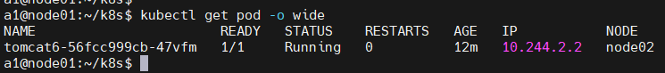

##### node02模拟宕机，看看k8s怎么处理（dkstop与node02关机）


发现node2节点已经不行了，全部压力到了node3


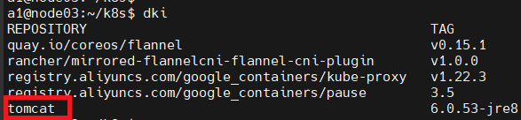

##### 重启 node02

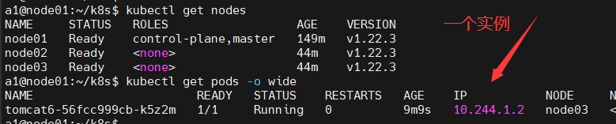

#### 5、暴露 port ：expose

> expose (-f FILENAME | TYPE NAME) [--port=port] [--protocol=TCP|UDP] [--target-port=number-or-name] [--name=name] [--external-ip=external-ip-of-service] [--type=type]

```shell
kubectl expose rc nginx --port=80 --target-port=8080
kubectl expose deploy tomcat6 --port=80 --target-port=8080 --type=NodePort
```


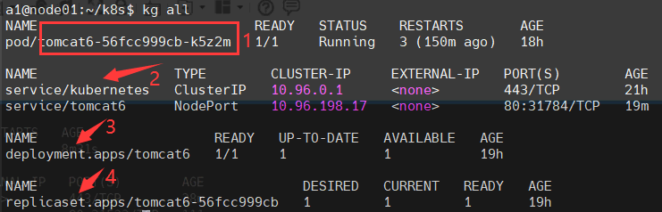

<http://192.168.100.131:31002/>

#### 6、修改 port：edit

> kubectl edit svc tomcat6 ###修改app应用服务的port
>
> kubectl edit deploy tomcat6 ### 修改app应用

#### 7、扩容或缩容：scale

>scale [--resource-version=version] [--current-replicas=count] --replicas=COUNT (-f FILENAME | TYPE NAME)

将名为tomcat6中的pod副本数设置为3。

```
kubectl scale --replicas=3 deployment tomcat6
kg pods -o wide
```


如果当前副本数为2，则将其扩展至3。

```
kubectl scale --current-replicas=2 --replicas=3 deployment/tomcat6
```

#### 8、删除以 create deployment 部署的(apps、service) delete

> kubectl  get all
>
> kubectl delete deployment.apps/tomcat6
>
> kubectl delete service/tomcat6


#### 9、部署&删除以 yaml 部署的实例

[查看 xxx.yaml](#xxx.yaml)

##### kubectl apply -f xxx.yaml

##### kubectl delete -f xxx.yaml


### B、yaml & 基本使用

<https://kubernetes.io/zh/docs/reference/kubectl/overview/>

后期使用：[# apps+expose-port](#apps+expose-port)，而不是使用 [# 初级使用yaml创建apps](#初级使用yaml创建apps)

#### Pod 模版

一般不会自己创建

```yaml
apiVersion: v1
kind: Pod
metadata:
  labels:
    app: tomcat9-02
  name: tomcat9-02
  namespace: default
spec:
  containers:
  - image: tomcat:6.0.53-jre8
    imagePullPolicy: IfNotPresent
    name: tomcat9-02
  - image: nginx
    imagePullPolicy: IfNotPresent
    name: nginx
```

#### Deployment 模版

```yaml
apiVersion: apps/v1
kind: Deployment
metadata:
  labels:
    app: tomcat601
  name: tomcat601-deployment
spec:
  #replicas复制几份
  replicas: 2 
  selector:
    matchLabels:
      app: tomcat601
  template:
    #Pod模板
    metadata:
      labels:
        app: tomcat601
    spec:
      containers:
      - image: tomcat:6.0.53-jre8
        name: tomcat601
        imagePullPolicy: IfNotPresent
```

```yaml
apiVersion: apps/v1
kind: Deployment
metadata:
  name: nginx-deployment
  labels:
    app: nginx
spec:
  replicas: 3
  selector:
    matchLabels:
      app: nginx
  template:
  #Pod模板
    metadata:
      labels:
        app: nginx
  #Pod模板规约：spec-指示 Pods 运行一个 nginx 容器
    spec:
      containers:
      - name: nginx
        image: nginx:1.14.2
        imagePullPolicy: IfNotPresent
        ports:
        - containerPort: 80
```

#### Service 模版

```yaml
apiVersion: v1
kind: Service
metadata:
  labels:
    app: tomcat601
  name: tomcat601-xxx-jp3sk
  namespace: default
spec:
  ports:
  #- NodePort: 30965
  - port: 80
    protocol: TCP
    targetPort: 8080
  selector:
    app: tomcat601
  type: NodePort
```

#### 1、初级使用yaml创建apps<a name="初级使用yaml创建apps"></a>（后期不使用这种方式）

```shell
# 使用 example-service.yaml 中的定义创建服务。
kubectl apply -f example-service.yaml

# 使用 example-controller.yaml 中的定义创建 replication controller。
kubectl apply -f example-controller.yaml

# 使用 <directory> 路径下的任意 .yaml, .yml, 或 .json 文件 创建对象。
kubectl apply -f <directory>
```

查看并保存 Deployment 的 yaml 文件（--dry-run）

> --dry-run：仅查看不运行
>
> kubectl create deployment 服务名称--image=镜像名称 --dry-run -o yaml > 保存目标
>
> kubectl create deployment tomcat6 --image=tomcat:6.0.53-jre8 --dry-run -o yaml > tomcat6.yaml

```yaml
apiVersion: apps/v1
kind: Deployment
metadata:
  labels:
    app: tomcat6
  name: tomcat6
spec:
  replicas: 2
  selector:
    matchLabels:
      app: tomcat6
  template:
    metadata:
      labels:
        app: tomcat6
    spec:
      containers:
      - image: tomcat:6.0.53-jre8
        name: tomcat
```

创建 Deployment apps：kubectl apply -f tomcat6.yaml

kubectl get deployments

更新 Deployment

```shell
kubectl set image deployment.v1.apps/tomcat6 tomcat=tomcat:9.0.53-jre8
或
kubectl set image deployment/tomcat6 tomcat=tomcat:9.0.53-jre8
```

回滚 Deployment

```shell
kubectl set image deployment/tomcat6 tomcat=tomcat:9.0.53-jre8 --record=true
```

暴露 service 端口：kubectl expose deploy tomcat6 --port=80 --target-port=8080 --type=NodePort

查看 Pod（kg all ，kg pods -o wide，kg pod xx -o yaml）

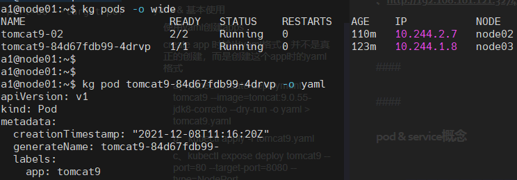

```yaml
apiVersion: v1
kind: Pod
metadata:
  labels:
    app: tomcat6
    pod-template-hash: 56fcc999cb
  name: tomcat6-56fcc999cb-nm2nx
  namespace: default
  ownerReferences:
  - apiVersion: apps/v1
    blockOwnerDeletion: true
    controller: true
    kind: ReplicaSet
    name: tomcat6-56fcc999cb
    uid: 28633fd6-b3ee-45aa-93d5-fb8931735029
  resourceVersion: "47929"
  uid: 59333abe-6a24-4995-888b-88577fef9559
spec:
  containers:
  - image: tomcat:6.0.53-jre8
    imagePullPolicy: IfNotPresent
    name: tomcat
... ...
```

自己创建 pod（.yaml）文件

Pod 通常不是直接创建的，而是使用工作负载资源创建的。

```yaml
apiVersion: v1
kind: Pod
metadata:
  labels:
   #实例名称
    app: tomcat601
  #容器名称  
  name:  tomcat6-xxx-wzfj2
  #命名空间
  namespace: default
spec:
  #容器
  containers:
  - image: tomcat:6.0.53-jre8
    imagePullPolicy: IfNotPresent
    name: tomcat601
  - image: nginx
    imagePullPolicy: IfNotPresent
    name: nginx
```

kubectl apply -f myPod.yaml

查看 Service（kg svc tomcat6 -o  yaml）

```yaml
apiVersion: v1
kind: Service
metadata:
  creationTimestamp: "2021-12-08T13:41:18Z"
  labels:
    app: tomcat6
  name: tomcat6
  namespace: default
  resourceVersion: "48461"
  uid: b4ebfb65-4e0c-478a-8e85-f03acef2d166
spec:
  clusterIP: 10.96.126.87
  clusterIPs:
  - 10.96.126.87
  externalTrafficPolicy: Cluster
  internalTrafficPolicy: Cluster
  ipFamilies:
  - IPv4
  ipFamilyPolicy: SingleStack
  ports:
  - nodePort: 31005 #暴露给外部使用port
    port: 80
    protocol: TCP
    targetPort: 8080
  selector:
    app: tomcat6
  sessionAffinity: None
  type: NodePort
status:
  loadBalancer: {}
```

查看 Deployment-apps（kg deploy tomcat6 -o  yaml）

```yaml
apiVersion: apps/v1
kind: Deployment
metadata:
  labels:
    app: tomcat6
  name: tomcat6
  namespace: default
  ...
spec:
  replicas: 2
  selector:
    matchLabels:
      app: tomcat6
  template:
    metadata:
      labels:
        app: tomcat6
    spec:
      containers:
      - image: tomcat:6.0.53-jre8
        imagePullPolicy: IfNotPresent
        name: tomcat
        terminationMessagePath: /dev/termination-log
        terminationMessagePolicy: File
   ....
status:
    ...
```

查看 Deployment 上线状态`kubectl rollout status deployment/nginx-deployment`

校验：<http://192.168.100.130:80/>

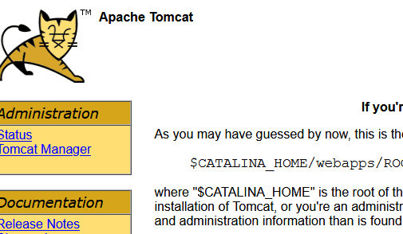

#### 2、使用 [apps +暴露Service port] 的 yaml 格式（使用这个，不使用[# 初级使用yaml创建apps](#初级使用yaml创建apps)）=========推荐========<a name="apps+expose-port"></a>

##### 安装 Deployment（apps ）与暴露Service（expose-port ）在同一个yaml文件里设置，通过`---`分隔

xxx.yaml<a name="xxx.yaml"></a>

::: details 点击查看代码

```yaml
apiVersion: apps/v1
kind: Deployment
metadata:
  labels:
    app: tomcat
  name: tomcat
spec:
  replicas: 3
  selector:
    matchLabels:
      app: tomcat
  template:
    metadata:
      labels:
        app: tomcat
    spec:
      containers:
      - name: tomcat
        image: registry.cn-chengdu.aliyuncs.com/k8sjf/tomcat:9.0.62-jre11-temurin-focal
        ports:
        - containerPort: 8080
        imagePullPolicy: IfNotPresent
---
apiVersion: v1
kind: Service
metadata:
  labels:
    app: tomcat
  name: tomcat
  namespace: default
spec:
  ports:
  - port: 80
    protocol: TCP
    targetPort: 8080
  selector:
    app: tomcat
  type: NodePort
```

:::

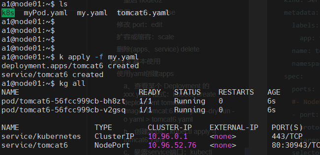

### C、Deployment & service 概念


#### pod & service


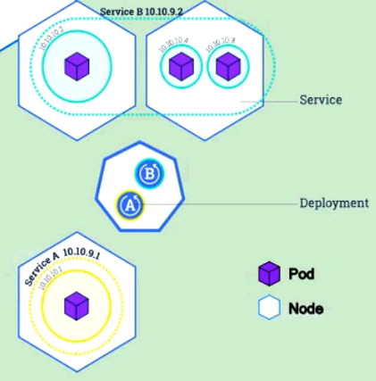

将一组pod公开为网络服务，通过service代理，可以实现负载均衡

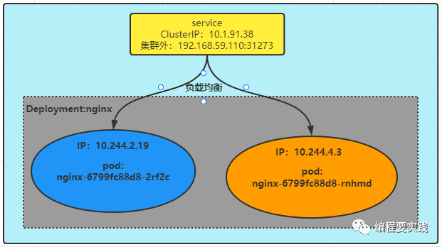

#### ClusterIP

此方式只能在集群内访问

#### label & selector

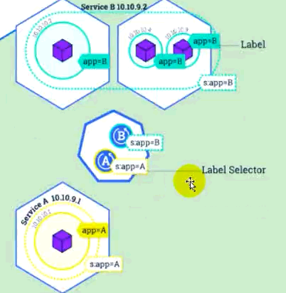

通讯1


通讯2


#### 说明

> 一个集群后多台mster、node，一个节点node，里面有多个Pod，一个Pod里可能有多个服务，各个Pod通过service暴露port给其他Pod、node之间是互通，通过controller来管理使用Pod资源。

node -> pod ->  service -> controller
