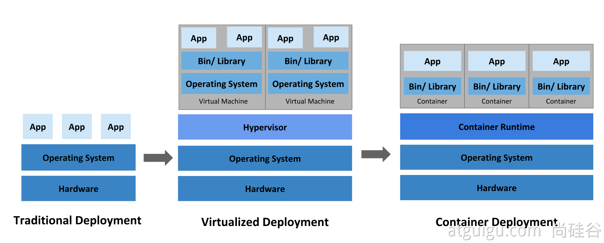
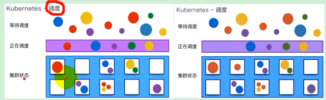
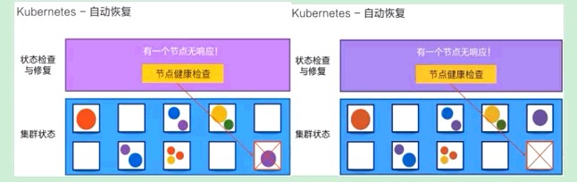
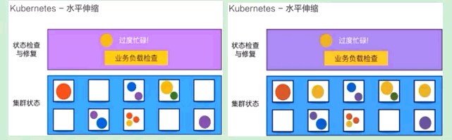
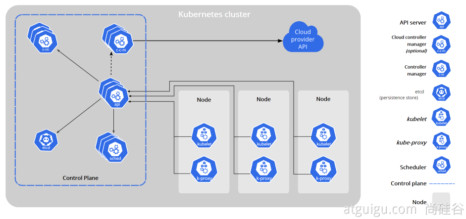
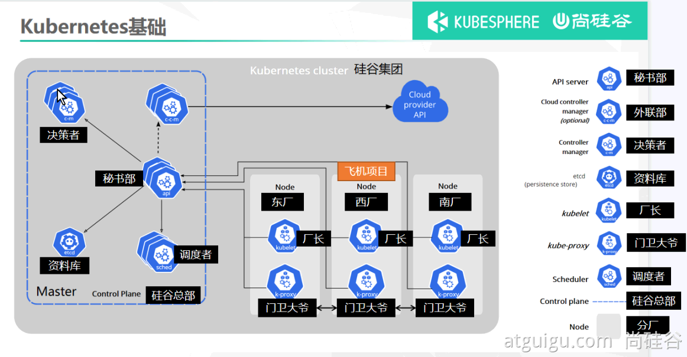

k8s 集群

<!-- more -->

中文社区: <https://www.kubernetes.org.cn/>

官方文档: <https://kubernetes.io/zh/docs/home/>

社区文档: <http://docs.kubernetes.org.cn/>

[历史版本 Release History](https://kubernetes.io/releases/)

[客户端下载 github](https://github.com/kubernetes/kubernetes/tree/master/CHANGELOG)

## 概念

**传统部署时代**

**虚拟化部署时代**

**容器部署时代**

好处：

- **敏捷应用程序的创建和部署**：与使用 VM 镜像相比，提高了容器镜像创建的简便性和效率。
- **持续开发、集成和部署**：通过快速简单的回滚(由于镜像不可变性)，提供可靠且频繁的容器镜像构建和部署。
- **关注开发与运维的分离**：在构建/发布时而不是在部署时创建应用程序容器镜像，从而将应用程序与基础架构分离。
- **可观察性**：不仅可以显示操作系统级别的信息和指标，还可以显示应用程序的运行状况和其他指标信号。
- **跨开发、测试和生产的环境一致性**：在便携式计算机上与在云中相同地运行。
- **云和操作系统分发的可移植性**：可在 Ubuntu、RHEL、CoreOS、本地、Google Kubernetes Engine 和其他任何地方运行。
- **以应用程序为中心的管理**：提高抽象级别，从在虚拟硬件上运行 OS 到使用逻辑资源在 OS 上运行应用程序。
- **松散耦合、分布式、弹性、解放的微服务**：应用程序被分解成较小的独立部分，并且可以动态部署和管理 - 而不是在一台大型单机上整体运行。
- **资源隔离**：可预测的应用程序性能。
- **资源利用**：高效率和高密度

## [为什么需要 Kubernetes，它能做什么?](https://v1-18.docs.kubernetes.io/zh/docs/concepts/overview/what-is-kubernetes/#为什么需要-kubernetes-它能做什么)

### 简介：调度、自动修复、水平伸缩

## 组件架构

### kube-apiserver

API 服务器是 Kubernetes [控制面](https://kubernetes.io/zh/docs/reference/glossary/?all=true#term-control-plane)的组件， 该组件公开了 Kubernetes API。

### etcd

etcd 是兼具一致性和高可用性的键值数据库，可以作为保存 Kubernetes 所有集群数据的后台数据库。

### kube-scheduler

控制平面组件，负责监视新创建的、未指定运行[节点（node）](https://kubernetes.io/zh/docs/concepts/architecture/nodes/)的 [Pods](https://kubernetes.io/docs/concepts/workloads/pods/pod-overview/)，选择节点让 Pod 在上面运行。

### kube-controller-manager

在主节点上运行 [控制器](https://kubernetes.io/zh/docs/concepts/architecture/controller/) 的组件

这些控制器包括:

- **节点控制器（Node Controller）**: 负责在节点出现故障时进行通知和响应
- **任务控制器（Job controller）**: 监测代表一次性任务的 Job 对象，然后创建 Pods 来运行这些任务直至完成
- **端点控制器（Endpoints Controller）**: 填充端点(Endpoints)对象(即加入 Service 与 Pod)
- **服务帐户和令牌控制器（Service Account & Token Controllers）**: 为新的命名空间创建默认帐户和 API 访问令牌

### cloud-controller-manager

云控制器管理器是指嵌入特定云的控制逻辑的 [控制平面](https://kubernetes.io/zh/docs/reference/glossary/?all=true#term-control-plane)组件

下面的控制器都包含对云平台驱动的依赖：

- **节点控制器（Node Controller）**: 用于在节点终止响应后检查云提供商以确定节点是否已被删除
- **路由控制器（Route Controller）**: 用于在底层云基础架构中设置路由
- **服务控制器（Service Controller）**: 用于创建、更新和删除云提供商负载均衡器

## Node 组件

### kubelet

一个在集群中每个节点（node）上运行的代理。 它保证容器containers都运行在 Pod 中。

### kube-proxy

是集群中每个节点上运行的网络代理

