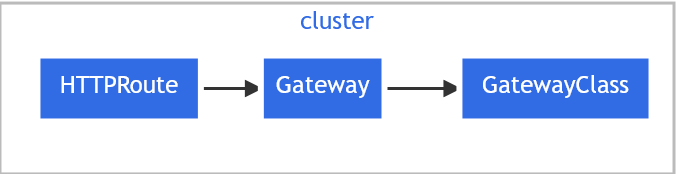
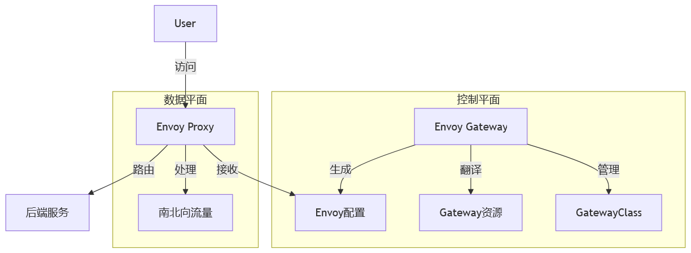
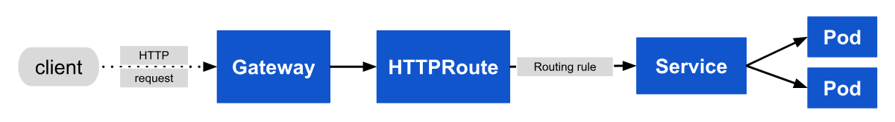
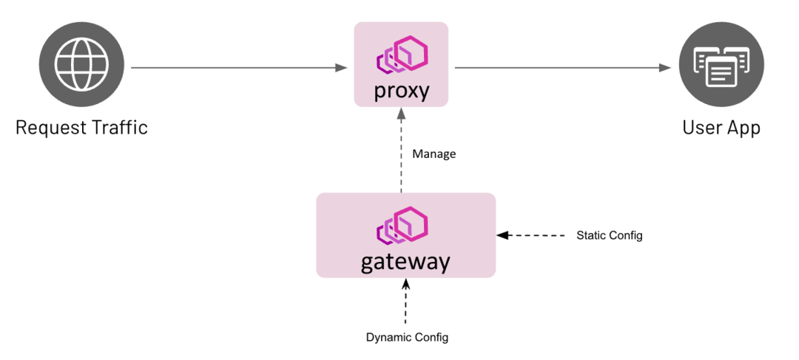

ingress-nginx 于 2026.3月Ingress退休，使用GatewayAPI替代

<!-- more -->

# GatewayAPI

## API资源模型

Gateway API 具有四种稳定的 API 类别：

  - **GatewayClass：** 定义一组具有配置相同的网关，由实现该类的控制器管理。
  - **Gateway：** 定义流量处理基础设施（例如云负载均衡器）的一个实例。
  - **Route：**
  - - **HTTPRoute**：定义特定于 HTTP 的路由规则，用于将流量从 Gateway 监听器映射到后端网络端点的某种呈现。这些端点通常表示为 Service。
  - - **GRPCRoute**：定义特定于 GRPC 的路由规则，同↑↑↑↑*HTTPRoute*。
  - - TCPRoute：定义特定于 TCP 的路由规则，同↑↑↑↑。
  - - UDPRoute：定义特定于 UDP 的路由规则，同↑↑↑↑。
  - - TLSRoute：定义特定于 TLS 的路由规则，同↑↑↑↑。

一个 Gateway 对象只能与一个 GatewayClass 相关联；GatewayClass 是负责管理 Gateway 的网关控制器。

各个（多个）路由类别（如 HTTPRoute）可以关联到此 Gateway 对象。Gateway 可以对能够挂接到其 listeners 的路由进行过滤，从而与路由形成双向信任模型。





## Gateway API 相比 Ingress 的优势

| 特性       | Ingress              | Gateway API                                                  |
| ---------- | -------------------- | ------------------------------------------------------------ |
| API 版本   | v1                   | v1 (稳定版)                                                  |
| 路由能力   | 基础的路径和主机路由 | 支持权重路由、流量镜像、路径、方法、头部、查询参数等多种路由规则 |
| 多团队支持 | 有限，需要额外配置   | 内置的 RBAC 集成和所有权模型                                 |
| 扩展性     | 依赖注解，不标准     | 标准的扩展机制                                               |
| 流量类型   | 主要支持 HTTP/HTTPS  | 支持 HTTP/HTTPS、TCP、UDP、TLS等多种协议                     |
| 策略管理   | 分散在各个资源中     | 集中的策略定义和复用                                         |
| 实现状态   | 广泛实现             | 主流 ingress 控制器已支持                                    |


### GatewayClass

Gateway 可以由不同的控制器(GatewayClass)实现。 Gateway 必须引用 GatewayClass，而后者中包含实现该类的控制器的名称(gatewayClassName)。

示例：

```yaml
apiVersion: gateway.networking.k8s.io/v1
kind: GatewayClass
metadata:
  name: aniuger-class
spec:
  controllerName: aniuger.com/gatewayclass-controller
```

实现了 Gateway API 的控制器被配置为管理 GatewayClass 对象，这些对象的控制器名为 `aniuger.com/gateway-controller`。归属于此类的 Gateway 对象将由此实现的控制器来管理。


### Gateway

- 多 Listener 多端口 原生支持
- *ingress 只能监听一个 80/443*
- Gateway 支持：•多个端口；•多协议；•多 TLS 配置；•同一个网关下多个Route。

Gateway 用来描述流量处理基础设施的一个实例。

示例：

```yaml
apiVersion: gateway.networking.k8s.io/v1
kind: Gateway
metadata:
  name: aniuger-gateway
  namespace: aniuger-namespace
spec:
  gatewayClassName: aniuger-class
  listeners:
  - name: http
    protocol: HTTP
    port: 80
    hostname: "www.aniuger.com"
    allowedRoutes:
      namespaces:
        from: Same
```

*from: Same*  仅同一命名空间内的路由可被该网关使用。

在此示例中，流量处理基础设施的实例被编程为监听 80 端口上的 HTTP 流量。由于未指定 addresses 字段，因此对应实现的控制器负责将地址或主机名设置到 Gateway 之上。该地址用作网络端点，用于处理路由中定义的后端网络端点的流量。

### HTTPRoute

HTTPRoute 类别指定从 Gateway 监听器到后端网络端点的 HTTP 请求的路由行为。

示例：

```yaml
apiVersion: gateway.networking.k8s.io/v1
kind: HTTPRoute
metadata:
  name: aniuger-httproute
spec:
  parentRefs:
  - name: aniuger-gateway
  hostnames:
  - "www.aniuger.com"
  rules:
  - matches:
    - path:
        type: PathPrefix
        value: /login
    backendRefs:
    - name: aniuger-svc
      port: 8080
```

如果 Host: 的标头设置为 `www.aniuger.com` 且请求路径指定为 `/login`；`http://www.aniuger.com/login` 将被路由到 Service `aniuger-svc` 的 8080 端口


### GRPCRoute

[GRPCRoute 参考文档](https://gateway-api.sigs.k8s.io/reference/spec/#grpcroute)

GRPCRoute 类别给出将 gRPC 请求从 Gateway 监听器转发到**后端服务**的路由行为。

示例：

```yaml
apiVersion: gateway.networking.k8s.io/v1
kind: GRPCRoute
metadata:
  name: aniuger-grpcroute
spec:
  parentRefs:
  - name: aniuger-gateway
  hostnames:
  - "svc.aniuger.com"
  rules:
  - backendRefs:
    - name: aniuger-svc
      port: 50051
```

来自 Gateway `aniuger-gateway` 且主机设置为 `svc.aniuger.com` 的 gRPC 流量将被定向到同一名字空间中 `aniuger-svc` 服务的 50051 端口上。

GRPCRoute 允许匹配特定的 gRPC 服务（访问特定的后端**接口方法** `com.aniuger.User.Login`），如下：

```yaml {2-5}
  rules:
  - matches:
    - method:
        service: com.aniuger
        method: Login
    backendRefs: 
    - name: aniuger-svc
      port: 50051
```

GRPCRoute 将匹配发往 `svc.aniuger.com` 的所有流量，并应用其路由规则将流量转发到正确的后端。由于仅指定了一个匹配条件，只有发往 `svc.aniuger.com` 的 `com.aniuger.User.Login` 方法请求会被转发。其他请求方法的 RPC 调用都不会被此路由匹配。

### 请求数据流



在此示例中，实现为反向代理的 Gateway 的请求数据流如下：

- 1.客户端开始准备 URL 为 `http://www.aniuger.com` 的 HTTP 请求。
- 2.客户端的 DNS 解析器查询目标名称并了解与 Gateway 关联的一个或多个 IP 地址的映射。
- 3.客户端向 Gateway IP 地址发送请求；反向代理接收 HTTP 请求并使用 Host: 标头来匹配基于 Gateway 和附加的 HTTPRoute 所获得的配置。
- 4.可选的，反向代理可以根据 HTTPRoute 的匹配规则进行请求头和（或）路径匹配。
- 5.可选地，反向代理可以修改请求；例如，根据 HTTPRoute 的过滤规则添加或删除标头。
- 6.最后，反向代理将请求转发到一个或多个后端


## Gateway API 控制器选择

| 控制器                      | 内核                 | 优点                               | 场景                   |
| --------------------------- | -------------------- | ---------------------------------- | ---------------------- |
| **Envoy Gateway**（官方推荐）   | Envoy Proxy          | 性能极高；安全；企业级；社区驱动强 | 生产强负载、平台化使用 |
| Istio | | | |
| Kong Gateway                | Kong + Envoy（可选） | API 网关能力强，插件丰富           | 微服务 API 场景        |
| HAProxy Unified Gateway     | HAProxy              | 性能强、稳定、易部署               | 传统 LB 场景、私有云   |
| Traefik Hub / Traefik Proxy | Traefik              | 部署最简单、支持多源               | 中小团队、轻量场景     |
| Cilium Gateway              | eBPF                 | 低延迟、高吞吐、网络一致性         | 已用 Cilium CNI        |
| GKE Gateway API             | Google LB            | 云托管 LB                          | GKE 用户               |
| AWS Gateway API             | ALB/NLB              | 云托管 LB                          | EKS 用户               |


**Envoy Gateway架构：**



### 安装 GatewayAPI CRD

<https://github.com/kubernetes-sigs/gateway-api/releases/>

```shell :collapsed-lines=13
# 由于实验通道 CRD 体积过大，使用 --server-side=true 代替

# 安装标准的功能：
wget -O gateway-api-standard.yaml wget https://github.com/kubernetes-sigs/gateway-api/releases/download/v1.5.1/standard-install.yaml
kubectl apply --server-side -f gateway-api-standard.yaml

# 如果需要使用实验性功能(如TCPRoute、UDPRoute、GRPCRoute等):
wget -O gateway-api-experimental.yaml https://github.com/kubernetes-sigs/gateway-api/releases/download/v1.5.1/experimental-install.yaml
kubectl apply --server-side=true -f gateway-api-experimental.yaml

root@master:~# kubectl apply --server-side=true -f gateway-api-experimental.yaml
customresourcedefinition.apiextensions.k8s.io/backendtlspolicies.gateway.networking.k8s.io serverside-applied
customresourcedefinition.apiextensions.k8s.io/gatewayclasses.gateway.networking.k8s.io serverside-applied
customresourcedefinition.apiextensions.k8s.io/gateways.gateway.networking.k8s.io serverside-applied
customresourcedefinition.apiextensions.k8s.io/grpcroutes.gateway.networking.k8s.io serverside-applied
customresourcedefinition.apiextensions.k8s.io/httproutes.gateway.networking.k8s.io serverside-applied
customresourcedefinition.apiextensions.k8s.io/listenersets.gateway.networking.k8s.io serverside-applied
customresourcedefinition.apiextensions.k8s.io/referencegrants.gateway.networking.k8s.io serverside-applied
customresourcedefinition.apiextensions.k8s.io/tcproutes.gateway.networking.k8s.io serverside-applied
customresourcedefinition.apiextensions.k8s.io/tlsroutes.gateway.networking.k8s.io serverside-applied
customresourcedefinition.apiextensions.k8s.io/udproutes.gateway.networking.k8s.io serverside-applied
validatingadmissionpolicy.admissionregistration.k8s.io/safe-upgrades.gateway.networking.k8s.io serverside-applied
validatingadmissionpolicybinding.admissionregistration.k8s.io/safe-upgrades.gateway.networking.k8s.io serverside-applied
customresourcedefinition.apiextensions.k8s.io/xbackendtrafficpolicies.gateway.networking.x-k8s.io serverside-applied
customresourcedefinition.apiextensions.k8s.io/xmeshes.gateway.networking.x-k8s.io serverside-applied
```

检查CRD安装：

```shell :collapsed-lines=8
root@master:~# kubectl get crd | grep gateway

backendtlspolicies.gateway.networking.k8s.io            2026-05-12T07:50:58Z
gatewayapis.operator.tigera.io                          2026-05-07T14:08:51Z
gatewayclasses.gateway.networking.k8s.io                2026-05-12T07:50:58Z
gateways.gateway.networking.k8s.io                      2026-05-12T07:50:58Z
grpcroutes.gateway.networking.k8s.io                    2026-05-12T07:50:58Z
httproutes.gateway.networking.k8s.io                    2026-05-12T07:50:58Z
listenersets.gateway.networking.k8s.io                  2026-05-12T07:50:58Z
referencegrants.gateway.networking.k8s.io               2026-05-12T07:50:58Z
tcproutes.gateway.networking.k8s.io                     2026-05-12T07:50:58Z
tlsroutes.gateway.networking.k8s.io                     2026-05-12T07:50:58Z
udproutes.gateway.networking.k8s.io                     2026-05-12T07:50:58Z
xbackendtrafficpolicies.gateway.networking.x-k8s.io     2026-05-12T07:50:58Z
xmeshes.gateway.networking.x-k8s.io                     2026-05-12T07:50:58Z
```

网络问题本地下载后上传：`scp E:\k8s集群\k8s-new-yaml\*.yaml root@master:/root/`, 添加权限：`chmod +x gateway*`


### 安装 Envoy Gateway

<https://github.com/envoyproxy/gateway/releases>

方式 A：快速部署

```shell
wget -O envoy-gateway-install.yaml https://github.com/envoyproxy/gateway/releases/download/v1.7.3/install.yaml
kubectl apply -f envoy-gateway-install.yaml
或 kubectl replace -f envoy-gateway-install.yaml
```

**方式 B：使用 Helm（推荐）** [helm安装](./helm.md)

```shell
charts gateway
helm repo add envoy-gateway https://gateway.envoyproxy.io
helm repo update
helm search repo envoy-gateway
# 如果已有CRDs的环境，使用 --skip-crds 忽略CRD
helm install eg envoy-gateway/envoy-gateway --version v1.7.3 -n envoy-gateway-system --create-namespace --skip-crds
```

等待部署：

```shell
kubectl wait --timeout=5m -n envoy-gateway-system deployment/envoy-gateway --for=condition=Available
```

### 对外暴露Service

**Ingress-nginx的暴露模式**

```
1.部署ingress-nginx-controller（控制平面）
↓
2.手动创建/暴露一个Service（LoadBalancer/NodePort）
↓
3.建多个Ingress资源（路由规则）
↓
4.所有Ingress共用同一个LoadBalancer IP
```

**GatewayAPI的暴露模式**

```
1.部署Envoy Gateway（控制平面，无需暴露）
↓
2.创建Gateway资源(定义监听器）
↓
3.系统自动创建 Envoy Proxy Deployment + Service(LoadBalancer)
↓
4.创建多个 HTTPRoute/GRPCRoute 资源（路由规则)
↓
5.所有 Route 通过 parentRef 引用同一个Gateway
↓
6.复用同一个 LoadBalancer IP
```

- envoy-gateway Service不需要暴露（仅供集群内部使用）。
- gateway资源会自动创建数据平面的Service(LoadBalancer)
- 多个HTTPRoute通过parentRefs引用同一个Gateway实现IP复用
- 成本: 1个Gateway=1个SLB/LoadBalancer

Gateway API 的控制器默认不创建对外 server，它只负责路由逻辑，需通过 **LoadBalancer/NodePort/MetalLB** 等手段配合实现

<https://metallb.io>


## 创建实例

### GatewayClass

```yaml
apiVersion: gateway.networking.k8s.io/v1
kind: GatewayClass
metadata:
  name: envoy
spec:
  controllerName: gateway.envoyproxy.io/gatewayclass-controller
```

```shell
root@master:~# kubectl apply -f gatewayclass.yaml
root@master:~# kubectl get gatewayclass
NAME    CONTROLLER                                      ACCEPTED   AGE
envoy   gateway.envoyproxy.io/gatewayclass-controller   True       30d
```

### Gateway

```yaml
apiVersion: gateway.networking.k8s.io/v1
kind: Gateway
metadata:
  name: eg
spec:
  gatewayClassName: envoy
  listeners:
    - name: http
      protocol: HTTP
      port: 80
      hostname: "www.aniuger.com"
```

- **name: eg** 是在 `helm install eg` 设定的envoy-gateway名称
- `kubectl apply -f gateway.yaml`

### HTTPRoute

```yaml
apiVersion: gateway.networking.k8s.io/v1
kind: HTTPRoute
metadata:
  name: myapp-route
spec:
  parentRefs:
  - name: eg
  hostnames:
  - "www.aniuger.com"
  rules:
  - matches:
    - path:
        type: PathPrefix
        value: /
    backendRefs:
    - name: myapp
      port: 80
```

`kubectl apply -f myapp-route.yaml`

**官方给的例子**

`kubectl apply -f https://github.com/envoyproxy/gateway/releases/download/v1.7.3/quickstart.yaml -n default`

