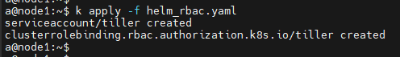

k8s 软件管理工具-Helm

<!-- more -->

# k8s-软件管理工具-Helm

**Helm 是 Kubernetes 的包管理器**

## Helm 版本选择

Helm版本支持策略: <https://helm.sh/zh/docs/topics/version_skew/>

| Helm 版本 | 支持的 Kubernetes 版本 |
|:-------:|:-----------------:|
|  3.12.x  |  1.27.x - 1.24.x  |
|  3.11.x  |  1.26.x - 1.23.x  |
|  3.10.x	 |  1.25.x - 1.22.x  |
|  3.9.x  |  1.24.x - 1.21.x  |
|  3.8.x  |  1.23.x - 1.20.x  |
|  3.7.x  |  1.22.x - 1.19.x  |
|  3.6.x  |  1.21.x - 1.18.x  |
|  3.5.x  |  1.20.x - 1.17.x  |
|  3.4.x  |  1.19.x - 1.16.x  |


## 安装 Helm3.9

[安装 Helm3.9](https://devopscube.com/install-configure-helm-kubernetes/)

说明文档：

[https://docs.helm.sh/zh/](https://docs.helm.sh/zh/)

[https://v3.helm.sh/zh/docs/](https://v3.helm.sh/zh/docs/)

下载：

[https://github.com/helm/helm](https://github.com/helm/helm)

[https://gitee.com/k8s_s/helm](https://gitee.com/k8s_s/helm)

[https://github.com/helm/helm/releases/v3.9.4](https://github.com/helm/helm/releases/v3.9.4)

[Helm 下载提取码：1234](https://pan.baidu.com/s/1mBoQNysvt2Jps49YV4y5yg)

### a、从sh文件安装 helm 3

**第一步：** 下载最新的 helm 安装脚本。 get_helm.sh可以修改：downloadFile()方法的 ==DOWNLOAD_URL== ：指定可以下载的helm文件地址

```bash
curl -fsSL -o get_helm3.sh https://raw.githubusercontent.com/helm/helm/main/scripts/get-helm-3
```

```shell
checkDesiredVersion方法返回：TAG="v3.9.4"
helm-${TAG}-${OS}-${ARCH}.换成 helm-v3.9.4-linux-amd64.
HELM_TMP_ROOT="$(mktemp -dt helm-installer-XXXXXX)" 换成 HELM_TMP_ROOT="helm-installer-T53LxQ"
local github_release_url="https://github.com/helm/helm/releases/download/${TAG}" 换成 https://github.com/helm/
手动下载：
curl -SsL https://github.com/helm/helm-v3.9.4-linux-amd64.tar.gz.sha256 -o /tmp/helm-installer-T53LxQ/helm-v3.9.4-linux-amd64.tar.gz.sha256
curl -SsL https://github.com/helm/helm-v3.9.4-linux-amd64.tar.gz -o /tmp/helm-installer-T53LxQ/helm-v3.9.4-linux-amd64.tar.gz
```

```
chmod 777 get_helm3.sh && chmod +x get_helm3.sh
```

```
./get_helm3.sh
```

```
helm |  helm version
```

### b、从二进制安装 Helm3

**第 1 步：** 前往：[https://github.com/helm/helm/releases/v3.9.4](https://github.com/helm/helm/releases/v3.9.4) 或者上面的地址

**第 2 步：** 使用 wget 下载二进制文件。

```shell
wget -O https://get.helm.sh/helm-v3.9.4-linux-amd64.tar.gz
```

**第 3 步：** 解压下载的文件。

```shell
  chmod -R 777 helm-v3.9.4-linux-amd64.tar.gz && tar -zxvf helm-v3.9.4-linux-amd64.tar.gz &&   chmod +x /root/linux-amd64/helm && cp /root/linux-amd64/helm /usr/bin/ && ln -s /usr/bin/helm /usr/local/bin/ && rm -rf /root/linux-amd64 && ls -all /usr/local/bin/helm && helm version
  
  chmod -R 777 helm-v3.8.2-linux-amd64.tar.gz && tar -zxvf helm-v3.8.2-linux-amd64.tar.gz &&   chmod +x /root/linux-amd64/helm && cp /root/linux-amd64/helm /usr/bin/ && ln -s /usr/bin/helm /usr/local/bin/ && rm -rf /root/linux-amd64 && ls -all /usr/local/bin/helm && helm version
```

**第 6 步：** 添加repo

[添加稳定的 repo](#Repo)

**第 7 步：** 查看存储类型

kg sc --all-namespaces

helm3 变化:

1. 去除Tiller 和 helm serve

2. 预定义仓库被移除，添加helm hub

helm search 现在区分 repo 和hub

repo 是自己手动添加的源

比如官方的有稳定版和在建设的

```shell
helm repo add stable https://kubernetes-charts.storage.googleapis.com
helm repo add incubator https://kubernetes-charts-incubator.storage.googleapis.com/
helm repo add ibmstable https://raw.githubusercontent.com/IBM/charts/master/repo/stable
# 此处 repo add 的时候，如果名称已存在了也不提醒，居然直接覆盖了，是bug吧
```

可以把 hub 和 google repo 配合起来食用，效果更佳

```
helm search hub mysql
```

3. Values 支持 JSON Schema 校验器

4. 代码复用 - Library Chart 支持

当一个 Chart 想要使用该 Library Chart内的一些模板时，可以在 Chart.yaml 的 dependencies 依赖项中指定

5. requirements.yaml 被整合到了 Chart.yaml 中，但格式保持不变

helm2/3 命令差异

#### 常用命令一览

| 命令            | Helm2 | Helm3 | 对应h3增强、区别  | 命令说明                      |
|---------------|-------|-------|------------|---------------------------|
| create        | 有     | 有     | 无          | 创建具有给定名称的新图表              |
| *delete*      | 有     | 无     | -          | 给定发布名称，从Kubernetes中删除该发布  |
| dependency    | 有     | 有     | 无          | 管理图表的依赖项                  |
| *fetch*       | 有     | 无     | - **pull** | 从存储库下载图表，并（可选）将其解压缩到本地目录中 |
| get           | 有     | 有     | 有          | 下载命名版本                    |
| history       | 有     | 有     | 无          | 获取发布历史记录                  |
| *home*        | 有     | 无     | - **env**  | 显示HELM_HOME的位置            |
| *init*        | 有     | 无     | -          | 在客户端和服务器上初始化Helm          |
| *inspect*     | 有     | 无     | - **show** | 查阅图表                      |
| install       | 有     | 有     | 有          | 安装图表存档                    |
| lint          | 有     | 有     | 无          | 检查图表中可能出现的问题              |
| list          | 有     | 有     | 无          | 列表发布                      |
| package       | 有     | 有     | 无          | 将图表目录打包到图表存档中             |
| plugin        | 有     | 有     | 有          | 添加、列出或删除头盔插件              |
| repo          | 有     | 有     | 无          | 添加、列出、删除、更新和索引图表存储库       |
| *reset*       | 有     | 无     | -          | 从集群卸载Tiller               |
| rollback      | 有     | 有     | 无          | 将发布回滚到以前的版本               |
| search        | 有     | 有     | 无          | 在图表中搜索关键字                 |
| *serve*       | 有     | 无     | -          | 启动本地http web服务器           |
| status        | 有     | 有     | 无          | 显示命名版本的状态                 |
| template      | 有     | 有     | 无          | 本地渲染模板                    |
| test          | 有     | 有     | 有          | 测试发布                      |
| upgrade       | 有     | 有     | 无          | 升级发行版                     |
| verify        | 有     | 有     | 无          | 验证给定路径上的图表是否已签名且有效        |
| version       | 有     | 有     | 有          | 打印客户端/服务器版本信息             |
| **env**       | 无     | 有     | -          | Helm客户端环境信息               |
| **help**      | 无     | 有     | -          | 关于任何命令的帮助                 |
| **pull**      | 无     | 有     | -          | 从存储库下载图表，并（可选）将其解压缩到本地目录中 |
| **show**      | 无     | 有     | -          | 显示图表的信息                   |
| **uninstall** | 无     | 有     | -          | 卸载发行版                     |
|               |       |       |            |                           |

- env是对被删除的命令home的强化
- pull是对被删除的命令fetch的替换
- show是对被删除的命令inspect的替换
- help命令本身在Helm 2时代就可以使用，只是helm --help里面没有显示，算是文档自包含的强化
- uninstall是功能特性的增强

Helm 3: 命令发生的变化

| 命令      | Helm 2 | Helm 3 | 命令说明区别 | Helm 2 命令说明   | Helm 3命令说明     |
|---------|--------|--------|--------|---------------|----------------|
| get     | 有      | 有      | 有      | 下载命名版本        | 下载命名版本的扩展信息    |
| install | 有      | 有      | 有      | 安装图表存档        | 安装图表           |
| plugin  | 有      | 有      | 有      | 添加、列出或删除头盔插件  | 安装、列出或卸载Helm插件 |
| test    | 有      | 有      | 有      | 测试发布          | 为发布运行测试        |
| version | 有      | 有      | 有      | 打印客户端/服务器版本信息 | 打印客户端版本信息      |

##### 安装 helm2

a、安装方法与 [helm3](#从二进制安装 Helm3) 相同

b、helm2 初始化安装(tiller服务) helm_rbac.yaml

```yaml
apiVersion: v1
kind: ServiceAccount
metadata:
  name: tiller
  namespace: kube-system
---
apiVersion: rbac.authorization.k8s.io/v1
kind: ClusterRoleBinding
metadata:
  name: tiller
roleRef:
  apiGroup: rbac.authorization.k8s.io
  kind: ClusterRole
  name: cluster-admin
subjects:
  - kind: ServiceAccount
    name: tiller
    namespace: kube-system
```

kubectl apply -f helm_rbac.yaml



### c、初始化 Helm2：部署 Tiller

```shell
helm init --service-account=tiller --tiller-image=registry.aliyuncs.com/google_containers/tiller:v2.16.12 --history-max 300
```

```shell
helm init -i registry.aliyuncs.com/google_containers/tiller:v2.16.12 --stable-repo-url http://mirror.azure.cn/kubernetes/charts/ --service-account tiller --override spec.selector.matchLabels.'name'='tiller',spec.selector.matchLabels.'app'='helm' --output yaml | sed 's@apiVersion: extensions/v1beta1@apiVersion: apps/v1@' | kubectl apply -f -
```

### 添加稳定的 Helm Repo <a name="Repo"></a>

```shell
# 添加阿里云的 chart 仓库
helm repo add aliyun https://kubernetes.oss-cn-hangzhou.aliyuncs.com/charts
helm repo add stable http://mirror.azure.cn/kubernetes/charts   推荐
helm repo add bitnami https://charts.bitnami.com/bitnami
删除：helm repo remove bitnami
# 更新chart仓库
a@node1:~$ helm repo update

# 查看配置的 chart 仓库有哪些
a@node1:~$ helm repo list
NAME    URL
aliyun  https://kubernetes.oss-cn-hangzhou.aliyuncs.com/charts
stable  http://mirror.azure.cn/kubernetes/charts

# 从指定 chart 仓库地址搜索 chart
a@node1:~$ helm search repo aliyun | grep redis
aliyun/redis                    1.1.15          4.0.8           Open source, advanced key-value store. It is of...
aliyun/redis-ha                 2.0.1                           Highly available Redis cluster with multiple se...

a@node1:~$ helm search repo stable | grep redis
stable/prometheus-redis-exporter        3.5.1           1.3.4                   DEPRECATED Prometheus exporter for Redis metrics
stable/redis                            10.5.7          5.0.7                   DEPRECATED Open source, advanced key-value stor...
stable/redis-ha                         4.4.6           5.0.6                   DEPRECATED - Highly available Kubernetes implem...

a@node1:~$ helm search repo bitnami | grep redis
bitnami/redis                                   15.6.4          6.2.6           Open source, advanced key-value store. It is of...
bitnami/redis-cluster                           7.0.13          6.2.6           Open source, advanced key-value store. It is of...
```
