k8s Ingress

<!-- more -->

# Ingress

## Ingress 基于域名访问，不需要通过ip：port访问服务

ingress：通过域名、负载均衡

ingress 底层是nginx

> 通过Service 发现Pod进行关联。基于域名访问。
>
> 通过Ingress Controller 实现Pod负载均衡。
>
> 支持TCP/UDP 4层负载均衡和HTTP 7层负载均衡。

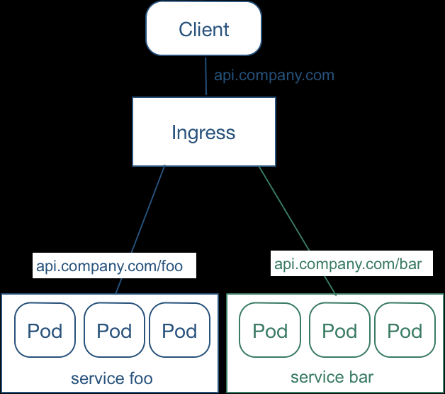

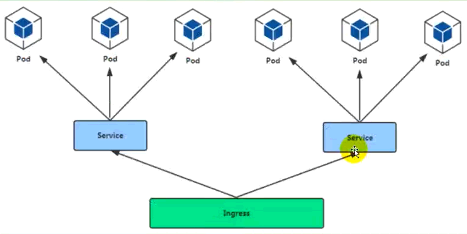

---

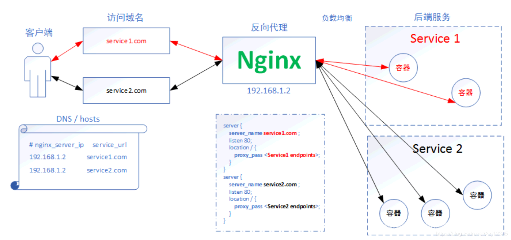

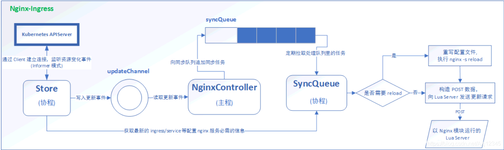

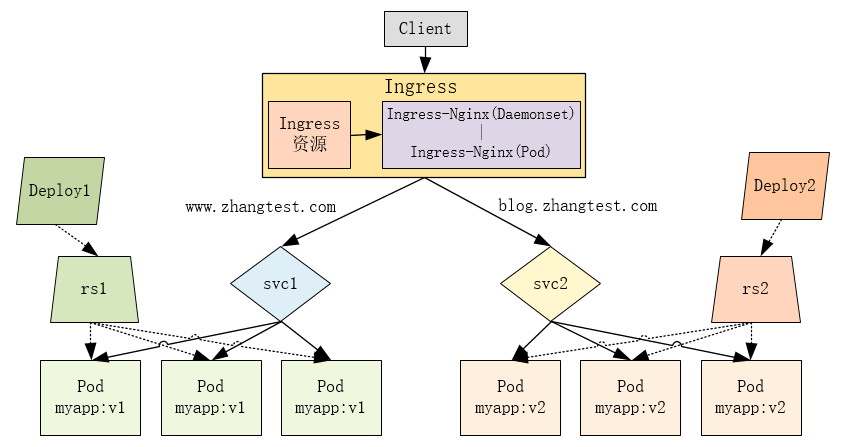

---

## 执行流程

> ingress-nginx-controller 对外提供80（NodePort）端口，外部访问80转到内部service的pod【k8s内部端口（ClusterIP）】
>
> web -》 ingress -》node：service -》 pod -》 具体程序app

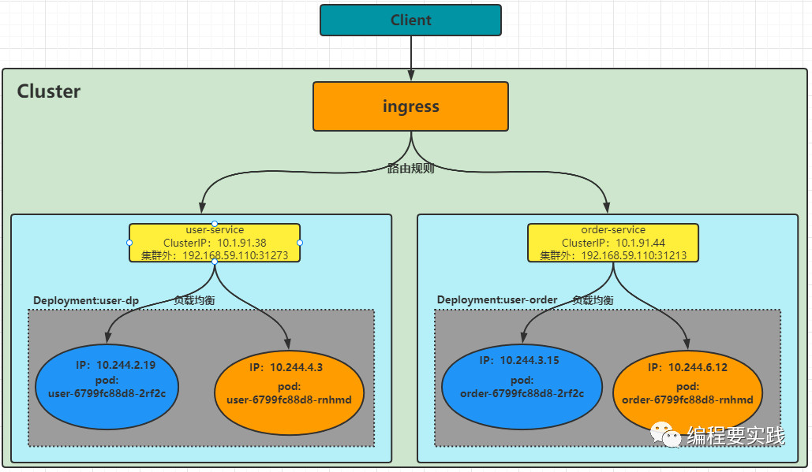

## Ingress 是什么？

[Ingress文档](https://kubernetes.io/zh/docs/concepts/services-networking/ingress/)

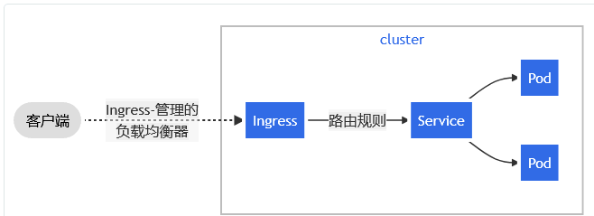

```yaml
apiVersion: networking.k8s.io/v1
kind: Ingress
metadata:
  name: ingress-wildcard-host
spec:
  rules:
  - host: "foo.bar.com"
    http:
      paths:
      - pathType: Prefix
        path: "/bar"
        backend:
          service:
            name: service1
            port:
              number: 80
  - host: "*.foo.com"
    http:
      paths:
      - pathType: Prefix
        path: "/foo"
        backend:
          service:
            name: service2
            port:
              number: 80
```

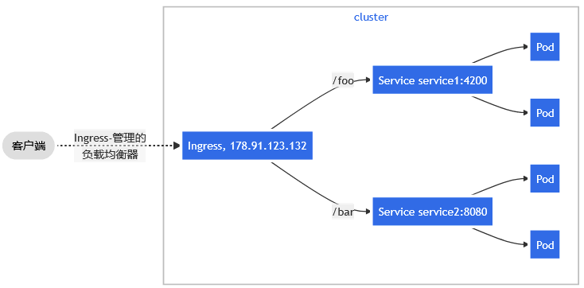

```yaml
apiVersion: networking.k8s.io/v1
kind: Ingress
metadata:
  name: simple-fanout-example
spec:
  rules:
  - host: foo.bar.com
    http:
      paths:
      - path: /foo
        pathType: Prefix
        backend:
          service:
            name: service1
            port:
              number: 4200
      - path: /bar
        pathType: Prefix
        backend:
          service:
            name: service2
            port:
              number: 8080
```

当你使用 `kubectl apply -f` 创建 Ingress 时：

```shell
kubectl describe ingress simple-fanout-example
```

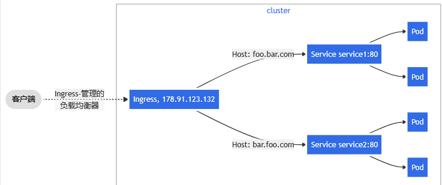

```yaml
apiVersion: networking.k8s.io/v1
kind: Ingress
metadata:
  name: name-virtual-host-ingress
spec:
  rules:
  - host: foo.bar.com
    http:
      paths:
      - pathType: Prefix
        path: "/"
        backend:
          service:
            name: service1
            port:
              number: 80
  - host: bar.foo.com
    http:
      paths:
      - pathType: Prefix
        path: "/"
        backend:
          service:
            name: service2
            port:
              number: 80
```

```yaml
apiVersion: networking.k8s.io/v1
kind: Ingress
metadata:
  name: name-virtual-host-ingress-no-third-host
spec:
  rules:
  - host: first.bar.com
    http:
      paths:
      - pathType: Prefix
        path: "/"
        backend:
          service:
            name: service1
            port:
              number: 80
  - host: second.bar.com
    http:
      paths:
      - pathType: Prefix
        path: "/"
        backend:
          service:
            name: service2
            port:
              number: 80
  - http:
      paths:
      - pathType: Prefix
        path: "/"
        backend:
          service:
            name: service3
            port:
              number: 80
```

## 版本关系

[kubernetes.github.io/ingress-nginx](https://kubernetes.github.io/ingress-nginx/)

[github.com/kubernetes/ingress-nginx](https://github.com/kubernetes/ingress-nginx/)

[gitee.com/k8s_s/ingress-nginx](https://gitee.com/k8s_s/ingress-nginx/)

| Ingress-NGINX version | k8s supported version        | Alpine Version | Nginx Version |
| --------------------- | ---------------------------- | -------------- | ------------- |
| v1.3.0                | 1.24, 1.23, 1.22, 1.21, 1.20 | 3.14.6         | 1.19.10†      |
| v1.2.1                | 1.23, 1.22, 1.21, 1.20, 1.19 | 3.14.6         | 1.19.10†      |
| v1.2.0                | 1.23, 1.22, 1.21, 1.20, 1.19 | 3.14.6         | 1.19.10†      |
| v1.1.3                | 1.23, 1.22, 1.21, 1.20, 1.19 | 3.14.4         | 1.19.10†      |
| v1.1.2                | 1.23, 1.22, 1.21, 1.20, 1.19 | 3.14.2         | 1.19.9†       |
| v1.1.1                | 1.23, 1.22, 1.21, 1.20, 1.19 | 3.14.2         | 1.19.9†       |
| v1.1.0                | 1.22, 1.21, 1.20, 1.19       | 3.14.2         | 1.19.9†       |
| v1.0.5                | 1.22, 1.21, 1.20, 1.19       | 3.14.2         | 1.19.9†       |
| v1.0.4                | 1.22, 1.21, 1.20, 1.19       | 3.14.2         | 1.19.9†       |
| v1.0.3                | 1.22, 1.21, 1.20, 1.19       | 3.14.2         | 1.19.9†       |
| v1.0.2                | 1.22, 1.21, 1.20, 1.19       | 3.14.2         | 1.19.9†       |
| v1.0.1                | 1.22, 1.21, 1.20, 1.19       | 3.14.2         | 1.19.9†       |
| v1.0.0                | 1.22, 1.21, 1.20, 1.19       | 3.13.5         | 1.20.1        |

**Ingress-nginx 版本选择**

><https://gitee.com/k8s_s/ingress-nginx/blob/controller-v1.1.3/deploy/static/provider/baremetal/1.22/deploy.yaml>
>
><https://gitee.com/k8s_s/ingress-nginx/blob/controller-v1.2.0/deploy/static/provider/baremetal/1.22/deploy.yaml>
>
><https://gitee.com/k8s_s/ingress-nginx/blob/controller-v1.3.0/deploy/static/provider/baremetal/1.22/deploy.yaml>

**V1.2.0-yaml 文件需要的版本镜像2个**

```bash
### V1.2.0
docker push registry.cn-chengdu.aliyuncs.com/jinfang/kube-webhook-certgen:v1.5.2
docker push registry.cn-chengdu.aliyuncs.com/jinfang/nginx-ingress-controller:1.2.0
--------------------------------------------------------------------------
### V1.3.0
docker pull wangshun1024/kube-webhook-certgen:v1.1.1
docker pull liangjw/kube-webhook-certgen:v1.1.1  （使用）
docker pull dyrnq/kube-webhook-certgen:v1.3.0
-------------
docker pull bitnami/nginx-ingress-controller:1.3.0
-------------------------------------
docker tag liangjw/kube-webhook-certgen:v1.1.1 registry.cn-chengdu.aliyuncs.com/jinfang/kube-webhook-certgen:v1.1.1
docker tag bitnami/nginx-ingress-controller:1.3.0 registry.cn-chengdu.aliyuncs.com/jinfang/nginx-ingress-controller:1.3.0
-------------------------------------
docker push registry.cn-chengdu.aliyuncs.com/jinfang/kube-webhook-certgen:v1.1.1
docker push registry.cn-chengdu.aliyuncs.com/jinfang/nginx-ingress-controller:1.3.0
-------------------------------------
docker rmi liangjw/kube-webhook-certgen:v1.1.1
docker rmi bitnami/nginx-ingress-controller:1.3.0
```

[nginx-ingress-controller](https://hub.docker.com/r/bitnami/nginx-ingress-controller/tags)、[kube-webhook-certgen:1.5.2](https://hub.docker.com/search?q=kube-webhook-certgen)

## Ingress注意事项

```
apiVersion: networking.k8s.io/v1
import "k8s.io/api/networking/v1"
```

## 文档教程

[kubesphere.io/zh/learn/level_2/lesson_9/content](https://kubesphere.io/zh/learn/level_2/lesson_9/content/)

[www.yuque.com/leifengyang/oncloud/ctiwgo#JEtqN](https://www.yuque.com/leifengyang/oncloud/ctiwgo#JEtqN)

## 1、部署&删除 ingress 服务

kubectl apply -f ingress-controller-1.2.0.yaml

kubectl delete -f ingress-controller-1.2.0.yaml

## 2、创建 svc、deploy（nginx、tomcat）

### tomcat

kapp tomcat6-deploy.yaml

```yaml
apiVersion: apps/v1
kind: Deployment
metadata:
  labels:
    app: tomcat
  name: tomcat
spec:
  replicas: 3
  selector:
    matchLabels:
      app: tomcat
  template:
    metadata:
      labels:
        app: tomcat
    spec:
      containers:
      - image: registry.cn-chengdu.aliyuncs.com/jinfang/tomcat:9.0.62-jre11-temurin-focal-final
        name: tomcat
        ports:
        - containerPort: 8080
        imagePullPolicy: IfNotPresent
---
apiVersion: v1
kind: Service
metadata:
  labels:
    app: tomcat
  name: tomcat
  namespace: default
spec:
  ports:
  - port: 8002
    protocol: TCP
    targetPort: 8080
  selector:
    app: tomcat
  type: ClusterIP
```

### nginx

kapp nginx-deploy.yaml

```yaml
apiVersion: apps/v1
kind: Deployment
metadata:
  labels:
    app: nginx
  name: nginx
spec:
  replicas: 3
  selector:
    matchLabels:
      app: nginx
  template:
    metadata:
      labels:
        app: nginx
    spec:
      containers:
      - image: registry.cn-chengdu.aliyuncs.com/jinfang/nginx:1.21.6-alpine
        name: nginx
        ports:
        - containerPort: 80
        imagePullPolicy: IfNotPresent
---        
apiVersion: v1
kind: Service
metadata:
  labels:
    app: nginx
  name: nginx
  namespace: default
spec:
  ports:
  - port: 8001
    protocol: TCP
    targetPort: 80
  selector:
    app: nginx
  type: ClusterIP

```

## 3、创建 ingress 规则

[v1-22.docs.kubernetes.io/zh/docs/concepts/services-networking/ingress/](https://v1-22.docs.kubernetes.io/zh/docs/concepts/services-networking/ingress/)

### tomcat

kapp ingress-tomcat.yaml

```yaml
apiVersion: networking.k8s.io/v1
kind: Ingress
metadata: 
  name: ingress-tomcat
  namespace: default
  annotations:
    # 重写配置
    nginx.ingress.kubernetes.io/rewrite-target: /$2
    # 限流
    nginx.ingress.kubernetes.io/limit-rps: "1"
    # 跨域
    nginx.ingress.kubernetes.io/enable-cors: "true"    
spec:
  ingressClassName: nginx
  rules:
  - host: "tomcat.k8s.com"
    http:
      paths:
      - pathType: Prefix
        path: "/"
        backend:
          service:
            name: tomcat
            port:
              number: 8002
  - host: "tomcat.k8s.com"
    http:
      paths:
      - pathType: Prefix
        path: "/nginx(/|$)(.*)"
        backend:
          service:
            name: nginx
            port:
              number: 8001
```

### nginx + 限流+跨域

kapp ingress-nginx.yaml

```yaml
apiVersion: networking.k8s.io/v1
kind: Ingress
metadata: 
  name: ingress-nginx
  namespace: default
  annotations:
    # 重写配置 # 
    nginx.ingress.kubernetes.io/rewrite-target: /$2
    # 限流
    nginx.ingress.kubernetes.io/limit-rps: "1"
    # 跨域
    nginx.ingress.kubernetes.io/enable-cors: "true"
spec:
  ingressClassName: nginx
  rules:
  - host: "nginx.k8s.com"
    http:
      paths:
      - pathType: Prefix
        path: "/"
        backend:
          service:
            name: nginx
            port:
              number: 8001
  - host: "nginx.k8s.com"
    http:
      paths:
      - pathType: Prefix
        path: "/tomcat(/|$)(.*)"
        backend:
          service:
            name: tomcat
            port:
              number: 8002
```

<http://test.nginx.com>:

## 4、更新 Ingress

```shell
kubectl describe ingress $Name
kubectl edit ingress $Name
```


## 报错`validate.nginx.ingress.kubernetes.io`

error when creating "ingress-nginx.yaml": Internal error occurred: failed calling
webhook "validate.nginx.ingress.kubernetes.io": Post "<https://ingress-nginx-controller>
-admission.ingress-nginx.svc:443/networking/v1/ingresses?timeout=10s": x509:
certificate signed by unknown authority

```
kg validatingwebhookconfigurations     --》  ingress-nginx-admission

删除：kubectl delete -A ValidatingWebhookConfiguration ingress-nginx-admission
```

## 补充

补充：另外需要在 ingress-controller-1.2.0.yaml 部署配置中

- 将 `rbac.authorization.k8s.io/v1beta1` 改为 `rbac.authorization.k8s.io/v1`
- 将 `image: quay.io/kubernetes-ingress-controller/nginx-ingress-controller:0.29.0`
改为 `image: docker.io/bitnami/nginx-ingress-controller:latest`


## n、查看状态

更多命令：[k8s-alias](./setting-alias.md)

空间名称：kg pods --all-namespaces -o wide

```shell
[root@master-120 ~]$ kg pods --all-namespaces -o wide
NAMESPACE       NAME                                        READY   STATUS      RESTARTS   AGE     IP                NODE         NOMINATED NODE   READINESS GATES
default         nginx-689b55fcd-6dp5r                       1/1     Running     0          30m     10.244.2.4        node-122     <none>           <none>
default         nginx-689b55fcd-n7fg4                       1/1     Running     0          30m     10.244.1.4        node-123     <none>           <none>
default         nginx-689b55fcd-r7bxt                       1/1     Running     0          30m     10.244.3.4        node-121     <none>           <none>
default         tomcat-549f8d66bc-fcjfp                     1/1     Running     0          30m     10.244.1.5        node-123     <none>           <none>
default         tomcat-549f8d66bc-msfvd                     1/1     Running     0          30m     10.244.2.5        node-122     <none>           <none>
default         tomcat-549f8d66bc-w85zm                     1/1     Running     0          30m     10.244.3.5        node-121     <none>           <none>
ingress-nginx   ingress-nginx-admission-create--1-hbsxj     0/1     Completed   0          33m     10.244.2.3        node-122     <none>           <none>
ingress-nginx   ingress-nginx-controller-5898458b5c-5wwxs   1/1     Running     0          33m     10.244.1.3        node-123     <none>           <none>
```

kg pod -n ingress-nginx -o wide

```shell
[a@master ~]$ kg pod -n ingress-nginx -o wide
NAME                                        READY   STATUS      RESTARTS   AGE   IP            NODE    NOMINATED NODE   READINESS GATES
ingress-nginx-admission-create-h6wmw        0/1     Completed   0          47m   10.244.3.22   node3   <none>           <none>
ingress-nginx-admission-patch-27bm2         0/1     Completed   0          47m   10.244.1.21   node2   <none>           <none>
ingress-nginx-controller-5898458b5c-x98tl   1/1     Running     0          47m   10.244.3.23   node3   <none>           <none>
```

### （用）查看ingress-nginx所有服务：kg all -n ingress-nginx -o wide

```
[root@master ~]# kg all -n ingress-nginx -o wide
NAME                                            READY   STATUS      RESTARTS   AGE   IP           NODE    NOMINATED NODE   READINESS GATES
pod/ingress-nginx-admission-create--1-xnxc7     0/1     Completed   0          20m   10.244.2.6   node2   <none>           <none>
pod/ingress-nginx-controller-86d779b9cc-zrqd7   1/1     Running     0          20m   10.244.1.6   node1   <none>           <none>

NAME                                         TYPE        CLUSTER-IP      EXTERNAL-IP   PORT(S)                      AGE   SELECTOR
service/ingress-nginx-controller             NodePort    10.96.187.118   <none>        80:31487/TCP,443:31201/TCP   20m   app.kubernetes.io/component=controller,app.kubernetes.io/instance=ingress-nginx,app.kubernetes.io/name=ingress-nginx
service/ingress-nginx-controller-admission   ClusterIP   10.96.203.101   <none>        443/TCP                      20m   app.kubernetes.io/component=controller,app.kubernetes.io/instance=ingress-nginx,app.kubernetes.io/name=ingress-nginx
```

### （用）kg ingress -owide、kg pod --show-labels

```shell
[root@master-120 ~]# kg ingress -owide
NAME            CLASS   HOSTS                           ADDRESS           PORTS   AGE
ingress-nginx   nginx   test.nginx.com,test.nginx.com   192.168.101.122   80      20h
[root@master-120 ~]# kg pod --show-labels
NAME                      READY   STATUS    RESTARTS      AGE   LABELS
nginx-689b55fcd-2c8v8     1/1     Running   1 (19h ago)   20h   app=nginx,pod-template-hash=689b55fcd
nginx-689b55fcd-5qpkp     1/1     Running   1 (19h ago)   20h   app=nginx,pod-template-hash=689b55fcd
nginx-689b55fcd-gpdqz     1/1     Running   1 (19h ago)   20h   app=nginx,pod-template-hash=689b55fcd
tomcat-549f8d66bc-bln66   1/1     Running   1 (19h ago)   20h   app=tomcat,pod-template-hash=549f8d66bc
tomcat-549f8d66bc-rqhvm   1/1     Running   1 (19h ago)   20h   app=tomcat,pod-template-hash=549f8d66bc
tomcat-549f8d66bc-zkc94   1/1     Running   1 (19h ago)   20h   app=tomcat,pod-template-hash=549f8d66bc
```

### （用）查看svc服务：kg svc -n ingress-nginx

```shell
[a@master ~]$ kg svc -n ingress-nginx
NAME                                 TYPE        CLUSTER-IP      EXTERNAL-IP   PORT(S)                      AGE
ingress-nginx-controller             NodePort    10.96.123.65    <none>        80:31861/TCP,443:31236/TCP   48m
ingress-nginx-controller-admission   ClusterIP   10.96.166.101   <none>        443/TCP                      48m
```

### 查看 pod 描述：k describe pod  -n ingress-nginx

```shell
[a@master ~]$ k describe pod  -n ingress-nginx
Name:         ingress-nginx-admission-create-h6wmw
Namespace:    ingress-nginx
Priority:     0
Node:         node3/192.168.101.123
Start Time:   Fri, 06 May 2022 03:30:55 +0800
IP:           10.244.3.22
IPs:
  IP:           10.244.3.22
Name:         ingress-nginx-admission-patch-27bm2
Namespace:    ingress-nginx
Priority:     0
Node:         node2/192.168.101.122
IP:           10.244.1.21
IPs:
  IP:           10.244.1.21
```

### （用）查看 ingress 描述：kubectl describe ingress

```shell
[a@master ~]$ kubectl describe ingress ingress-nginx
Name:             ingress-nginx
Namespace:        default
Address:          192.168.101.123
Default backend:  default-http-backend:80 (<error: endpoints "default-http-backend" not found>)
Rules:
  Host            Path  Backends
  ----            ----  --------
  test.nginx.com
                  /   nginx:8000 (10.244.1.30:80,10.244.1.31:80,10.244.3.28:80)
  test.nginx.com
                  /nginx(/|$)(.*)   nginx:8000 (10.244.1.30:80,10.244.1.31:80,10.244.3.28:80)
```

```shell
[a@master ~]$ kubectl describe ingress ingress-tomcat
Name:             ingress-tomcat
Namespace:        default
Address:          192.168.101.123
Default backend:  default-http-backend:80 (<error: endpoints "default-http-backend" not found>)
Rules:
  Host             Path  Backends
  ----             ----  --------
  test.tomcat.com
                      tomcat:8001 (10.244.1.32:8080,10.244.1.33:8080,10.244.3.30:8080)
```

### k logs  ingress-nginx

## 5、访问

<http://tomcat.k8s.com:31839>

<http://nginx.k8s.com:31839>

## 处理tomcat 404

查看日志： kubectl logs tomcat-xx

进入容器中查看:

```shell
[a@master ~]$ kg pod -o wide
NAME                     READY   STATUS    RESTARTS   AGE   IP            NODE    NOMINATED NODE   READINESS GATES
tomcat-b8cdc6f6b-7ngdx   1/1     Running   0          8m    10.244.3.12   node3   <none>           <none>
tomcat-b8cdc6f6b-97g7f   1/1     Running   0          8m    10.244.1.14   node2   <none>           <none>
tomcat-b8cdc6f6b-r2w26   1/1     Running   0          8m    10.244.1.13   node2   <none>           <none>

[a@master ~]$ kubectl exec xx -it -- /bin/bash
[a@master ~]$ kubectl exec xx -it -- /bin/bash
[a@master ~]$ kubectl exec xx -it -- /bin/bash

root@tomcat-xx-8sdxp:/usr/local/tomcat# ls
    BUILDING.txt  LICENSE  README.md  RUNNING.txt  conf  logs     temp     webapps.dist
    CONTRIBUTING.md  NOTICE   RELEASE-NOTES  bin       lib   native-jni-lib  webapps  work
root@tomcat-xx-8sdxp:/usr/local/tomcat# cp -R webapps.dist/. webapps/
```

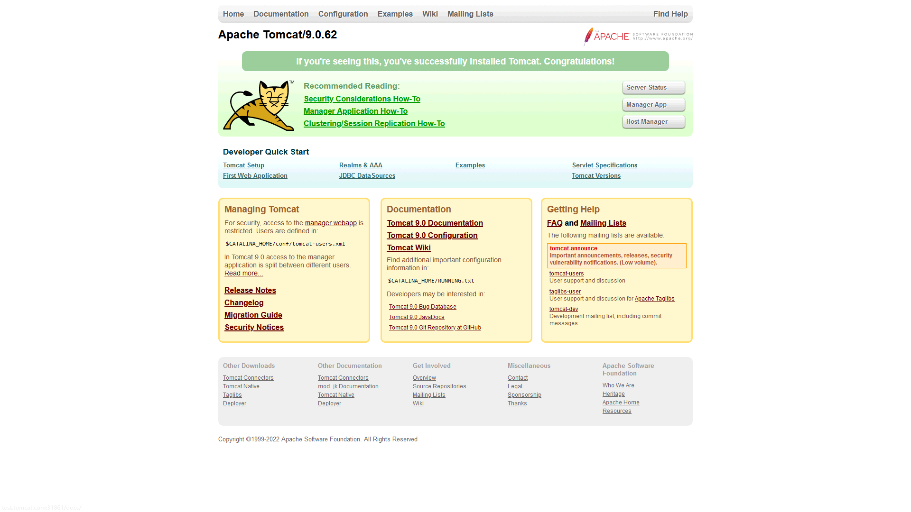

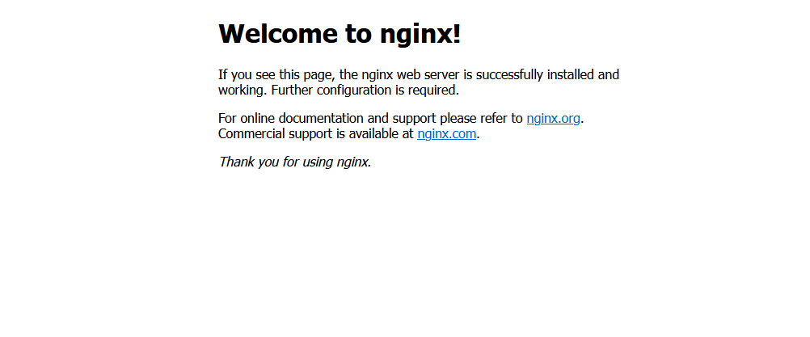

---
