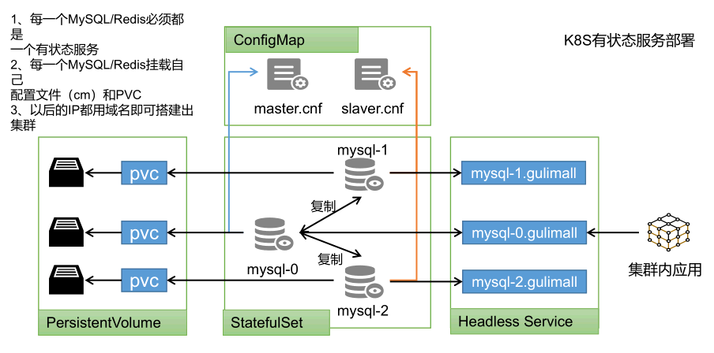

<!-- more -->

# k8s-安装常用软件

如何部署

可以使用kubesphere，快速搭建MySQL.环境。

- 有状态服务抽取配置为ConfigMap
- 有状态服务必须使用pvc 持久化数据
- 服务集群内访问使用DNS 提供的稳定域名

## MySQL

## Redis

## ES

## MQ

## Nacos

## ZipKin

## Sentinel

## Java应用
