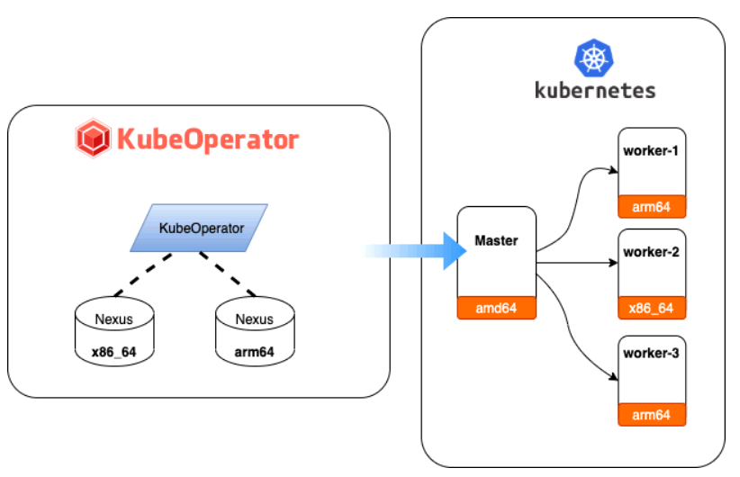
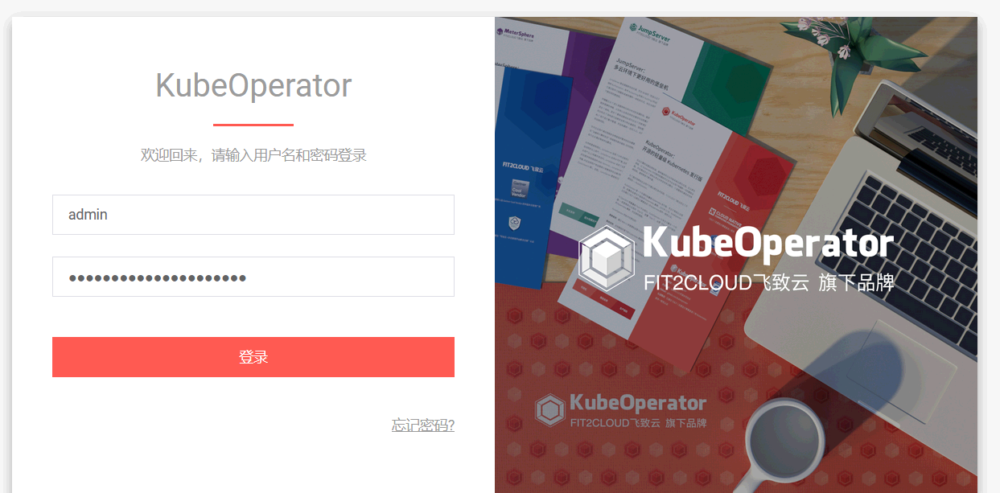
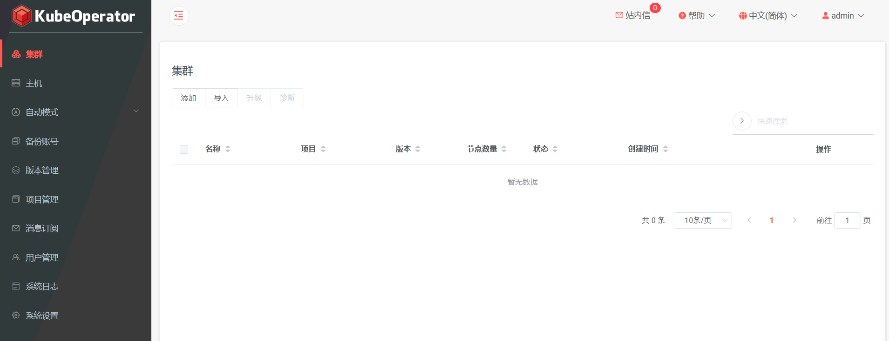

<!-- more -->

# k8s-可视化管理工具-KubeOperator

[https://kubeoperator.io/](https://kubeoperator.io/)

[https://github.com/kubeoperator/kubeoperator/](https://github.com/kubeoperator/kubeoperator/) **star:4.4K**

[https://gitee.com/k8s_s/KubeOperator](https://gitee.com/k8s_s/KubeOperator)



## 安装

第一步：准备一台主机

---

准备一台不小于 8 G内存且可以访问互联网的 64位 Linux 主机。

第二步：执行一键安装命令

---

以 root 用户执行如下命令一键安装 KubeOperator

```shell
curl -sSL https://github.com/KubeOperator/KubeOperator/releases/latest/download/quick_start.sh | sh
```

```shell
curl -sSL https://github.com/KubeOperator/KubeOperator/releases/latest/download/quick_start.sh -o quick_start.sh
bash quick_start.sh
```

quick_start.sh

```shell
#!/usr/bin/env bash
#Install Latest Stable KubeOperator Release

#  定义离线文件下载地址
export CURRENT_DIR=$(cd "$(dirname "$0")";pwd)
export KO_VERSION=$(curl -s https://api.github.com/repos/KubeOperator/KubeOperator/releases/latest | grep "tag_name" | head -n 1 | awk -F ":" '{print $2}' | sed 's/\"//g;s/,//g;s/ //g')

nexus_download_url="https://kubeoperator.fit2cloud.com/nexus/nexus-${KO_VERSION}.tar.gz"
ansible_download_url="https://github.com/KubeOperator/KubeOperator/releases/latest/download/ansible-${KO_VERSION}.tar.gz"
kubeoperator_download_url="https://github.com/KubeOperator/KubeOperator/releases/latest/download/installer-${KO_VERSION}.tar.gz"

set -e
# 判断 wget 命令是否安装
if which wget;then
  echo "开始下载离线包"
else
  echo "wget 未安装，即将安装 wget"
  yum install wget -y
  if [ $? = 0 ];then
    echo "wget 安装成功"
  else
    echo "wget 安装失败，请手动安装后再次执行脚本"
  fi
fi

# 判断文件是否存在
if [ ! -d ${CURRENT_DIR}/kubeoperator-release-${KO_VERSION} ];then
  mkdir -p ${CURRENT_DIR}/kubeoperator-release-${KO_VERSION}
else
  rm -rf ${CURRENT_DIR}/kubeoperator-release-${KO_VERSION}/*
fi

# 下载离线包
wget --no-check-certificate $nexus_download_url -P ${CURRENT_DIR}/kubeoperator-release-${KO_VERSION}
wget --no-check-certificate $ansible_download_url -P ${CURRENT_DIR}/kubeoperator-release-${KO_VERSION}
wget --no-check-certificate $kubeoperator_download_url -P ${CURRENT_DIR}/kubeoperator-release-${KO_VERSION}

# 解压离线包
if [ -f ${CURRENT_DIR}/kubeoperator-release-${KO_VERSION}/installer-${KO_VERSION}.tar.gz ];then
  tar zxf ${CURRENT_DIR}/kubeoperator-release-${KO_VERSION}/installer-${KO_VERSION}.tar.gz -C ${CURRENT_DIR}/kubeoperator-release-${KO_VERSION}
fi

if [ -d ${CURRENT_DIR}/kubeoperator-release-${KO_VERSION}/installer ];then
  cd ${CURRENT_DIR}/kubeoperator-release-${KO_VERSION}/installer/
  /bin/bash install.sh
else
  echo "安装失败: ${CURRENT_DIR}/kubeoperator-release-${KO_VERSION}/installer 不存在"
fi
```

```shell
======================= KubeOperator 安装完成 =======================

请开放防火墙或安全组的80,8081-8083端口,通过以下方式访问:
 URL:  http://$LOCAL_IP:80
 用户名:  admin
 初始密码:  kubeoperator@admin123
```

## Ingress 规则设置

vim ingress-operator.yaml

```yaml
apiVersion: networking.k8s.io/v1
kind: Ingress
metadata: 
  name: ingress-kubeoperator
  namespace: default
  annotations:
    # 重写配置 # 
    nginx.ingress.kubernetes.io/rewrite-target: /$2
    # 限流
    nginx.ingress.kubernetes.io/limit-rps: "1"
    # 跨域
    nginx.ingress.kubernetes.io/enable-cors: "true"
spec:
  ingressClassName: nginx
  rules:
  - host: "ko.k8s.com"
    http:
      paths:
      - pathType: Prefix
        path: "/"
        backend:
          service:
            name: nginx
            port:
              number: 8001
```

启动：`kaf ingress-operator.yaml`

```shell
[root@master ~]# kaf ingress-operator.yaml
ingress.networking.k8s.io/ingress-kubeoperator created
[root@master ~]#
[root@master ~]# kgingress
NAME                   CLASS   HOSTS                         ADDRESS           PORTS   AGE
ingress-kubeoperator   nginx   ko.k8s.com                    192.168.100.131   80      84s
ingress-nginx          nginx   nginx.k8s.com,nginx.k8s.com   192.168.100.131   80      2d3h
```

## 访问

[http://192.168.100.130:80](http://192.168.100.130:80)、[通过 ingress 访问 ko.k8s.com](http://ko.k8s.com/)





---

## 卸载

```
koctl uninstall
```
