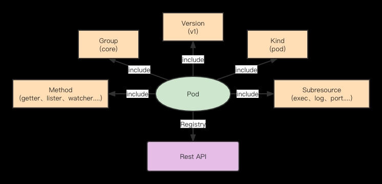

k8s Pod-yaml篇

<!-- more -->

# k8s-Pod-yaml篇

## 1、Pod 整体结构

Pod YAML的整体结构，可以初步分为 **Resource(资源)、Object(元数据)、Spec(规范)、Status(状态)**。


- **Resource**：定义资源类型与版本， 作为从Rest API中获取资源必带的属性。
- **Object**：资源的元数据属性，明确资源的基本标识。
- **Spec / Status**：
  - - *Spec*：定义资源的期望状态，包括用户提供的配置、系统扩展的默认值，以及周边系统初始化或者更改值（scheduler、hpa等）。
  - - *Status*：定义资源的当前状态，从而基于Spec定义的申明式配置，使pod不断朝期望状态靠近。

## 2、Resource（资源）- Rest API



K8s 资源按照 Scope 可以分为 Namespace 资源、Cluster 资源，Namespace 在 K8s 可以认为是软租户的效果，实现资源层面的隔离，
Pod 资源就是属于 Namespace 资源，而 Namespace 不光体现在 YAML 参数中，也表现在 K8s Rest API 中。

Rest API的整体结构，以Pod举例

```yaml
apiVersion: v1
kind: Pod
metadata:
name: test-pod
namespace: default
```

基于上述YAML，可以明确出 namespace 为default， name 为 test-pod 的 Pod 资源对象，也就是明确出Pod为Namespace资源，
该Pod资源对象对应的apiVersion为v1，后续 K8s 自内联相关的 Group为/api，自然而然，我们就将该对象的数据分离出来了：

- **group：api**
- **apiVersion：v1**
- **kind：Pod**
- **name：test-pod**
- **namespace：default**

基于上述的数据展示，apiserver 自然而然会相应的注册出下列 rest api，

- `/api/{apiVersion}/{kind}` ：该kind下的所有资源列表
- `/api/{apiVersion}/namespace/{namespace}/{kind}/` ：该kind下当前namespace的所有资源列表
- `/api/{apiVersion}/namespace/{namespace}/{kind}/{name}` ：该kind下当前namespace且名为name的资源
- `/api/{apiVersion}/namespace/{namespace}/{kind}/{name}/{subresource}` ：该kind下当前namespace且名为name的资源下子资源操作

后续基于扩展，我们就需要明确出method，这样一个真正完整的Rest API就诞生了。

## 3、Object（元数据）

在rest api中明确了Resource的kind、apiVersion， 也确定了Object的namespace、name，作为凡是k8s资源对象都会引用的公共结构，
自然也存在很多公共机制供使用。

```yaml
metadata:
  annotations:
    alibabacloud.com/owner: testdemo
    k8s.aliyun.com/pod-eni: "true"
  creationTimestamp: "2022-06-02T07:21:36Z"
  deleteTimestamp: "2022-06-02T07:22:51Z"
  labels:
    app: taihao-app-cn-shanghai-pre-cloud-resource
    pod-template-hash: 5bbb759f78
  name: testdemo-5bbb759f78-27v88
  namespace: default
  ownerReferences:
  - apiVersion: apps/v1
    blockOwnerDeletion: true
    controller: true
    kind: ReplicaSet
    name: testdemo-5bbb759f78
    uid: 9c3f268a-c0d1-4038-bb2b-b92928f45e3d
  resourceVersion: "60166035"
  uid: e4236960-8be2-41bf-ac44-e7460378afbb
```

观察上述YAML，我们将其整理一下，有这样一些字段:

- **namespace**：常规来说，Namespace资源才会使用该资源对象
- **name**：代表资源实例名称
- **uid**：是资源的唯一标识，可以区别已删除与重新创建的同名资源实例
- **resourceVersion**：是k8s的内部版本，具备时间属性，基于此就能明确该资源对是什么时候发生改变的，也是保证k8s list-watch核心机制
- **creationTimestamp**: 资源实例创建时间
- **deleteTimestamp**: 资源实例删除时间，后续会在pod的生命周期内讲到对该字段应用
- **ownerReferences**: 资源从属对象，从上面yaml可知，该Pod资源从属于名为testdemo-5bb759f78，ownerReferences内部是没有namespace参数，也就是ownerReferences不允许跨namespace， 将资源由下到上能够建立起来
- **labels**：标签， k8s内的服务发现以及相应的软关联，都是围绕label运作的，比如testdemo-5bb759f78 replicaset 的labelselector（标签筛选器） 能够筛选到当前Pod的label，保证两者关联由上到下的建立
- **annotations**: 注释，通常来说会是作为额外字段供应给周边系统使用，比如当前k8s.aliyun.com/pod-eni=”true”是提供网络系统使用

### label & Selector


Deployment 会根据自己的 `seletor：app=taihao-app-cluster` 以及计算出 podtemplate 的 hash lable：`pod-template-hash:
5b8b879786`， 筛选出符合的 replicaset，replicaset 再根据自己的selector 去筛选出符合的 pods， 相应的服务发现 service，
也是通过 selector 去筛选出符合的 Pod。

### Owner & GC(垃圾回收)


基于 Pod 的 metadata.ownerReferences 找寻到对应的 replicaset，replicaset 基于自身的 metadata.ownerReferences 找寻到 deploy；
当 deployment 被删除后，基于原有 owner 构建的树状，回收原有的rs与pod。

### Deploy & Replicaset

基于label&labelselector，明确了从上到下的筛选归纳；基于owner&GC，明确了关联资源的回收流程。

```yaml
apiVersion: apps/v1
kind: ReplicaSet
metadata:
  generation: 1
  labels:
    app: testdemo
    pod-template-hash: bcd889947
  name: testdemo-bcd889947
  namespace: taihao
  ownerReferences:
  - apiVersion: apps/v1
    blockOwnerDeletion: true
    controller: true
    kind: Deployment
    name: testdemo
    uid: 1dddc849-c254-4cf5-aec8-9e1c2b5e65af
spec:
  replicas: 1
  selector:
    matchLabels:
      app: testdemo
      pod-template-hash: bcd889947
  template:
    metadata:
      creationTimestamp: null
      labels:
        app: testdemo
        pod-template-hash: bcd889947
    spec:
      containers:
      - args:
        - -c
        - sleep 1000000
        command:
        - sh
        image: centos:7
        imagePullPolicy: IfNotPresent
        name: testdemo
status:
  fullyLabeledReplicas: 1
  observedGeneration: 1
  replicas: 1
```

- `replicaset.spec.replicas`: 实例数，rs控制下的Pod个数
- `replicaset.spec.selector`：基于label 筛选出对应的Pod
- `replicaset.spec.template`：replicaset创建的Pod会基于podtemplate
- `replicaset.status`：replicaset 当前管理Pod的状态

```yaml
apiVersion: apps/v1
kind: Deployment
metadata:
  labels:
    app: testdemo
  name: testdemo
spec:
  replicas: 1
  revisionHistoryLimit: 10
  selector:
    matchLabels:
      app: testdemo
  strategy:
    rollingUpdate:
      maxSurge: 25%
      maxUnavailable: 25%
    type: RollingUpdate
  template:
    metadata:
      creationTimestamp: null
      labels:
        app: testdemo
    spec:
      containers:
        - args:
            - -c
            - sleep 1000000
          command:
            - sh
          image: centos:7
          imagePullPolicy: IfNotPresent
          name: testdemo
status:
  availableReplicas: 1
  observedGeneration: 2
  readyReplicas: 1
  replicas: 2
  unavailableReplicas: 1
  updatedReplicas: 1
```

- `deploy.spec.replicas`: deploy期望的pod实例格式
- `deploy.spec.revisionHistoryLimit`：deploy 管理replicaset的保留三个月
- `deploy.spec.selector`：deploy 筛选符合标签
- `deploy.spec.strategy`：deploy的升级策略
- `deploy.template`：deploy基于此模版要创建的pod格式

## 4、Spec（规范）

Spec作为Pod的期望状态，一定程度上也覆盖了Pod完整生命周期的逻辑，Pod的生命周期分为以下阶段。


- **Pending**：代表Pod处于未调度阶段
- **Creating**：节点上的kubelet已经发现了Pod，处于创建阶段
- **Running**：至少一个容器运行完毕，kubelet这会发起健康监测
- **Terminating**：Pod处于删除状态，kubelet开始回收容器
- **Terminated**: Pod 销毁完成

### Pod生命周期: Pending

Pod资源创建完毕后，处于还未调度阶段，这个时候scheduler（调度器）基于pod yaml本身的配置与节点资源状态情况，来进行调度。


scheduler 会去分析 podyaml，将其中的策略提取出来，与节点组中的节点配置进行匹配，若匹配成功后，会选出最佳节点，重新修改pod yaml，
将 spec.nodeName 更新掉，完成整个调度环节。

### 资源策略

资源策略表明Pod运行需要的资源情况，以demo为例，Pod需要2核4G的资源，那么调度过去的节点也需要有2核4G的资源剩余，Pod才能运行在该节点上。

### 节点标签筛选策略

节点标签筛选策略，筛选节点是否存在 `topology.kubernetes.io/region: cn-hangzhou`

### 亲和策略

亲和策略，有节点亲和与Pod亲和（Pod所在节点优先调度），常规来说可以优先满足亲和的节点上，当前例子就是节点亲和，满足标签`disk-type=aaa`
或者`disk-type=bbb`

### Pod生命周期: Creating

当Pod调度完毕后，开始创建阶段，kubelet会基于pod.spec 期望状态来创建出Pod

kubelet 在创建Pod阶段，总共大致经历以下过程


- **Group 配置**：主要是为了容器配置cgroup，里面涉及了对容器资源限制，比如不允许超过cpu、memory配置，这里涉及到Pod的qos级别判定；
- **初始化环境配置**：主要是对相关 Pod 数据存储目录进行配置，涉及到 volume，则会去引用 CSI 协议，也会去获取镜像 secret，为了后续拉取镜像进行准备工作；
- **创建 pause 容器**：创建pause容器，该容器主要是为了后续配置容器网络，配置容器网络会去调用CNI；
- **创建 Pod 容器**：基于 imagesecret 拉取业务镜像，在创建Pod容器阶段，也会将相应的 Pod YAML 配置传输进去，在启动Pod容器完毕后，会基于poststart进行相关的回调。

上述阶段，会选择部分关键概念进行详细说明

### image

```yaml
spec:
containers:
- image: testdemo:v1
  imagePullPolicy: Always
  name: test-config
  imagePullSecrets:
- name: image-regsecret
```

- **imagePullSecrets**:  拉取镜像的密钥，保证能够拉取 `image：testdemo:v1`，尤其在镜像库是私有库的阶段
- **imagePullPolicy**：镜像拉取策略
  - - *Always*：总是拉取镜像
  - - *IfNotPresent*：本地若有则使用本地镜像，不进行拉取
  - - *Never*：只使用本地镜像，不拉取

### containers

注意这个 containers 用的是复数，可以填多个容器镜像: 比如可以放 nginx 和 业务容器。这样做的好处是可以尽量减少业务容器中与业务无关的代码或进程。

container 涉及很多配置，其中有涉及到 `volume`、`env`、`dnsconfig`、`host` 等基础配置

```yaml
spec:
  containers:
    - env:
        - name: TZ
          value: Asia/Shanghai
      image: testdemo:v1
      name: taihao-app-cn-shanghai-pre-share
      volumeMounts:
        - mountPath: /home/admin
          name: test-config
          readOnly: true
  dnsConfig:
    nameservers:
      - 100.100.1.1
      - 100.100.2.1
    options:
      - name: ndots
        value: "3"
      - name: timeout
        value: "3"
      - name: attempts
        value: "3"
    searches:
      - default.svc.cluster.local
      - svc.cluster.local
      - cluster.local
  hostAliases:
    - hostnames:
        - kubernetes
        - kubernetes.default
        - kubernetes.default.svc
        - kubernetes.default.svc.cluster.local
      ip: 1.1.1.1
  volumes:
    - configMap:
        defaultMode: 420
        name: test-config
      name: test-config
```

- **env**：配置Pod的环境变量
- **dnsConfig**：配置Pod的域名解析
- **hostALiases**：配置/etc/hosts文件内容
- **volume/volumeMount**：配置文件挂载到容器内，也可以配置文件存储系统挂载到容器内

### postStart

```yaml
containers:
  - image: testdemo:v1
    imagePullPolicy: Always
    lifecycle:
      postStart:
        exec:
          command:
            - /bin/sh
            - -c
            - sleep 5
```

当前 poststart demo 是发起 command 命令，也可以发起 http 请求，主要作用可以作为资源部署以及环境准备。

### Pod生命周期: Running

在 Pod running 阶段的时候，Pod 就迎来对其健康的检查，当前 kubelet 提供三种方式判定

- **readiness**：检查Pod是否为健康
- **liveness**：件看 Pod 是否正常，若检查失败，则重启容器
- **readinessGate**：提供给第三方组件健康验证，第三方组件验证不过，则Pod不为健康

```yaml
spec:
  readinessGates:
  - conditionType: TestPodReady
  containers:
  - image: testdemo:v1
    imagePullPolicy: Always
    livenessProbe:
      failureThreshold: 3
      initialDelaySeconds: 45
      periodSeconds: 5
      successThreshold: 1
      tcpSocket:
        port: 8080
      timeoutSeconds: 1
    readinessProbe:
      failureThreshold: 3
      httpGet:
        path: /actuator/health
        port: 8989
        scheme: HTTP
      initialDelaySeconds: 25
      periodSeconds: 3
      successThreshold: 1
      timeoutSeconds: 1
```

readiness 与 liveness 检查参数都是一致的

- **httpGet/tcpSocket**：都是检查方式，一种是http请求验证，一种是tcpSocket，其中也有exec执行命令，以及grpc形式验证
- **initialDelaySeconds**：延迟多久开始检查，原因在于容器启动的时候，通常需要过段时间进行验证
- **periodSeconds**：检验时间周期
- **failureThreshold**：连续几次失败，则代表这轮检验失败
- **successThreshold**：连续几次成功，则代表这轮检验成功
- **timeoutSeconds** ：代表检验超时时间，若检验在该配置时间内没有返回，则认为检验失败

readiness、liveness虽然参数不一样，但对检验的结果行为不一致。

- **readiness** 默认状态下为false，也就是Pod为不健康，直到检查通过，才将Pod变为健康
- **liveness** 默认状态下为true，不会在刚开始就将Pod重启，只有等检查不通过后，才会进行容器重启操作

- **readinessGate** 是 Pod 健康的扩展，kubelet 会基于此，默认在 `pod.status.conditions` 上配置对应的 condition，
比如当前例子 readinessGate 为`conditionType: TestPodReady`，则相应就会有 conditions

```yaml
status:
  conditions:
    - lastProbeTime: null
      lastTransitionTime: "2022-07-05T09:16:07Z"
      status: "false"
      type: TestPodReady
```

当该 condition.status 为 false 时，则 Pod 就会一直是不健康，哪怕 readiness 检查通过，直到第三方系统去操作更新 Pod 该 condition.status 为 true，才可以将 Pod 变为健康，这样就可以接入更多的 Pod 健康指标。

Pod生命周期: Terminating
client 在发起请求删除Pod的时候，实际上是配置 pod.metadata.deletionTimestamp，kubelet 感知到后，开始进行 Pod 回收流程

整个 Pod 的回收周期，常规来说 preStop—>SIGTERM—>SIGKILL

```yaml
lifecycle:
  preStop:
    exec:
      command:
      - /bin/sh
      - -c
      - sleep 5
```

当 kubelet 进行 preStop 后，开始发起 SIGTERM 给容器内进程，若超过总默认耗时30S（metadata.DeletionGracePeriodSeconds），则强制发起 SIGKILL 给容器，也就是 prestop+SIGTERM 总耗时不允许超过30s。

## 5、Status（状态）

```yaml
status:
  conditions:
  - lastProbeTime: null
    lastTransitionTime: "2022-07-05T09:16:07Z"
    status: "True"
    type: TestPodReady
  - lastProbeTime: null
    lastTransitionTime: "2022-07-05T09:16:07Z"
    status: "True"
    type: Initialized
  - lastProbeTime: null
    lastTransitionTime: "2022-07-05T09:16:14Z"
    status: "True"
    type: Ready
  - lastProbeTime: null
    lastTransitionTime: "2022-07-05T09:16:14Z"
    status: "True"
    type: ContainersReady
  - lastProbeTime: null
    lastTransitionTime: "2022-07-05T09:16:07Z"
    status: "False"
    type: ContainerDiskPressure
  - lastProbeTime: null
    lastTransitionTime: "2022-07-05T09:16:07Z"
    status: "True"
    type: PodScheduled
  containerStatuses:
  - containerID: containerd://xxxxx
    image: docker.io/library/testdemo:v1
    imageID: docker.io/library/centos@sha256:xxxx
    lastState: {}
    name: zxtest
    ready: true
    restartCount: 0
    started: true
    state:
      running:
        startedAt: "2022-07-05T09:16:13Z"
  hostIP: 21.1.96.23
  phase: Running
  podIP: 10.11.17.172
  podIPs:
  - ip: 10.11.17.172
  qosClass: Guaranteed
  startTime: "2022-07-05T09:16:07Z"
```

基于上述YAML样例，将Pod status状态拆建出来分析一下:

- **conditions**: conditions是作为一种更详尽的状态报告，其本身也是一种扩展机制，其他的扩展字段也可以放入其中，比如可以表明网络状况，其中readinessGate就是这种扩展机制的表现，但决定Pod是否ready，永远只看type: Ready是否为true
- **containerStatuses**: Pod内各容器的状态
- **hostIP**: Pod所在节点ip地址
- **phase**: Pod的生命周期状态
  - - *Pending*：代表Pod有一个容器或者多个容器还未运行，其中包括Pod调度到节点之前以及拉取镜像
  - - *Running*：代表Pod已绑定到节点上，至少有一个容器运行或在重启
  - - *Successed*：代表Pod所有容器已终止
  - - *Failed*：代表Pod内至少有一个容器终止失败
  - - *Unknown*：代表无法获取Pod状态
- **podIP/podIPs**：Pod的IP地址，假如有ipv4、ipv6，则可以在podIPs上配置
- **qosClass**：代表kubernetes服务等级
  - - *Guaranteed*：resource.requests与resource.limits一致
  - - *Burstable*：resource.requests与resource.limits 不一致
  - - *BestEffort*：没有配置resource.requests与resource.limits
- **startTime**：启动时间

通过以上Pod四个部分拆解，我们基本搞清了一个Pod在k8s下“从哪里来”的这个问题。本系列的后续的文章会对“到哪里去”这个问题继续展开：
Kubernetes的魅力在于不仅仅是拉起一个工作负载，而是能够召之即来挥之即去地编排海量工作负载。
