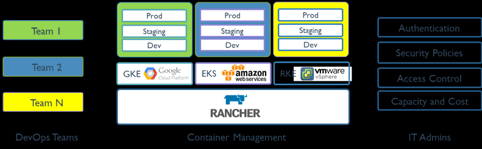

k8s 可视化管理工具-Rancher

<!-- more -->

# k8s-可视化管理工具-Rancher

[https://rancher.com/](https://rancher.com/)

[https://www.rancher.cn/](https://www.rancher.cn/)

[https://github.com/rancher/rancher](https://github.com/rancher/rancher) **star:19.8K**

[https://gitee.com/k8s_s/rancher](https://gitee.com/k8s_s/rancher)

[https://hub.docker.com/r/rancher/rancher/tags](https://hub.docker.com/r/rancher/rancher/tags)



## 安装 2.6.7

查看支持的 k8s 版本

[https://github.com/rancher/rancher/releases/tag/v2.6.7](https://github.com/rancher/rancher/releases/tag/v2.6.7)

```
https://github.com/rancher/rancher/releases/tag/v2.6.7
Kubernetes Versions
    v1.24.2 (Default)
    v1.23.8
    v1.22.11
    v1.21.14
    v1.20.15
    
https://github.com/rancher/rancher/releases/tag/v2.6.5
Kubernetes Versions
    v1.23.6 (Default)
    v1.22.9
    v1.21.12
    v1.20.15
    v1.19.16
    v1.18.20
```

## docker安装

v2.5.15、v2.5.16、v2.6.5、v2.6.6、v2.6.7

docker pull rancher/rancher:v2.6.7

docker tag rancher/rancher:v2.6.7 registry.cn-chengdu.aliyuncs.com/k8sjf/rancher:v2.6.7

docker push registry.cn-chengdu.aliyuncs.com/k8sjf/rancher:v2.6.7

```shell
docker run --privileged -d --restart=unless-stopped -p 8988:80 -p 4430:443 registry.cn-chengdu.aliyuncs.com/k8sjf/rancher:v2.6.7

# docker-compose方式
git clone https://gitee.com/zhengqingya/docker-compose.git
cd docker-compose/Liunx
docker-compose -f docker-compose-rancher.yml -p rancher up -d
```

docker ps

docker logs cb08ec773b93 2>&1 | grep "Bootstrap Password: "

`bd6trjjkplcx6d2lf4fxx78fpltprw5tb9n58vppjp2kkgkndk9qmt`

<http://192.168.100.130:8988/>

<http://rancher.k8s.com:8988/>

## 推荐安装

[高可用安装（推荐）](https://docs.rancher.cn/docs/rancher2.5/installation/other-installation-methods/air-gap/install-rancher/_index#%E9%AB%98%E5%8F%AF%E7%94%A8%E5%AE%89%E8%A3%85%EF%BC%88%E6%8E%A8%E8%8D%90%EF%BC%89)

### 先决条件

- Kubernetes 集群
- CLI
- Ingress Controller

### Helm Chart 安装 Rancher

1、添加 Helm Chart 仓库

```bash
helm repo add rancher-latest https://releases.rancher.com/server-charts/latest
helm repo add rancher-stable https://releases.rancher.com/server-charts/stable
helm repo add rancher-alpha https://releases.rancher.com/server-charts/alpha

helm repo update
helm repo list
helm repo remove rancher-xx
```

2、为 Rancher 创建 Namespace

```bash
kubectl create namespace cattle-system
```

3、选择你的 SSL 选项

| 设置                | Chart 选项                         | 描述                                               | 是否需要 cert-manager |
|-------------------|----------------------------------|--------------------------------------------------|-------------------|
| Rancher 生成的证书（默认） | `ingress.tls.source=rancher`     | 使用 Rancher 生成的 CA 签发的自签名证书此项为**默认选项**            | [是]               |
| Let’s Encrypt     | `ingress.tls.source=letsEncrypt` | 使用[Let's Encrypt](https://letsencrypt.org/)颁发的证书 | [是]               |
| 你已有的证书            | `ingress.tls.source=secret`      | 使用你的自己的证书（Kubernetes 密文）                         | 否                 |

> Rancher 中国技术支持团队建议你使用“你已有的证书” `ingress.tls.source=secret` 这种方式，从而减少对 cert-manager 的运维成本。

4、安装 cert-manager

[https://github.com/jetstack/cert-manager/releases](https://github.com/jetstack/cert-manager/releases)

仅在使用 Rancher 生成的证书 `ingress.tls.source=rancher` 或 Let's Encrypt 颁发的证书 `ingress.tls.source=letsEncrypt`时才需要 cert-manager。

```

# 如果你手动安装了CRD，而不是在Helm安装命令中添加了`--set installCRDs=true`选项，你应该在升级Helm chart之前升级CRD资源。
wget https://github.com/jetstack/cert-manager/releases/download/v1.9.1/cert-manager.crds.yaml
kubectl apply -f cert-manager.crds.yaml

# 添加 Jetstack Helm 仓库

helm repo add jetstack https://charts.jetstack.io

# 更新本地 Helm chart 仓库缓存

helm repo update

# 安装 cert-manager Helm chart

helm install cert-manager jetstack/cert-manager \
  --namespace cert-manager \
  --create-namespace \
  --version v1.9.1
```

安装完 cert-manager 后，你可以通过检查 cert-manager 命名空间中正在运行的 Pod 来验证它是否已正确部署：

```
kubectl get pods --namespace cert-manager

NAME                                       READY   STATUS    RESTARTS   AGE
cert-manager-5c6866597-zw7kh               1/1     Running   0          2m
cert-manager-cainjector-577f6d9fd7-tr77l   1/1     Running   0          2m
cert-manager-webhook-787858fcdb-nlzsq      1/1     Running   0          2m
```

5、根据你选择的 SSL 选项，通过 Helm 安装 Rancher

因为 `rancher` 是 `ingress.tls.source` 的默认选项，所以在运行 `helm install` 命令时我们没有指定 `ingress.tls.source`。

- 将 `hostname` 设置为解析到你的负载均衡器的 DNS 记录。Rancher HA 安装成功后，你需要通过这个域名来访问 Rancher Server。
- 将 `replicas` 设置为 Rancher 部署所使用的副本数量。默认为 3；如果集群中的节点少于 3 个，你应该相应地减少副本数量。
- 要安装一个特定的 Rancher 版本，使用 `--version` 标志，例如：`--version 2.3.6`。
- 如果你安装的是 alpha 版本，Helm 要求在命令中加入 `--devel` 选项。

```
helm install rancher rancher-/rancher \
  --namespace cattle-system \
  --set hostname=rancher.k8s.com \
  --version 2.6.7
  --set replicas=3
```

```
kubectl -n cattle-system rollout status deploy/rancher
Waiting for deployment "rancher" rollout to finish: 0 of 3 updated replicas are available...
deployment "rancher" successfully rolled out
```

6、验证 Rancher Server 是否已成功部署

7、保存你的选项

安装完成

## 离线安装

### 配置 Helm Chart 仓库

```bash
helm repo add rancher-latest https://releases.rancher.com/server-charts/latest
helm repo add rancher-stable https://releases.rancher.com/server-charts/stable
helm repo add rancher-alpha https://releases.rancher.com/server-charts/alpha

helm repo update
helm repo list
helm repo remove rancher-xx
```

### 下载tgz安装包

```
#搜索
helm search repo rancher-latest | grep rancher
#下载指定仓库版本tgz文件
helm pull rancher-latest/rancher
#指定版本下载
helm pull rancher-latest/rancher --version=v2.6.7
```

### SSL 配置

### 离线环境可用的 Helm Chart 选项

### 渲染您的 Rancher Helm 模板

helm repo add jetstack <https://charts.jetstack.io>

helm repo update

### 安装 Rancher

## 使用 kubectl 安装 Rancher

```shell
kubectl create namespace cattle-system
kubectl -n cattle-system apply -R -f ./rancher
```
