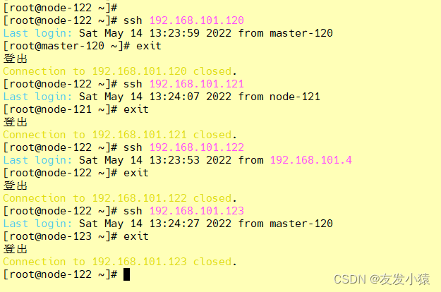

k8s开启ssh远程登录

<!-- more -->

```shell
（1）检查是否开启SSH服务 
　　命令：ps -e|grep ssh  查看SSH服务是否开启，
　　或者通过命令：service sshd status 可以查看某个服务的状态。

（2）安装SSH服务,有就跳过 嘿嘿嘿
 　  通过 yum 安装，命令：yum install ssh
 > 客户端   yum install -y openssh-client	  yum -y install openssh-client
 > 服务器   yum install -y openssh-server	  yum -y install openssh-server
	
（3）修改SSH配置文件
 　命令：  vim /etc/ssh/sshd_config，找到 PermitRootLogin without-password 修改为 PermitRootLogin yes
 　或者：sed -i 's/#PermitRootLogin yes/PermitRootLogin yes/g' /etc/ssh/sshd_config

（4）登录 master、node1、node2、node3，每个节点都执行。
    ssh-keygen -t rsa	（ssh-keygen这里一路回车就行）
    
    ssh-copy-id -i ~/.ssh/id_rsa.pub root@192.168.101.120 && \
    ssh-copy-id -i ~/.ssh/id_rsa.pub root@192.168.101.121 && \
    ssh-copy-id -i ~/.ssh/id_rsa.pub root@192.168.101.122 && \
    ssh-copy-id -i ~/.ssh/id_rsa.pub root@192.168.101.123 && \
    ssh-copy-id -i ~/.ssh/id_rsa.pub a@192.168.101.120 && \
    ssh-copy-id -i ~/.ssh/id_rsa.pub a@192.168.101.121 && \
    ssh-copy-id -i ~/.ssh/id_rsa.pub a@192.168.101.122 && \
    ssh-copy-id -i ~/.ssh/id_rsa.pub a@192.168.101.123

（5）重启SSH服务
　命令：  systemctl restart sshd 或   service ssh restart
　
（6）免密登录测试
	ssh 192.168.101.120 ssh 192.168.101.121
	ssh 192.168.101.122 ssh 192.168.101.123
```

master


node1


node2



node3


