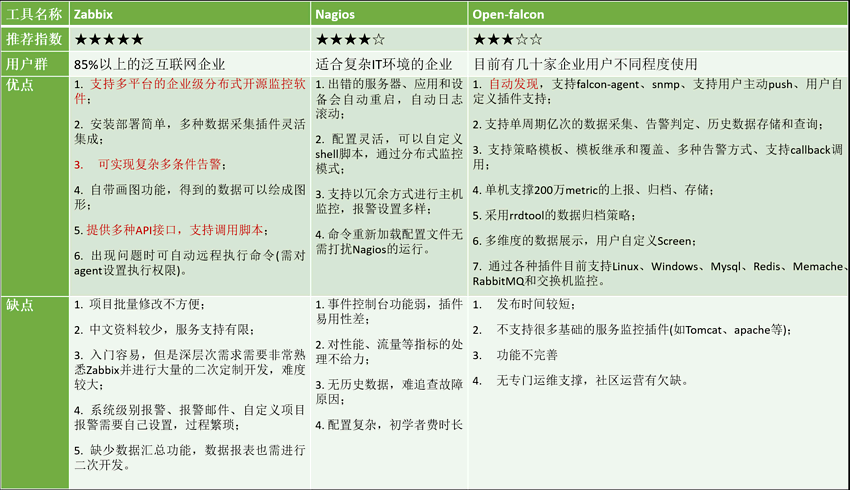

## 方向盘

- Linux云计算+GO > 运维自动化开发、devops开发或sre运维。
- 网络安全+Python > 网络安全开发、自动化架构师。
- 数据库+Python > 数据库开发、数据库自动化开发。

- [SRE（运维工程师）成长路线的总结和思考](https://zhuanlan.zhihu.com/p/536895461?utm_id=0)

## Linux

- [Linux基础](./basis/basis.md)
- [Linux常用命令实例](./command-examples.md)
- [Linux常见异常分析](./exception-analysis.md)
- [网卡配置](./network-setting.md)
- [磁盘相关](./disk.md)
- [yum源配置](./yum-repo.md)
- [升级内核](./update-kernel.md)
- [Shell脚本编程-认识篇](./shell1.md)
- [Shell脚本编程-基础篇](./shell2.md)
- [Shell脚本编程-高级篇-基础](./shell3.md)
- [Shell脚本编程-高级篇-sed](./shell3-sed.md)
- [Shell脚本编程-高级篇-gawk](./shell3-gawk.md)
- [Shell脚本编程-实用脚本](./shell4.md)
- [Jenkins自动化部署](./jenkins.md)
- [命令大全](./basis/command.md)

## 运维监控工具

[参考原文](https://mp.weixin.qq.com/s/N7KEHOJ75reTXh4v-9pAAQ)

运维监控工具千千万，仅开源的解决方案就有流量监控（`MRTG、Cacti、SmokePing、Graphite`等）和性能告警（`Nagios、Zabbix、Zenoss Core、Ganglia、OpenTSDB`等）可供选择。

下面我们将针对目前行业内常用的五种监控工具（`Cacti、Nagios、Zabbix、Grafana、Prometheus、Nightingale、OpenFalcon`）详细介绍各自的特点。

- [Zabbix 监控平台](./monitoringtools/zabbix.md)
- [Nagios 监控平台](./monitoringtools/nagios.md)
- [Open-Falcon 监控平台](./monitoringtools/open-falcon.md)

Zabbix、Nagios、Open-Falcon这3大开源运维监控工具的比较:

## ansible

- [AD-Hoc命令执行工具](./ansible/ansible.md)
- [ansible安装与基础概念](./ansible/ansible-basis.md)
- [doc 模块功能查看工具](./ansible/ansible-doc.md)
- [playbook 任务编排工具（剧本）](./ansible/ansible-playbook.md)
- [galaxy 官方应用模板](./ansible/ansible-galaxy.md)
- [安装 Docker](./ansible/ansible-docker.md)
- [安装 JDK](./ansible/ansible-jdk.md)
- [安装 MySQL](./ansible/ansible-mysql.md)
- [安装 Nginx](./ansible/ansible-nginx.md)
- [安装 redis](./ansible/ansible-redis.md)
