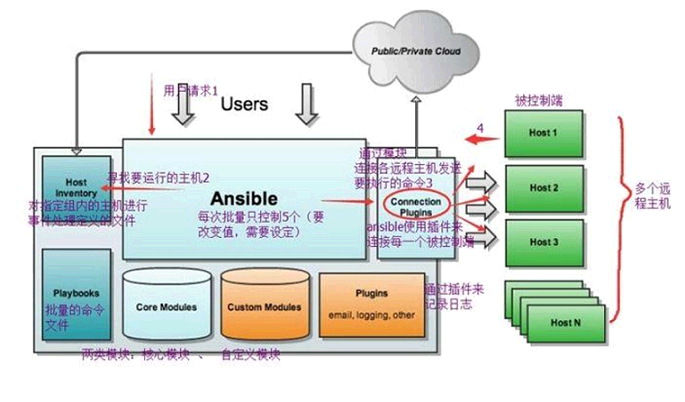
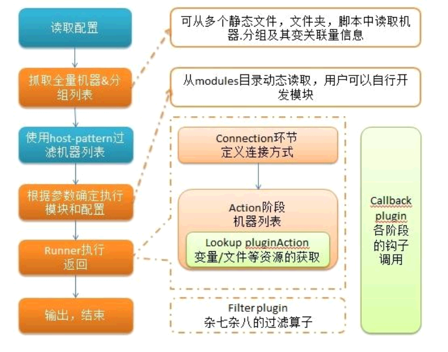

Ansible 安装与基础概念

<!-- more -->

# Ansible安装与基础概念

[Ansible 中文指南](http://ansible.com.cn/docs/intro.html)

[本节示例文件 提取码：1234](https://pan.baidu.com/s/1fkosURl4HaYZALtSjKvcKg)

## 虚拟机主机分配

8+2+200G

控制端-admin：192.168.0.118

被控制端-n1：192.168.0.8

被控制端-n2：192.168.0.9

被控制端-n3：192.168.0.10

```
vi /etc/selinux/config

把 SELINUX=enforce   改成 disabled
```

## 一、安装

依赖

```shell
查看 epel-release 版本：yum list | grep epel-release

yum install -y epel-release.noarch
yum install -y python2

yum -y clean all && yum -y makecache && yum -y update && yum -y repolist all
```

只需要在主控制端安装：`yum install -y ansible`   yum remove -y ansible

ansible --version ： 2.9.27

### 目录结构

安装目录如下(yum安装)：

配置文件目录：/etc/ansible/【hosts、ansible、roles】

执行文件目录：/usr/bin/ansible*

Lib库依赖目录：/usr/lib/pythonX.X/site-packages/ansible/

Help文档目录：/usr/share/doc/ansible-X.X.X/

Man文档目录：/usr/share/man/man1/

### 赋予普通用户权限

将a用户添加到root组：usermod -aG root a

赋予a用户对ansible的权限管理：chmod -R 755 /etc/ansible

赋予a用户对ansible的所属组管理：chown -R root:a  /etc/ansible

## 二、概念

ansible是新出现的自动化运维工具，基于Python开发，集合了众多运维工具（puppet、chef、func、fabric）的优点，实现了批量系统配置、批量程序部署、批量运行命令等功能。

### ansible能做什么？

正如其他配置管理工具一样，ansible可以帮助我们完成一些批量任务，或者完成一些需要经常重复的工作。

比如：同时在100台服务器上安装nginx服务，并在安装后启动它们。

比如：将某个文件一次性拷贝到100台服务器上。

比如：每当有新服务器加入工作环境时，你都要为新服务器部署redis服务，也就是说你需要经常重复的完成相同的工作。

### 特点

1. 部署简单，只需在主控端部署Ansible环境，被控端无需做任何操作；
2. 默认使用SSH协议对设备进行管理；
3. 有大量常规运维操作模块，可实现日常绝大部分操作；
4. 配置简单、功能强大、扩展性强；
5. 支持API及自定义模块，可通过Python轻松扩展；
6. 通过Playbooks来定制强大的配置、状态管理；
7. 轻量级，无需在客户端安装agent，更新时，只需在操作机上进行一次更新即可；
8. 提供一个功能强大、操作性强的Web管理界面和REST API接口——AWX平台。

### 架构图



### 主要模块

`Ansible`：Ansible核心程序。

 `HostInventory`：记录由Ansible管理的主机信息，包括端口、密码、ip等。

 `Playbooks`：“剧本”YAML格式文件，多个任务定义在一个文件中，定义主机需要调用哪些模块来完成的功能。

 `CoreModules`：**核心模块**，主要操作是通过调用核心模块来完成管理任务。

 `CustomModules`：自定义模块，完成核心模块无法完成的功能，支持多种语言。

 `ConnectionPlugins`：连接插件，Ansible和Host通信使用

### 任务执行

#### ansible 任务执行模式

Ansible 系统由控制主机对被管节点的操作方式可分为两类，即`adhoc`和`playbook`：

- ad-hoc模式(点对点模式)
   　使用单个模块，支持批量执行单条命令。ad-hoc 命令是一种可以快速输入的命令，而且不需要保存起来的命令。**就相当于bash中的一句话shell。**
- playbook模式(剧本模式)
   　是Ansible主要管理方式，也是Ansible功能强大的关键所在。**playbook通过多个task集合完成一类功能**，如Web服务的安装部署、数据库服务器的批量备份等。可以简单地把playbook理解为通过组合多条ad-hoc操作的配置文件。

#### 任务流程



简单理解就是Ansible在运行时， 首先读取`ansible.cfg`中的配置， 根据规则获取`Inventory`中的管理主机列表， 并行的在这些主机中执行配置的任务， 最后等待执行返回的结果。

#### 命令执行过程

1. 加载自己的配置文件，默认`/etc/ansible/ansible.cfg`；
2. 查找对应的主机配置文件，找到要执行的主机或者组；
3. 加载自己对应的模块文件，如 command；
4. 通过ansible将模块或命令生成对应的临时py文件(python脚本)， 并将该文件传输至远程服务器；
5. 对应执行用户的家目录的`.ansible/tmp/XXX/XXX.PY`文件；
6. 给文件 +x 执行权限；
7. 执行并返回结果；
8. 删除临时py文件，`sleep 0`退出；

## 三、配置

### 配置文件查找顺序

ansible与我们其他的服务在这一点上有很大不同，这里的配置文件查找是从多个地方找的，顺序如下：

1. 检查环境变量`ANSIBLE_CONFIG`指向的路径文件(export ANSIBLE_CONFIG=/etc/ansible.cfg)；
2. `~/.ansible.cfg`，检查当前目录下的ansible.cfg配置文件；
3. `/etc/ansible.cfg`检查etc目录的配置文件。

### ansible 配置文件

ansible 的配置文件为`/etc/ansible/ansible.cfg`，常见的参数：

```ini
inventory = /etc/ansible/hosts  #这个参数表示资源清单inventory文件的位置
library = /usr/share/ansible  #指向存放Ansible模块的目录，支持多个目录方式，只要用冒号（：）隔开就可以
roles_path = /etc/ansible/roles  #指定角色目录
forks = 5  #并发连接数，默认为5
sudo_user = root  #设置默认执行命令的用户
remote_port = 22  #指定连接被管节点的管理端口，默认为22端口，建议修改，能够更加安全
host_key_checking = False  #设置是否检查SSH主机的密钥，值为True/False。关闭后第一次连接不会提示配置实例
timeout = 60  #设置SSH连接的超时时间，单位为秒
log_path = /var/log/ansible.log  #指定一个存储ansible日志的文件（默认不记录日志）
```

### ansible 主机清单 inventory

vim /etc/ansible/hosts

在配置文件中，里面保存的是一些 ansible 需要连接管理的主机列表。我们可以来看看他的定义方式：

[root@admin ~]# vim /etc/ansible/hosts

```shell
mail.example.com
192.168.0.120

# 自定义主机与组
[web]
foo.example.com
192.168.0.8
192.168.0.121
## 端口号不是默认设置时
bar.example.com:2088
## 一组相似的 hostname
www[001:006].example.com
# ssh登录
192.168.0.9 ansible_port=22 ansible_user=root ansible_ssh_pass=123456a
# 设置别名
test12 ansible_host=192.168.0.12 ansible_port=22 ansible_user=root ansible_ssh_pass=123456a

[db]
192.168.0.122
two.example.com
## 主机范围
db-[a:f].example.com


# 静态IP地址,希望设置一些别名,但不是在系统的 host 文件中设置,又或者你是通过隧道在连接
# 通过 “jumper” 别名,会连接 192.168.1.50:5555
jumper ansible_ssh_port=5555 ansible_ssh_host=192.168.1.50
```

**方括号 []** 是组名,用于对系统进行分类,便于对不同系统进行个别的管理.

一个系统可以属于不同的组,比如一台服务器可以同时属于 webserver组 和 dbserver组.这时属于两个组的变量都可以为这台主机所用

## 四、ansible 常用命令

### ansible 命令集

`/usr/bin/ansible`　　Ansibe AD-Hoc 临时命令执行工具，常用于临时命令的执行

`/usr/bin/ansible-doc` 　　Ansible 模块功能查看工具

`/usr/bin/ansible-galaxy`　　下载/上传优秀代码或Roles模块 的官网平台，基于网络的

`/usr/bin/ansible-playbook`　　Ansible 定制自动化的任务集编排工具

`/usr/bin/ansible-pull`　　Ansible远程执行命令的工具，拉取配置而非推送配置（使用较少，海量机器时使用，对运维的架构能力要求较高）

`/usr/bin/ansible-vault`　　Ansible 文件加密工具

`/usr/bin/ansible-console`　　Ansible基于Linux Consoble界面可与用户交互的命令执行工具

其中，我们比较常用的是`/usr/bin/ansible`和`/usr/bin/ansible-playbook`。
