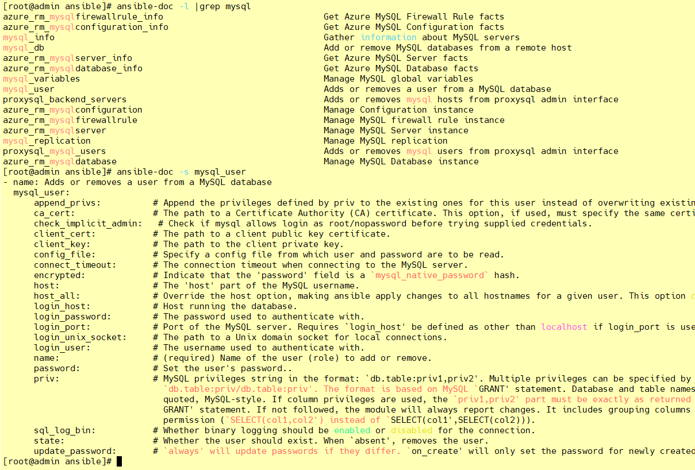

Ansible-doc模块功能查看工具

<!-- more -->

# ansible-doc模块功能查看工具

[Ansible 中文指南](http://ansible.com.cn/docs/intro.html)

[本节示例文件 提取码：1234](https://pan.baidu.com/s/1fkosURl4HaYZALtSjKvcKg)

## ansible-doc

```shell
ansible-doc -l    #获取全部模块的信息
ansible-doc -s MOD_NAME  #获取指定模块的使用帮助
```


