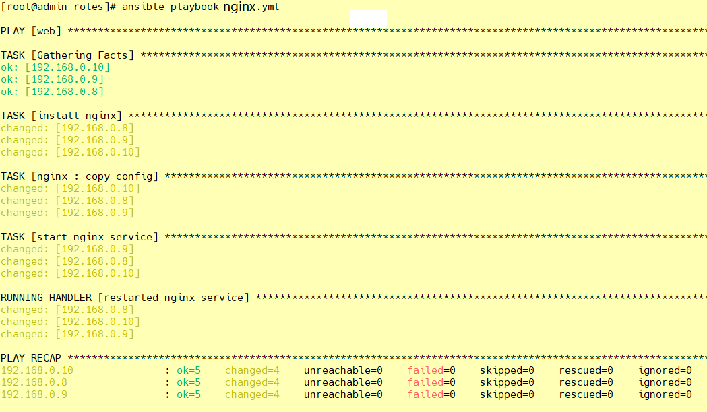
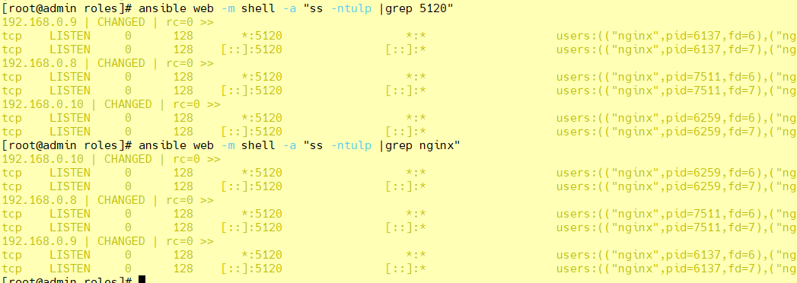
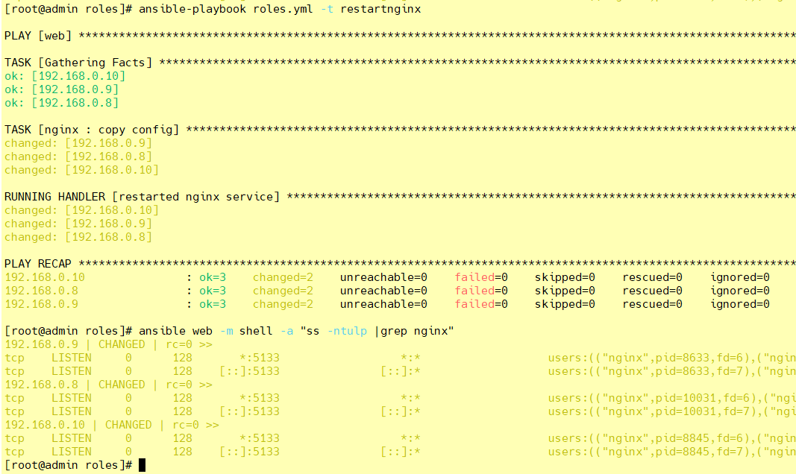
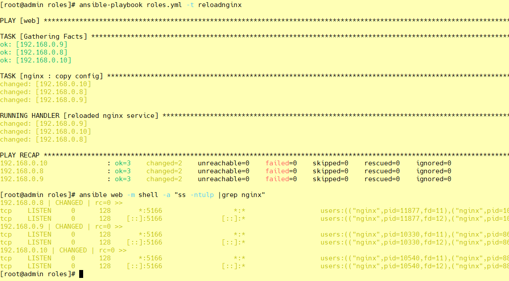

Ansible安装nginx

<!-- more -->

# Ansible安装nginx

## ① 在`roles`目录下生成对应的目录结构

```shell
[root@admin ansible]# cd roles/
[root@admin roles]# ls

[root@admin roles]# mkdir -pv ./{nginx,mysql,httpd}/{files,templates,vars,tasks,handlers,meta,default}

[root@admin roles]# touch ./{nginx,mysql,httpd}/{files,templates,vars,tasks,handlers,meta,default}/main.yml

[root@admin roles]# tree nginx/
nginx/
├── default
│   └── main.yml
├── files
│   ├── main.yml
│   └── nginx-1.22.0-1.el7.ngx.x86_64.rpm
├── handlers
│   └── main.yml
├── tasks
│   ├── copy.yml
│   ├── install.yml
│   ├── main.yml
│   ├── start.yml
│   ├── stop.yml
│   └── uninstall.yml
├── templates
│   ├── default.conf.j2
│   ├── html
│   │   ├── 404.html
│   │   ├── 50x.html
│   │   └── index.html
│   ├── logs
│   ├── main.yml
│   ├── nginx.conf.j2
│   └── time.txt
└── vars
    └── main.yml
```

**可以使用 ansible-galaxy role init xxx 来实现目录的自动创建，结构跟上面一样**

## 准备 nginx.conf.j2 配置文件

```yaml
user nginx;

worker_processes {{ ansible_processor_vcpus }};

error_log /var/log/nginx/error.log;
pid /run/nginx.pid;

include /usr/share/nginx/modules/*.conf;

events {
    worker_connections 1024;
}

http {
    log_format  main  '$remote_addr - $remote_user [$time_local] "$request" '
                      '$status $body_bytes_sent "$http_referer" '
                      '"$http_user_agent" "$http_x_forwarded_for"';
                      
                      
    access_log  /var/log/nginx/access.log  main;

    sendfile            on;
    tcp_nopush          on;
    tcp_nodelay         on;
    keepalive_timeout   65;
    types_hash_max_size 4096;

    include             /etc/nginx/mime.types;
    default_type        application/octet-stream;

    include /etc/nginx/conf.d/*.conf;

    server {
        listen       {{ nginxprot }};
        listen       [::]:{{ nginxprot }};
        server_name  localhost;
        
        root         /usr/share/nginx/html;
        
        location / {
           root   /usr/share/nginx/html;
           index  index.html index.htm;
        }
        
        error_page 404 /404.html;
        location = /404.html {
        }

        error_page 500 502 503 504 /50x.html;
        location = /50x.html {
        }
    }

}
```

## ②  定义 tasks 任务文件

rpm包下载：

> wget <http://nginx.org/packages/centos/7/x86_64/RPMS/nginx-1.22.0-1.el7.ngx.x86_64.rpm>
>
> chmod -R 777 nginx-1.22.0-1.el7.ngx.x86_64.rpm

**vim /etc/ansible/roles/nginx/tasks/main.yml**

```yaml
---
- include: install.yml
- include: copy.yml
- include: start.yml
```

**install.yml**

```yaml
---
- name: install nginx
  yum: name=nginx state=present
```

**copy.yml**

```yaml
---
- name: copy config
  template: src=/etc/ansible/roles/nginx/templates/nginx.conf.j2 dest=/etc/nginx/nginx.conf mode=0777
  # notify: restarted、reloaded 这里对应的触发是 handlers 处理器
  notify: restarted nginx service
  # tags: restartnginx、reloadnginx
  tags: restartnginx
```

**start.yml**

```yaml
---
- name: start nginx service
  service: name=nginx state=started enabled=true
  tags: startnginx
```

**stop.yml**

```yaml
---
- hosts: web
  remote_user: root
  tasks:
    - name: stop nginx service
      service: name=nginx state=stopped
      tags: stopnginx
```

> ansible-playbook ./nginx/tasks/stop.yml
>
> ansible-playbook nginx.yml -t startnginx

**uninstall.yml**

```yaml
---
- hosts: web
  remote_user: root
  tasks:
    - name: uninstall nginx
      shell: yum remove -y nginx && rm -rf /etc/nginx && ls /usr/sbin/nginx && ls /etc/nginx
      tags: uninstallnginx
```

> ansible-playbook ./nginx/tasks/uninstall.yml

## ③ 放置我们所需要的文件到指定目录

因为我们定义的角色已经有了新的组成方式，所以我们需要把文件都放到指定的位置，这样，才能让配置文件找到这些并进行加载。

```shell
[root@admin nginx]# tree
├── default
│   └── main.yml
├── files
│   ├── main.yml
│   └── nginx-1.22.0-1.el7.ngx.x86_64.rpm
├── handlers
│   └── main.yml
├── meta
│   └── main.yml
├── tasks
│   ├── copy.yml
│   ├── install.yml
│   ├── main.yml
│   ├── stop.yml
│   ├── uninstall.yml
│   └── start.yml
├── templates
│   ├── default.conf.j2
│   ├── html
│   │   ├── 404.html
│   │   ├── 50x.html
│   │   └── index.html
│   ├── logs
│   ├── main.yml
│   ├── nginx.conf.j2
│   └── time.txt
└── vars
    └── main.yml
```

## ④ 定义 vars 变量文件

我们在模板中定义的变量，也要去配置文件中加上：

```shell
[root@admin nginx]# vim ./vars/main.yml
---
nginxprot: 5120
ansible_processor_vcpus: 1
```

## ⑤ 定义 handlers 文件

我们在配置文件中定义了`notify`，所以我么也需要定义`handlers`，我们来修改配置文件：

```shell
[root@admin nginx]# vim ./handlers/main.yml
---
- name: restarted nginx service
  service: name=nginx state=restarted
- name: reloaded nginx service
  service: name=nginx state=reloaded

```

## ⑥ 定义 nginx 剧本文件

接下来，我们就来定义剧本文件，由于大部分设置我们都单独配置在了roles里面，所以，接下来剧本就只需要写一点点内容即可：

```yaml
[root@admin roles]# vim ./nginx.yml
---
- hosts: web
  remote_user: root
  roles:
    - nginx

```

## ⑦ 启动服务

剧本定义完成以后，我们就可以来启动服务了：

```shell
[root@admin roles]# ansible-playbook nginx.yml
```



## ⑧ 启动过后照例查看端口号

```shell
[root@admin roles]# ansible web -m shell -a "ss -ntulp |grep 5120"

[root@admin roles]# ansible web -m shell -a "ss -ntulp |grep nginx"
```



```shell
[root@admin roles]# ansible web -m shell -a 'curl http://127.0.0.1:5120/'

[WARNING]: Consider using the get_url or uri module rather than running 'curl'.  If you need to use command because
get_url or uri is insufficient you can add 'warn: false' to this command task or set 'command_warnings=False' in
ansible.cfg to get rid of this message.

192.168.0.8 | CHANGED | rc=0 >>
<!DOCTYPE HTML PUBLIC "-//W3C//DTD HTML 4.01 Transitional//EN">
<html>
<head>
  <title>Welcome to CentOS</title>
  <style rel="stylesheet" type="text/css">

192.168.0.10 | CHANGED | rc=0 >>
<!DOCTYPE HTML PUBLIC "-//W3C//DTD HTML 4.01 Transitional//EN">
<html>
<head>
  <title>Welcome to CentOS</title>
  ......
```

## ⑨ 测试修改后重新加载配置文件 - restartnginx

```shell
[root@admin nginx]# vim ./vars/main.yml

nginxprot: 5133

[root@admin nginx]# vim ./tasks/copy.yml
- name: copy config
  template: src=/etc/ansible/roles/nginx/templates/nginx.conf.j2 dest=/etc/nginx/nginx.conf mode=0777
  notify: restarted nginx service
  tags: restartnginx

[root@admin roles]# ansible-playbook nginx.yml -t restartnginx
```



## 10 测试修改后重新加载配置文件 - reloadnginx

```shell
[root@admin nginx]# vim ./vars/main.yml

nginxprot: 5166

[root@admin nginx]# vim ./tasks/copy.yml
- name: copy config
  template: src=/etc/ansible/roles/nginx/templates/nginx.conf.j2 dest=/etc/nginx/nginx.conf mode=0777
  notify: reloaded nginx service
  tags: reloadnginx

[root@admin roles]# ansible-playbook nginx.yml -t reloadnginx
```


