Ansible-playbook任务编排工具（剧本）

<!-- more -->

# Ansible-playbook任务编排工具（剧本）

[ansible 中文指南](http://ansible.com.cn/docs/intro.html)

[本节示例文件 提取码：1234](https://pan.baidu.com/s/1fkosURl4HaYZALtSjKvcKg)

## ansible-playbook

### 简介

playbook 是 ansible 用于配置，部署，和管理被控节点的剧本。

通过 playbook 的详细描述，执行其中的一系列 tasks ，可以让远端主机达到预期的状态。playbook 就像 Ansible 控制器给被控节点列出的的一系列 to-do-list ，而被控节点必须要完成。

也可以这么理解，playbook 字面意思，即剧本，现实中由演员按照剧本表演，在Ansible中，这次由计算机进行表演，由计算机安装，部署应用，提供对外服务，以及组织计算机处理各种各样的事情。

### 使用场景

执行一些简单的任务，使用ad-hoc命令可以方便的解决问题，但是有时一个设施过于复杂，需要大量的操作时候，执行的ad-hoc命令是不适合的，这时最好使用playbook。

就像执行shell命令与写shell脚本一样，也可以理解为批处理任务，不过playbook有自己的语法格式。

使用playbook你可以方便的重用这些代码，可以移植到不同的机器上面，像函数一样，最大化的利用代码。在你使用Ansible的过程中，你也会发现，你所处理的大部分操作都是编写playbook。可以把常见的应用都编写成playbook，之后管理服务器会变得十分简单。

### 语法

**playbook由YMAL语言编写。**YMAL格式是类似于JSON的文件格式，便于人理解和阅读，同时便于书写。

以下为playbook常用到的YMAL格式：

1、文件的第一行应该以 "---" (三个连字符)开始，表明YMAL文件的开始。

2、在同一行中，#之后的内容表示注释，类似于shell，python和ruby。

3、YMAL中的列表元素以”-”开头然后紧跟着一个空格，后面为元素内容。

4、同一个列表中的元素应该保持相同的缩进。否则会被当做错误处理。

5、play中hosts，variables，roles，tasks等对象的表示方法都是键值中间以":"分隔表示，":"后面还要增加一个空格。

```
# 自定义主机与组
[web]
192.168.0.[8:10]

[mysql_server]
192.168.0.[8:10]
```

> ansible-playbook <filename.yml> ... [options]
>
> - options:
>   - - --check，-C        #只检测可能会发生的改变，但不真正执行操作
>   - --list-hosts      #列出运行任务的主机
>   - --list-tags       #列出tag
>   - --list-tasks      #列出task
>   - --limit 主机列表   #只针对主机列表中的主机执行
>   - -v -vv -vvv       #显示过程
>   - -t，--tags  #仅运行标记有这些值的 tags 和 tasks

### 示例剧本文件

```yaml
---
- hosts: web
  vars:
    http_port: 80
    max_clients: 200
  remote_user: root
  sudo: yes
  tasks:
  - name: ensure apache is at the latest version
    yum: pkg=httpd state=latest
  - name: write the apache config file
    template: src=/srv/httpd.j2 dest=/etc/httpd.conf
    notify:
    - restart apache
    
  - name: ensure apache is running
    service: name=httpd state=started
    
  - name: test with_items
    file: name={{ item }} state=directory mode=0750 recurse=yes
    with_items:
    - "{{ SOURCE_DIR }}"
    - "{{ DATA_BASE }}"
  
  handlers:
    - name: restart apache
      service: name=httpd state=restarted
```

> `host部分`：使用 hosts 指示使用哪个主机或主机组来运行下面的 tasks ，每个 playbook 都必须指定 hosts ，hosts也**可以使用通配符格式**。主机或主机组在 inventory 清单中指定，可以使用系统默认的`/etc/ansible/hosts`，也可以自己编辑，在运行的时候加上`-i`选项，指定清单的位置即可。在运行清单文件的时候，`–list-hosts`选项会显示那些主机将会参与执行 task 的过程中。
>
> `remote_user`：指定远端主机中的哪个用户来登录远端系统，在远端系统执行 task 的用户，可以任意指定，也可以使用 sudo，但是用户必须要有执行相应 task 的权限。
>
> `tasks`：指定远端主机将要执行的一系列动作。tasks 的核心为 ansible 的模块，前面已经提到模块的用法。tasks 包含 `name` 和`要执行的模块`，name 是可选的，只是为了便于用户阅读，不过还是建议加上去，模块是必须的，同时也要给予模块相应的参数。
>
> `handlers`：处理器，tasks 通过 notify 来指定需要执行的处理器。handlers 最佳的应用场景是用来重启服务,或者触发系统重启操作.除此以外很少用到了.

ansible-playbook 运行playbook文件

> ansible-playbook mysql.yml

执行有三个步骤：

1、收集facts

2、执行tasks

3、报告结果

 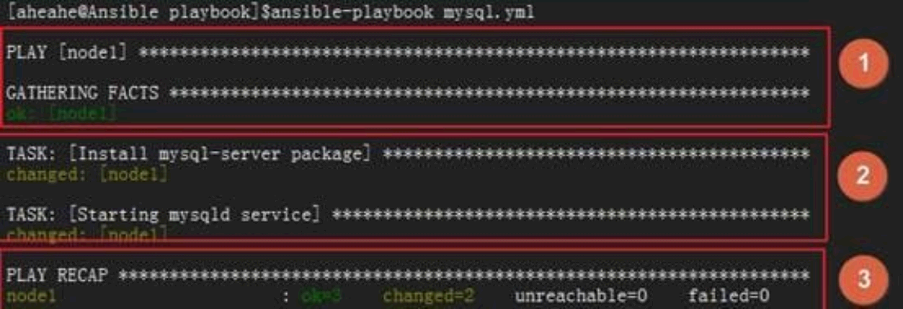

### 核心元素

Playbook的核心元素：

> `Hosts`：主机组；
>
> `Tasks`：任务列表；
>
> `Variables`：变量，设置方式有四种；
>
> `Templates`：包含了模板语法的文本文件；
>
> `Handlers`：由特定条件触发的任务；

### 基本组件

　Playbooks配置文件的基础组件：

> `Hosts`：运行指定任务的目标主机
>
> `remoute_user`：在远程主机上执行任务的用户；
>
> `sudo_user`：
>
> `tasks`：任务列表
>
> > tasks格式
> >
> > – name: TASK_NAME
> >
> > ​    module: arguments
> >
> > ​    notify: HANDLER_NAME
> >
> >handlers:
> >
> >​    – name: HANDLER_NAME
> >
> >​    module: arguments
>
> `模块，模块参数`：
>
> > 格式：
> >　(1) action: module arguments
> >　(2) module: arguments
> >　注意：shell和command模块后面直接跟命令，而非key=value类的参数列表；
>
> `handlers`：任务，在特定条件下触发；接收到其它任务的通知时被触发；

(1) 某任务的状态在运行后为changed时，可通过“notify”通知给相应的handlers；

(2) 任务可以通过“tags“打标签，而后可在ansible-playbook命令上使用-t指定进行调用；

#### ① 定义 playbook

前提：本机配置好 nginx.conf 模板

**目录结构**

```
[root@admin ansible]# tree nginx/
nginx/
├── conf
│   └── nginx.conf
├── conf.d
│   ├── ry.conf
│   └── time.txt
├── html
│   ├── 404.html
│   ├── 50x.html
│   ├── dist
│   │   ├── assets
│   │   │   ├── 401.386cda99.js
│   │   │   └── zip.f12aeb4c.svg
│   │   ├── favicon.ico
│   │   └── index.html
│   └── index.html
└── logs
```

**nginx.conf**

```yaml
#user nginx;

#工作线程数等同cpu数
worker_processes 1; 

error_log /etc/nginx/logs/error.log;
pid /run/nginx.pid;

events {
    worker_connections 1024;
}
http {
    server_tokens off;
    include       mime.types;
    default_type  application/octet-stream;
    
    log_format  mylog '{"date_time": "$year-$month-$day $hour:$minutes:$seconds",'
                      '"host": "$server_addr",'
                      '"client_ip": "$remote_addr",'
                      '"client_id": "$remote_user",'
                      '"url": "$request_uri",'
                      '"request": "$request",'
                      '"referer": "$http_referer",'
                      '"request_time": "$request_time",'
                      '"status": "$status",'
                      '"size": "$body_bytes_sent",'
                      '"info": "$http_user_agent",'
                      '"x_forwarded_for": "$http_x_forwarded_for"'
                      '}';
                      
    sendfile        on;
   #tcp_nopush     on;
   keepalive_timeout  65;
  
   client_max_body_size 50m;
   client_body_buffer_size 256k;
   client_header_timeout 3m;
   client_body_timeout 3m;
   proxy_connect_timeout 300s;
   proxy_read_timeout 300s;
   proxy_send_timeout 300s;
   proxy_buffer_size 64k;
   proxy_buffers 4 32k;
   proxy_busy_buffers_size 64k;
   proxy_temp_file_write_size 64k;
   proxy_ignore_client_abort on;
   proxy_set_header Host $host;
   proxy_set_header X-Forwarder-For $remote_addr;

    gzip  on;
    
    include /etc/nginx/conf.d/*.conf;

}
```

**ry.conf**

```
    server {
        listen       80;
        server_name  localhost;
        charset utf-8;
        #access_log  logs/host.access.log  main;
        
        location / {
            root   /etc/nginx/html;
            index  index.html index.htm;
        }
        
        error_page 404 /404.html;
        
        error_page 500 502 503 504 /50x.html;
        location = /50x.html {
            root   /etc/nginx/html;
        }
    }
    
#server {
#    listen       80;
#    server_name  www.ry8.cn;
#    charset utf-8;
#    include /etc/nginx/conf.d/time.txt;
#    access_log  /etc/nginx/logs/ry.log  mylog;

#    location / {
#        root  /etc/nginx/html/dist/;
#        index index.html index.htm;
#        try_files $uri $uri/ /index.html;
#    }
#}
```

**ansible -> hosts**

> [web]
>
> 192.168.0.[8:10]

**playbook**

`vim /etc/ansible/playbook/i-nginx.yml`

```yaml
---
- hosts: web
  remote_user: root
  tasks:
    - name: install nginx
      yum: name=nginx state=present
    - name: copy config
      copy: src=/etc/ansible/nginx dest=/etc backup=yes
      notify: restarted nginx service
      tags: restartnginx
    - name: start nginx service
      service: name=nginx state=started enabled=true
      tags: startnginx
 
  handlers:
    - name: restarted nginx service
      service: name=nginx  state=restarted
    - name: reloaded nginx service
      service: name=nginx  state=reloaded
```

#### ② 测试安装 nginx

写完了以后，我们就可以运行了：

> ansible-playbook -C i-nginx.yml

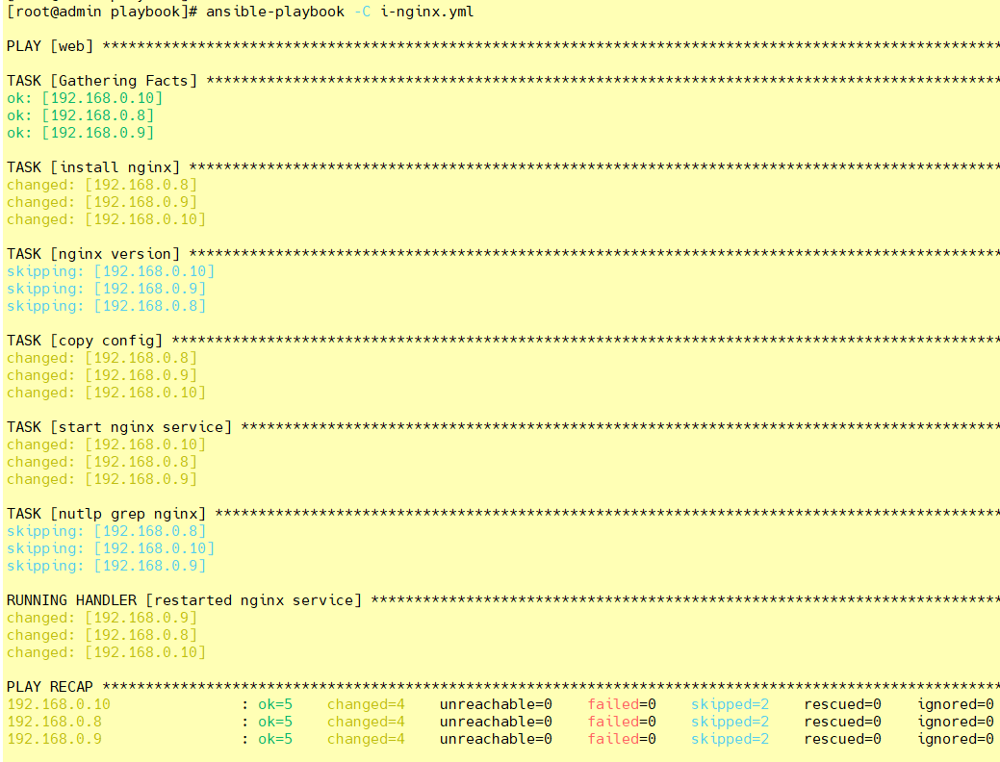

> ansible-playbook i-nginx.yml

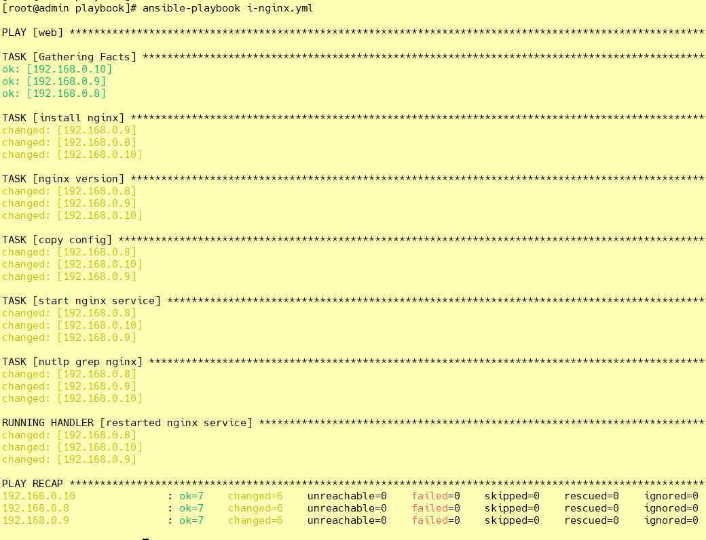

看看两台机器的端口是否开启：

```shell
[root@admin playbook]# ansible web -m shell -a 'ss -nutlp |grep nginx'
192.168.0.9 | CHANGED | rc=0 >>
tcp    LISTEN     0      128       *:80                    *:*                   users:(("nginx",pid=17874,fd=6),("nginx",pid=17873,fd=6),("nginx",pid=17872,fd=6))
tcp    LISTEN     0      128    [::]:80                 [::]:*                   users:(("nginx",pid=17874,fd=7),("nginx",pid=17873,fd=7),("nginx",pid=17872,fd=7))
192.168.0.8 | CHANGED | rc=0 >>
tcp    LISTEN     0      128       *:80                    *:*                   users:(("nginx",pid=22272,fd=6),("nginx",pid=22271,fd=6),("nginx",pid=22270,fd=6))
tcp    LISTEN     0      128    [::]:80                 [::]:*                   users:(("nginx",pid=22272,fd=7),("nginx",pid=22271,fd=7),("nginx",pid=22270,fd=7))
192.168.0.10 | CHANGED | rc=0 >>
tcp    LISTEN     0      128       *:80                    *:*                   users:(("nginx",pid=17842,fd=6),("nginx",pid=17841,fd=6),("nginx",pid=17840,fd=6))
tcp    LISTEN     0      128    [::]:80                 [::]:*                   users:(("nginx",pid=17842,fd=7),("nginx",pid=17841,fd=7),("nginx",pid=17840,fd=7))
[root@admin playbook]#
```

#### ③ 测试 start

直接引用标签。但是我们需要先把服务关闭，再来运行剧本并引用标签：

```shell
ansible web -m shell -a 'systemctl stop nginx'
ansible-playbook i-nginx.yml -t startnginx
ansible web -m shell -a 'ss -nutlp |grep nginx'
```

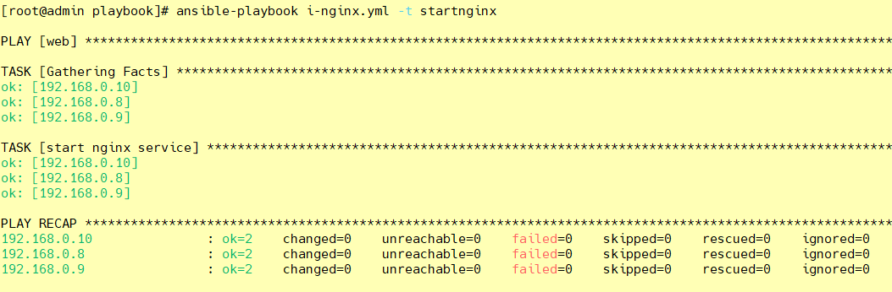

#### ④ 测试 restarted

我们还做了一个`notify`，来测试一下：

首先，它的触发条件是配置文件被改变，所以我们去把配置文件中的端口改一下：

```shell
vim /etc/ansible/nginx/conf.d/ry.conf
 listen       80;
 
ansible-playbook i-nginx.yml -t restartnginx
```

　　然后我们重新加载一下这个剧本：

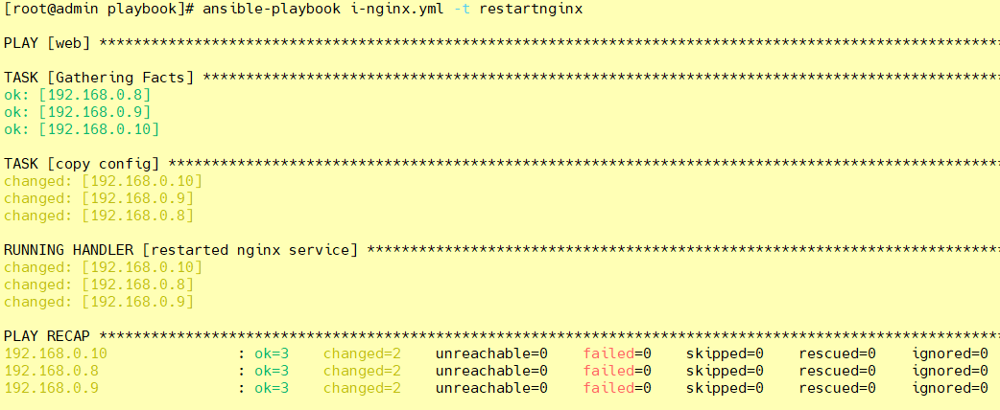

发现我们执行的就是 restart 段以及我们定义的`notify`部分。

我们来看一看我们的端口号：

> ansible web -m shell -a 'ss -ntlp | grep nginx'

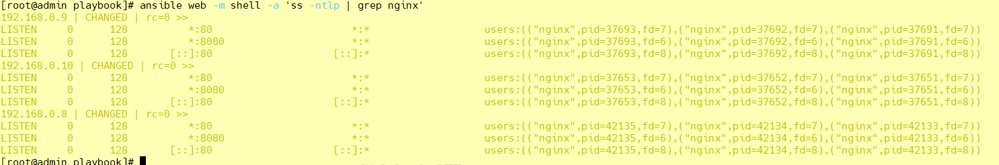

可以看出，我们的nginx端口已经变成了8080。
 　#### ⑤ 测试 reloaded

```yaml
---
- hosts: web
  remote_user: root
  tasks:
    - name: install nginx
      yum: name=nginx state=present
    - name: copy config
      copy: src=/etc/ansible/nginx dest=/etc backup=yes
      notify: reloaded nginx service
      tags: reloadednginx
    - name: start nginx service
      service: name=nginx state=started enabled=true
      tags: startnginx
 
  handlers:
    - name: restarted nginx service
      service: name=nginx  state=restarted
    - name: reloaded nginx service
      service: name=nginx  state=reloaded

```

```shell
vim /etc/ansible/nginx/conf.d/ry.conf
 listen       81;
 
ansible-playbook i-nginx.yml -t reloadednginx
```

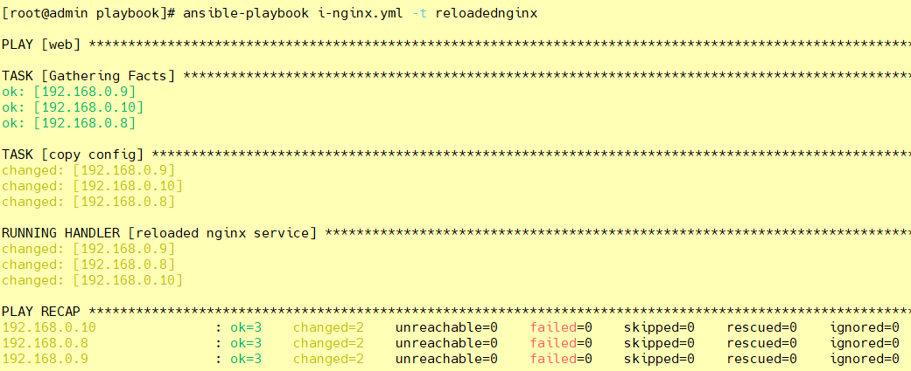

>ansible web -m shell -a 'ss -ntlp | grep nginx'

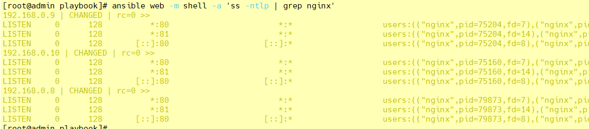

 　#### ⑥ 卸载 nginx

vim uni-nginx.yml

```yaml
---
- hosts: web
  remote_user: root
  tasks:
#    - name: stop nginx service
#      service: name=nginx state=stopped
#      tags: stopnginx
    - name: uninstall nginx
      shell: yum remove -y nginx && rm -rf /etc/nginx && ls /usr/sbin/nginx
```

`ansible-playbook uni-nginx.yml`

### variables 变量

上文中，我们说到了`variables`是变量，有四种定义方法，现在我们就来说说这四种定义方法：

#### ① facts ：可直接调用

上一篇中，我们有说到`setup`这个模块，这个模块就是通过调用facts组件来实现的。我们这里的`variables`也可以直接调用`facts`组件。
 　具体的`facters`我们可以使用`setup`模块来获取，然后直接放入我们的剧本中调用即可。

#### ② 用户自定义变量

我们也可以直接使用用户自定义变量，想要自定义变量有以下两种方式：

> 通过命令行传入

`ansible-playbook`命令的命令行中的`-e VARS, --extra-vars=VARS`，这样就可以直接把自定义的变量传入。

> 在playbook中定义变量

我们也可以直接在playbook中定义我们的变量：

```yaml
---
- hosts: web
  remote_user: root
  vars:
　　- var1: value1
　　- - var2: value2
```

#### ③ 定义剧本

我们就使用全局替换把我们刚刚编辑的文件修改一下：

```shell
[root@admin ansible]# vim /etc/ansible/playbook/i-nginx.yml
```

```yaml
---
- hosts: web
  remote_user: root
  tasks:
    - name: install {{ rpmname }}
      yum: name={{ rpmname }} state=present
    - name: copy config
      copy: src=/etc/ansible/{{ rpmname }} dest=/etc backup=yes
      notify: restarted {{ rpmname }} service
      tags: restart{{ rpmname }}
    - name: start {{ rpmname }} service
      service: name={{ rpmname }} state=started enabled=true
      tags: start{{ rpmname }}
 
  handlers:
    - name: restarted {{ rpmname }} service
      service: name={{ rpmname }}  state=restarted
    - name: reloaded {{ rpmname }} service
      service: name={{ rpmname }}  state=reloaded
```

这样一来，我们的剧本就定义完成了。

#### ④ 拷贝配置文件

我们想要在被监管的机器上安装什么服务的话，就直接在我们的server端上把该服务的配置文件拷贝到我们的`/tmp/`目录下。这样我们的剧本才能正常运行。

我们就以`keepalived`服务为例：

```shell
[root@admin ansible]# cp /etc/ansible/keepalived/keepalived.conf /tmp/keepalived.conf
```

#### ⑤ 运行剧本，变量由命令行传入

```shell
[root@admin ansible]# ansible-playbook i-nginx.yml -e rpmname=keepalived
```

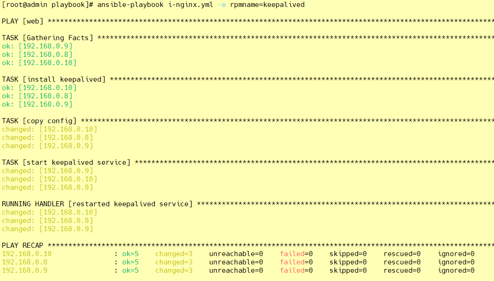

#### ⑥ 修改剧本，直接定义变量

同样的，我们可以直接在剧本中把变量定义好，这样就不需要在通过命令行传入了。以后想要安装不同的服务，直接在剧本里把变量修改一下即可。

```shell
[root@admin ansible]# vim /etc/ansible/playbook/i-nginx.yml
```

```yaml
---
- hosts: web
  remote_user: root
  vars: 
    - rpmname: keepalived
  tasks:
    - name: install {{ rpmname }}
      yum: name={{ rpmname }} state=present
    - name: copy config
      copy: src=/etc/ansible/{{ rpmname }} dest=/etc backup=yes
      notify: restarted {{ rpmname }} service
      tags: restart{{ rpmname }}
    - name: start {{ rpmname }} service
      service: name={{ rpmname }} state=started enabled=true
      tags: start{{ rpmname }}
 
  handlers:
    - name: restarted {{ rpmname }} service
      service: name={{ rpmname }}  state=restarted
    - name: reloaded {{ rpmname }} service
      service: name={{ rpmname }}  state=reloaded
```

#### ⑦ 运行定义过变量的剧本

我们刚刚已经把变量定义在剧本里面了。现在我们来运行一下试试看：

```shell
[root@admin ansible]# ansible-playbook i-nginx.yml
```

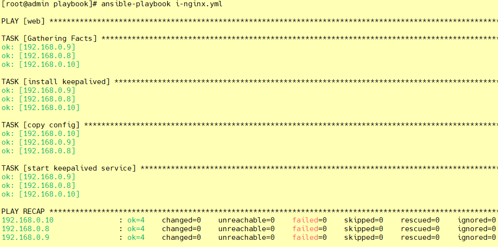

发现这样也是可以的

#### ⑧ 通过roles传递变量

具体的，我们下文中说到 roles 的时候再详细说明。这里是[传送带](https://www.cnblogs.com/keerya/p/8004566.html#jump)

#### ⑨  Host Inventory

我们也可以直接在主机清单中定义。

> 向不同的主机传递不同的变量：

```ABAP
IP/HOSTNAME varaiable=value var2=value2
```

> 向组中的主机传递相同的变量：

```ini
[web:vars]
variable=value
```

### templates 模板

模板是一个文本文件，嵌套有脚本（使用模板编程语言编写）。

`Jinja2`：Jinja2是python的一种模板语言，以Django的模板语言为原本。
 模板支持：

```shell
>字符串：使用单引号或双引号；
>数字：整数，浮点数；
>列表：[item1, item2, ...]
>元组：(item1, item2, ...)
>字典：{key1:value1, key2:value2, ...}
>布尔型：true/false
>算术运算： +, -, *, /, //, %, **
>比较操作： ==, !=, >, >=, <, <=
>逻辑运算： and, or, not
```

通常来说，模板都是通过引用变量来运用的。

#### ① 定义模板

我们直接把之前定义的`/tmp/nginx.conf`改个名，然后编辑一下，就可以定义成我们的模板文件了：

```perl
cd /templates
vim ./nginx/conf/nginx.conf.j2 || vim ./nginx/conf.d/ry.conf.j2
 worker_processes  {{ ansible_processor_vcpus }};
 listen       {{ nginxport }};
```

#### ② 修改剧本

我们现在需要去修改剧本来定义变量：

```shell
[root@admin ansible]# vim /etc/ansible/playbook/i-nginx.yml
```

```yaml
---
- hosts: web
  remote_user: root
  vars: 
    - rpmname: nginx
      nginxport: 8888
      ansible_processor_vcpus: 1
  tasks:
    - name: install {{ rpmname }}
      yum: name={{ rpmname }} state=present
    - name: copy config
      copy: src=/etc/ansible/templates/{{ rpmname }} dest=/etc backup=yes
      notify: restarted {{ rpmname }} service
      tags: restart{{ rpmname }}
    - name: start {{ rpmname }} service
      service: name={{ rpmname }} state=started enabled=true
      tags: start{{ rpmname }}
 
  handlers:
    - name: restarted {{ rpmname }} service
      service: name={{ rpmname }}  state=restarted
    - name: reloaded {{ rpmname }} service
      service: name={{ rpmname }}  state=reloaded
```

#### ③ 运行剧本

上面的准备工作完成后，我们就可以去运行剧本了：

```shell
ansible-playbook i-nginx.yml
ansible-playbook i-nginx.yml -t restartnginx
ansible web -m shell -a 'ss -ntlp | grep nginx'
```

### 条件测试

when语句：在task中使用，jinja2的语法格式。

```vhdl
tasks:
  - name: install conf file to centos7
    template: src=files/nginx.conf.c7.j2
    when: ansible_distribution_major_version == "7"
  - name: install conf file to centos6
    template: src=files/nginx.conf.c6.j2
    when: ansible_distribution_major_version == "6"
```

### 循环

迭代，需要重复执行的任务；

对迭代项的引用，固定变量名为"item"，而后，要在task中使用with_items给定要迭代的元素列表；
 举例如下：

```yaml
  tasks:
    - name: unstall web packages
      yum: name={{ item }} state=absent
      with_items:
        - httpd
        - php
        - php-mysql
```

### 字典

ansible playbook 还支持字典功能。举例如下：

```yaml
    - name: install some packages
      yum: name={{ item }} state=present
      with_items:
        - nginx
        - memcached
        - php-fpm
    - name: add some groups
      group: name={{ item }} state=present
      with_items:
        - group11
        - group12
        - group13
    - name: add some users
      user: name={{ item.name }} group={{ item.group }} state=present
      with_items:
        - { name: 'user11', group: 'group11' }
        - { name: 'user12', group: 'group12' }
        - { name: 'user13', group: 'group13' }
```

## 角色订制 roles 以 nginx 为例

### ① 简介

对于以上所有的方式有个弊端就是无法实现复用假设在同时部署Web、db、ha 时或不同服务器组合不同的应用就需要写多个yml文件。很难实现灵活的调用。

roles 用于层次性、结构化地组织playbook。roles 能够根据层次型结构自动装载变量文件、tasks以及handlers等。

要使用roles只需要在playbook中使用include指令即可。简单来讲，roles就是通过分别将变量(vars)、文件(file)、任务(tasks)、模块(modules)及处理器(handlers)放置于单独的目录中，并可以便捷地include它们的一种机制。

角色一般用于基于主机构建服务的场景中，但也可以是用于构建守护进程等场景中。

### ② 目录说明

**xxx模块下面的每个目录至少应该有一个名为main.yml的文件，其它的文件需要由main.yml进行“包含”调用；**

```tex
[root@admin roles]# tree
.
├── xxx模块
│   ├── default  # 用于设定默认变量；变量的优先级是最低的
│   ├── files  # 存储由 copy 或 script 等模块调用的文件；
│   ├── handlers # 用于定义各 handler 处理器；
│   ├── meta  # 定义当前角色的特殊设定及其依赖关系；比如 作者信息、角色主要作用等等
│   ├── tasks  # 用于定义各 task;
│   ├── templates # 模板文本；
│   └── vars  # 用于定义各 variable 变量，变量的优先级非常高
| ......
```

**tasks目录**：角色需要执行的主任务文件放置在此目录中，默认的主任务文件名为main.yml，当调用角色时，默认会执行main.yml文件中的任务，你也可以将其他需要执行的任务文件通过include的方式包含在tasks/main.yml文件中。

**handlers目录**：当角色需要调用handlers时，默认会在此目录中的main.yml文件中查找对应的handler

**defaults目录**：角色会使用到的变量可以写入到此目录中的main.yml文件中，通常，defaults/main.yml文件中的变量都用于设置默认值，以便在你没有设置对应变量值时，变量有默认的值可以使用，定义在defaults/main.yml文件中的变量的优先级是最低的。

**vars目录**：角色会使用到的变量可以写入到此目录中的main.yml文件中，看到这里你肯定会有疑问，vars/main.yml文件和defaults/main.yml文件的区别在哪里呢？区别就是，defaults/main.yml文件中的变量的优先级是最低的，而vars/main.yml文件中的变量的优先级非常高，如果你只是想提供一个默认的配置，那么你可以把对应的变量定义在defaults/main.yml中，如果你想要确保别人在调用角色时，使用的值就是你指定的值，则可以将变量定义在vars/main.yml中，因为定义在vars/main.yml文件中的变量的优先级非常高，所以其值比较难以覆盖。

**meta目录**：如果你想要赋予这个角色一些元数据，则可以将元数据写入到meta/main.yml文件中，这些元数据用于描述角色的相关属性，比如  作者信息、角色主要作用等等，你也可以在meta/main.yml文件中定义这个角色依赖于哪些其他角色，或者改变角色的默认调用设定，在之后会有一些实际的示例，此处不用纠结。

**templates目录**： 角色相关的模板文件可以放置在此目录中，当使用角色相关的模板时，如果没有指定路径，会默认从此目录中查找对应名称的模板文件。

**files目录**：角色可能会用到的一些其他文件可以放置在此目录中，比如，当你定义nginx角色时，需要配置https，那么相关的证书文件即可放置在此目录中。

### ③ 在`roles`目录下生成对应的目录结构

```shell
[root@admin ansible]# cd roles/
[root@admin roles]# ls

[root@admin roles]# mkdir -pv ./{nginx,mysql,httpd}/{files,templates,vars,tasks,handlers,meta,default}

[root@admin roles]# touch ./{nginx,mysql,httpd}/{files,templates,vars,tasks,handlers,meta,default}/main.yml

[root@admin roles]# tree
.
├── httpd
|   ...
└── nginx
    ├── default
    │   └── main.yml
    ├── files
    │   └── main.yml
    ├── handlers
    │   └── main.yml
    ├── meta
    │   └── main.yml
    ├── tasks
    │   └── main.yml
    ├── templates
    │   └── main.yml
    └── vars
        └── main.yml
```

**可以使用 ansible-galaxy role init xxx 来实现目录的自动创建，结构跟上面一样**

### 准备 nginx.conf.j2 配置文件

```yaml

user nginx;

worker_processes {{ ansible_processor_vcpus }};

error_log /var/log/nginx/error.log;
pid /run/nginx.pid;

include /usr/share/nginx/modules/*.conf;

events {
    worker_connections 1024;
}

http {
    log_format  main  '$remote_addr - $remote_user [$time_local] "$request" '
                      '$status $body_bytes_sent "$http_referer" '
                      '"$http_user_agent" "$http_x_forwarded_for"';
                      
                      
    access_log  /var/log/nginx/access.log  main;

    sendfile            on;
    tcp_nopush          on;
    tcp_nodelay         on;
    keepalive_timeout   65;
    types_hash_max_size 4096;

    include             /etc/nginx/mime.types;
    default_type        application/octet-stream;

    include /etc/nginx/conf.d/*.conf;

    server {
        listen       {{ nginxprot }};
        listen       [::]:{{ nginxprot }};
        server_name  localhost;
        
        root         /usr/share/nginx/html;
        
        location / {
           root   /usr/share/nginx/html;
           index  index.html index.htm;
        }
        
        error_page 404 /404.html;
        location = /404.html {
        }

        error_page 500 502 503 504 /50x.html;
        location = /50x.html {
        }
    }

}
```

### ④ 定义 tasks 任务文件

rpm包下载：

> wget <http://nginx.org/packages/centos/7/x86_64/RPMS/nginx-1.22.0-1.el7.ngx.x86_64.rpm>
>
> chmod -R 777 nginx-1.22.0-1.el7.ngx.x86_64.rpm

**vim /etc/ansible/roles/nginx/tasks/main.yml**

```yaml
---
- include: install.yml
- include: copy.yml
- include: start.yml
```

**install.yml**

```yaml
---
- name: install nginx
  yum: name=nginx state=present
```

**copy.yml**

```yaml
---
- name: copy config
  template: src=/etc/ansible/roles/nginx/templates/nginx.conf.j2 dest=/etc/nginx/nginx.conf mode=0777
  # notify: restarted、reloaded 这里对应的触发是 handlers 处理器
  notify: restarted nginx service
  # tags: restartnginx、reloadnginx
  tags: restartnginx
```

**start.yml**

```yaml
---
- name: start nginx service
  service: name=nginx state=started enabled=true
  tags: startnginx
```

**stop.yml**

```yaml
---
- hosts: web
  remote_user: root
  tasks:
    - name: stop nginx service
      service: name=nginx state=stopped
      tags: stopnginx
```

> ansible-playbook ./nginx/tasks/stop.yml
>
> ansible-playbook nginx.yml -t startnginx

**uninstall.yml**

```yaml
---
- hosts: web
  remote_user: root
  tasks:
    - name: uninstall nginx
      shell: yum remove -y nginx && rm -rf /etc/nginx && ls /usr/sbin/nginx && ls /etc/nginx
      tags: uninstallnginx
```

> ansible-playbook ./nginx/tasks/uninstall.yml

### ⑤ 放置我们所需要的文件到指定目录

因为我们定义的角色已经有了新的组成方式，所以我们需要把文件都放到指定的位置，这样，才能让配置文件找到这些并进行加载。

```shell
[root@admin nginx]# tree
├── default
│   └── main.yml
├── files
│   ├── main.yml
│   └── nginx-1.22.0-1.el7.ngx.x86_64.rpm
├── handlers
│   └── main.yml
├── meta
│   └── main.yml
├── tasks
│   ├── copy.yml
│   ├── install.yml
│   ├── main.yml
│   ├── stop.yml
│   ├── uninstall.yml
│   └── start.yml
├── templates
│   ├── default.conf.j2
│   ├── html
│   │   ├── 404.html
│   │   ├── 50x.html
│   │   └── index.html
│   ├── logs
│   ├── main.yml
│   ├── nginx.conf.j2
│   └── time.txt
└── vars
    └── main.yml
```

### ⑥ 定义 vars 变量文件

我们在模板中定义的变量，也要去配置文件中加上：

```shell
[root@admin nginx]# vim ./vars/main.yml
---
nginxprot: 5120
ansible_processor_vcpus: 1
```

### ⑦ 定义 handlers 文件

我们在配置文件中定义了`notify`，所以我么也需要定义`handlers`，我们来修改配置文件：

```shell
[root@admin nginx]# vim ./handlers/main.yml
---
- name: restarted nginx service
  service: name=nginx state=restarted
- name: reloaded nginx service
  service: name=nginx state=reloaded

```

### ⑧ 定义 nginx 剧本文件

接下来，我们就来定义剧本文件，由于大部分设置我们都单独配置在了roles里面，所以，接下来剧本就只需要写一点点内容即可：

```yaml
[root@admin roles]# vim ./nginx.yml
---
- hosts: web
  remote_user: root
  roles:
    - nginx

```

### ⑨ 启动服务

剧本定义完成以后，我们就可以来启动服务了：

```shell
[root@admin roles]# ansible-playbook nginx.yml
```

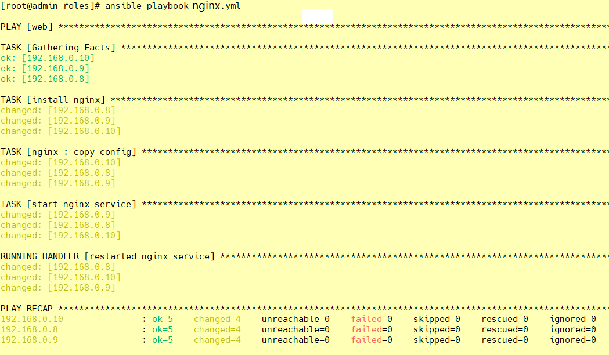

### ⑩ 启动过后照例查看端口号

```shell
[root@admin roles]# ansible web -m shell -a "ss -ntulp |grep 5120"

[root@admin roles]# ansible web -m shell -a "ss -ntulp |grep nginx"
```

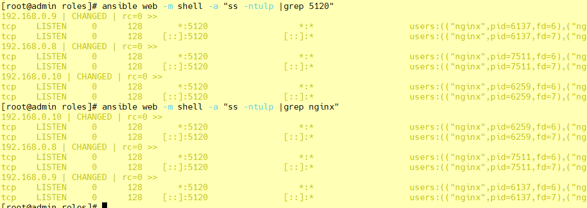

```shell
[root@admin roles]# ansible web -m shell -a 'curl http://127.0.0.1:5120/'

[WARNING]: Consider using the get_url or uri module rather than running 'curl'.  If you need to use command because
get_url or uri is insufficient you can add 'warn: false' to this command task or set 'command_warnings=False' in
ansible.cfg to get rid of this message.

192.168.0.8 | CHANGED | rc=0 >>
<!DOCTYPE HTML PUBLIC "-//W3C//DTD HTML 4.01 Transitional//EN">
<html>
<head>
  <title>Welcome to CentOS</title>
  <style rel="stylesheet" type="text/css">

192.168.0.10 | CHANGED | rc=0 >>
<!DOCTYPE HTML PUBLIC "-//W3C//DTD HTML 4.01 Transitional//EN">
<html>
<head>
  <title>Welcome to CentOS</title>
  ......
```

### 11 测试修改后重新加载配置文件 - restartnginx

```shell
[root@admin nginx]# vim ./vars/main.yml

nginxprot: 5133

[root@admin nginx]# vim ./tasks/copy.yml
- name: copy config
  template: src=/etc/ansible/roles/nginx/templates/nginx.conf.j2 dest=/etc/nginx/nginx.conf mode=0777
  notify: restarted nginx service
  tags: restartnginx

[root@admin roles]# ansible-playbook nginx.yml -t restartnginx
```

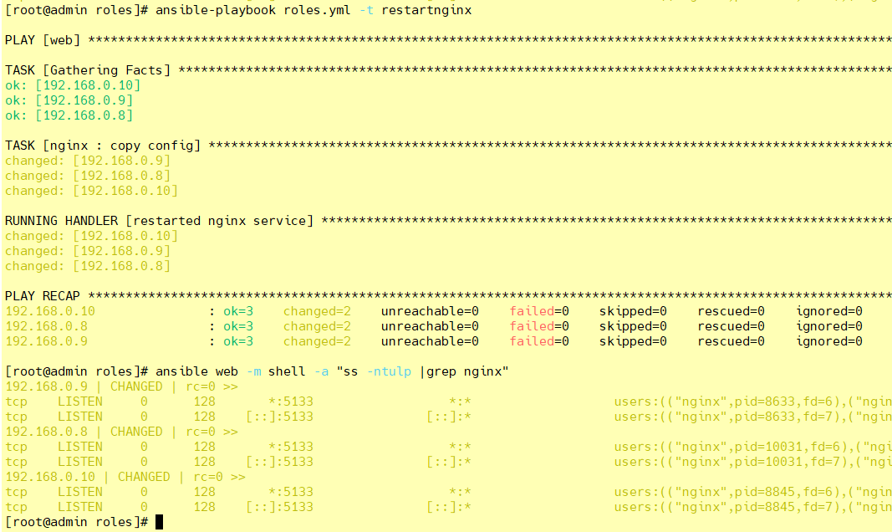

### 12 测试修改后重新加载配置文件 - reloadnginx

```shell
[root@admin nginx]# vim ./vars/main.yml

nginxprot: 5166

[root@admin nginx]# vim ./tasks/copy.yml
- name: copy config
  template: src=/etc/ansible/roles/nginx/templates/nginx.conf.j2 dest=/etc/nginx/nginx.conf mode=0777
  notify: reloaded nginx service
  tags: reloadnginx

[root@admin roles]# ansible-playbook nginx.yml -t reloadnginx
```

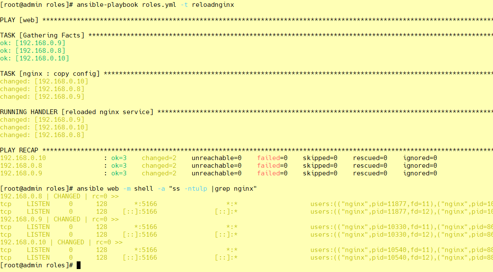
